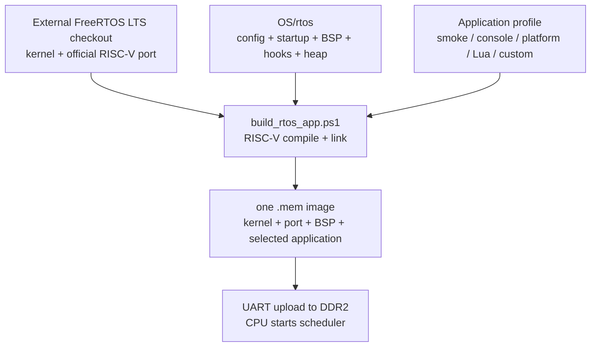

# Active FreeRTOS Software Tree

This tree is the active FreeRTOS software path for the RV32 core. Start with
the [FreeRTOS documentation index](../../docs/04-freertos/README.md) for the
architecture, port, tick, context-switch, memory, and API guides.

It intentionally keeps only the project-specific pieces:

- `config/FreeRTOSConfig.h`
- `src/startup.S`
- `src/main.c`
- `src/uart.c`
- `src/freertos_hooks.c`
- `src/rtos_heap.c`
- `src/minilibc.c`
- `src/main_platform.c`
- `src/main_lua.c`
- `src/lua_rtos_config.h`
- `src/lua_rtos_port.c`
- `src/lua_rtos_libs.c`
- `src/lua_script_protocol.c`
- `link_ddr.ld`



這個資料夾不是一份可獨立使用的 FreeRTOS kernel checkout；建置時會把外部 kernel、這裡的板級程式與一個 application profile 一起連結成單一 `.mem`。

The FreeRTOS kernel and official RISC-V port come from an external LTS
checkout. Pass its location through the build tools' `-FreeRTOSRoot`
parameter; do not depend on one developer's absolute path.

Build:

```powershell
powershell -ExecutionPolicy Bypass -File tools\build_rtos_smoke.ps1
```

Simulation smoke test:

```powershell
powershell -ExecutionPolicy Bypass -File tools\run_rtos_smoke_sim.ps1
```

Full platform self-test:

```powershell
powershell -ExecutionPolicy Bypass -File tools\run_rtos_platform_sim.ps1
powershell -ExecutionPolicy Bypass -File tools\run_rtos_app.ps1 -Port COM5 -App platform
```

Hardware performance analysis (RTOS Console):

```powershell
powershell -ExecutionPolicy Bypass -File tools\run_rtos_app.ps1 -Port COM5 -App console
```

Then enter `perf test 100000`, or measure an arbitrary interval with
`perf reset`, the desired commands, and `perf stop`. The 24 x 64-bit MMIO
counter ABI and C API are documented in
[PERFORMANCE_COUNTER_REGISTERS.md](../../docs/02-memory-io/PERFORMANCE_COUNTER_REGISTERS.md)
and [PERFORMANCE_MONITORING_ARCHITECTURE.md](../../docs/02-memory-io/PERFORMANCE_MONITORING_ARCHITECTURE.md).

Lua 5.4.8 REPL:

```powershell
powershell -ExecutionPolicy Bypass -File tools\run_rtos_lua_sim.ps1
powershell -ExecutionPolicy Bypass -File tools\run_rtos_app.ps1 -Port COM5 -App lua
python tools\rtos_lua_probe.py --port COM5
python tools\run_lua_script.py --port COM5 --file lua_apps\hello.lua
python tools\run_lua_script.py --port COM5 --file lua_apps\guess_number.lua --interactive --timeout-ms 600000 --instruction-limit 5000000
python tools\rtos_lua_script_probe.py --port COM5 --large-bytes 65536
python tools\rtos_lua_game_probe.py --port COM5
```

The Lua profile uses the vendored source in `third_party/lua-5.4.8` and opens
an interrupt-driven UART REPL and multiline script service after the built-in
language/RTOS self-test passes. Scripts are CRC checked and protected by stop,
timeout and instruction limits. Interactive scripts can use `rtos.read_line()`;
the RX task delivers terminal lines through a dedicated FreeRTOS queue.
See [LUA_ARCHITECTURE.md](../../docs/05-applications/LUA_ARCHITECTURE.md),
[LUA_FREERTOS_BRIDGE.md](../../docs/05-applications/LUA_FREERTOS_BRIDGE.md), and
[LUA_SCRIPT_UPLOAD.md](../../docs/05-applications/LUA_SCRIPT_UPLOAD.md) for the
supported libraries, RTOS bridge, upload protocol, and limits.

Expected UART markers:

```text
[RTOS] boot
[RTOS] scheduler
[RTOS] task=A start
[RTOS] task=B start
[RTOS] tick=... task=A queue=send ...
[RTOS] tick=... task=B queue=recv ...
RTOS_SMOKE_PASS
```
