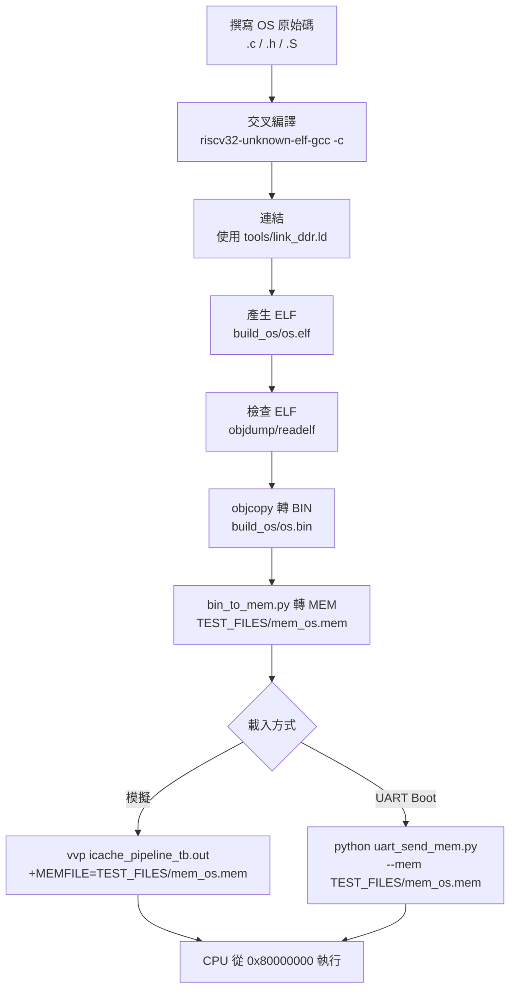

# C 作業系統編譯與上板前驗證操作報告

## 1. 目的

本報告說明如何在本專案中，將一個 `.c` 作業系統程式編譯為 RV32I 機器碼，並轉成可供模擬或 UART 載入的 `.mem` 檔案。

本報告同時提供：
- 完整流程圖
- 實際可用指令
- 檔案位置對照
- `Makefile` 使用方式

## 2. 什麼是 Makefile

`Makefile` 是建置流程腳本。  
你可以把「編譯、連結、轉檔」多步驟指令寫成規則，之後只要執行 `make` 就能自動完成整個流程。

本專案已新增：
- `Makefile`（位於專案根目錄：`c:\cpu_design\Makefile`）

## 3. 完整流程圖



## 4. 需要的檔案與位置

- 你的 C 程式（假設）：`OS/main.c`
- 啟動碼：`tools/crt0.S`
- Linker script：`tools/link_ddr.ld`
- BIN 轉 MEM：`tools/bin_to_mem.py`
- UART 下載工具：`uart_send_mem.py`
- 主模擬 TB：`icache_pipeline_tb.v`
- Makefile：`Makefile`

輸出檔案（預設）：
- `build_os/os.elf`
- `build_os/os.bin`
- `build_os/os.map`
- `build_os/os.dis`（若執行 `make disasm`）
- `TEST_FILES/mem_os.mem`

## 5. Makefile 操作方式

在專案根目錄執行：

### 5.1 基本建置

```powershell
make
```

等價於：

```powershell
make mem
```

會產生：
- `TEST_FILES/mem_os.mem`

### 5.2 常用目標

```powershell
make help
make print-config
make elf
make bin
make mem
make disasm
make run-sim
make clean
```

### 5.3 參數覆寫範例

如果你的 C 檔不是 `OS/main.c`：

```powershell
make SRC=OS/my_kernel.c OUT_NAME=my_kernel MEM_OUT=TEST_FILES/mem_my_kernel.mem
```

### 5.4 完整使用範例（可直接照做）

先建立一個最小可驗證的 `OS/main.c`：

```c
// OS/main.c
int main(void) {
    return 17;
}
```

然後執行：

```powershell
make clean
make print-config
make
make disasm
make run-sim
```

說明：
- `make clean`：刪除舊產物（`build_os/` 與輸出的 `.mem`）
- `make print-config`：顯示目前參數（`SRC`、`OUT_NAME`、`MEM_OUT`）
- `make`：預設 target=`all`，會一路做到 `mem`
- `make disasm`：額外輸出反組譯檔
- `make run-sim`：用 `vvp` 跑主 TB，帶入 `mem_os.mem`

此範例對應：
- `main()` 回傳值會放進 `a0`
- `tools/crt0.S` 會把 `a0` 複製到 `x8`
- `Makefile` 的 `run-sim` 預設用 `+EXPECT_RD=8 +EXPECT_VAL=00000011` 做比對

如果你的程式最終值不是 17，直接覆寫：

```powershell
make run-sim SIM_EXPECT_RD=8 SIM_EXPECT_VAL=12345678
```

### 5.5 你現在的標準流程（建議照這個做）

1. 把你的 `.c` 檔放到 `OS/`
   - 預設檔名建議：`OS/main.c`
2. 切換到專案根目錄（`Makefile` 在這裡）

```powershell
cd c:\cpu_design
```

3. 執行建置與模擬

```powershell
make
make run-sim
```

4. 看輸出位置
   - 編譯輸出：`build_os/`
   - 最終記憶體檔：`TEST_FILES/mem_os.mem`

補充：若你的檔名不是 `OS/main.c`，請覆寫 `SRC`：

```powershell
cd c:\cpu_design
make SRC=OS/my_kernel.c OUT_NAME=my_kernel MEM_OUT=TEST_FILES/mem_my_kernel.mem
make run-sim MEM_OUT=TEST_FILES/mem_my_kernel.mem
```

## 6. 不用 Makefile 的手動指令（對照）

```powershell
New-Item -ItemType Directory -Force build_os | Out-Null

riscv32-unknown-elf-gcc -march=rv32i -mabi=ilp32 -ffreestanding -nostdlib -O2 -Wall -Wextra -c tools/crt0.S -o build_os/crt0.o
riscv32-unknown-elf-gcc -march=rv32i -mabi=ilp32 -ffreestanding -nostdlib -O2 -Wall -Wextra -c OS/main.c -o build_os/main.o

riscv32-unknown-elf-gcc -march=rv32i -mabi=ilp32 -nostdlib -Wl,-T,tools/link_ddr.ld -Wl,-Map,build_os/os.map -o build_os/os.elf build_os/crt0.o build_os/main.o

riscv32-unknown-elf-objcopy -O binary build_os/os.elf build_os/os.bin

python tools/bin_to_mem.py build_os/os.bin TEST_FILES/mem_os.mem
```

## 7. 與現有模擬流程整合

### 7.1 先編譯主 TB（僅需一次或 RTL 更新後重編）

```powershell
iverilog -g2005-sv -o icache_pipeline_tb.out icache_pipeline_tb.v icache_pipeline_top.v icache_top.v icache.v IF.v IFID_register.v ID.v IDEX_register.v EX.v EXMEM_register.v MEM.v MEMWB_register.v WB.v hazard_unit.v forward_unit.v dcache.v L2_cache.v I_D_arbitration.v branch_predictor.v uart_rx.v uart_bootloader.v MIG_DDR2_interface.v
```

### 7.2 用新產生的 MEM 跑模擬

```powershell
vvp icache_pipeline_tb.out +TEST=0 +MEMFILE=TEST_FILES/mem_os.mem +ASSERT_EN=1 +MAXCYCLES=500000 +EXPECT_RD=8 +EXPECT_VAL=00000011
```

或直接：

```powershell
make run-sim
```

## 8. 常見錯誤與排除

### 8.1 `Unknown module type: branch_predictor`

原因：編譯 RTL 時漏掉 `branch_predictor.v`。  
處理：補進 `iverilog` source list。

### 8.2 找不到工具鏈

症狀：`riscv32-unknown-elf-gcc` 或 `objcopy` 不存在。  
處理：確認工具鏈安裝並加入 PATH，或調整 `TC_PREFIX`。

### 8.3 模擬 timeout

原因：程式未在預期 cycle 內到達結束條件。  
處理：增加 `+MAXCYCLES`，先確認程式是否正常跑到目標位址與狀態。

### 8.4 `make 尚未安裝` 是什麼意思

意思是：系統找不到 `make` 這個可執行檔（通常是沒有安裝 GNU Make，或安裝了但不在 PATH）。

症狀：

```powershell
make : The term 'make' is not recognized ...
```

先檢查：

```powershell
make --version
```

若失敗，Windows 常見解法：

1. 安裝 Chocolatey 後：

```powershell
choco install make
```

2. 安裝 Scoop 後：

```powershell
scoop install make
```

3. 使用 MSYS2 / Git Bash / WSL 內建套件管理安裝 `make`

若你暫時不想安裝 `make`，仍可用：
- 本報告第 6 節「手動指令」
- 或 `tools/build_mem_from_c.ps1`（單一 C 檔快速路徑）

## 9. 建議操作順序

1. 放入你的 C 檔（例如 `OS/main.c`）
2. 執行 `make` 產生 `TEST_FILES/mem_os.mem`
3. 執行 `make run-sim`（或手動 `vvp ... +MEMFILE=...`）
4. 驗證通過後，再進一步走 FPGA 上板流程
