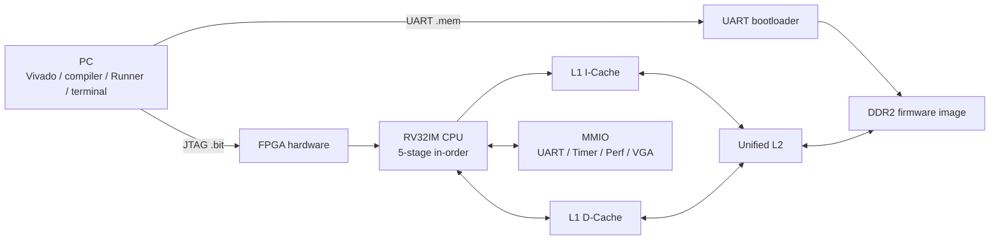

# CPU 設計專案（RV32I + I$/D$ + L2 + DDR2 MIG）

本專案目前主線是整合式 5-stage RV32I CPU，包含：
- L1 I-Cache：`icache.v`（由 `icache_top.v` 包裝）
- L1 D-Cache：`dcache.v`
- Unified L2 + I/D 仲裁：`L2_cache.v`、`I_D_arbitration.v`
- DDR2 MIG 路徑與 UART boot：`icache_pipeline_top.v`
- 板級整合：`board_top.v`
- 內部時鐘橋接：`clock_bridge.v`

目前也已加入 FreeRTOS bring-up 與 VGA demo，可在板上展示 task scheduling、timer tick、context switch、queue IPC 與 VGA MMIO 更新。

第一次閱讀或交接請先開啟 [`docs/README.md`](docs/README.md)。它用分層圖、資料夾地圖與角色路線說明哪些文件需要讀、哪些可以跳過。

要直接上板則閱讀 [`docs/00-overview/BOARD_OPERATION_GUIDE.md`](docs/00-overview/BOARD_OPERATION_GUIDE.md)。該文件集中說明 bitstream、`.mem`、Monitor／`Ctrl+C`、application切換、Probe、Lua與VGA的執行時機。



圖中 JTAG 傳的是硬體配置，UART 傳的是 CPU 要執行的 firmware；兩條路徑最後在 FPGA 上會合，但用途不同。

## 1. 目前主線架構

主要維護與驗證路徑：
- Top：`board_top.v`
- Core top：`icache_pipeline_top.v`
- 主測試平台：`icache_pipeline_tb.v`
- 分支重導場景測試：`bp_redirect_scenarios_tb.v`
- UART MMIO 專用測試：`uart_mmio_tb.v`

## 2. 記憶體與外設

- DDR2：由 MIG (`mig`) 提供外部記憶體介面
- UART：
  - `uart_rx_i`：板載 USB-UART 橋接器送入 FPGA
  - `uart_tx_o`：FPGA 輸出到板載 USB-UART 橋接器
- MMIO：
  - `0x4000_0000`：UART TX data
  - `0x4000_0004`：UART TX status
  - `0x4000_0008`：UART RX data
  - `0x4000_000C`：UART RX status
- RTOS timer：
  - `0x4000_0020`：mtime
  - `0x4000_0028`：mtimecmp
- 效能計數器：
  - `0x4000_0100`：ID / INFO / CONTROL / STATUS
  - `0x4000_0110..0x4000_01CC`：24 組 64-bit pipeline/cache/DDR/trap counters
  - 支援 clear、start/stop、原子 snapshot 與 RTOS Console 即時分析
- VGA framebuffer：
  - `0x5000_0000`：VGA framebuffer base
  - `0x5000_7FFC`：VGA control

## 3. 時鐘架構（目前）

目前板級時鐘架構如下：
- 板載 `100 MHz` 振盪器接到 top-level `sys_clk_i`
- 使用的 DDR2 MIG 已配置為：
  - `System Clock = No Buffer`
  - `Reference Clock = No Buffer`
  - `InputClkFreq = 100`
- MIG XDC 不再負責 `sys_clk_i` 的 pin/clock 約束，這一段由板級 XDC 處理
- `board_top.v` 內部透過 `clock_bridge.v` 產生：
  - `clk_sys_o`（100 MHz）供核心時脈與 MIG `sys_clk_i` 使用
  - `clk_ref_o`（200 MHz）供 MIG `clk_ref_i` 使用

重點：
- 不需要額外拉一條獨立的 top-level `clk_ref_i` 到板外
- 不需要額外外接時鐘模組
- `clk_ref_i` 是在 FPGA 內部由 `clock_bridge.v` 產生後接進 MIG
- 目前使用的 DDR2 MIG 約束未占用 `E3`、`C4`、`D4`
- 因此可直接使用板載時鐘與板載 USB-UART

## 4. Makefile 快速用法

預設：
- `SRC=game/game.c`
- `OUT_NAME=game`
- `MEM_OUT=TEST_FILES/mem_game.mem`
- `APP_DEFINES=-DGAME_USE_UART`

常用指令：

```powershell
make
make print-config
make uart-mmio-tb
make clean
```

如果要改編別的 C 檔：

```powershell
make mem SRC=OS/main.c OUT_NAME=os MEM_OUT=TEST_FILES/mem_os.mem APP_DEFINES=
```

## 5. FreeRTOS / VGA Demo

目前主要 RTOS demo：

| Demo | 說明 |
|---|---|
| `rtos_smoke.mem` | UART queue producer/consumer smoke test |
| `platform` profile | 大型軟體移植前綜合自測：heap、同步原語、timer、event/stream、診斷與 UART IRQ |
| `console` profile | 可透過 UART 操作的正式 RTOS Console，含命令、Queue worker 與狀態監測 |
| `lua` profile | Lua 5.4.8 + FreeRTOS UART REPL／64 KiB `.lua` 上傳器，可動態切換腳本、呼叫 `rtos.*` API，並執行 UART 互動遊戲 |
| `rtos_vga_demo.mem` | 三個 FreeRTOS task 各自更新 VGA 左/中/右區塊 |
| `rtos_vga_queue_demo.mem` | Producer task -> FreeRTOS Queue -> Renderer task -> VGA，另有 Heartbeat task |

Queue + VGA Pipeline Demo 是目前建議展示的階段成果：

```text
Producer Task -> FreeRTOS Queue -> Renderer Task -> VGA
Heartbeat Task -> VGA / UART
```

編譯：

```powershell
powershell -NoProfile -ExecutionPolicy Bypass -File .\tools\build_rtos_vga_queue_demo.ps1
```

上板：

```powershell
python .\uart_send_mem.py --port COM7 --baud 115200 --mem .\build_rtos\rtos_vga_queue_demo.mem --delay 3.0 --preamble 4096 --interactive
```

VGA 版本請使用：

- Top：`board_top_vga.v`
- XDC：`xdc_for_vga.xdc`
- 另需包含 MIG / clock wizard 對應約束：`mig.xdc`、`clk_wiz_0.xdc`

畫面意義：

```text
P -> Q -> R        H
```

- `P`：Producer task 產生 event。
- `Q`：FreeRTOS queue / event slot。
- `R`：Renderer task 收到 queue event 後更新 VGA。
- `H`：獨立 Heartbeat task，證明 scheduler 同時排程其他工作。

正式技術說明：

- [`docs/04-freertos/RTOS_CONCEPTS.md`](docs/04-freertos/RTOS_CONCEPTS.md)：RTOS、Task、Scheduler、Blocking與Context Switch入門。
- [`docs/05-applications/VGA_RTOS_DEMOS.md`](docs/05-applications/VGA_RTOS_DEMOS.md)：三Task與Queue VGA demo架構。
- [`docs/05-applications/LUA_ARCHITECTURE.md`](docs/05-applications/LUA_ARCHITECTURE.md)：Lua parser、bytecode、VM與FreeRTOS關係。
- [`docs/02-memory-io/PERFORMANCE_MONITORING_ARCHITECTURE.md`](docs/02-memory-io/PERFORMANCE_MONITORING_ARCHITECTURE.md)：RTL事件到軟體分析的完整效能監測路徑。
- [`docs/06-verification/PERFORMANCE_BASELINE_ANALYSIS.md`](docs/06-verification/PERFORMANCE_BASELINE_ANALYSIS.md)：50 MHz實板基準與瓶頸推論。
- [`docs/LEGACY_DOCUMENT_MIGRATION.md`](docs/LEGACY_DOCUMENT_MIGRATION.md)：舊報告檔名、已遷移重點與正式文件的對照紀錄。

## 6. 本地回歸現況

近期本地回歸已驗證：
- `make mem`：PASS
- `make uart-mmio-tb`：PASS
- `make perf-counter-tb`：PASS
- `bp_redirect_scenarios_tb`：PASS
- `icache_pipeline_tb` `TEST=1..27`：PASS
- `TEST=24..27` 多 seed 壓測：PASS
- `rtos_smoke.mem`：硬體上可正常跑 FreeRTOS queue smoke test
- `rtos_vga_demo.mem`：硬體上可正常展示三 task VGA 更新
- `rtos_vga_queue_demo.mem`：硬體上可正常展示 Queue + VGA pipeline demo

## 7. Vivado 專案注意事項

`constrs_1` 建議至少包含：
- `Nexys-A7-100T-Master.xdc`
- 目前使用的 DDR2 MIG `mig.xdc`
- `clk_wiz_0.xdc`

`sources_1` 應包含：
- RTL 主線檔案（含 `board_top.v`、`icache_pipeline_top.v`、`clock_bridge.v`）
- DDR2 MIG 對應的 `.xci`
- `clk_wiz_0.xci`

注意：
- `clock_interface.v` 若只是你拿來對照 IP 介面的參考檔，不應加入專案
- 如果 `clk_wiz_0.xci` 被 AutoDisabled，`synth_1` 會報 `module 'clk_wiz_0' not found`
