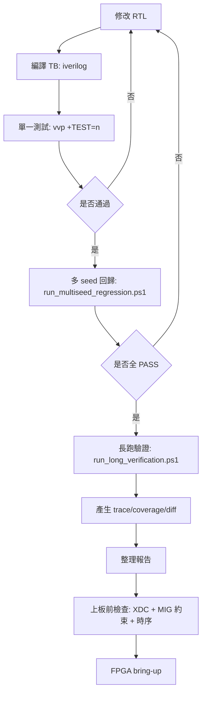

# CPU 設計專案（RV32I + I$/D$ + Unified L2 + DDR2 MIG）

本專案目前主線是整合式 5-stage RV32I CPU，包含：
- L1 I-Cache：`icache.v`（由 `icache_top.v` 包裝）
- L1 D-Cache（blocking）：`dcache.v`
- Unified L2 + I/D 仲裁：`L2_cache.v`、`I_D_arbitration.v`
- 可選 DDR2 MIG 路徑與 UART boot：`icache_pipeline_top.v`
- 可直接回歸的測試平台與腳本

目前驗證狀態（2026-02-23）：
- baseline `test 1..27`：PASS
- 壓測套件（deep mix / extreme backpressure / long mix / error paths）：PASS

## 1. 主線設計路徑

目前主要維護與驗證路徑：
- Top：`icache_pipeline_top.v`
- Board wrapper：`board_top.v`
- 主測試平台：`icache_pipeline_tb.v`
- 分支重導場景測試：`bp_redirect_scenarios_tb.v`

`storage_top/`、`cache_old/`、`temp/` 為舊路徑或參考檔，不是目前主線回歸目標。

## 2. 一頁式流程圖



## 3. 架構總覽

- Pipeline stages
  - IF：`IF.v`
  - IF/ID：`IFID_register.v`
  - ID + regfile：`ID.v`
  - ID/EX：`IDEX_register.v`
  - EX：`EX.v`
  - EX/MEM：`EXMEM_register.v`
  - MEM：`MEM.v`
  - MEM/WB：`MEMWB_register.v`
  - WB：`WB.v`
- 控制與資料繞送
  - hazard：`hazard_unit.v`
  - forwarding：`forward_unit.v`
  - branch predictor（2-bit PHT）：`branch_predictor.v`
- 記憶體階層
  - I$：`icache.v` + `icache_top.v`
  - D$：`dcache.v`
  - L2 core：`L2_cache.v`（`l2_cache_core`）
  - L2 I/D 仲裁：`I_D_arbitration.v`（`l2_cache_top`）
- 外部記憶體
  - MIG wrapper：`MIG_DDR2_interface.v`
  - 模擬用 MIG model 在 `icache_pipeline_tb.v`（`mig_7series_0_mig`）

## 4. 專案目錄重點

- RTL 主檔
  - `icache_pipeline_top.v`
  - `board_top.v`
  - `branch_predictor.v`
  - `dcache.v`
  - `L2_cache.v`
  - `I_D_arbitration.v`
- 測試平台
  - `icache_pipeline_tb.v`
  - `bp_redirect_scenarios_tb.v`
  - `dcache_tb.v`
  - `icache_tb.v`
  - `l2_arb_tb.v`
- 測試程式 / 記憶體映像
  - `TEST_FILES/*.mem`
  - `TEST_FILES/prog_*.c`
- 自動化工具
  - `tools/run_multiseed_regression.ps1`
  - `tools/run_long_verification.ps1`
  - `tools/build_mem_from_c.ps1`
  - `tools/bin_to_mem.py`
  - `tools/compare_commit_trace.py`
- 規格文件
  - `spec/i_cache_spec*.md`
  - `spec/d_cache_spec*.md`
  - `spec/L2_cache_spec*.md`

## 5. 環境需求

必要：
- `iverilog`
- `vvp`
- PowerShell

選用：
- Python（trace diff / 小工具）
- RISC-V 工具鏈（`riscv*-unknown-elf-gcc`, `objcopy`）

## 6. 快速開始（單一測試）

工作路徑：`c:\cpu_design`

### 6.1 編譯主 TB

```powershell
iverilog -g2005-sv -o icache_pipeline_tb.out `
  icache_pipeline_tb.v `
  icache_pipeline_top.v `
  icache_top.v `
  icache.v `
  IF.v `
  IFID_register.v `
  ID.v `
  IDEX_register.v `
  EX.v `
  EXMEM_register.v `
  MEM.v `
  MEMWB_register.v `
  WB.v `
  hazard_unit.v `
  forward_unit.v `
  dcache.v `
  L2_cache.v `
  I_D_arbitration.v `
  branch_predictor.v `
  uart_rx.v `
  uart_bootloader.v `
  MIG_DDR2_interface.v
```

注意：若漏掉 `branch_predictor.v`，會出現 `Unknown module type: branch_predictor`。

### 6.2 執行單筆測試

```powershell
vvp icache_pipeline_tb.out +TEST=24 +RAND_MEM=0 +ASSERT_EN=1 +MAXCYCLES=200000
```

PASS 關鍵字：
- `PASS: test ...`

## 7. 分支重導專項測試

`bp_redirect_scenarios_tb.v` 會檢查：
- `pred taken` 命中
- `pred taken` 失敗後回 `PC+4`
- `pred not taken` 失敗後 flush + 重取

編譯與執行：

```powershell
iverilog -g2005-sv -o bp_redirect_scenarios_tb.out `
  bp_redirect_scenarios_tb.v `
  icache_pipeline_top.v `
  icache_top.v `
  icache.v `
  IF.v `
  IFID_register.v `
  ID.v `
  IDEX_register.v `
  EX.v `
  EXMEM_register.v `
  MEM.v `
  MEMWB_register.v `
  WB.v `
  hazard_unit.v `
  forward_unit.v `
  dcache.v `
  L2_cache.v `
  I_D_arbitration.v `
  branch_predictor.v `
  uart_rx.v `
  uart_bootloader.v `
  MIG_DDR2_interface.v

vvp bp_redirect_scenarios_tb.out
```

## 8. 回歸腳本

### 8.1 多 seed 回歸

腳本：`tools/run_multiseed_regression.ps1`

範例：

```powershell
powershell -ExecutionPolicy Bypass -File tools/run_multiseed_regression.ps1 `
  -Tests 24,25,26,27 `
  -SeedStart 1 `
  -SeedCount 20 `
  -OutDir sim_logs/reg_24_27 `
  -SimExe sim_logs/reg_24_27/simv.out `
  -Compile 1 `
  -RandMem 1 `
  -RandBpPct 35 `
  -RandIMax 15 `
  -RandDMax 15 `
  -AssertEn 1 `
  -StallWdog 4096 `
  -RdWdog 256 `
  -MaxCycles 300000
```

輸出：
- `summary.csv`
- `summary.txt`
- `t<test>_s<seed>.log`

### 8.2 長跑驗證

腳本：`tools/run_long_verification.ps1`

內容：
1. multiseed regression
2. trace + coverage
3. 可選 trace diff

範例：

```powershell
powershell -ExecutionPolicy Bypass -File tools/run_long_verification.ps1 `
  -Tests 24,25,26,27 `
  -SeedStart 1 `
  -SeedCount 30 `
  -OutDir sim_logs/long_run `
  -SimExe sim_logs/long_run/simv.out `
  -Compile 1 `
  -RandMem 1 `
  -RandBpPct 35 `
  -RandIMax 15 `
  -RandDMax 15 `
  -AssertEn 1 `
  -StallWdog 4096 `
  -RdWdog 256 `
  -MaxCycles 300000 `
  -TraceSeed 7
```

## 9. `+TEST=<id>` 對照表

對照定義於 `icache_pipeline_tb.v`：

- `1`：`mem_test1_alu_fwd.mem`
- `2`：`mem_test2_load_use.mem`
- `3`：`mem_test3_store_dep.mem`
- `4`：`mem_test4_branch_taken.mem`
- `5`：`mem_test5_load_store.mem`
- `6`：`mem_test6_branch_not_taken.mem`
- `7`：`mem_test7_jal.mem`
- `8`：`mem_test8_jalr.mem`
- `9`：`mem_test9_lb_sb.mem`
- `10`：`mem_test10_lhu_sh.mem`
- `11`：`mem_test11_long_mix.mem`
- `12`：`mem_test12_long_mem.mem`
- `13`：`mem_test13_stress.mem`
- `14`：`mem_test14_id_miss.mem`
- `15`：I$ error path（`i_err_once`）
- `16`：D$ error path（`d_err_once`）
- `17`：`mem_test17_icache_stress.mem`
- `18`：`mem_test18_dcache_wb.mem`
- `19`：`mem_test19_hazard_branch.mem`
- `20`：`mem_test20_long_mix.mem`
- `21`：`mem_test21_long_branch.mem`
- `22`：`mem_test22_branch_mem_mix.mem`
- `23`：`mem_test22_from_c.mem`
- `24`：`mem_test24_from_c.mem`
- `25`：`mem_test25_all_instr_stress.mem`
- `26`：`mem_test26_mixed_stress.mem`
- `27`：`mem_test27_full_system_stress.mem`

## 10. 主 TB Plusargs

常用 plusargs（`icache_pipeline_tb.v`）：

- `+TEST=<id>`
- `+MEMFILE=<path>`
- `+EXPECT_RD=<int>`
- `+EXPECT_VAL=<hex>`
- `+MAXCYCLES=<int>`
- `+I_RSP_DELAY=<int>`
- `+D_RSP_DELAY=<int>`
- `+I_ERR_ONCE=<0|1>`
- `+D_ERR_ONCE=<0|1>`
- `+RAND_MEM=<0|1>`
- `+SEED=<int>`
- `+RAND_I_MAX=<int>`
- `+RAND_D_MAX=<int>`
- `+RAND_BP_PCT=<int>`
- `+ASSERT_EN=<0|1>`
- `+STALL_WDOG=<int>`
- `+RD_WDOG=<int>`
- `+TRACE_EN=<0|1>`
- `+TRACE_FILE=<path>`
- `+COV_EN=<0|1>`
- `+COV_FILE=<path>`
- `+STATE_COV_EN=<0|1>`
- `+STATE_COV_FILE=<path>`

## 11. 由 C 產生 `.mem`

```powershell
powershell -ExecutionPolicy Bypass -File tools/build_mem_from_c.ps1 `
  -Source TEST_FILES/prog_test24_from_c.c `
  -OutMem TEST_FILES/mem_test24_from_c.mem `
  -BuildDir build_rv32
```

相關檔案：
- link script：`tools/link_ddr.ld`
- startup：`tools/crt0.S`
- bin->mem：`tools/bin_to_mem.py`

## 12. 上板說明（Nexys A7）

- board top：`board_top.v`
- constraints：`Nexys-A7-100T-Master.xdc`

目前 XDC 狀態：
- 核心 clock/reset/UART/status pins 已配置
- DDR2 MIG 約束仍需補齊（檔內有 TODO）

建議流程：
1. Vivado top 設 `board_top.v`
2. 加入主線 RTL + XDC
3. 補完整 MIG/DDR2 約束
4. 跑 synthesis/implementation/timing
5. 先看 `status_o` 與 `ifetch_err_o`

## 13. 規格文件

- `spec/i_cache_spec*.md`
- `spec/d_cache_spec*.md`
- `spec/L2_cache_spec*.md`

規格文件描述設計意圖；實作細節以 RTL 為準。

## 14. 已知限制

- 多數路徑採 single-outstanding（偏穩定與易除錯）
- 主線尚未含 MMU/TLB
- D$ 為 blocking 設計
- 部分資料夾為舊路徑，不保證對齊主線回歸

## 15. 快速除錯

- `Unknown module type: branch_predictor`
  - 編譯清單漏了 `branch_predictor.v`
- 隨機壓測常 timeout
  - 提高 `+MAXCYCLES`、`+STALL_WDOG`
  - 檢查 `+RAND_BP_PCT`、`+RAND_I_MAX`、`+RAND_D_MAX`
- `test15/16` 行為不一致
  - 建議 normal 與 `-DSYNTHESIS` 模式都跑一次

