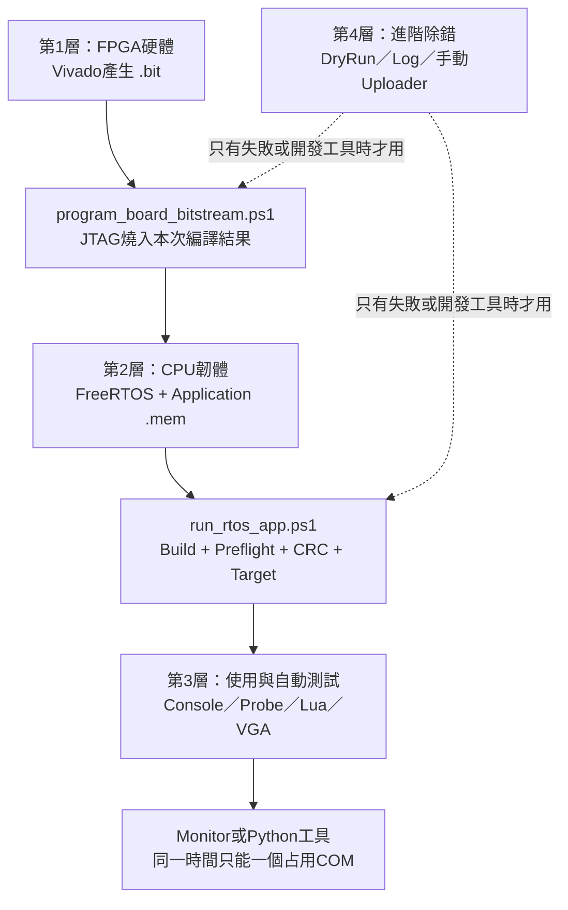
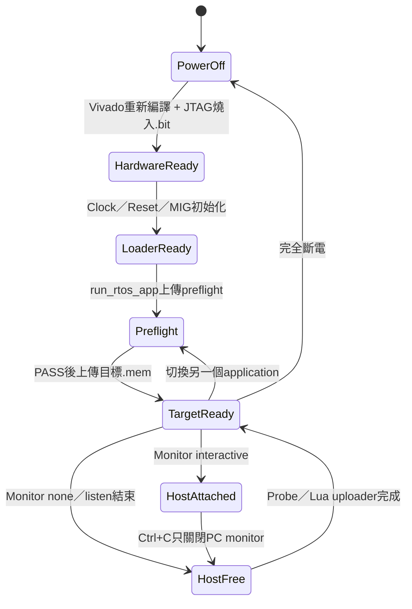
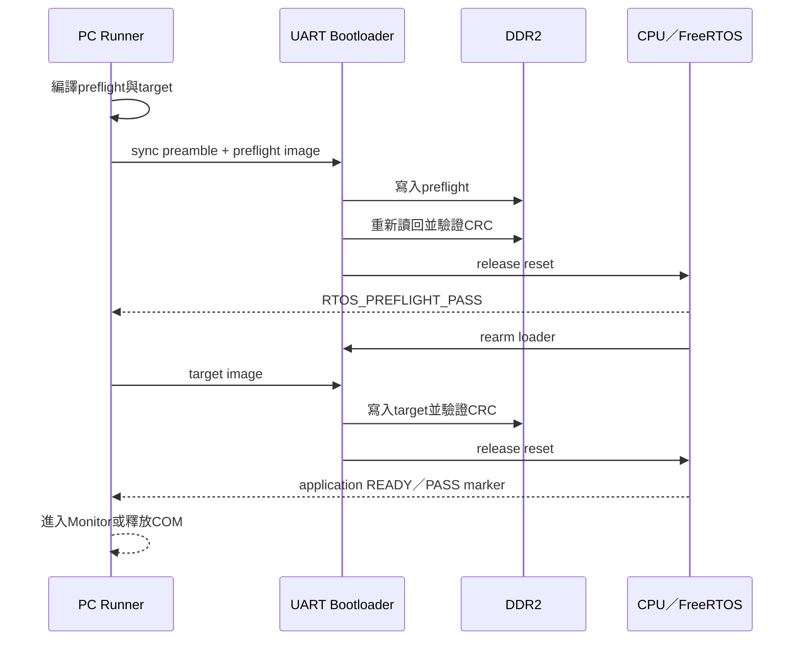
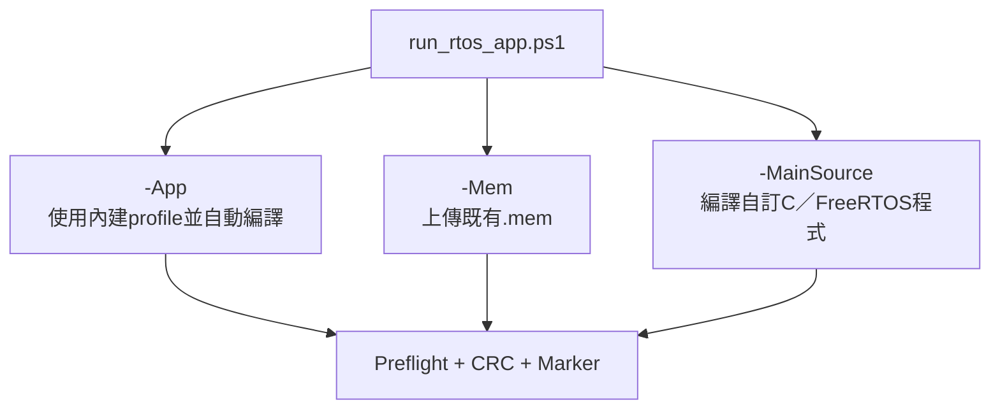
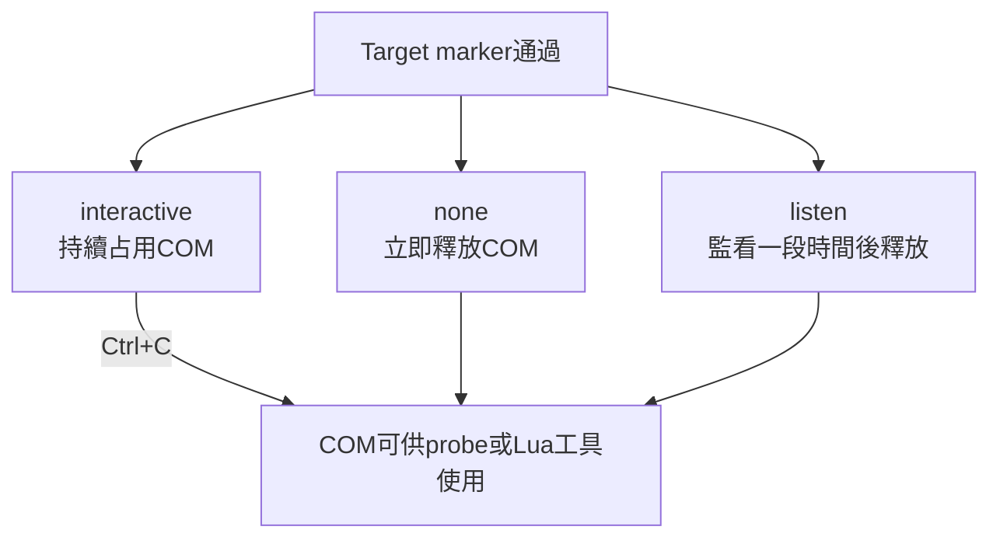
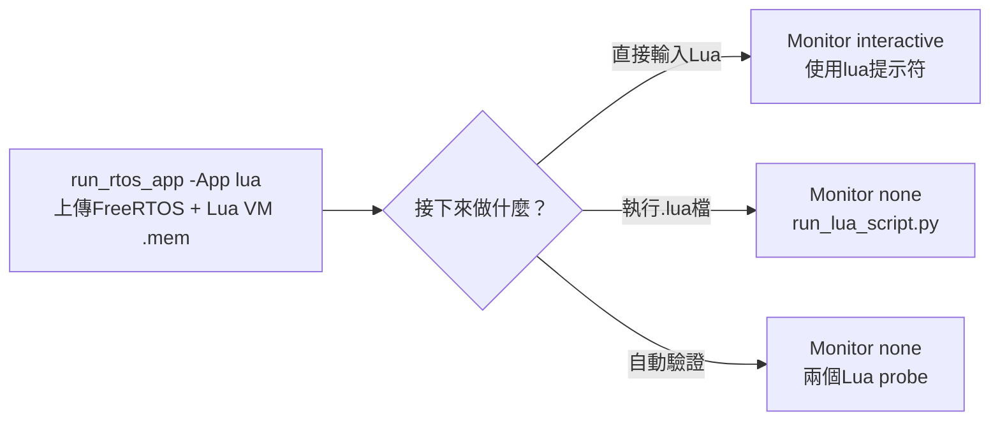
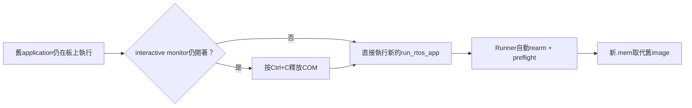
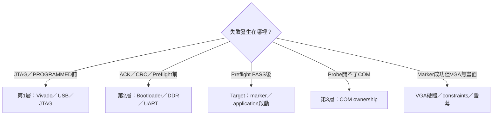

# FPGA 上板操作與指令手冊

> 這是合作、交接與日常上板的唯一指令入口。不要從頭背到尾：先用第 1、2 節判斷目前所在層級，再前往對應的「指令卡」。

適用平台：Digilent Nexys A7-100T、Windows PowerShell、板載 USB-UART 115200 baud。

## 0. 這份手冊怎麼讀

| 你現在要做的事              | 直接閱讀                     |
| --------------------------- | ---------------------------- |
| 第一次開機並跑 Console      | 第 1～5 節，再看第 8.1 節    |
| 切換另一個 RTOS application | 第 5、7、9 節                |
| 執行自動 probe              | 第 7 節，再看第 8 節對應程式 |
| 上傳 Lua 腳本               | 第 7 節與第 8.4 節           |
| 執行 VGA demo／遊戲         | 第 8.5 節                    |
| 上傳自己的 `.mem` 或 C 程式 | 第 10 節                     |
| 處理上板失敗                | 第 14 節                     |
| 做完整交接驗收              | 第 12、13、15 節             |

一般使用只需要第 1～9 節。第 10 節以後屬於自訂程式、驗收與除錯，不必每次重讀。

### 本頁常用縮寫速查

| 縮寫       | 英文全名                                    | 在本頁的意思                                                   |
| ---------- | ------------------------------------------- | -------------------------------------------------------------- |
| `FPGA`     | Field-Programmable Gate Array               | 下載 `.bit` 後形成CPU與周邊的可程式化晶片                      |
| `PC`       | Personal Computer                           | 執行PowerShell與Python的電腦；CPU文件中的PC則是Program Counter |
| `UART`     | Universal Asynchronous Receiver/Transmitter | PC與FPGA之間上傳程式、輸入命令和傳回文字的序列介面             |
| `COM`      | Communication Port                          | Windows的UART連接埠，例如 `COM5`                               |
| `JTAG`     | Joint Test Action Group                     | 將 `.bit` 寫入FPGA的介面                                       |
| `DDR2`     | Double Data Rate 2 SDRAM                    | 保存 `.mem` application與runtime資料的板外記憶體               |
| `MIG`      | Memory Interface Generator                  | Xilinx提供的DDR2控制器IP                                       |
| `RTOS`     | Real-Time Operating System                  | 即時作業系統；本專案具體使用FreeRTOS                           |
| `CRC`      | Cyclic Redundancy Check                     | 檢查UART傳輸與DDR image是否損壞                                |
| `ACK／NAK` | Acknowledge／Negative Acknowledge           | Bootloader表示接受成功／拒絕或檢查失敗                         |
| `VM`       | Virtual Machine                             | Lua虛擬機，負責執行Lua腳本                                     |
| `REPL`     | Read-Eval-Print Loop                        | 輸入一行Lua、執行並顯示結果的互動模式                          |
| `API`      | Application Programming Interface           | Application可呼叫的函式介面                                    |
| `MMIO`     | Memory-Mapped Input/Output                  | CPU使用load/store存取UART、timer與VGA等周邊                    |

完整版本集中在 [GLOSSARY.md](../GLOSSARY.md)。後文不會在每一條指令重複展開同一個縮寫。

## 1. 先理解四層指令

每條指令只負責一個層級。下層沒有完成時，上層工具無法補救。



### 三種檔案的階層

| 檔案   | 內容                                             | 由誰載入           | 失去的時機                                    |
| ------ | ------------------------------------------------ | ------------------ | --------------------------------------------- |
| `.bit` | CPU、Cache、DDR、UART、VGA、MMIO硬體             | JTAG               | FPGA完全斷電                                  |
| `.mem` | startup、FreeRTOS、driver、C application、Lua VM | UART bootloader    | 被新image取代、reset後不應假設可沿用、DDR失電 |
| `.lua` | Lua VM執行的腳本原始碼                           | Lua script service | Lua firmware被換掉或DDR失電                   |

`.lua` 不能取代 `.mem`，`.mem` 也不能替硬體增加 `.bit` 中沒有的VGA或MMIO功能。

## 2. 用板子狀態決定下一條指令



| 現在看到的狀態                     | 下一步                         | 不要做什麼                       |
| ---------------------------------- | ------------------------------ | -------------------------------- |
| 板子剛開機，還沒燒本次硬體         | 第 4 節燒錄 `.bit`             | 不要先傳 `.mem`                  |
| `.bit` 剛燒完                      | 第 5 節執行 `run_rtos_app.ps1` | UART沒有application文字是正常的  |
| 顯示 `Uploading RTOS preflight...` | 等待                           | 不要輸入字元或開第二個serial工具 |
| 顯示 `RTOS_PREFLIGHT_PASS`         | 繼續等待target marker          | 不要把它當成目標程式已啟動       |
| 顯示 `Target confirmed by marker`  | 可以互動或執行probe            | 先確認COM是否已釋放              |
| interactive terminal仍在輸出       | 要開probe前按 `Ctrl+C`         | 不要同時開兩個COM工具            |

## 3. 每次開啟 PowerShell 的環境設定

### 指令卡：設定共同變數

| 欄位     | 說明                                                |
| -------- | --------------------------------------------------- |
| 何時執行 | 每次開啟新的PowerShell視窗                          |
| 執行前   | 確認repository、FreeRTOS、toolchain與Vivado安裝位置 |
| 成功判定 | 三個 `Test-Path` 都是 `True`，Python能顯示版本      |
| 下一步   | 第 4 節燒錄本次bitstream                            |

```powershell
cd C:\cpu_design

$Port = "COM5"
$FreeRTOSRoot = "C:\Users\a0968\Downloads\FreeRTOSv202406.04-LTS\FreeRTOS-LTS\FreeRTOS\FreeRTOS-Kernel"
$ToolchainBin = "C:\riscv\xpack-riscv-none-elf-gcc\bin"
$VivadoBat = "C:\Xilinx\Vivado\2020.2\bin\vivado.bat"

Test-Path $FreeRTOSRoot
Test-Path $ToolchainBin
Test-Path $VivadoBat
python --version
```

### 指令卡：找出 COM port

```powershell
Get-CimInstance Win32_SerialPort |
  Select-Object DeviceID, Name
```

如果只要列出port名稱：

```powershell
[System.IO.Ports.SerialPort]::GetPortNames()
```

將結果填入 `$Port`：

```powershell
$Port = "COM5"
```

執行後續指令前，關閉PuTTY、Tera Term、Arduino Serial Monitor，以及仍在執行的舊runner。

## 4. 第 1 層：燒錄本次最新硬體

燒錄後只有硬體開始運作；DDR內還沒有要執行的application，因此下一步一定是 `run_rtos_app.ps1`。

## 5. 第 2 層：用 Runner 上傳並驗證 `.mem`

### 指令卡：`run_rtos_app.ps1`

| 欄位     | 說明                                                                      |
| -------- | ------------------------------------------------------------------------- |
| 作用     | 編譯程式、跑短版preflight、驗證DDR CRC，再切換到目標application           |
| 何時執行 | `.bit` 燒完後，或要切換另一個application時                                |
| 執行前   | MIG初始化完成、COM未被其他工具占用                                        |
| 成功判定 | 先有 `RTOS_PREFLIGHT_PASS`，再有目標marker與 `Target confirmed by marker` |
| 下一步   | 依 `-Monitor` 互動或執行probe                                             |

最常用範例：

```powershell
.\tools\run_rtos_app.ps1 -Port $Port -App console
```

### Runner 內部實際流程



### 執行時機

```text
Waiting ... / Uploading RTOS preflight...
```

此時只等待，不要輸入，也不要開第二個serial工具。

```text
RTOS_PREFLIGHT_PASS
```

只代表短版CPU／RTOS路徑通過；runner仍在上傳目標程式。

```text
Target confirmed by marker: ...
```

看到這一行，才表示目標application已準備完成。

## 6. 選擇要上傳的目標

Runner有三種互斥入口：



### 6.1 內建 profile 總表

| Profile          | 適合用途                          | 指令                  | 成功marker                     | 建議Monitor           |
| ---------------- | --------------------------------- | --------------------- | ------------------------------ | --------------------- |
| `smoke`          | Task、Queue、tick長時間基本測試   | `-App smoke`          | `RTOS_SMOKE_PASS`              | `listen`              |
| `console`        | 互動命令、worker、效能計數器      | `-App console`        | `APP_READY`                    | `interactive`         |
| `platform`       | FreeRTOS object與UART IRQ綜合測試 | `-App platform`       | `RTOS_PLATFORM_PASS`           | `none`                |
| `lua`            | Lua VM、REPL與script service      | `-App lua`            | `LUA_RTOS_READY`               | `none`或`interactive` |
| `vga_demo`       | 三個Task更新畫面                  | `-App vga_demo`       | `[VGA] task=L start`           | `interactive`         |
| `vga_queue_demo` | Producer→Queue→Renderer           | `-App vga_queue_demo` | `[PIPE] task=P producer start` | `interactive`         |

完整指令格式都是：

```powershell
.\tools\run_rtos_app.ps1 -Port $Port -App <profile> -Monitor <mode>
```

內建profile會自動選source、輸出名稱與marker，不需要填 `-OutName` 或 `-TargetMarker`。Lua啟動較慢，runner會自動把target timeout調成60秒。

## 7. 第 3 層：Monitor、`Ctrl+C` 與 COM ownership

### 四行速記：Runner 與 Monitor 的分工

```text
run_rtos_app.ps1  → 編譯、測試並上傳整個 .mem
interactive       → .mem 啟動後，直接輸入板上程式支援的命令
none              → .mem 啟動並驗證後釋放 COM，讓另一個 Python 工具接手
Ctrl+C            → 離開 interactive 並釋放 COM，但不會停止 FPGA 上的程式
```

`-Monitor` 只決定 **target `.mem` 上傳並通過 marker 後** PC 如何處理 UART；它不負責上傳 `.mem`。因此 `interactive` 裡可輸入的是 `help`、`status` 或 Lua REPL 內容等「目前 application 已實作的命令」，不是 PowerShell/Python 指令，也不能在這裡輸入 `.mem` 檔案路徑。

### 三種 Monitor 模式



| 模式          | 會不會占用COM        | 適合用途                    | 如何結束              |
| ------------- | -------------------- | --------------------------- | --------------------- |
| `interactive` | 會，一直占用         | Console、Lua REPL、遊戲鍵盤 | 按 `Ctrl+C`           |
| `none`        | marker通過後立即釋放 | 接著執行probe或Lua uploader | 自動結束              |
| `listen`      | 暫時占用             | 只觀察log、smoke soak       | `ListenSeconds`後結束 |

範例：

```powershell
# 需要鍵盤輸入
.\tools\run_rtos_app.ps1 -Port $Port -App console -Monitor interactive

# 接下來要跑自動probe
.\tools\run_rtos_app.ps1 -Port $Port -App platform -Monitor none

# 只觀察30秒
.\tools\run_rtos_app.ps1 -Port $Port -App smoke -Monitor listen -ListenSeconds 30
```

### `Ctrl+C` 實際停止什麼

```text
會停止：PC端PowerShell／Python monitor，並釋放COM
不會停止：FPGA、CPU、FreeRTOS Task、DDR中的.mem
```

所以按 `Ctrl+C` 後，板上application通常仍在執行，可以接著開probe或Lua uploader。

## 8. 常用 Application 指令卡

### 8.1 Console：手動互動

| 欄位         | 內容                                         |
| ------------ | -------------------------------------------- |
| 啟動         | `run_rtos_app -App console`                  |
| Ready marker | `APP_READY`                                  |
| Monitor      | `interactive`                                |
| 用途         | UART互動、Queue worker、Task狀態與效能計數器 |

```powershell
.\tools\run_rtos_app.ps1 -Port $Port -App console
```

看到 `APP_READY` 後才輸入：

| Console命令        | 功能                           |
| ------------------ | ------------------------------ |
| `help`             | 顯示可用命令                   |
| `ping`             | 確認Console與tick仍回應        |
| `status`           | 顯示系統狀態                   |
| `tasks`            | 顯示主要Task                   |
| `echo hello`       | 驗證UART RX/TX                 |
| `work 256`         | 經Queue交給worker Task執行工作 |
| `perf test 100000` | 執行並量測workload             |
| `reload`           | 要求回到UART bootloader        |

### 8.2 Console：自動 probe

先讓runner在marker通過後釋放COM，再啟動probe：

```powershell
.\tools\run_rtos_app.ps1 -Port $Port -App console -Monitor none

python .\tools\rtos_console_probe.py `
  --port $Port `
  --perf-iterations 256
```

成功：

```text
[PROBE] PASS: all RTOS Console commands responded.
```

### 8.3 Platform：FreeRTOS綜合自測

| 欄位         | 內容                                                                           |
| ------------ | ------------------------------------------------------------------------------ |
| 啟動         | `run_rtos_app -App platform -Monitor none`                                     |
| Ready marker | `RTOS_PLATFORM_PASS`                                                           |
| 下一步       | `rtos_platform_probe.py`                                                       |
| 涵蓋         | heap、mutex、semaphore、Queue Set、Event Group、Stream Buffer、timer、UART IRQ |

```powershell
.\tools\run_rtos_app.ps1 -Port $Port -App platform -Monitor none
python .\tools\rtos_platform_probe.py --port $Port
```

成功：

```text
RTOS_PLATFORM_PASS
[PLATFORM PROBE] PASS: interrupt-driven UART is responsive.
```

### 8.4 Lua：Firmware、REPL與腳本

Lua分兩層：先上傳包含Lua VM的 `.mem`，之後才傳 `.lua`。



啟動firmware並釋放COM：

```powershell
.\tools\run_rtos_app.ps1 -Port $Port -App lua -Monitor none
```

成功必須看到：

```text
LUA_SCRIPT_PROTOCOL_PASS
LUA_SELFTEST_PASS
LUA_RTOS_READY
```

自動驗證：

```powershell
python .\tools\rtos_lua_probe.py --port $Port
python .\tools\rtos_lua_script_probe.py --port $Port
```

上傳一般腳本：

```powershell
python .\tools\run_lua_script.py `
  --port $Port `
  --file .\lua_apps\hello.lua
```

腳本成功marker是 `LUA_SCRIPT_PASS`。

需要鍵盤互動的腳本：

```powershell
python .\tools\run_lua_script.py `
  --port $Port `
  --file .\lua_apps\guess_number.lua `
  --interactive `
  --timeout-ms 600000 `
  --instruction-limit 5000000
```

查詢、停止或detach：

```powershell
python .\tools\run_lua_script.py --port $Port --status
python .\tools\run_lua_script.py --port $Port --stop
python .\tools\run_lua_script.py --port $Port --file .\lua_apps\hello.lua --detach
```

這些Python工具執行前，不能有interactive runner占用COM。

### 8.5 VGA demo與遊戲

執行前確認本次Vivado編譯已包含VGA介面與constraints，而且螢幕input source正確。

| 目標        | 指令                  | 成功證據                                   |
| ----------- | --------------------- | ------------------------------------------ |
| 三Task demo | `-App vga_demo`       | `[VGA] task=L/M/R start`與實體畫面         |
| Queue demo  | `-App vga_queue_demo` | Producer／Renderer／Heartbeat marker與動畫 |

```powershell
.\tools\run_rtos_app.ps1 -Port $Port -App vga_demo
```

切換前按 `Ctrl+C`：

```powershell
.\tools\run_rtos_app.ps1 -Port $Port -App vga_queue_demo
```

<details>
<summary>展開：Tetris與完整遊戲Launcher</summary>

上傳Tetris既有image：

```powershell
.\tools\run_rtos_app.ps1 `
  -Port $Port `
  -Mem .\TEST_FILES\mem_tetris_vga.mem `
  -TargetMarker "VGA Tetris demo" `
  -TargetTimeout 30 `
  -Monitor interactive
```

Tetris鍵盤：`a/d`左右、`w/x`旋轉、`s`軟降、空白鍵硬降、`q`離開。

完整遊戲Launcher：

```powershell
.\tools\run_rtos_app.ps1 `
  -Port $Port `
  -Mem .\TEST_FILES\mem_vga_games_menu.mem `
  -TargetMarker "VGA launcher ready." `
  -TargetTimeout 60 `
  -Monitor interactive
```

目前既有launcher payload約1.5 MiB，實際大小會隨遊戲code改變；在115200 baud可能需要數分鐘。以runner進度與檔案word數判斷，不要中止，也不要開第二個serial工具。Slot配置與建置原理見 [BARE_METAL_VGA_GAMES.md](../05-applications/BARE_METAL_VGA_GAMES.md)。

</details>

## 9. 切換 Application



切換時不需要按reset，也不需要重新JTAG燒錄同一次硬體。範例：

```powershell
# Console切到Lua
.\tools\run_rtos_app.ps1 -Port $Port -App lua

# Lua切到VGA Queue；若前一個interactive monitor仍開著，先按Ctrl+C
.\tools\run_rtos_app.ps1 -Port $Port -App vga_queue_demo
```

## 10. 既有 `.mem` 與自訂 C／FreeRTOS程式

<details>
<summary>展開：既有image與自訂程式指令</summary>

### 10.1 上傳既有 `.mem`

| 必填參數         | 意義                                        |
| ---------------- | ------------------------------------------- |
| `-Mem`           | 要上傳的現有image                           |
| `-TargetMarker`  | application真正ready後會輸出的唯一ASCII文字 |
| `-TargetTimeout` | 只有啟動確實較慢時才調大                    |

```powershell
.\tools\run_rtos_app.ps1 `
  -Port $Port `
  -Mem .\path\to\application.mem `
  -TargetMarker "APPLICATION_READY" `
  -Monitor interactive
```

`-Mem` 與 `-App` 不能同時使用。若省略marker，runner只能證明image已送出，不能自動證明application已成功啟動；正式交接不要省略。

### 10.2 編譯並上板自訂 C application

自訂程式在初始化、RTOS objects與Tasks建立成功後，應輸出唯一marker：

```c
rtos_uart_write_line("MY_APP_READY");
```

上板：

```powershell
.\tools\run_rtos_app.ps1 `
  -Port $Port `
  -MainSource .\OS\rtos\src\main_my_app.c `
  -OutName rtos_my_app `
  -TargetMarker "MY_APP_READY"
```

加入額外source：

```powershell
.\tools\run_rtos_app.ps1 `
  -Port $Port `
  -MainSource .\OS\rtos\src\main_my_app.c `
  -ExtraSource @(
    ".\OS\rtos\src\my_driver.c",
    ".\OS\rtos\src\my_module.c"
  ) `
  -OutName rtos_my_app `
  -TargetMarker "MY_APP_READY"
```

`OutName`只是 `.elf/.mem/.dis/.map` 的共同檔名，不是CPU命令或ready marker。

</details>

## 11. 第 4 層：建置與除錯工具

這一節不是一般上板主流程。只有開發build工具、保存證據或排查傳輸時才使用。

<details>
<summary>展開：Dry run、log與手動uploader</summary>

### 11.1 只建置、不開COM

```powershell
.\tools\build_rtos_app.ps1 `
  -App console `
  -FreeRTOSRoot $FreeRTOSRoot `
  -ToolchainBin $ToolchainBin
```

### 11.2 Dry run

會建置preflight與target、解析 `.mem`、計算CRC及建立frame，但不開COM：

```powershell
.\tools\run_rtos_app.ps1 -Port $Port -App console -DryRun
```

### 11.3 保存UART log

```powershell
.\tools\run_rtos_app.ps1 `
  -Port $Port `
  -App platform `
  -Monitor none `
  -Log .\build_rtos_apps\platform_board.log
```

偶發錯誤與正式交接建議使用 `-Log`，因為最後的PowerShell throw通常不是最早的真正原因。

### 11.4 手動單階段 uploader

只有板子已經停在loader，而且需要隔離runner問題時才使用：

```powershell
python .\uart_send_mem.py `
  --port $Port `
  --baud 115200 `
  --mem .\path\to\application.mem `
  --delay 3.0 `
  --preamble 4096 `
  --interactive
```

參數之間必須有空格：

```text
錯誤：--preamble 4096--interactive
正確：--preamble 4096 --interactive
```

手動uploader沒有preflight、自動rearm、完整retry與target marker判定，不適合作為交接主流程。

</details>

## 12. Reset、斷電與 `Ctrl+C`

| 動作                  | `.bit` | `.mem`／板上程式     | COM        | 下一步                |
| --------------------- | ------ | -------------------- | ---------- | --------------------- |
| `Ctrl+C`              | 保留   | 保留且繼續執行       | 釋放       | 可執行probe或另一工具 |
| 關閉PowerShell        | 保留   | 保留且繼續執行       | 釋放       | 重新開terminal即可    |
| 切換application       | 保留   | 被新image取代        | runner接管 | 執行新的 `-App`       |
| 按CPU/system reset    | 保留   | 不應假設仍可直接執行 | 釋放       | 重新執行runner        |
| JTAG燒入本次bitstream | 被替換 | boot流程重新開始     | 不影響     | 接著執行runner        |
| 完全斷電              | 遺失   | 遺失                 | 釋放       | 回到第4節重新開始     |

本專案目前沒有把bitstream永久寫入QSPI，也沒有讓DDR或Lua script斷電保存。

## 13. 完整實板驗收流程

### 13.1 不需要VGA畫面的功能

```powershell
# 1. Vivado重新編譯後，燒錄本次bitstream
.\tools\program_board_bitstream.ps1 -Bitstream $Bitstream -VivadoBat $VivadoBat

# 2. Console
.\tools\run_rtos_app.ps1 -Port $Port -App console -Monitor none
python .\tools\rtos_console_probe.py --port $Port --perf-iterations 256

# 3. Platform
.\tools\run_rtos_app.ps1 -Port $Port -App platform -Monitor none
python .\tools\rtos_platform_probe.py --port $Port

# 4. Lua
.\tools\run_rtos_app.ps1 -Port $Port -App lua -Monitor none
python .\tools\rtos_lua_probe.py --port $Port
python .\tools\rtos_lua_script_probe.py --port $Port
```

### 13.2 VGA畫面

```powershell
.\tools\run_rtos_app.ps1 -Port $Port -App vga_demo

# 觀察畫面後按Ctrl+C，再執行下一個
.\tools\run_rtos_app.ps1 -Port $Port -App vga_queue_demo

# 再按Ctrl+C，確認一般功能在目前硬體上仍正常
.\tools\run_rtos_app.ps1 -Port $Port -App console -Monitor none
python .\tools\rtos_console_probe.py --port $Port --perf-iterations 256
```

## 14. 常見錯誤：先判斷是哪一層



| 現象                                           | 最可能層級                   | 先做什麼                                                     |
| ---------------------------------------------- | ---------------------------- | ------------------------------------------------------------ |
| COM access denied／port busy                   | Monitor／COM                 | 關閉serial程式；interactive runner按 `Ctrl+C`                |
| `preflight did not report RTOS_PREFLIGHT_PASS` | Boot／DDR／UART              | 確認本次bitstream已燒、MIG初始化、COM與115200；按reset後重跑 |
| Preflight PASS但target marker timeout          | Application                  | 檢查marker拼字、target最後輸出、啟動時間與fatal/trap         |
| ACK／NAK或CRC偶發失敗                          | UART傳輸                     | 先保存log，再依下方順序調整pacing                            |
| Lua uploader無法開COM                          | COM或Lua層                   | 用 `-Monitor none` 啟動Lua；確認已看到 `LUA_RTOS_READY`      |
| UART奇怪字元／漏字                             | UART clock／baud／多工具競爭 | 確認兩端115200且只有一個serial工具                           |
| VGA marker成功但沒畫面                         | FPGA硬體層                   | 確認本次top含VGA、VGA XDC、線材、input source與640×480       |

上傳偶發失敗時，保持protocol v2，依序嘗試：

1. 增加 `-StartupDelay`；
2. 增加 `-Preamble`；
3. 增加 `-ChunkDelay`；
4. 降低 `-ChunkSize`；
5. 只有application真的啟動較慢才增加 `-TargetTimeout`。

```powershell
.\tools\run_rtos_app.ps1 `
  -Port $Port `
  -App console `
  -StartupDelay 8 `
  -Preamble 8192 `
  -ChunkSize 16 `
  -ChunkDelay 0.002 `
  -Log .\build_rtos_apps\console_retry.log
```

## 15. 延伸原理文件

實際操作以本文件為準；只有需要理解內部原理時才閱讀：

- [PROGRAM_FPGA.md](../03-build-boot/PROGRAM_FPGA.md)：Vivado、bitstream與JTAG。
- [RTOS_APP_RUNNER.md](../03-build-boot/RTOS_APP_RUNNER.md)：runner參數、重試與兩階段流程。
- [UART_BOOTLOADER.md](../03-build-boot/UART_BOOTLOADER.md)：protocol v1/v2、preamble與CRC。
- [FPGA_BOARD_TEST.md](../06-verification/FPGA_BOARD_TEST.md)：正式實板驗收與release判定。
- [LUA_SCRIPT_UPLOAD.md](../05-applications/LUA_SCRIPT_UPLOAD.md)：Lua script協定與限制。
- [VGA.md](../02-memory-io/VGA.md)：framebuffer、雙緩衝與VGA timing。
- [文件閱讀中心](../README.md)：回到整份專案文件階層。
