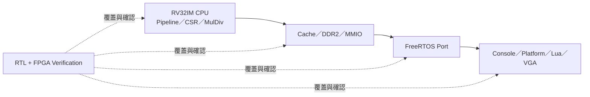

# 功能完成狀態

> 狀態快照：2026-07-15
> 目標平台：Digilent Nexys A7-100T
> 目前主線：RV32IM in-order CPU + DDR2 + UART boot + FreeRTOS + Lua

## 快速視覺摘要



先看第 3 節的版本摘要；只有要確認某個功能的完成度或限制時，才進入後面的分類表。

## 1. 這份文件的用途

這份文件回答三個問題：

1. 哪些功能已經實作？
2. 哪些功能不只實作，還通過 RTL 或實板驗證？
3. 哪些項目仍有限制、只屬於規劃，或根本不在目前範圍？

功能「已寫入 RTL／C 程式」不等於已經充分驗證；測試通過也不等於 CPU 已經完成
形式證明。因此以下狀態刻意分開標示。

## 2. 狀態定義

| 狀態       | 意義                                                        |
| ---------- | ----------------------------------------------------------- |
| 完成且驗證 | 功能已實作，並通過對應 RTL simulation、回歸或 FPGA 實板測試 |
| 完成／可選 | 功能已實作，但不是目前主要操作路徑，或需要額外設備          |
| 部分完成   | 已有可用功能，但介面、測試範圍或穩定性仍可改善              |
| 規劃中     | 已確認方向，但目前主線尚未實作                              |
| 未納入     | 目前沒有實作，也不是這一版的交付目標                        |

## 3. 目前版本摘要

| 項目            | 狀態       | 備註                                      |
| --------------- | ---------- | ----------------------------------------- |
| FPGA bitstream  | 完成且驗證 | `build_fpga/board_top_rtos_rearm.bit`     |
| CPU ISA         | 完成且驗證 | RV32IM + Zicsr                            |
| CPU clock       | 完成且驗證 | 50 MHz MIG UI／core domain                |
| FreeRTOS        | 完成且驗證 | preemptive scheduler、1 kHz tick          |
| UART boot       | 完成且驗證 | preflight、target 切換、CRC、retry、rearm |
| RTOS Console    | 完成且驗證 | UART command + Queue worker               |
| Lua             | 完成且驗證 | Lua 5.4.8 REPL、腳本上傳、`rtos.*` API    |
| 效能分析        | 完成且驗證 | 24 組 64-bit MMIO counters                |
| VGA             | 完成／可選 | 需要 VGA 顯示設備；UART 主線不依賴 VGA    |
| Superscalar CPU | 規劃中     | 預計另建專案，再與本核心比較／整合        |

production bitstream SHA-256：

```text
30890F6F3F3DB089DFE0A50D0290D03CB7B539CD09B66942D33B895E405141CB
```

## 4. CPU 與流水線

| 功能                                | 狀態       | 驗證或限制                               |
| ----------------------------------- | ---------- | ---------------------------------------- |
| 五級 IF／ID／EX／MEM／WB pipeline   | 完成且驗證 | `icache_pipeline_tb.v` 主回歸            |
| in-order、single-issue              | 完成且驗證 | 目前 baseline 微架構                     |
| RV32I integer instructions          | 完成且驗證 | regression `TEST=1..27`                  |
| RV32M multiply／divide              | 完成且驗證 | multiplier、divider、decode、EX 專用測試 |
| Zicsr CSR instructions              | 完成且驗證 | CSR decode、privilege 與 trap 測試       |
| forwarding                          | 完成且驗證 | ALU／load／store 相依測試                |
| load-use hazard stall               | 完成且驗證 | hazard regression 與 counter             |
| multi-cycle EX busy stall           | 完成且驗證 | M extension 測試與 counter               |
| conditional branch                  | 完成且驗證 | taken／not-taken／混合壓測               |
| JAL／JALR                           | 完成且驗證 | control-flow regression                  |
| branch prediction                   | 完成且驗證 | predictor 與 redirect scenario 測試      |
| mispredict recovery／pipeline flush | 完成且驗證 | redirect scenarios、counter 交叉核對     |
| misaligned access detection         | 完成且驗證 | `misalign_check_tb.v`                    |
| machine-mode exception              | 完成且驗證 | illegal instruction、`ecall` 等          |
| `mret`                              | 完成且驗證 | trap return 與 FreeRTOS context flow     |
| machine timer interrupt             | 完成且驗證 | FreeRTOS tick 與實板 scheduler           |
| software／external interrupt source | 完成且驗證 | CSR／IRQ source 與 UART RX 路徑          |
| user／supervisor mode               | 未納入     | 目前以 machine mode 為主                 |
| MMU／virtual memory                 | 未納入     | 無 Linux userspace 支援                  |
| multi-core／cache coherence         | 未納入     | 目前為單核心                             |
| superscalar issue                   | 規劃中     | 預計另建 CPU 專案                        |
| out-of-order execution              | 未納入     | 不屬於目前 baseline                      |

## 5. Cache、DDR 與記憶體系統

| 功能                     | 狀態       | 驗證或限制                                      |
| ------------------------ | ---------- | ----------------------------------------------- |
| L1 I-Cache               | 完成且驗證 | 目前 8 KiB；完整組態 64 KiB；2-way、64-byte line  |
| L1 D-Cache               | 完成且驗證 | 目前 8 KiB；完整組態 128 KiB；2-way、64-byte line |
| Unified L2 Cache         | 完成且驗證 | 目前 16 KiB；完整組態 256 KiB；2-way、64-byte line |
| I/D arbitration          | 完成且驗證 | I$、D$ 共用 L2／DDR 路徑                        |
| DDR2 MIG integration     | 完成且驗證 | 128 MiB CPU 可見視窗                            |
| DDR power-on memory test | 完成且驗證 | bootloader 啟動前執行                           |
| DDR alias                | 完成且驗證 | `0x0000_0000` 對應 `0x8000_0000` 視窗           |
| D-Cache writeback        | 完成且驗證 | writeback beat counter 與 cache TB              |
| MMIO bypass／decode      | 完成且驗證 | UART、timer、performance page                   |
| 自修改程式的一致性       | 未納入     | 沒有以 I$/D$ software coherence 為主要情境      |
| DMA coherence            | 未納入     | 目前沒有通用 DMA engine                         |
| ECC                      | 未納入     | Cache／DDR application path 未提供 CPU 可見 ECC |

FAST_SIM／FAST_SYNTH 可以縮小 Cache 組態以縮短模擬或合成時間；production
bitstream 使用正式容量。比較效能或資源時必須記錄使用的組態。

## 6. MMIO 與板級周邊

| 功能                           | 狀態       | 驗證或限制                             |
| ------------------------------ | ---------- | -------------------------------------- |
| UART TX MMIO                   | 完成且驗證 | 板載 USB-UART，115200 baud             |
| UART RX MMIO                   | 完成且驗證 | polling 與 interrupt-driven 路徑       |
| UART overrun 狀態              | 完成且驗證 | driver／probe 可觀察                   |
| machine timer MMIO             | 完成且驗證 | FreeRTOS 1 kHz tick                    |
| performance counter MMIO       | 完成且驗證 | 24 × 64-bit、atomic snapshot           |
| VGA framebuffer                | 完成／可選 | `board_top_vga.v`；需 VGA 螢幕         |
| VGA RTOS demos                 | 完成／可選 | multi-task 與 Queue renderer           |
| 通用 LED driver                | 規劃中     | 目前 status pins 主要供 bring-up debug |
| switch／button application API | 規劃中     | 尚未整理成正式 BSP API                 |
| GPIO framework                 | 未納入     | 尚無通用 GPIO driver model             |
| audio                          | 未納入     | 無 audio driver                        |
| SD card／SPI flash filesystem  | 規劃中     | 可作為持久化腳本／資源的後續方向       |
| network                        | 未納入     | 無 Ethernet／Wi-Fi stack               |

## 7. UART Bootloader 與上板流程

| 功能                            | 狀態       | 驗證或限制                          |
| ------------------------------- | ---------- | ----------------------------------- |
| `.mem` UART upload              | 完成且驗證 | 目標位址 `0x8000_0000`              |
| protocol v1                     | 完成且驗證 | 保留相容模式                        |
| protocol v2                     | 完成且驗證 | 目前預設                            |
| sync preamble                   | 完成且驗證 | 預設 4096 bytes                     |
| chunked upload                  | 完成且驗證 | 預設 32-byte chunk                  |
| image CRC verification          | 完成且驗證 | full-image CRC                      |
| retry                           | 完成且驗證 | preflight／target 預設最多 5 次     |
| application marker verification | 完成且驗證 | 依 profile 檢查 PASS／READY marker  |
| software reload／rearm          | 完成且驗證 | application 可回到 UART loader      |
| preflight 再切換 target         | 完成且驗證 | 通用上板工具的預設流程              |
| 斷電自動載入                    | 未納入     | bitstream 與 DDR image 仍需重新載入 |
| 非揮發性 firmware slot          | 規劃中     | 尚無 flash image manager            |

UART 實體鏈路仍可能因開板時序、COM port 狀態或 USB 傳輸出現一次性重試；
目前工具會以 ACK、CRC、marker 與自動重試判斷，不把「送出完成」誤當成「執行成功」。

## 8. FreeRTOS 平台

| 功能                                 | 狀態       | 驗證或限制                           |
| ------------------------------------ | ---------- | ------------------------------------ |
| 官方 RISC-V FreeRTOS port            | 完成且驗證 | 使用外部 FreeRTOS LTS checkout       |
| preemptive scheduling                | 完成且驗證 | `configUSE_PREEMPTION=1`             |
| time slicing                         | 完成且驗證 | `configUSE_TIME_SLICING=1`           |
| 1 kHz tick                           | 完成且驗證 | 1 tick = 1 ms                        |
| static allocation                    | 完成且驗證 | Task／Queue 可靜態配置               |
| dynamic allocation                   | 完成且驗證 | `heap_4`，2 MiB                      |
| Task／Queue                          | 完成且驗證 | smoke 與 Console                     |
| mutex／recursive mutex               | 完成且驗證 | Platform self-test                   |
| semaphore／queue set                 | 完成且驗證 | Platform self-test                   |
| event group                          | 完成且驗證 | Platform self-test                   |
| stream buffer                        | 完成且驗證 | UART RX IRQ 路徑                     |
| software timer                       | 完成且驗證 | Platform self-test                   |
| task notification                    | 完成且驗證 | config 已啟用                        |
| malloc failure／stack overflow hooks | 完成且驗證 | diagnostics                          |
| freestanding mini libc               | 完成且驗證 | RTOS／Lua 所需子集                   |
| POSIX API                            | 未納入     | 非 POSIX 作業系統環境                |
| process isolation                    | 未納入     | 所有 Task 共用 machine address space |

## 9. RTOS Applications

| Profile／功能        | 狀態       | 用途                                |
| -------------------- | ---------- | ----------------------------------- |
| `preflight`          | 完成且驗證 | 正式程式前確認 CPU／DDR／RTOS／UART |
| `smoke`              | 完成且驗證 | Task、Queue、tick 基本驗證          |
| `console`            | 完成且驗證 | UART 命令、Queue worker、效能量測   |
| `platform`           | 完成且驗證 | 大型軟體移植前綜合自測              |
| `lua`                | 完成且驗證 | Lua VM、REPL、腳本服務              |
| custom `-MainSource` | 完成且驗證 | 建置不同 FreeRTOS application       |
| 任意既有 `-Mem`      | 完成且驗證 | preflight 後切換外部 image          |
| VGA demos            | 完成／可選 | 需要 VGA 螢幕                       |
| DOOM                 | 規劃中     | 目前只有移植評估與平台前置作業      |

## 10. Lua 平台

| 功能                             | 狀態       | 驗證或限制                                  |
| -------------------------------- | ---------- | ------------------------------------------- |
| Lua 5.4.8 VM                     | 完成且驗證 | vendored source                             |
| UART REPL                        | 完成且驗證 | expression、statement、錯誤恢復             |
| Lua source upload                | 完成且驗證 | 最大 64 KiB                                 |
| script CRC32                     | 完成且驗證 | 接收錯誤會拒絕                              |
| timeout                          | 完成且驗證 | host 可設定                                 |
| instruction limit                | 完成且驗證 | 防止無限執行                                |
| stop／status                     | 完成且驗證 | 可查詢與停止腳本                            |
| interactive input                | 完成且驗證 | `rtos.read_line()`                          |
| `rtos.*` API                     | 完成且驗證 | tick、sleep、heap、tasks、status、reload 等 |
| 多個 Lua VM 並行                 | 未納入     | 目前單一 `lua_State`／Lua Task              |
| `io`／`os`／`package` 完整函式庫 | 未納入     | freestanding 環境刻意裁切                   |
| filesystem `loadfile`            | 未納入     | 腳本由 UART 上傳至 DDR                      |
| JIT／native code generation      | 未納入     | Lua bytecode 由 VM 解譯執行                 |

## 11. 建置與自動化工具

| 工具能力                      | 狀態       | 說明                               |
| ----------------------------- | ---------- | ---------------------------------- |
| bare-metal C → ELF／BIN／MEM  | 完成且驗證 | Makefile 與 converter              |
| RTOS profile build            | 完成且驗證 | `tools/build_rtos_app.ps1`         |
| preflight + target runner     | 完成且驗證 | `tools/run_rtos_app.ps1`           |
| UART protocol／retry／monitor | 完成且驗證 | `tools/rtos_board_runner.py`       |
| Lua script uploader           | 完成且驗證 | `tools/run_lua_script.py`          |
| application probes            | 完成且驗證 | Console、Platform、Lua probes      |
| bitstream programming         | 完成且驗證 | Vivado batch script                |
| bitstream rebuild             | 完成且驗證 | 負 WNS／WHS 時拒絕發布             |
| `.gitignore`                  | 完成       | 排除可重建產物                     |
| 跨平台 build                  | 部分完成   | 目前主要以 Windows PowerShell 驗證 |
| CI pipeline                   | 規劃中     | 尚未加入 GitHub Actions            |
| 自動下載 toolchain／FreeRTOS  | 規劃中     | 目前需使用者準備路徑               |

## 12. 驗證完整度

| 驗證項目                    | 狀態       | 備註                                    |
| --------------------------- | ---------- | --------------------------------------- |
| CPU directed regression     | 完成且驗證 | `TEST=1..27`                            |
| M extension unit tests      | 完成且驗證 | Booth／restoring divider／decode／EX    |
| Cache unit tests            | 完成且驗證 | I$／D$／L2                              |
| branch redirect scenarios   | 完成且驗證 | control recovery                        |
| UART MMIO／bootloader tests | 完成且驗證 | stall、split-ready、large CRC           |
| performance counter TB      | 完成且驗證 | 64-bit、snapshot、overflow              |
| RTOS RTL simulation         | 完成且驗證 | smoke、preflight、Console、Platform     |
| Lua RTL simulation／probe   | 完成且驗證 | REPL、script、錯誤與大檔                |
| FPGA board validation       | 完成且驗證 | preflight、Console、Platform、Lua、perf |
| Vivado timing closure       | 完成且驗證 | setup／hold 皆為正                      |
| 多 seed stress              | 完成且驗證 | 主要 stress programs                    |
| 長時間 soak test            | 部分完成   | 已做實板持續測試，仍可擴大時數與自動化  |
| Spike differential test     | 規劃中     | 尚未逐指令比較 commit trace             |
| formal verification         | 規劃中     | 尚未導入                                |
| functional coverage         | 規劃中     | 尚無完整 coverage database              |

## 13. 效能與 timing

| 項目                             | 狀態／結果                 |
| -------------------------------- | -------------------------- |
| 24 × 64-bit performance counters | 完成且驗證                 |
| atomic snapshot shadow bank      | 完成且驗證                 |
| RTOS Console `perf` commands     | 完成且驗證                 |
| Setup WNS                        | +0.202 ns                  |
| Hold WHS                         | +0.015 ns                  |
| LUT                              | 27,158 / 63,400（42.84%）  |
| FF                               | 17,746 / 126,800（14.00%） |
| BRAM                             | 16 / 135（11.85%）         |
| DSP                              | 0                          |
| 內建 workload IPC                | 0.187                      |
| 主要已知瓶頸                     | front-end fetch throughput |
| fetch queue／pipelined hit path  | 規劃中                     |

效能數字是特定 workload 的量測結果，不代表所有 application 都會得到相同 IPC、
miss rate 或 stall 比例。

相關文件：

- [PROJECT_OVERVIEW.md](PROJECT_OVERVIEW.md)
- [QUICK_START.md](QUICK_START.md)
- [SYSTEM_BLOCK_DIAGRAM.md](SYSTEM_BLOCK_DIAGRAM.md)
