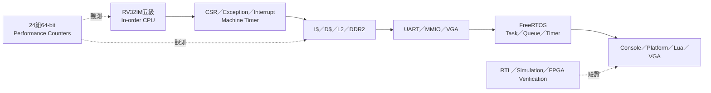
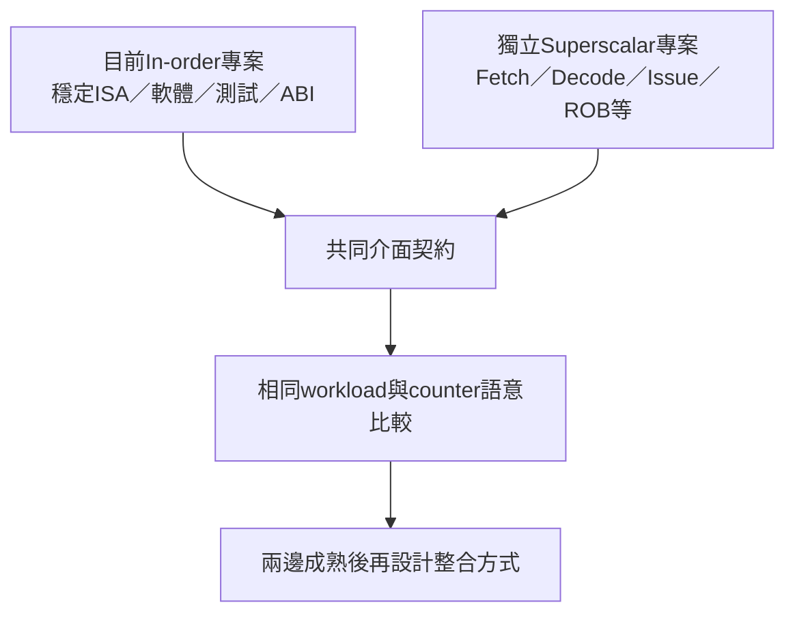
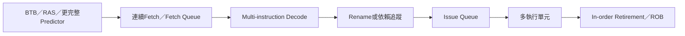

# 專案現況與後續技術路線(非主要作者或時間不足可以不考慮)

> 本頁取代早期「RTOS／DOOM準備路線」的舊評估。早期列為缺口的CSR、trap、machine timer、FreeRTOS、Lua與效能counter目前已完成；本頁只保留仍適用的未來方向。

## 1. 目前基準已完成什麼

這顆in-order CPU已適合作為：

- 自製RISC-V CPU＋FreeRTOS展示平台；
- 未來Superscalar設計的functional與performance baseline；
- UART boot、Cache、DDR、MMIO與VGA整合參考；
- 軟體、測試與counter ABI的穩定來源。

## 2. 目前專案的收尾優先順序

在擴充新硬體前，先把baseline交付條件固定：

1. `docs/`成為唯一正式文件入口；
2. 新電腦可依requirements與runner重建／上板；
3. CPU、Cache、Bootloader、RTOS與實板測試可重複；
4. 記錄當次Vivado top、defines、timing與resource；
5. 保存performance baseline與counter ABI；
6. 標記舊文件已被哪些正式文件取代；
7. 讓合作同學不依賴原作者口頭說明即可操作。

## 3. Superscalar CPU建議採獨立專案

目前策略是先在另一個專案實作Superscalar CPU，不直接把尚未穩定的新核心改進混入這個baseline。

獨立開發的優點：

- 新核心失敗不會破壞已驗證baseline；
- 可以用相同 `.mem`、probe與benchmark做差異比較；
- 容易區分是ISA correctness、memory interface還是microarchitecture問題；
- 最後整合時有兩個可獨立工作的參考點。

## 4. 兩個CPU未來整合前要固定的契約

先不討論多核心cache coherence，仍至少要固定：

| 契約            | 需要一致的內容                                        |
| --------------- | ----------------------------------------------------- |
| ISA             | RV32IM＋Zicsr、trap與misaligned／fault語意            |
| Reset／Boot     | Reset PC、UART loader、DDR image layout               |
| Memory          | DDR與MMIO address map、request／response錯誤語意      |
| Interrupt       | `mtime/mtimecmp`、machine external/software interrupt |
| Software        | startup、linker、FreeRTOS port可否共用                |
| Performance ABI | Counter index、event定義、versioning                  |
| Verification    | 相同CPU regression、RTOS image與board probe           |

如果未來兩顆CPU會同時存在於同一FPGA，而不是二選一切換，還需要額外設計：

- reset與啟動ownership；
- DDR／MMIO arbitration；
- interrupt routing；
- shared memory ordering；
- cache coherence或明確non-coherent software protocol；
- debug與performance counter歸屬。

## 5. Superscalar優先研究項目

目前in-order量測顯示frontend stall是主要瓶頸，因此新核心不應只增加後端issue width。

建議階段：

1. 先改善fetch throughput與redirect recovery；
2. 固定雙指令fetch／decode packet語意；
3. 加入依賴檢查與雙發射限制；
4. 再決定是否需要register renaming與ROB；
5. 建立precise exception與interrupt retirement；
6. 最後跑相同FreeRTOS與performance workload。

## 6. DOOM與大型軟體路線

Lua與FreeRTOS證明平台可以承載較大型software，但DOOM的主要缺口通常不是ALU，而是platform services：

| 項目            | 目前狀態                 | 若要移植DOOM                             |
| --------------- | ------------------------ | ---------------------------------------- |
| CPU／DDR／Timer | 已有                     | 量測frame time與working set              |
| VGA framebuffer | 已有基本路徑             | 評估blit、page flip與palette效率         |
| Keyboard        | 目前以UART為主           | 可先用UART，正式展示可加PS/2／USB bridge |
| Asset storage   | 無一般filesystem         | 需要將WAD嵌入image或加入SD／SPI loader   |
| Audio           | 非目前範圍               | 可先禁用，或加入PWM／I2S路徑             |
| libc／allocator | 有精簡runtime與RTOS heap | 補足DOOM實際依賴                         |

DOOM是選配的大型整合展示，不是判定CPU／RTOS專案是否完成的必要條件。加入板載I/O也應由明確application需求驅動，不需要為了「看起來完整」而加入馬達等不在範圍的周邊。

## 7. 效能研究路線

目前單一`perf test`適合驗證counter與前端瓶頸，但不足以代表所有軟體。建議建立benchmark集合：

| Workload              | 主要觀察                          |
| --------------------- | --------------------------------- |
| Tight ALU loop        | Decode／forwarding／retire吞吐    |
| Branch-heavy          | Predictor、redirect與flush        |
| MulDiv-heavy          | EX busy cycles                    |
| Sequential streaming  | Cache line與DDR bandwidth         |
| Random access         | Cache miss與DDR latency           |
| Dirty eviction        | D$ writeback與DDR write           |
| RTOS Queue／interrupt | Context switch與system overhead   |
| Lua parser／VM        | Instruction mix與memory footprint |
| VGA render            | MMIO／framebuffer與frame time     |

每個workload都應記錄cold／warm cache、clock、Cache組態與24個raw counters。

## 8. 不建議立即加入的範圍

除非研究目標改變，這個baseline暫時不需要：

- Linux、S-mode、MMU與userspace；
- 多核心cache coherence；
- 馬達控制等與展示無關的周邊；
- 為了單一demo大幅改動已驗證boot／RTOS路徑；
- 沒有benchmark證據就先擴大Cache或issue width。

這些不是沒有價值，而是會顯著擴大驗證範圍，應放在獨立研究目標中。

## 9. 建議交付里程碑

| Milestone            | 完成條件                                                              |
| -------------------- | --------------------------------------------------------------------- |
| Baseline freeze      | 文件、build、regression、board probes、performance baseline可重現     |
| Superscalar frontend | 連續fetch／redirect tests通過，吞吐優於baseline                       |
| Superscalar execute  | 雙發射依賴與結果正確，precise state定義完成                           |
| Software bring-up    | 相同裸機與FreeRTOS image能執行                                        |
| Fair comparison      | 相同workload、counter ABI、frequency與resource完整報告                |
| Integration design   | 明確選擇二選一core、同板雙core或其他結合方式，再處理ownership與一致性 |

## 10. 相關文件

- [FEATURE_STATUS.md](FEATURE_STATUS.md)：目前完成狀態。
- [PERFORMANCE_BASELINE_ANALYSIS.md](../06-verification/PERFORMANCE_BASELINE_ANALYSIS.md)：in-order基準。
- [PERFORMANCE_MONITORING_ARCHITECTURE.md](../02-memory-io/PERFORMANCE_MONITORING_ARCHITECTURE.md)：共同比較方法。
- [VERIFICATION_PLAN.md](../06-verification/VERIFICATION_PLAN.md)：功能到測試的對照。

