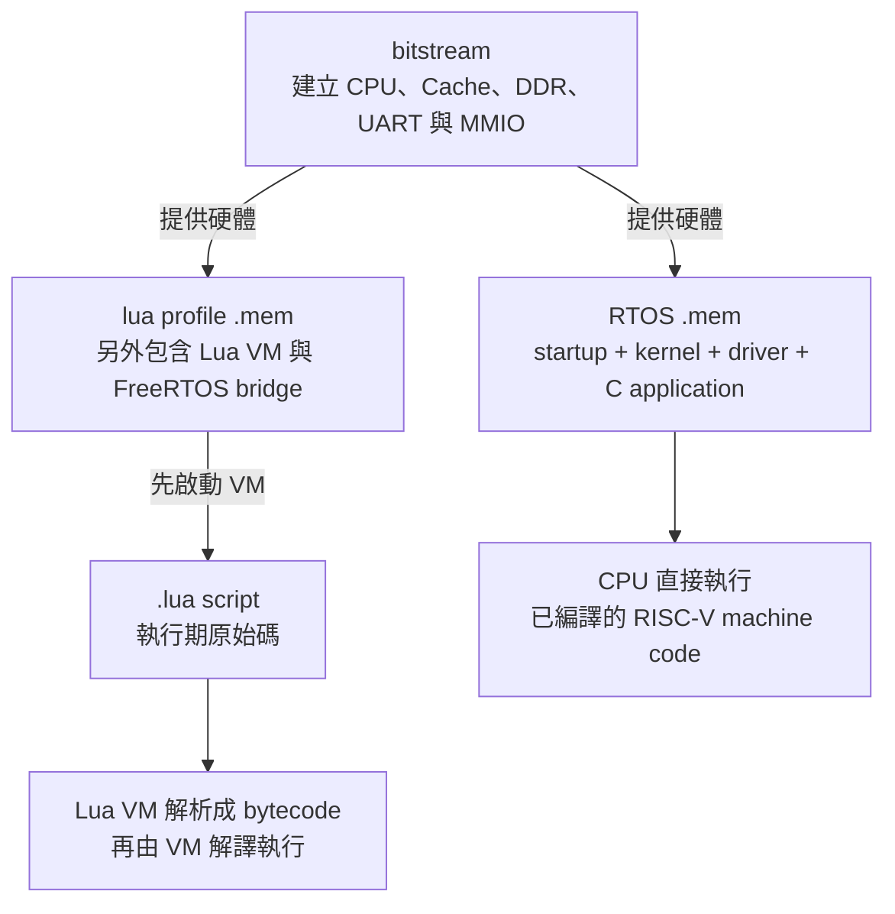
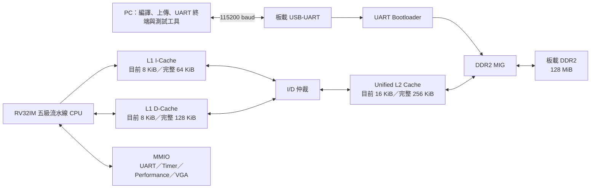
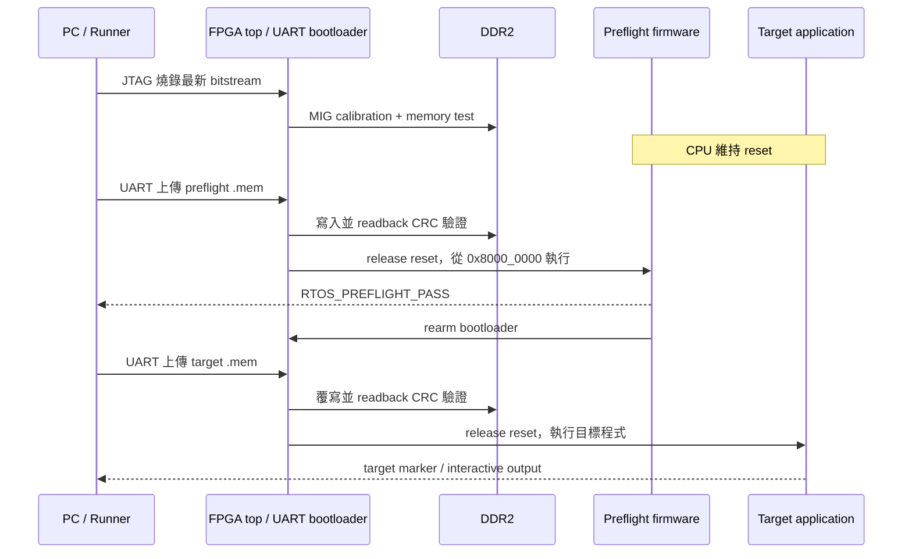

# RV32IM FPGA 處理器與 FreeRTOS／Lua 平台

> 專案概覽
> 狀態快照：2026-07-15
> 主要開發板：Digilent Nexys A7-100T
> 主要操作介面：板載 USB-UART（115200 baud）

> 不確定下一份該讀什麼時，回到 [文件閱讀中心](../README.md)；它提供整體分層圖與依角色規劃的閱讀路線。

## 1. 專案是什麼

這是一個以 Verilog 實作、可在 FPGA 實際執行程式的 32-bit RISC-V
處理器專案。處理器採用五級、順序、單發射流水線，支援
RV32IM 與 Zicsr，並整合 L1 I-Cache、L1 D-Cache、Unified L2 Cache、
DDR2 MIG、UART bootloader、machine timer、中斷／例外及 MMIO。

目前已經能在 Nexys A7-100T
實板上執行 FreeRTOS，建立多個 Task、使用 Queue 與其他同步原語，並透過
UART 操作互動式 Console。專案也移植了 Lua 5.4.8，讓使用者能在不重新產生
FPGA bitstream、甚至不重新編譯 RTOS firmware 的情況下，上傳並執行 Lua 腳本。

專案目前可以用來展示：

- 自行設計的 RISC-V CPU 在 FPGA 上執行真正的 machine code。
- Cache、DDR2、UART、timer 與 MMIO 的完整資料路徑。
- FreeRTOS preemptive scheduling、context switch、Task、Queue 與 timer interrupt。
- 透過 UART 操作的 RTOS Console 與 worker Task。
- Lua REPL、Lua 腳本上傳及 Lua 呼叫 FreeRTOS 平台 API。
- CPU 功能回歸、RTL 模擬、實板測試、Vivado timing closure。
- 24 組 64-bit 硬體效能計數器與實板瓶頸分析。

## 2. 專案目標

本專案的主要目標是建立一個「可以長期擴充、量測並比較」的處理器平台。

具體目標包括：

1. 完成一顆可執行 RV32IM C 程式的 FPGA CPU。
2. 建立從 PC 編譯、產生 `.mem`、UART 上傳到 DDR2、再開始執行的完整流程。
3. 讓 FreeRTOS 能在自製 CPU 上穩定排程與處理 timer interrupt。
4. 提供通用應用程式建置工具，而不是把 CPU 綁定在單一 demo。
5. 提供 Lua 動態腳本層，降低修改應用邏輯時重新編譯 firmware 的頻率。
6. 使用硬體計數器找出效能瓶頸，作為未來 superscalar CPU 的比較基準。

目前這顆 in-order CPU 可以視為後續處理器研究的穩定 baseline。未來若另外實作
superscalar CPU，可以沿用相同的軟體、測試程式與效能計數器語意進行比較。

## 3. 最重要的觀念：bitstream、`.mem` 與 Lua 腳本

專案中有三種容易混淆的內容：

| 類型           | 內容                                                                           | 何時需要更新                           |
| -------------- | ------------------------------------------------------------------------------ | -------------------------------------- |
| FPGA bitstream | CPU、Cache、DDR、UART、timer、MMIO 等硬體電路                                  | RTL、XDC 或 Vivado IP 改變時           |
| RTOS `.mem`    | startup、FreeRTOS kernel、driver、C application、Lua VM 等 RISC-V machine code | C／組合語言 application 或 RTOS 改變時 |
| `.lua` 腳本    | 由板上 Lua VM 解析並執行的應用邏輯                                             | 只修改 Lua 功能時                      |

三者的依賴關係可用下圖理解。由上往下是「先準備執行環境，再放入要執行的內容」；不是三種互相替代的檔案：



因此一般 C／FreeRTOS application 只需要 bitstream 與對應 `.mem`；只有要執行 Lua 腳本時，才必須先上傳含 Lua VM 的 `lua` profile `.mem`。

`.mem` 不是只有應用程式，也不是只有 FreeRTOS。以 `lua` profile 為例，一個
`rtos_lua.mem` 會包含：

- RISC-V startup code。
- FreeRTOS kernel 與官方 RISC-V port。
- 本專案的 UART、heap、mini libc 與平台支援程式。
- Lua 5.4.8 VM。
- Lua／FreeRTOS 介面。
- 建立 Task、Queue 及 REPL 的 C application。

PC 上傳的 `.lua` 則是 Lua 原始碼。Lua VM 會在 FPGA 上解析它、產生 Lua
bytecode，再由已經編譯成 RISC-V machine code 的 Lua VM 解譯執行。Lua 腳本
本身不會轉換成新的 RISC-V machine code。

FPGA configuration 與 DDR2 內容都是揮發性的。目前若完全斷電，通常需要重新
燒錄 bitstream 並重新上傳 `.mem`；Lua 腳本也需要重新傳送。若未來加入非揮發性
boot flash 或檔案系統，才可改成自動載入。

## 4. 系統架構



上圖省略部分控制訊號。實際上 bootloader、L2 與 DDR power-on test 會經由
MIG app interface 的仲裁／多工邏輯存取 DDR2。CPU 只有在 DDR 初始化及
firmware 上傳完成後才會從 reset 狀態釋放。

## 5. 處理器硬體摘要

| 項目           | 目前實作                                               |
| -------------- | ------------------------------------------------------ |
| ISA            | RV32IM + Zicsr                                         |
| 資料寬度       | 32-bit                                                 |
| 微架構         | 五級 IF／ID／EX／MEM／WB                               |
| 發射方式       | in-order、single-issue                                 |
| 相依處理       | forwarding、load-use hazard stall                      |
| 乘除法         | M extension，多週期執行                                |
| 控制流程       | branch prediction、錯誤預測 recovery redirect          |
| CSR            | machine-mode CSR、`ecall`、`mret`、illegal instruction |
| 中斷           | machine timer、software／external interrupt source     |
| L1 I-Cache     | 目前 8 KiB；完整組態 64 KiB；2-way、64-byte line       |
| L1 D-Cache     | 目前 8 KiB；完整組態 128 KiB；2-way、64-byte line      |
| Unified L2     | 目前 16 KiB；完整組態 256 KiB；2-way、64-byte line     |
| 主記憶體       | 板載 DDR2，CPU 可見容量 128 MiB                        |
| CPU／RTOS 時脈 | 50 MHz                                                 |
| 板載輸入時鐘   | 100 MHz                                                |
| 主要輸入輸出   | UART MMIO                                              |
| 可選輸出       | VGA framebuffer                                        |
| 效能觀測       | 24 組 64-bit MMIO counter                              |

主要 RTL 入口：

- `board_top.v`：Nexys A7、MIG、UART 與 CPU 的板級整合。
- `board_top_vga.v`：包含 VGA 路徑的可選 top。
- `icache_pipeline_top.v`：CPU、Cache、MMIO、trap、bootloader 與 MIG 資料路徑。
- `ID.v`、`EX.v`、`MEM.v`、`WB.v`：流水線各階段。
- `icache.v`、`dcache.v`、`L2_cache.v`：快取階層。
- `uart_bootloader.v`：UART firmware loader。

## 6. 記憶體與 MMIO 摘要

| 位址範圍／基底              | 用途                             |
| --------------------------- | -------------------------------- |
| `0x8000_0000 ~ 0x87FF_FFFF` | DDR2 主記憶體，128 MiB           |
| `0x0000_0000 ~ 0x07FF_FFFF` | DDR2 alias                       |
| `0x4000_0000 ~ 0x4000_FFFF` | MMIO 區                          |
| `0x4000_0000`               | UART TX data                     |
| `0x4000_0004`               | UART TX status                   |
| `0x4000_0008`               | UART RX data                     |
| `0x4000_000C`               | UART RX status                   |
| `0x4000_0020`               | machine timer `mtime`            |
| `0x4000_0028`               | machine timer compare `mtimecmp` |
| `0x4000_0100`               | 效能計數器 ID／控制／狀態        |
| `0x4000_0110 ~ 0x4000_01CC` | 24 組 64-bit counter             |
| `0x5000_0000`               | 可選 VGA framebuffer             |

CPU reset PC 與 UART boot address 都是 `0x8000_0000`。硬體支援完整 128 MiB
DDR 視窗；目前 FreeRTOS linker script 將單一 firmware image 限制在起始 8 MiB，
其中包含 64 KiB startup/ISR stack 與 2 MiB FreeRTOS heap。

完整配置目前記錄在 [MEMORY_MAP.md](../02-memory-io/MEMORY_MAP.md) 與
[MMIO.md](../02-memory-io/MMIO.md)。

## 7. 從上電到執行 RTOS application

一般上板流程如下：



1. 將 `board_top_rtos_rearm.bit` 燒錄到 FPGA。
2. 等待 DDR2 MIG 完成初始化。
3. `run_rtos_app.ps1` 編譯 preflight 與目標 application。
4. PC 透過 UART 上傳 `rtos_preflight.mem`。
5. preflight 啟動 FreeRTOS 並回報 `RTOS_PREFLIGHT_PASS`。
6. 系統重新進入 loader，PC 再上傳目標 `.mem`。
7. CPU 從 `0x8000_0000` 執行 startup code。
8. startup 初始化 stack、`.bss` 與 runtime。
9. application 建立 Task／Queue，啟動 FreeRTOS scheduler。
10. 工具等待目標 marker，成功後進入互動式 UART monitor。

preflight 的目的，是在正式 application 前先確認：

- FPGA bitstream 與目前 firmware 相容。
- DDR2 可寫入並執行程式。
- CPU、timer interrupt 與 FreeRTOS scheduler 能啟動。
- UART 回傳路徑正常。

上板工具預設使用 protocol v2、同步 preamble、分段傳輸、完整 CRC 驗證與自動
重試，以降低 UART 啟動時序或傳輸錯誤造成的失敗。

## 8. FreeRTOS 軟體平台

本專案保留板級與 application 相關程式，FreeRTOS kernel 與官方 RISC-V port
由外部 FreeRTOS LTS checkout 提供。建置工具可透過 `-FreeRTOSRoot` 指定位置。

目前設定：

| 項目             | 設定                                                               |
| ---------------- | ------------------------------------------------------------------ |
| Scheduling       | preemptive + time slicing                                          |
| CPU clock        | 50 MHz                                                             |
| Tick rate        | 1000 Hz（1 tick = 1 ms）                                           |
| 最大 priority 數 | 5                                                                  |
| 靜態配置         | 支援                                                               |
| 動態配置         | 支援                                                               |
| Heap             | `heap_4`，2 MiB                                                    |
| 同步與 IPC       | Queue、mutex、recursive mutex、counting semaphore、queue set       |
| 其他服務         | event group、stream buffer、software timer、task notification      |
| 診斷             | malloc failure、stack overflow、assert、exception、task statistics |

本專案的 RTOS 程式主要位於 `OS/rtos`，包括：

- startup 與 linker script。
- FreeRTOS configuration。
- UART driver。
- heap 與 freestanding mini libc。
- board control 與 application profiles。
- Lua port 與 Lua script protocol。
- 效能計數器 C API。

Application API、FreeRTOS kernel、RISC-V port、CPU pipeline與FPGA RTL之間的端到端接口，集中說明在 [RTOS 軟體 API 如何連到 CPU 與 FPGA 硬體](../04-freertos/SOFTWARE_HARDWARE_INTERFACE.md)。

## 9. 可執行的 application profiles

`tools/build_rtos_app.ps1` 提供以下 profile：

| Profile          | 用途                                                       | 主要成功標記                   |
| ---------------- | ---------------------------------------------------------- | ------------------------------ |
| `preflight`      | 上傳正式程式前的短測試                                     | `RTOS_PREFLIGHT_PASS`          |
| `smoke`          | Task、Queue 與 scheduler 基本驗證                          | `RTOS_SMOKE_PASS`              |
| `console`        | UART 互動式 RTOS application                               | `APP_READY`                    |
| `platform`       | 大型軟體移植前的 heap、同步、timer、stream 與 IRQ 綜合自測 | `RTOS_PLATFORM_PASS`           |
| `lua`            | Lua 5.4.8 REPL 與腳本服務                                  | `LUA_RTOS_READY`               |
| `vga_demo`       | 多個 Task 更新 VGA 區域                                    | `[VGA] task=L start`           |
| `vga_queue_demo` | Producer → Queue → Renderer 的 VGA pipeline                | `[PIPE] task=P producer start` |


## 10. Lua 在這個專案中的角色

Lua 不是另一個作業系統，而是運行在 FreeRTOS Task 裡的語言 runtime。

目前 `lua` profile 提供：

- Lua 5.4.8 VM。
- UART REPL。
- 最大 64 KiB 的 `.lua` 腳本上傳。
- CRC32 驗證。
- 執行 timeout、instruction limit 與 stop 命令。
- runtime／syntax error 後恢復到 REPL。
- 透過 `rtos.*` API 取得 tick、heap、Task、heartbeat 與 UART IRQ 狀態。
- `rtos.sleep()` 與 `rtos.read_line()` 等 FreeRTOS 整合功能。

Lua RX ISR、RX Task、Queue 與 Lua Task 分工處理 UART 輸入，避免直接在 ISR
執行 Lua VM。Lua VM 本身只由一個 Task 操作，降低多 Task 同時存取
`lua_State` 的風險。

## 11. 快速開始

### 11.1 基本需求

- Windows PowerShell。
- Python 3 與 serial port 支援套件。
- RISC-V bare-metal GCC toolchain。
- FreeRTOS LTS kernel checkout。
- Icarus Verilog／`vvp`，用於 RTL simulation。
- Vivado，只有重建或燒錄 bitstream 時需要。
- Nexys A7-100T 與板載 USB-UART。

目前 build script 的預設 toolchain 與 FreeRTOS 路徑是開發機路徑。其他使用者應使用
`-ToolchainBin` 和 `-FreeRTOSRoot` 覆寫，未來也可改成環境變數或自動搜尋。

### 11.2 啟動 RTOS Console

先燒錄已驗證的 bitstream：

```powershell
.\tools\program_board_bitstream.ps1
```

再編譯、執行 preflight 並上傳 Console：

```powershell
.\tools\run_rtos_app.ps1 -Port COM5 -App console
```

請將 `COM5` 改成實際序列埠。

Console 啟動後可使用：

```text
help
status
work 256
perf test 100000
reload
```

### 11.3 啟動 Lua

```powershell
.\tools\run_rtos_app.ps1 -Port COM5 -App lua
```

看到 `lua>` 後，可以輸入：

```lua
print(1 + 1)
print(_VERSION)
rtos.status()
```

也可以先按 `Ctrl+C` 關閉 PC 端 monitor，再用另一個工具上傳腳本。關閉 monitor
不會停止 FPGA 上的 FreeRTOS 或 Lua application。

```powershell
python .\tools\run_lua_script.py --port COM5 --file .\lua_apps\hello.lua
```
## 12. 驗證狀態

最近一次完整整理時，已完成下列驗證：

- RV32 pipeline regression `TEST=1..27`。
- 較長的 mixed／stress test 與多 seed 測試。
- Booth multiplier 與 restoring divider 單元測試。
- M extension decode／execute 測試。
- branch redirect scenario 測試。
- I-Cache、D-Cache、L2 與 arbitration 測試。
- UART MMIO、bootloader stall、split-ready 與 large CRC 測試。
- 24 組 64-bit 效能計數器的 clear、start、stop、snapshot 與 overflow 測試。
- FreeRTOS smoke、preflight、Console、Platform 與 Lua RTL simulation。
- 實板 preflight、Console、Platform、Lua REPL、腳本上傳及效能測試。
- Vivado implementation timing closure。

測試通過代表目前已測範圍內的功能具有可信基準，但不等於數學上證明 CPU 完全
無錯。專案目前尚未完成全面 formal verification 或與 Spike 的逐指令差分測試；
這些可作為未來更高強度的驗證工作。

## 13. FPGA 實作與效能基準

目前已驗證的 production bitstream：

- 檔案：`build_fpga/board_top_rtos_rearm.bit`
- SHA-256：`30890F6F3F3DB089DFE0A50D0290D03CB7B539CD09B66942D33B895E405141CB`
- Core clock：50 MHz

Vivado implementation 結果：

| 指標           |                       結果 |
| -------------- | -------------------------: |
| Setup WNS      |                  +0.202 ns |
| Hold WHS       |                  +0.015 ns |
| Routing errors |                          0 |
| Slice LUT      |  27,158 / 63,400（42.84%） |
| Slice FF       | 17,746 / 126,800（14.00%） |
| BRAM tile      |         16 / 135（11.85%） |
| DSP            |                          0 |

RTOS Console 執行 `perf test 100000` 的其中一次實板結果：

| 指標                   |          結果 |
| ---------------------- | ------------: |
| Cycles                 |     5,791,940 |
| Retired instructions   |     1,085,672 |
| IPC                    |         0.187 |
| CPI                    |      約 5.335 |
| Front-end stall        |         77.6% |
| Backend stall          |          4.3% |
| Control-flow miss rate |     約 0.787% |
| I-Cache miss           | 5 / 1,088,998 |
| DDR read commands      |            16 |

這組數據顯示目前主要瓶頸是 front-end fetch throughput，而不是 I-Cache miss、
D-Cache 或 DDR bandwidth。現行阻塞式 fetch request／response 與 `if_pending`
使 I-Cache hit 仍無法穩定做到每 cycle 提供一條指令。

這個結論只代表該內建 workload，不應直接推廣到所有程式。未來可以加入
streaming、random access、branch-heavy 與 Lua workload，建立更完整的 benchmark
集合。

效能計數器 ABI 與完整結果見：

- [PERFORMANCE_COUNTER_REGISTERS.md](../02-memory-io/PERFORMANCE_COUNTER_REGISTERS.md)
- [PERFORMANCE_MONITORING_ARCHITECTURE.md](../02-memory-io/PERFORMANCE_MONITORING_ARCHITECTURE.md)
- [PERFORMANCE_BASELINE_ANALYSIS.md](../06-verification/PERFORMANCE_BASELINE_ANALYSIS.md)

## 14. Repository 目錄導覽

```text
cpu_design/
├─ *.v                         CPU、Cache、MMIO 與 testbench RTL
├─ board_top.v                 主要 FPGA top
├─ board_top_vga.v             可選 VGA top
├─ OS/rtos/                    FreeRTOS 設定、BSP、driver 與 applications
├─ third_party/lua-5.4.8/      Lua 5.4.8 原始碼
├─ lua_apps/                   可上傳的 Lua 範例腳本
├─ game/                       裸機／VGA 遊戲與 framebuffer 程式
├─ tools/                      build、simulation、upload、probe 工具
├─ TEST_FILES/                 CPU regression 的 .mem 測試程式
├─ docs/                       重新整理後的正式文件
├─ spec/                       I-Cache、D-Cache 與 L2 Cache 完整設計規格
└─ build_*/                    可重新產生的建置與模擬輸出
```

`build_*`、`__pycache__` 與 Vivado 暫存檔已由 `.gitignore` 排除。
## 15. 已知限制

- 目前主要運行 machine mode，沒有 MMU、虛擬記憶體或 Linux userspace。
- FreeRTOS kernel 目前是外部依賴，尚未完全封裝成一鍵下載依賴。
- FPGA bitstream、DDR firmware 與 Lua 腳本在完全斷電後都需要重新載入。
- 沒有持久化檔案系統；Lua 腳本目前由 UART 傳入 DDR。
- UART 是主要 debug 與互動介面；VGA 是可選輸出，沒有 VGA 螢幕也不影響主要功能。
- I-Cache hit path 的取指吞吐量是目前最明顯的效能瓶頸。
- I-Cache／D-Cache 架構未以自修改程式為主要使用情境。
- 目前驗證完整度適合作為專案與研究 baseline，但尚未達到商用 CPU 的
  formal／coverage／differential verification 等級。

## 16. 建議閱讀順序

第一次接觸本專案時，建議按照以下順序：

1. 本文件：理解整體目標與系統邊界。
2. [BOARD_OPERATION_GUIDE.md](BOARD_OPERATION_GUIDE.md)：依照單一手冊完成bitstream、`.mem`、Probe、Lua與VGA上板操作。
3. 根目錄 [README.md](../../README.md)：查看目前常用命令。
4. [MEMORY_MAP.md](../02-memory-io/MEMORY_MAP.md) 與 [MMIO.md](../02-memory-io/MMIO.md)：理解 DDR 與 MMIO。
5. [REQUIREMENTS.md](../03-build-boot/REQUIREMENTS.md) 與 [BUILD_FLOW.md](../03-build-boot/BUILD_FLOW.md)：準備環境並理解產物。
6. [PROGRAM_FPGA.md](../03-build-boot/PROGRAM_FPGA.md) 與 [RTOS_APP_RUNNER.md](../03-build-boot/RTOS_APP_RUNNER.md)：深入理解燒錄硬體與執行不同 `.mem` 的內部流程。
7. [RTOS_CONCEPTS.md](../04-freertos/RTOS_CONCEPTS.md)：第一次接觸RTOS時，先理解Task、Scheduler、Blocking、Interrupt與同步物件。
8. [SOFTWARE_HARDWARE_INTERFACE.md](../04-freertos/SOFTWARE_HARDWARE_INTERFACE.md)：用Queue、Delay、UART、VGA與Lua例子理解API如何連到CPU與FPGA RTL。
9. [FREERTOS_PORT_ARCHITECTURE.md](../04-freertos/FREERTOS_PORT_ARCHITECTURE.md) 與 [CONTEXT_SWITCH.md](../04-freertos/CONTEXT_SWITCH.md)：理解 kernel 如何在這顆 CPU 上啟動與切換 Task。
10. [TICK_INTERRUPT.md](../04-freertos/TICK_INTERRUPT.md) 與 [TASK_QUEUE.md](../04-freertos/TASK_QUEUE.md)：理解排程時間來源與 Task 間傳遞資料的方法。
11. [HEAP_AND_STACK.md](../04-freertos/HEAP_AND_STACK.md) 與 [FREERTOS_API_EXAMPLES.md](../04-freertos/FREERTOS_API_EXAMPLES.md)：開始撰寫自己的 RTOS application。
12. [APPLICATION_SYSTEM_ARCHITECTURE.md](../05-applications/APPLICATION_SYSTEM_ARCHITECTURE.md) 與 [APPLICATION_RTOS_INTERACTION.md](../05-applications/APPLICATION_RTOS_INTERACTION.md)：理解 C application、FreeRTOS、driver 與 Lua 的完整分層和資料流。
13. [CONSOLE_APP.md](../05-applications/CONSOLE_APP.md)、[PLATFORM_APP.md](../05-applications/PLATFORM_APP.md) 與 [VGA_RTOS_DEMOS.md](../05-applications/VGA_RTOS_DEMOS.md)：理解現有application與展示架構。
14. [LUA_ARCHITECTURE.md](../05-applications/LUA_ARCHITECTURE.md)、[LUA_FREERTOS_BRIDGE.md](../05-applications/LUA_FREERTOS_BRIDGE.md) 與 [LUA_SCRIPT_UPLOAD.md](../05-applications/LUA_SCRIPT_UPLOAD.md)：理解並操作 Lua 平台。
15. [LUA_APP_EXAMPLES.md](../05-applications/LUA_APP_EXAMPLES.md)：撰寫可上傳的 Lua 應用。
16. [RTOS_APPLICATION_API_GUIDE.md](../05-applications/RTOS_APPLICATION_API_GUIDE.md)、[RTOS_PLATFORM_API_REFERENCE.md](../05-applications/RTOS_PLATFORM_API_REFERENCE.md)、[RTOS_PLATFORM_API_PARAMETER_GUIDE.md](../05-applications/RTOS_PLATFORM_API_PARAMETER_GUIDE.md) 與 [ADDING_NEW_RTOS_APP.md](../05-applications/ADDING_NEW_RTOS_APP.md)：選擇API、確認目前可用性與參數，再加入新的C/FreeRTOS application。
17. [PERFORMANCE_MONITORING_ARCHITECTURE.md](../02-memory-io/PERFORMANCE_MONITORING_ARCHITECTURE.md)、[PERFORMANCE_COUNTER_REGISTERS.md](../02-memory-io/PERFORMANCE_COUNTER_REGISTERS.md) 與 [PERFORMANCE_BASELINE_ANALYSIS.md](../06-verification/PERFORMANCE_BASELINE_ANALYSIS.md)：量測CPU並判斷瓶頸。

早期 `explain_files_md` 報告的有效內容已納入 `docs/`；舊檔名與正式文件的逐項對照見 [LEGACY_DOCUMENT_MIGRATION.md](../LEGACY_DOCUMENT_MIGRATION.md)，原稿可從 Git history 追溯。

## 17. 後續可擴充方向

- 將 I-Cache hit path 流水化或加入 fetch queue。
- 建立可重複的 CPU benchmark suite。
- 加入 Spike／QEMU differential testing。
- 加入 formal verification 與 coverage 統計。
- 將 build toolchain 與 FreeRTOS 依賴改成環境變數或自動安裝流程。
- 加入非揮發性 boot、SD card 或 SPI flash 儲存。
- 增加板載 LED、switch、button 等 MMIO driver。
- 另建 superscalar CPU，沿用相同 software image、測試與 counter ABI 作比較。
- 最後評估 in-order 與 superscalar core 的整合或切換架構。

本文件描述的是目前已實作並經過驗證的主線。若 RTL、記憶體映射、clock、
FreeRTOS configuration 或上板工具發生變更，應同步更新本文件的狀態快照與規格。
