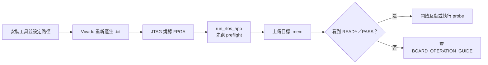

# 快速開始

> 目標：讓第一次接觸專案的人完成環境檢查、燒錄 FPGA、上傳 RTOS Console，
> 並確認 CPU、DDR2、FreeRTOS 與 UART 正常工作。

> 所有上板指令、執行時機、Monitor／`Ctrl+C`、application切換、Probe、Lua與VGA操作已集中在 [BOARD_OPERATION_GUIDE.md](BOARD_OPERATION_GUIDE.md)。合作與交接時請優先使用該文件。

> 若要先理解整份文件如何分層，請回到 [文件閱讀中心](../README.md)；本頁只處理第一次建立環境與跑通系統。

## 快速流程圖



已經完成環境設定的人只需要第 1 節；第一次安裝才需要繼續閱讀第 2～8 節。

## 1. 最短操作流程

如果開發環境已經安裝完成，只需要：

```powershell
cd C:/cpu_design

$Port = "COM5"
$FreeRTOSRoot = "C:/path/to/FreeRTOS-Kernel"
$ToolchainBin = "C:/path/to/riscv-none-elf-gcc/bin"
$VivadoBat = "C:/Xilinx/Vivado/2020.2/bin/vivado.bat"

./tools/program_board_bitstream.ps1 -VivadoBat $VivadoBat
./tools/run_rtos_app.ps1 -Port $Port -App console -FreeRTOSRoot $FreeRTOSRoot -ToolchainBin $ToolchainBin
```

看到以下文字代表主流程成功：

```text
RTOS_PREFLIGHT_PASS
APP_READY
RTOS Console ready. Type 'help'.
```

接著輸入：

```text
help
status
work 256
perf test 100000
```

如果這些命令都有合理輸出，即完成第一次上板驗證。

## 2. 硬體需求

- Digilent Nexys A7-100T。
- 可傳資料的 USB 線。
- Windows PC。
- 不需要額外 USB-TTL；使用板載 USB-UART。
- 不需要 VGA 螢幕；主要流程全部可以使用 UART。

如果要執行 `vga_demo` 或 `vga_queue_demo`，才需要 VGA 顯示設備與對應
`board_top_vga.v` bitstream。

## 3. 軟體需求

| 工具                  | 目前已驗證用途                   | 備註                                     |
| --------------------- | -------------------------------- | ---------------------------------------- |
| Git                   | 取得與更新專案                   | 一般版本即可                             |
| Windows PowerShell    | 執行 `.ps1` 工具                 | Windows PowerShell 5.1 或新版 PowerShell |
| Python 3              | UART runner、probe、Lua uploader | 需安裝 `pyserial`                        |
| RISC-V bare-metal GCC | 編譯 RV32IM firmware             | 目前使用 xPack `riscv-none-elf-gcc`      |
| FreeRTOS LTS kernel   | kernel 與官方 RISC-V port        | 目前使用 202406.04-LTS                   |
| Vivado                | 燒錄／重建 FPGA bitstream        | 目前腳本預設 2020.2                      |
| Icarus Verilog        | 執行 RTL simulation              | 只做實板快速開始時可暫不安裝             |

Lua 5.4.8 已放在 `third_party/lua-5.4.8`，不需要另外下載 Lua。

## 4. 取得專案

```powershell
git clone https://github.com/codyhsiao07/cpu_design.git
cd cpu_design
git status
```

第一次操作前，建議不要修改或刪除：

- `build_fpga/board_top_rtos_rearm.bit`
- `OS/rtos`
- `third_party/lua-5.4.8`
- `tools`
- `TEST_FILES`

`build_*` 的一般編譯輸出可以重新產生。

## 5. 安裝 Python UART 套件

```powershell
python -m pip install pyserial
python -c "import serial; print(serial.__version__)"
```

如果第二行能輸出版本號，代表 Python UART 套件可用。

常見錯誤：

```text
pyserial not found. Install with: pip install pyserial
```

發生時請確認 `pip` 與執行工具時的 `python` 是同一套 Python。

## 6. 準備 RISC-V Toolchain

RISC-V Toolchain 是一組在 Windows 上執行、但會替 FPGA 內 RISC-V CPU 產生 machine code 的工具。它不是燒錄器，也不是 FreeRTOS；它負責把 C／組合語言編譯成之後可轉為 `.mem` 的程式。

| 工具                         | 用途                                     |
| ---------------------------- | ---------------------------------------- |
| `riscv-none-elf-gcc.exe`     | 編譯並 link，產生 `.elf`                 |
| `riscv-none-elf-objcopy.exe` | 從 `.elf` 取出 machine code，產生 `.bin` |
| `riscv-none-elf-objdump.exe` | 產生可閱讀的反組譯 `.dis`                |

### 6.1 下載正確的 Windows ZIP

1. 開啟 [xPack 官方 GitHub Releases](https://github.com/xpack-dev-tools/riscv-none-elf-gcc-xpack/releases)。
2. 展開 release 的 **Assets**。
3. 下載 Windows x64 ZIP，檔名類似：

   ```text
   xpack-riscv-none-elf-gcc-15.2.0-1-win32-x64.zip
   ```

4. 不要下載 `Source code (zip)`；它不包含可直接執行的 Windows 編譯器。

目前專案已用 xPack GNU RISC-V Embedded GCC 15.2.0 驗證。其他版本不一定不能使用，但第一次安裝建議先和已驗證版本保持一致。

### 6.2 完整解壓到預設位置

這個套件沒有安裝精靈。將整個版本資料夾解壓後移到 `C:\riscv`，再把資料夾名稱整理為 `xpack-riscv-none-elf-gcc`。最後應看到：

```text
C:\riscv\
└─ xpack-riscv-none-elf-gcc\
   ├─ bin\
   │  ├─ riscv-none-elf-gcc.exe
   │  ├─ riscv-none-elf-objcopy.exe
   │  └─ riscv-none-elf-objdump.exe
   ├─ include\
   ├─ lib\
   └─ ...
```

不要只複製三個 `.exe`；編譯時還會用到同一個工具鏈目錄內的 libraries 與其他檔案。

### 6.3 設定本次 PowerShell 使用的路徑

```powershell
$ToolchainBin = "C:/riscv/xpack-riscv-none-elf-gcc/bin"
```

這一行只建立名為 `$ToolchainBin` 的 PowerShell 變數，方便後續命令引用路徑；它本身不會下載或安裝任何東西。

如果解壓在其他位置，請將變數改成**實際包含 `.exe` 的 `bin` 資料夾**，例如：

```powershell
$ToolchainBin = "D:/tools/xpack-riscv-none-elf-gcc/bin"
```

### 6.4 確認檔案與版本

先檢查三個必要工具是否都在正確位置：

```powershell
Test-Path "$ToolchainBin/riscv-none-elf-gcc.exe"
Test-Path "$ToolchainBin/riscv-none-elf-objcopy.exe"
Test-Path "$ToolchainBin/riscv-none-elf-objdump.exe"
```

三行都必須顯示 `True`。接著確認三個程式可以啟動：

```powershell
& "$ToolchainBin/riscv-none-elf-gcc.exe" --version
& "$ToolchainBin/riscv-none-elf-objcopy.exe" --version
& "$ToolchainBin/riscv-none-elf-objdump.exe" --version
```

`&` 是 PowerShell 用來執行字串路徑中程式的符號。只要三行都有顯示版本資訊且沒有紅色錯誤，toolchain 就準備完成。

### 6.5 PATH 與 `-ToolchainBin` 的差別

本專案**不要求**把工具鏈永久加入 Windows `PATH`。只要使用預設位置，build script 會直接找到它；若安裝位置不同，執行 build 或 runner 時傳入：

```powershell
-ToolchainBin $ToolchainBin
```

例如：

```powershell
./tools/run_rtos_app.ps1 `
  -Port COM5 `
  -App console `
  -FreeRTOSRoot $FreeRTOSRoot `
  -ToolchainBin $ToolchainBin
```

要在目前 PowerShell 視窗直接輸入 `riscv-none-elf-gcc`，才需要暫時加入 PATH：

```powershell
$env:Path = "$ToolchainBin;$env:Path"
riscv-none-elf-gcc --version
```

關閉視窗後這個暫時 PATH 會失效，但不影響使用 `-ToolchainBin` 的專案命令。

目前 firmware 的目標架構為：

```text
-march=rv32im_zicsr
-mabi=ilp32
```

因此即使下載檔名包含 `win32-x64`，也只是表示工具在 64-bit Windows 上執行；輸出的程式仍是本專案需要的 RV32。

若任一步驟失敗，或解壓後的目錄層級不同，請看 [REQUIREMENTS.md 的完整 Toolchain 安裝與排錯說明](../03-build-boot/REQUIREMENTS.md)。

## 7. 準備 FreeRTOS LTS

專案沒有把完整 FreeRTOS kernel 複製進 repository。請下載 FreeRTOS LTS，並將
`$FreeRTOSRoot` 指向包含 `tasks.c`、`queue.c`、`portable` 與 `include` 的
`FreeRTOS-Kernel` 目錄。

範例：

```powershell
$FreeRTOSRoot = "C:/FreeRTOSv202406.04-LTS/FreeRTOS-LTS/FreeRTOS/FreeRTOS-Kernel"
Test-Path "$FreeRTOSRoot/tasks.c"
Test-Path "$FreeRTOSRoot/portable/GCC/RISC-V/port.c"
```

兩行都應回傳 `True`。

## 8. 找到 FPGA 的 COM Port

接上開發板並開機後，可以使用：

```powershell
Get-CimInstance Win32_SerialPort | Select-Object DeviceID, Name
```

或者在 Windows 裝置管理員查看「連接埠（COM 和 LPT）」。

設定：

```powershell
$Port = "COM5"
```

請用實際看到的埠號取代 `COM5`。同一時間只能有一個程式開啟該 COM port；
請先關閉 PuTTY、Tera Term、Arduino Serial Monitor 或其他 UART 工具。

## 9. 燒錄 production bitstream


如果 Vivado Hardware Manager 找不到 FPGA，請確認：

- 板子電源已開啟。
- USB 線支援資料傳輸。
- Digilent cable driver 已安裝。
- 沒有另一個 Vivado process 占用 hardware server。

## 10. 第一次執行 RTOS Console

```powershell
./tools/run_rtos_app.ps1 -Port $Port -App console -FreeRTOSRoot $FreeRTOSRoot -ToolchainBin $ToolchainBin
```

這個工具會自動：

1. 編譯 `preflight`。
2. 編譯 `console`。
3. 等待 DDR2／bootloader。
4. 上傳 `rtos_preflight.mem`。
5. 等待 `RTOS_PREFLIGHT_PASS`。
6. 要求系統回到 bootloader。
7. 上傳 `rtos_console.mem`。
8. 等待 `APP_READY`。
9. 進入互動式 UART monitor。

常見成功輸出：

```text
Uploading RTOS preflight...
RTOS_PREFLIGHT_PASS
Uploading RTOS target...
APP_READY
RTOS Console ready. Type 'help'.
```

## 11. Console 基本命令

| 命令               | 用途                                           |
| ------------------ | ---------------------------------------------- |
| `help`             | 顯示命令列表                                   |
| `ping`             | 確認 command Task 回應                         |
| `status`           | 顯示 tick、heap、Queue 與 runtime counters     |
| `tasks`            | 顯示固定 Task 與角色                           |
| `echo hello`       | 經 command Task 回傳字串                       |
| `work 256`         | 把 256 次 workload 透過 Queue 交給 worker Task |
| `perf show`        | 不停止 live counters，取得 snapshot            |
| `perf raw`         | 顯示 24 組原始 counter                         |
| `perf test 100000` | 執行內建 workload 並分析效能                   |
| `reload`           | 離開目前 application，回到 UART bootloader     |

第一次測試建議：

```text
ping
status
tasks
work 256
perf test 100000
```

成功的 `work 256` 會先排入 worker Queue，再等待 worker Task 回傳結果。這證明
不是 command Task 自己直接完成所有運算。

## 12. 執行 Platform 綜合自測

關閉目前 monitor，重新執行：

```powershell
./tools/run_rtos_app.ps1 -Port $Port -App platform -FreeRTOSRoot $FreeRTOSRoot -ToolchainBin $ToolchainBin
```

成功標記：

```text
RTOS_PLATFORM_PASS
```

Platform 會測試 heap、mutex、semaphore、queue set、event group、stream buffer、
software timer、Task diagnostics 與 UART RX interrupt，適合作為移植大型軟體前的
平台檢查。

可另外執行：

```powershell
python ./tools/rtos_platform_probe.py --port $Port
```

執行 probe 前必須先關閉占用 COM port 的互動式 monitor。

## 13. 執行 Lua

```powershell
./tools/run_rtos_app.ps1 -Port $Port -App lua -FreeRTOSRoot $FreeRTOSRoot -ToolchainBin $ToolchainBin
```

Lua 啟動時間比一般 application 長，工具會自動使用較長 timeout。成功時會看到：

```text
LUA_SELFTEST_PASS
LUA_RTOS_READY
lua>
```

可以直接輸入：

```lua
print(1 + 1)
print(_VERSION)
rtos.status()
```

## 14. 上傳 Lua 腳本

`run_rtos_app.ps1` 正在互動監控時會占用 COM port。先按 `Ctrl+C` 結束 PC 端
monitor；這只會關閉電腦上的工具，不會停止 FPGA 上的 Lua／FreeRTOS。

再執行：

```powershell
python ./tools/run_lua_script.py --port $Port --file ./lua_apps/hello.lua
```

成功標記：

```text
LUA_SCRIPT_ACCEPTED
LUA_SCRIPT_START
LUA_SCRIPT_PASS
```

互動式猜數字：

```powershell
python ./tools/run_lua_script.py --port $Port --file ./lua_apps/guess_number.lua --interactive --timeout-ms 600000 --instruction-limit 5000000
```

查詢或停止正在執行的腳本：

```powershell
python ./tools/run_lua_script.py --port $Port --status
python ./tools/run_lua_script.py --port $Port --stop
```

## 15. 只做 RTL Simulation

沒有 FPGA 板時，仍可執行部分測試。需要 RISC-V toolchain、FreeRTOS kernel、
Icarus Verilog 與 `vvp`。

基本測試：

```powershell
$env:PATH = "$ToolchainBin;$env:PATH"
make uart-mmio-tb
make perf-counter-tb
```

RTOS Console：

```powershell
./tools/run_rtos_console_sim.ps1 -FreeRTOSRoot $FreeRTOSRoot
```

Lua：

```powershell
./tools/run_rtos_lua_sim.ps1 -FreeRTOSRoot $FreeRTOSRoot
```

simulation 比 50 MHz 實板慢很多，不適合用牆上時間直接比較效能。

## 16. 建立自己的 RTOS Application

準備一個包含 `main()` 的 C 檔，例如：

```text
OS/rtos/src/main_my_app.c
```

執行：

```powershell
./tools/run_rtos_app.ps1 -Port $Port -MainSource OS/rtos/src/main_my_app.c -OutName rtos_my_app -TargetMarker MY_APP_READY -FreeRTOSRoot $FreeRTOSRoot -ToolchainBin $ToolchainBin
```

application 必須在初始化完成後輸出：

```text
MY_APP_READY
```

如果還有額外 driver，可以加入：

```powershell
-ExtraSource drivers/my_driver.c
```

build script 會自動加入 startup、UART、performance counter、heap、mini libc、
FreeRTOS kernel 與官方 RISC-V port。

## 17. 上傳既有 `.mem`

如果已經有另一個相容 RTOS image：

```powershell
./tools/run_rtos_app.ps1 -Port $Port -Mem C:/path/to/application.mem -TargetMarker APPLICATION_READY -FreeRTOSRoot $FreeRTOSRoot -ToolchainBin $ToolchainBin
```

工具仍會先建置並執行 preflight，再切換到指定 image。

## 18. 常見問題

### `Access is denied` 或 COM port busy

另一個 terminal／Python process 正在占用 COM port。關閉它後重試。

### 找不到 RISC-V GCC

傳入正確的 `-ToolchainBin`，並確認該資料夾內有
`riscv-none-elf-gcc.exe`、`objcopy` 與 `objdump`。

### 找不到 FreeRTOS 檔案

`-FreeRTOSRoot` 必須指向 `FreeRTOS-Kernel` 本身，不是它的上一層。

依序檢查：

1. 重新燒錄 `board_top_rtos_rearm.bit`。
2. 確認 baud 是 115200。
3. 確認 COM port 正確且未被占用。
4. 確認板子已完成 DDR 初始化，重新執行工具。
5. 必要時按板上 reset，再重試。
6. 查看 runner 輸出是否已進入自動 retry。

### 按 `Ctrl+C` 後 FPGA 是否停止？

不會。`Ctrl+C` 通常只停止 PC 端 Python／PowerShell monitor。FPGA 上的 CPU、
FreeRTOS Task 與 Lua VM 仍然繼續執行。


下一步：

- [PROJECT_OVERVIEW.md](PROJECT_OVERVIEW.md)
- [FEATURE_STATUS.md](FEATURE_STATUS.md)
- [SYSTEM_BLOCK_DIAGRAM.md](SYSTEM_BLOCK_DIAGRAM.md)
- [FREERTOS_PORT_ARCHITECTURE.md](../04-freertos/FREERTOS_PORT_ARCHITECTURE.md)
- [FREERTOS_API_EXAMPLES.md](../04-freertos/FREERTOS_API_EXAMPLES.md)
- [APPLICATION_SYSTEM_ARCHITECTURE.md](../05-applications/APPLICATION_SYSTEM_ARCHITECTURE.md)
- [LUA_ARCHITECTURE.md](../05-applications/LUA_ARCHITECTURE.md)
- [ADDING_NEW_RTOS_APP.md](../05-applications/ADDING_NEW_RTOS_APP.md)
