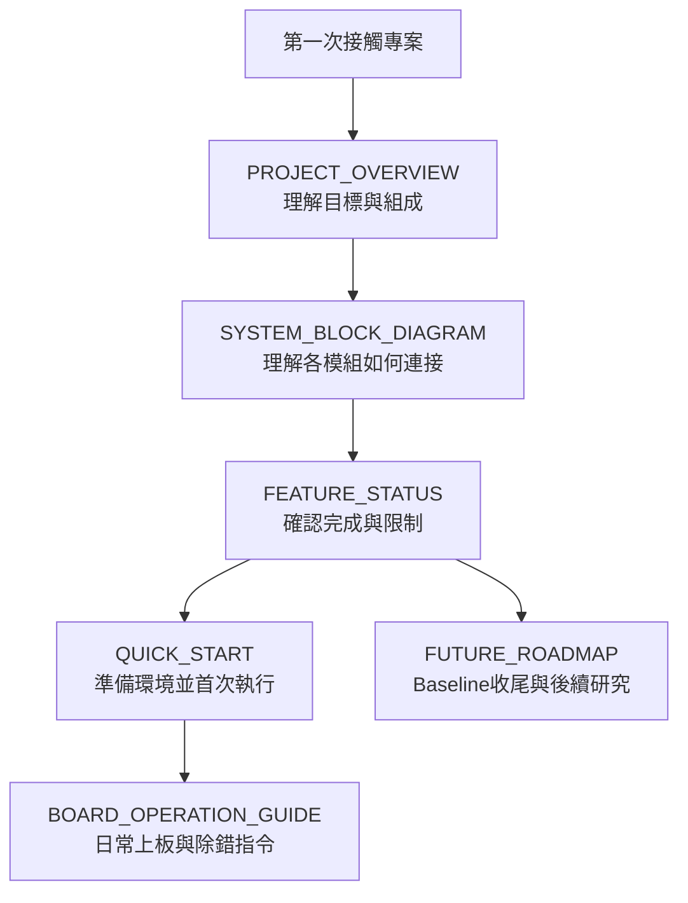

# 00 — 專案總覽導覽

> 這個資料夾是所有讀者的第一站。它只負責回答「專案是什麼、目前做到哪裡、如何開始與上板」，深入實作請再進入其他資料夾。

## 一張圖看主要文件的分工

## 建議閱讀順序

| 順序 | 文件 | 讀完應該知道什麼 | 可以何時停止 |
|---:|---|---|---|
| 1 | [PROJECT_OVERVIEW.md](PROJECT_OVERVIEW.md) | 系統目標、軟硬體分層、`.bit/.mem/.lua` | 只想知道專案內容時 |
| 2 | [SYSTEM_BLOCK_DIAGRAM.md](SYSTEM_BLOCK_DIAGRAM.md) | CPU、Cache、DDR、RTOS、Application 的連接 | 要開始選擇修改位置時 |
| 3 | [FEATURE_STATUS.md](FEATURE_STATUS.md) | 已完成、部分完成與已知限制 | 評估可否使用某功能時 |
| 4 | [QUICK_START.md](QUICK_START.md) | 工具安裝與第一次跑通 | 新電腦環境已建立時 |
| 5 | [BOARD_OPERATION_GUIDE.md](BOARD_OPERATION_GUIDE.md) | 每條上板指令、輸入時機、切換程式與錯誤處理 | 日常操作時把它當查詢手冊 |
| 6 | [FUTURE_ROADMAP.md](FUTURE_ROADMAP.md) | 目前baseline、Superscalar、DOOM與整合方向 | 規劃後續研究時 |

## 依問題直接前往

| 問題 | 文件 |
|---|---|
| 這是一顆什麼 CPU？ | `PROJECT_OVERVIEW` |
| 一份 `.mem` 裡有什麼？ | `PROJECT_OVERVIEW` → `05-applications` |
| 現在有哪些功能真的驗證過？ | `FEATURE_STATUS` |
| 新同學第一次如何建立環境？ | `QUICK_START` |
| 現在到底該輸入哪條指令？ | `BOARD_OPERATION_GUIDE` |
| 想看完整訊號與模組連接？ | `SYSTEM_BLOCK_DIAGRAM` |
| 接下來做Superscalar或大型軟體？ | `FUTURE_ROADMAP` |

上一層：[文件閱讀中心](../README.md)
