# 系統方塊圖

> 本文件以多個視角說明硬體、啟動流程、CPU pipeline、FreeRTOS 與 Lua
> 如何連接。圖中省略位元寬度與部分握手訊號，實際 RTL 仍以原始碼為準。

## 1. 圖例與閱讀方式

| 類型 | 意義 |
|---|---|
| PC／Host | 在 Windows 上執行的編譯、上傳與 UART 工具 |
| FPGA hardware | Verilog RTL、Vivado IP 與板載介面 |
| Firmware | 編譯到 `.mem` 裡的 RISC-V machine code |
| Runtime script | UART 傳入、由 Lua VM 解譯的 `.lua` |
| 實線箭頭 | 主要資料或控制流 |
| 雙向箭頭 | request／response 或 TX／RX |

## 2. 系統最上層

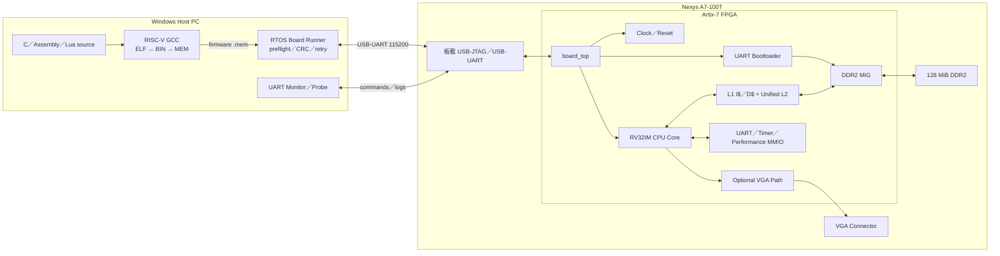

最重要的分界：

- Host PC 負責編譯、上傳與顯示 UART 文字。
- FPGA bitstream 定義 CPU 與周邊硬體。
- `.mem` 定義 CPU 接下來要執行的 firmware。
- DDR2 保存目前上傳的 firmware、stack、heap 與 application data。

## 3. Clock 與 Reset

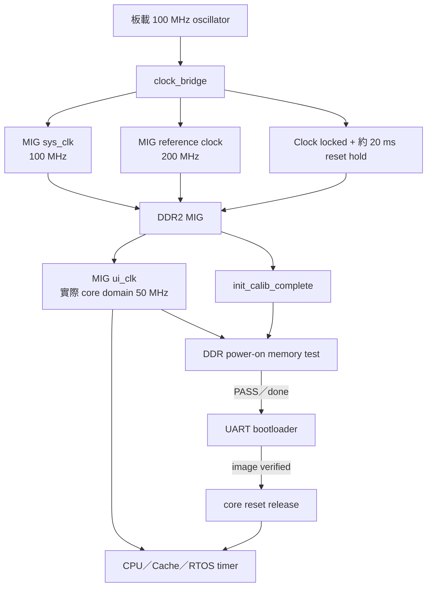

時鐘重點：

- 板載輸入是 100 MHz。
- MIG 使用內部產生的 system／reference clocks。
- production 路徑中的 CPU、L2、bootloader 與 RTOS timer 最終運行在
  MIG `ui_clk` domain；目前實板確認為 50 MHz。
- `FreeRTOSConfig.h` 與 UART baud generator 都使用 50 MHz 設定。
- CPU 只有在 clock lock、MIG calibration、DDR memory test 與 image upload
  條件成立後才離開 reset。

主要檔案：

- `clock_bridge.v`
- `board_top.v`
- `icache_pipeline_top.v`

## 4. DDR2 存取擁有者與優先順序

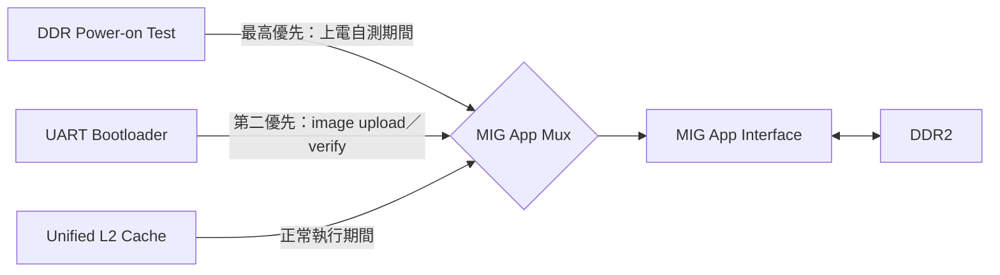

RTL 優先順序：

```text
memory test → UART bootloader → L2
```

因此：

1. DDR 自測期間，CPU 不會執行 application。
2. bootloader 上傳期間，L2 不應與 loader 同時操作 DDR。
3. image 驗證完成後，bootloader 交回 MIG，CPU 才能透過 L2 正常存取 DDR。
4. application 呼叫 `reload` 時，rearm 邏輯重新取得 bootloader 控制權。

bootloader 與 power-on memory test 發生在 core reset 期間，因此不計入
application 的 DDR performance counters。

## 5. CPU Pipeline

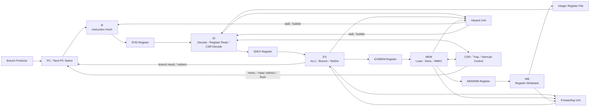

各階段：

| 階段 | 主要工作 |
|---|---|
| IF | 取得 PC、發出 I-Cache request、接收 instruction |
| ID | decode、讀 register、產生 control、CSR／illegal 判斷 |
| EX | ALU、branch compare／target、乘除法、effective address |
| MEM | D-Cache／MMIO request、等待 response、load data |
| WB | 將 ALU／load／CSR 結果寫回 integer register |

目前主要效能瓶頸位於 IF 與 I-Cache hit request／response 的吞吐。即使 I-Cache
hit，阻塞式 `if_pending` 流程仍無法保證每個 cycle 交付一條 instruction。

## 6. Instruction 與 Data Memory 路徑

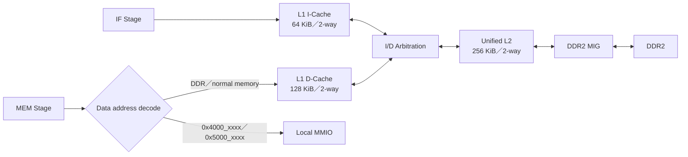

重點：

- I-Cache 只負責 instruction fetch。
- 一般 load／store 經過 D-Cache。
- UART、timer、performance counter 等 local MMIO 不當作一般 cacheable memory。
- I$ 與 D$ 共用 Unified L2 與 DDR2。
- VGA 位址屬於可選 board top 的 framebuffer 路徑。

## 7. MMIO Decode

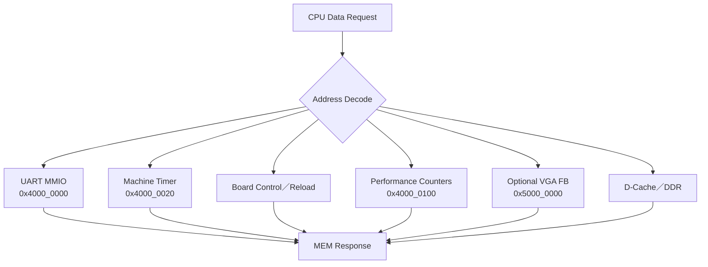

Performance page 使用註冊化的一拍 response，將 24-way counter read mux 與
CPU timing path 隔離。MEM stage 會等待 response，因此軟體不需要知道這一拍延遲。

## 8. Preflight 與 Target 上板時序

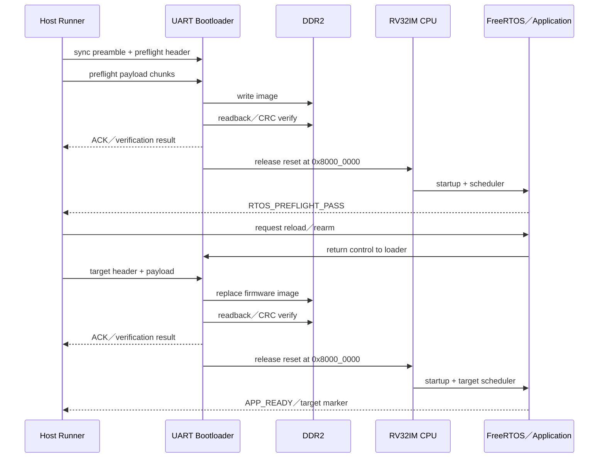

runner 不只確認 UART bytes 已送完；它還會等待：

- bootloader ACK。
- image verification。
- preflight PASS marker。
- target application READY／PASS marker。

這使「傳輸成功」與「CPU 真的執行成功」可以分開判斷。

## 9. Firmware 軟體分層

這裡的「分層」是依責任把程式碼分類，不是板上同時安裝多個作業系統。建置完成後，Application、FreeRTOS Kernel、RISC-V Port 與 BSP 會被一起編譯、link，成為 **同一份 `.mem` 內的 RISC-V machine code**。圖中箭頭代表「上層會呼叫或使用哪個下層介面」，不是啟動時一定按箭頭逐層執行。

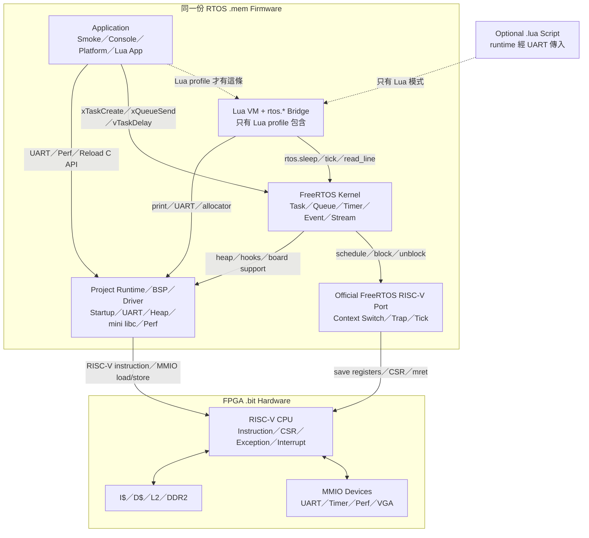

這張圖有兩個邊界：

- `.mem Firmware`：CPU 要執行的軟體，內部各層最後都是 RISC-V machine code 與資料。
- `.bit Hardware`：Verilog／Vivado 建立的 CPU、Cache、DDR 與 MMIO 電路。

`CPU Architectural Interface`不是另一個軟體檔案，而是兩個邊界間的規則：RISC-V instruction、CSR、`ecall`、`mret`、exception、timer interrupt 與 MMIO load/store 的語意。

### 9.1 每一層負責什麼

| 層級 | 責任 | 本專案範例 |
|---|---|---|
| Application | 定義「這份 firmware 要做什麼」，建立 Task、Queue 並處理命令 | `main_console.c`、`main_platform.c`、`main_lua.c` |
| Lua VM（可選） | 將 `.lua` 解析為 Lua bytecode 並執行，透過 C bridge 呼叫 RTOS/BSP | 只有 `-App lua` |
| FreeRTOS Kernel | 管理 Task state、priority、Queue、Timer、Semaphore、Event Group 與 Stream Buffer | `xQueueSend()`、`vTaskDelay()` |
| RISC-V Port | 把通用 FreeRTOS 排程轉成這顆 CPU 的 context save/restore、tick trap 與 `mret` | Task context switch／timer interrupt |
| Runtime／BSP／Driver | 提供啟動、UART、heap、mini libc、performance counter 與 board reload | `startup.S`、`uart.c`、`board_control.c` |
| CPU architectural interface | 規定軟體使用哪些 instruction、CSR、trap 與 MMIO 動作 | `mstatus`、`mepc`、`mie`、`mret`、load/store |
| RTL Hardware | 真正執行指令、產生中斷、存取 Cache／DDR 並控制周邊 | CPU pipeline、UART、timer、perf、VGA |

Application 負責「功能」；FreeRTOS Kernel 負責「哪個 Task 現在可以執行」；Port 負責「如何在 RISC-V 上真的切換 Task」；BSP 負責「如何使用這塊板子的裝置」。

本節只提供全貌。若要逐步追蹤 `xQueueSend()`、`vTaskDelay()`、UART、效能計數器、VGA 或 Lua API 如何變成 RISC-V 指令、CSR、MMIO 與 interrupt，請閱讀 [RTOS 軟體 API 如何連到 CPU 與 FPGA 硬體](../04-freertos/SOFTWARE_HARDWARE_INTERFACE.md)。

### 9.2 不同 profile 會裝進哪些內容

每次 build 只選擇一個 profile-specific `main`，不會在同一份 `.mem` 中同時啟動 Console、Platform 與 Lua 三個 Application。

| Profile | 共用內容 | 額外／特定內容 |
|---|---|---|
| `console` | startup、linker、FreeRTOS kernel/port、UART、heap、mini libc、perf API | Console parser、RX/Command/Worker/Heartbeat Tasks |
| `platform` | 同上 | 各種 FreeRTOS object 的綜合自測 |
| `smoke` | 同上 | Producer/Consumer Queue 短測試 |
| `lua` | 同上 | Lua VM、Lua libraries、`rtos.*` bridge、Lua RX/Lua/Heartbeat Tasks |
| `vga_demo` | 同上 | VGA driver 與畫面 Task |

### 9.3 圖中箭頭代表的真實動作

| 呼叫路徑 | 代表動作 | 會發生什麼 |
|---|---|---|
| Application → FreeRTOS | `xTaskCreateStatic()`、`xQueueSend()`、`vTaskDelay()` | 建立 Task／Queue、傳資料或讓 Task 進入 Blocked |
| Application → BSP | `rtos_uart_write_line()`、`perf_counters_snapshot()`、reload API | 操作 UART、讀取 perf MMIO 或要求 Bootloader rearm |
| Lua VM → FreeRTOS | Lua `rtos.sleep()` 經 C bridge 呼叫 `vTaskDelay()` | Lua Task block，排程器改跑其他 Task |
| FreeRTOS → Port | Scheduler 要求 yield/context switch | 儲存目前 Task context，選擇並還原下一個 Task |
| Port → CPU | 讀寫 CSR、儲存 register、執行 `mret` | CPU 從 trap 返回新 Task 的 `mepc` |
| BSP → Hardware | RISC-V load/store 存取 MMIO | UART 傳字元、設定 timer、讀 perf counter、觸發 reload |

### 9.4 `help` 從鍵盤到 Console 的完整路徑

`help` 不是 PowerShell、Python 或 FreeRTOS 內建指令；它是 Console Application 實作的命令。

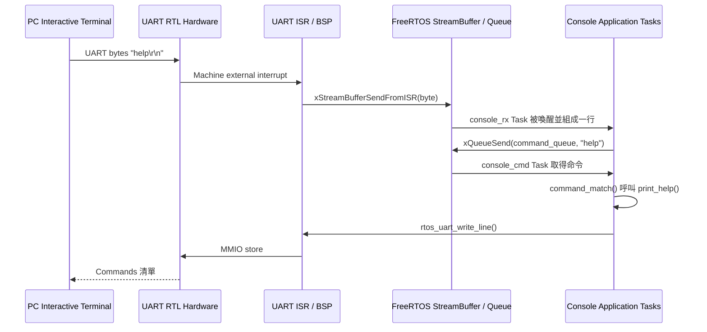

這條路徑同時用到 Application、FreeRTOS、RISC-V Port/interrupt、BSP 與 UART RTL；任一層失敗，`help` 都可能沒有回應。

### 9.5 常見指令與跨層動作

| 使用者動作 | 主要跨層路徑 | 結果 |
|---|---|---|
| Console 輸入 `help` | UART → ISR/BSP → StreamBuffer → RX Task → Command Queue → Command Task | 列出 Console Application 實作的命令 |
| Console 輸入 `work 256` | Command Task → Work Queue → Worker Task → Result Queue | 交由另一個 Task 完成 256 次 workload，見下一節 |
| C Task 呼叫 `vTaskDelay(1000)` | Application → Kernel → Port／Scheduler | 當前 Task block 1000 ticks，其他 Ready Task 獲得 CPU |
| Console 輸入 `perf test 100000` | Command Task → Perf BSP API → MMIO counter RTL → CPU workload | 重置、執行並讀回硬體效能計數器 |
| Console 輸入 `reload` | Application → Board-control BSP → `0x4000_0014` MMIO → RTL | CPU reset、Bootloader rearm，準備接收下一份 `.mem` |
| Lua 執行 `rtos.sleep(1000)` | Lua script → Lua VM → C bridge → `vTaskDelay()` | 只讓 Lua Task block，不會讓整個 CPU 停止 |

不是每個 profile 都包含 Lua，但每個 RTOS profile 都包含：

- startup。
- linker layout。
- FreeRTOS kernel／port。
- UART。
- heap。
- mini libc。
- performance counter API。
- profile-specific `main`。

## 10. Console Task 與 Queue

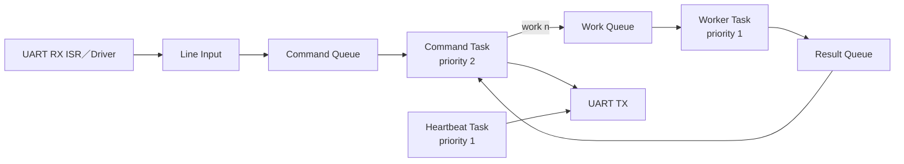

`work 256` 的實際意義：

1. Command Task 解析字串。
2. 建立 work request。
3. request 放入 Work Queue。
4. Worker Task 被喚醒並執行 workload。
5. Worker 把結果放入 Result Queue。
6. Command Task 取得結果後輸出。

這個流程同時展示 Task scheduling、Queue IPC、blocking／unblocking 與 UART output。

## 11. Lua Runtime Task

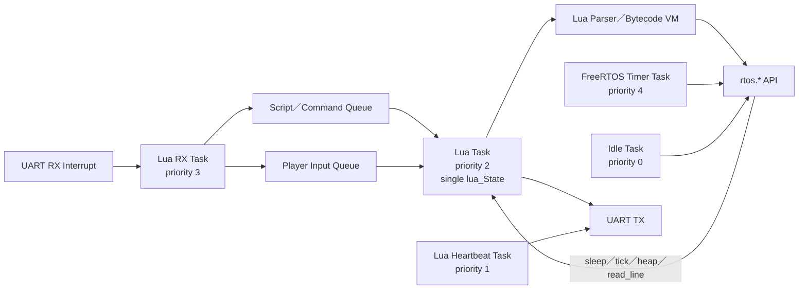

設計原則：

- UART ISR 不直接執行 Lua VM。
- RX Task 處理協定、CRC、stop 與輸入分流。
- 只有 Lua Task 操作主要 `lua_State`。
- instruction hook、timeout 與 stop flag 防止腳本永久占用 CPU。
- `rtos.sleep()` 讓 Lua Task block，使其他 FreeRTOS Task 繼續執行。

## 12. bitstream、`.mem` 與 `.lua` 的關係

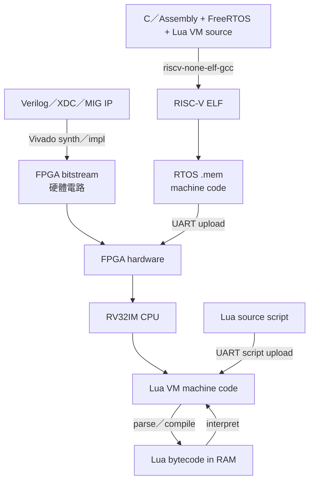

因此：

- 改 RTL：重建 bitstream。
- 改 C／FreeRTOS application：重建並上傳 `.mem`。
- 只改 Lua application：通常只需重新上傳 `.lua`。

## 13. 主要 RTL 對照表

| 方塊 | 主要檔案 |
|---|---|
| Board integration | `board_top.v`、`board_top_vga.v` |
| Clock | `clock_bridge.v` |
| CPU integration | `icache_pipeline_top.v` |
| Pipeline stages | `IF.v`、`ID.v`、`EX.v`、`MEM.v`、`WB.v` |
| Pipeline registers | `IFID_register.v`、`IDEX_register.v`、`EXMEM_register.v`、`MEMWB_register.v` |
| Hazard／forward | `hazard_unit.v`、`forward_unit.v` |
| Branch predictor | `branch_predictor.v` |
| CSR／trap | `CSR.v`、`machine_irq_sources.v`、`misalign_check.v` |
| Multiply／divide | `booth_multiplier.v`、`restoring_divider.v` |
| L1 Cache | `icache.v`、`dcache.v` |
| L2／arbitration | `L2_cache.v`、`I_D_arbitration.v` |
| DDR bridge | `MIG_DDR2_interface.v`、Vivado MIG IP |
| UART | `uart_rx.v`、`uart_tx.v`、`uart_bootloader.v` |
| VGA | `vga_subsystem.v`、`vga_640x480.v` |

## 14. 主要軟體與工具對照表

| 方塊 | 主要檔案／目錄 |
|---|---|
| RTOS startup／linker | `OS/rtos/src/startup.S`、`OS/rtos/link_ddr.ld` |
| RTOS config | `OS/rtos/config/FreeRTOSConfig.h` |
| UART driver | `OS/rtos/src/uart.c` |
| Heap／mini libc | `OS/rtos/src/rtos_heap.c`、`OS/rtos/src/minilibc.c` |
| Console | `OS/rtos/src/main_console.c` |
| Platform self-test | `OS/rtos/src/main_platform.c` |
| Lua profile | `OS/rtos/src/main_lua.c`、`OS/rtos/src/lua_*.c` |
| Lua VM | `third_party/lua-5.4.8` |
| Performance API | `OS/rtos/src/perf_counters.c` |
| RTOS build | `tools/build_rtos_app.ps1` |
| Board runner | `tools/run_rtos_app.ps1`、`tools/rtos_board_runner.py` |
| Lua uploader | `tools/run_lua_script.py` |
| FPGA programming | `tools/program_board_bitstream.ps1` |

## 15. 建議先閱讀的圖

不同讀者可以從不同位置開始：

- 想先上板：閱讀第 2、3、8 節，再看 [QUICK_START.md](QUICK_START.md)。
- 想改 CPU：閱讀第 5、6、7 節。
- 想改 FreeRTOS application：閱讀第 8、9、10 節。
- 想寫 Lua：閱讀第 9、11、12 節。
- 想確認完成範圍：閱讀 [FEATURE_STATUS.md](FEATURE_STATUS.md)。
- 想看專案全貌：閱讀 [PROJECT_OVERVIEW.md](PROJECT_OVERVIEW.md)。
