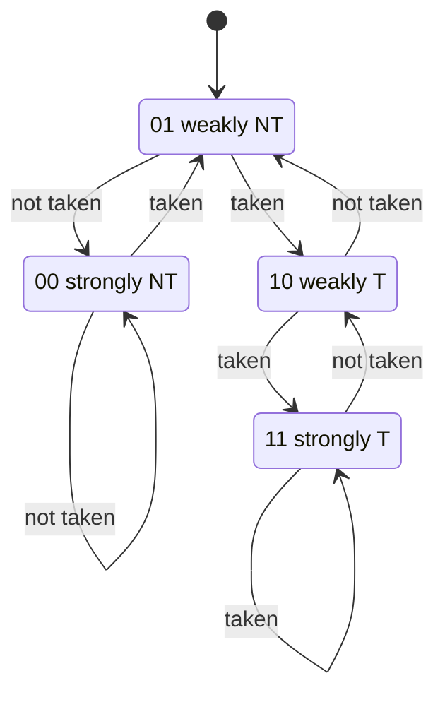
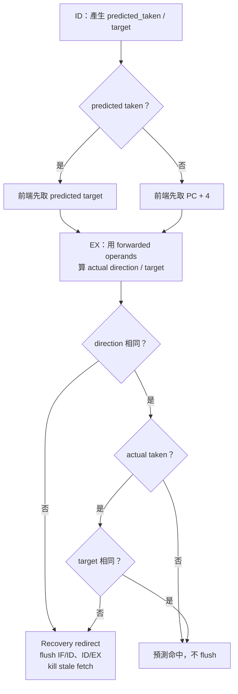
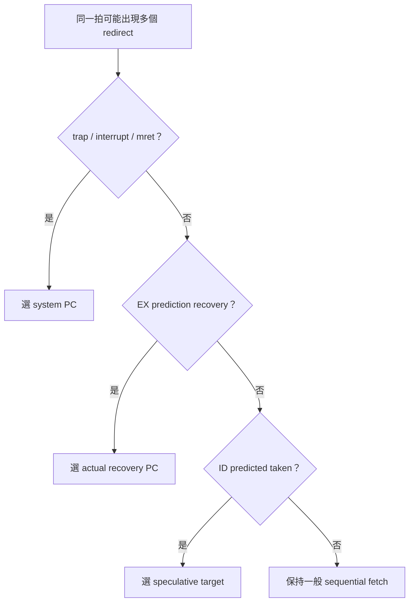
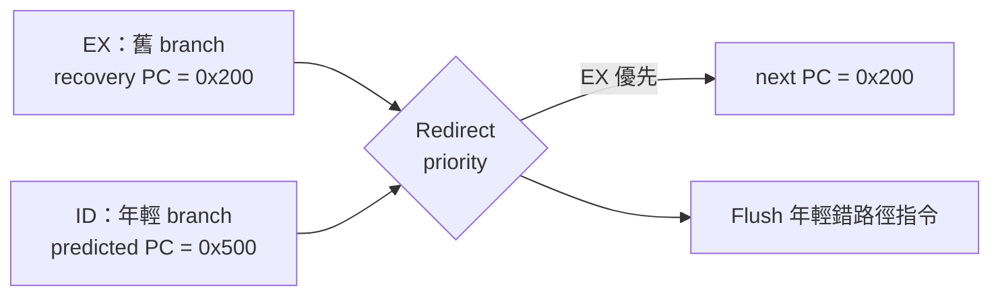

# Branch Prediction

本文件說明目前 CPU 的分支預測器、ID speculative redirect、EX 驗證與 misprediction recovery。內容特別區分「方向預測」與「target 預測」，避免把 PHT 誤認成 BTB。

先備閱讀：[CPU_ARCHITECTURE.md](CPU_ARCHITECTURE.md) 與 [PIPELINE.md](PIPELINE.md)。Branch operand 的資料相依請參考 [HAZARD_FORWARDING.md](HAZARD_FORWARDING.md)。

## 1. 為什麼需要預測

Conditional branch 的實際結果要到 EX 比較 `rs1/rs2` 才知道，但 IF 必須更早決定下一個 PC：

```asm
beq x1, x2, target
```

可能的下一個 PC：

```text
not taken → branch PC + 4
taken     → branch PC + immediate
```

若每次 branch 都停到 EX 才取下一條，正確但浪費前端 cycle。預測器先猜一條路徑；EX 再驗證。猜對就繼續，猜錯才 flush 與重取。

## 2. 目前設計摘要

| 項目 | 實作 |
|---|---|
| Prediction time | ID stage |
| Conditional direction | 256-entry Pattern History Table |
| Entry | 2-bit saturating counter |
| Initial state | `01` weakly not taken |
| Index | branch PC `[9:2]` |
| Tag | 無 |
| Global/local history | 無 |
| Conditional target | ID 直接計算 `PC + immediate` |
| JAL | ID 固定預測 taken，target=`PC+imm` |
| JALR | 不在 ID 預測；EX 使用 forwarded `rs1` 解決 |
| Verification/update | EX stage |
| Recovery | redirect PC、flush IF/ID 與 ID/EX、kill stale fetch |

[`branch_predictor.v`](../../branch_predictor.v) 只預測 conditional branch 的方向。它不是 BTB，沒有保存 branch target，也不辨識 entry 是否真的屬於同一個完整 PC。

## 3. PHT 結構

參數 `PHT_BITS=8`：

```text
entries = 2^8 = 256
```

每個 entry 是 2-bit counter：

| State | 名稱 | Prediction |
|---|---|---|
| `00` | strongly not taken | not taken |
| `01` | weakly not taken | not taken |
| `10` | weakly taken | taken |
| `11` | strongly taken | taken |

預測直接使用 counter MSB：

```text
pred_taken = counter[1]
```

Reset 時全部初始化為 `01`，所以第一次看到任何 branch 都先預測 not taken。

## 4. 2-bit counter 更新

Actual taken 時向 taken 飽和，actual not-taken 時向 not-taken 飽和：



相較 1-bit predictor，2-bit counter 不會因一次例外結果立刻把強方向翻轉。例如迴圈 branch 多次 taken、離開迴圈時一次 not-taken，`11` 只降成 `10`，下一次進迴圈仍預測 taken。

## 5. PC index 與 aliasing

PC 以 4-byte 對齊，所以最低兩位永遠是 `00`，索引使用：

```text
index = PC[9:2]
```

沒有 tag，表示相差 1024 bytes 整數倍的 branch 可能映射同一 entry：

```text
0x0000_0100 → index 0x40
0x0000_0500 → index 0x40
```

這稱為 aliasing。兩個 branch 行為相反時會互相污染 counter。這不影響 architectural correctness，因為 EX 仍驗證；它只會增加 recovery penalty。

## 6. 為什麼 lookup 在 ID

Branch predictor port 註解寫成 IF/ID lookup，但主線實際接 `id_pc`，所以 lookup 發生在 ID。

優點：

- ID 已知道 opcode，能確認是 branch/JAL/JALR。
- B/J immediate 已 decode，可直接計算 target。
- 不需要 BTB 就能對 direct branch/JAL speculative redirect。

代價：

- 要等指令進 ID 才能改 fetch PC。
- 比真正 IF-stage prediction 多一段前端 latency。
- 已經發出的 sequential fetch 可能需要 kill。

因此本設計是「ID-stage direction prediction」，不是高效能處理器常見的 IF-stage BTB+BHT 前端。

## 7. 不同控制指令如何預測

### 7.1 Conditional branch

```text
id_pred_taken = id_valid && id_branch && PHT_taken
target = id_pc + id_imm
```

若 PHT 預測 taken，ID 立即要求前端取 target；若預測 not-taken，不發 redirect，PC 按 sequential path 前進。

### 7.2 JAL

JAL target 只依賴 `PC + J-immediate`，ID 已能計算，所以固定預測 taken：

```text
id_pred_taken = id_valid && id_jal
target = id_pc + id_imm
```

正常對齊且 decode 正確時，EX 會確認相同 target，不需 recovery。

### 7.3 JALR

JALR target：

```text
(rs1 + I-immediate) & 0xFFFF_FFFE
```

`rs1` 可能依賴更老的 EX/MEM producer，ID register value 不一定最新。雖然 top 有計算 `id_ctrl_target` 的 JALR 形式，`id_pred_taken` 並不包含 JALR，所以不會用它 speculative redirect。

JALR 進 EX 後使用 forwarded `rs1` 算出可靠 target。因預測 metadata 是 not-taken，而 JALR 實際一定 taken，EX 會產生 recovery redirect。

## 8. Prediction metadata

ID 不能只改 PC，還必須把當時的預測跟著 branch 帶到 EX：

```text
id_pred_taken
id_pred_target
       ↓ ID/EX
ex_pred_taken
ex_pred_target
```

若沒有 metadata，EX 看到 actual taken 無法知道前端是否早已走正確 target，也就可能每次 taken branch 都重複 flush，失去預測效益。

## 9. EX 如何得到 actual result

[`EX.v`](../../EX.v) 使用 forwarded operands 比較：

| `funct3` | 指令 | Actual condition |
|---|---|---|
| `000` | BEQ | `rs1 == rs2` |
| `001` | BNE | `rs1 != rs2` |
| `100` | BLT | signed `<` |
| `101` | BGE | signed `>=` |
| `110` | BLTU | unsigned `<` |
| `111` | BGEU | unsigned `>=` |

Actual target：

```text
branch/JAL = ex_pc + ex_imm
JALR       = (forwarded_rs1 + ex_imm) & ~1
```

定義：

```text
ex_actual_taken = ex_jal || ex_jalr || ex_br_taken
```

## 10. Direction miss 與 target miss

EX 分成兩種錯誤：

```text
direction miss:
    ex_pred_taken != ex_actual_taken

target miss:
    actual taken && predicted taken
    && ex_pred_target != ex_actual_target
```

Recovery 條件：

```text
valid control instruction
&& EX not stalled
&& (direction miss || target miss)
```

這個區分很重要：方向猜對 taken，不代表 target 一定正確。現在 direct branch/JAL target 由 immediate 同時在 ID/EX計算，通常一致；但保留 target compare 能防止資料/metadata錯位，也為日後 BTB 做準備。

## 11. 四種主要結果

| Prediction | Actual | Recovery? | Recovery PC |
|---|---|---:|---|
| not taken | not taken | 否 | 已在 `PC+4` path |
| taken，target 正確 | taken，target 相同 | 否 | 已在 predicted target |
| taken | not taken | 是 | `ex_pc4` |
| not taken | taken | 是 | EX actual target |

另外：taken/taken 但 target 不同，也要 recovery 到 EX actual target。



圖中的 recovery 只取消較年輕的錯路徑工作；做出判斷的 EX branch 與它之前的指令仍正常完成。

## 12. 情境一：predicted taken 命中

```text
ID branch @ 0x100
immediate = 0x10
PHT says taken
predicted target = 0x110
```

ID：

```text
fe_redirect_valid = 1
fe_redirect_pc = 0x110
```

EX 後來確認：

```text
actual taken = 1
actual target = 0x110
```

結果：

```text
redirect_valid = 0
flush_ifid = 0
flush_idex = 0
```

這是 [`bp_redirect_scenarios_tb.v`](../../bp_redirect_scenarios_tb.v) 的 Scenario 1。

## 13. 情境二：predicted taken、actual not-taken

前端已經走 target，但 EX 發現條件不成立：

```text
direction miss = 1
recovery PC = branch PC + 4
```

動作：

```text
redirect_valid = 1
flush IF/ID
flush ID/EX
kill wrong-path fetch
clear fetch response buffer
```

這是 scenario test 的 Scenario 2。

## 14. 情境三：predicted not-taken、actual taken

前端沿 sequential path，EX 發現應跳：

```text
direction miss = 1
recovery PC = actual target
```

同樣 flush 兩個 younger stage，重新從 target 取指。這是 Scenario 3。

## 15. JAL 與 JALR 的差異

### JAL

```text
ID 固定 taken + ID direct target
EX 固定 taken + EX direct target
```

通常是 prediction hit，不需 EX recovery。

### JALR

```text
ID 不 speculative redirect
EX 固定 taken + forwarded register target
```

因此目前每個 JALR 都會造成一次 EX recovery redirect。Return 指令通常也是 `jalr x0,0(ra)`，所以函式返回會承受這個 penalty；目前沒有 return-address stack。

## 16. Predictor update 時機

PHT 只在有效 conditional branch 到 EX 且 EX 沒有 stall 時更新：

```text
bp_update_valid = ex_valid && ex_branch && !stall_ex
pc_update = ex_pc
actual_taken = ex_br_taken
```

JAL/JALR 不更新 PHT，因為它們不是條件方向問題：JAL 永遠 taken，JALR 的主要問題是 target。

只有 instruction 真正被 EX 接受時更新，可避免多週期 stall 期間同一 branch 被重複訓練多次。

## 17. Redirect priority

### 17.1 Redirect 是什麼

正常情況下，前端會從目前指令的下一個位址繼續取指：

```text
next PC = current PC + 4
```

但 branch、jump、trap、interrupt 或 `mret` 可能要求前端改從另一個位址取指。這個「不要再使用原本的下一個 PC，改從指定 PC 取指」的動作，稱為 **redirect（重新導向）**。

Redirect source 會提供兩項資訊：

| 訊號概念 | 作用 |
|---|---|
| redirect valid | 這一拍確實要求改變取指 PC |
| redirect PC | 接下來應從哪個位址取指 |

### 17.2 為什麼需要 priority

Pipeline 中同時存在多條不同年齡的指令，也可能同時發生 system event，因此同一個 clock cycle 可能有不只一個單元要求改 PC。前端最終只能選一個 `next PC`，所以必須明確規定誰優先；這就是 **redirect priority**。

Top 合併三類前端 redirect：

```text
1. system redirect：trap / interrupt / mret
2. EX recovery redirect：direction/target miss
3. ID speculative redirect：predicted taken branch/JAL
```

實際 PC priority：

```text
system > EX recovery > ID prediction
```

| 優先順序 | 類型 | 常見 PC 來源 | 為何要排在這裡 |
|---:|---|---|---|
| 1，最高 | System redirect | trap/interrupt 使用 `mtvec`；`mret` 使用 `mepc` | 必須維持 exception、interrupt 與 return 的正確控制流程 |
| 2 | EX recovery redirect | EX 算出的實際 target，或 branch 的 `PC+4` | EX 擁有較老指令的實際執行結果，可信度高於 ID 預測 |
| 3，最低 | ID speculative redirect | ID 算出的 predicted target | 只是提早猜測，而且該 ID 指令可能已位於錯誤路徑 |
| 無 redirect | Sequential fetch | `PC+4` | 沒有任何事件要求改變控制流程 |



### 17.3 例子一：EX recovery 與 ID prediction 同拍發生

假設同一拍的 Pipeline 是：

```text
EX：較老的 branch 發現先前預測錯誤，正確位置是 0x0000_0200
ID：較新的 branch 預測為 taken，要求跳到 0x0000_0500
```

兩個來源都想改 PC：

```text
EX recovery redirect PC = 0x0000_0200
ID speculative PC       = 0x0000_0500
```

但 ID 指令比 EX branch 年輕，而且它可能本來就是沿著錯誤路徑取回來的指令。如果採用 ID 的 `0x0000_0500`，CPU 就會繼續在錯誤路徑執行。因此 priority 選擇 EX recovery：

```text
next PC = 0x0000_0200
```

同時 flush IF/ID 與 ID/EX，丟棄較年輕的錯路徑指令。這個例子說明：**已經在 EX 驗證出的實際結果，必須蓋過 ID 的推測結果。**



### 17.4 例子二：System redirect 與 branch recovery 同拍發生

再假設 CPU 同一拍確認：

```text
branch recovery 要求跳到 0x0000_0200
exception 要求進入 mtvec = 0x0000_1000
```

Exception 必須保存正確的 `mepc/mcause/mtval`，並進入 trap handler。如果一般 branch recovery 蓋掉 exception，CPU 就會漏掉應處理的 trap。因此 system redirect 優先：

```text
next PC = mtvec = 0x0000_1000
```

同樣地，`mret` 的 system redirect 會把 PC 導回 `mepc`。這裡的 priority 是「前端下一個 PC 的硬體選擇順序」，不是 FreeRTOS Task priority，也不是 interrupt source priority。

### 17.5 RTL 如何實作 priority

Top 中的 PC 選擇本質上是一個 priority multiplexer：

```verilog
assign fe_redirect_valid = ex_sys_redirect_valid |
                           redirect_valid |
                           id_pred_redirect_valid;

assign fe_redirect_pc = ex_sys_redirect_valid ? ex_sys_redirect_pc :
                        redirect_valid        ? redirect_pc :
                                                id_ctrl_target;
```

三元運算式由前往後判斷，所以只要 `ex_sys_redirect_valid=1`，後面的 EX recovery 與 ID prediction 就不能蓋掉 system PC。沒有 system redirect 時，才檢查 EX recovery；兩者都沒有時，才採用 ID prediction。

這段選擇只決定「哪一個 PC 勝出」。勝出後還必須 flush 錯路徑 Pipeline state、kill 舊的 fetch，並防止舊 response 進入 IF/ID；下一節會接著說明這些處理。

## 18. Redirect 如何處理 outstanding fetch

Prediction/recovery 不只改 PC。I-Cache request 可能早已送出，response 甚至可能幾拍後才回來。若只改 PC，舊路徑 response 仍可能進 IF/ID。

目前防護包含：

1. `fetch_req_kill = fe_redirect_valid`，通知 I-Cache 路徑失效。
2. redirect 清 `if_pending`，允許新 PC 發 request。
3. redirect 清一格 fetch response buffer。
4. `fetch_resp_valid_pipe` 在 redirect 同拍抑制 response。
5. I-Cache 使用 kill tag/epoch，refill可以完成，但舊 epoch response會被丟棄。

「可以讓 cache refill 完成」與「不能讓錯路徑 instruction 進 decode」並不衝突。前者避免破壞 memory protocol，後者維持 architectural correctness。

## 19. Flush 範圍

EX branch 是較老指令；當它發現錯誤，錯路徑主要存在：

```text
IF/ID
ID/EX
outstanding fetch/response buffer
```

所以 recovery 會 flush IF/ID 與 ID/EX。EX branch 本身不能被 flush，否則 predictor update/PC recovery可能消失；在它之前的 MEM/WB 指令也應正常完成。

## 20. Forwarding 與 branch prediction

Prediction 本身可以猜錯，但 EX 的 actual result 必須可靠。以下程式若沒有 branch operand forwarding：

```asm
addi x5, x0, 1
bne  x5, x0, target
```

Branch 在 ID 可能讀到舊 `x5`，但 EX 應從 MEM forward 新值 1，再判斷 taken。否則硬體不只走錯路，還會用錯誤 actual result 訓練 PHT，讓後續預測更差。

因此除錯 branch failure 時應依序確認：

1. `ex_rs1_val_fwd/ex_rs2_val_fwd`。
2. `ex_br_taken`。
3. `ex_pred_taken/ex_pred_target`。
4. `redirect_valid/redirect_pc`。
5. flush 與 fetch kill。

## 21. Misaligned target

目前沒有 RVC，instruction address 必須 4-byte aligned。

- Branch/JAL target 由 immediate 本身通常保持至少 2-byte alignment，但 bit 1 仍可能為 1。
- JALR 規格清 bit 0，卻仍可能留下 bit 1。

`misalign_check` 在 taken control flow 檢查 `target[1:0] != 00`。若 misaligned，應進 instruction-address-misaligned exception，而不是正常 fetch。System trap redirect 的優先權會接管前端。

## 22. Predictor 做得到與做不到的事

### 做得到

- 學習每個 PC index 最近偏向 taken 或 not-taken。
- 對穩定 loop branch 降低大多數 recovery。
- 避免一次反常 outcome 立刻翻轉強方向。
- 在 EX 驗證 direction 與 target，維持正確性。

### 做不到

- 無法用 global history 分辨相關 branch。
- 無 tag，會有 PHT aliasing。
- 無 BTB，不能在 IF 直接取得 target。
- 無 RAS，return/JALR 每次在 EX 才 redirect。
- 無 indirect target predictor。
- 不支援多路 fetch 或多 branch 同拍預測。

## 23. Performance counter 判讀

相關事件：

| Event | 含義 |
|---|---|
| conditional branch | EX 接受的 branch 數 |
| taken branch | EX 判斷 taken 的 branch 數 |
| jump | JAL/JALR 數 |
| control-flow miss | `redirect_valid`，direction 或 target miss |
| pipeline flush | recovery 或 system flush |

可計算：

```text
conditional miss rate ≈ control-flow miss / conditional branch
```

但目前 `control-flow miss` 也包含 JALR recovery，而 JALR 不使用 conditional PHT。若 workload 有大量函式 return，直接用上式會高估 PHT 本身的錯誤率。更精確的下一版 counter 應拆成：

```text
conditional direction miss
conditional target miss
JALR redirect
system redirect
```

## 24. 典型 branch pattern

### 24.1 迴圈

```c
for (i = 0; i < 100; ++i) { ... }
```

尾端 branch 通常連續 taken，離開時一次 not-taken。2-bit counter 暖機後多數預測正確，常見 miss 在第一次進入或最後離開。

### 24.2 交替 branch

```text
T, N, T, N, T, N ...
```

單一 2-bit counter 很難穩定預測，可能在 weak states 間震盪。需要 history-based predictor 才能辨識交替模式。

### 24.3 兩個 branch alias

一個幾乎總 taken，另一個幾乎總 not-taken，但 PC index 相同，會互相訓練。增加 PHT 大小只能降低機率，加入 tag 或更複雜 predictor 才能更直接處理。

## 25. 驗證

### 25.1 Redirect scenario TB

[`bp_redirect_scenarios_tb.v`](../../bp_redirect_scenarios_tb.v) 明確檢查：

1. ID predicted taken，EX taken/target match，不 recovery、不 flush。
2. Predicted taken、actual not-taken，redirect `PC+4` 並 flush。
3. Predicted not-taken、actual taken，redirect actual target 並 flush。

### 25.2 主 pipeline regression

與控制流相關：

| Test | 內容 |
|---:|---|
| 4 | branch taken |
| 6 | branch not taken |
| 7 | JAL |
| 8 | JALR |
| 19 | hazard + branch |
| 21 | long branch workload |
| 22 | branch + memory mix |
| 24–27 | C/mixed/full stress |

### 25.3 建議 assertion

未來可加入或維持：

```text
predicted taken + actual taken + same target → no recovery
predicted taken + actual not taken → recovery PC == ex_pc4
predicted not taken + actual taken → recovery PC == actual target
recovery → younger valid cleared
redirect epoch → old fetch response cannot enter IF/ID
PHT update only once per accepted EX branch
```

## 26. Waveform 除錯順序

一個 branch 結果不對時，依序看：

```text
ID:
  id_valid, id_pc, id_branch/id_jal/id_jalr
  bp_pred_taken, id_pred_taken, id_ctrl_target

ID/EX:
  ex_pred_taken, ex_pred_target, ex_pc

EX:
  ex_rs1_val_fwd, ex_rs2_val_fwd
  ex_br_taken, ex_redirect_pc_raw

Recovery:
  ex_pred_dir_miss, ex_pred_tgt_miss
  redirect_valid, redirect_pc
  flush_ifid, flush_idex

Front end:
  fe_redirect_valid, fe_redirect_pc
  fetch_req_kill, if_pending
  fetch_resp_buf_valid
```

先找第一個不符合預期的節點；不要只看到 PC 錯誤就直接修改 predictor counter。

## 27. 後續改善方向

### 27.1 BTB

在 IF 以 PC 查 direction + target，讓 taken branch 更早重導。BTB entry 至少需要 valid、tag、target 與 type，避免無 tag target alias 直接破壞前端。

### 27.2 Return-address stack

JAL call 時 push `PC+4`，return 型 JALR 時 pop，可顯著改善函式返回。

### 27.3 Global/history predictor

Gshare、local history 或 tournament predictor 可以處理相關與交替 branch，但需要更完整的 speculative history rollback。

### 27.4 更深前端 queue

多 outstanding fetch 或 instruction FIFO 能提高吞吐量，但 redirect 時要對每筆 request/response保存 epoch，不能只用單一 `if_pending`。

### 27.5 Counter 拆分

將 conditional direction miss、target miss、JALR redirect、trap redirect 分開，才能正確評估 predictor，而不是只看總 `redirect_valid`。

改善順序建議先處理目前 single-outstanding fetch，再評估更複雜 predictor。若前端本身無法連續供應指令，單純提升方向預測準確率不一定能帶來同等 IPC 改善。
