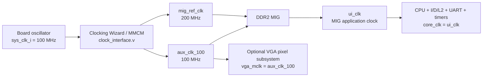
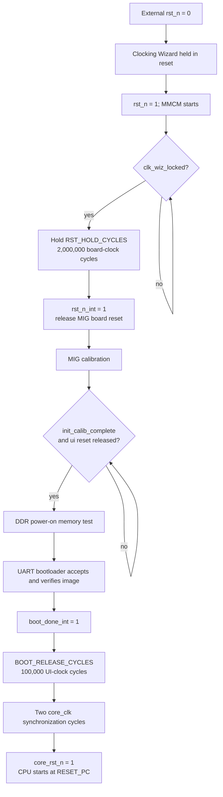

# Clock and Reset Architecture

本文件說明 FPGA 板端的 clock tree、MIG UI clock、CPU reset、DDR 初始化、UART bootloader 與 launcher rearm 的關係。主要對應 [`board_top.v`](../../board_top.v)、[`board_top_vga.v`](../../board_top_vga.v)、[`clock_bridge.v`](../../clock_bridge.v)、[`clock_interface.v`](../../clock_interface.v) 與 [`icache_pipeline_top.v`](../../icache_pipeline_top.v)。

Clock/reset 問題常表現成「有時可以上板、有時沒有 UART」、「DDR calibration 沒完成」或「CPU 偶爾從錯誤狀態啟動」。因此不能只知道 CPU 用幾 MHz，還要理解哪個 clock domain 擁有哪一塊邏輯，以及 CPU 到底要等哪些條件才解除 reset。

## 1. Clock 與 reset 的基本概念

### 1.1 Clock domain

由同一個 clock 驅動的一群 sequential logic，稱為一個 clock domain。不同 domain 的 clock 可能：

- 頻率不同。
- 相位不同。
- 暫停或開始的時間不同。
- 沒有可安全假設的 edge 關係。

訊號跨 domain 時不能直接假設接收端一定看得到穩定值，通常需要 synchronizer、handshake、asynchronous FIFO 或專門的 dual-clock memory。

### 1.2 Reset assertion 與 release

Reset 有兩個動作：

```text
assert reset  : 強迫模組回到初始狀態
release reset : 允許模組開始正常執行
```

Release 通常比 assertion 更敏感。如果 reset 在 clock edge 附近不一致地解除，不同 flip-flop 可能在不同 cycle 離開 reset，造成難以重現的上板錯誤。因此本設計不會直接把外部按鈕 reset 放到整個 CPU，而是經過 clock lock、DDR calibration、boot 完成及 core-clock synchronizer。

## 2. 整體 clock tree



### 2.1 各 clock 的用途

| Clock | 來源 | 名目頻率 | 主要使用者 |
|---|---|---:|---|
| `sys_clk_i` | FPGA 板載 oscillator | 100 MHz | Clocking Wizard 輸入、board reset hold counter |
| `aux_clk_100` | MMCM `clk_out1` | 100 MHz | MIG `sys_clk_i`、板端 UART activity monitor、optional VGA master clock |
| `mig_ref_clk` | MMCM `clk_out2` | 200 MHz | MIG `clk_ref_i` reference clock |
| `ui_clk` | MIG 輸出 | 由 MIG configuration 決定；本專案實板設定約 50 MHz | MIG app interface、bootloader、CPU core domain |
| `core_clk` | `USE_MIG=1` 時接 `ui_clk` | 約 50 MHz | pipeline、cache、L2、runtime UART、timer、interrupt、performance counters |

`board_top.v` 與 `board_top_vga.v` 的 `UART_CLK_HZ` 預設為 `50_000_000`，FreeRTOS 的 `configCPU_CLOCK_HZ` 也設為 50 MHz。這些軟體／UART參數必須和實際 `ui_clk` 一致，否則 baud rate 與 RTOS tick 都會偏差。

## 3. Clocking Wizard 實作

[`clock_bridge.v`](../../clock_bridge.v) 是專案使用的薄 wrapper；它把板載 clock 與 reset 接到 `clk_wiz_0`，再輸出：

```text
clk_sys_o = aux_clk_100
clk_ref_o = mig_ref_clk
locked_o  = MMCM locked
```

[`clock_interface.v`](../../clock_interface.v) 保存 Clocking Wizard 的 source-controlled implementation。MMCM 參數是：

```text
CLKIN1_PERIOD       = 10 ns
DIVCLK_DIVIDE       = 1
CLKFBOUT_MULT_F     = 10
CLKOUT0_DIVIDE_F    = 10
CLKOUT1_DIVIDE      = 5
```

計算方式：

```text
input frequency = 100 MHz
VCO frequency   = 100 MHz × 10 / 1 = 1000 MHz
clk_out1        = 1000 MHz / 10 = 100 MHz
clk_out2        = 1000 MHz / 5  = 200 MHz
```

輸出經 `BUFG` 進入 FPGA global clock network，以降低 clock skew。

### 3.1 `locked` 代表什麼

`clk_wiz_locked=1` 表示 MMCM 已鎖定到輸入 clock，輸出頻率與相位進入可用狀態。它不代表：

- DDR2 已 calibration 完成。
- MIG `ui_clk_sync_rst` 已解除。
- bootloader 已收到 firmware。
- CPU 已離開 reset。

這些是後續不同層級的條件。

### 3.2 為何需要 200 MHz reference

`mig_ref_clk` 是 MIG 內部延遲校正等電路使用的 reference clock，不是 CPU clock。它由板上 100 MHz 經 MMCM 產生，因此不需要另一個外接 200 MHz oscillator。

## 4. 為何 CPU 使用 MIG `ui_clk`

MIG 對外提供 application interface，例如 `app_en`、`app_rdy`、`app_rd_data_valid`。這些訊號都屬於 `ui_clk` domain。

本設計在 `USE_MIG=1` 時使用：

```verilog
core_clk = ui_clk;
```

因此 CPU、L1、L2、runtime UART 與 DDR application-side interface 位於同一個主要 domain。好處是 L2 到 MIG app interface 不必再加入一層大型 asynchronous bridge，控制較直接。

必須注意：傳入 [`icache_pipeline_top.v`](../../icache_pipeline_top.v) 的 `clk` port 是 `aux_clk_100`，但 `USE_MIG=1` 時 CPU 不直接使用這個 port 作 core clock；內部會改選 MIG `ui_clk`。該 `clk` 仍可提供 optional VGA 的 `vga_mclk`。

## 5. Reset polarity 對照

名稱相近但 polarity 不同是最容易接錯的地方。

| Signal | Active level | 來源／用途 |
|---|---:|---|
| 外部 `rst_n` | low | FPGA board reset input |
| Clocking Wizard `reset` | high | board top 使用 `~rst_n` 產生 |
| `clk_wiz_locked` | high 表示 ready | MMCM lock status |
| `rst_n_int` | low | lock 後延遲釋放的 board-level reset |
| MIG `sys_rst` | low | 此專案 MIG IP configuration 的 reset polarity |
| MIG `ui_clk_sync_rst` | high | MIG 在 `ui_clk` domain 輸出的同步 reset |
| `core_rst_n_base` | low | calibration／boot 條件形成的 core reset prerequisite |
| `core_rst_n` | low | 經兩級 core-clock release 後，實際給 CPU 子模組的 reset |
| `core_rst` | high | `~core_rst_n`，供使用 active-high reset 的模組 |

不能只看名稱猜 polarity；修改 IP 或重新產生 MIG 時，必須重新確認 `sys_rst` 的 configuration。

## 6. Power-on reset 流程

整體啟動順序如下：



若 `UART_BOOT_EN=0`，bootloader 路徑的 `boot_done_int` 直接視為完成；若 `USE_MIG=0`，MIG calibration、memory test 與 UART boot path 也會被 bypass，詳見第 11 節。

### 6.1 第一層：外部 reset 與 MMCM lock

外部 `rst_n=0` 時：

- Clocking Wizard 收到 active-high reset。
- `rst_hold_cnt` 清為 0。
- `rst_release` 清為 0。

外部 reset 解除後，board top 仍會等待 `clk_wiz_locked`。只要 lock 掉回 0，hold counter 就重新開始，不會讓下游在不穩定 clock 上執行。

### 6.2 第二層：額外約 20 ms hold

MMCM locked 後，board top 在原始 100 MHz `sys_clk_i` domain 計數：

```text
RST_HOLD_CYCLES = 2,000,000
2,000,000 / 100,000,000 = 0.020 s = 20 ms
```

完成後：

```text
rst_n_int = external rst_n AND clk_wiz_locked AND rst_release
```

這個延遲讓 clock 與板端電源相關狀態有額外穩定時間。

### 6.3 第三層：MIG calibration

`rst_n_int` 會送入 [`icache_pipeline_top.v`](../../icache_pipeline_top.v)，再接到 MIG `sys_rst`。MIG 自己產生：

```text
ui_clk
ui_clk_sync_rst
init_calib_complete
```

CPU 必須等到：

```text
rst_n == 1
ui_clk_sync_rst == 0
init_calib_complete == 1
```

如果 `init_calib_complete` 永遠不上升，問題通常在 DDR pin constraint、clock/reference、reset polarity、板端電氣或 MIG configuration，而不是 FreeRTOS。

### 6.4 第四層：DDR power-on memory test

啟用 UART boot 時，`ddr_app_memtest` 在 `init_calib_complete` 後開始，先以固定 pattern 對 DDR app interface 做 write/read check。memory test 尚未完成時：

- memory-test master 擁有 MIG app interface。
- bootloader 尚不開始接收 image。
- CPU 保持 reset。

MIG app mux 的優先序是：

```text
power-on memory test
then UART bootloader
then normal L2 traffic
```

這避免三個 master 同時驅動 MIG request。

### 6.5 第五層：UART boot 與 image verification

memory test 完成後，bootloader 才取得 MIG app interface。它接收 host 傳來的 `.mem` image，寫入 DDR，並依目前 protocol 進行 image verification。

在 `UART_BOOT_EN=1` 的一般上板流程中，`boot_done_int` 尚未成立前，CPU 不會開始取指。因此「開機後沒有立刻看到應用程式 UART」可能只是 FPGA 正在等 host 上傳，不代表 CPU 已經跑飛。

### 6.6 第六層：boot release delay

image 完成後，系統再等待：

```text
BOOT_RELEASE_CYCLES = 100,000 ui_clk cycles
```

若 `ui_clk≈50 MHz`，約為：

```text
100,000 / 50,000,000 = 2 ms
```

這段 guard time 讓 bootloader／MIG transaction 完整收尾，再交給 L2 與 CPU。

## 7. Core reset synchronizer

`core_rst_n_base` 在 MIG path 中為：

```text
rst_n
AND not ui_clk_sync_rst
AND init_calib_complete
AND boot_release_ok
```

但它不直接接到數千個 CPU/cache reset pins。RTL 使用兩個 flip-flop `core_reset_sync_q[1:0]`，在 `core_clk` edge 上處理：

```text
if external reset is active:
    core_reset_sync_q = 00
else if base condition is not ready or launcher reset is active:
    core_reset_sync_q = 00
else:
    core_reset_sync_q = {old_bit0, 1}

core_rst_n = core_reset_sync_q[1]
```

所以 prerequisite 全部成立後仍需兩個 `core_clk` edges 才釋放 CPU：

| Core edge | `core_reset_sync_q` | `core_rst_n` |
|---:|---:|---:|
| 尚未 ready | `00` | 0 |
| ready 後第 1 edge | `01` | 0 |
| ready 後第 2 edge | `11` | 1 |

這讓 reset release 與 `core_clk` 對齊。當 base 條件失效時，shift register 會在下一個 `core_clk` edge 清回 `00`；各 CPU 子模組再依自己的 active-low 或 active-high reset port 回到初始狀態。

## 8. 哪些模組在 CPU reset 前仍需運作

不能把所有邏輯都綁在 `core_rst_n`，否則 bootloader 自己也會被 reset，CPU 永遠無法取得 firmware。

在 CPU 被 hold 的階段仍需運作的部分包括：

- MMCM 與 MIG calibration logic。
- MIG `ui_clk` 與 app interface。
- DDR power-on memory test。
- UART bootloader。
- boot/rearm 相關 control。

使用 `core_rst_n` 的主要 runtime logic 包括：

- PC 與五級 pipeline registers。
- register file、CSR、branch predictor。
- I-Cache、D-Cache、L2 runtime state。
- runtime UART RX/TX。
- machine timer 與 interrupt sources。
- MMIO performance counters。

## 9. Launcher soft reset 與 bootloader rearm

Power-on reset 會重新初始化 clock/MIG；launcher reset 的目標不同：讓 CPU 停止目前應用程式，重新讓 UART bootloader 接收下一個 image，而不重新 configuration FPGA bitstream。

### 9.1 觸發來源

MMIO 定義：

```text
0x4000_0010 read  : launcher button status，bit0
0x4000_0014 write : launcher soft reset request，寫入資料 bit0=1 觸發
```

`board_top_vga.v` 會把實體 `launcher_btn_i` 傳入 core top，經兩級 synchronizer 與 debounce 後作為按鈕狀態。標準 [`board_top.v`](../../board_top.v) 將此輸入固定為 0。實際 reset/rearm sequence 由對 `0x4000_0014` 的 MMIO write 觸發，應用程式可以在偵測按鈕後送出該 write。

### 9.2 Debounce、drain 與 reset 時間

預設 core-domain cycle 數：

| 階段 | Cycles | 約 50 MHz 時間 | 用途 |
|---|---:|---:|---|
| Button debounce | 50,000 | 1 ms | 避免機械按鈕 bouncing |
| Arm/drain delay | 5,000,000 | 100 ms | 讓 framebuffer/MMIO 等 traffic 收尾 |
| Active reset | 2,000,000 | 40 ms | 保持 core reset 並讓 bootloader rearm |

`launcher_reset_active_q=1` 時：

- `core_reset_sync_q` 被清成 `00`，CPU reset asserted。
- bootloader 的 `rearm_i` asserted。
- 舊應用程式停止。
- bootloader 回到可接收新 image 的狀態。

這不是 bitstream reconfiguration。CPU RTL、MIG 與 clock tree 仍是同一份 FPGA design；被替換的是 DDR 中等待 CPU 執行的 firmware image。

### 9.3 為何不是收到 request 立刻 reset

CPU 可能剛送出 VGA framebuffer write、UART byte 或 memory transaction。若同一 cycle 直接 reset，外設端可能留下未完成狀態。因此先等待 arm/drain delay。這是工程上的 guard time，不等同完整 bus quiescence protocol；若未來 master 數量增加，最好改為明確的 drain acknowledgements。

## 10. Clock-domain crossing

### 10.1 外部 UART RX

UART RX pin 對 FPGA clock 是 asynchronous input。runtime UART 在 `core_clk` domain 使用兩級 synchronizer 後再送入 UART receiver。boot/debug 也有各自 domain 的 edge monitor，協助判斷「實體 pin 有變化」與「protocol 是否成功」是兩個不同問題。

兩級 synchronizer 主要降低 metastability 傳播風險，但不能替代完整 multi-bit CDC protocol。UART 是 serial single-bit input，經 oversampling／bit timing 邏輯後組 byte，適合這種處理。

### 10.2 Launcher button

按鈕同樣是 asynchronous input，所以先經兩級 synchronizer，再 debounce。debounce 解決的是機械 bounce；synchronizer 解決的是 clock edge 附近的 metastability，兩者目的不同。

### 10.3 Optional VGA

VGA subsystem 的 CPU request side 使用 `core_clk`，顯示 master side使用 `vga_mclk=aux_clk_100`。因此 VGA subsystem 本身必須負責兩個 domain 間的資料／控制交接。新增板載 I/O 時也應先標出 signal 所屬 domain，再決定 CDC 方法。

## 11. `USE_MIG=0` 的 simulation／簡化路徑

在 `USE_MIG=0` generate branch：

```text
ui_clk                 = clk
ui_clk_sync_rst        = 0
init_calib_complete    = 1
core_clk               = clk
core_rst_n_base        = rst_n
boot_done_int          = 1
memory-test status     = pass/done stub
```

這讓 core-level simulation 不需要真正 DDR2 PHY 與 calibration。它適合驗證 pipeline、CSR、MulDiv、cache control 等邏輯，但不能證明：

- 實板 MMCM clock 正確。
- DDR pin constraints 正確。
- MIG calibration 能通過。
- 真實 `ui_clk` 頻率與 reset timing 正確。
- UART bootloader 與 MIG app arbitration 在實板完全可靠。

另外，有些 board/MIG testbench 為了簡化會令模擬 `ui_clk` 直接跟 testbench clock 相同；不要從這類 simulation 波形推論實板 clock ratio。

## 12. Simulation 與 synthesis 注意事項

[`clock_interface.v`](../../clock_interface.v) 使用 Xilinx `IBUF`、`BUFG` 與 `MMCME2_BASE` primitives。完整 board top 的 elaboration／simulation 需要相對應的 vendor primitive model 或工具流程。

一般單元測試可採以下其中一種方法：

- 只 instantiate core 子模組，不 instantiate board clock top。
- `USE_MIG=0` 並提供簡單 test clock。
- 在特定 board testbench 中提供 clock/MIG simulation model。
- 使用 Vivado/Xilinx simulation libraries 驗證 clocking primitives。

不要為了讓 behavioral simulation 容易，就在 synthesis path 中用普通邏輯產生 clock；FPGA clock 應使用 MMCM/PLL 與 global clock buffer。

## 13. 上板時間線與 UART runner 的關係

Host 工具不能在 FPGA configuration 完成後立刻假設 bootloader 已可接收。上電後至少要經過：

```text
MMCM lock
→ 20 ms board reset hold
→ MIG calibration
→ DDR memory test
→ bootloader ready
```

這就是 runner 需要 `Waiting ... for FPGA DDR/bootloader` 的原因。固定 delay 是實務上的簡化；若要更可靠，host 應等待 bootloader ready marker／handshake，再開始 sync preamble 與 chunk upload。

若 preflight 偶爾 timeout，應分層判斷：

1. `clk_wiz_locked` 是否成立。
2. `init_calib_complete` 是否成立。
3. memory test 是否 done/pass。
4. UART pin edge monitor 是否看得到 host data。
5. bootloader 是否看到 sync/protocol header。
6. image CRC verification 是否通過。
7. `boot_done` 後 CPU 是否真的離開 reset。
8. CPU 是否印出 preflight marker。

這比單純增加 upload delay更容易找到真正問題。

## 14. 常見問題與除錯

### 14.1 完全沒有 clock activity

檢查：

- `sys_clk_i` pin constraint 與 I/O standard。
- 板載 oscillator 是否為 100 MHz。
- `~rst_n` 是否一直讓 Clocking Wizard處於 reset。
- `clk_wiz_locked` 是否上升。
- `clock_interface.v` 是否被加入 synthesis sources。

### 14.2 MMCM locked，但 DDR calibration 不完成

檢查：

- `aux_clk_100` 與 `mig_ref_clk` 是否為 100/200 MHz。
- MIG `sys_rst` polarity。
- DDR2 pin mapping、bank、I/O standard 與 timing constraints。
- MIG configuration 是否與板上 DDR2 元件一致。
- `ui_clk_sync_rst` 是否一直 asserted。

此階段 CPU 還沒有開始跑，因此通常不是 C、FreeRTOS 或 Lua 的問題。

### 14.3 Calibration 完成，但 CPU 沒有輸出

檢查：

- power-on memory test 的 done/pass。
- bootloader 是否完成 image verification。
- `boot_done_int` 與 `boot_release_ok_q`。
- `core_reset_sync_q` 是否由 `00` 變成 `01`、`11`。
- `core_rst_n` 是否為 1。
- PC 是否從 `RESET_PC` 開始變化。
- `UART_CLK_HZ` 是否符合 `core_clk`。

### 14.4 UART 是亂碼，但 CPU 看起來有執行

最常見是 clock parameter 與實際 core clock 不一致。例如 UART RTL以 50 MHz 計算 baud divider，但 CPU domain 實際為其他頻率。也要確認 host 與 FPGA 使用相同 baud、8 data bits、no parity、1 stop bit。

### 14.5 Reset 後偶爾卡住

建議同時觀察：

```text
rst_n
clk_wiz_locked
rst_n_int
ui_clk
ui_clk_sync_rst
init_calib_complete
boot_memtest_done/pass
boot_done_int
boot_release_ok_q
launcher_reset_active_q
core_reset_sync_q
core_rst_n
```

先找「哪一層 ready 沒成立」，再追該層輸入，避免一開始就進 CPU pipeline 搜尋。

## 15. 修改 clock/reset 時的檢查清單

若更改 FPGA 板、MIG、時鐘頻率或 reset 設計，至少同步檢查：

- XDC 中 `sys_clk_i` period 與 pin。
- MMCM VCO 與 output divide 參數是否合法。
- MIG `sys_clk_i`、`clk_ref_i` 頻率 requirement。
- MIG `sys_rst` polarity。
- 實際 `ui_clk` 頻率。
- `UART_CLK_HZ`。
- FreeRTOS `configCPU_CLOCK_HZ` 與 tick 設定。
- machine timer 的時間換算。
- board `RST_HOLD_CYCLES` 的實際毫秒數。
- `BOOT_RELEASE_CYCLES` 的實際毫秒數。
- launcher debounce／drain／reset cycles 的實際時間。
- 所有跨 domain 的 single-bit synchronizer 與 multi-bit handshake。
- timing constraints 是否涵蓋 generated clocks 與 CDC false path/asynchronous groups。

## 16. 目前限制與可改進方向

- CPU 使用 MIG `ui_clk`，core frequency 受 MIG configuration 影響，不能只改一個 Verilog parameter 就提升時鐘。
- Power-on 與 launcher 流程使用固定 cycle guard time；這可提高穩定性，但不是正式 transaction-drain handshake。
- 目前 host runner 仍可能依賴固定等待時間；ready/ack protocol 可再強化。
- `USE_MIG=0` 測試無法覆蓋真實 DDR calibration 與 clock ratio。
- Clocking Wizard 與 MIG 是 FPGA vendor-specific，移植到其他 FPGA family 需替換 IP 與 constraints。
- 新增更多 asynchronous peripherals 時，需要正式 CDC review，不能只複製兩級 synchronizer 到 multi-bit bus。

對這個專案而言，最重要的原則是：CPU reset 只能在 clock 穩定、DDR 可用、firmware 已可靠寫入後釋放；所有時間參數都必須依其所在 clock domain 換算，不能把 100 MHz board clock、200 MHz reference 與約 50 MHz `ui_clk` 混為一談。
