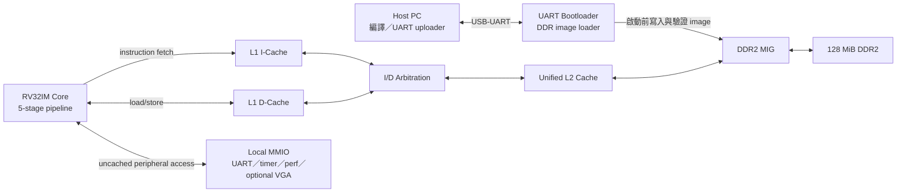
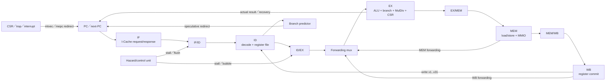
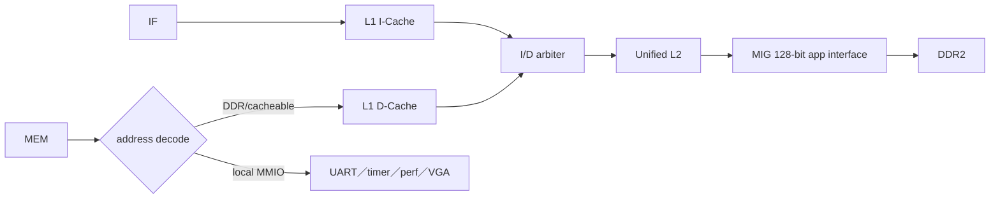

# CPU Architecture

本文件說明本專案目前主線 RISC-V CPU 的整體架構。內容以實際 RTL 為準，目標是讓第一次接觸此專案的讀者能回答以下問題：

- 這是一顆什麼類型的 CPU？
- 一條指令會經過哪些硬體？
- CPU 如何存取 Cache、DDR2 與 MMIO？
- 分支、資料相依、例外與中斷由哪些模組處理？
- 哪些功能已實作，哪些功能不在目前範圍內？

流水線逐拍行為請接著閱讀 [PIPELINE.md](PIPELINE.md)，資料冒險與 forwarding 請閱讀 [HAZARD_FORWARDING.md](HAZARD_FORWARDING.md)，分支預測請閱讀 [BRANCH_PREDICTION.md](BRANCH_PREDICTION.md)。Cache 與外部介面的實作細節則分別記錄在 [ICACHE.md](../02-memory-io/ICACHE.md)、[DCACHE.md](../02-memory-io/DCACHE.md)、[L2_CACHE_DDR2.md](../02-memory-io/L2_CACHE_DDR2.md)、[MMIO.md](../02-memory-io/MMIO.md)、[UART.md](../02-memory-io/UART.md) 與 [VGA.md](../02-memory-io/VGA.md)。

## 1. 架構摘要

| 項目 | 目前實作 |
|---|---|
| ISA | RV32IM + Zicsr |
| 資料寬度 | 32-bit |
| 指令寬度 | 固定 32-bit；不支援 RVC 壓縮指令 |
| 執行方式 | single-issue、in-order |
| 流水線 | IF、ID、EX、MEM、WB 五級 |
| 暫存器 | 32 × 32-bit，`x0` 永遠為 0 |
| 算術 | RV32I ALU + 多週期乘法／除法 |
| 分支 | 256-entry、2-bit counter PHT；ID 預測、EX 驗證 |
| 資料冒險 | MEM／WB → EX forwarding，load-use interlock |
| L1 I-Cache | 目前 bitstream 8 KiB；完整組態 64 KiB；2-way、64-byte line |
| L1 D-Cache | 目前 bitstream 8 KiB；完整組態 128 KiB；2-way、64-byte line |
| L2 Cache | 目前 bitstream 16 KiB；完整組態 256 KiB；2-way、64-byte line，I/D 共用 |
| 主記憶體 | 板載 128 MiB DDR2，透過 Xilinx MIG |
| 例外／中斷 | machine CSR、同步例外、software/timer/external interrupt、`mret` |
| 作業系統 | 可執行 FreeRTOS；不是 Linux 等具 MMU 的系統 |
| 板上核心時脈 | production 路徑使用 MIG `ui_clk`，目前約 50 MHz |

這顆 CPU 的理論發射上限是每 cycle 一條指令，但「五級流水線」不代表實際一定能達到 1 IPC。目前前端一次只追蹤一筆 outstanding fetch，且 D-Cache、L2 與 DDR 路徑是 blocking 設計；Cache handshake、memory stall、乘除法與控制流重導都可能降低 IPC。

## 2. 系統中的位置



UART bootloader 與 CPU 不會同時任意操作 DDR。板級控制會依序讓 DDR power-on test、UART bootloader、L2/CPU 取得 MIG app interface。Firmware image 驗證完成前，CPU 維持 reset；驗證成功後 CPU 才從 boot address 開始取指。

## 3. CPU 核心資料路徑



主整合模組是 [`icache_pipeline_top.v`](../../icache_pipeline_top.v)。五級功能分散在：

- [`IF.v`](../../IF.v)：PC 暫存器與 next-PC 選擇。
- [`ID.v`](../../ID.v)：register file、instruction decode、immediate generation。
- [`EX.v`](../../EX.v)：ALU、分支比較、target 計算、多週期乘除法。
- [`MEM.v`](../../MEM.v)：load/store transaction、byte lane、sign extension。
- [`WB.v`](../../WB.v)：將最終結果寫回 register file。

級與級之間由 [`IFID_register.v`](../../IFID_register.v)、[`IDEX_register.v`](../../IDEX_register.v)、[`EXMEM_register.v`](../../EXMEM_register.v) 與 [`MEMWB_register.v`](../../MEMWB_register.v) 隔開。每級 payload 都搭配 `valid`；`valid=0` 代表 bubble，不得產生 architectural side effect。

## 4. ISA 與程式設計模型

### 4.1 RV32I 整數指令

目前 decode 與 execute path 支援下列主要類型：

| 類型 | 指令或行為 |
|---|---|
| Integer register-register | `ADD/SUB/SLL/SLT/SLTU/XOR/SRL/SRA/OR/AND` |
| Integer immediate | `ADDI/SLLI/SLTI/SLTIU/XORI/SRLI/SRAI/ORI/ANDI` |
| Upper immediate | `LUI/AUIPC` |
| Load | `LB/LH/LW/LBU/LHU` |
| Store | `SB/SH/SW` |
| Conditional branch | `BEQ/BNE/BLT/BGE/BLTU/BGEU` |
| Jump | `JAL/JALR` |
| Ordering | `FENCE` 在目前單發射、順序核心中作為 NOP 接受 |
| System | `ECALL/EBREAK/MRET` 與 Zicsr 指令 |

`FENCE.I` 尚未實作，會被視為 illegal instruction。原因是目前 I-Cache 與 D-Cache 沒有提供完整的軟體可見自修改程式一致性流程；把 `FENCE.I` 當成 NOP 可能執行到舊指令。

### 4.2 RV32M

支援：

```text
MUL, MULH, MULHSU, MULHU
DIV, DIVU, REM, REMU
```

乘法與除法不是單 cycle 大型組合電路，而是多週期迭代單元：

- [`booth_multiplier.v`](../../booth_multiplier.v)：目前 RTL 以 32 回合 shift/add 方式形成乘積，再依 signedness 取低半或高半。
- [`restoring_divider.v`](../../restoring_divider.v)：32 回合 restoring division，並處理除以零與 signed overflow。

運算期間 `ex_stall_o` 會保持 EX 指令，hazard unit 將上游管線凍結。32 回合之外還有 start/done handshake，因此不應把 `MUL/DIV` 視為固定一個 cycle 的 ALU 指令。

### 4.3 Register file

Register file 具有：

- 兩個非同步 read port：`rs1`、`rs2`。
- 一個同步 write port：WB 寫入 `rd`。
- `x0` read 永遠回傳 0，write `x0` 會被忽略。
- ID 內建同 cycle WB bypass，避免「WB 正在寫、ID 同時讀相同暫存器」看到舊值。

這個 ID bypass 與 EX forwarding 是兩個不同層次：前者修正 register file write/read 同拍問題，後者讓尚未正式寫回的 MEM/WB 結果直接供 EX 使用。

### 4.4 目前未支援的架構功能

- RVC 16-bit compressed instructions。
- Atomic `A` extension。
- Floating-point `F/D` extension。
- MMU、page table、virtual memory。
- 完整 supervisor/user execution environment。
- SMP、多核心與 cache coherence。
- superscalar issue、out-of-order execution、rename、ROB。

因此這是一顆適合 bare-metal 與 FreeRTOS 的單核心 baseline，不是可直接啟動標準 Linux userspace 的處理器。

## 5. 五級流水線的責任

| Stage | 主要輸入 | 主要工作 | 主要輸出 |
|---|---|---|---|
| IF | PC | 發出 I-Cache request、接收 instruction response | instruction、對應 PC、fetch error |
| ID | instruction、PC、WB data | decode、讀 register、產生 immediate/control、查分支方向 | operands、`rd/rs1/rs2`、控制訊號、預測資訊 |
| EX | operands、control | forwarding 後計算 ALU、address、branch、CSR、MulDiv | ALU result、store data、actual branch result |
| MEM | address、store data | D-Cache/MMIO transaction、對齊 byte lane、load extend | load data 或非 load 結果 |
| WB | MEM/WB payload | 選定 ALU/load/PC+4 結果並寫回 | register file write port |

正常、沒有 stall 的理想化流程如下：

```text
cycle       1    2    3    4    5    6
instr A    IF   ID   EX   MEM  WB
instr B         IF   ID   EX   MEM  WB
instr C              IF   ID   EX   MEM  WB
```

但本專案 IF 不是零延遲 instruction ROM：I-Cache 使用 ready/valid request/response，top 還有 `if_pending` 與一格 response buffer。因此上圖用來理解 stage 重疊，不代表實際 waveform 每 cycle 都一定能送入一條新指令。詳細時序見 [PIPELINE.md](PIPELINE.md)。

### 5.1 具體例子：一條 `lw` 如何走完五級

假設程式執行：

```assembly
lw x5, 8(x1)       # 假設 x1 = 0x8000_1000
```

這不是一個單元在同一拍完成的動作，而是責任逐級移交：

| Stage | 這條 `lw` 的實際動作 |
|---|---|
| IF | 依 PC 從 I-Cache 取得 `lw` 的 32-bit instruction。 |
| ID | 解碼出 `rs1=x1`、`rd=x5`、immediate=`8`、操作種類為 32-bit load。 |
| EX | 使用 forwarding 後的 `x1` 計算有效位址：`0x8000_1000 + 8 = 0x8000_1008`，並檢查 4-byte 對齊。 |
| MEM | 對 D-Cache 發出讀取；hit 時較快回覆，miss 時 Pipeline 會等待 refill。 |
| WB | 將回傳的 32-bit word 寫入 `x5`。 |

若 D-Cache 尚未回覆，這條 `lw` 會保留在 memory transaction 路徑，上游不能假裝它已完成；若下一條指令立即使用 `x5`，hazard unit 還必須插入 load-use bubble。這個例子把 Pipeline、address calculation、Cache back-pressure 與 Hazard 串在同一條指令上。

## 6. 控制流與分支預測

Conditional branch 在 ID 使用 256-entry PHT 預測 taken/not-taken；每個 entry 是 2-bit saturating counter。JAL 固定預測 taken，JALR 因 target 依賴 `rs1`，目前等到 EX 才重導。

預測資料會跟著指令進入 ID/EX：

```text
pred_taken
pred_target
```

EX 使用 forwarding 後的 operands 計算實際條件與 target，再比較：

```text
方向是否相同？
若 taken，target 是否相同？
```

兩者都正確就不 flush；錯誤時才產生 recovery redirect，清除 IF/ID 與 ID/EX 的錯路徑指令。完整細節見 [BRANCH_PREDICTION.md](BRANCH_PREDICTION.md)。

## 7. Hazard 與 forwarding

這顆 CPU 是 in-order single-issue，因此資料相依主要是 RAW（read after write）：後一條指令需要前一條尚未寫回的結果。

Forwarding source 優先順序為：

```text
MEM stage > WB stage > ID/EX 原始 register value
```

ALU、`PC+4` 與已經回來的 load data 都能 forward。Load data 在 memory response 回來前不可 forward，因此緊鄰 load 的 consumer 仍要插入 bubble，若 memory transaction 尚未完成還要持續 backpressure。

Hazard/control unit 也負責：

- MEM busy 時凍結上游。
- MulDiv busy 時保持 EX 與上游。
- branch recovery 時 flush younger instructions。
- fetch handshake/backpressure 造成的 front-end hold。

完整邏輯、範例與限制見 [HAZARD_FORWARDING.md](HAZARD_FORWARDING.md)。

## 8. 記憶體階層

### 8.1 路徑



### 8.2 Cache 組態

| 層級 | 目前／完整組態 | 策略與特性 |
|---|---:|---|
| L1 I-Cache | 8 KiB／64 KiB、2-way、64 B line | 取指專用、2-stage lookup、line refill、2-way replacement |
| L1 D-Cache | 8 KiB／128 KiB、2-way、64 B line | blocking、write-back、store miss no-write-allocate |
| Unified L2 | 16 KiB／256 KiB、2-way、64 B line | blocking、write-back；cached read miss allocate、I/D 共用 |

I$／D$ 到 L2 的 bus 是 64-bit；一條 64-byte line 使用 8 個 64-bit beats。L2 到 MIG 的 app data 是 128-bit；一條 line 對應 4 個 128-bit beats。

`FAST_SIM`／`FAST_SYNTH` 會縮小容量：目前 I$ 8 KiB、D$ 8 KiB、L2 16 KiB。正式容量只有在 production build 組態下成立；做資源或效能比較時必須記錄 Verilog defines，不能只看模組預設註解。

### 8.3 Blocking 的意思

目前 D-Cache 與 L2 同一時間只追蹤有限、單一的 transaction。發生 miss、dirty eviction 或 DDR 等待時，MEM 產生 `mem_stall`，較年輕指令不能越過它。這讓控制與 precise exception 較簡單，但 memory-level parallelism 較低。

### 8.4 I/D 仲裁

[`I_D_arbitration.v`](../../I_D_arbitration.v) 在 I$ 與 D$ 間選擇一個 master，並保持選擇直到 response `last`。策略為：

1. uncached request 優先於 cached request。
2. 同類型時 D$ 優先於 I$。
3. 一筆 transaction 完成後才重新仲裁。

## 9. CPU 可見位址空間

| 範圍／位址 | 用途 |
|---|---|
| `0x8000_0000 ~ 0x87FF_FFFF` | 128 MiB DDR2 主視窗 |
| `0x0000_0000 ~ 0x07FF_FFFF` | DDR2 alias |
| `0x4000_0000 ~ 0x4000_FFFF` | local MMIO |
| `0x4000_0000` | UART TX data |
| `0x4000_0004` | UART TX status |
| `0x4000_0008` | UART RX data |
| `0x4000_000C` | UART RX status |
| `0x4000_0020/24` | `mtime` low/high |
| `0x4000_0028/2C` | `mtimecmp` low/high |
| `0x4000_0100 ~ 0x4000_01CC` | performance counter page |
| `0x5000_0000 ~ 0x5000_7FFF` | optional VGA MMIO window |

Local MMIO 在進入 D-Cache 前就被 decode，所以 UART、timer、performance counter 等操作不會被一般 cache line 隱藏。完整 map 與每個暫存器的語意請見 [MEMORY_MAP.md](../02-memory-io/MEMORY_MAP.md) 與 [MMIO.md](../02-memory-io/MMIO.md)。

## 10. Load/store 資料格式

CPU 對外使用 byte address。EX 計算：

```text
effective_address = rs1 + sign_extended_immediate
```

MEM 根據 `funct3` 與 `address[1:0]`：

- 為 `SB/SH/SW` 產生 4-bit byte strobe。
- 將 store data 移到正確 byte lane。
- 從 32-bit response 選出 byte/halfword/word。
- 對 `LB/LH` sign-extend，對 `LBU/LHU` zero-extend。

Misaligned halfword/word 不會拆成兩筆 transaction，而是在 EX 偵測並進入 exception。Byte access 永遠不會因對齊產生例外。

## 11. CSR、例外與中斷

### 11.1 CSR

目前 [`CSR.v`](../../CSR.v) 實作的主要 machine CSR：

```text
mstatus, mie, mtvec, mscratch,
mepc, mcause, mtval, mip, mhartid
```

支援 `CSRRW/CSRRS/CSRRC` 與 immediate 版本。CSR decode 會檢查支援位址、privilege 欄位與 read-only 寫入；非法存取轉成 illegal-instruction exception。

### 11.2 同步例外

目前硬體可產生的主要同步例外包括：

| 原因 | `mcause` code | 偵測位置 |
|---|---:|---|
| Instruction address misaligned | 0 | EX control target check |
| Instruction access fault | 1 | IF/I-Cache response |
| Illegal instruction | 2 | ID decode，EX 提交 trap |
| Breakpoint | 3 | EX |
| Load address misaligned | 4 | EX |
| Load access fault | 5 | MEM response |
| Store address misaligned | 6 | EX |
| Store access fault | 7 | MEM response |
| Environment call from M-mode | 11 | EX |

Trap 時保存 `mepc/mcause/mtval`，PC 重導到 direct-mode `mtvec`；`mret` 使用 `mepc` 返回。此實作以 machine mode 與 FreeRTOS port 所需功能為主，不應解讀為完整 privileged architecture。

### 11.3 中斷

[`machine_irq_sources.v`](../../machine_irq_sources.v) 提供：

- Machine software interrupt：MSIP，cause 3。
- Machine timer interrupt：`mtime >= mtimecmp`，cause 7。
- Machine external interrupt：UART RX 或 software MEIP，cause 11。

同時 pending 時目前優先順序是 external > software > timer。中斷採「先停止前端、讓既有指令排空，再在指令邊界進入 trap」的方式，避免把尚未完成的指令誤算進 `mepc`。

FreeRTOS 的 1 kHz tick 就是建立在 machine timer interrupt 上。

## 12. Reset 與啟動

板級 [`board_top.v`](../../board_top.v) 將 `RESET_PC` 設為 `0x8000_0000`。啟動流程不是 reset 後立刻執行未知 DDR 內容：

```text
100 MHz board clock
    ↓
clock bridge lock + reset hold
    ↓
MIG calibration
    ↓
DDR power-on memory test
    ↓
UART bootloader 接收、寫入、CRC/readback 驗證 firmware
    ↓
bootloader 交還 MIG ownership
    ↓
解除 CPU reset
    ↓
PC = 0x8000_0000，開始取指
```

`icache_pipeline_top` 本身的 `RESET_PC` 參數預設為 0，simulation 或不同 wrapper 可以覆寫；判斷某個 build 的啟動位址時應查看實際 top-level parameter，而不是只看 core 預設值。

## 13. 效能觀察

MMIO performance counter bank 提供 24 組 64-bit counter。與 CPU 微架構直接相關的事件包含：

- core cycles、retired instructions。
- front-end stall、memory/back-end stall。
- load-use hazard、MulDiv busy。
- conditional branch、taken branch、jump。
- control-flow recovery redirect。
- I$ fetch、I$ miss、D$ access、D$ miss/writeback。
- DDR read/write command。
- exception、interrupt、pipeline flush。

最基本的分析公式：

```text
IPC = retired_instructions / core_cycles
CPI = core_cycles / retired_instructions
```

若 IPC 低，應先比較 front-end stall、memory stall、MulDiv busy 與 redirect，而不是直接假設是 Cache miss。完整監測原理見 [PERFORMANCE_MONITORING_ARCHITECTURE.md](../02-memory-io/PERFORMANCE_MONITORING_ARCHITECTURE.md)，正式暫存器 ABI 見 [PERFORMANCE_COUNTER_REGISTERS.md](../02-memory-io/PERFORMANCE_COUNTER_REGISTERS.md)，實板量測結果見 [PERFORMANCE_BASELINE_ANALYSIS.md](../06-verification/PERFORMANCE_BASELINE_ANALYSIS.md)。

## 14. 重要設計限制

讀 RTL 或分析波形時要先記住：

1. **五級是 architectural pipeline 分類，不包含 I-Cache 內部 IF1/IF2、refill FSM 與 DDR latency。**
2. **目前前端只有一筆 outstanding fetch。** `if_pending` 與一格 response buffer 會直接影響取指吞吐量。
3. **D-Cache/L2 是 blocking。** Miss 時不會讓無關的 younger instruction 越過。
4. **分支預測器只有 direction PHT，沒有 BTB。** Branch/JAL target 在 ID 由 immediate 計算，JALR 等到 EX。
5. **沒有完整 I$/D$ coherence。** 不應依賴 runtime 自修改程式。
6. **沒有 MMU。** 所有軟體使用同一個實體位址空間。
7. **interrupt 進入前會排空 pipeline。** 這簡化精確狀態，但增加 interrupt latency。

## 15. RTL 導覽

| 主題 | 檔案 |
|---|---|
| Board integration | [`board_top.v`](../../board_top.v)、[`board_top_vga.v`](../../board_top_vga.v) |
| Core integration | [`icache_pipeline_top.v`](../../icache_pipeline_top.v) |
| Pipeline stages | [`IF.v`](../../IF.v)、[`ID.v`](../../ID.v)、[`EX.v`](../../EX.v)、[`MEM.v`](../../MEM.v)、[`WB.v`](../../WB.v) |
| Pipeline registers | [`IFID_register.v`](../../IFID_register.v)、[`IDEX_register.v`](../../IDEX_register.v)、[`EXMEM_register.v`](../../EXMEM_register.v)、[`MEMWB_register.v`](../../MEMWB_register.v) |
| Hazard/forwarding | [`hazard_unit.v`](../../hazard_unit.v)、[`forward_unit.v`](../../forward_unit.v) |
| Branch prediction | [`branch_predictor.v`](../../branch_predictor.v) |
| CSR/trap | [`CSR.v`](../../CSR.v)、[`misalign_check.v`](../../misalign_check.v)、[`machine_irq_sources.v`](../../machine_irq_sources.v) |
| MulDiv | [`booth_multiplier.v`](../../booth_multiplier.v)、[`restoring_divider.v`](../../restoring_divider.v) |
| L1 cache | [`icache.v`](../../icache.v)、[`dcache.v`](../../dcache.v) |
| L2/arbitration | [`L2_cache.v`](../../L2_cache.v)、[`I_D_arbitration.v`](../../I_D_arbitration.v) |
| Main pipeline TB | [`icache_pipeline_tb.v`](../../icache_pipeline_tb.v) |

## 16. 建議閱讀順序

第一次讀專案時建議：

1. 先讀本文件，理解邊界與名詞。
2. 讀 [PIPELINE.md](PIPELINE.md)，追一條指令的 stage 與 valid/stall/flush。
3. 讀 [HAZARD_FORWARDING.md](HAZARD_FORWARDING.md)，理解為什麼有些相依不需停、有些必須停。
4. 讀 [BRANCH_PREDICTION.md](BRANCH_PREDICTION.md)，理解 speculative redirect 與 recovery redirect 的差別。
5. 對照 `icache_pipeline_top.v` 的 `u_pc → u_if_id → u_id → u_id_ex → u_ex → u_ex_mem → u_mem → u_mem_wb → u_wb`。
6. 最後才進入 I$/D$/L2 FSM，避免一開始被 memory handshake 細節淹沒。
