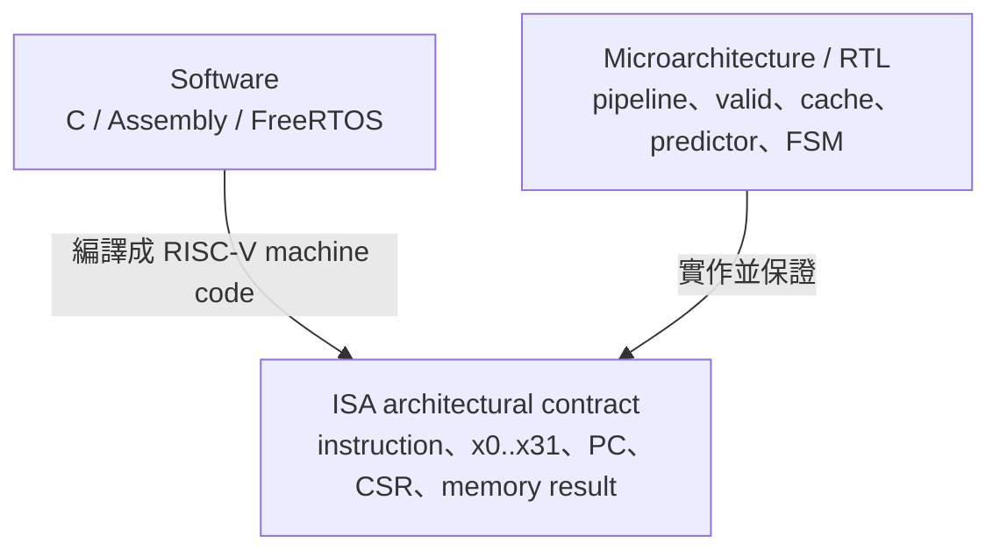
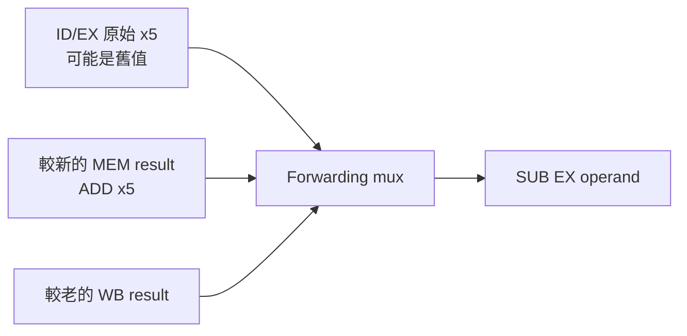
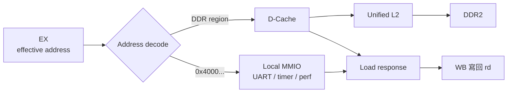
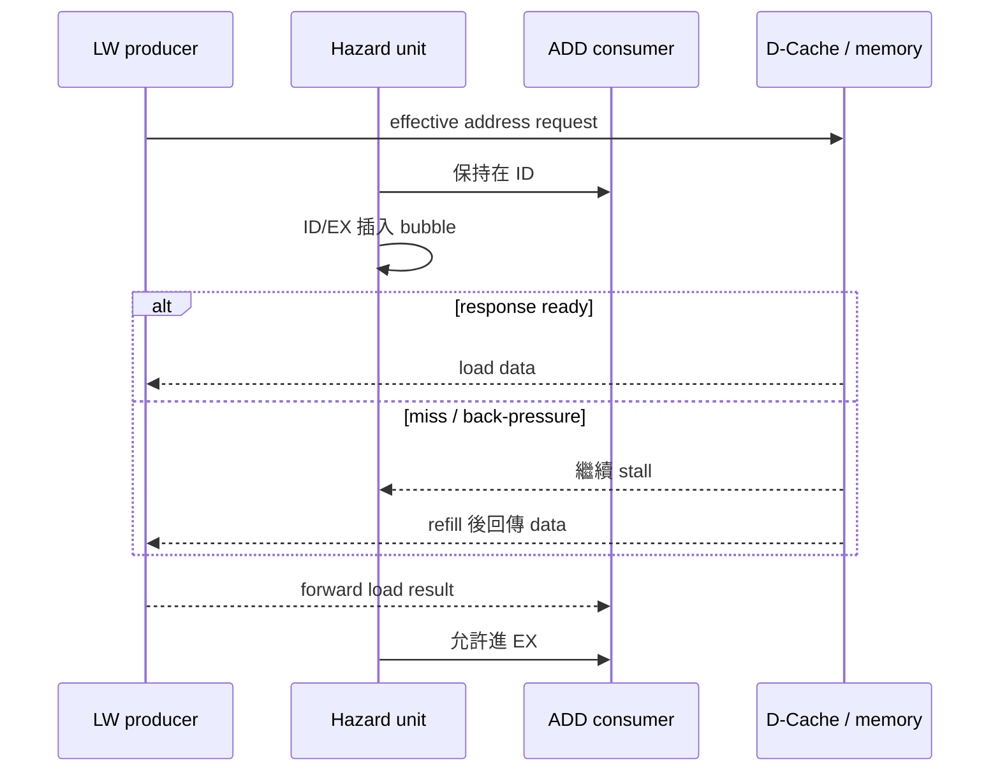
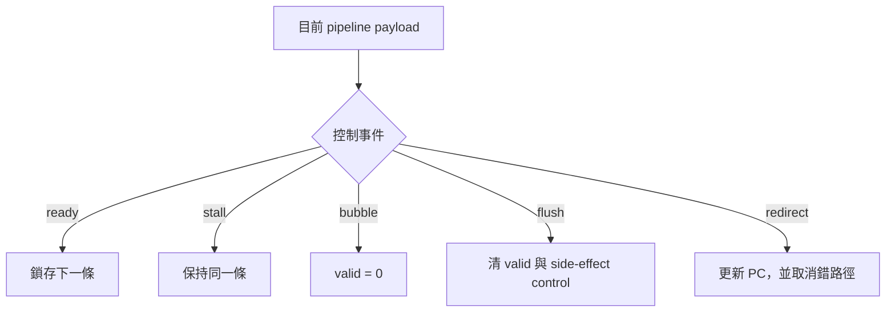
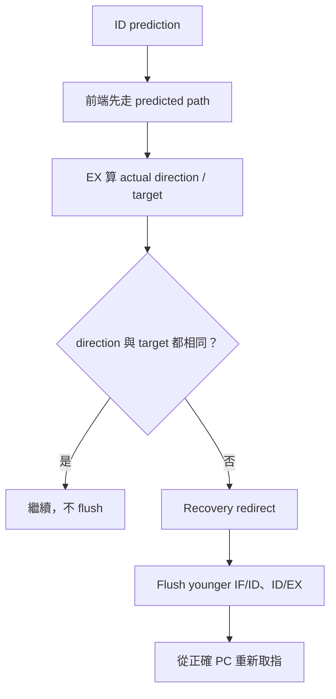
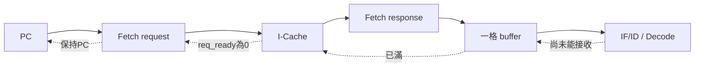
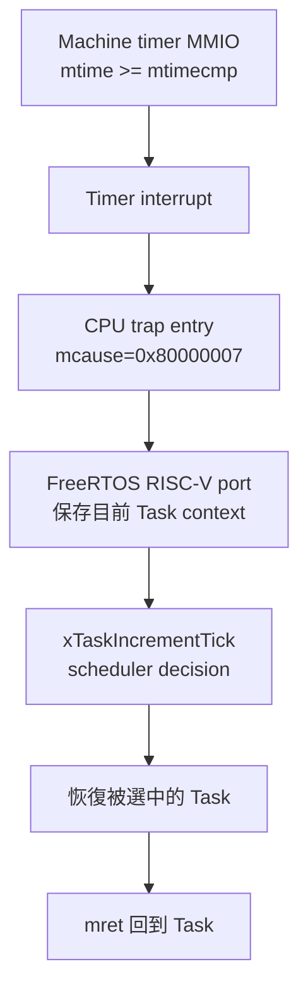
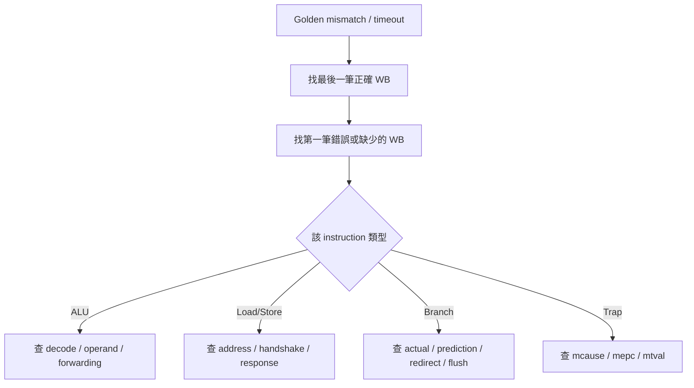

# CPU 初學者接手指南

本文件提供給已經做過基本 Verilog 設計、知道 clock、register、組合邏輯與五級 pipeline 名稱，但還沒有完整 CPU 設計經驗的讀者。它不是 RISC-V 規格書，也不會一次講完所有 RTL；目標是先建立一個足以閱讀本專案的心智模型。

讀完並完成最後的練習後，應能回答：

- 一條 `ADD`、`LW`、`SW` 或 `BEQ` 每個 cycle 位於哪一級。
- Pipeline register 為什麼必須保存資料、控制訊號與 `valid`。
- Forwarding、stall、bubble、flush 與 redirect 分別解決什麼問題。
- I-Cache／D-Cache 的 valid/ready request/response 為什麼會讓 pipeline 等待。
- 發生 exception 或 interrupt 時，哪些指令可以完成、哪些必須取消。
- 第一次看 simulation log 或 waveform 時，應先看哪些訊號。


## 0. 需要具備與暫時不需要具備的知識

建議先具備：

- 知道 `always @(*)` 與 `always @(posedge clk)` 的差異。
- 知道 non-blocking assignment `<=` 會在 clock edge 更新 register。
- 看得懂 module port、wire、reg、mux、FSM 與 counter。
- 知道二進位、十六進位與二補數的基本概念。
- 知道五級 pipeline 名稱：IF、ID、EX、MEM、WB。

第一次閱讀時暫時不需要：

- 背完所有 RISC-V instruction encoding。
- 理解完整 FreeRTOS kernel source。
- 理解 DDR2 電氣訓練與 MIG 內部電路。
- 理解所有 CSR bit、Lua VM 或 performance counter。
- 先把 73 份文件全部讀完。

遇到縮寫時先查 [專案縮寫與名詞表](../GLOSSARY.md)。

## 1. 先分清楚三個層次

初學 CPU 最容易把「程式」、「ISA」與「RTL」混在一起。



| 層次 | 它回答什麼 | 範例 |
|---|---|---|
| Software | 想完成什麼工作？ | `c = a + b`、Task、Queue |
| ISA | CPU 對軟體承諾什麼結果？ | `ADD` 把 `rs1 + rs2` 寫入 `rd` |
| Microarchitecture | 硬體內部如何做出該結果？ | 五級 pipeline、forwarding、Cache、stall |

RISC-V 規格通常不要求 `ADD` 一定幾個 cycle 完成，只要求最後 architectural result 正確。本專案選擇五級、single-issue、in-order microarchitecture；另一顆 RV32IM CPU 可以使用完全不同的 pipeline，仍執行相同 machine code。

### 1.1 Architectural state 與內部 state

Architectural state 是軟體能觀察或依賴的狀態：

- 32 個 integer registers `x0..x31`，其中 `x0` 永遠為 0。
- Program Counter（PC）。
- Memory 內容。
- Machine CSR，例如 `mstatus`、`mepc`、`mcause`。

Microarchitectural state 是 RTL 為了實作而保存、軟體不應直接依賴的狀態：

- IF/ID、ID/EX、EX/MEM、MEM/WB payload 與 valid bit。
- I-Cache／D-Cache tag、valid、dirty 與 LRU。
- `if_pending`、memory FSM、MulDiv busy。
- Branch predictor 的 2-bit counter。

除錯時要問：錯的是 architectural result，還是某個內部 state 沒有正確移動？

## 2. 一條 instruction 是 32-bit 資料

CPU 不直接看見 C 語言。C／Assembly 先在 PC 上被 toolchain 編譯成 32-bit RISC-V instruction words，再放進 `.mem` 並上傳到 DDR2。

例如：

```asm
add x5, x1, x2
```

意思是：

```text
x5 = x1 + x2
```

它的 RV32I machine word 是：

```text
0x002082B3
```

R-type 欄位概念如下：

```text
31       25 24    20 19    15 14  12 11     7 6       0
┌──────────┬────────┬────────┬──────┬────────┬─────────┐
│ funct7   │  rs2   │  rs1   │funct3│   rd   │ opcode  │
└──────────┴────────┴────────┴──────┴────────┴─────────┘
```

ID stage 不是把 instruction 當成一個數字做加法，而是拆出 opcode、`rs1`、`rs2`、`rd`、`funct3`、`funct7`，產生後續各級需要的 control signals。

## 3. Clock edge 與 pipeline register

五級 pipeline 不是五個 software function 依序呼叫，而是五組硬體同時工作，並在 clock edge 用 pipeline register 分隔。


在兩個 clock edge 之間：

1. 前一級 register 輸出保持。
2. 組合邏輯依目前輸入計算 next payload。
3. 到下一個 clock edge，若沒有 stall/flush，下一級 register 鎖存結果。

概念 Verilog：

```verilog
always @(*) begin
    next_result = operand_a + operand_b;
end

always @(posedge clk or negedge rst_n) begin
    if (!rst_n)
        result_q <= 32'b0;
    else if (flush)
        result_q <= 32'b0;
    else if (!stall)
        result_q <= next_result;
end
```

Pipeline register 保存的不只是 data。以 ID/EX 為例，它必須把同一條 instruction 的下列內容一起帶到 EX：

```text
PC、rs1 value、rs2 value、immediate、rs1/rs2/rd index、
ALU operation、register write enable、memory read/write、
branch/jump、writeback selection、CSR metadata、prediction metadata、valid
```

如果 operand 是 instruction A，`rd` 或 `reg_write` 卻來自 instruction B，硬體就會把正確結果寫到錯誤 register。

## 4. 五級各自負責什麼

| Stage | 本專案主要工作 | 典型輸出 |
|---|---|---|
| IF | 使用 PC 經 I-Cache request/response 取得 instruction | instruction、對應 PC、fetch error |
| ID | Decode、產生 immediate、讀 register file、查分支預測 | operands、`rd`、control、prediction metadata |
| EX | ALU、比較 branch、算 target/effective address、CSR、MulDiv | ALU result、store data、actual control result |
| MEM | 發出 Load／Store／MMIO transaction，處理 byte lane與load extension | load data、store completion、memory error |
| WB | 選 ALU／Load／`PC+4` 結果並寫回 integer register | `rd`、write data、write enable |

正常 integer instruction 最後在 WB 更新 register file；Store 的 architectural side effect 在 memory transaction 完成時發生；CSR/trap 另有自己的更新與 redirect 控制。

## 5. 第一次追蹤：`ADD`

假設：

```text
x1 = 3
x2 = 4
```

執行：

```asm
add x5, x1, x2
```

逐級觀察：

| Stage | 動作 |
|---|---|
| IF | 從 `PC` 取回 `ADD` machine word |
| ID | Decode 為 ALU add，讀出 `x1=3`、`x2=4`，保存 `rd=5`、`reg_write=1` |
| EX | Forwarding mux 選出最新 operands，ALU 算出 `7` |
| MEM | 這不是 Load／Store，所以只把 ALU result 往後傳 |
| WB | `valid && rd_wen && rd!=0`，將 `7` 寫入 `x5` |

理想時序：

```text
Cycle        1    2    3    4    5
ADD x5      IF   ID   EX   MEM  WB
```

但 CPU 不會等這條 `ADD` 完成才開始下一條。三條互不相依的 instruction 可以重疊：

```text
Cycle        1    2    3    4    5    6    7
Instr A     IF   ID   EX   MEM  WB
Instr B          IF   ID   EX   MEM  WB
Instr C               IF   ID   EX   MEM  WB
```

這就是 pipeline 提高 throughput 的來源。Latency 仍約為多級，但填滿後理論上可更頻繁完成 instruction；目前實作還會受 fetch handshake、memory 與其他 stall 限制。

## 6. `valid`：這一級現在真的有 instruction 嗎？

Pipeline register 的 data bits 即使沒有真實 instruction，也一定會顯示某些 0/1。因此每級需要 `valid` 表明 payload 是否有效。

```text
valid = 1：這級有一條真實 instruction
valid = 0：這級是空槽／bubble，不得產生 side effect
```

合法 NOP 與 bubble 不同：

```text
ADDI x0,x0,0：合法 instruction，valid=1，只是沒有可見結果
Bubble：       沒有 instruction，valid=0
```

檢查 waveform 時，永遠先看 `valid`。不要看到 `rd=5` 或 `mem_write=1` 的殘留 data 就判定正在提交；side effect 必須同時受到 valid 與 write enable 保護。

## 7. 第二次追蹤：RAW hazard 與 Forwarding

```asm
add x5, x1, x2
sub x6, x5, x3
```

第二條 `SUB` 在 ID 讀 `x5` 時，第一條 `ADD` 還沒到 WB，所以 register file 中可能仍是舊值。可是 `SUB` 真正使用 operand 是下一拍的 EX，此時 `ADD` result 已位於 MEM payload。



選擇優先序：

```text
最新且可用的 MEM result > WB result > ID/EX 原始 register value
```

因此一般 ALU → ALU RAW dependency 不需要 stall。Hazard Detection Unit（HDU）仍會比較 `rs1/rs2` 與較老 `rd`，但知道資料可 forwarding 時會放行。

## 8. Load／Store 與記憶體不是組合式陣列

### 8.1 `LW`

```asm
lw x5, 0(x10)
```

它不是在 EX 直接得到資料：

```text
ID：讀 x10、產生 immediate 0
EX：effective address = x10 + 0
MEM：向 D-Cache／MMIO 發 request，等待 response
WB：把 load data 寫入 x5
```

資料路徑：



Cache hit、miss、DDR latency 或 UART ready 狀態不同，response latency也不同，所以 MEM 使用 request/response FSM，而不是假設固定一拍完成。

### 8.2 `SW`

```asm
sw x5, 0(x10)
```

Store 有兩個不同來源：

```text
rs1 = x10：用來算 address
rs2 = x5 ：要寫入 memory 的 data
```

兩者都可能需要 forwarding。Store 也必須等 downstream completion；request 被接受不一定代表資料已完成寫入。

MEM stage 會在 transaction 完成後產生一次完成狀態，並以 `done_q` 避免仍被 hold 的同一條 EX/MEM Store 被辨識為新交易而重送。

## 9. 第三次追蹤：Load-use hazard

```asm
lw  x5, 0(x10)
add x6, x5, x7
```

當 `LW` 位於 EX 時只算出 address，load data 尚未從 D-Cache／memory 回來。下一拍 `ADD` 若直接進 EX，沒有任何正確資料可 forward。

因此 HDU：

```text
保持 PC／IF/ID，讓 ADD 留在 ID
讓 LW 繼續進 MEM
清除 ID/EX valid，插入一個 bubble
資料回來後再讓 ADD 進 EX
```



「Load-use 需要一個 bubble」是資料相依的最低成本；若 Cache miss，memory stall 還可能持續很多 cycle。

## 10. Stall、Bubble、Flush 與 Redirect

| 名稱 | Pipeline register 動作 | 目的 |
|---|---|---|
| Normal advance | 鎖存上游的新 payload | 正常推進 instruction |
| Stall | 保持目前 payload | 等資料、resource或transaction完成 |
| Bubble | 插入 `valid=0` 空槽 | 讓較老 instruction 前進、consumer延後 |
| Flush | 把錯路徑／不得提交的 payload 變成 invalid | 取消 younger instruction 或 faulting side effect |
| Redirect | 修改 next PC | 改從 branch target、`mtvec` 或 `mepc` 取指 |



Stall 與 Flush 不可混用：

- Stall 是「這條還要保留，只是現在不能前進」。
- Flush 是「這條不應再存在，之後不能產生 side effect」。

## 11. 第四次追蹤：Branch prediction 與 recovery

```asm
beq x1, x2, target
```

本專案：

1. ID 查 PHT，預測 taken 或 not-taken。
2. 若預測 taken，前端先改取 target；否則先取 `PC+4`。
3. Prediction metadata 跟著 instruction 進 ID/EX。
4. EX 使用 forwarding 後的 operands 算 actual result。
5. EX 比較 predicted direction/target 與 actual result。
6. 猜錯時 redirect 到正確 PC，flush IF/ID、ID/EX，kill stale fetch。



做出判斷的 EX branch 是較老 instruction，不能被自己的 recovery flush；被取消的是它後方較年輕、已走錯路的 instruction。

## 12. Front-end 與 valid/ready back-pressure

IF 不是一個零延遲 ROM port。Top 與 I-Cache 使用分離的 request/response channel：

```text
Request accepted  = req_valid  && req_ready
Response consumed = resp_valid && resp_ready
```

規則：

- `valid=1、ready=0` 時，傳送端必須保持 address/data/control。
- 不能只看到 `valid=1` 就重複計數或視為多筆交易。
- `if_pending=1` 表示已有一筆 accepted fetch 尚未回覆。
- 一格 response buffer 已滿時，不能再接下一筆 instruction response。



虛線是 back-pressure 往上游傳遞。單純 Front-end stall 主要停止 PC 與新 fetch，已位於後方的較老 instruction 仍可能繼續前進；MEM busy 或 MulDiv 等 HDU stall 才可能保持更多 pipeline stages。

目前通常只有一筆 outstanding fetch，因此即使 I-Cache hit，也不保證每 cycle 供應一條 instruction。這是「五級 pipeline 理論吞吐」與目前實測 IPC 不同的重要原因。

## 13. Exception、Interrupt 與 Trap

先分清楚：

| 名稱 | 來源 | 例子 |
|---|---|---|
| Exception | 與當前 instruction 同步 | illegal instruction、misaligned load、access fault、ECALL |
| Interrupt | 外部於目前 instruction stream | machine timer、UART external interrupt |
| Trap | CPU 轉去 handler 的共同動作 | 保存 CSR、跳到 `mtvec` |

Trap entry 會保存：

```text
mepc   = 返回／faulting PC
mcause = interrupt bit + cause code
mtval  = fault address等補充資料
PC     = mtvec
```

Precise exception 的目標：

```text
faulting instruction 之前：已完成
faulting instruction：沒有不該發生的 side effect
faulting instruction 之後：全部取消
```

Interrupt 沒有固定 faulting instruction，所以目前 CPU 先停止前端、讓 pipeline 排空，再在明確 instruction boundary 保存 continuation PC。這使控制簡單，但 interrupt latency 可能受 memory 或 MulDiv busy 影響。

## 14. FreeRTOS 如何接到 CPU

FreeRTOS 不是另一個硬體模組。它是編譯成 RISC-V machine code、由同一顆 CPU 執行的 software。



CPU 只提供 instruction、timer、CSR、interrupt 與 memory。Task、Queue、priority 與 scheduler 是 FreeRTOS kernel 的資料結構與程式邏輯。

## 15. RTL 檔案地圖

第一次看 source 建議按資料流，而不是依檔名字母順序：

| 順序 | 檔案 | 先看什麼 |
|---:|---|---|
| 1 | [`icache_pipeline_top.v`](../../icache_pipeline_top.v) | 各 stage 如何接線、stall/flush、Cache與CSR整合 |
| 2 | [`IF.v`](../../IF.v) | PC register與redirect priority |
| 3 | [`IFID_register.v`](../../IFID_register.v) | valid、stall、flush的最小例子 |
| 4 | [`ID.v`](../../ID.v) | opcode decode、register file、immediate、control |
| 5 | [`IDEX_register.v`](../../IDEX_register.v) | 一條 instruction 的完整 control/payload如何移到EX |
| 6 | [`EX.v`](../../EX.v) | ALU、branch、effective address、MulDiv |
| 7 | [`forward_unit.v`](../../forward_unit.v) | MEM/WB forwarding priority |
| 8 | [`hazard_unit.v`](../../hazard_unit.v) | Load-use與各級 stall/flush輸出 |
| 9 | [`EXMEM_register.v`](../../EXMEM_register.v) | EX結果與Store data如何進MEM |
| 10 | [`MEM.v`](../../MEM.v) | request FSM、`busy_q/done_q`、Load alignment |
| 11 | [`MEMWB_register.v`](../../MEMWB_register.v)、[`WB.v`](../../WB.v) | 最終資料選擇與register write |

讀一個 module 時依序找：

1. Inputs／outputs。
2. 哪些是 combinational wires。
3. 哪些是 clocked state。
4. Reset value。
5. Stall 時保持什麼。
6. Flush 時清除什麼。
7. 哪個條件真正代表 transaction／instruction 被接受。

## 16. 第一次執行 CPU simulation

工具需求見 [REQUIREMENTS.md](../03-build-boot/REQUIREMENTS.md)。在 PowerShell 編譯主 testbench：

```powershell
cd C:/cpu_design
New-Item -ItemType Directory -Force build_verification | Out-Null
$rtl = Get-ChildItem . -Filter *.v -File | ForEach-Object { $_.FullName }
iverilog -g2005-sv -DFAST_SIM -i `
  -o ./build_verification/icache_pipeline_tb.out `
  -s icache_pipeline_tb $rtl
if ($LASTEXITCODE -ne 0) { throw "CPU TB compile failed" }
```

先跑四個最適合初學者的 test：

```powershell
1..4 | ForEach-Object {
  $id = $_
  $lines = & vvp ./build_verification/icache_pipeline_tb.out `
    "+TEST=$id" +ASSERT_EN=1 +MAXCYCLES=250000 2>&1
  $code = $LASTEXITCODE
  $lines
  $text = $lines -join "`n"
  if ($code -ne 0 -or
      $text -notmatch "PASS:\s+test\s+$id" -or
      $text -match "ASSERT_FAIL|FATAL|TIMEOUT|FAIL:") {
    throw "TEST=$id failed"
  }
}
```

| TEST | 先觀察的概念 | 預期結果 |
|---:|---|---|
| 1 | ALU dependency與forwarding | `x3=0x00000004` |
| 2 | Load-use bubble／memory wait | `x2=0x00000012` |
| 3 | Store address/data dependency | `x2=0x00000005` |
| 4 | Taken branch、redirect與flush | `x2=0x00000002` |

Icarus 可能顯示 `$readmemh(...): Not enough words`，因為小型測試映像沒有填滿整個 behavioral memory array。只要出現正確 `PASS`、沒有 assertion／fatal／timeout，這項 warning 本身不是 CPU failure。

完整 1..27 對照與指令見 [CPU_REGRESSION.md](../06-verification/CPU_REGRESSION.md)。

### 16.1 使用文字 trace

若要看較多 pipeline debug輸出，可另外編譯一份，不要覆蓋平常使用的 binary：

```powershell
$rtl = Get-ChildItem . -Filter *.v -File | ForEach-Object { $_.FullName }
iverilog -g2005-sv -DFAST_SIM -DPIPE_TRACE -i `
  -o ./build_verification/icache_pipeline_trace_tb.out `
  -s icache_pipeline_tb $rtl

vvp ./build_verification/icache_pipeline_trace_tb.out `
  +TEST=1 +ASSERT_EN=1 +MAXCYCLES=250000
```

也可以產生簡單 commit trace：

```powershell
vvp ./build_verification/icache_pipeline_tb.out `
  +TEST=1 +ASSERT_EN=1 `
  +TRACE_EN=1 `
  +TRACE_FILE=./build_verification/test1.trace
```

目前這份 trace 主要記錄 `cycle、rd、wdata`，適合確認何時寫回哪個 register；它沒有保存完整 pipeline waveform，也沒有逐筆 PC。要分析 stall/flush 同拍關係時，仍應使用 RTL simulator waveform或 `PIPE_TRACE`。

## 17. 第一次看 waveform 的順序

不要一次把所有 top-level signal 加進 waveform。依下列順序建立群組：

### 17.1 Clock／Reset

```text
core_clk
core_rst_n
core_running_o
```

先確認 CPU 真的離開 reset；reset 未解除時，後面的 X／0 都沒有分析價值。

### 17.2 Instruction identity

```text
if_pc
fetch_resp_pc / fetch_resp_inst
id_valid / id_pc / id_instr
ex_valid / ex_pc
mem_valid / mem_pc4
wb_valid / wb_rd / wb_wdata / wb_rd_wen
```

`mem_pc4 - 4` 可作為一般 MEM instruction PC 的概念參考。永遠把 PC 與 valid 放在一起看。

### 17.3 Pipeline control

```text
stall_if / stall_id / stall_ex / stall_exmem
flush_ifid / flush_idex
redirect_valid / redirect_pc
sys_flush_now
```

看到 PC 沒動時，先找是哪個 stall；看到 instruction 消失時，判斷是正常前進、bubble 還是 flush。

### 17.4 Data dependency

```text
id_rs1 / id_rs2
ex_rd / mem_rd / wb_rd
ex_rs1_val / ex_rs2_val
ex_rs1_val_fwd / ex_rs2_val_fwd
mem_reg_write / wb_rd_wen
```

先確認 register index match，再確認 forwarding mux選到哪個 value。

### 17.5 Memory transaction

```text
mem_mem_read / mem_mem_write
mem_alu_result
mem_stall
dmem_req_o / dmem_ready_i / dmem_rvalid_i
mem_load_valid / mem_load_rdata
```

對 valid/ready interface，不只看訊號有沒有變成1；應找 `valid && ready` 的 accepted cycle。

## 18. 除錯的正確方向

最後 golden register 錯誤通常只是結果，不一定是根因。建議：



不要從程式最後錯誤值，直接猜幾千 cycle 前哪一條 RTL assignment 有問題。先找到「第一個 architectural divergence」，再往前追它的 producer、request或redirect。

## 19. 五個接手練習

### 練習一：解釋 `ADD`

選 TEST=1，回答：

- Producer的 `rd` 是多少？
- Consumer的 `rs1/rs2` 哪一個match？
- Forwarding來源是MEM還是WB？
- 最後在哪個cycle寫回哪個register？

### 練習二：找出Load-use bubble

選 TEST=2，回答：

- `LW`在哪一級時HDU發現dependency？
- 哪些register保持？
- 哪一級被設成`valid=0`？
- Load data回來後從哪裡forward？

### 練習三：分開Store address與data

選 TEST=3，回答：

- `rs1`與`rs2`各自用途是什麼？
- Store data是否使用forwarded value？
- 哪一拍request被接受？
- 哪一拍transaction真正完成？

### 練習四：找出錯路徑instruction

選 TEST=4，回答：

- Branch在ID預測什麼？
- EX actual result是什麼？
- Recovery PC是多少？
- IF/ID、ID/EX中哪些younger instruction被flush？

### 練習五：解釋Front-end等待

在任一測試找一次`if_pending=1`，回答：

- Request在哪一拍`valid && ready`？
- Response何時回來？
- Response buffer何時被IF/ID消耗？
- 這段等待是否也讓EX/MEM停止？為什麼？

## 20. 常見誤解

### 五級CPU代表每條instruction固定五個cycle？

不是。五級是工作分類；fetch、memory、MulDiv、hazard與redirect都可能延長實際時間。

### `stall_if=1`代表整顆CPU完全停止？

不一定。Front-end stall可以只停止PC與新取指；MEM或MulDiv造成的HDU stall才可能保持更多stage。

### Signal連續三拍為1代表送了三筆transaction？

不一定。valid/ready介面只有每次`valid && ready`才算accepted；ready=0時valid可以合法保持多拍。

### Forwarding代表register file已經更新？

不是。它只是讓consumer的EX mux直接取得pipeline中較新的結果；register file可能要到WB才更新。

### Flush就是把instruction改成NOP？

安全實作通常也會清control，但真正表示「不得提交」的是valid清0；合法NOP仍是valid instruction。

### Cache hit就一定每cycle一條instruction？

目前不是。I-Cache內部、top的`if_pending`與一格response buffer仍限制連續供應吞吐。

### FreeRTOS Task是CPU硬體中的新pipeline嗎？

不是。Task是memory中的software context；同一顆CPU透過保存／恢復register與stack輪流執行。

## 21. 完成標準

若新人可以不看答案完成下列項目，就已具備開始修改局部RTL的基礎：

- [ ] 畫出IF、ID、EX、MEM、WB與四個pipeline registers。
- [ ] 說明combinational邏輯與clocked state在一個cycle中的關係。
- [ ] 追蹤`ADD`從IF到WB所攜帶的data/control。
- [ ] 解釋一般ALU RAW為何可forward，Load-use為何要bubble。
- [ ] 分辨Stall、Bubble、Flush與Redirect。
- [ ] 對valid/ready找出真正handshake cycle。
- [ ] 解釋Front-end stall與全pipeline stall的差異。
- [ ] 跑過CPU TEST=1..4，看到正確PASS結果。
- [ ] 找到一次WB write，說明`rd`與`wdata`從哪裡來。
- [ ] 找到一次branch recovery，指出被flush的younger instruction。

## 22. 下一步閱讀順序

完成本頁後，不需要立刻讀全部CPU文件。依序閱讀：

1. [CPU_ARCHITECTURE.md](CPU_ARCHITECTURE.md)：把本頁概念對到完整系統。
2. [PIPELINE.md](PIPELINE.md)：看各級payload與所有典型時序。
3. [HAZARD_FORWARDING.md](HAZARD_FORWARDING.md)：深入RAW、Load-use與back-pressure。
4. [BRANCH_PREDICTION.md](BRANCH_PREDICTION.md)：深入PHT、prediction metadata與recovery。
5. [ICACHE.md](../02-memory-io/ICACHE.md)與[DCACHE.md](../02-memory-io/DCACHE.md)：深入request、miss與refill。
6. [CSR_EXCEPTION_INTERRUPT.md](CSR_EXCEPTION_INTERRUPT.md)：最後再學trap與machine interrupt。
7. [MULDIV.md](MULDIV.md)：需要修改RV32M或多週期EX時再讀。
8. [CLOCK_RESET.md](CLOCK_RESET.md)：需要上板、CDC或reset除錯時再讀。

返回：[CPU架構導覽](README.md) · [文件閱讀中心](../README.md) · [CPU功能回歸](../06-verification/CPU_REGRESSION.md)
