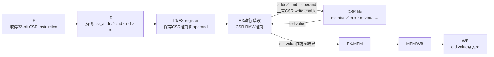
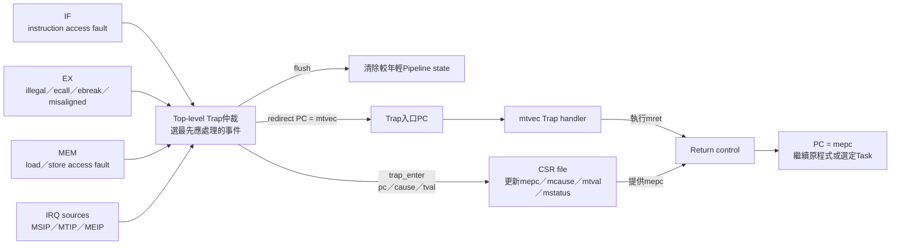
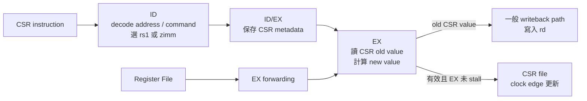
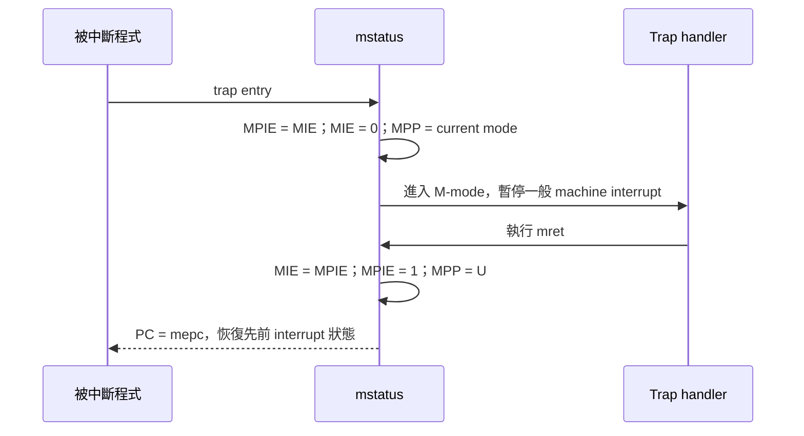
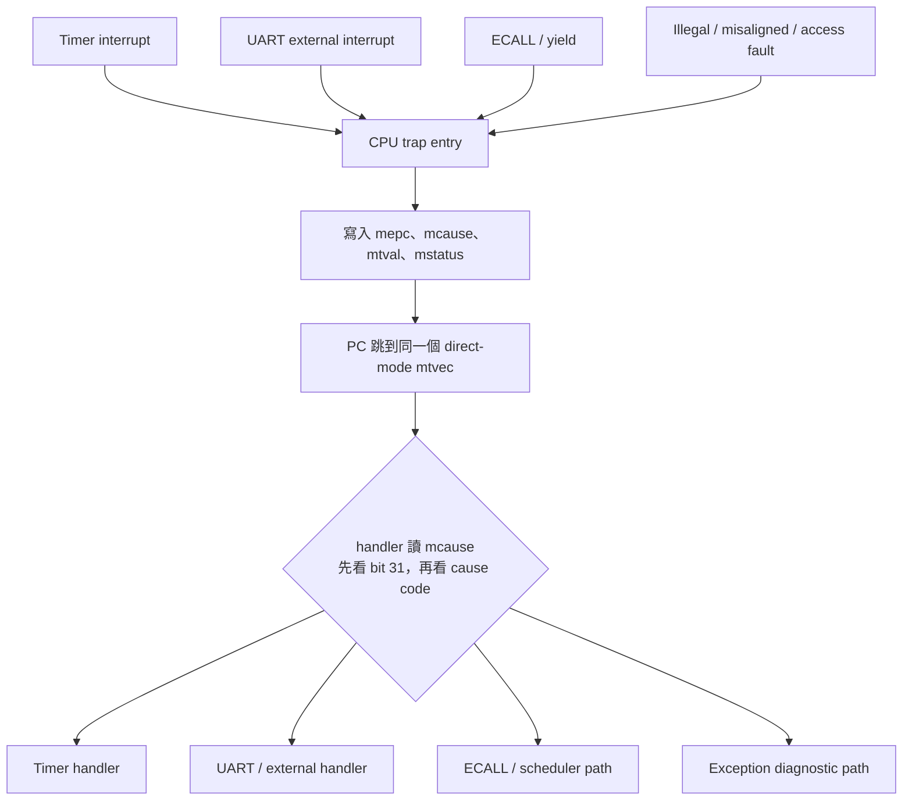
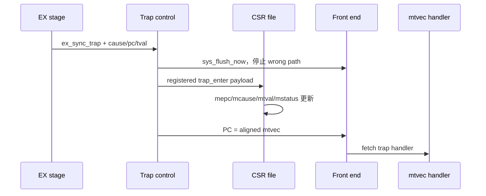
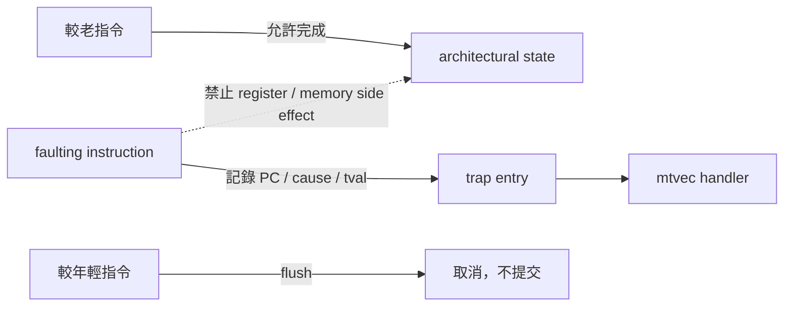
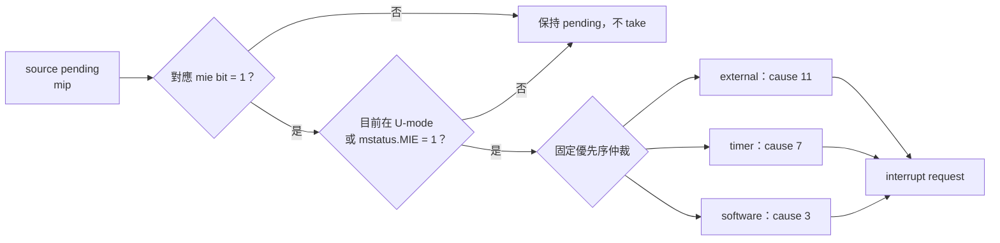
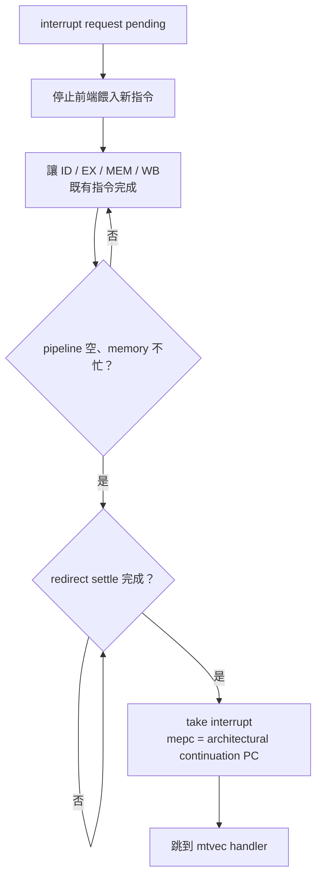

# CSR, Exception and Interrupt

本文件說明目前 CPU 的 Zicsr 指令、machine CSR、同步例外、非同步中斷、trap 進入流程與 `mret` 返回流程。內容以 [`ID.v`](../../ID.v)、[`CSR.v`](../../CSR.v)、[`machine_irq_sources.v`](../../machine_irq_sources.v) 與 [`icache_pipeline_top.v`](../../icache_pipeline_top.v) 的實際 RTL 為準。

建議先閱讀 [CPU_ARCHITECTURE.md](CPU_ARCHITECTURE.md) 與 [PIPELINE.md](PIPELINE.md)，再配合本文件理解 trap 對 pipeline 的影響。

## 1. 四個容易混淆的名詞

### 1.1 CSR

CSR 是 Control and Status Register。它不是一般的 `x0~x31` integer register，而是用來保存處理器控制與 trap 狀態的特殊暫存器，例如：

```text
mstatus：全域中斷與 privilege 狀態
mie：各類 machine interrupt enable
mtvec：trap handler 入口
mepc：trap 返回位置
mcause：trap 原因
mtval：例外補充資訊
```

CSR 透過 `CSRRW/CSRRS/CSRRC` 等指令讀寫，不是透過一般 load/store。

### 1.2 Exception

Exception 是由目前正在執行的指令或同步 memory response 引起的事件，例如：

- Illegal instruction。
- `ECALL`、`EBREAK`。
- Misaligned load/store。
- Instruction/data access fault。

它與某條指令有明確關係，因此稱為 synchronous exception。

例如 CPU 執行以下未對齊的 32-bit load：

```assembly
0x0000_0100: lw x5, 2(x0)
```

`lw` 存取的位址 `0x0000_0002` 沒有 4-byte 對齊，所以這條位於 `0x0000_0100` 的指令會造成 load-address-misaligned exception：

```text
執行 PC=0x0000_0100 的 lw
              ↓
發現存取位址 0x0000_0002 未對齊
              ↓
mepc   = 0x0000_0100       ← 造成 Exception 的指令
mcause = load address misaligned
mtval  = 0x0000_0002       ← 問題位址
              ↓
PC 跳到 mtvec
```

如果 handler 沒有修正問題就直接 `mret`，CPU 通常會回到 `mepc=0x0000_0100`，再次執行同一條 `lw`，Exception 也會再次發生。這就是「同步」的直觀意義：事件可以明確對應到造成它的指令。注意 Exception 不一定表示程式寫錯；`ECALL` 就是軟體刻意產生的 Exception。

### 1.3 Interrupt

Interrupt 是由指令流之外的事件提出，例如：

- `mtime >= mtimecmp` 的 timer interrupt。
- UART 收到字元造成 external interrupt。
- 軟體寫入 MSIP/MEIP 測試暫存器。

它可能在任何指令附近變成 pending，因此稱為 asynchronous interrupt。

例如 CPU 正常執行：

```assembly
0x0000_0100: add x3, x1, x2
0x0000_0104: sub x4, x5, x6
```

此時 machine timer 剛好滿足 `mtime >= mtimecmp`，便會提出 timer interrupt：

```text
CPU 正常執行 add
        │
Timer ──┴─ mtime 到達 mtimecmp
              ↓
Machine timer interrupt 變成 pending
              ↓
CPU 等 Pipeline 到達可安全中斷的位置
              ↓
mepc   = 中斷返回後應繼續的位置，例如 0x0000_0104
mcause = machine timer interrupt
mtval  = 0
              ↓
PC 跳到 mtvec
```

這個 Interrupt 不是 `add` 或 `sub` 造成的，timer 只是剛好在附近時間到期，所以稱為「非同步」。非同步不表示 CPU 會把一條指令執行到一半直接切走；目前核心會先處理 Pipeline 排空與 architectural PC 選擇，再正式接受 Interrupt。Handler 完成後執行 `mret`，便從 `mepc` 繼續原程式；FreeRTOS 的 tick 與可能的 Task 切換就是這類 timer interrupt 的實際用途。

### 1.4 Trap

Trap 是 exception 與 interrupt 的總稱：

```text
trap = synchronous exception 或 asynchronous interrupt
```

兩者最後都會保存 `mepc/mcause/mtval`、關閉 machine global interrupt、跳到 `mtvec`。主要差別在 `mcause[31]` 與 `mepc` 的選擇方式。

### 1.5 Exception 與 Interrupt 快速比較

| 比較項目 | Exception | Interrupt |
|---|---|---|
| 最直觀的理解 | 目前這條指令有事情 | 指令流外面有事情通知 CPU |
| 事件來源 | 指令本身或同步 memory response | Timer、UART、外部裝置或 software interrupt source |
| 是否可對應到特定 faulting instruction | 可以 | 通常不行；它是在某個時間點變成 pending |
| 時間關係 | Synchronous，同一狀態重跑通常在同一指令再發生 | Asynchronous，與當下執行哪條指令沒有必然關係 |
| `mepc` 重點 | 通常是造成 Exception 的指令 PC | 中斷結束後應繼續執行的 architectural PC |
| `mtval` | 可能保存錯誤位址等補充資訊 | 目前實作固定為 0 |
| `mstatus.MIE` 能否暫時禁止 | 不能用 MIE 屏蔽同步 Exception | 可以暫時禁止 CPU 接受 machine Interrupt |
| `mcause[31]` | `0` | `1` |
| 最後入口 | `mtvec` | `mtvec` |

可以先用這三句記憶：

```text
Exception：這條指令有事情。
Interrupt：外面有事情要通知 CPU。
Trap：Exception 與 Interrupt 的總稱。
```

## 2. 整體資料流

原則上要先分成兩條路徑：

```text
一般 CSR instruction：軟體主動讀寫 CSR，最後可能把舊值寫入 rd。
Trap control：硬體接收 Exception／Interrupt，保存狀態並改變 PC。
```

兩者會使用同一個 CSR file，但不代表一般 CSR instruction 會進入 Trap handler。

### 2.1 一般 CSR instruction 路徑



例如：

```assembly
csrrs x5, mstatus, x6
```

假設 `mstatus=0x0000_0008`、`x6=0x0000_0080`，EX 會得到：

```text
old = 0x0000_0008
new = old OR x6 = 0x0000_0088
```

`new` 寫入 `mstatus`；`old` 則經 EX/MEM、MEM/WB 到 WB，最後寫入 `x5`。這條指令不會因為碰到 CSR 就自動 flush，也不會跳到 `mtvec`。

「EX 計算新值」是架構流程的簡寫。對照目前 RTL，instruction 到達 EX 時，top 送出 `csr_addr/csr_cmd/csr_wdata/csr_exec_write_en`；[`CSR.v`](../../CSR.v) 內的組合邏輯實際形成 `csr_old/csr_new`，並在有效 clock edge 更新目標 CSR。EX data result則選擇 `csr_rdata`，讓舊值繼續流向 `rd`。

### 2.2 Trap control 路徑



Trap event 可能來自不同 stage，所以 top-level 必須統一決定這次接受哪一個。同步 Exception 的基本年齡優先順序是 `MEM > EX > IF`；同步 Exception 也會阻止同拍 Interrupt 先被接受。勝出的事件會產生 `trap_pc/trap_cause/trap_tval`，更新 CSR、flush 較年輕指令，並把 PC 導向 `mtvec`。

例如 `PC=0x0000_0100` 的 `lw x5,2(x0)` 在 EX 發現未對齊：

```text
EX Exception
  → top-level Trap仲裁
  → mepc=0x0000_0100、mcause=4、mtval=0x0000_0002
  → flush較年輕指令
  → PC=mtvec
```

這條錯誤 `lw` 不會正常把資料寫入 `x5`。

### 2.3 System instruction 放在哪一條路徑

| Instruction | 行為 |
|---|---|
| `CSRRW/CSRRS/CSRRC` 與 immediate 版本 | 走 2.1 的一般 CSR Pipeline 路徑。 |
| `ECALL/EBREAK` | 在 ID 被辨認、到 EX 形成同步 Exception，再進 2.2 的 Trap 仲裁。 |
| `MRET` | 在 EX 確認後要求 system redirect，使用 CSR file 的 `mepc` 作返回 PC。 |

因此可以把差異記成：

```text
CSR instruction：軟體說「我要讀寫某個CSR」。
Trap control：硬體說「現在有事件，要保存原因並跳到handler」。
Top-level仲裁：很多來源同時有事件時，決定這次哪一個生效。
```

## 3. 支援的 Zicsr 指令

| 指令 | 讀回 `rd` | 寫入 CSR 的新值 |
|---|---|---|
| `CSRRW rd, csr, rs1` | CSR 舊值 | `rs1` |
| `CSRRS rd, csr, rs1` | CSR 舊值 | `old OR rs1` |
| `CSRRC rd, csr, rs1` | CSR 舊值 | `old & ~rs1` |
| `CSRRWI rd, csr, zimm` | CSR 舊值 | zero-extended `zimm` |
| `CSRRSI rd, csr, zimm` | CSR 舊值 | `old OR zimm` |
| `CSRRCI rd, csr, zimm` | CSR 舊值 | `old & ~zimm` |

Immediate 版本的 `zimm` 是 instruction `rs1` 欄位中的 5-bit 常數，不是讀 register file。ID 會：

```text
rs1 index output = x0
rs1 value output = zero_extend(zimm)
```

因此 immediate CSR 指令不應與同編號的一般 register 形成 RAW dependency。

### 3.1 `rd=x0`

CSR operation 仍然會修改 CSR，但 register-file write 被 WB 的 `rd!=0` 規則丟棄：

```asm
csrw mtvec, t0       # assembler alias of csrrw x0, mtvec, t0
```

### 3.2 `rs1=x0` 或 `zimm=0`

對 `CSRRS/CSRRC` 而言，source 為 0 時新值等於舊值，可用作純讀取：

```asm
csrr a0, mcause      # assembler alias of csrrs a0, mcause, x0
```

Decoder 也用「這次是否真的會寫」判斷 read-only CSR 是否非法。例如對 `mhartid` 做純讀取合法，嘗試修改則產生 illegal instruction。

## 4. CSR instruction 在 pipeline 中如何執行

```text
ID:
  decode CSR address/command
  讀 rs1 或產生 zimm
        ↓
ID/EX:
  保存 csr_en/csr_cmd/csr_addr/source
        ↓
EX:
  csr_file 依 csr_addr 輸出 old value
  old value 作為指令的 ALU result，最後寫回 rd
  forwarded rs1 作為 CSR write operand
        ↓
clock edge:
  csr_exec_write_en 成立時更新 CSR
```

Top 使用：

```text
csr_exec_write_en = ex_valid && ex_csr_en && !stall_ex
```

因此 EX stall 時不會每 cycle 重複修改 CSR。CSR 讀出的舊值經一般 writeback path 回到 integer register。

CSR write operand 使用 `ex_rs1_val_fwd`。例如前一條 ALU 剛產生 CSR mask，下一條 `csrs mie, x5` 可以使用 forwarding 後的新 `x5`，不必等到 register file writeback。



一條 CSR 指令同時有兩個方向：舊 CSR 值往 `rd` 寫回，新值則在 EX 接受該指令時寫回 CSR file。兩者不要混成同一個資料方向。

## 5. 支援的 CSR

| CSR | Address | Reset | 目前可寫內容／用途 |
|---|---:|---:|---|
| `mstatus` | `0x300` | 0 | MIE[3]、MPIE[7]、MPP[12:11] |
| `mie` | `0x304` | 0 | MSIE[3]、MTIE[7]、MEIE[11] |
| `mtvec` | `0x305` | 0 | direct trap handler base；寫入與讀回的 MODE[1:0] 固定為 0 |
| `mscratch` | `0x340` | 0 | machine handler scratch storage |
| `mepc` | `0x341` | 0 | exception/interrupt return PC；低 2 bit 強制 0 |
| `mcause` | `0x342` | 0 | bit31=interrupt，低位為 cause code |
| `mtval` | `0x343` | 0 | fault address/target 等補充資訊 |
| `mip` | `0x344` | 0 | MSIP[3]、MTIP[7]、MEIP[11] pending view |
| `mhartid` | `0xF14` | 0 | read-only，單核心 hart 0 |

不在此表的 CSR address 會由 ID 判為 illegal instruction。目前沒有標準 `cycle/time/instret` CSR；專案的效能資料改由 MMIO performance counter page 提供。

## 6. `mstatus`

目前只實作 trap/return 必需欄位：

```text
bit 3      MIE   Machine global interrupt enable
bit 7      MPIE  Trap 前的 MIE 保存位置
bits 12:11 MPP   Trap 前 privilege mode
```

其他 bit 寫入會被 writable mask 忽略。MPP 是 WARL，僅接受 U(00)／M(11)；
寫入未實作的 S(01) 或保留值(10) 時讀回 U，避免 `mret` 進入未實作模式。

### 6.1 MIE

即使某個 interrupt source pending，而且 `mie` 對應 bit 已開啟，只要：

```text
mstatus.MIE = 0
```

**目前在 M-mode 時** CPU 不會接收 machine interrupt。`mip` 仍可能顯示 pending；pending 與 take 是兩件不同的事。
目前在 U-mode 時，machine interrupt 的全域條件不受 MIE 限制，仍需對應 `mie` bit 與 source pending。
因此 `csr_file.global_mie_o` 是當前權限下的有效全域允許訊號，不一定等於原始 MIE bit。

### 6.2 Trap entry

Trap 進入時：

```text
MPIE ← MIE
MIE  ← 0
MPP  ← current privilege
current privilege ← M
```

把 MIE 清 0 可防止 handler 還沒保存 context 時立刻被另一個中斷重入。

### 6.3 `mret`

`mret` 時：

```text
MIE  ← MPIE
MPIE ← 1
current privilege ← MPP
MPP  ← U(00)
```



這與 RISC-V machine trap return 的基本語意一致。

## 7. `mie`、`mip` 與 interrupt enable

### 7.1 `mie`

| Bit | 名稱 | Source |
|---:|---|---|
| 3 | MSIE | Machine software interrupt enable |
| 7 | MTIE | Machine timer interrupt enable |
| 11 | MEIE | Machine external interrupt enable |

寫入 `mie` 時只有 `0x0000_0888` 對應的三個 bit 會被保留。

### 7.2 `mip`

`mip` 是 software pending bit 與硬體 pending line 的 OR：

```text
mip.MSIP = mip_sw[3]  | software_irq_pending
mip.MTIP = mip_sw[7]  | timer_irq_pending
mip.MEIP = mip_sw[11] | external_irq_pending
```

CSRRS／CSRRC 的寫入只修改 `mip_sw`，不把硬體 pending read view 複製進軟體 latch；
讀取 `mip` 後硬體訊號解除，對應讀值也必須解除。
因此如果硬體 source 還維持 1，對 `mip` 寫 0 也不能讓讀值變 0。必須先處理真正來源，例如：

- Timer handler 把 `mtimecmp` 更新到未來。
- UART handler 讀走 RX data，使 UART pending 清除。
- 軟體把 synthetic MEIP register 清 0。

## 8. `mtvec`

目前只支援 direct mode；CSR 寫入時將 MODE[1:0] 固定為 0，讀回也反映相同限制。redirect 使用：

```text
trap_vector = {mtvec[31:2], 2'b00}
```

也就是只按 direct-mode base 使用，沒有依 interrupt cause 計算 vectored offset。即使軟體寫入低 2-bit mode，硬體跳轉時仍會清掉。

建議軟體將 handler address 4-byte 對齊並直接寫入：

```asm
la   t0, trap_handler
csrw mtvec, t0
```

FreeRTOS startup 就是在進入 `main` 前把 `freertos_risc_v_trap_handler` 寫入 `mtvec`。

## 9. `mepc`、`mcause`、`mtval`

### 9.1 `mepc`

Trap entry 保存：

```text
mepc = {trap_pc[31:2], 2'b00}
```

一般 software write 也會把低 2 bit 清 0。原因是目前不支援 16-bit compressed instruction，所有合法 instruction PC 都應 4-byte aligned。

對 exception，`mepc` 通常指 faulting instruction；對 interrupt，`mepc` 指 pipeline 排空後應繼續執行的位置。

### 9.2 `mcause`

`mcause` 是 **Machine Cause Register**。CPU 進入 M-mode trap 時，會在這個 CSR 留下「這次為什麼進入 handler」的原因。這裡的 **cause code 是原因編號**，不是 C source code、assembly code 或 machine code。

本專案使用 direct-mode `mtvec`，Timer interrupt、UART external interrupt、`ECALL`、illegal instruction 與 memory fault 都會先進入同一個 trap handler。因此 handler 不能只靠入口位址判斷事件，必須讀取 `mcause` 再分流：



RV32 的 `mcause` 是 32-bit，分成兩部分：

```text
31 30                                     0
┌──┬───────────────────────────────────────┐
│I │              cause code               │
└──┴───────────────────────────────────────┘

mcause[31]   = 0 → synchronous exception
mcause[31]   = 1 → asynchronous interrupt
mcause[30:0]     → 原因編號
```

例如：

```text
0x0000_0002 → illegal instruction exception
0x8000_0007 → machine timer interrupt
0x8000_000B → machine external interrupt
```

硬體中的組合方式可直接看成：

```text
mcause = {interrupt flag, cause code}
```

對應 [`CSR.v`](../../CSR.v) 的 trap entry：

```verilog
mcause <= {trap_is_interrupt, trap_cause[30:0]};
```

#### 9.2.1 為什麼一定要先看 bit 31

相同的低位 code，在 bit 31 不同時可能代表完全不同的事件：

| Cause code | `mcause[31]=0`：Exception | `mcause[31]=1`：Interrupt |
|---:|---|---|
| 3 | Breakpoint／`EBREAK` | Machine software interrupt |
| 7 | Store access fault | Machine timer interrupt |
| 11 | M-mode `ECALL` | Machine external interrupt，例如 UART |

因此不能只看到 `code=7` 就判定是 Timer，也不能只看到 `code=11` 就判定是 UART。必須先判斷最高位，再解讀低 31-bit。

例如：

```text
0x0000_0007
  bit31 = 0 → Exception
  code  = 7 → Store/AMO access fault

0x8000_0007
  bit31 = 1 → Interrupt
  code  = 7 → Machine timer interrupt
```

#### 9.2.2 軟體如何拆解 `mcause`

概念上可用 mask 拆成兩個值：

```c
uint32_t is_interrupt = mcause >> 31;
uint32_t cause_code   = mcause & 0x7FFFFFFFu;
```

接著先分辨 interrupt／exception，再對 `cause_code` 做 `switch`：

```c
if (is_interrupt != 0u) {
    switch (cause_code) {
    case 3u:
        /* Machine software interrupt。 */
        break;
    case 7u:
        /* Machine timer interrupt；FreeRTOS tick。 */
        break;
    case 11u:
        /* Machine external interrupt；目前主要是 UART。 */
        break;
    default:
        /* 未預期的 interrupt。 */
        break;
    }
} else {
    /* 使用第 10 節的 exception code 表判讀同步錯誤。 */
}
```

實際 FreeRTOS application hook 會檢查完整數值 `0x8000_000B`，再呼叫 UART ISR handler；見 [`freertos_hooks.c`](../../OS/rtos/src/freertos_hooks.c)。使用完整數值比較的好處是同時確認了 interrupt bit 與 cause code。

#### 9.2.3 `mcause` 不是歷史紀錄

`mcause` 只有一個 32-bit register，不是 log、Queue 或事件列表。它保存最近一次被 CPU 接受的 trap 原因；下一次 trap entry 會直接覆蓋舊值。

```text
第一次 trap：mcause = 0x8000_0007  （Timer）
第二次 trap：mcause = 0x0000_0002  （Illegal instruction）
                         ↑
                  原本的 Timer 原因已被覆蓋
```

Trap entry 會自動清除 `mstatus.MIE`，因此一般可遮罩 interrupt 不會立即巢狀進入；但 handler 本身若再次造成同步 exception，仍可能覆蓋原本的 `mepc/mcause/mtval`。除錯 handler 時，應在執行可能失敗的複雜操作前先保存或輸出這些 CSR。

#### 9.2.4 和其他 trap CSR 的分工

| CSR | 回答的問題 | 例子 |
|---|---|---|
| `mcause` | **為什麼**進入 handler？ | code 6：Store address misaligned |
| `mepc` | **哪一條指令／哪個位置**被中斷或出錯？ | `0x8000_1234` |
| `mtval` | **哪個位址或附加值**造成錯誤？ | misaligned address `0x8000_2002` |
| `mip` | **目前有哪些 interrupt 正在 pending？** | `MTIP`、`MEIP` 等 pending bit |

`mip` 和 `mcause` 不相同：`mip` 可以同時顯示多個尚待處理的 interrupt，而 `mcause` 只記錄這一次真正被選中並進入 handler 的 trap。若多個 interrupt 同時 pending，硬體先依優先順序選一個，然後把該原因寫入 `mcause`。

### 9.3 `mtval`

目前用途：

- Instruction access fault：faulting fetch PC。
- Instruction address misaligned：錯誤 control target。
- Load/store misaligned：effective address。
- Load/store access fault：effective address。
- Interrupt：固定 0。
- Illegal instruction、`ECALL`、`EBREAK`：目前固定 0。

標準允許 illegal instruction 在 `mtval` 放 instruction bits，但目前 RTL 沒有這樣做；除錯時需配合 `mepc` 與 disassembly。

## 10. 同步例外來源

| Cause | Code | Stage | `mepc` | `mtval` |
|---|---:|---|---|---|
| Instruction address misaligned | 0 | EX | control instruction PC | misaligned target |
| Instruction access fault | 1 | IF response | fetch PC | fetch PC |
| Illegal instruction | 2 | ID decode，EX take | instruction PC | 0 |
| Breakpoint | 3 | EX | `EBREAK` PC | 0 |
| Load address misaligned | 4 | EX | load PC | effective address |
| Load access fault | 5 | MEM | load PC | effective address |
| Store address misaligned | 6 | EX | store PC | effective address |
| Store access fault | 7 | MEM | store PC | effective address |
| Environment call from U-mode | 8 | EX | `ECALL` PC | 0 |
| Environment call from S-mode | 9 | EX | `ECALL` PC | 0 |
| Environment call from M-mode | 11 | EX | `ECALL` PC | 0 |

目前平台以 M-mode/FreeRTOS 為主；U-mode state 有 CSR unit test，但沒有完整 user process、PMP、MMU 或 supervisor runtime。S-mode cause path存在於 cause 選擇邏輯，不代表已提供完整 S-mode 系統。

## 11. Misalignment detection

[`misalign_check.v`](../../misalign_check.v) 在 EX 檢查：

```text
Taken instruction target：target[1:0] 必須為 00
Halfword load/store：address[0] 必須為 0
Word load/store：address[1:0] 必須為 00
Byte load/store：任何 byte address 都合法
```

Misaligned access 不會由硬體拆成兩筆 memory transaction，而是直接 trap。這可避免跨 cache line/page 的額外控制複雜度。

JALR 按 ISA 先清 target bit 0；因為目前沒有 RVC，如果 bit 1 仍為 1，仍會產生 instruction-address-misaligned exception。

## 12. Illegal instruction detection

ID 在下列情況會輸出 `id_illegal`：

- 不支援的 opcode/funct 組合。
- 不合法的 shift encoding。
- 不支援的 load/store/branch funct3。
- 不支援的 CSR address。
- privilege 不足的 CSR access。
- 寫入 read-only CSR。
- U-mode 執行 `mret`。
- `FENCE.I`，因目前沒有完整 instruction-cache coherence。

Decoder 發現 illegal 後也會把 `reg_write/mem_read/mem_write/CSR enable` 清成安全值，避免它在進入 EX trap 前先留下 side effect。

## 13. 同步例外優先順序

同一拍可能有不同 stage 回報錯誤。因為 MEM 指令比 EX/IF 指令更老，top 採：

```text
MEM access fault
    > EX exception
    > IF instruction access fault
```

對應 RTL：

```text
sync_trap_valid = mem_sync_trap | ex_sync_trap | ifetch_sync_trap

cause/pc/tval = MEM ? ... : EX ? ... : IF ...
```

這使較老指令的錯誤優先，符合 in-order pipeline 的 precise exception 方向。

IF fault 還會在以下情況被抑制：

- 同拍已有 MEM/EX trap。
- `mret`。
- EX recovery redirect。
- ID predicted redirect。

原因是該 fetch response 可能屬於已取消的 wrong path，不應讓錯路徑 access fault變成 architectural exception。

## 14. Trap entry 流程

以 EX illegal instruction 為例：



主要硬體動作：

1. 選出最高優先 trap source。
2. `sys_flush_now` 清除 IF/ID 與 ID/EX，fetch response buffer 也清除。
3. EX exception 另外 flush EX/MEM，阻止 faulting instruction 發出 memory/register side effect。
4. 保存 trap payload 到 registered control。
5. CSR 更新 `mepc/mcause/mtval/mstatus`。
6. PC 重導到 `{mtvec[31:2],2'b00}`。

Trap control 與 CSR write使用註冊訊號，waveform 中事件偵測、CSR 更新與 handler fetch不一定全在同一個 clock edge；除錯時應追 `sync_trap_valid → csr_trap_enter_q → ex_sys_redirect_valid_q`。

## 15. Precise exception 的意思

Precise exception 要求 architectural state 看起來像：

```text
faulting instruction 之前的指令：已完成
faulting instruction：沒有不該發生的 side effect
faulting instruction 之後的指令：全部取消
```

目前 in-order blocking pipeline 讓這件事較簡單：

- MEM fault優先於更年輕 EX/IF 事件。
- EX faulting operation 不進 EX/MEM。
- Younger IF/ID 與 ID/EX 被 flush。
- Interrupt 在 pipeline 排空後才 take。

若未來加入 non-blocking cache、superscalar 或 out-of-order，必須重新設計 commit/exception ordering；不能只保留目前的 stage priority mux。



虛線表示被禁止的路徑：faulting instruction 不能因為已經進入 pipeline 就留下部分寫入。

## 16. Interrupt sources

[`machine_irq_sources.v`](../../machine_irq_sources.v) 提供三類 machine interrupt：

| Interrupt | Cause | Pending source |
|---|---:|---|
| Machine software | 3 | `msip_q` |
| Machine timer | 7 | `mtime >= mtimecmp` |
| Machine external | 11 | software MEIP 或 UART RX line |

每個 source 只有在三層條件都成立才提出 request：

```text
source pending
&& mie 對應 enable
&& mstatus.MIE
```

具體公式：

```text
external_take = MIE && MEIE && external_pending
timer_take    = MIE && MTIE && timer_pending
software_take = MIE && MSIE && software_pending
```



圖中的優先序只有在多個「三層條件都成立」的來源同時出現時才有作用；pending 但被 mask 的來源不會參與 take。

## 17. Interrupt priority

若三種 interrupt 同時可 take，目前 fixed priority：

```text
Machine external (11)
    > Machine software (3)
    > Machine timer (7)
```

這是 [`machine_irq_sources.v`](../../machine_irq_sources.v) 中 cause mux 的實際順序，
依照 [RISC-V machine interrupt priority](https://docs.riscv.org/reference/isa/priv/machine.html)。目前沒有 PLIC。

## 18. Machine timer

### 18.1 MMIO

| Address | Register |
|---:|---|
| `0x4000_0020` | `mtime[31:0]` |
| `0x4000_0024` | `mtime[63:32]` |
| `0x4000_0028` | `mtimecmp[31:0]` |
| `0x4000_002C` | `mtimecmp[63:32]` |

Reset：

```text
mtime    = 0
mtimecmp = 0xFFFF_FFFF_FFFF_FFFF
```

`mtime` 每個 `core_clk` 增加 1。板上目前 core 約 50 MHz，所以一個 count 約 20 ns；它不是「每毫秒才加一」。

Timer pending 條件：

```text
mtime >= mtimecmp
```

要清除 timer pending，軟體通常把 `mtimecmp` 設到下一個未來時間，而不是清 `mip.MTIP`。

### 18.2 64-bit register 在 RV32 上的注意事項

CPU 一次只能寫 32 bit。更新 `mtimecmp` 時存在低/高半部暫時組合的窗口。穩健軟體通常採類似流程：

```text
先讓 high 暫時變成最大值
寫 low
再寫正確 high
```

避免更新過程中暫時滿足 `mtime >= mtimecmp` 而產生不希望的 interrupt。實際 FreeRTOS RISC-V port應使用與其 machine timer interface一致的安全更新方式。

## 19. UART external interrupt

External pending：

```text
meip_sw_q | uart_rx_valid_q
```

UART RX hardware latch 只能保留目前資料與 overrun 狀態。當 byte 抵達：

1. `uart_rx_valid_q=1`。
2. `mip.MEIP=1`。
3. 若 `mstatus.MIE && mie.MEIE`，提出 external interrupt。
4. ISR 讀取 `UART_RX_DATA`，硬體 pop byte並清 RX valid。
5. Driver 把 byte送入 FreeRTOS Stream Buffer。

如果 ISR 沒讀 RX data，external line 會維持 pending，`mret` 後可能立刻再次進入中斷。

軟體也可寫 `0x4000_001C` 的 synthetic MEIP bit做 interrupt 自測；UART driver 完成後會把它清 0。

## 20. Software interrupt

MMIO `0x4000_0018` bit0 控制 synthetic MSIP。當：

```text
MSIP=1 && mie.MSIE=1 && (目前為 U-mode || mstatus.MIE=1)
```

就產生 machine software interrupt，`mcause=0x8000_0003`。

目前沒有多 hart，也沒有標準 CLINT 模組；這是單核心 machine interrupt source 的簡化實作。

## 21. Interrupt 為什麼要先排空 pipeline

Exception 有明確 faulting instruction，interrupt 則可能在任何時刻出現。若直接在 pipeline 中間取中斷，很難判定 `mepc` 應該是：

- IF PC？
- ID PC？
- EX 後的 branch target？
- 尚未完成 load 的下一條？

目前策略是：



實際 take 條件包含：

```text
!id_valid && !ex_valid && !mem_valid && !wb_valid
&& !mem_stall
&& redirect_settle == 0
```

優點是 precise state較容易保證；缺點是 interrupt latency 會受到長時間 memory transaction 或 MUL/DIV 影響。

## 22. Interrupt 與 exception/`mret` priority

```text
同步例外 > interrupt
mret > interrupt
```

Top 使用：

```text
irq_take_effective = irq_take_now
                     && !sync_trap_valid
                     && !ex_mret_fire
```

若較老 memory instruction 同拍 access fault，而 interrupt也 ready，先處理同步 fault。若 `mret` 正在完成，也不應同拍被 interrupt entry與 return互相覆蓋。

## 23. Interrupt trap PC

Interrupt 必須保存「返回後該繼續的位置」。Top 使用 `irq_arch_pc_q` 追蹤已知 architectural next PC，並在 branch/JAL/JALR/`mret` redirect後更新；若 front end正在轉向，`irq_pc_override_q` 暫時保存 redirect target。

這也是為什麼 interrupt take前還有 `irq_redirect_settle_q`：剛發生 control redirect 時立即取中斷，可能把舊 sequential PC 誤存成 `mepc`。

對閱讀者而言，重點是：interrupt `mepc` 不是簡單地永遠等於當下 `if_pc`，而是 pipeline排空後的 architectural continuation PC。

## 24. Trap entry CSR 更新

Exception：

```text
mepc        ← fault/return PC（4-byte aligned）
mcause[31]  ← 0
mcause code ← exception code
mtval       ← source-specific value
```

Interrupt：

```text
mepc        ← continuation PC
mcause[31]  ← 1
mcause code ← 3 / 7 / 11
mtval       ← 0
```

兩者共同：

```text
MPIE ← MIE
MIE  ← 0
MPP  ← current privilege
privilege ← M
PC ← aligned mtvec
```

## 25. `mret` 返回

Decoder 只允許 M-mode 執行 encoding `0x30200073`。合法 `mret` 到 EX 且未 stall 時：

1. `sys_flush_now=1`，取消 younger instructions。
2. PC 重導到 `{mepc[31:2],2'b00}`。
3. CSR restore MIE/MPIE/MPP/current privilege。

`mret` 本身不寫 integer register。

如果 U-mode 嘗試執行 `mret`，ID 會改成 illegal instruction exception，而不是返回。

## 26. FreeRTOS 整合

### 26.1 Startup

[`OS/rtos/src/startup.S`](../../OS/rtos/src/startup.S) 在設定 stack、global pointer 與清 `.bss` 後執行：

```asm
la   t0, freertos_risc_v_trap_handler
csrw mtvec, t0
```

因此 trap 先進入 FreeRTOS RISC-V port提供的 assembly handler，再依 `mcause` 處理 timer、application interrupt 或 exception。

### 26.2 Timer tick

FreeRTOS 使用：

```text
configCPU_CLOCK_HZ = 50 MHz
configTICK_RATE_HZ = 1000 Hz
mtime/mtimecmp MMIO
```

Port 週期性更新 `mtimecmp`，每 1 ms 產生 tick interrupt，進行 tick count、delay timeout與必要的 context switch。

### 26.3 UART external interrupt

[`OS/rtos/src/uart.c`](../../OS/rtos/src/uart.c) 開啟 `mie.MEIE`。Application interrupt hook辨識：

```text
mcause == 0x8000_000B
```

再讀 UART byte、用 `xStreamBufferSendFromISR()` 送到軟體 buffer，最後視需要 `portYIELD_FROM_ISR()`。

### 26.4 Unexpected exception

[`OS/rtos/src/freertos_hooks.c`](../../OS/rtos/src/freertos_hooks.c) 會輸出：

```text
mcause, mepc, mtval, mstatus, mie, mip, TCB, SP
```

然後停在無限迴圈。這是診斷策略，不是自動略過 faulting instruction。

## 27. 如何讀 exception log

例如：

```text
[RTOS] exception mcause=0x00000006
 mepc=0x80001234 mtval=0x80002002 ...
```

判讀：

1. `mcause[31]=0`，是 exception。
2. code 6 = store address misaligned。
3. `mepc` 是 faulting store instruction。
4. `mtval=0x80002002` 是 misaligned effective address。
5. 用 `.dis` 找 `0x80001234`，確認是哪一條 store與哪個 pointer。

Timer interrupt：

```text
mcause = 0x80000007
```

External interrupt：

```text
mcause = 0x8000000B
```

看到 bit31=1 時，不應把低位 7/11 當成 store fault/ECALL；一定要先分辨 interrupt bit。

## 28. 常見問題

### 28.1 寫了 `mie.MTIE` 為何沒有 timer interrupt？

還需確認：

- `mstatus.MIE=1`。
- `mtime >= mtimecmp`。
- `mtvec` 已設為有效 handler。
- Handler 有把下一次 `mtimecmp` 設到未來。

### 28.2 `mip` 清不掉？

硬體 pending source仍為 1。要處理來源，不只是對 `mip` 寫 0。

### 28.3 進 handler 後立即再進一次？

常見原因：

- UART RX byte未讀走。
- Synthetic MEIP/MSIP未清。
- `mtimecmp` 仍小於 `mtime`。
- Handler手動重新開 MIE太早。

### 28.4 `mepc` 為何低兩位變 0？

目前只支援 32-bit instruction，CSR硬體強制 4-byte alignment。

### 28.5 為何 `mtvec` mode沒有 vectored效果？

目前只實作 direct base redirect，MODE 低兩位在寫入時固定為 0，讀回為 0。

## 29. 驗證

| Testbench | 驗證內容 |
|---|---|
| [`csr_file_tb.v`](../../csr_file_tb.v) | CSR read/write mask、trap entry、interrupt mcause、`mret` |
| [`csr_privilege_tb.v`](../../csr_privilege_tb.v) | M→U `mret`、U→M trap、MPP |
| [`id_csr_decode_tb.v`](../../id_csr_decode_tb.v) | CSR/system decode、privilege、read-only illegal |
| [`id_illegal_decode_tb.v`](../../id_illegal_decode_tb.v) | 不合法 encoding 與 side-effect neutralization |
| [`misalign_check_tb.v`](../../misalign_check_tb.v) | instruction/load/store misalignment |
| [`machine_irq_sources_tb.v`](../../machine_irq_sources_tb.v) | MSIP/MTIP/MEIP pending、enable、priority |
| [`icache_pipeline_tb.v`](../../icache_pipeline_tb.v) | IF/D-memory error path與 pipeline integration |

實板還可透過 FreeRTOS platform self-test觸發 synthetic external interrupt，確認 CSR、trap entry、assembly handler、C ISR與 Stream Buffer整條路徑。

## 30. 目前限制與後續改善

目前功能足以支援 machine-mode bare-metal 與 FreeRTOS，但不是完整 privileged platform：

- `mtvec` 只有 direct mode。
- 沒有 PLIC；external source沒有多裝置 priority/claim/complete。
- 沒有標準 CLINT block，timer/software interrupt是 project-specific MMIO。
- 沒有 delegation CSR、PMP、satp/MMU與完整 S-mode runtime。
- 沒有標準 `cycle/instret` CSR。
- Illegal instruction的 `mtval` 沒有保存 instruction bits。
- Interrupt latency會被 blocking memory與多週期 EX增加。

合理改善順序：

1. 增加 trap/interrupt integration assertion與 directed tests。
2. 將 exception cause/PC/tval組成明確的 pipeline record。
3. 補 `mtval=instruction` 的 illegal debug資訊。
4. 若周邊增加，再設計 PLIC-like claim/complete。
5. 若要 user isolation，再一起設計 PMP、privilege access checks與軟體 ABI。
6. 若改 superscalar/out-of-order，使用 commit point/ROB保證 precise trap。
