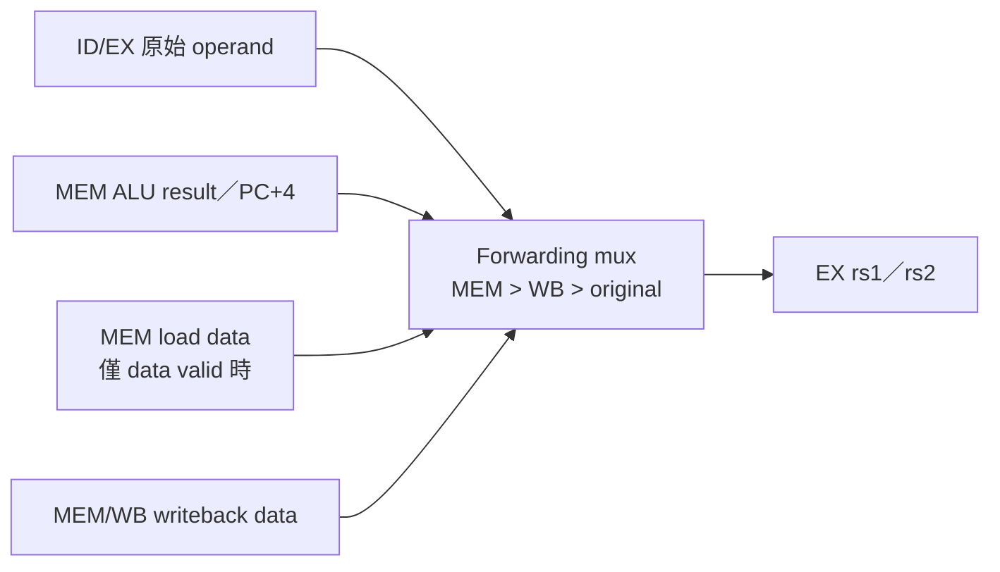
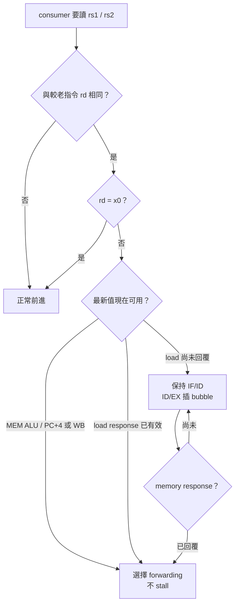
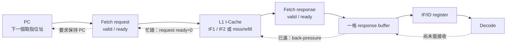

# Hazard and Forwarding

本文件說明目前五級 in-order CPU 如何處理 pipeline hazard，以及 forwarding 為什麼能消除部分 stall、卻不能消除所有 stall。

先備閱讀：[CPU_ARCHITECTURE.md](CPU_ARCHITECTURE.md) 與 [PIPELINE.md](PIPELINE.md)。分支控制冒險的預測器細節另見 [BRANCH_PREDICTION.md](BRANCH_PREDICTION.md)。

## 1. Hazard 是什麼

Pipeline 同時執行多條指令。如果後一條指令需要前一條尚未產生的資料、兩級同時競爭同一資源，或前端還不知道下一個 PC，就可能使用錯誤資訊。這種「不能安全照原速度前進」的情況稱為 hazard。

通常分為三類：

| 類型 | 問題 | 本專案的主要處理方式 |
|---|---|---|
| Data hazard | operand 尚未 ready | forwarding、load-use stall、memory backpressure |
| Structural hazard | 硬體資源／transaction 尚未 ready | ready/valid backpressure、blocking stall |
| Control hazard | 下一個 PC 尚未確定或預測錯誤 | branch prediction、redirect、flush |

Forwarding 是解決 data hazard 的工具之一，不是所有 hazard 的通用解法。

## 2. 為什麼這顆核心主要處理 RAW

三種典型資料相依：

```text
RAW: Read After Write
WAR: Write After Read
WAW: Write After Write
```

目前 CPU 是 single-issue、in-order，而且只在 WB 依程式順序寫 register。較年輕指令不能越過較老指令提交，因此：

- RAW 會發生：consumer 可能太早讀 producer 的結果。
- WAR 不會形成 architectural hazard：較老指令一定先讀 operand，較年輕指令才可能寫。
- WAW 不會形成亂序完成：writeback 仍維持程式順序。

若未來改成 superscalar 或 out-of-order，就不能沿用這個假設；WAR/WAW、rename、ROB 與多寫回仲裁會成為新問題。

## 3. RAW 範例

```asm
add x5, x1, x2      # producer：產生 x5
sub x6, x5, x3      # consumer：讀取 x5
```

`sub` 在 ID 讀 register file 時，`add` 還沒到 WB，因此讀到的 `x5` 可能是舊值。但 `sub` 真正使用 operand 是 EX；此時 `add` 的結果已在 MEM pipeline payload 中，所以可以直接繞過 register file：

```text
add ALU result ───────────────┐
                             ▼
ID/EX old x5 → forwarding mux → sub EX operand
```

這就是 forwarding，也稱 bypass。

## 4. 目前 forwarding network

[`forward_unit.v`](../../forward_unit.v) 為 EX 的 `rs1` 與 `rs2` 各提供一個選擇器。



### 4.1 MEM source

MEM producer 必須滿足：

```text
mem_valid
&& mem_reg_write
&& mem_rd != x0
&& value_available
```

資料來源依 writeback selection：

| MEM producer | Forward data |
|---|---|
| ALU、LUI、AUIPC、CSR read result | `mem_alu_result` |
| JAL/JALR | `mem_pc4` |
| Load | `mem_load_rdata`，且 `mem_load_valid=1` |

Load 即使 `mem_valid=1`，response 尚未回來時也不能 forward。

### 4.2 WB source

WB candidate 使用 MEM/WB 保存的：

```text
wb_rd_wen
wb_rd
wb_wdata
```

它已是最終 writeback value，不需再判斷 ALU/load/PC+4。

### 4.3 Priority

若 MEM 與 WB 同時宣告會寫相同 register，MEM 是較新的 producer，必須優先：

```asm
addi x5, x0, 1      # 已到 WB
addi x5, x0, 2      # 已到 MEM
add  x6, x5, x0     # EX 應看見 2，不是 1
```

因此選擇順序固定：

```text
MEM match → MEM value
else WB match → WB value
else original ID/EX value
```

### 4.4 `x0` 排除

RISC-V 的 `x0` 永遠為 0。Forwarding match 必須要求 destination 與 source 都不是 0，否則一條寫 `x0` 的指令可能錯誤地把非零 ALU 暫時結果 forward 給下一條指令。

## 5. Forwarding 影響的不只是 ALU

Top 將 `ex_rs1_val_fwd`、`ex_rs2_val_fwd` 接到整個 EX stage，所以它們被用於：

| 使用者 | 為什麼需要最新資料 |
|---|---|
| ALU | 一般 register dependency |
| Branch comparator | branch 可能依賴上一條計算結果 |
| JALR target | target 基址來自 `rs1` |
| Load/store address | base register 可能剛被更新 |
| Store data | store 的 `rs2` 可能剛被 producer 寫入 |
| CSR write operand | `CSRRW/CSRRS/CSRRC` 的 source 可能有相依 |

只 forward ALU input、忘記 branch 或 store data，是五級 CPU 常見錯誤；目前設計用同一對 forwarded operands避免這種分裂。

## 6. ID stage 的 WB bypass

除了 EX forwarding，[`ID.v`](../../ID.v) 還有 register-file read bypass：

```text
if WB 正在寫 rd，且 rd == ID.rs1/rs2：
    ID operand = WB write data
else：
    ID operand = register file read data
```

它解決的是「同一 clock cycle WB write 與 ID read」語意，不取代 MEM→EX forwarding。

```text
WB bypass：WB → ID
Forwarding：MEM/WB → EX
```

兩者應分開理解與驗證。

## 7. Hazard unit 的輸入與輸出

[`hazard_unit.v`](../../hazard_unit.v) 比較 ID consumer 與 EX/MEM producer：

```text
ID : valid, rs1, rs2
EX : valid, rd, reg_write, mem_read, long-op stall
MEM: valid, rd, reg_write, memory stall, load active
IF : fetch structural stall hook
EX : redirect valid
```

輸出：

```text
stall_if
stall_id
stall_ex
stall_exmem
flush_ifid
flush_idex
```

在 `icache_pipeline_top.v` 中，HDU 輸出還會與 `if_pending`、fetch channel backpressure、I-Cache flush 與 interrupt hold 合併。

## 8. Match 判斷

核心比較概念：

```text
raw_ex = EX valid && EX.rd != 0
         && (ID.rs1 == EX.rd || ID.rs2 == EX.rd)

raw_mem = MEM valid && MEM.rd != 0
          && (ID.rs1 == MEM.rd || ID.rs2 == MEM.rd)
```

Load-use：

```text
load_use_hazard = raw_ex && ex_mem_read
```

MEM load 尚未完成：

```text
mem_pending_load_hazard = raw_mem && mem_load_active
```

若 `FORWARDING_EN=0`，則任何仍在 EX/MEM 且會寫回的 RAW 都要 stall。主線使用預設 `FORWARDING_EN=1`，所以一般 ALU RAW 不停，只保留 data 尚不可用的 load interlock。

## 9. Load-use 為什麼不能立即 forwarding

```asm
lw  x5, 0(x10)
add x6, x5, x7
```

當 `lw` 在 EX：

- 已知 effective address。
- 尚未查完 D-Cache。
- 更不可能知道 miss 時 DDR 回來的 data。

同 cycle `add` 在 ID，下一個 cycle 原本會進 EX。即使有 EX forwarding，也沒有可 forward 的 load data。因此 HDU：

```text
stall IF
stall IF/ID，保持 add
flush ID/EX，插入 bubble
```

讓 load 進 MEM，consumer 延後。

### 9.1 Hit 與 miss 的差別

若 load 很快回覆，最低成本是 bubble 後從 MEM forward：

```text
lw      EX   MEM(data)  WB
add     ID   bubble     EX(use forwarded load data)
```

若 D-Cache miss，`mem_stall` 會繼續凍結 pipeline，直到 refill/response 完成。Load-use interlock 處理資料相依，memory stall 處理 transaction latency；兩者目的不同但可能連續出現。

HDU 可概念化為下列判斷。重點不是「看到相同 register 就一律 stall」，而是先問 producer 的值現在能不能 forward：



同一個 consumer 若同時命中 MEM 與 WB，仍採較新的 MEM producer；這就是 `MEM > WB > original` 的來源優先序。

## 10. ALU → ALU：不需 stall

```asm
add x5, x1, x2
sub x6, x5, x3
```

```text
cycle       N      N+1
add         EX     MEM(result available)
sub         ID     EX(select MEM x5)
```

HDU 看見 RAW，但 forwarding enabled 且 producer 不是 load，不會建立 generic RAW stall。

## 11. ALU → branch

```asm
addi x5, x0, 0
beq  x5, x0, target
```

Branch comparator 位於 EX，使用 forwarded operand。當 branch 進 EX 時 `addi` 在 MEM，所以比較器看到最新的 0，不必等 WB。

這也代表 branch prediction 的「actual outcome」正確性依賴 forwarding；若 branch comparator 誤用 ID/EX 舊值，predictor update 與 recovery 都會被污染。

## 12. ALU → JALR

```asm
addi x5, x0, target
jalr x1, 0(x5)
```

JALR target 在 EX 使用 forwarded `rs1`：

```text
target = (forwarded_rs1 + immediate) & 0xFFFF_FFFE
```

因此相鄰 ALU producer 不需等待寫回。JALR 目前沒有 ID speculative prediction，EX 算出 target 後會 recovery redirect。

## 13. ALU → store data

```asm
addi x5, x0, 0x2a
sw   x5, 0(x10)
```

Store 的 `rs2` 是資料，不是 ALU address operand B，但仍通過 `ex_rs2_val_fwd`，再保存為 `ex_store_data`。所以 D-Cache 收到的是 `0x2a`，不是 ID 讀到的舊 `x5`。

## 14. ALU → address

```asm
addi x10, x10, 4
lw   x5, 0(x10)
```

Load effective address 使用 forwarded `rs1`，所以會讀新地址 `old_x10 + 4`。

## 15. Load → store

有兩種相依要區分：

```asm
lw x5, 0(x10)
sw x5, 0(x11)       # load data → store data
```

以及：

```asm
lw x10, 0(x12)
sw x5, 0(x10)       # load data → store address
```

兩者都需要 load data ready，因此目前 source index 比對會觸發 interlock。Response 回來後，最新 value 由 MEM forwarding 送進 store 的 `rs2` 或 `rs1`。

## 16. Structural hazard 與 backpressure

### 16.1 Front-end

Front-end（前端）是負責「供應下一條 instruction」的整段路徑，不只等於五級 pipeline 的 IF 兩個字。以目前整合來看，它包含：



實線是 instruction 往 Decode 前進的方向；虛線是 back-pressure 往 PC 傳回的方向。後方暫時無法接收時，前方必須保持原資料或停止發送，不能直接跳到下一個 PC。

主線 `stall_if` 除了 HDU 產生的 `stall_if_hdu`，還包含：

```text
if_pending
request blocked
response blocked
fetch response buffer occupied
I-Cache flush pending
interrupt front-end hold
```

各條件的意義如下：

| 條件 | 代表什麼 | 為什麼要暫停新的取指 |
|---|---|---|
| `stall_if_hdu` | Load-use、MEM busy、MulDiv busy 等 pipeline hazard 要求上游保持 | 避免較年輕 instruction 越過尚未完成的較老 instruction |
| `if_pending` | 已有一筆 fetch request 被接受，但 response 還沒回來 | 目前只允許一筆 outstanding fetch，不能先送下一筆 |
| `req_blocked`（request blocked） | `fetch_req_valid=1`、`fetch_req_ready=0` | I-Cache 尚不能接受 request，PC/address 必須保持穩定 |
| `resp_blocked`（response blocked） | I-Cache 已提出 response，但 top 的 buffer 尚不能接收 | `instruction/PC/error` 必須保持，不能遺失 response |
| `fetch_resp_buf_blocked` | 一格 fetch response buffer 已保存一條 instruction | 必須等 IF/ID 接走，才能放入下一條 |
| `icache_flush_pending_q` | I-Cache 正在清除 valid entry，尚未回覆 flush ack | 避免 flush 進行到一半又接受新的 fetch |
| `irq_frontend_hold` | interrupt pending，CPU 準備排空 pipeline | 停止加入較年輕 instruction，才能在明確 instruction boundary 進 trap |

最常見的 `if_pending` 時序如下：

```text
Cycle N：fetch_req_valid && fetch_req_ready
         request 被 I-Cache 接受，if_pending 設為 1

Cycle N+1...：尚未收到 response
              PC 保持，不再送第二筆 request

Response 到達：先放進一格 response buffer
               if_pending 清為 0

IF/ID 接走：response buffer 清空
            前端才可開始下一筆 fetch
```

因此這些不一定是 register data hazard。`if_pending` 沒有表示兩條指令使用相同 register；它只表示取指 transaction 尚未完成。這類等待屬於 structural hazard／flow-control back-pressure。

還要注意，單純的 Front-end stall 主要停止 PC 與新 fetch，**不一定凍結已經位於 ID、EX、MEM、WB 的較老指令**。只有 HDU 因 MEM busy、MulDiv 或資料 hazard 同時要求其他 stage stall 時，才會把更多 pipeline register 一起保持。

目前只有一筆 outstanding fetch，加上一格 response buffer，因此即使 I-Cache hit，也不一定每 cycle 都能送一條新 instruction。完整逐拍行為見 [PIPELINE.md](PIPELINE.md) 的「IF：Instruction Fetch」與「前端吞吐量」；I-Cache 內部的 IF1／IF2、miss 與 refill 則見 [ICACHE.md](../02-memory-io/ICACHE.md)。

### 16.2 MEM

`mem_stall` 表示 load/store/MMIO transaction 尚未完成。它向上游傳播並 hold IF、ID、ID/EX、EX/MEM。因為核心是 in-order blocking，較年輕的獨立 ALU 指令也不能越過這筆 memory operation。

### 16.3 EX MulDiv

`ex_stall_o` 表示 iterative multiplier/divider 尚未完成。HDU 將 PC、IF/ID、ID/EX 與 EX/MEM 保持，確保同一條 MulDiv 指令不被替換或重複啟動。

### 16.4 I/D 共用 L2

I$ 與 D$ 最後共用 unified L2。Arbiter 一次保持一個 master 到 transaction 完成，D$ 優先可能使 I$ 等待；這是 memory hierarchy 的 structural contention，會在前端或後端 stall 中反映。

## 17. Control hazard 與 flush

當 EX 發現 prediction direction 或 target 錯誤：

```text
flush_ifid = 1
flush_idex = 1
PC = recovery target
fetch_req_kill = 1
fetch response buffer 清除
```

Flush 的是比 EX branch 年輕的指令；branch 本身與更老指令不能被誤殺。System trap/interrupt/`mret` 使用額外 `sys_flush_now` 與更高優先級 redirect。

詳細情境見 [BRANCH_PREDICTION.md](BRANCH_PREDICTION.md)。

## 18. Stall 與 flush 同時發生

Pipeline control 最危險的情況之一是 stall 與 redirect 同拍。一般原則：

- PC redirect 必須優先於 hold，否則 recovery address 可能丟失。
- Pipeline register flush 必須讓錯路徑失效，不能因 stall 永遠保存 wrong-path valid。
- Outstanding fetch 必須標記 kill/epoch，避免舊 response 在幾拍後重新進入 ID。

本專案 PC next-state 明確讓 redirect 優先於 stall；IF response buffer也在 `fe_redirect_valid` 時清除，I-Cache 使用 kill tracking 丟棄舊 epoch response。

## 19. 目前 HDU 的實際限制

理解限制能避免把「保守 stall」誤判成硬體錯誤。

### 19.1 尚未啟用 pending-load scoreboard

Top 目前接入：

```text
pending_load_mask = 32'b0
```

HDU 保留 per-register outstanding load scoreboard 介面，但主線沒有啟用。現有 blocking MEM path 與 `mem_load_active` 負責等待；若未來改 non-blocking load，必須真正維護 scoreboard，不能只解除 `mem_stall`。

### 19.2 Source-use 判斷較保守

HDU 目前以 `rs1 != 0`、`rs2 != 0` 判定 source 使用，沒有接入 decode 後的 `uses_rs1/uses_rs2`。部分 immediate/U-type 指令的 bit field 雖然不是真正 source，仍可能剛好等於 producer `rd`，形成不必要的保守 stall。

這通常不破壞正確性，但可能增加 load-use counter/stall。若優化，應由 ID 明確輸出 operand-use mask，不能只用 opcode 猜測。

### 19.3 `id_is_store_i` 目前沒有參與獨立公式

Store 的 address/data 相依已由 `rs1/rs2` 通用比對涵蓋；`id_is_store_i` port 保留但目前沒有額外邏輯。修改 store pipeline 時要注意這不是額外的 store scoreboard。

### 19.4 IF stall hook 與 top front-end control分開

HDU 的 `ifetch_stall_i` 在主線接 0，實際 fetch hold 由 top 的 `if_pending/req_blocked/resp_blocked` 等訊號合併。讀 waveform 時不能只看 HDU output 就判斷所有 front-end stall 原因。

## 20. 不同 hazard 的處理總表

| 情境 | Forward? | Stall? | Flush? |
|---|---:|---:|---:|
| ALU → ALU | MEM→EX | 否 | 否 |
| ALU → branch/JALR | MEM→EX | 否 | 只有控制預測錯才 flush |
| ALU → store data/address | MEM→EX | 否 | 否 |
| WB 同拍 → ID read | WB→ID bypass | 否 | 否 |
| Load → next consumer | data 回來後 MEM→EX | 是，至少 bubble；miss 可更久 | 否 |
| Memory transaction busy | 不適用 | 是，全域 backpressure | 否 |
| MUL/DIV busy | 結果完成後使用 | 是，EX hold | 否 |
| Branch prediction miss | 不適用 | recovery cycle可能伴隨 hold | 是，清 younger path |
| Trap/`mret` | 不適用 | 視 drain/redirect | 是，system flush |

## 21. 常見錯誤與檢查方法

### 21.1 結果差一個舊值

檢查：

```text
ex_rs1/ex_rs2 index
mem_rd/wb_rd
mem_reg_write/wb_rd_wen
mem_load_valid
ex_rs1_val_fwd/ex_rs2_val_fwd
```

### 21.2 Store address 正確、data 錯誤

通常表示只 forward `rs1`、沒有 forward `rs2`，或 EX/MEM 保存的是未 forward 的 store data。主線應觀察 `ex_store_data` 是否等於 `ex_rs2_val_fwd`。

### 21.3 Branch 偶爾走錯

先確認 EX branch comparator 使用 forwarded operand，再檢查 predictor。錯誤可能是 data hazard，不一定是 predictor state machine。

### 21.4 Load consumer 太早前進

確認：

```text
load_use_hazard
flush_idex
mem_load_active
mem_load_valid
mem_stall
```

### 21.5 同一 memory request 重複發送

確認 MEM 的 `busy_q/req_pending_q/done_q`。`done_q` 用來抑制 EX/MEM 還保持完成操作時的下一拍重發。

## 22. 效能計數器如何對應

| Counter event | RTL 條件 | 能回答的問題 |
|---|---|---|
| load-use | ID source 與 EX load `rd` match | 編譯排程是否常緊跟 load |
| multi-cycle EX | `ex_stall_o` | MUL/DIV 消耗多少 cycle |
| front-end stall | `stall_if` | fetch/backpressure/interrupt hold 比例 |
| backend stall | `mem_stall` | load/store/MMIO 等待比例 |
| control-flow miss | `redirect_valid` | branch/JAL/JALR recovery 頻率 |

Counter 能告訴你事件發生多少次或多少 cycle，不能單獨證明 forwarding data 值正確；功能正確性仍要靠 regression、assertion 與 commit result。

## 23. 驗證對照

主回歸中與 hazard/forwarding 直接相關：

| Test | 內容 |
|---:|---|
| 1 | ALU forwarding |
| 2 | load-use |
| 3 | store dependency |
| 5 | load/store combination |
| 19 | hazard + branch |
| 22 | branch + memory mix |
| 24–27 | C/mixed/all-instruction/full-system stress |

另有：

- [`ex_muldiv_tb.v`](../../ex_muldiv_tb.v)：多週期 EX stall/done。
- [`bp_redirect_scenarios_tb.v`](../../bp_redirect_scenarios_tb.v)：redirect 與 flush。
- [`dcache_tb.v`](../../dcache_tb.v)：memory backpressure、refill、writeback。

## 24. 未來擴充時的影響

### 24.1 Non-blocking D-Cache

需要：

- load miss status holding registers/MSHR。
- 真正的 pending-load scoreboard。
- response 與 destination tag。
- younger independent instruction 是否可前進的規則。
- exception/interrupt precise state。

### 24.2 Superscalar

目前單一 `rd` 比對與兩個 EX operand mux 不夠。需要同拍多 producer、多 consumer priority、跨 lane forwarding，以及同 cycle 指令間相依檢查。

### 24.3 Out-of-order

Forwarding 要與 register rename、physical register ready bit、issue queue wakeup/select、ROB commit 共同設計。不能把目前 HDU 多加幾個 comparator 就視為完成。

### 24.4 提升目前 in-order 效能

較低風險的方向：

- ID 輸出精確 `uses_rs1/uses_rs2`，減少假相依 stall。
- 將前端 stall 原因拆成獨立 counter。
- 檢查 load-hit response 是否能縮短 bubble。
- 加入 assertion：只要 forwarding match，EX operand 必須等於最新 producer value。
