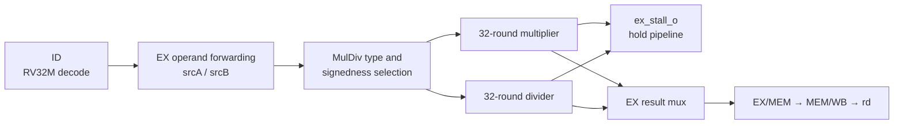
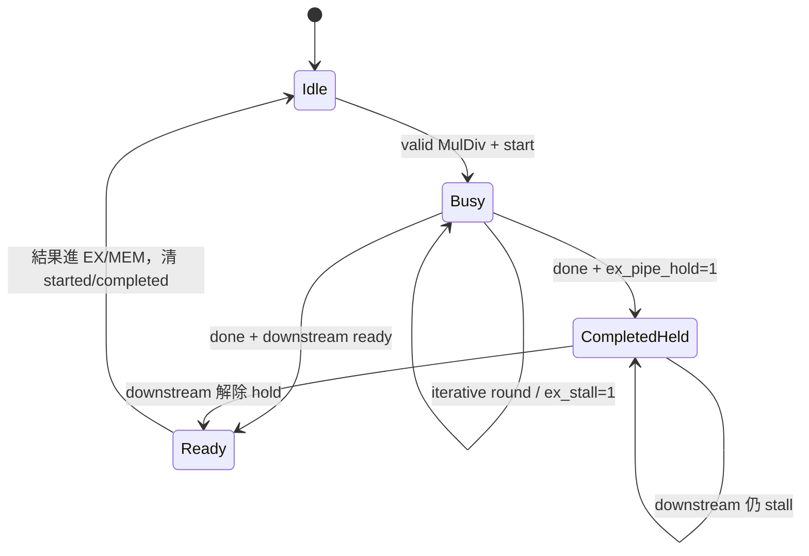

# RV32M 乘法與除法器

本文件說明此 CPU 如何實作 RISC-V `M` extension，也就是整數乘法、除法與餘數指令。內容涵蓋指令語意、硬體演算法、pipeline stall、特殊輸入、效能與驗證方法；對應的主要 RTL 是 [`ID.v`](../../ID.v)、[`EX.v`](../../EX.v)、[`booth_multiplier.v`](../../booth_multiplier.v) 與 [`restoring_divider.v`](../../restoring_divider.v)。

若要先理解五級 pipeline 與 forwarding，建議搭配 [PIPELINE.md](PIPELINE.md) 和 [HAZARD_FORWARDING.md](HAZARD_FORWARDING.md) 閱讀。

## 1. 為什麼需要獨立的 MulDiv 單元

一般加法、減法、AND、OR 等運算可以在一個 EX cycle 內完成；32-bit 乘法需要產生 64-bit 中間結果，除法則需要反覆比較、減法與移位。如果全部做成單周期組合電路，會形成很長的 critical path，降低整顆 CPU 可使用的時鐘頻率。

本專案採用較省 FPGA 邏輯資源的 iterative 設計：

- 乘法器每輪處理 multiplier 的 1 bit，共 32 輪。
- 除法器每輪產生 quotient 的 1 bit，共 32 輪。
- MulDiv 執行期間，EX stage 保留目前指令並要求 pipeline 暫停。
- 計算完成後，結果沿一般 EX/MEM、MEM/WB 路徑寫回 `rd`。

因此它是「多周期執行單元」，不是第二顆 CPU，也不是獨立執行緒。

## 2. 支援的 RV32M 指令

RV32M 共定義 8 條指令，本核心全部支援。

| 指令 | 運算元解讀 | 寫回內容 |
|---|---|---|
| `MUL` | 低 32-bit 乘積 | `(rs1 * rs2)[31:0]` |
| `MULH` | signed × signed | 64-bit 乘積的 `[63:32]` |
| `MULHSU` | signed × unsigned | 64-bit 乘積的 `[63:32]` |
| `MULHU` | unsigned × unsigned | 64-bit 乘積的 `[63:32]` |
| `DIV` | signed ÷ signed | 商，向 0 截斷 |
| `DIVU` | unsigned ÷ unsigned | 無號商 |
| `REM` | signed ÷ signed | 餘數，符號跟 dividend 相同 |
| `REMU` | unsigned ÷ unsigned | 無號餘數 |

### 2.1 為何有四種乘法指令

兩個 32-bit 數相乘，完整結果最多需要 64 bit：

```text
32-bit A × 32-bit B = 64-bit product
```

`MUL` 只取低 32 bit。低 32 bit 在二補數 signed 與 unsigned 乘法下相同，因此不需要 `MULU`。

要取得高 32 bit 時，signedness 會影響結果，所以 ISA 提供：

```text
MULH   : signed   × signed
MULHSU : signed   × unsigned
MULHU  : unsigned × unsigned
```

例如要得到完整 signed 64-bit 乘積，軟體可用同一對運算元分別執行 `MUL` 與 `MULH`，再把結果組合成高、低兩半。

### 2.2 DIV 與 REM 的關係

在一般非特殊情況下：

```text
dividend = quotient × divisor + remainder
```

RISC-V signed 除法向 0 截斷，因此：

```text
-7 / 3  = -2
-7 % 3  = -1
```

餘數的絕對值小於 divisor 的絕對值，而且非零餘數的符號與 dividend 相同。

## 3. 指令解碼

RV32M 使用一般 R-type `OP` opcode，但 `funct7` 固定為 `0000001`。[`ID.v`](../../ID.v) 再依 `funct3` 選擇運算：

| `funct3` | 指令 | 內部 `alu_op` |
|---:|---|---:|
| `000` | `MUL` | `1000` |
| `001` | `MULH` | `1001` |
| `010` | `MULHSU` | `1010` |
| `011` | `MULHU` | `1011` |
| `100` | `DIV` | `1100` |
| `101` | `DIVU` | `1101` |
| `110` | `REM` | `1110` |
| `111` | `REMU` | `1111` |

解碼後的 `alu_op` 與 `rs1`、`rs2` 值經 ID/EX register 傳入 EX stage。

## 4. 整體資料路徑



MulDiv 使用的是 forwarding 後的 EX operands，而不是只看 ID 階段最早讀到的 register-file 值。因此前一條指令剛產生 `rs1` 或 `rs2` 時，正常 forwarding 規則仍然適用。

## 5. 乘法器

### 5.1 目前實作的演算法

模組檔名是 [`booth_multiplier.v`](../../booth_multiplier.v)，但目前 RTL 實際採用的是 radix-2 shift-and-add，不是 Booth recoding。理解與修改設計時應以 RTL 行為為準，不能只依檔名判斷。

開始運算時，硬體準備：

```text
accumulator    = 0
multiplicand   = abs(A)，擴充成 64 bit
multiplier     = abs(B)
result_negative = sign(A) XOR sign(B)
```

每一輪執行：

```text
if multiplier[0] == 1:
    accumulator = accumulator + multiplicand

multiplicand = multiplicand << 1
multiplier   = multiplier >> 1
```

32 輪後，`accumulator` 就是兩個絕對值的 64-bit 乘積。若結果應為負數，再對完整 64-bit 乘積做二補數轉換。

### 5.2 signedness 如何設定

EX stage 依指令產生三個控制資訊：

| 指令 | `signed_a` | `signed_b` | 選擇結果 |
|---|---:|---:|---|
| `MUL` | 1 | 1 | low 32 bit |
| `MULH` | 1 | 1 | high 32 bit |
| `MULHSU` | 1 | 0 | high 32 bit |
| `MULHU` | 0 | 0 | high 32 bit |

`MUL` 設為 signed/signed 不會改變低 32-bit 結果，但可讓共用乘法器的控制保持一致。

### 5.3 介面與時序

乘法器介面重點如下：

```text
start_i  : 空閒時接收新運算
busy_o   : 32 輪運算期間為 1
done_o   : 結果完成時脈衝一個 cycle
result_o : 保留最後一次完成的 32-bit 結果
```

行為順序：

1. 在 `start_i=1` 且 `busy_o=0` 的 clock edge 鎖存 operands 與模式。
2. 接下來的 busy cycles 逐 bit 累加。
3. `count_q==31` 的那一輪完成結果，清除 `busy_o` 並讓 `done_o=1`。
4. 下一個 cycle `done_o` 自動回到 0。

運算本體固定進行 32 個 iterative cycles。若把接收 `start_i` 的 edge 也計入可見延遲，控制路徑還會多一個啟動邊界；分析 pipeline 時應以 `ex_stall_o` 的實際波形為準。

當 `busy_o=1` 時，即使外部再次送出 `start_i`，也不會覆蓋正在執行的 operands。

## 6. 除法器

### 6.1 Restoring division

[`restoring_divider.v`](../../restoring_divider.v) 使用 radix-2 restoring division。開始時將 dividend 放入 quotient shift register，remainder 清為 0；每輪先把下一個 dividend bit 移入 remainder，再比較 divisor：

```text
remainder_next = shift_left_and_bring_next_dividend_bit()
quotient_next  = quotient << 1

if remainder_next >= divisor:
    remainder_next = remainder_next - divisor
    quotient_next[0] = 1
else:
    quotient_next[0] = 0
```

「restoring」這個名稱源自傳統演算法：若試減後為負，就恢復原 remainder。此 RTL 先做大小比較，只在足夠大時才減，功能上等價但不必真的先減再加回。

32 輪後得到 unsigned magnitude 的 quotient 與 remainder，再依 signed 模式修正符號：

```text
quotient sign  = dividend sign XOR divisor sign
remainder sign = dividend sign
```

### 6.2 DIV、DIVU、REM、REMU 共用同一硬體

| 指令 | `signed_mode` | EX 最後選擇 |
|---|---:|---|
| `DIV` | 1 | `quotient_o` |
| `DIVU` | 0 | `quotient_o` |
| `REM` | 1 | `remainder_o` |
| `REMU` | 0 | `remainder_o` |

除法器同時計算商與餘數，EX stage 只依目前指令選擇其中一個寫回。連續的 `DIV` 和 `REM` 仍會各自重新算一次；目前沒有 quotient/remainder result cache。

## 7. RISC-V 規定的特殊情況

RISC-V 整數除法不會因除以零或 signed overflow 產生 exception。硬體直接回傳 ISA 規定的 bit pattern。

### 7.1 除以零

若 divisor 為 0：

| 指令類型 | Quotient | Remainder |
|---|---|---|
| signed 或 unsigned | `0xFFFF_FFFF` | 原始 dividend |

例如：

```text
10 / 0  -> quotient  = 0xFFFF_FFFF
10 % 0  -> remainder = 10
```

這不是 trap，也不會修改 `mcause`。若應用程式希望把它視為錯誤，必須在軟體中自行檢查 divisor。

### 7.2 最小負數除以 -1

32-bit signed 可表示 `-2147483648`，但不能表示正的 `2147483648`。RISC-V 規定：

```text
0x80000000 / 0xFFFFFFFF -> quotient  = 0x80000000
0x80000000 % 0xFFFFFFFF -> remainder = 0
```

這也不產生 exception。

### 7.3 特殊情況的延遲

除法器在啟動時鎖存 `div_zero_q` 與 `overflow_q`。下一個 busy cycle 若發現其中之一，會直接產生 `done_o`，不執行完整 32 輪，因此特殊情況比一般除法快。

## 8. 與 EX stage、stall 的整合

### 8.1 為何需要 `mul_started` 與 `div_started`

MulDiv 指令等待期間會一直停在 EX。如果只使用 `ex_valid_i` 判斷啟動，則同一條指令可能在完成後被再次送入運算器。

[`EX.v`](../../EX.v) 使用：

```text
mul_started / div_started
mul_completed / div_completed
```

來區分「尚未啟動」、「正在計算」及「已完成但下游仍 hold」三種情況。

啟動條件概念上是：

```text
valid MulDiv instruction
AND not started
AND not completed
AND arithmetic unit not busy
```

### 8.2 `ex_stall_o`

只要目前 EX 指令是 MulDiv，而且結果尚未完成，`ex_stall_o` 就為 1：

```text
MUL family: stall until mul_done or mul_completed
DIV/REM family: stall until div_done or div_completed
```

hazard/control logic 收到這個訊號後會保留相關 pipeline registers，避免後續指令越過這條多周期指令。這維持 single-issue、in-order 的 architectural order。

### 8.3 完成時剛好遇到 memory stall

MulDiv 完成時，MEM stage 可能仍因 cache 或 DDR transaction 停住。若只讓 `done_o` 維持一個 cycle，EX 可能錯過完成狀態並重新啟動。

因此：

- `done_o` 到來且 `ex_pipe_hold_i=1` 時，設定 `*_completed`。
- `*_completed` 會替 EX 記住「結果已經完成」。
- 下游解除 hold 後，指令才前進並清除完成旗標。

這是多周期運算器與可變延遲 memory system 之間很重要的握手保護。



`CompletedHeld` 是容易漏掉的狀態：算術單元的 `done` 可能只有一拍，但結果不能在 MEM back-pressure 期間遺失，也不能讓同一條指令重新啟動。

### 8.4 結果選擇

EX result mux 的概念優先序是：

```text
CSR read result
else multiplication result
else division quotient
else division remainder
else normal ALU result
```

之後 MulDiv 結果與普通 ALU 指令一樣，經 EX/MEM、MEM/WB 到 register file。相依的下一條指令可使用既有 forwarding 機制取得結果。

## 9. 效能意義

這顆核心是 single-issue、in-order，所以 MulDiv busy 期間無法讓後面的獨立指令越過執行。程式含有大量整數除法時，IPC 會明顯下降。

以目前實板軟體採用的約 50 MHz core clock 作直觀換算：

```text
1 cycle ≈ 20 ns
32 iterative cycles ≈ 640 ns
```

這只表示 arithmetic iteration 的量級，不包含 fetch、decode、start edge、writeback、cache stall 或其他 pipeline overhead。

MMIO performance counter 的 multi-cycle EX busy event 可用來觀察 `ex_stall_o` 累積時間。若程式 cycle 很高且此 counter 同時很高，代表乘除法可能是瓶頸之一；若它很低，則應轉而檢查取指、cache miss、DDR 或 branch penalty。

## 10. 軟體如何產生 RV32M 指令

編譯器 target 必須包含 `M` extension，例如：

```text
-march=rv32im -mabi=ilp32
```

C 語言例子：

```c
#include <stdint.h>

int32_t signed_q(int32_t a, int32_t b)
{
    return a / b;       /* 通常產生 DIV */
}

uint32_t unsigned_r(uint32_t a, uint32_t b)
{
    return a % b;       /* 通常產生 REMU */
}

int64_t wide_product(int32_t a, int32_t b)
{
    return (int64_t)a * (int64_t)b;
}
```

實際指令仍取決於最佳化等級與編譯器判斷。例如除以常數可能被最佳化成 shift/add/multiply sequence，不一定真的出現 `DIV`。可查看產生的 `.dis` 或使用 `objdump -d` 確認。

若 build target 沒有 `M` extension，編譯器可能改呼叫軟體 helper routine；此時功能仍可能正確，但不會測到硬體 divider。

## 11. 驗證

專案提供 [`tools/run_muldiv_verification.ps1`](../../tools/run_muldiv_verification.ps1) 做整組驗證。基本執行方式：

```powershell
Set-ExecutionPolicy -Scope Process Bypass
.\tools\run_muldiv_verification.ps1
```

主要 testbench：

| Testbench | 驗證重點 |
|---|---|
| [`booth_multiplier_tb.v`](../../booth_multiplier_tb.v) | signed/unsigned、高低 32 bit、directed 與 random case、busy/done、busy 時忽略重啟 |
| [`restoring_divider_tb.v`](../../restoring_divider_tb.v) | signed/unsigned quotient/remainder、除以零、overflow、random case |
| [`ex_muldiv_tb.v`](../../ex_muldiv_tb.v) | 8 條 RV32M 指令在 EX 的結果與 stall 整合 |
| [`id_muldiv_decode_tb.v`](../../id_muldiv_decode_tb.v) | `funct3` 到內部 `alu_op` 的解碼 |

腳本也會檢查 core/board elaboration 並建立 C smoke program，避免只有 standalone arithmetic module 通過、整合後卻無法 decode 或編譯。

### 11.1 建議新增 case 時至少覆蓋

- 0、1、最大正數、最小負數、全 1。
- 正正、正負、負正、負負。
- high-half 會因 signedness 不同而改變的 operands。
- divisor 為 0。
- `INT32_MIN / -1`。
- MulDiv 完成時 `ex_pipe_hold_i=1`。
- 立即相依：MulDiv 的 `rd` 被下一條指令作為 `rs1` 或 `rs2`。
- back-to-back MulDiv instructions。

## 12. 常見誤解與除錯

### 12.1 `MUL` 應該只花一個 cycle？

ISA 只定義結果，不規定內部 latency。本核心選擇 32-round iterative implementation，所以 pipeline 會 stall；另一顆 RV32IM CPU 完全可以採用單周期 DSP multiplier。

### 12.2 為何 `MULH` 看起來錯，但 `MUL` 正確？

最常見原因是 signedness。先確認需要的是 `MULH`、`MULHSU` 還是 `MULHU`，並用完整 64-bit reference result 比對高 32 bit。

### 12.3 為何除以零沒有 exception？

這是 RISC-V ISA 定義，不是漏做 exception。檢查 quotient 是否為全 1、remainder 是否等於 dividend。

### 12.4 模組叫 Booth，是否代表一次處理兩個 bit？

目前不是。`booth_multiplier.v` 每輪檢查 `multiplier_q[0]`，是 radix-2 shift-and-add。若未來真的改成 radix-4 Booth，需同步更新此文件、latency、testbench 與 performance expectations。

### 12.5 結果偶爾在 memory stall 後錯誤

優先觀察：

```text
ex_valid_i
ex_pipe_hold_i
mul_start / div_start
mul_busy / div_busy
mul_done / div_done
mul_completed / div_completed
ex_stall_o
```

尤其確認 `done` 只有一個 cycle 時，`*_completed` 是否在 downstream hold 期間保存狀態。

## 13. 目前限制與可改進方向

- 乘法與一般除法都採 32-round iterative 設計，偏向節省面積而非最大吞吐量。
- single-issue in-order pipeline 在 MulDiv 期間整體等待，不能執行後方獨立指令。
- 乘法器目前沒有使用 FPGA DSP primitive，也沒有真正 Booth recoding。
- divider 沒有 early-out，例如小 quotient 或 power-of-two divisor 仍會跑一般流程。
- `DIV` 與緊接的 `REM` 不會重用同一次 quotient/remainder 計算。
- 沒有 MulDiv request queue，一次只能處理一條指令。

若未來要改善效能，可依複雜度依序考慮：

1. 用 FPGA DSP block 做 pipelined multiplication。
2. 加入 divider early-out 或 radix-4 divider。
3. 快取同 operands 的 quotient/remainder pair。
4. 將 MulDiv 做成可獨立追蹤的長延遲 execution unit。
5. 在 superscalar／out-of-order 設計中加入 reservation、scoreboard 或 reorder bookkeeping。

最後兩項會改變整體 pipeline 與 precise exception 設計，不只是替換 arithmetic module，應和未來處理器架構一起規劃。
