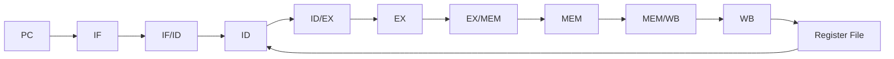
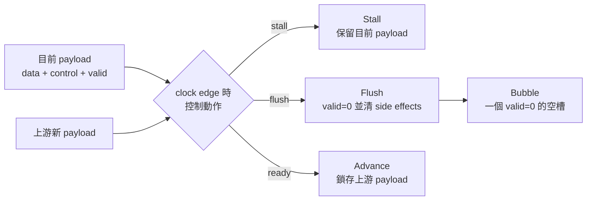
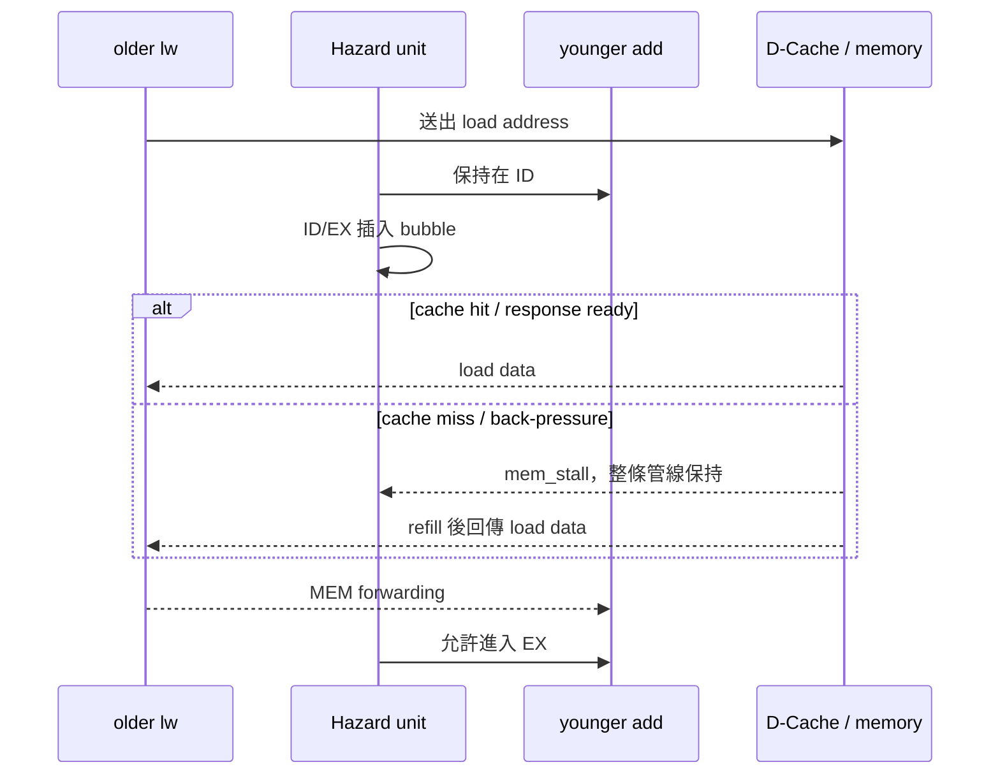

# Pipeline

本文件詳細說明目前 CPU 的五級流水線、各級間的資料、stall/flush 規則，以及典型指令在不同情況下的時序。

先備閱讀：[CPU_ARCHITECTURE.md](CPU_ARCHITECTURE.md)。資料相依細節見 [HAZARD_FORWARDING.md](HAZARD_FORWARDING.md)，控制流細節見 [BRANCH_PREDICTION.md](BRANCH_PREDICTION.md)。

## 1. 為什麼使用流水線

如果一條指令必須依序完成取指、解碼、運算、記憶體與寫回，下一條指令要等上一條全部完成才開始，硬體大部分時間會閒置。流水線把工作切成多級，讓不同指令同時佔用不同級：

```text
cycle       1    2    3    4    5    6    7
instr A    IF   ID   EX   MEM  WB
instr B         IF   ID   EX   MEM  WB
instr C              IF   ID   EX   MEM  WB
```

填滿後，理想上每 cycle 可完成一條指令。這只是「沒有 fetch latency、hazard、miss 或多週期操作」的理想模型；目前 RTL 的實際吞吐量還受 I-Cache handshake 與 blocking memory path 限制。

## 2. 五級與四個 pipeline register



Pipeline register 的目的不只是延遲資料一拍，也把一條指令的「資料與控制」綁在一起。例如 ID/EX 必須同時保存：

```text
PC, rs1 value, rs2 value, immediate,
rs1/rs2/rd index,
ALU operation,
branch/jump flags,
memory read/write flags,
writeback selection,
prediction metadata,
CSR/system metadata,
valid
```

若只延遲 operand、沒有同步延遲 `rd` 或 write-enable，結果就可能寫到另一條指令的目的暫存器。

## 3. `valid`、stall、flush 與 bubble

這四個詞是理解本專案 waveform 的核心。

### 3.1 Valid

每級 payload 都有 valid bit：

```text
valid = 1：這級裝著一條真實、應繼續處理的指令
valid = 0：這級是空的或 bubble
```

NOP bit pattern 與 invalid 不完全相同。`ADDI x0,x0,0` 是合法但沒有可見效果的指令；invalid 則表示管線控制明確宣告「這裡沒有可提交指令」。Flush 時 RTL 會同時寫入安全 NOP 並清掉 valid，真正避免 side effect 的關鍵是 valid/control neutralization。

### 3.2 Stall

Stall 表示 pipeline register 保持原內容：

```text
stall = 1 → 下一個 clock edge 不換成新指令
```

常見原因：

- IF request 尚未被 I-Cache 接受或 response 尚未回來。
- MEM 正在等 D-Cache/MMIO response。
- EX 正在做多週期 MUL/DIV。
- load-use data 尚未 ready。
- interrupt pending，前端等待既有指令排空。

### 3.3 Flush

Flush 表示目前 payload 屬於錯路徑或不得繼續產生 side effect：

```text
flush = 1 → valid 清 0，write/memory/control enable 清成安全值
```

常見原因：

- EX 發現 branch prediction 錯誤。
- exception/trap 發生。
- `mret` 改變控制流。

### 3.4 Bubble

Bubble 是插入 pipeline 的空槽，通常以 `valid=0` 表示。Load-use 時會保持 IF/ID 的 consumer，同時 flush ID/EX，讓 load 往後走、consumer 晚一拍進 EX：

```text
load       EX  → MEM
consumer   ID  → ID（保持）
ID/EX          → bubble
```

下圖把四種控制動作放在同一個 pipeline register 上比較。判讀 waveform 時，先看 `valid`，再判斷該拍是保持、清除或正常前進：



## 4. IF：Instruction Fetch

### 4.1 PC 選擇

[`IF.v`](../../IF.v) 內的 PC next-state 優先順序：

```text
redirect → hold on stall → PC + 4
```

Redirect 優先於 stall，確保發生分支 recovery 或 trap 時，即使前端原本正在等待，也能記住新的 architectural fetch address。PC 會以 4-byte 對齊值更新，符合目前不支援 RVC 的設計。

### 4.2 Request/response，不是組合式 ROM

IF 與 I-Cache 使用分離的 ready/valid channel：

```text
Request:
fetch_req_valid + fetch_req_ready + fetch_req_addr

Response:
fetch_resp_valid + fetch_resp_ready + instruction + response_pc + error
```

Request 只有在 `valid && ready` 時真正被接受。Response 也要等 consumer ready 才能消耗。

Top 使用：

- `if_pending`：表示已有一筆取指 request 尚未回覆。
- 一格 fetch response buffer：切斷 I-Cache response hold 與 decode stall 的組合路徑。
- `fetch_req_kill`：redirect 時取消舊路徑 request/response epoch。

目前 `fetch_req_valid` 要求沒有 outstanding request、response buffer 也為空，因此前端不是多筆並行取指。即使 I-Cache hit，request/response handshake 也可能在指令間產生空拍；這是目前已量到的主要效能限制之一。

### 4.3 I-Cache 內部 stage

L1 I-Cache 本身還有 IF1/IF2 lookup 與 miss/refill FSM。這些是 memory-system micro-stages，不會把主核心名稱改成七級 pipeline。應區分：

```text
主 pipeline stage：IF / ID / EX / MEM / WB
I-Cache 內部步驟：request capture / SRAM read / tag compare / refill
```

### 4.4 IF/ID payload

[`IFID_register.v`](../../IFID_register.v) 保存：

```text
PC
32-bit instruction
valid
```

Stall 時保持；flush 時 instruction 設為 `0x00000013` 並清 valid。

## 5. ID：Decode 與 register read

[`ID.v`](../../ID.v) 包含 register file 與 decode。

### 5.1 Decode 工作

ID 拆出：

```text
opcode, rd, funct3, rs1, rs2, funct7
```

並產生：

- I/S/B/U/J immediate。
- ALU operation 與 operand select。
- branch/JAL/JALR 控制。
- load/store size 與 signedness。
- writeback source：ALU、memory、`PC+4`。
- CSR command、address、system instruction flags。
- illegal instruction flag。

### 5.2 Register read

兩個 source register 在 ID 非同步讀出。WB 同拍寫回相同 index 時，ID 內部 bypass 直接選擇 WB data，避免依賴 FPGA register-file read-during-write 模式。

### 5.3 ID 分支預測

Conditional branch 在 ID 查 PHT；JAL 在 ID 固定視為 taken。若預測 taken，`id_pred_redirect_valid` 將前端 PC 指向 `id_pc + immediate`。JALR target 需要可靠的 `rs1`，目前不在 ID speculative redirect。

Prediction metadata 會存入 ID/EX，讓 EX 知道這條指令當初預測了什麼。

### 5.4 `id_ready`

目前：

```text
id_ready = id_valid && !id_stall
```

只有真實且未被 stall 的 ID 指令能進入 ID/EX。

## 6. ID/EX register

[`IDEX_register.v`](../../IDEX_register.v) 是控制訊號最多的 pipeline register。它必須把 decode 結果完整帶到 EX。

重要規則：

- `stall_i=1`：所有 payload 與 valid 保持。
- `flush_i=1`：payload 歸零或設安全值、`valid=0`、所有 side-effect enable 清除。
- prediction metadata 與指令同步移動。

檔案內保留了 issue epoch 與 duplicate suppression 相關欄位，但目前 `duplicate_issue_wb_nonctrl` 固定為 0；不要把它理解成已啟用的 replay/去重機制。

## 7. EX：Execute

### 7.1 Operand forwarding

進 EX 的 register value 會先經過 [`forward_unit.v`](../../forward_unit.v)：

```text
MEM 可用結果 > WB 結果 > ID/EX 原始值
```

forward 後的值同時提供給：

- ALU operand。
- branch comparator。
- JALR target 計算。
- store data。
- CSR write operand。

所以 forwarding 不只處理 `ADD`，也直接影響 branch、store 與 CSR 正確性。

### 7.2 ALU

一般 RV32I ALU operation 在組合邏輯完成。Operand A 依指令選擇：

```text
AUIPC → PC
LUI   → 0
其他  → forwarded rs1
```

Operand B 選擇 immediate 或 forwarded `rs2`。Load/store effective address 也是 EX 的加法結果。

### 7.3 Branch/JAL/JALR

EX 計算實際結果：

```text
branch condition = compare(forwarded rs1, forwarded rs2)
branch/JAL target = PC + immediate
JALR target = (forwarded rs1 + immediate) & ~1
```

之後比較實際結果與 ID/EX 保存的預測。預測錯才產生 recovery redirect；正確預測不需 flush。

### 7.4 MulDiv

MUL/DIV 啟動後 `ex_stall_o=1`，ID/EX 保持同一條指令，PC、IF/ID 與 EX/MEM 也由 control unit 配合保持。單元回報 `done` 後，結果才能進 EX/MEM。

除以零與 `INT_MIN / -1` 按 RISC-V 規則在 divider 內處理，不轉成 exception。

### 7.5 Misalignment 與 system exception

EX 檢查：

- taken control target 是否 4-byte aligned。
- halfword/word load/store address 是否 aligned。
- `ECALL/EBREAK/illegal instruction`。

若發生同步例外，EX/MEM 會 flush，避免錯誤指令繼續發出 load/store 或 register write。

## 8. EX/MEM register

[`EXMEM_register.v`](../../EXMEM_register.v) 保存：

```text
PC+4
ALU/effective-address result
forwarded store data
rd
reg_write
writeback selection
memory read/write
memory funct3
valid
```

Store data 必須是 forwarding 後的 `rs2`，否則以下程式會把舊值寫入 memory：

```asm
addi x5, x0, 42
sw   x5, 0(x10)
```

## 9. MEM：Data memory 與 MMIO

### 9.1 Transaction FSM

[`MEM.v`](../../MEM.v) 會 latch 一筆 memory operation，並保持 request，直到 downstream 接受；之後等待 load response 或 store completion。

```text
new request
    ↓
request pending，等待 ready
    ↓
busy，等待 response/completion
    ↓
done pulse，避免 held EX/MEM operation 被重發
```

`mem_stall = busy || new_req`，因此 transaction 期間上游保持。這是 blocking memory pipeline。

### 9.2 Load

Load 只有在 `dmem_rvalid_i` 時資料才 ready。MEM 依 address low bits選擇 byte/halfword，再 sign/zero extend。`mem_load_valid` 是可以送進 MEM/WB、也可以供 forwarding 使用的單拍事件。

### 9.3 Store

MEM 依 size/address 產生：

```text
SB → one-hot byte strobe
SH → 0011 或 1100
SW → 1111
```

並把 store value 移到對應 lane。Store 要等下游 completion response，不能在 request 剛送出時就讓 pipeline 假設已完成。

### 9.4 Address decode

Local MMIO 直接由 top 回應，DDR address 才進 D-Cache。對 MEM stage 而言兩者仍使用相同 request/response protocol，所以 UART 慢、D-Cache miss 或 VGA wait 都能透過同一個 `mem_stall` 機制 backpressure。

TOP先用`dmem_addr_o`判斷目的地，再產生對應的request valid與response mux。這不是先詢問D-cache再發現位址屬於周邊；local MMIO命中時，`dcache_cpu_req_valid = dmem_req_o & ~local_mmio_hit`會直接阻止該筆request進入D-cache。所謂「選擇周邊」也不是打開電源，而是讓UART、Timer、Performance或VGA中命中的模組接收本次transaction。

### 9.5 MMIO操作完成後是否繼續到WB

會，但load與store的WB效果不同：

| 操作 | MEM完成條件 | MEM/WB與WB結果 |
|---|---|---|
| MMIO load | 周邊回`rvalid`與read data | `wb_valid=1`，在WB把資料寫入`rd` |
| MMIO store | 周邊接受write並回completion | `wb_valid=1`，但`rd_wen=0`，不寫register file，只表示正常退休 |
| MMIO error | response的`err=1` | flush MEM/WB，產生load/store access fault，不正常退休 |

以UART TX store為例，completion只代表UART已鎖存byte並啟動transmitter，不代表start/data/stop bits已全數離開TX pin。MEM收到completion後解除stall，store到WB退休；UART硬體同時在背景繼續序列傳送。若下一筆TX write太早到達，UART的`ready=0`會再次讓MEM等待。

## 10. MEM/WB 與 WB

MEM/WB 在資料進入時先選出最終 writeback value：

```text
00 → ALU result
01 → load data
10 → PC+4
```

[`MEMWB_register.v`](../../MEMWB_register.v) 將 `valid` 與 write enable 做成單拍提交，避免 stall 時每 cycle 重複寫同一個 register。

WB 再檢查：

```text
valid && rd_wen && rd != x0
```

成立才寫 register file。Performance counter 的 `retired instructions` 目前以 `wb_valid` 計數；因此分析 counter 時，retire 指已到達 WB 的有效指令。

## 11. 理想 ALU pipeline 時序

忽略目前 IF handshake 空拍，三條互不相依的 ALU 指令可概念化為：

```text
cycle          1     2     3     4     5     6     7
addi x1       IF    ID    EX    MEM   WB
addi x2             IF    ID    EX    MEM   WB
add  x3                   IF    ID    EX    MEM   WB
```

每條指令延遲約五級，但 pipeline 填滿後完成率可高於「一次等完整五級」。Latency 與 throughput 是不同概念。

## 12. ALU RAW forwarding 時序

```asm
add x5, x1, x2
sub x6, x5, x3
```

第二條在 EX 需要 `x5` 時，第一條在 MEM，結果尚未寫回 register file，但已存在 `mem_alu_result`：

```text
cycle          1     2     3     4     5     6
add x5        IF    ID    EX    MEM   WB
sub x6              IF    ID    EX    MEM   WB
                              ↑
                       MEM x5 forward 到 sub EX
```

因此不需要 stall。

## 13. Load-use 時序

```asm
lw  x5, 0(x10)
add x6, x5, x7
```

Load 在 EX 只有 address，資料最快到 MEM response 才出現，consumer 下一拍進 EX 會太早：

```text
cycle          1     2     3     4       5     6     7
lw x5         IF    ID    EX    MEM      WB
add x6              IF    ID    bubble   EX    MEM   WB
                              ↑           ↑
                       consumer 保持   load data forward
```

若 D-Cache miss，MEM 可能維持多拍：

```text
lw x5         ... EX | MEM(wait) | MEM(wait) | MEM(response) | WB
add x6        ... ID | ID(hold)  | ID(hold)  | bubble/ready  | EX
```



所以「load-use 一個 bubble」是資料相依的最低成本，不代表 memory miss 只停一拍。

## 14. Store-data forwarding

```asm
add x5, x1, x2
sw  x5, 0(x10)
```

Store 的 address 使用 `rs1`，要寫的 data 使用 `rs2`。`forward_unit` 對兩個 operand 都做比較，forwarded `rs2` 經 `ex_store_data` 進入 EX/MEM，因此不必等 `x5` 正式寫回。

若 producer 是 load：

```asm
lw x5, 0(x10)
sw x5, 0(x11)
```

仍必須等 load data ready，之後才能 forward 給 store data。

## 15. Memory backpressure

當 MEM 有 active transaction：

```text
stall_if    = 1
stall_id    = 1
stall_ex    = 1
stall_exmem = 1
```

較年輕指令不能前進，EX/MEM 的 memory instruction 也保持。Response 到來後 MEM 產生單拍 completion/data valid，管線才恢復。

這個全域 backpressure 是 blocking in-order core 的核心性質。它簡化順序與 precise state，但即使 younger instruction 不依賴 load，也不能越過 memory miss。

## 16. 多週期 EX 時序

```asm
mul x5, x1, x2
add x6, x3, x4
```

概念上：

```text
mul     EX(start) → EX(busy) → ... → EX(done) → MEM → WB
add     ID(hold)  → ID(hold) → ... → ID       → EX  → MEM
```

`ex_stall_o` 期間同一條 MUL/DIV 保留在 ID/EX，不能重新啟動。`mul_started/div_started` 與 `mul_completed/div_completed` 用來區分尚未開始、執行中、完成但 downstream 仍 hold 的狀態。

## 17. Branch prediction 正確

以 conditional branch 預測 taken 且 EX 證實為 taken 為例：

```text
ID：查 PHT，前端先跳 target
EX：actual taken，actual target == predicted target
結果：不產生 recovery redirect，不 flush
```

Prediction metadata 讓 EX 知道前端已經走 target，否則 EX 只看到 taken 就無法判斷需不需要再次 redirect。

## 18. Branch prediction 錯誤

### 18.1 預測 taken、實際 not-taken

```text
recovery PC = branch PC + 4
flush IF/ID
flush ID/EX
kill outstanding wrong-path fetch
```

### 18.2 預測 not-taken、實際 taken

```text
recovery PC = actual branch target
flush IF/ID
flush ID/EX
kill outstanding sequential fetch
```

### 18.3 Taken target 不一致

若方向都 taken、target 卻不同，仍算 prediction miss，重導到 EX 算出的 target。

## 19. Exception、trap 與 `mret`

### 19.1 EX exception

Illegal instruction、`ECALL`、`EBREAK`、misaligned target/load/store 在 EX 形成同步 trap。該指令不應進入 EX/MEM 產生 side effect，前端重導到 `mtvec`。

### 19.2 MEM access fault

Memory response error 到 MEM 才知道，因此會 flush MEM/WB input，保存 faulting instruction PC，重導到 `mtvec`。

### 19.3 Interrupt

Interrupt 與同步 exception 不同：它不是某一條指令本身造成。Top 在 interrupt pending 時先停止送新指令，讓 ID/EX/MEM/WB 排空；全部到達安全 instruction boundary 後才保存 `mepc` 並跳 `mtvec`。

### 19.4 `mret`

`mret` 在 EX 確認後恢復 CSR interrupt state，PC 使用對齊後的 `mepc`，並 flush younger path。

System redirect 的 PC 優先權高於一般 branch recovery 與 ID speculative prediction。

## 20. Pipeline control 總表

| 事件 | PC/IF | IF/ID | ID/EX | EX/MEM | 主要目的 |
|---|---|---|---|---|---|
| 正常 | 前進／發 request | capture | capture | capture | 推進指令 |
| Fetch pending/backpressure | hold | 視 ID 狀態 | 正常或空 | 正常 | 不重複發取指 |
| Load-use | hold | hold consumer | flush 成 bubble | load 前進 | 等 load data |
| MEM busy | hold | hold | hold | hold | 保持 blocking transaction |
| MulDiv busy | hold | hold | hold | hold | 保持多週期 EX |
| Branch recovery | redirect | flush | flush | older instruction保留 | 丟棄 wrong path |
| EX sync trap | redirect `mtvec` | flush | flush | flush faulting op | 阻止錯誤 side effect |
| MEM access fault | redirect `mtvec` | flush | flush | 依 fault control | precise fault |
| Interrupt pending | hold front end | 不再餵新指令 | 既有指令排空 | 既有指令排空 | 在 instruction boundary 進 trap |

表格是概念總結；實際組合訊號還包含 fetch response buffer、`sys_flush_now` 與 trap priority，請以 [`icache_pipeline_top.v`](../../icache_pipeline_top.v) 為最終依據。

## 21. 前端吞吐量與五級管線的差異

讀者很容易看到五級管線就推論「Cache hit 時每 cycle 一條」。目前不成立的主要原因：

```text
fetch_req_valid 只在：
  !if_pending
  && !stall_if_hdu
  && !fetch_resp_buf_valid
  && !icache_flush_pending
```

也就是同一時間通常只有一筆 fetch request。Response buffer 消耗前也不發下一筆。此設計優點是控制簡單、redirect kill 容易；缺點是 I-Cache hit latency 仍直接限制發射頻率。

若未來要提升前端，可考慮：

- 允許多筆 sequential outstanding fetch。
- request queue／instruction FIFO。
- 將 PC generation 與 response consumption 解耦。
- 讓 predictor lookup 更靠近 IF，搭配 BTB。

修改前必須重新驗證 redirect epoch、stale response kill、exception PC 與 interrupt `mepc`。

## 22. 用 performance counter 定位 stall

與 pipeline 最相關的 counter：

| Event | 意義 |
|---|---|
| cycles | 觀察期間 core clock 數 |
| retired | WB valid 指令數 |
| front-end stall | `stall_if` cycle |
| backend stall | `mem_stall` cycle |
| load-use | EX load 與 ID source match |
| multi-cycle EX | `ex_stall_o` cycle |
| control-flow miss | `redirect_valid` 次數 |
| pipeline flush | recovery 或 system flush |

判讀範例：

- `front-end stall` 高、I$ miss 低：可能是 single-outstanding fetch/handshake，不一定是 DDR 慢。
- `backend stall` 高、D$ miss 高：可能是 refill/writeback。
- `multi-cycle EX` 高：程式含大量 MUL/DIV。
- `control-flow miss` 高：branch pattern 或 predictor aliasing 不理想。
- `load-use` 高但 backend stall 低：編譯器排程可能讓 consumer 緊跟 load。

## 23. 驗證與除錯

主要驗證來源：

- [`icache_pipeline_tb.v`](../../icache_pipeline_tb.v)：ALU forwarding、load-use、store dependence、branch/JAL/JALR、load/store size、Cache/error 與 mixed stress。
- [`bp_redirect_scenarios_tb.v`](../../bp_redirect_scenarios_tb.v)：taken hit、taken→not-taken recovery、not-taken→taken recovery。
- [`ex_muldiv_tb.v`](../../ex_muldiv_tb.v)：EX 多週期乘除法。
- [`misalign_check_tb.v`](../../misalign_check_tb.v)：control/load/store alignment。
- [`performance_counters_tb.v`](../../performance_counters_tb.v)：counter control 與 overflow/snapshot。

RTL 支援 `PIPE_TRACE`、`IFDBG` 等 simulation-only trace。除錯建議依序觀察：

```text
PC／fetch request-response
→ id_valid/id_pc/id_instr
→ ex_valid/ex_pc/forwarded operands
→ mem_valid/mem_stall/request-response
→ wb_valid/rd/wdata
```

若結果錯誤，先找「哪一級第一次偏離預期」，比只看最後 WB 更容易定位。

## 24. 閱讀 RTL 的實用順序

1. [`IFID_register.v`](../../IFID_register.v)：先理解 valid/stall/flush 最簡單版本。
2. [`ID.v`](../../ID.v)：挑一條 `ADD`、一條 `LW`、一條 branch 追 control。
3. [`IDEX_register.v`](../../IDEX_register.v)：確認 control 與 operands 同步延遲。
4. [`forward_unit.v`](../../forward_unit.v) 與 [`EX.v`](../../EX.v)：理解 EX 真正吃到的 operand。
5. [`EXMEM_register.v`](../../EXMEM_register.v) 與 [`MEM.v`](../../MEM.v)：追 load/store handshake。
6. [`MEMWB_register.v`](../../MEMWB_register.v) 與 [`WB.v`](../../WB.v)：確認單拍 commit。
7. 最後讀 [`icache_pipeline_top.v`](../../icache_pipeline_top.v) 的 stall、redirect、trap priority。
