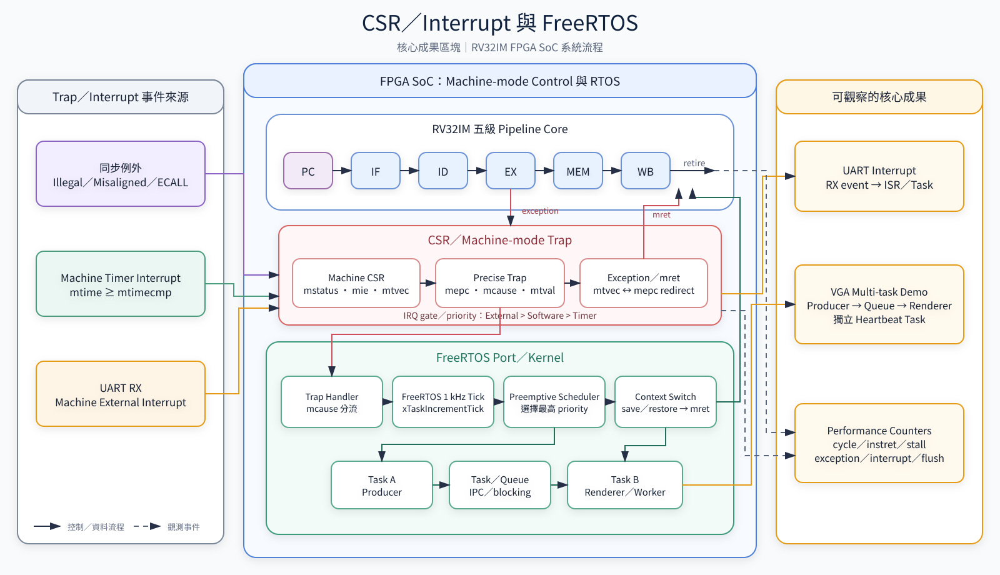
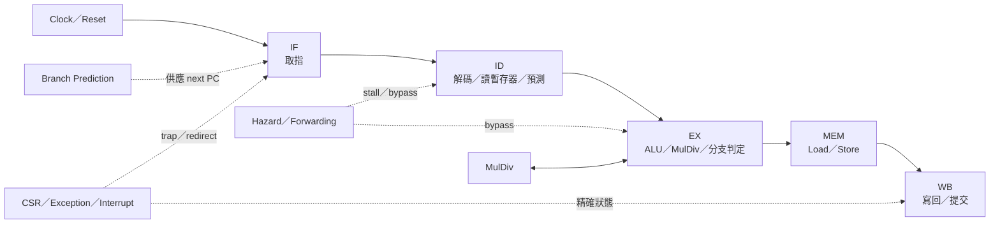
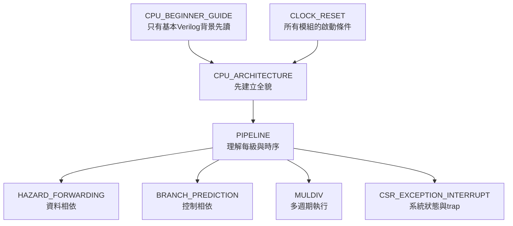

# 01 — CPU 架構導覽

> 這個資料夾解釋「一條 RISC-V 指令進入 CPU 後，如何被取指、解碼、執行、提交，以及遇到相依、分支、例外和中斷時怎麼處理」。

## CSR／Interrupt 與 FreeRTOS 核心成果

圖中濃縮 machine-mode trap、timer／UART interrupt、1 kHz tick、搶占式排程、context switch、
Task／Queue、VGA multi-task demo 與 performance counters 的關係。可縮放版本見
[SVG](diagrams/csr-interrupt-freertos-core-results.svg)，產生程式是
[`tools/generate_csr_interrupt_freertos_diagram.py`](../../tools/generate_csr_interrupt_freertos_diagram.py)。

## CPU 內部層級

## 文件依賴關係

## 建議閱讀順序

| 層級 | 文件 | 核心問題 |
|---|---|---|
| 初學入口 | [CPU_BEGINNER_GUIDE.md](CPU_BEGINNER_GUIDE.md) | 只有基本Verilog背景時，如何第一次追蹤ADD、Load、Store與Branch？ |
| 全貌 | [CPU_ARCHITECTURE.md](CPU_ARCHITECTURE.md) | CPU 支援什麼、各模組在哪裡？ |
| 主幹 | [PIPELINE.md](PIPELINE.md) | 指令每個 cycle 在哪一級？ |
| 資料相依 | [HAZARD_FORWARDING.md](HAZARD_FORWARDING.md) | 何時 forwarding、何時 stall？ |
| 控制流 | [BRANCH_PREDICTION.md](BRANCH_PREDICTION.md) | 預測錯誤如何 flush 與 redirect？ |
| 長運算 | [MULDIV.md](MULDIV.md) | 多週期 RV32M 如何停住 pipeline？ |
| 系統控制 | [CSR_EXCEPTION_INTERRUPT.md](CSR_EXCEPTION_INTERRUPT.md) | trap、timer interrupt、`mret` 如何運作？ |
| 基礎時序 | [CLOCK_RESET.md](CLOCK_RESET.md) | 哪個 clock 驅動 CPU、何時離開 reset？ |

## 修改前最小閱讀集合

| 要修改 | 先讀 |
|---|---|
| ALU／decode | `CPU_ARCHITECTURE`、`PIPELINE` |
| Stall／forwarding | `PIPELINE`、`HAZARD_FORWARDING` |
| Branch／jump | `PIPELINE`、`BRANCH_PREDICTION` |
| CSR／interrupt | `CSR_EXCEPTION_INTERRUPT`、`PIPELINE` |
| MulDiv | `MULDIV`、`HAZARD_FORWARDING` |
| Reset／clock domain | `CLOCK_RESET`，再讀受影響模組 |

若讀者只知道五級pipeline名稱、還沒有完整CPU設計經驗，先完成 [CPU初學者接手指南](CPU_BEGINNER_GUIDE.md) 的TEST=1..4練習，再進入上表的實作文件。

上下游：[系統總覽](../00-overview/README.md) · [Memory／I/O](../02-memory-io/README.md) · [驗證](../06-verification/README.md)
