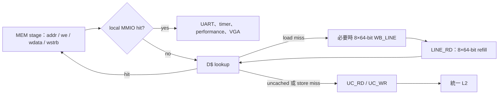
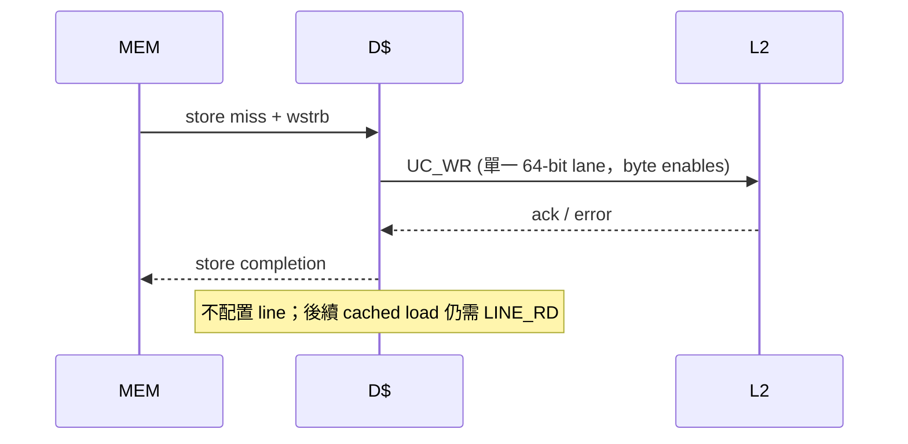
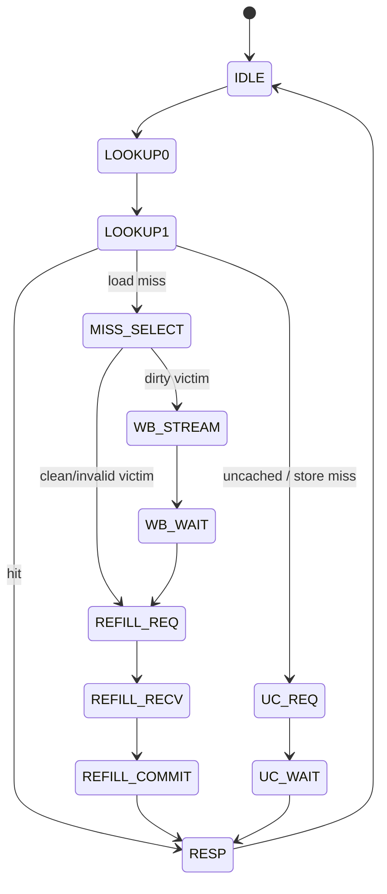

# L1 Data Cache（D$）

D$ 模組為 [`dcache.v`](../../dcache.v) 的 `dcache_blocking`，由 [`icache_pipeline_top.v`](../../icache_pipeline_top.v) 的 MEM path 使用。它是 2-way、64-byte line、write-back 的 PIPT blocking cache；CPU 端為 32-bit load/store，L2 端為 64-bit beat。統一 L2/DDR2 的行為見 [L2_CACHE_DDR2.md](L2_CACHE_DDR2.md)。

## 組態、陣列與位址

| 建置條件                      |     D$ 容量 | Ways | Sets | line | offset/index/tag |
| ----------------------------- | ----------: | ---: | ---: | ---: | ---------------- |
| 現行 Vivado 實板 `FAST_SYNTH` |   **8 KiB** |    2 |   64 | 64 B | 6 / 6 / 20 bits  |
| `FAST_SIM`                    |       8 KiB |    2 |   64 | 64 B | 6 / 6 / 20 bits  |
| full configuration            | **128 KiB** |    2 | 1024 | 64 B | 6 / 10 / 16 bits |

```text
FAST_SYNTH / FAST_SIM: PA[31:12] tag | PA[11:6] index | PA[5:0] offset
full configuration:    PA[31:16] tag | PA[15:6] index | PA[5:0] offset
```

每 way 儲存 512-bit data、tag、valid、dirty；每 set 一個 1-bit `lru_mem`。victim 選擇順序為 invalid way0、invalid way1、否則 LRU 指定 way。hit/refill 後更新 LRU，使另一 way 成為較可能的 victim。容量由 top 的 `D_CACHE_BYTES_CFG` 決定，`dcache.v` 本身以參數推導 sets/index/tag；不可只改 `CACHE_BYTES` 而保留舊的測試/位址假設。

## CPU 與 L2 transaction



| L2 command   | 來源                                    | request                                          | response                    |
| ------------ | --------------------------------------- | ------------------------------------------------ | --------------------------- |
| `LINE_RD=00` | cached load miss                        | 64 B 對齊，`size=3`、`len=7`                     | 8 × 64-bit，最後一拍 `last` |
| `UC_RD=01`   | `cpu_req_uncached` load                 | 原 address，`size=2`、`len=0`                    | 1 × 64-bit                  |
| `UC_WR=10`   | uncached store 或 **cached store miss** | 原 address，`size=2`、`len=0`、byte strobe       | 1-beat ack                  |
| `WB_LINE=11` | dirty victim                            | 64 B 對齊，8 個 request beats，`size=3`、`len=7` | 1-beat ack                  |

`cpu_req_ready` 只有 `S_IDLE` 為 1，故 lookup、refill、writeback、uncached wait 與 response back-pressure 都會阻塞新的 CPU memory request。`cpu_rsp_valid` 會保持到 `cpu_rsp_ready`；store 也會收到 zero-data completion，以便 MEM stage 知道交易完成。

## 命中、寫入與 miss 策略

`S_LOOKUP0` 以 index 讀兩 way 的 data/tag/valid/dirty，`S_LOOKUP1` 判定命中，屬於 registered SRAM lookup。

- load hit：由 `addr[5:2]` 選 32-bit word，回覆資料並更新 LRU。
- store hit：以 `cpu_req_wstrb[3:0]` merge 該 32-bit word，寫回所在 line，設 dirty，回覆成功。SB/SH/SW 的 lane mask 已由 MEM path 建立。
- load miss：選 victim；valid 且 dirty 時先以 `WB_LINE` 串流 8 個 64-bit beats，等 ack 成功後才 `LINE_RD` refill。收齊 8 beats 且 `last` 正確時 install clean line，擷取原 word 後回覆。
- clean/invalid victim：跳過 writeback，直接 refill。

### Store miss 是 no-write-allocate

現行 RTL 對 **任何 store miss** 轉 `S_UC_REQ` 發 `UC_WR`，不讀整條 line、也不配置 D$ line。這是特意的 no-write-allocate 策略，而非 write-allocate；兩次對同一個尚未 resident line 的 store 都會各自產生 UC_WR。其好處是避免只寫少數 bytes 時的 64 B read-for-ownership；代價是之後 cached load 仍要 miss/refill。這個行為由 [`dcache_tb.v`](../../dcache_tb.v) 明確驗證。

具體例子如下：

```assembly
sw x2, 0(x1)       # x1 = 0x8000_2000，且該 line 尚未在 D$
lw x3, 0(x1)
```

假設 `x2=0x12345678`：

1. 第一條 `sw` 是 store miss，D$ 送出單筆 `UC_WR`，把 `0x12345678` 寫到下層；D$ **不配置** `0x8000_2000` 所在的 64-byte line。
2. 緊接的 `lw` 查 D$ 時仍然 miss，因此送出 `LINE_RD`，從 L2／DDR refill 完整 64-byte line。
3. Refill 完成後，`lw` 回傳 `0x12345678`，而該 line 此時才成為 resident。

所以「store 已成功」不等於「該 address 現在一定能在 D$ hit」。如果波形中看到 `UC_WR` 後又立刻出現同位址的 `LINE_RD`，這是現行策略的正常結果。



## Dirty eviction、refill 與錯誤

dirty eviction 使用 `S_WB_STREAM` 把 512-bit victim 分成 8 個 64-bit request beats；每 beat 必須各自與 `l2_req_ready` handshake。`S_WB_WAIT` 只接受 L2 的最後 ack。writeback error 時保留舊的 dirty victim、不安裝新 line，並回覆 CPU error，避免靜默遺失資料。

refill 在 `S_REFILL_RECV` 逐 beat 組裝 512-bit buffer；收到 error、或 `last` 在第 8 beat 前出現，都以 error 完成而不 install。正常 `S_REFILL_COMMIT` 才更新 data/tag/valid 並清 dirty。uncached read/write 的 L2 error 直接傳為 `cpu_rsp_err`，整合 top 會轉為 load access fault（cause 5）或 store/AMO access fault（cause 7）。

## Uncached 與實際 local MMIO bypass

`dcache_blocking` 支援 `cpu_req_uncached`，可將 UC_RD/UC_WR 經 L2 送往 DDR；64-bit 回覆會依 `addr[2]` 取低/高 32-bit word。不過現行完整 top 對本地裝置採取更早的 decode，並將它們**完全繞過 D$ 與 L2**：

| 位址範圍                                | 路由                                                                                      |
| --------------------------------------- | ----------------------------------------------------------------------------------------- |
| `0x4000_0000..0x4000_FFFF`              | UART、software/timer/external interrupt、performance MMIO；由 top local response mux 回覆 |
| `0x4000_0100..0x4000_01FF`              | performance counter 子區域（仍屬上列 local MMIO）                                         |
| `0x5000_0000..0x5000_7FFF`（`USE_VGA`） | VGA subsystem，local bypass                                                               |
| 其他 CPU data address                   | 送 D$；目前 top 將 `cpu_req_uncached` 綁為 0，因此不是 local MMIO 的 uncached DDR 路徑    |

因此不可把「L2 可將 MMIO 視為 uncached」誤解成目前軟體 MMIO 會到 L2：在整合實作中 `local_mmio_hit` 已先遮蔽 `dcache_cpu_req_valid`。未命中的 local MMIO 位址仍由其 local device 回 error，不會回退到 DDR。

## 狀態、效能、測試與除錯



Top 的 `PERF_DCACHE_MISSES` 是同一個 OR 條件：D-side L2 handshake 的 command 為 `LINE_RD`（load miss/refill）**或** `UC_WR`（store miss，及未來若啟用的 uncached store）都加 1；它不是兩個分開的 counter。DDR command 計數則只計 L2 擁有期間。實際 latency 仍取決於 L2 arbitration、L2 hit/miss、DDR2 回應與 back-pressure，不應以 standalone D$ cycle 數外推實板結果。

[`dcache_tb.v`](../../dcache_tb.v) 使用 128 KiB 參數與 memory/reference scoreboard，涵蓋 cold/hit、partial byte/halfword store、no-write-allocate store miss、uncached high/low lane、dirty/clean eviction、8-beat data 保存、錯誤、request/response back-pressure，以及 20,000 次混合隨機回歸。
