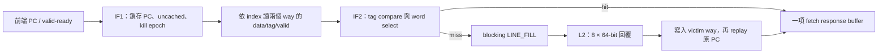
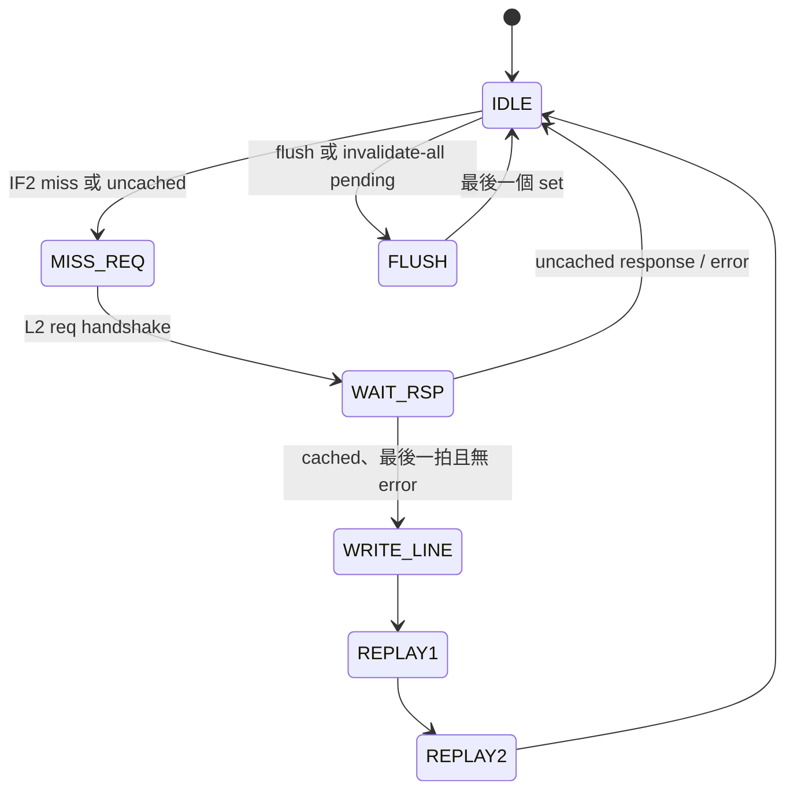

# L1 Instruction Cache（I$）

本文件說明目前整合於 [`icache_pipeline_top.v`](../../icache_pipeline_top.v) 的 I$，其實作位於 [`icache.v`](../../icache.v)，包裝層位於 [`icache_top.v`](../../icache_top.v)。它是 2-way、64-byte line、實體位址索引與標籤（PIPT）的 blocking instruction cache；一次只允許一個 miss/refill 交易。L2/DDR2 端的協定與限制見 [L2_CACHE_DDR2.md](L2_CACHE_DDR2.md)。

## 組態與位址切割

| 建置條件 | I$ 容量 | Ways | Sets | line | offset/index/tag |
|---|---:|---:|---:|---:|---|
| 現行 Vivado 實板 `FAST_SYNTH` | **8 KiB** | 2 | 64 | 64 B | 6 / 6 / 20 bits |
| `FAST_SIM` | 8 KiB | 2 | 64 | 64 B | 6 / 6 / 20 bits |
| full configuration（未定義 `FAST_*`） | **64 KiB** | 2 | 512 | 64 B | 6 / 9 / 17 bits |

`icache_pipeline_top.v` 在 synthesis 且未定義 `PRODUCTION_BUILD` 時會定義 `FAST_SYNTH`；因此目前的 bitstream 不是 64 KiB 版本。容量公式如下：

```text
sets = CACHE_BYTES / (LINE_BYTES × ways)
tag  = PA[31 : OFFSET_BITS + INDEX_BITS]
index= PA[OFFSET_BITS + INDEX_BITS - 1 : OFFSET_BITS]
offset = PA[5:0]
```

```text
FAST_SYNTH / FAST_SIM（8 KiB）
31                         12 11       6 5                 0
+----------------------------+-----------+-------------------+
| tag[19:0]                  | index[5:0]| line offset[5:0]  |
+----------------------------+-----------+-------------------+

full configuration（64 KiB）
31                15 14             6 5                 0
+-------------------+----------------+-------------------+
| tag[16:0]         | index[8:0]     | line offset[5:0]  |
+-------------------+----------------+-------------------+
```

一條 line 有 16 個 RV32 指令；回覆選擇器為 `PC[5:2]`，`PC[1:0]` 是該 32-bit 指令內的 byte offset。每 way 有 data/tag/valid 陣列；每 set 一個 `plru_bit`。優先選 invalid way，兩 way 都有效時選 `plru_bit` 指示的 victim；命中 way0 後將 bit 設為 1，命中 way1 後設為 0，因此下一次傾向替換另一 way。

### 位址切割範例

以現行 8 KiB 組態和 `PC=0x8000_1234` 為例：

```text
64-byte line base = 0x8000_1200
line offset       = PC[5:0]   = 0x34 = 52 bytes
instruction slot  = PC[5:2]   = 13
set index         = PC[11:6]  = 8
tag               = PC[31:12] = 0x80001
```

意思是 I$ 會查看 set 8 的兩個 ways，找 tag `0x80001`。命中後，從該 64-byte line 取第 13 個 32-bit instruction。若兩個 way 都沒有這個 tag，就向 L2 請求從 `0x8000_1200` 開始的完整 64-byte line，而不是只讀 `0x8000_1234` 的 4 bytes。

## 資料路徑與命中時序



`if_req_ready` 僅在 `ST_IDLE` 且 response buffer 沒被下游 back-pressure 時為 1；`accept_req = valid && ready && !if_req_kill`。命中為兩段 registered lookup：

| cycle | 動作 |
|---|---|
| N | 前端 `if_req_valid && if_req_ready`；PC 進 IF1。 |
| N+1 | 用 IF1 的 index 擷取兩 way 的 data/tag/valid 到 IF2。 |
| N+2 | 比較 tag、以 `PC[5:2]` 取指令，建立 `if_resp_*`。 |
| 後續 | 直到 `if_resp_valid && if_resp_ready` 才釋放 response。 |

這是 single-outstanding 設計：miss、refill、replay、flush 期間都不接受新的 fetch。即使 hit 路徑本身是 pipeline，整合 top 另有 `if_pending` 與 response buffer，避免同時存在多筆前端請求。

## L2 協定、miss 與錯誤

| I$ 操作 | `cmd` | address | `size` / `len` | 回覆 |
|---|---:|---|---|---|
| cached miss | `LINE_FILL=00` | 64 B 對齊 | `3`（8 B）、`7` | 8 個 64-bit beats，最後一拍 `last=1` |
| uncached fetch | `UC_READ=01` | 原始 PC | `2`（4 B）、`0` | 單一 beat |



cached miss 時 I$ 鎖存原 PC、line-aligned address、index/tag、victim 與當時 epoch；`WAIT_RSP` 將 8 個 64-bit beats 依序放到 512-bit `refill_buf`。收到最後一拍且無 `l2_rsp_err` 才 install tag/data/valid，再經 `REPLAY1/2` 以原 PC 取回指令。I$ 沒有 dirty bit，所以 victim 不會回寫。

任何 refill beat 的 `l2_rsp_err` 都使該 refill 不 resident；若原 fetch 未被 kill，回覆 `if_resp_err=1` 與安全 NOP `32'h0000_0013`。uncached read 直接回覆 L2 data 的低 32 bits並傳遞 error。上層必須把 `if_resp_err` 視為 instruction-access fault；資料欄位在 error 時不應被當作已取到的指令。

## Kill、flush 與 invalidate

### Kill epoch

`if_req_kill` 的 rising edge 遞增 8-bit `kill_toggle`；每筆 IF1/IF2/miss 都攜帶 snapshot。response epoch 不相同即被丟棄，且已暫存的 response valid 會清除。kill **不會取消**已送往 L2 的交易：refill 仍完成並可留在 cache，只是舊控制流不會收到回覆。

這可處理 branch/jump/trap redirect；注意 epoch 為 8 bits，極端情形下 256 次未完成生命期內的 kill 會 wrap。現行 single-outstanding 設計使這個風險很低，但不是可無限延伸的 tag。

### 管理操作

| 請求 | 實際動作 | ack |
|---|---|---|
| `ic_flush_req` | pending 後逐 set 清兩個 valid bit | 最後一個 set 時 `ic_flush_ack` pulse |
| `ic_inv_valid, ic_inv_all=0` | 一個指定 index/way 的 valid 清除 | `ic_inv_ack` pulse |
| `ic_inv_valid, ic_inv_all=1` | 使用同一個全 flush FSM | 結束時 `ic_inv_ack`（及 `ic_flush_ack`）pulse |

flush 時不清 data/tag/PLRU，因為 valid=0 已足以使 line 不可命中。8 KiB 組態需 64 個 set cycles；full 64 KiB 組態需 512 個。管理請求在 cache 回到 IDLE 後才會執行，並優先於新的 fetch；軟體/控制器必須以 ack 判定完成。現行核心沒有硬體 I$/D$ snoop，也沒有將 `FENCE.I` 實作為此 flush，因此 self-modifying code 需要額外的正確性整合。

## 實測組態、效能與除錯

miss 延遲包括 L2 仲裁、L2 hit/miss、必要的 L2 dirty eviction、MIG back-pressure 與 DDR2 回傳；不可把上述 N+2 hit 時序誤當成 miss latency。性能事件在 top 中以 I$ 的 `LINE_FILL` handshake 計數為 I$ miss，並以 fetch handshake 計數 access；詳見 [PERFORMANCE_COUNTER_REGISTERS.md](PERFORMANCE_COUNTER_REGISTERS.md)。

[`icache_tb.v`](../../icache_tb.v) 覆蓋 cold miss/hit、L2 request stall、response back-pressure、kill、uncached read、full flush、單 way invalidate、連續 miss、response gap 與 L2 error。建議回歸：

```powershell
iverilog -g2005-sv -o build_icache.out -s icache_tb icache_tb.v icache.v
vvp build_icache.out
```

波形先看 `state`、`s1_valid/s2_valid`、`hit0/hit1`、`miss_pc`、`refill_beat_cnt`、`l2_req_*`、`l2_rsp_*`、`if_resp_*`、`kill_toggle` 與 `flush_idx`。常見症狀的判讀：

| 症狀 | 優先檢查 |
|---|---|
| 永遠等 fetch | `l2_req_valid/ready` 是否握手、是否卡在 `WAIT_RSP` 等 `last`。 |
| refill 後仍 miss | line address 是否 64 B 對齊、index/tag 位數是否匹配 build define。 |
| redirect 後執行舊指令 | kill 是否為 rising edge、request 是否帶入正確 epoch。 |
| flush 無效 | request 是否保持到 ack；確認實際是 64/512 sets 的組態。 |

相關 RTL：[icache.v](../../icache.v)、[icache_top.v](../../icache_top.v)、[icache_pipeline_top.v](../../icache_pipeline_top.v)、[icache_tb.v](../../icache_tb.v)。
