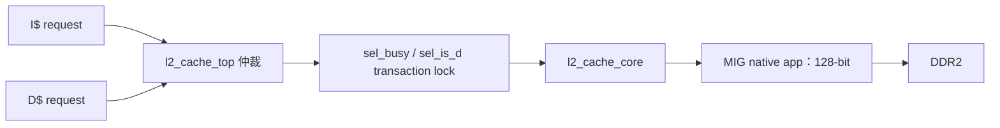
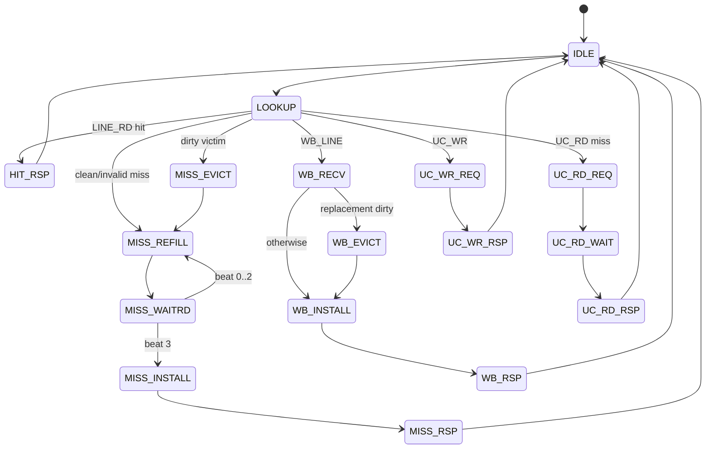
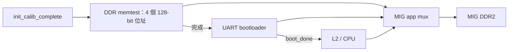

# 統一 L2 Cache 與 DDR2/MIG

統一 L2 由 [`I_D_arbitration.v`](../../I_D_arbitration.v) 的 `l2_cache_top`（仲裁/transaction lock）及 [`L2_cache.v`](../../L2_cache.v) 的 `l2_cache_core` 組成，後端接 [`MIG_DDR2_interface.v`](../../MIG_DDR2_interface.v) 的 128-bit MIG native app port。它接收 I$/D$ 的 64-bit 協定，提供 2-way write-back L2；`LINE_RD` miss 與 D$ `WB_LINE` 會配置 line，`UC_WR` miss 則不配置。每條 64 B line 會被轉成 4 次 128-bit MIG 存取。

I$/D$ 的前端策略見 [ICACHE.md](ICACHE.md) 與 [DCACHE.md](DCACHE.md)。本文件描述的是目前 RTL，不把舊 spec 或預期功能當成已實作功能。

## 組態與位址切割

| 建置條件 | L2 容量 | Ways | Sets | line | offset/index/tag |
|---|---:|---:|---:|---:|---|
| 現行 Vivado 實板 `FAST_SYNTH` | **16 KiB** | 2 | 128 | 64 B | 6 / 7 / 19 bits |
| `FAST_SIM` | 16 KiB | 2 | 128 | 64 B | 6 / 7 / 19 bits |
| full configuration | **256 KiB** | 2 | 2048 | 64 B | 6 / 11 / 15 bits |

```text
FAST_SYNTH / FAST_SIM
31                        13 12        6 5                 0
+---------------------------+-----------+-------------------+
| tag[18:0]                 | index[6:0]| line offset[5:0]  |
+---------------------------+-----------+-------------------+

full configuration
31            17 16                  6 5                 0
+---------------+---------------------+-------------------+
| tag[14:0]     | index[10:0]         | line offset[5:0]  |
+---------------+---------------------+-------------------+
```

每 way 有 512-bit BRAM data、tag、valid、dirty（RTL 名稱 `dir*_mem`）及每 set 1-bit PLRU。先選 invalid way，否則選 PLRU victim；hit/refill/writeback install 皆更新 PLRU。`L2_cache.v` 的檔頭寫 256 KiB 是 full configuration 的描述，不能用來判定目前 `FAST_SYNTH` bitstream 的真實容量。

## 上游仲裁與 transaction lock



閒置時仲裁優先序為：

1. `req_uncached=1` 的請求優先於 cached；兩者都 uncached 時 D$ 仍優先。
2. 其餘 cached 請求為 **D$ 優先於 I$**。

第一次 request handshake 後，`sel_busy` 與 `sel_is_d` 鎖住被選擇的 master；response 僅路由回該 master，直到 `rsp_valid && rsp_ready && rsp_last` 才解鎖。這包含 I$/D$ 的 8-beat line response，也包含 D$ 的 `WB_LINE` 8-beat request stream：在選擇 D$ 後，I$ 不會插隊。lock 提供 ordering 與資料路徑穩定性，但也代表 L2 是全域 single-outstanding，長 DDR miss/dirty eviction 會同時阻塞 I$、D$。

### 仲裁與 transaction lock 範例

假設同一拍：

```text
I$：為 PC=0x8000_4000 提出 cached LINE_RD
D$：為 load address=0x8000_9000 提出 cached LINE_RD
```

兩者都是 cached request，因此 D$ 優先。第一次 handshake 後，L2 將 owner 鎖為 D$：

```text
cycle N      選 D$，鎖定 sel_is_d=1
cycle N+...  處理 D$ lookup；若 miss，再等待 DDR refill
response     8 個 64-bit beats 全部只送回 D$
最後一拍    rsp_valid && rsp_ready && rsp_last，解除 lock
下一筆      才重新仲裁，I$ request 才有機會被接受
```

即使 I$ 在等待期間一直保持 request valid，也不能在 D$ 的第 3、4 個 response beat 中間插隊。否則 response 會無法判斷應送回哪個 master。這也解釋了為什麼一次長 D$ miss 可能連帶使 CPU 前端暫停取指。

[`l2_arb_tb.v`](../../l2_arb_tb.v) 驗證 D$ over I$、uncached over cached、UC read/write、WB_LINE stream、非法 burst 長度與 response `last`。

## L2 request/response 協定

| command | 編碼 | contract | L2 response |
|---|---:|---|---|
| `LINE_RD` | `00` | `size=3`、`len=7`，64 B aligned | 8 × 64-bit，最後一拍 `last=1` |
| `UC_RD` | `01` | `size=2` 或 `3`、`len=0` | 1 × 64-bit，`last=1` |
| `UC_WR` | `10` | `size=2` 或 `3`、`len=0`、wstrb | 1-beat zero-data ack |
| `WB_LINE` | `11` | `size=3`、`len=7`；8 個 64-bit request beats | 1-beat zero-data ack |

L2 在 reset 或 `init_calib_complete=0` 時不接受 request。`S_LOOKUP` 會檢查 DDR address 合法性及 `size/len` contract；不合法時走 `S_ERR_RSP`，回傳一拍 `rsp_err=1,last=1`。response 同樣遵守 valid/ready，master back-pressure 時要保持 data/error/last 穩定。

## L2 FSM、line 轉換與 DDR 存取



| 前端 64 B line | L2/MIG 動作 |
|---|---|
| L2 read hit | 從 512-bit line 連續回覆 8 個 64-bit beats。 |
| L2 read miss、clean victim | `S_MISS_REFILL/S_MISS_WAITRD` 發 4 個 16-byte MIG reads，組成 512-bit refill，再 install。 |
| L2 read miss、dirty victim | 先 `S_MISS_EVICT` 寫 4 個 128-bit beats，再執行上述 4-read refill。 |
| D$ `WB_LINE` | 收齊 8 個 64-bit request beats；若替換 dirty victim 先寫 4 個 128-bit beats，然後 install 新 dirty line、回 ack。 |
| `UC_RD` | 讀一個 16-byte-aligned MIG beat，依 address bit 3 選低/高 64 bits。 |
| `UC_WR` | 寫一個 16-byte-aligned MIG beat；將 64-bit data/wstrb 放到低或高 lane，未寫 byte 的 `app_wdf_mask` 為 1。 |

MIG 的 command/data channel 可分開 ready。寫操作透過 `mig_wr_cmd_done` 與 `mig_wr_data_done` 記錄各自 handshake，兩者都完成才將一個 128-bit beat 視為完成；不能假設 `app_rdy` 與 `app_wdf_rdy` 同時為 1。

`UC_RD/UC_WR` 在這個 L2 中不等於「完全忽略 L2 arrays」。`UC_RD` 若 L2 已有 resident line，會直接由該 line 回傳對應 64 bit；miss 才讀 MIG。`UC_WR` 無論 hit/miss 都會送 MIG write；若 L2 hit，還會把 byte strobe merge 到 resident line 並標成 dirty，若 miss 則不 allocate。這是目前 RTL 的實際一致性處理，不能只由 command 名稱推斷為永遠直通 DDR。

## DDR address translation 與 alias

CPU/L2 合法 DDR window 為 `0x8000_0000..0x87FF_FFFF`。MIG app address 由 `pa_to_app_addr16()` 轉換：先以 `PA - 0x8000_0000` 得 offset，送入 27-bit、16-byte 對齊的 native app address。換句話說 L2 的四個 line beats 對應 `line_base + 0x00/0x10/0x20/0x30`。

```text
CPU PA 0x8000_1234
  -> DDR offset / MIG app_addr = 0x0000_1230（MIG 16 B 對齊）
  -> addr[3]=0：選 app_rd_data[63:0]；addr[3]=1：選 [127:64]
```

為維持舊測試，L2 會對 bit 31 為 0 的位址嘗試加上 `DDR_BASE`，但換算後仍執行 `DDR_END` range check；所以真正有效的 legacy alias **只有** `0x0000_0000..0x07FF_FFFF`，對應 `0x8000_0000..0x87FF_FFFF`。例如 `0x0800_0000` 會變成超界的 `0x8800_0000` 並回 error。這是 **L2 的 address normalisation**，不是 MMU/virtual-memory translation，也不是 cache coherence 機制。軟體應優先使用 canonical `0x8000_0000` DDR 位址，並避免混用 alias 與 canonical address：兩者會先以不同 tag 進入 L1，現行設計沒有處理 synonym 一致性。

L2 內部會對 `0x4000_0000..0x4000_FFFF` 產生 `unc_eff`，但 `addr_legal` 仍只接受 DDR window，所以直接送到 L2 的 MMIO request 最後會回 error。完整 top 會更早把 UART/timer/performance MMIO local-bypass，正常軟體存取根本不會到 L2；請見 [DCACHE.md](DCACHE.md#uncached-與實際-local-mmio-bypass)。不在 DDR window 的 L2 request不會自動轉成 device access。

## MIG mux：memtest > boot > L2

實板 `USE_MIG=1` 路徑在 [`icache_pipeline_top.v`](../../icache_pipeline_top.v) 將 MIG app port 以固定優先序 mux：



實際選擇為 **memtest > bootloader > L2**。memtest 在 calibration 完成後啟動，對四個 16-byte address 寫/讀指定 pattern；若 `UART_BOOT_EN`，bootloader 必須等待 memtest done，之後持有 MIG 到 `boot_done`。核心 reset 也受 `init_calib_complete` 與 boot release 約束。因此 boot 前看到 L2 無 request/DDR traffic 是設計預期，不應先懷疑 cache FSM。

## 限制、效能與除錯

- 全系統只有一筆 L2 transaction；沒有 miss-under-miss、queue、banking、prefetch 或 QoS/fairness。D$ 優先可能使 I$ 在 data-heavy workload 下飢餓。
- L2 沒有 ECC/parity、timeout、flush/invalidate/snoop，也沒有處理 alias coherence。MIG native interface 本身沒有明確 DDR error signal，因此 L2 `rsp_err` 主要來自 address/protocol 檢查或測試注入，不代表完整 DDR fault containment。
- `LINE_RD` refill 是四次順序 128-bit read，不是單一四-beat burst；效能受每次 `app_rdy`、read return latency 及 upstream response back-pressure 影響。
- 現行實板的 16 KiB L2 與 full 256 KiB 的 index/tag、BRAM 使用量及 conflict 行為差異很大；分析 performance counter 時必須記錄 build define。

Top 的 DDR read/write counters 僅計 L2 ownership 的 accepted MIG commands；bootloader/memtest traffic 被刻意排除。回歸可分層執行：

```powershell
iverilog -g2005-sv -o build_l2arb.out -s l2_arb_tb l2_arb_tb.v I_D_arbitration.v L2_cache.v
vvp build_l2arb.out
```

整合 regression 的 `icache_pipeline_tb.v` 包含 I$/D$ command hold、response stability、MIG read watchdog，以及 test 15（I$ error）/16（D$ error）注入；test 17/18 對應 I$/D$ 壓力 workload。除錯時依序觀察 `sel_busy/sel_is_d`、`u_core.state`、`cmd_r/addr_r`、`rsp_beat_cnt/mig_beat_cnt`、`app_en/app_cmd/app_addr`、`app_wdf_*`、`app_rdy/app_wdf_rdy`、`app_rd_data_valid` 與 `init_calib_complete`。若 L2 看似停住，先確認目前 MIG owner 是否仍是 memtest 或 bootloader，再檢查是否等待 4 次 read 中的一次回傳。

相關 RTL：[I_D_arbitration.v](../../I_D_arbitration.v)、[L2_cache.v](../../L2_cache.v)、[MIG_DDR2_interface.v](../../MIG_DDR2_interface.v)、[l2_arb_tb.v](../../l2_arb_tb.v)、[icache_pipeline_top.v](../../icache_pipeline_top.v)。
