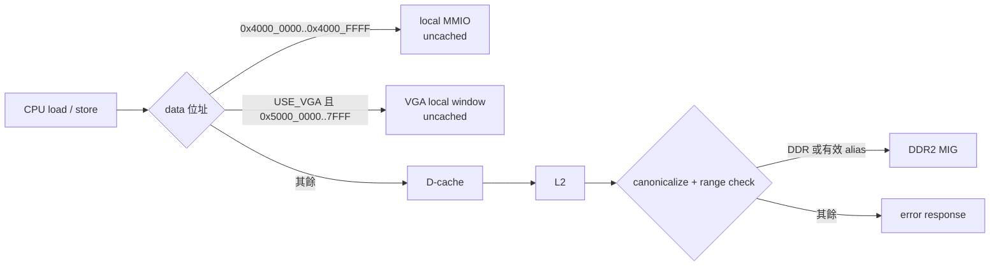

# 記憶體位址圖

本文件描述 CPU 可見的 32-bit 位址空間。位址解碼以 [`icache_pipeline_top.v`](../../icache_pipeline_top.v) 的 data-side local decode 與 [`L2_cache.v`](../../L2_cache.v) 的 DDR decode 為準；軟體配置以 linker script 為準。所有數值均為 **byte address**，CPU 與記憶體採 little-endian。

相關文件：[MMIO](./MMIO.md)、[PERF 暫存器 ABI](./PERFORMANCE_COUNTER_REGISTERS.md)、[L2 / DDR2](./L2_CACHE_DDR2.md)、[例外與 CSR](../01-architecture/CSR_EXCEPTION_INTERRUPT.md)。

## 總覽

| CPU 位址範圍 | 大小 | 用途 | 結果 |
|---|---:|---|---|
| `0x0000_0000..0x07FF_FFFF` | 128 MiB | DDR low alias | 有效；映射至 `0x8000_0000..0x87FF_FFFF` |
| `0x0800_0000..0x3FFF_FFFF` | — | 未映射 | L2 error response |
| `0x4000_0000..0x4000_FFFF` | 64 KiB | local MMIO | 不經 D-cache；已知暫存器正常，其他位址回 error |
| `0x4001_0000..0x4FFF_FFFF` | — | 未映射 | L2 error response |
| `0x5000_0000..0x5000_7FFF` | 32 KiB | 可選 VGA | 僅 `USE_VGA != 0` 時 local / uncached |
| `0x5000_8000..0x7FFF_FFFF` | — | 未映射 | L2 error response |
| `0x8000_0000..0x87FF_FFFF` | 128 MiB | DDR canonical window | 有效、cacheable DDR2 |
| `0x8800_0000..0xFFFF_FFFF` | — | 未映射 | L2 error response |



local decode 只存在於 data path。instruction fetch 不會把 `0x4000_xxxx` 當成 MMIO；它會進 I-cache/L2，並因不在 DDR window 而成為 instruction access fault。

### 快速判斷位址的例子

新人看到一個位址時，可以先用下表判斷它會走哪條硬體路徑：

| CPU 動作與位址 | 實際路徑 | 結果 |
|---|---|---|
| `LW 0x8000_1234` | D$ → L2 → DDR canonical window | 合法的 cacheable data access |
| `LW 0x0000_1234` | D$ → L2，canonicalize 成 `0x8000_1234` | 與上一列指向同一 DDR byte，但軟體不建議混用兩種名稱 |
| `LW 0x4000_0008` | Top local MMIO → UART RX data | 合法讀取；讀取動作會 pop 一個 RX byte |
| `SW 0x4000_0030` | Top local MMIO aperture，但 register 未定義 | Store access fault，不會寫進 DDR |
| `LW 0x0800_0000` | L2 canonicalize 成 `0x8800_0000` 後超出 DDR | Load access fault |
| Instruction fetch `0x4000_0000` | I$ → L2；instruction side 沒有 local MMIO bypass | Instruction access fault |
| `SW 0x5000_0000` | `USE_VGA=1` 時走 VGA；否則未映射 | 結果取決於本次 bitstream 是否包含 VGA |

這些例子也說明「位址最高位是 0」不代表一定是 DDR low alias；canonicalize 後仍必須落在實際 128 MiB DDR window。

## DDR 與唯一有效的 low alias

實體／canonical DDR window 固定為：

```text
DDR_BASE = 0x8000_0000
DDR_END  = 0x87FF_FFFF
大小     = 0x0800_0000 = 128 MiB
```

L2 對 bit 31 為 0 的請求嘗試 `address + 0x8000_0000`，然後**仍會檢查**結果是否位於 DDR window。因此有效 alias 僅為：

```text
0x0000_0000..0x07FF_FFFF
        + 0x8000_0000
= 0x8000_0000..0x87FF_FFFF
```

例如，`0x0000_1234` 與 `0x8000_1234` 指向同一 DDR byte；`0x0800_0000` 會換算成 `0x8800_0000`，超出 `DDR_END`，所以是 error，絕不是更大的「低半部 alias」。同理，`0x4000_xxxx` 在 top-level 已先被 local MMIO 攔截，不會落入此 alias 規則。

L2 的 cache tag、line address 與 MIG app address 都使用 canonical 後的位址；MIG offset 為 `physical_address - 0x8000_0000`。軟體應優先使用 canonical address，避免同一實體資料同時由 alias 與 canonical address 留在 L1 cache 而產生 synonym/coherence 風險。

## Cacheability、錯誤與對齊

| 類型 | I-fetch | data load/store | 備註 |
|---|---|---|---|
| DDR canonical / 有效 alias | I-cache、L2 | D-cache、L2 | 正常 cacheable 記憶體 |
| local MMIO `0x4000_xxxx` | 不支援 | bypass D-cache | 不得以快取或一般物件存取 |
| 可選 VGA window | 不支援 | bypass D-cache | 僅啟用 VGA 的設計 |
| 未映射 | instruction fault | load/store access fault | 由 error response 轉為 trap |

`LH/LHU/SH` 必須 2-byte 對齊，`LW/SW` 必須 4-byte 對齊。對齊檢查在 EX 階段完成，違反時不發出記憶體或 MMIO transaction：load address misaligned 為 `mcause=4`，store/AMO address misaligned 為 `mcause=6`，`mtval` 為有效位址。正常交易若收到 error response，則為 load access fault (`mcause=5`) 或 store/AMO access fault (`mcause=7`)。

## Linker 與映像限制

DDR 的硬體 window 是 128 MiB，但 linker 脚本刻意只配置較小的映像區，不能把兩者混為一談。

| 產物 | linker | ORIGIN | LENGTH | 可配置範圍 |
|---|---|---:|---:|---|
| bare-metal | [`tools/link_ddr.ld`](../../tools/link_ddr.ld) | `0x8000_0000` | 512 KiB | `0x8000_0000..0x8007_FFFF` |
| FreeRTOS | [`OS/rtos/link_ddr.ld`](../../OS/rtos/link_ddr.ld) | `0x8000_0000` | 8 MiB | `0x8000_0000..0x807F_FFFF` |

bare-metal script 將 `.text/.rodata/.data/.bss` 放入 512 KiB DDR region，並令 `__stack_top = 0x8008_0000`。FreeRTOS script 使用 8 MiB，另配置 64 KiB `.startup_stack` 與 `.rtos_heap`，並以 linker `ASSERT` 防止 heap、stack 與 image 超出該 8 MiB。兩者都不代表 DDR 只剩該大小；其餘 DDR 是否可由程式自行使用，仍需自行規劃且避免與載入器／其他映像衝突。

## 常見問題

**可否把程式連結到 `0x0000_0000`？** 硬體讀寫可透過 low alias 成功，但 reset、boot 與兩份現有 linker script 都使用 `0x8000_0000`。建議不要混用。

**`0x0800_0000` 為何失敗？** alias 範圍恰好只有 128 MiB；該位址 canonicalize 後為 `0x8800_0000`，不合法。

**VGA window 一定存在嗎？** 不一定。[`board_top_vga.v`](../../board_top_vga.v) 將 `USE_VGA=1`；未啟用的 top-level 對 `0x5000_xxxx` 不做 local decode，因此會 fault。詳見 [VGA](./VGA.md)。

## 驗證

建議至少執行下列測試，並保留 linker map 檔檢查 section 與 stack/heap 邊界：

```powershell
make uart-mmio-tb
make perf-counter-tb
powershell -NoProfile -ExecutionPolicy Bypass -File .\tools\run_long_verification.ps1
```

另外可直接檢視 [`L2_cache.v`](../../L2_cache.v) 的 `DDR_BASE`、`DDR_END`、`addr_eff` 與 `addr_legal`，確認新硬體版本仍維持上述 decode。
