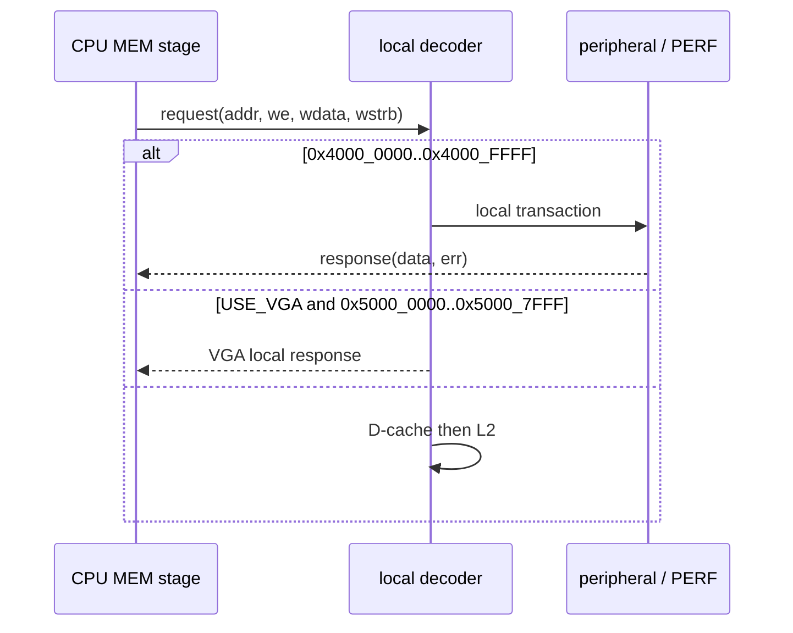

# MMIO 存取規格

本規格描述 CPU data path 的 local MMIO。實作位於 [`icache_pipeline_top.v`](../../icache_pipeline_top.v)，存取格式由 [`MEM.v`](../../MEM.v) 產生。位址圖與 DDR alias 請先參考 [記憶體位址圖](./MEMORY_MAP.md)；PERF page 的完整 ABI 請參考 [PERF 暫存器 ABI](./PERFORMANCE_COUNTER_REGISTERS.md)。

## Decode 與 transaction 規則

整個 `0x4000_0000..0x4000_FFFF` 都是 local MMIO aperture：命中後繞過 D-cache，不會發出 L2／DDR request。**任何未列出的位址、未支援的讀寫方向或非法 strobe 都回傳 error response**；它們不會被當作 DDR alias 或一般 RAM。PERF page 為唯一有註冊回應的一頁，接受後下一個 core clock 才回應；一般 UART/timer register 依其 ready 條件回應。



| 範圍 / 位址 | 讀取 | 寫入 |
|---|---|---|
| `0x4000_0000` UART TX data | 成功，回 0 | 寫出最低 asserted byte；TX busy 時 ready 會等待 |
| `0x4000_0004` UART TX status | bit0=`tx_ready` | error |
| `0x4000_0008` UART RX data | `[7:0]` 為字元；讀取即 pop | error |
| `0x4000_000C` UART RX status | bit0=`rx_valid`，bit1=`rx_overrun`；讀取清 bit1 | error |
| `0x4000_0010` launcher button | bit0=pressed | error |
| `0x4000_0014` launcher reset | 成功，回 0 | 任一 byte lane 的最低 byte bit0=1 時觸發 |
| `0x4000_0018` / `0x001C` | synthetic MSIP / MEIP bit0 | 可讀寫 bit0 |
| `0x4000_0020/24/28/2C` | MTIME low/high、MTIMECMP low/high | 可讀寫對應 32-bit word |
| `0x4000_0100..0x4000_01CC` | PERF ABI | 僅 CONTROL 的合法寫入；詳見 PERF 文件 |
| 其餘 `0x4000_xxxx` | error | error |

`0x5000_0000..0x5000_7FFF` 是可選 VGA local window，只有 `USE_VGA != 0` 時有效；不在 `0x4000` aperture，且不屬於本頁周邊暫存器集合。它的 transaction 和 framebuffer/control 行為請參考 [VGA](./VGA.md)。

## Little-endian、byte lanes 與存取大小

CPU store data 已由 MEM stage 對齊。`wstrb[n]` 控制 32-bit word 的 byte lane `n`：

| 位址低兩位 | lane | `wstrb` | 對應 `wdata` |
|---:|---:|---:|---|
| `+0` | 0 | `4'b0001` | `[7:0]` |
| `+1` | 1 | `4'b0010` | `[15:8]` |
| `+2` | 2 | `4'b0100` | `[23:16]` |
| `+3` | 3 | `4'b1000` | `[31:24]` |

`SB` 產生一個 lane，`SH` 在 `+0/+2` 產生 `0011/1100`，`SW` 產生 `1111`。UART TX 與 launcher reset 會由 `uart_mmio_wbyte` 取「**最低** asserted lane」的 byte；因此建議對這類 8-bit side-effect register 使用 aligned `SB` 或 `SW`，以免多 lane 寫入的選擇規則造成意外。

MSIP、MEIP、MTIME 與 MTIMECMP 的接法不同：write enable 只檢查至少一個 strobe，但資料直接使用 MEM 已對齊的完整 `dmem_wdata_o`，沒有一般 RAM 的 byte merge，也沒有用 `uart_mmio_wbyte` 還原被選 lane。因此這些 register 應一律在表列的 word-aligned base address 使用 `SW`；不要用 `SB/SH` 寫 `base+1/+2/+3`，否則移位後的資料不會代表「只更新該 byte lane」。

讀取端則由 MEM stage 按 `LB/LBU/LH/LHU/LW` 擷取所需 byte/halfword 並做符號／零擴展；周邊回覆本身一律為 32-bit register word。

### 具體例子：送出字元 `A`

ASCII `A` 是 `0x41`。最直接的 C 寫法是：

```c
*(volatile uint8_t *)(uintptr_t)0x40000000u = 0x41u;
```

CPU 會產生對 `0x4000_0000` 的 byte store：

```text
wstrb = 0001
wdata[7:0] = 0x41
```

UART TX busy 時，這筆 MMIO transaction 會等待 `ready`，不是把 `A` 靜默丟掉。若改用 word store `MMIO32(0x40000000)=0x00000041`，`wstrb=1111`，UART 仍依規則選最低 asserted lane 的 `0x41`；但為了清楚表達 8-bit register，driver 優先使用 byte-oriented API。

### 具體例子：misaligned 與 unmapped 不同

```text
LW 0x4000_0002  → 位址未對齊，在 EX 就產生 mcause=4，不會送到 MMIO
LW 0x4000_0030  → 位址有對齊，但 register 未定義；MMIO 回 error，產生 mcause=5
```

前者是「這個存取大小不能使用該位址」，後者是「位址格式合法，但裝置不支援這個 register」。除錯時可由 `mcause` 區分。

## volatile C 用法

### C 指標快速複習

先不看硬體，以下是普通RAM變數：

```c
uint32_t number = 10u;
uint32_t *pointer = &number;
```

假設`number`位於`0x8000_1000`，可以把記憶體想成：

```text
pointer保存的內容                    number所在位置
┌────────────────┐                  ┌────────────────┐
│ 0x8000_1000    │ ───────────────→ │ 10             │
└────────────────┘                  └────────────────┘
     地址                                  32-bit資料
```

常見符號的意思：

| C寫法 | 意思 | 上例的結果 |
|---|---|---|
| `number` | 直接取得變數內容 | `10` |
| `&number` | 取得`number`的地址 | `0x8000_1000` |
| `pointer` | 取得pointer裡保存的地址 | `0x8000_1000` |
| `*pointer` | 前往pointer保存的地址，取得該位置內容 | `10` |
| `&pointer` | pointer這個變數自己所在的地址 | 另一個地址，不是`0x8000_1000` |

同一個`*`在兩種位置有不同用途：

```c
uint32_t *pointer = &number;  /* 宣告：pointer是指向uint32_t的指標 */
uint32_t copy = *pointer;     /* 運算：前往pointer指向的位置讀資料 */
*pointer = 20u;               /* 運算：前往pointer指向的位置寫資料 */
```

最後一行執行後，`number`會變成`20`。`uint32_t *pointer`和常見的`int *p`是同一種指標語法；差別只是前者保證指向的資料寬度為32 bits且沒有正負號。

宣告多個變數時要注意：

```c
uint32_t *a, b;
```

只有`a`是pointer，`b`仍是普通`uint32_t`。為避免看錯，專案程式建議拆成兩行宣告。

### 從普通指標換成MMIO指標

普通指標通常由`&number`取得編譯器配置的RAM地址；MMIO則直接使用硬體規格已經固定的地址：

```c
volatile uint32_t *status =
    (volatile uint32_t *)0x40000004u;

uint32_t value = *status;
```

這段可逐步讀成：

```text
0x4000_0004
  → UART TX_STATUS的固定硬體地址

(volatile uint32_t *)0x4000_0004
  → 把地址解讀成「指向32-bit volatile資料的pointer」

status
  → 保存地址0x4000_0004

*status
  → 真的讀取0x4000_0004裡的TX_STATUS內容
```

它和普通指標的對照只有「地址從哪裡來」不同：

```text
uint32_t *pointer = &number
  → 指向普通RAM變數

volatile uint32_t *status = (volatile uint32_t *)0x40000004u
  → 指向FPGA硬體register
```

### 為什麼MMIO還要加volatile

MMIO 必須經 `volatile` lvalue 存取，避免編譯器快取、合併、刪除或重排具有 side effect 的讀寫。UART可能自行把`tx_ready`從0改成1，即使C程式沒有寫`status`，內容仍會改變；`volatile`要求每次`*status`都重新產生真正的load。

`volatile`只限制compiler，不等於mutex、atomic operation或Cache控制。MMIO繞過D-cache是TOP address decoder的功能；多Task共享裝置仍須由driver、mutex、critical section或單一owner Task協調。

以下是輪詢 UART 的典型形式：

```c
#include <stdint.h>

#define MMIO32(a) (*(volatile uint32_t *)(uintptr_t)(a))
#define UART_TX_DATA   0x40000000u
#define UART_TX_STATUS 0x40000004u

static void uart_putc(uint8_t c) {
    while ((MMIO32(UART_TX_STATUS) & 1u) == 0u) { }
    MMIO32(UART_TX_DATA) = c;       /* 低位 byte 為輸出字元 */
}
```

### 完整拆解`(*(volatile uint32_t *)(uintptr_t)(a))`

理解這個巨集前，必須先分清楚「整數型別」、「指標型別」和「解參考」：

| 表示式 | 結果型別 | 代表意思 | 是否存取該地址 |
|---|---|---|---|
| `(uint32_t)(a)` | `uint32_t` | 把`a`當成32-bit無號整數 | 否 |
| `(uint32_t *)(a)` | `uint32_t *` | 把`a`當成指向32-bit資料的pointer | 否 |
| `*(uint32_t *)(a)` | `uint32_t` lvalue | 前往pointer指向的位置讀寫32-bit資料 | 是 |
| `*(volatile uint32_t *)(uintptr_t)(a)` | `volatile uint32_t` lvalue | 以適合MMIO的型別真正讀寫該硬體register | 是 |

例如`a = 0x4000_0004`時：

```c
(uint32_t)0x40000004u;
```

只得到整數`0x4000_0004`，不會讀UART。下面這行：

```c
(uint32_t *)0x40000004u;
```

得到一個「指向地址`0x4000_0004`的pointer」，但仍未讀UART。只有加上最外面的dereference：

```c
*(uint32_t *)0x40000004u;
```

才表示前往該地址存取內容。實際MMIO還要加上`volatile`，避免compiler刪除或重用存取。

完整表示式裡看起來有兩個`*`，用途不同：

```text
* (volatile uint32_t *) (uintptr_t)(a)
↑                     ↑
A                     B
```

- `B`位於`volatile uint32_t *`型別內：表示目標型別是「指向volatile 32-bit資料的pointer」，不是讀取動作。
- `A`位於整個pointer表示式外：這才是dereference，表示前往pointer保存的地址讀寫內容。

依真正的運算順序，由內向外是：

```text
第1步：(a)
  → 巨集呼叫者傳入的地址，例如0x4000_0004

第2步：(uintptr_t)(a)
  → 轉成專門容納pointer位元值的無號整數型別
  → 此時仍只是整數，沒有存取硬體

第3步：(volatile uint32_t *)(uintptr_t)(a)
  → 把整數地址轉成指向volatile uint32_t的pointer
  → 此時仍只有pointer，沒有存取硬體

第4步：*(volatile uint32_t *)(uintptr_t)(a)
  → 解參考pointer，真的讀取或寫入該32-bit硬體register

第5步：( ... )
  → 最外層括號把整個結果包成單一表示式，讓巨集能安全接其他運算子
```

因此：

```c
uint32_t status = MMIO32(UART_TX_STATUS);
```

展開後是讀取：

```c
uint32_t status =
    (*(volatile uint32_t *)(uintptr_t)(0x40000004u));
```

概念上讓CPU產生對`0x4000_0004`的`LW`。而：

```c
MMIO32(UART_TX_DATA) = 0x41u;
```

展開後是寫入：

```c
(*(volatile uint32_t *)(uintptr_t)(0x40000000u)) = 0x41u;
```

概念上讓CPU產生對`0x4000_0000`的`SW`。解參考後的結果是C的`lvalue`，所以放在`=`右側表示讀取，放在`=`左側表示寫入；實際能否讀或寫仍要遵守該MMIO register的硬體規格。

不要以一般指標讀寫 MMIO，也不要把會 pop 的 `UART_RX_DATA` 先讀來「看看」；該讀取本身已消耗一個字元。需要更嚴格的編譯器可見 ordering 時，可在周邊存取前後加上 target-appropriate memory barrier；[`perf_counters.c`](../../OS/rtos/src/perf_counters.c) 使用 `asm volatile ("" ::: "memory")` 作為 compiler barrier。

## 錯誤與未對齊

未對齊不是 MMIO 以 byte lane 修好的情況。`LH/LHU/SH` 位址 bit0=1 或 `LW/SW` 位址 `[1:0] != 0` 會在 EX 產生 misaligned trap，**不會**到達 MMIO decoder。已對齊的請求若命中無效 register 或不合法操作，MMIO 回覆 `err=1`，core 產生 load access fault (`mcause=5`) 或 store/AMO access fault (`mcause=7`)；`mtval` 為原有效位址。

實務上也要處理 back-pressure：UART TX busy 時，對 TX data 的寫入尚未被接受；不要假設每個 store 都在固定一個 clock 完成。PERF block 則刻意以 registered response 隔開大型讀取 mux 與核心 MEM 時序。

## 常見問題與驗證

**為何 `0x4000_0030` 讀取不是 0？** 它是已命中 local aperture 的未知 register，RTL 明確回 error；[`uart_mmio_tb.v`](../../uart_mmio_tb.v) 會驗證此行為。

**能否從 `0x4000_xxxx` 取指？** 不能。local MMIO 僅 data-side decode，取指會於 L2 的非 DDR decode 失敗。

**PERF 自身的讀取會污染計數嗎？** PERF 成功 read/write 會被 MMIO event 17/18 計入，這是 ABI 定義，詳見 [PERF 的 24 個事件與 counter 位址](./PERFORMANCE_COUNTER_REGISTERS.md#24-個事件與每個-counter-位址)。

執行 `make uart-mmio-tb` 可驗證 UART、未知 register error、PERF discovery/clear/snapshot 的整合路徑；執行 `make perf-counter-tb` 可驗證 PERF byte-lane、snapshot 與 overflow。
