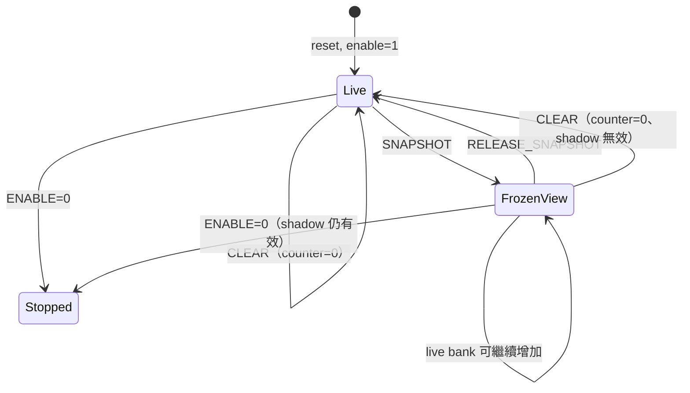

# Performance Counter MMIO ABI

PERF counter bank 是 software ABI，base 固定為 `0x4000_0100`、ABI version 為 1、共有 24 個 64-bit counter。RTL 實作位於 [`icache_pipeline_top.v`](../../icache_pipeline_top.v) 的 `mmio_performance_counters`；軟體 header 與 helper 為 [`OS/rtos/src/perf_counters.h`](../../OS/rtos/src/perf_counters.h) 與 [`perf_counters.c`](../../OS/rtos/src/perf_counters.c)。先理解完整資料流可讀 [PERFORMANCE_MONITORING_ARCHITECTURE.md](PERFORMANCE_MONITORING_ARCHITECTURE.md)，MMIO transport規則請參考 [MMIO](MMIO.md)。

## ABI discovery 與 register map

所有 register 為 32-bit little-endian word，PERF 請求在 accepted 後以**下一個 core clock 的 registered response**回覆。讀取未定義 word 或寫入非 CONTROL word 都回 error。

| 位址 | 名稱 | R/W | 定義 |
|---:|---|---|---|
| `0x4000_0100` | ID | R | `0x5045_5246`，ASCII `"PERF"` |
| `0x4000_0104` | INFO | R | `[31:16]` ABI version=`1`；`[15:8]=0`；`[7:0]` counter count=`24` |
| `0x4000_0108` | CONTROL | R/W | R: bit0 enable；W: 控制 bit，須 `wstrb[0]=1` |
| `0x4000_010C` | STATUS | R | `[31:16]` version=`1`，`[15:8]=0`，`[7:3]=0`，bit2 overflow、bit1 snapshot valid、bit0 enable |
| `0x4000_0110..0x4000_01CC` | COUNTER[0..23] | R | 24 組 low/high 64-bit counter |

counter `n` 的位址公式為：

```text
LOW(n)  = 0x4000_0110 + 8*n
HIGH(n) = 0x4000_0114 + 8*n,  n = 0..23
```

故最後一組 `COUNTER[23]` 是 low=`0x4000_01C8`、high=`0x4000_01CC`。`0x4000_01D0..0x4000_01FF` 雖屬 PERF page，仍是 invalid 並回 error。

## CONTROL、snapshot、clear、release 與 reset

CONTROL write 僅允許寫 `0x4000_0108` 且 `wstrb[0]=1`；即使資料放在其他 byte lane 也會回 error。讀取 CONTROL 只回 bit0。

| bit | 名稱 | 寫入效果 |
|---:|---|---|
| 0 | `ENABLE` | 設定後續計數是否遞增；reset 後為 1 |
| 1 | `CLEAR` | 清零所有 live counter、清 overflow sticky、使 snapshot 無效 |
| 2 | `SNAPSHOT` | 同一個 clock edge 將全部 24 個 live counter 複製至 shadow bank，並置 snapshot valid |
| 3 | `RELEASE_SNAPSHOT` | 清 snapshot valid，之後 counter read 改讀 live bank |

clear 同時帶有 enable bit 時，counter 仍被清零而 enable 取 bit0；例如 `0x3` 是「清零後開始」，`0x2` 是「清零並停止」。snapshot 可在 enable=1 時執行，live counter 在 shadow 固定期間仍可繼續計數。當 clear 與 snapshot/release 同時出現時，clear 分支優先，snapshot 失效。



snapshot 是讀取 64-bit 值的推薦方式，因為 low/high 兩次 load 可跨 clock；shadow bank 保證兩半出自同一次複製，不會 torn read。若 snapshot invalid，low/high 直接讀 live bank，軟體必須自行處理 rollover 風險。

任何 counter 由 `0xFFFF_FFFF_FFFF_FFFF` 再收到事件會 modulo-2^64 回繞；STATUS bit2 是所有 24 個 per-counter overflow sticky flag 的 OR。它在 reset 與 CLEAR 時清除，不能用寫 STATUS 清除。

## 24 個事件與每個 counter 位址

`perf_events_w[n]`直接接到`event_i[n]`，並對應`live_count_q[n]`與軟體`PerfCounterIndex_t`的同一index。這個index順序是hardware/software ABI的一部分；若改變bit語意或順序，必須同步修改header、測試與ABI version。

表中的「accepted」或「handshake」代表`valid && ready`同拍成立。這可避免request在back-pressure期間保持`valid=1`時被重複計數。`perf_ex_accept_w = ex_valid && !stall_ex`則避免同一條停在EX的instruction於multi-cycle stall期間重複計數。

| n | LOW / HIGH | header enum | `perf_events_w[n]`的精確條件與意義 |
|---:|---|---|---|
| 0 | `0110 / 0114` | `PERF_CYCLES` | `1'b1`；enable期間每個core clock加1 |
| 1 | `0118 / 011C` | `PERF_INST_RETIRED` | `wb_valid`；一條instruction在WB退休 |
| 2 | `0120 / 0124` | `PERF_FRONTEND_STALL_CYCLES` | `stall_if`；前端hold一拍加1 |
| 3 | `0128 / 012C` | `PERF_BACKEND_STALL_CYCLES` | `mem_stall`；MEM等待一拍加1 |
| 4 | `0130 / 0134` | `PERF_LOAD_USE_HAZARD_CYCLES` | `id_valid && ex_valid && ex_mem_read && ex_rd!=0 && (id_rs1==ex_rd || id_rs2==ex_rd)` |
| 5 | `0138 / 013C` | `PERF_EX_BUSY_CYCLES` | `ex_stall_o`；multi-cycle EX busy一拍加1 |
| 6 | `0140 / 0144` | `PERF_BRANCHES` | `perf_ex_accept_w && ex_branch` |
| 7 | `0148 / 014C` | `PERF_BRANCH_TAKEN` | `perf_ex_accept_w && ex_branch && ex_br_taken` |
| 8 | `0150 / 0154` | `PERF_JUMPS` | `perf_ex_accept_w && (ex_jal || ex_jalr)` |
| 9 | `0158 / 015C` | `PERF_CONTROL_MISPREDICTS` | `redirect_valid`；direction或target recovery |
| 10 | `0160 / 0164` | `PERF_LOADS` | `perf_ex_accept_w && ex_mem_read` |
| 11 | `0168 / 016C` | `PERF_STORES` | `perf_ex_accept_w && ex_mem_write` |
| 12 | `0170 / 0174` | `PERF_ICACHE_ACCESSES` | `fetch_req_valid && fetch_req_ready && !fetch_req_kill` |
| 13 | `0178 / 017C` | `PERF_ICACHE_MISSES` | I-side `l2_req_valid && l2_req_ready && cmd==LINE_FILL` |
| 14 | `0180 / 0184` | `PERF_DCACHE_ACCESSES` | `dcache_cpu_req_valid && dcache_cpu_req_ready` |
| 15 | `0188 / 018C` | `PERF_DCACHE_MISSES` | D-side request handshake且cmd為**`LINE_RD`或`UC_WR`** |
| 16 | `0190 / 0194` | `PERF_DCACHE_WRITEBACK_BEATS` | D-side request handshake且cmd為`WB_LINE`；每個64-bit beat各加1 |
| 17 | `0198 / 019C` | `PERF_MMIO_READS` | `uart_mmio_rsp_valid && !dmem_we_o && !uart_mmio_rsp_err` |
| 18 | `01A0 / 01A4` | `PERF_MMIO_WRITES` | `uart_mmio_rsp_valid && dmem_we_o && !uart_mmio_rsp_err` |
| 19 | `01A8 / 01AC` | `PERF_DDR_READ_COMMANDS` | L2-owned MIG `app_en && app_rdy && app_cmd==READ` |
| 20 | `01B0 / 01B4` | `PERF_DDR_WRITE_COMMANDS` | L2-owned MIG `app_en && app_rdy && app_cmd==WRITE` |
| 21 | `01B8 / 01BC` | `PERF_EXCEPTIONS` | `sync_trap_valid`；同步Exception被接受 |
| 22 | `01C0 / 01C4` | `PERF_INTERRUPTS` | `irq_take_effective`；CPU正式接受Interrupt |
| 23 | `01C8 / 01CC` | `PERF_PIPELINE_FLUSHES` | `redirect_valid || sys_flush_now`；control recovery或system flush |

位址欄省略共同前綴 `0x4000_`。特別注意 counter 15 不只是 cache refill：它的 RTL 條件是 D-side request handshake 且 command 為 `LINE_RD` **或** `UC_WR`。counter 17/18 只在 `uart_mmio_rsp_valid && !rsp_err` 時計數，也就是成功的完整 `0x4000_0000..0x4000_FFFF` local response；因此**包含 PERF bank 自己的成功讀／寫**，但 VGA window 不是 `uart_mmio_rsp_valid`，所以**不包含 VGA**。錯誤 MMIO access 不計入 17/18。

### Event bit的三個讀法規則

1. `0,2,3,4,5`是level／cycle型；條件連續為1共N拍，counter增加N。
2. 其他bit是commit、accept或handshake型；通常一次event增加1。Transaction若只有`valid=1`但`ready=0`尚未被接受，不計數。
3. 多個bit可在同一拍各自加1；bit 23內部則是OR，所以`redirect_valid`與`sys_flush_now`同拍成立仍只增加1。

Event bus只負責通知「當拍是否成立」，累積值保存在64-bit `live_count_q`。Event造成的硬體`+1`不產生RISC-V instruction；只有軟體透過CONTROL或COUNTER MMIO存取時才會執行`LW/SW`並經過CPU MEM stage與local decoder。

## 軟體範例

現有 FreeRTOS helper 已封裝 discovery 與 snapshot：

```c
#include "perf_counters.h"

PerfCounterSnapshot_t s;

if (perf_counters_available()) {
    perf_counters_reset_start();       /* CONTROL = ENABLE | CLEAR */
    /* 執行待測工作負載 */
    if (perf_counters_snapshot(&s, 1)) { /* 停止並取得 atomic shadow */
        uint64_t cycles = s.value[PERF_CYCLES];
        uint64_t instret = s.value[PERF_INST_RETIRED];
        uint32_t overflow = (s.status >> 2) & 1u;
    }
}
```

若要在量測進行中讀取，呼叫 `perf_counters_snapshot(&s, 0)`：helper 保留原 enable 狀態、觸發 snapshot、讀完整 shadow bank，再送 release command。請先驗證 ID、version 與 count；不要假定未來版本仍有相同 event index。

## 驗證與常見問題

[`performance_counters_tb.v`](../../performance_counters_tb.v) 驗證 ID/INFO、CONTROL 必須 lane0、clear、enable、64-bit shadow 一致性、release 後 live 值持續增加、overflow sticky，以及超界 word error。[`uart_mmio_tb.v`](../../uart_mmio_tb.v) 則透過完整 CPU MMIO path 驗證 discovery、clear/start、stop+snapshot 與 stable shadow read。

```powershell
make perf-counter-tb
make uart-mmio-tb
```

**為何讀 PERF 令 MMIO read counter 增加？** 成功 PERF read 本身就是成功 `0x4000` response；這是設計刻意保留的可觀測行為。若要排除量測開銷，於工作負載前 reset/start，並在解讀結果時考慮最後的控制與讀取交易。

**為何 STATUS 有 version？** STATUS 的 `[31:16]` 與 INFO 一樣提供 version，讓只讀狀態的診斷路徑也能辨識 ABI；正式 availability 檢查仍應依 helper 驗證 ID、INFO version 與 count。
