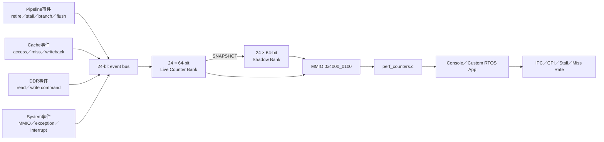
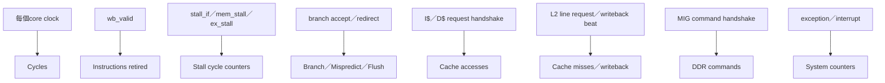
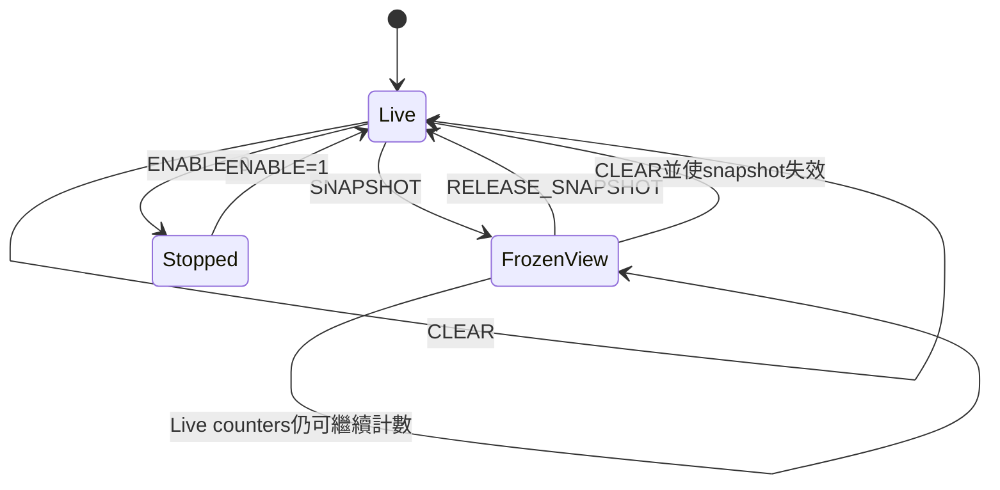
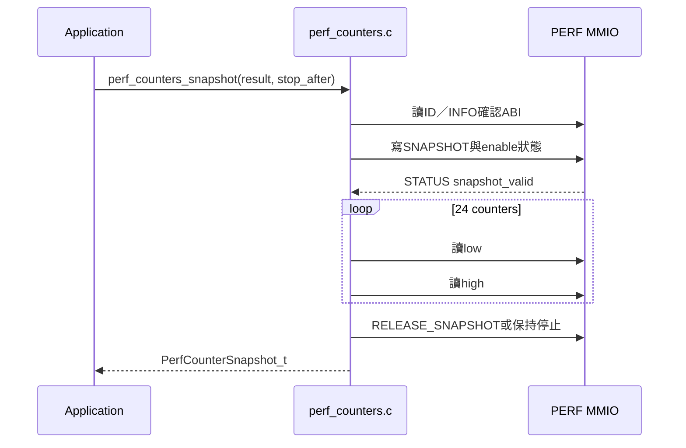
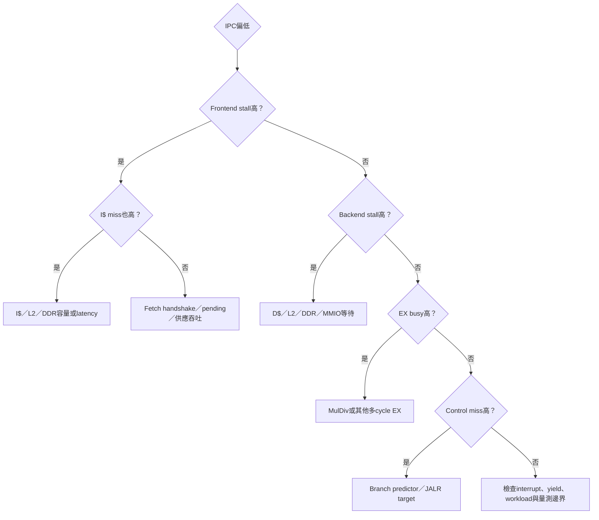

# 效能監測架構與分析原理

> 本頁解釋本專案如何從CPU／Cache／DDR的RTL事件，經過24組硬體counter、MMIO與FreeRTOS helper，最後在Console計算IPC、stall與miss rate。精確register位址另見 [PERFORMANCE_COUNTER_REGISTERS.md](PERFORMANCE_COUNTER_REGISTERS.md)。

## 1. 為什麼不能只看程式「感覺快不快」

同一段程式執行很慢，可能來自完全不同的原因：

- 前端無法持續供應指令；
- branch prediction錯誤造成flush；
- load-use hazard；
- MulDiv多cycle busy；
- I-Cache或D-Cache miss；
- L2／DDR latency；
- RTOS tick、yield或interrupt；
- UART與MMIO輸出本身的成本。

只量總時間無法分辨原因。因此硬體在關鍵handshake與pipeline狀態上產生event pulse，由counter累積「發生幾次」或「持續幾個cycle」。

## 2. 端到端架構



對應檔案：

| 層級 | 實作 |
|---|---|
| Event定義與counter RTL | [`icache_pipeline_top.v`](../../icache_pipeline_top.v) 的 `perf_events_w`、`mmio_performance_counters` |
| 軟體ABI header | [`perf_counters.h`](../../OS/rtos/src/perf_counters.h) |
| MMIO讀取與snapshot helper | [`perf_counters.c`](../../OS/rtos/src/perf_counters.c) |
| Console計算與命令 | [`main_console.c`](../../OS/rtos/src/main_console.c) |
| RTL驗證 | [`performance_counters_tb.v`](../../performance_counters_tb.v)、[`uart_mmio_tb.v`](../../uart_mmio_tb.v) |

## 3. Event是如何產生的

硬體counter不是猜測軟體正在做什麼，而是直接觀察RTL訊號。

### `perf_events_w`是什麼

[`icache_pipeline_top.v`](../../icache_pipeline_top.v) 宣告：

```verilog
wire [23:0] perf_events_w;
```

這是一條24-bit的**當拍事件匯流排**，不是保存計數值的memory，也不是要送進CPU執行的instruction。`perf_events_w[i]=1`只表示「第`i`種事件在目前這個core clock成立」；它直接接到counter模組的`event_i`。Counter啟用時，clock edge對每個成立的bit各自執行：

```verilog
if (event_i[i])
    live_count_q[i] <= live_count_q[i] + 64'd1;
```

這個`+1`由該counter自己的64-bit硬體incrementer與flip-flop完成，不會產生RISC-V `STORE`，也不經IF／ID／EX／MEM／WB、D$或local MMIO decoder。只有軟體執行clear、enable、snapshot或讀取counter時，才會真的產生`LW/SW`並走CPU的MMIO路徑。

```text
正常量測：
pipeline/cache/L2 signal → perf_events_w bit → live counter硬體+1

軟體存取：
perf_counters.c → RISC-V LW/SW → MEM → local decoder → PERF MMIO register
```

多個bit可以同一拍同時為1。例如一拍內可能有一條較老instruction在WB退休、另一條branch在EX被接受，而且前端正在stall：

```text
bit 0 cycles          = 1
bit 1 instret         = 1
bit 2 frontend stall  = 1
bit 6 branch          = 1
bit 7 branch taken    = 1
```

該clock edge五個對應counter都各加1。這些bit不一定描述同一條instruction；五級pipeline同一拍本來就同時包含不同年齡的instruction。



### Pulse event與level event

| 類型 | 範例 | Counter意義 |
|---|---|---|
| 每cycle level | `stall_if=1` | 每持續一個cycle加1，因此代表stall cycles |
| Handshake pulse | request `valid && ready` | 一筆transaction只在真正接受時加1 |
| Commit pulse | `wb_valid` | 一條有效指令到達WB時加1 |
| Control pulse | `redirect_valid` | 一次控制流recovery加1 |

如果只看`valid`而不看`ready`，back-pressure期間可能把同一筆request重複計數；因此transaction類event必須使用accepted handshake。

目前bit可先分成兩類：

| 類型 | Bit | 解讀方式 |
|---|---|---|
| Level／cycle型 | `0, 2, 3, 4, 5` | 條件連續維持N拍就增加N，測的是cycle數 |
| Commit／accept／handshake型 | `1, 6..23` | 通常在一個event被接受時成立一拍，測的是事件或transaction數 |

精確的24-bit mapping與MMIO位址見[PERFORMANCE_COUNTER_REGISTERS.md](PERFORMANCE_COUNTER_REGISTERS.md#24-個事件與每個-counter-位址)。幾個不能只看Counter名稱推測的例外是：

- bit 4計算目前RTL的ID對EX load-use比對條件，不是軟體反推的hazard；
- bit 13在I-side line-fill request被L2接受時計一次，並非tag compare當拍直接計數；
- bit 15同時包含D-side `LINE_RD`與no-write-allocate `UC_WR`；
- bit 16計算64-bit writeback **beat**，一條正常64-byte dirty line通常貢獻8；
- bit 17/18涵蓋成功的整個`0x4000_xxxx` local MMIO response，包括PERF自己，但不含`0x5000_xxxx` VGA；
- bit 19/20計算L2擁有的MIG command handshake，不含bootloader與上電memtest；
- bit 23是`redirect_valid | sys_flush_now`，同拍兩者都成立仍只加1，也不是「被flush掉幾條instruction」。

## 4. 24組counter的功能分群

完整index與位址見ABI文件。理解瓶頸時先依群組閱讀：

| 群組 | Counter | 用途 |
|---|---|---|
| 基準 | cycles、instructions retired | 計算IPC與CPI |
| Pipeline | frontend stall、backend stall、load-use、EX busy | 判斷CPU在哪一類等待 |
| Control flow | branches、taken、jumps、mispredicts、flushes | 分析branch與redirect成本 |
| Instruction memory | I$ accesses、I$ misses | 分析取指需求與line fill |
| Data memory | D$ accesses、D$ misses、writeback beats | 分析load/store working set與dirty eviction |
| Device／Memory | MMIO read/write、DDR read/write commands | 分析周邊與外部記憶體流量 |
| System | exceptions、interrupts | 分析yield、tick與trap活動 |

## 5. Live bank與Shadow bank

每個counter是64-bit，但RV32 CPU一次load只有32-bit。若直接先讀low再讀high，剛好在兩次load之間進位：

```text
第一次讀 low  = 0xFFFF_FFFE
counter進位    = 0x0000_0001_0000_0002
第二次讀 high = 0x0000_0001
組合結果       = 0x0000_0001_FFFF_FFFE  ← 並非任何時刻的真實值
```

這稱為torn read。Snapshot在同一個clock edge把24組live counter全部複製到shadow bank：



軟體在shadow有效期間讀取low/high，兩半一定屬於同一個snapshot。

## 6. 為什麼MMIO response要註冊一拍

24組counter包含live與shadow共48個64-bit值。若把大型read mux直接接進CPU combinational response，可能拉長MEM stage的timing path。

本設計在MMIO request accepted後，下一個core clock才回傳registered response：

```text
Cycle N   ：CPU提出PERF MMIO read，request被接受
Cycle N+1 ：counter bank回傳註冊後資料
```

CPU的MEM stage會等待response，因此software不需要知道多一拍；硬體則得到清楚的timing boundary。

## 7. Software helper做了什麼



Application不應自行硬編event數量，應先驗證：

- ID是ASCII `PERF`；
- ABI version符合；
- counter count至少涵蓋目前header定義。

## 8. Console如何使用

| 命令 | 動作 |
|---|---|
| `perf reset` | 清零並開始計數 |
| `perf start` | 不清零，繼續計數 |
| `perf stop` | 停止、snapshot並顯示摘要 |
| `perf`／`perf show` | 保持live運行，暫時snapshot並顯示摘要 |
| `perf raw` | 顯示24組原始值 |
| `perf test n` | 清零、執行受控workload、停止並分析 |

```powershell
.\tools\run_rtos_app.ps1 -Port COM5 -App console
```

看到 `APP_READY` 後：

```text
perf test 100000
```

## 9. 從原始counter計算指標

### IPC與CPI

```text
IPC = retired instructions / cycles
CPI = cycles / retired instructions
```

單發射in-order CPU理想IPC上限約為1，但實際值會受到pipeline fill、stall、interrupt與memory latency影響。

### Stall ratio

```text
frontend stall ratio = frontend stall cycles / cycles
backend stall ratio  = backend stall cycles / cycles
EX busy ratio        = EX busy cycles / cycles
```

這些stall條件可能在同一cycle重疊，不能把比例直接相加後宣稱等於100%。

### Control-flow miss rate

```text
control miss rate = mispredicts / (branches + jumps)
```

目前mispredict counter也包含JALR target recovery，不能完全視為PHT conditional branch錯誤率。

### Cache miss rate

```text
I$ miss rate = I$ line-fill requests / I$ accepted fetch requests
D$ miss rate = D$ miss transactions / D$ accepted requests
```

D$ miss counter目前包含`LINE_RD`以及no-write-allocate `UC_WR`條件，解讀時要遵守ABI的精確event定義。

### DDR intensity

```text
DDR commands per 1,000 instructions
= (DDR read + DDR write commands) × 1000 / instret
```

Bootloader與上電memtest在core reset期間執行，刻意不納入runtime DDR counter。

### 完整數字判讀範例

假設一次受控 workload 的 snapshot 是：

```text
cycles                 = 200000
retired instructions   = 100000
frontend stall cycles  = 80000
backend stall cycles   = 5000
I$ accepted fetches    = 120000
I$ line-fill requests  = 200
control-flow misses    = 100
branches + jumps       = 10000
```

可以算出：

```text
IPC                  = 100000 / 200000 = 0.50
CPI                  = 200000 / 100000 = 2.00
frontend stall ratio = 80000 / 200000  = 40%
backend stall ratio  = 5000 / 200000   = 2.5%
I$ miss rate         = 200 / 120000    ≈ 0.17%
control miss rate    = 100 / 10000     = 1%
```

第一眼可看到 IPC 偏低且 frontend stall 很高，但 I$ miss rate 很低。這組數據比較支持「前端 handshake、single-outstanding fetch 或 response supply 吞吐」值得優先檢查，而不是直接把問題歸咎於 I$ 容量不足。Backend stall 與 control miss 相對較低，也暫時不是第一嫌疑。

這仍是定位方向，不是單靠比例就完成因果證明。下一步應用受控 workload 或 RTL waveform 比較 `if_pending`、request/response handshake 與 I$ miss；也要注意不同 stall counter 可能在同一 cycle 重疊。

## 10. 如何從數據定位瓶頸



重要原則：兩個counter同時很高只代表相關，需要用受控workload、simulation與交叉等式確認因果。

## 11. 量測本身的影響

效能監測不是完全零成本：

- 每個64-bit live與shadow counter消耗FPGA flip-flop／routing；
- MMIO control與讀取會增加MMIO read/write counter；
- `perf raw`的大量UART輸出會占用Task與UART時間；
- RTOS tick與Console Task屬於被測環境的一部分；
- 第一次與第二次workload可能是cold／warm cache，不能混在一起比較。

建議把待測區間包在reset/start與stop/snapshot之間，先停止計數再輸出大量文字。

## 12. 目前實板基準結論

2026-07-15的 `perf test 100000` 基準顯示：

| 指標 | 結果 |
|---|---:|
| IPC | 約0.187 |
| CPI | 約5.335 |
| Front-end stall | 約77.6% |
| Backend stall | 約4.3% |
| Control-flow miss rate | 約0.787% |
| I$ miss | 5 / 1,088,998 |
| D$ miss | 0 / 49,975 |

Frontend stall很高，但I$ miss極低，表示主要問題不是DDR或Cache容量，而是blocking fetch request／response與`if_pending`使hit path仍無法每cycle穩定供應一條指令。

完整原始結果、交叉一致性與限制見 [PERFORMANCE_BASELINE_ANALYSIS.md](../06-verification/PERFORMANCE_BASELINE_ANALYSIS.md)。

## 13. 如何驗證Counter沒有算錯

Counter驗證分三層：

1. `performance_counters_tb.v`：clear、enable、snapshot、overflow、invalid address；
2. `uart_mmio_tb.v`：CPU MMIO request／response整合；
3. 實板交叉等式：load/store、MMIO、flush、yield與interrupt能否閉合。

```powershell
make perf-counter-tb
make uart-mmio-tb
```

只有單一counter「看起來會增加」不夠；必須測試不該增加的條件、back-pressure、clear後第一cycle與64-bit overflow。

## 14. 與未來Superscalar CPU比較

要讓新舊CPU比較公平：

- 保留相同counter index與事件語意；
- 使用相同software image或等價build；
- 使用相同workload與輸入；
- 同時報告clock frequency與cycle count；
- 分開記錄cold-cache與warm-cache；
- 若event語意改變，提升ABI version；
- Superscalar的instret必須能在同cycle增加0、1或多條，而不是把valid簡化成1-bit。

只增加issue width、但不解除目前fetch吞吐瓶頸，IPC不會按照寬度成比例提高。

## 15. 延伸閱讀

- [PERFORMANCE_COUNTER_REGISTERS.md](PERFORMANCE_COUNTER_REGISTERS.md)：精確register map與24個event。
- [PERFORMANCE_BASELINE_ANALYSIS.md](../06-verification/PERFORMANCE_BASELINE_ANALYSIS.md)：實板數據與推論。
- [PIPELINE.md](../01-architecture/PIPELINE.md)：stall與retirement訊號。
- [ICACHE.md](ICACHE.md)、[DCACHE.md](DCACHE.md)、[L2_CACHE_DDR2.md](L2_CACHE_DDR2.md)：Cache與DDR event來源。
- [CONSOLE_APP.md](../05-applications/CONSOLE_APP.md)：`perf`命令實作與使用。
