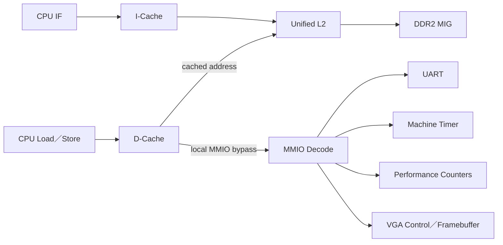

# 02 — Memory 與 I/O 導覽

> 這個資料夾回答「CPU 的取指、load/store 最後去了哪裡」，並把 Cache、DDR2、MMIO、UART、VGA 與效能計數器放回同一張地址與資料流圖中。

## 兩條主要存取路徑

先用 [MEMORY_MAP.md](MEMORY_MAP.md) 判斷某個地址屬於 DDR 還是 MMIO，再進入對應裝置文件。

## 文件分層

| 層級 | 文件 | 核心問題 |
|---|---|---|
| 地址入口 | [MEMORY_MAP.md](MEMORY_MAP.md) | 每個 address range 是什麼？ |
| 存取規則 | [MMIO.md](MMIO.md) | MMIO 的大小、byte lane、錯誤與 C 用法？ |
| L1 | [ICACHE.md](ICACHE.md)、[DCACHE.md](DCACHE.md) | hit、miss、refill、writeback 如何進行？ |
| 共享層 | [L2_CACHE_DDR2.md](L2_CACHE_DDR2.md) | I/D 如何仲裁並轉成 MIG transaction？ |
| 周邊 | [UART.md](UART.md)、[VGA.md](VGA.md) | 如何輸入輸出與顯示？ |
| 量測原理 | [PERFORMANCE_MONITORING_ARCHITECTURE.md](PERFORMANCE_MONITORING_ARCHITECTURE.md) | RTL事件如何一路變成IPC、stall與miss rate？ |
| 量測ABI | [PERFORMANCE_COUNTER_REGISTERS.md](PERFORMANCE_COUNTER_REGISTERS.md) | 如何snapshot，以及每個register／event的精確定義？ |
| 深入規格 | [I-Cache](<../../spec/i_cache_spec(完整版).md>)、[D-Cache](<../../spec/d_cache_spec(完整版).md>)、[L2 Cache](<../../spec/L2_cache_spec(完整版).md>) | 查閱原始完整設計規格；現行行為仍以RTL與本資料夾文件為準。 |

## 依症狀查文件

| 症狀 | 先看 | 接著看 |
|---|---|---|
| CPU 取不到指令 | `ICACHE` | `L2_CACHE_DDR2`、`MEMORY_MAP` |
| Load/store 值錯誤 | `DCACHE` | `MMIO` 或 `L2_CACHE_DDR2` |
| UART 漏字／overrun | `UART` | `MMIO`、FreeRTOS `TASK_QUEUE` |
| VGA 有 marker 但沒畫面 | `VGA` | `CLOCK_RESET`、實板驗證 |
| DDR 偶發停住 | `L2_CACHE_DDR2` | `CLOCK_RESET`、Cache tests |
| 想找效能瓶頸 | `PERFORMANCE_MONITORING_ARCHITECTURE` | `PERFORMANCE_BASELINE_ANALYSIS`與對應Cache文件 |

上下游：[CPU 架構](../01-architecture/README.md) · [Build／Boot](../03-build-boot/README.md) · [驗證](../06-verification/README.md)
