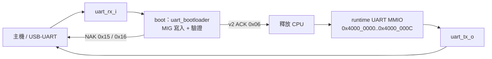

# UART：開機載入與執行期 MMIO

本專案的 UART 不是單一一成不變的周邊。在 CPU 尚未獲釋前，`uart_bootloader` 直接使用 UART 與 MIG DDR2 介面載入映像；映像被驗證並啟動後，UART 腳位改由 CPU 的執行期 MMIO UART 擁有。兩個模式共用板上 USB-UART 的 `uart_rx_i` / `uart_tx_o`，但協定、緩衝與錯誤處理都不同。

相關實作：[`uart_bootloader.v`](../../uart_bootloader.v)、[`icache_pipeline_top.v`](../../icache_pipeline_top.v)、[`uart_send_mem.py`](../../uart_send_mem.py)、[`OS/rtos/src/uart.c`](../../OS/rtos/src/uart.c)；板級預設 top 的時鐘與參數在 [`board_top.v`](../../board_top.v)。



## 模式切換與時鐘

`icache_pipeline_top` 在 `boot_done_int=0` 時將輸出腳接到 loader 的回覆傳送器；通過載入後，才接到 CPU 的 `uart_tx`。因此，上傳期間不應把從 PC 送出的普通文字視為執行期 console 的輸入。反過來說，程式已啟動時 UART 是 runtime MMIO 的通道，除非資料剛好含有 loader 保留的同步序列。

`uart_rx` 與 `uart_tx` 都是 8N1、LSB-first，分頻以整數 `CLK_HZ / BAUD` 計算。`board_top.v` / `board_top_vga.v` 預設把 `UART_BAUD` 設為 115200，`UART_CLK_HZ` 設為 50 MHz；這是為目前 MIG 路徑實際運作的 `ui_clk` 所作的板上設定，而不是「板載振盪器必然是 50 MHz」的宣告。變更 MIG 或核心時鐘時，必須一起檢查此參數與 baud 誤差，否則接收取樣與傳送位元時間都會錯。

loader 另外可同時觀察正相／反相及不同速率候選接收器，以同步字決定接收選擇；這是 bring-up 容錯，主機仍應依 `--baud` 使用正常 115200 設定。其接收 FIFO 深度為 64 bytes，而非可無限制吸收主機 burst。

## Bootloader 二進位協定

所有多位元欄位與映像 `.mem` 還原出的 payload 均為 little-endian。載入位置是 `BOOT_ADDR`（預設 `0x8000_0000`），長度上限由 RTL 防護為 8 MiB。資料會先累積成 16-byte MIG 寫入 beat；最後未滿一個 beat 的 byte mask 只寫入有效資料。

| 版本 | 同步字（32-bit 值） | 線上位元組序 | Header | 接受條件 | 相容性 |
|---|---:|---|---|---|---|
| v1 | `0xC0DE5A5A` | `5A 5A DE C0` | sync、`uint32_le length` | DDR readback CRC 檢查通過後啟動；沒有 header CRC/回覆 ACK | 保留給舊工具 |
| v2 | `0xC0DE5A5B` | `5B 5A DE C0` | sync、`uint32_le length`、`uint32_le CRC32` | UART payload CRC 與完整 DDR readback CRC 均通過 | 現行預設 |

v2 CRC 是 Python `zlib.crc32()` / IEEE CRC-32 的結果。RTL 在接收 payload 時持續計算 CRC，資料全數寫完先比較 header 宣告的 CRC；接著逐 beat 從 DDR 讀回**整個** payload 再算一次 CRC。這避免「UART 收到正確、DDR 寫入或讀取出錯」以及「前 48 bytes 看似正確」就誤釋放 CPU 的情況。

```text
v2 wire byte stream

55 55 ... 55 | 5B 5A DE C0 | LL LL LL LL | CC CC CC CC | payload[0..L-1]
^ host leader     ^ sync       ^ length LE    ^ CRC32 LE
```

### `0x55` preamble 與 pacing 的意義

[`uart_send_mem.py`](../../uart_send_mem.py) 預設在 sync 前送 4096 個 `0x55`。`0x55` 的交替位元很適合讓 UART 線路持續活動，主要目的是留給板子完成 reset、MIG calibration 與接收器同步；loader 在 `S_SYNC` 只會滑動搜尋 sync，所以這些前導資料不屬於映像。

這個 preamble **不是** wire-level framing：協定沒有每 chunk 的 length、sequence number、escape 或 chunk CRC。`--chunk-size`（預設 32）和 `--chunk-delay`（預設 1 ms）只是主機端把 payload 分段寫入 OS serial buffer、flush 並暫停的節流策略，避免有限 FIFO / DDR service 延遲時塞爆資料。不要在 FPGA 端或另一套 host 工具把 chunk 邊界當成協定邊界；唯一有語意的邊界是 sync、header 與 payload length。

工具在送出 sync 的 4 bytes 後預設停 20 ms，送完其餘 header 後停 5 ms；這同樣是 host-side pacing。較慢或剛重設的板子可提高 `--preamble`、`--preamble-seconds`、`--sync-settle`、`--header-settle` 或 `--chunk-delay`，但不得切開或改變 header 的 little-endian 格式。

### 回覆、重試與重新武裝

v2 完成後 loader 從 `boot_uart_tx_o` 回傳一個控制 byte：

| byte | 名稱 | 意義 | 主機動作 |
|---:|---|---|---|
| `0x06` | ACK | UART payload CRC 與 DDR 全讀回 CRC 均成功；CPU 即將／已釋放 | 開始接收程式輸出或進入互動模式 |
| `0x15` | NAK | 接收的 payload CRC 不符合 v2 header | 從 preamble + 完整 frame 重送 |
| `0x16` | NAK | DDR 全映像讀回 CRC 不符合 | 從 preamble + 完整 frame 重送 |

`uart_send_mem.py` 對 v2 預設等待 ACK 2 秒，失敗最多重送 5 次；它會把這三個控制 byte 從早期文字輸出中濾出。v1 不具此回覆契約，工具只會送出後視為 legacy 模式完成，故新 bitstream 應使用 v2。

loader 可由兩種方式回到 sync 搜尋：

1. 執行中程式對 launcher reset MMIO `0x4000_0014` 寫入一個 low byte 的 bit 0=`1`，發出 rearm。`rearm_i` 使 loader 清除 `boot_done_o` 並回到初始搜尋狀態；`0x4000_0010` 讀到的是經同步／debounce 的實體 launcher button 狀態，不是 bootloader FSM 狀態。
2. 即使 CPU 卡死，`S_DONE` 仍持續看 UART；收到新的完整保留 sync word 會收回 UART/loader 所有權、撤銷 `boot_done_o`，重新接收影像。

第二項是恢復機制，但有一項限制：執行期正常文字或二進位資料若恰好包含四個保留同步 bytes，可能觸發重新載入。因此不要在 runtime 協定中隨意傳送這些保留序列。

### 上傳範例

```powershell
# 現行建議：v2、等待 ACK，完成後保留埠作互動 UART
python .\uart_send_mem.py --port COM7 --baud 115200 `
  --mem .\build_rtos\rtos_vga_queue_demo.mem --delay 3.0 `
  --preamble 4096 --protocol v2 --interactive

# 僅為舊 bitstream 相容；沒有 CRC header 與 ACK/NAK
python .\uart_send_mem.py --port COM7 --baud 115200 `
  --mem .\TEST_FILES\mem_uart_smoke.mem --protocol v1
```

## 執行期 UART MMIO

CPU 釋放後，runtime UART 與 bootloader frame 無關。位址和欄位由 `icache_pipeline_top.v` 實作：

| 位址 | 存取 | 欄位 | 行為 |
|---:|---|---|---|
| `0x4000_0000` | W | `[7:0]` TX data | 只接受至少一個 byte strobe 的寫入；TX busy 時 MMIO `ready` 會拉低，CPU 必須等待 |
| `0x4000_0004` | R | bit 0 `tx_ready` | `1` 表示 transmitter 非 busy，可寫下一個 byte |
| `0x4000_0008` | R | `[7:0]` RX data | 讀取會 pop 單一 RX holding register |
| `0x4000_000C` | R | bit 0 `rx_valid`、bit 1 `rx_overrun` | status read 同時清除 sticky `rx_overrun`；不會 pop data |

RX 硬體只有一個 byte holding register，沒有 FIFO：當 `rx_valid=1` 而下一個 byte 到來時，原本資料保留、新 byte 丟棄並設 `rx_overrun`。若一個 byte 到達的同時 CPU 讀取 RX data，RTL 可用這次 pop 騰出空間並接住新 byte。這讓低速互動足夠，但不適合由 polling 長時間接收高吞吐 binary stream。

TX 也只有一次傳送緩衝；`rtos_uart_putc()` 會輪詢 `tx_ready`，每個 `\n` 額外送 `\r`。雖然 CPU 的 MMIO read/write 對匯流排有 response，軟體不應假定寫入 data 後能立刻再寫，必須以 bit 0 為準。

### TX MMIO完成與實體傳送完成不是同一時間

對`0x4000_0000`的store會先在EX算出有效位址，再由MEM送出`dmem_addr/wdata/wstrb`。TOP decoder命中UART後直接選擇UART response，並阻止同一筆request進入D-cache。這個選擇訊號不是把UART「開機」，而是指出本次transaction由哪個已存在的RTL模組處理。

```text
UART busy
  → ready=0
  → MEM保持request與mem_stall

UART idle
  → 接受並鎖存TX byte
  → 啟動serial transmitter
  → 回覆MMIO store完成
  → MEM解除stall
  → store經MEM/WB到WB退休，但rd_wen=0
  → UART在背景繼續送出start/data/stop bits
```

因此MMIO response表示「字元已安全交給UART transmitter」，不是「TX pin已經送完整個字元」。以115200 baud、8N1為例，每個byte在線路上通常需要10 bits，約`86.8 us`，相當於50 MHz下約4340個core cycles。新的TX write仍會因busy而等待；若軟體必須確認最後字元已離開線路，例如觸發firmware reload之前，應呼叫`rtos_uart_wait_tx_idle()`。

### FreeRTOS Application 傳資料到電腦

嚴格來說，不是FreeRTOS kernel自行把資料送給電腦，而是某個Application Task呼叫UART driver；FreeRTOS只負責排程該Task。以`rtos_uart_write("Hello\n")`為例，driver會逐字元呼叫`rtos_uart_putc()`，並在`\n`前額外傳送`\r`，因此終端機收到的是`Hello\r\n`。

```text
Application Task
  → rtos_uart_write()：拆成一個個byte
  → rtos_uart_putc()：輪詢TX status
  → CPU以LW讀0x4000_0004，等待tx_ready=1
  → CPU以SW寫0x4000_0000
  → TOP local address decoder選擇UART，不進D$／L2／DDR
  → UART TX鎖存該byte，並把它轉成8N1 serial bits
  → FPGA uart_tx_o
  → 板載USB-UART
  → Windows COM port
  → terminal／Python顯示
```

例如傳送ASCII字元`A`（`0x41`）時，C的MMIO寫入概念上會形成：

```asm
li  t0, 0x40000000
li  t1, 0x41
sw  t1, 0(t0)
```

目前TX只有「正在傳送的一個byte」，沒有多byte硬體TX FIFO，也沒有256-byte FreeRTOS TX StreamBuffer。`rtos_uart_putc()`採用busy-wait polling：上一個byte尚未傳完時，呼叫它的Task會反覆讀取TX status；更高priority Task與interrupt仍可搶占，但這不是使用Queue／Semaphore等待的FreeRTOS blocking。115200 baud、8N1的理論有效上限約為`115200 / 10 = 11,520 bytes/s`，所以大量文字輸出本身就可能成為執行時間的一部分。

目前driver也沒有以Mutex保護「整串文字」。若兩個Task同時呼叫`rtos_uart_write()`，硬體仍會一次正確傳送一個byte，但兩個字串可能在字元邊界交錯，例如`HELLO`與`12345`可能組成`H1E2L3L4O5`。需要保證每則訊息完整時，可在Application外層加Mutex；需要非同步大量輸出時，則可加入TX StreamBuffer／Queue與專用TX Task或TX-complete interrupt。Mutex、shared resource、ownership與single-owner Task的完整初學者例子見 [TASK_QUEUE.md](../04-freertos/TASK_QUEUE.md) 第12節。

上板工具使用`-Monitor interactive`時會在上傳後繼續持有COM port，讀取上述runtime TX bytes並顯示；`-Monitor none`會關閉COM port，FPGA仍照常傳送，但必須由另一個terminal或Python工具開啟該COM port才看得到。完整操作與COM ownership見[BOARD_OPERATION_GUIDE.md](../00-overview/BOARD_OPERATION_GUIDE.md)。

## ISR、Interrupt 與 Trap 的關係

如果目標是學會Application要呼叫哪個API、`rtos_uart_getc()`如何被ISR喚醒，以及新增周邊時何時才要寫ISR，請先讀 [ISR_TASK_API_BOUNDARY.md](../04-freertos/ISR_TASK_API_BOUNDARY.md)；本節偏向UART硬體與register層。

ISR是**Interrupt Service Routine（中斷服務程式）**。UART RX ISR不是獨立的硬體，也不是持續掃描Buffer的背景Task；它是CPU在收到中斷後，經由RISC-V Trap入口呼叫的一段短小軟體函式。

RISC-V以Trap統稱Exception與Interrupt：Exception由目前指令同步造成，例如illegal instruction；Interrupt由外部時間事件非同步提出，例如machine timer或UART收到byte。runtime UART把`uart_rx_valid_q`接到machine external interrupt source。當`mstatus.MIE=1`、`mie.MEIE=1`且UART已有byte時，CPU會在可接受中斷的instruction boundary進入Trap handler，`mcause`為：

```text
mcause[31] = 1       → Interrupt
mcause code = 11     → Machine External Interrupt
完整32-bit值 = 0x8000_000B
```

Trap handler依`mcause`分派到UART處理路徑，再呼叫`rtos_uart_handle_external_interrupt()`。這個流程是「硬體以`rx_valid`主動通知CPU」，不是CPU依序比較字元內容。ISR只檢查RX status的`rx_valid/overrun`位元；不論收到`A=0x41`、`h=0x68`或`1=0x31`，只要`rx_valid=1`就讀取RX data。Polling模式才是軟體重複讀status，等待資料出現。Trap、`mcause`與enable條件的完整說明見[CSR_EXCEPTION_INTERRUPT.md](../01-architecture/CSR_EXCEPTION_INTERRUPT.md)。

```text
UART收完一個byte
  → uart_rx_data_q保存byte、uart_rx_valid_q=1
  → machine external interrupt pending
  → CPU進入共用Trap handler
  → handler讀mcause並辨識code 11
  → UART ISR讀status與RX data
  → 讀RX data同時pop硬體holding register
  → ISR把byte複製到FreeRTOS StreamBuffer
  → 若較高priority接收Task已就緒，ISR返回前要求scheduler切換
  → mret離開Trap
```

## FreeRTOS RX：IRQ 與 256-byte StreamBuffer

[`OS/rtos/src/uart.c`](../../OS/rtos/src/uart.c) 在 `rtos_uart_rx_interrupt_init()` 中建立靜態 256-byte `StreamBuffer`（trigger level 1），清除既有 RX data/overrun、清除 MEIP，並開啟 RISC-V machine external interrupt (`mie.MEIE`)。runtime UART 的 `rx_valid` 直接作為外部 IRQ source；ISR `rtos_uart_handle_external_interrupt()` 的處理順序是：

1. 讀 status，遞增 IRQ 統計；若 bit 1 為 1，遞增 hardware-overrun 統計。
2. 若 bit 0 為 1，讀 data pop holding register，使用 `xStreamBufferSendFromISR()` 放入 StreamBuffer。
3. 若 StreamBuffer 滿或尚未初始化，遞增 stream-drop 統計；清除 MEIP，回傳是否要喚醒較高優先權 task。

`rtos_uart_try_getc()` 與 `rtos_uart_getc()` 優先從 StreamBuffer 讀取（後者可等待指定 tick）；回報的 `overrun` 是自上次呼叫以來 hardware overrun 與 stream drop 計數是否增加。未初始化 IRQ/StreamBuffer 時則退回直接 polling MMIO。這個軟體 FIFO 顯著降低 task 排程造成的遺失機率，但不能修復 ISR 前 holding register 已丟掉的資料，也不是無限緩衝；大量連續輸入仍應加流控或改為有 FIFO/DMA 的設計。

### 兩層RX Buffer由誰讀寫

從軟體可觀察的接收資料路徑，可理解為兩個主要緩衝層。UART receiver內部另外還有用來組合start/data/stop bits的接收狀態與shift register，但完成byte後，真正暴露給CPU的是下表的1-byte holding register。

| 緩衝層 | 容量 | 誰寫入 | 誰取走 | 滿時結果 |
|---|---:|---|---|---|
| UART RX hardware holding register | 1 byte | UART RX RTL | CPU執行ISR並讀`0x4000_0008` | 保留舊byte、丟棄新byte、設`rx_overrun` |
| FreeRTOS RX StreamBuffer | 配置256 bytes，實際可排隊約255 bytes | ISR以`xStreamBufferSendFromISR()`複製 | Console／Lua等Application Task以`rtos_uart_getc()`取出 | 新byte無法放入、增加`rx_stream_drops` |

資料只沿以下方向移動：

```text
PC → UART RX hardware buffer → ISR → software StreamBuffer → Application Task
```

軟體RX Buffer不需要「送回硬體」才能取走；Application Task直接從RAM中的StreamBuffer讀取。換句話說：UART硬體寫第一層、ISR從第一層搬到第二層、Task再從第二層取走。這三個角色不能互換。

以收到`A`為例：

```text
1. UART收完0x41： hardware=[A]，software=[]
2. ISR讀RX_DATA： hardware=[]，ISR區域變數=A
3. ISR送StreamBuffer： hardware=[]，software=[A]
4. Console Task取出： hardware=[]，software=[]，Task得到A
```

硬體overrun表示ISR沒有及時清空第一層；stream drop表示ISR有執行，但Application Task沒有及時清空第二層。前者主要受interrupt latency影響，後者主要受Task消耗速度與software buffer容量影響。

### 具體例子：輸入 `h` 之後發生什麼

使用者在 Console interactive terminal 按下 `h` 時，這個字元不會直接變成一個 Task：

```text
PC 傳送 ASCII 0x68
        ↓
UART RTL 收完一個 8N1 frame，設定 rx_valid
        ↓
Machine external interrupt
        ↓
ISR 讀 RX data，硬體 holding register 被 pop
        ↓
xStreamBufferSendFromISR() 複製 0x68 到 256-byte StreamBuffer
        ↓
等待輸入的 RX Task 被喚醒，取走 0x68 並加入目前文字行
        ↓
直到使用者按 Enter，Console 才把完整一行交給 command Task
```

若 RX Task 一時沒有執行，只要 ISR 能及時把 bytes 搬進 StreamBuffer，256-byte ring storage 實際可暫存 255 bytes；這就是軟體 buffer 的作用。若中斷也來不及服務，第二個 byte 在硬體 `rx_valid=1` 時到達，會先發生 hardware overrun；若 ISR 有執行但 StreamBuffer 已滿，則是 stream drop。兩者是不同層級的資料遺失。

### RX與TX方向不可混用

```text
RX（電腦給板子）：
PC → 1-byte UART RX hardware buffer → ISR → 256-byte software StreamBuffer → Task

TX（板子給電腦）：
Task → polling TX status → MMIO寫入 → 1-byte UART transmitter → PC
```

因此RX的software StreamBuffer不會拿來做TX，也不會由UART硬體主動讀取。若未來要讓TX也具有軟體緩衝，必須另外建立TX Queue／StreamBuffer及其消費者，不能直接重用目前的RX StreamBuffer。

## 驗證範圍與限制

| 測試 | 已覆蓋行為 |
|---|---|
| [`uart_bootloader_tb.v`](../../uart_bootloader_tb.v) | v1/v2、有效 v2 ACK、UART payload CRC NAK、DDR readback NAK、rearm、在完成狀態以 host sync 恢復 |
| [`uart_bootloader_large_crc_tb.v`](../../uart_bootloader_large_crc_tb.v) | 較大 payload 的 v2 CRC / DDR 驗證路徑 |
| [`uart_bootloader_stall_tb.v`](../../uart_bootloader_stall_tb.v)、[`uart_bootloader_split_ready_tb.v`](../../uart_bootloader_split_ready_tb.v) | MIG command/write-data ready stall 與分離 ready 條件 |
| [`uart_mmio_tb.v`](../../uart_mmio_tb.v) | TX ready/busy、RX pop、單一 holding register overrun 與 status-read clear |

未保證的事項包括：UART RX 沒有 parity、break、硬體 flow control 或深度 FIFO；baud 分頻是整數；bootloader 的 1 秒狀態 timeout 會把不完整 header/data 退回 sync；並且 v1 的接受語意不應被誤當成 v2 的端到端傳輸確認。需要可靠大量資料時，使用 v2、保留 host pacing、確認 ACK，並在失敗後重送整個 frame。
