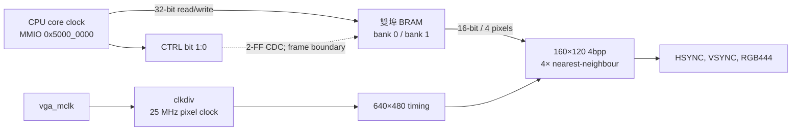
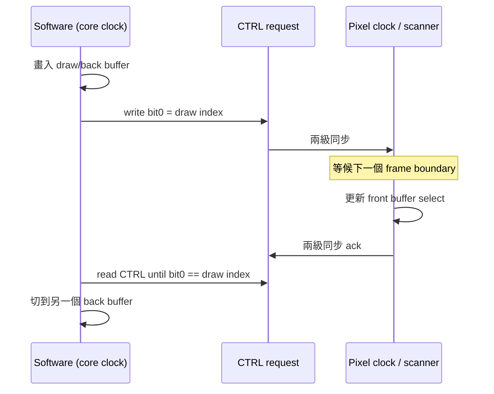

# VGA framebuffer 與雙緩衝

VGA 是可選擇的 MMIO 子系統，而不是目前標準板級 bitstream 的既有輸出。標準 Vivado 重建流程明確要求 project top 為 [`board_top.v`](../../board_top.v)，且此 top 沒有 VGA ports、`USE_VGA` 為預設關閉；因此由 `tools/build_board_bitstream.ps1` 產生的標準 `board_top_rtos_rearm.bit` **不會輸出 VGA**。要接螢幕必須改以 [`board_top_vga.v`](../../board_top_vga.v) 為 top、加入 [`xdc_for_vga.xdc`](../../xdc_for_vga.xdc) 及 MIG / clock-wizard 對應約束，並讓核心以 `USE_VGA=1` 建構。

相關實作：[`vga_subsystem.v`](../../vga_subsystem.v)、[`clkdiv.v`](../../clkdiv.v)、[`vga_initials.v`](../../vga_initials.v)、[`vga_640x480.v`](../../vga_640x480.v)、[`game/vga_fb.c`](../../game/vga_fb.c)。



## 顯示格式與記憶體配置

畫面資料是 160 × 120 的 indexed 4 bpp framebuffer。每個 nibble 是一個像素色號；顯示端把每個 source pixel 在水平、垂直各複製四次，剛好填入 640 × 480 有效畫面。VGA timing 是標準 800 × 525 total（含 sync 與 porch）和 640 × 480 visible，像素 clock 由 `vga_mclk` 經 `clkdiv` 得到 25 MHz。

| 項目 | 數值 | 推導／備註 |
|---|---:|---|
| 邏輯 framebuffer | 160 × 120 | 軟體座標範圍 `x=0..159`、`y=0..119` |
| 色彩 | 4 bpp（16 色） | nibble palette index，不是 RGB444 寫入值 |
| 每個 16-bit word | 4 pixels | 高 nibble 是最左 pixel，依序為 `[15:12]`、`[11:8]`、`[7:4]`、`[3:0]` |
| 每個 CPU 32-bit word | 8 pixels | BRAM 以兩個 16-bit bank 組成一個 CPU word |
| 每列 | 40 個 16-bit word = 80 bytes | `160 / 4` |
| 每 buffer 有效資料 | 9,600 bytes | `160 × 120 × 4 / 8` |
| buffer stride / 保留位址窗 | `0x4000` = 16,384 bytes | 有效資料後仍有未用空間，不能以有效大小作 bank base |
| 兩 buffer backing RAM | 8192 個 32-bit words | `2 × 0x4000 / 4`；參數 `FB_WORDS=8192` |

base 為 `0x5000_0000`。資料位址窗延伸到 `0x5000_7FFF`；不過 `0x5000_7FFC` 保留作控制暫存器，切勿將它當 framebuffer 最後一個 word。兩個 bank 的有效畫面分別起於 `0x5000_0000` 與 `0x5000_4000`。

```text
0x5000_0000  bank 0 有效畫面：9600 B（120 rows × 80 B）
              bank 0 未使用 padding，直到 bank 1 base 之前
0x5000_4000  bank 1 有效畫面：9600 B
              bank 1 未使用 padding
0x5000_7FFC  framebuffer CTRL（非 pixel memory）
```

像素 `x,y` 所在的 16-bit word index 是 `y * 40 + (x >> 2)`，等同目前 C 程式中的 `(y << 5) + (y << 3) + (x >> 2)`；要修改的 nibble shift 是 `(3 - (x & 3)) * 4`。做大量繪製應優先一次寫完整 16/32-bit packed word；逐像素 read-modify-write 可行，但會較慢，也會與顯示端同時讀 BRAM。

## 固定 palette 與訊號

色號會在 [`vga_initials.v`](../../vga_initials.v) 以固定 `case` 轉為 RGB444。這一版沒有 palette MMIO、palette RAM 或 runtime 可程式調色盤；「palette」就是下表硬編碼的 16 個輸出色。

| index | RGB444 | index | RGB444 |
|---:|---:|---:|---:|
| `0` | `0x112` | `8` | `0x243` |
| `1` | `0xC74` | `9` | `0x476` |
| `2` | `0x5B8` | `A` | `0x113` |
| `3` | `0x4A8` | `B` | `0xB98` |
| `4` | `0xDA6` | `C` | `0x445` |
| `5` | `0x6AA` | `D` | `0x286` |
| `6` | `0x4BC` | `E` | `0x9AB` |
| `7` | `0xEEE` | `F` | `0xFD6` |

### Framebuffer存的是色號，不是完整RGB

例如軟體呼叫：

```c
vga_fb_put_pixel(10, 20, 0xE);
```

Framebuffer只保存4-bit的`0xE`。顯示掃描到該pixel時，`vga_initials`才用固定`case`查表，把色號`E`轉成`RGB444=0x9AB`：

```text
framebuffer nibble 0xE
  → palette lookup
  → RGB444 0x9AB
  → red=0x9、green=0xA、blue=0xB
```

`RGB444`表示紅、綠、藍各4 bits，總共12 bits：

```text
0x9AB = RRRR GGGG BBBB
          9    A    B
```

每個channel可表示`0..15`的輸出強度，板上的電阻／DAC網路再把這些數位值轉成VGA類比電壓。固定palette讓每個pixel只占4 bits；若直接在framebuffer保存RGB444，同一張160×120畫面會從9,600 bytes增加到28,800 bytes。

一個16-bit framebuffer word包含4個色號。例如`0x1E70`不是一個16-bit顏色，而是由左至右四個pixel：

```text
0x1E70
  ├─ pixel 0：index 1 → RGB C74
  ├─ pixel 1：index E → RGB 9AB
  ├─ pixel 2：index 7 → RGB EEE
  └─ pixel 3：index 0 → RGB 112
```

「固定」代表Application可在執行期選`0..F`色號，卻不能更改某個色號對應的RGB。若要把index `E`從`0x9AB`改為純紅`0xF00`，目前必須修改`vga_initials.v`的RTL並重新產生bitstream；只重新編譯RTOS `.mem`不會改變palette。本版沒有palette MMIO、palette RAM或runtime調色盤API。

### RGB、HSYNC與VSYNC分工

VGA輸出不是只送RGB，螢幕還需要同步訊號知道「目前是哪個pixel、哪一列、哪一張frame」：

| 訊號 | 全名 | 作用 |
|---|---|---|
| `red_o[3:0]`、`green_o[3:0]`、`blue_o[3:0]` | RGB444 | 目前掃描位置的顏色強度 |
| `hsync_o` | Horizontal Sync | 標示一條水平掃描線的同步區段 |
| `vsync_o` | Vertical Sync | 標示一個完整frame的同步區段 |
| `vidon` | Video On（內部訊號） | 表示目前counter是否位於640×480可視區；區外強制輸出黑色 |

25 MHz pixel clock下，水平counter `hc`每拍加1，走完800個位置才換下一列。只有其中640個位置真的顯示RGB，其他是sync／porch：

| `hc`範圍 | 長度 | 意義 |
|---:|---:|---|
| `0..95` | 96 clocks | HSYNC為low |
| `96..143` | 48 clocks | horizontal back porch |
| `144..783` | 640 clocks | 可視RGB區域 |
| `784..799` | 16 clocks | horizontal front porch |

```text
一條line共800 pixel clocks

| HSYNC low | back porch |          visible 640          | front porch |
|     96    |     48     |   RGB依framebuffer輸出        |     16      |
```

垂直counter `vc`只在一整條水平線結束時加1，走完525 lines形成一個frame：

| `vc`範圍 | 長度 | 意義 |
|---:|---:|---|
| `0..1` | 2 lines | VSYNC為low |
| `2..34` | 33 lines | vertical back porch |
| `35..514` | 480 lines | 可視RGB區域 |
| `515..524` | 10 lines | vertical front porch |

```text
一個frame共525 lines

| VSYNC low | back porch |          visible 480          | front porch |
|      2    |     33     |   RGB依framebuffer輸出        |     10      |
```

所以更新率約為：

```text
25,000,000 / (800 × 525) ≈ 59.52 frames/s
```

Framebuffer本身只有160×120；renderer把每個邏輯pixel在水平與垂直各重複4次，因此一個pixel會成為螢幕上的4×4方塊，剛好得到640×480。畫面可視區外renderer輸出黑色。HSYNC／VSYNC由`vga_640x480`產生，`board_top_vga`將RGB444與sync ports對外。實際可顯示與否仍取決於使用正確top、XDC pin mapping、電阻／DAC網路及螢幕接受640×480@約60 Hz。

## MMIO 與雙緩衝協定

`vga_subsystem` 只在 `USE_VGA=1` 產生。CPU port 以 core clock 存取，顯示 port 以 25 MHz pixel clock 存取同一對 true dual-port BRAM。資料 read 是同步 BRAM read，會比 request 多一個 response 階段；位址窗外的 CPU 存取回應 error。

這裡的「協定」不是UART那種線上封包格式，而是CPU軟體與VGA硬體共同遵守的操作規則：CPU先畫不在顯示中的bank、寫CTRL提出切換request、等待pixel domain在frame boundary完成切換，再以ack確認舊front buffer已可安全重用。

| 位址 | 存取 | 欄位 | 說明 |
|---:|---|---|---|
| `0x5000_0000..0x5000_7FFB` | R/W | framebuffer data | byte strobe 有效；bank 由地址 stride 決定 |
| `0x5000_7FFC` | W | bit 0 `request` | 請求要顯示的 front buffer：`0` 或 `1` |
| `0x5000_7FFC` | R | bit 0 `ack`、bit 1 `request` | bit 0 是 pixel domain 實際顯示 bank 同步回 CPU 後的確認；bit 1 是 CPU 最近請求 |

CPU對上述地址使用普通`LW/SW`。Top-level local decoder命中VGA位址後，會把交易送入`vga_subsystem`，不進D$、L2或DDR。雙埠BRAM的兩個port分工如下：

```text
CPU core_clk ── Port A：32-bit read/write ──┐
                                            ├─ framebuffer BRAM bank 0 / bank 1
VGA clk25   ── Port B：16-bit display read ─┘
```

這表示CPU可以寫back buffer，同時VGA scanner從front buffer讀pixel；「雙埠」是同一份BRAM具有兩個硬體存取port，不是第三個framebuffer。

### Front buffer、Back buffer與tearing

- **Front buffer**：VGA目前正在逐列掃描並輸出的bank。
- **Back／draw buffer**：CPU用來繪製下一張完整畫面的bank。

假設只有一個buffer，而且VGA已經掃完畫面上半部時CPU開始改內容，這一個frame可能同時含有舊、新畫面：

```text
+--------------------+
| 舊畫面的上半部       |  VGA修改前已經掃出
+--------------------+
| 新畫面的下半部       |  CPU修改後才被掃出
+--------------------+
```

這稱為tearing（畫面撕裂）。雙緩衝讓VGA讀bank 0時CPU只畫bank 1；下一張完整畫好後才交換角色。注意雙緩衝只能在軟體遵守「不要寫front buffer」時避免內容撕裂，硬體不會禁止CPU寫入目前顯示中的bank。

`request` 和 `ack` 不能視為同一個瞬時位元：bit 0 被設計成 acknowledgement，供軟體等待切換真正發生。CPU 寫入 bit 0 後，selection 經兩級 flip-flop 同步到 pixel domain；只有 timing 計數器到一個新 frame 的 `(hc, vc) = (0, 0)` 時才更新 front buffer。更新值再經兩級同步回 CPU，才成為 CTRL bit 0。

這保證每個 frame 使用單一 bank，防止掃描中途切換造成 tearing；代價是 present 有 CDC + 最多接近一個 frame 的延遲。寫正在顯示的 bank 仍可能有內容 tearing，故建議永遠畫 back buffer，確認需要顯示時再 present。

### CTRL讀值`0/1/2/3`怎麼看

讀取`0x5000_7FFC`時：

```text
bit 1 = request：CPU最近要求顯示的bank
bit 0 = ack：VGA目前實際顯示的bank
```

因此低兩位共有四種狀態：

| CTRL低兩位 | request | ack | 意義 |
|---:|---:|---:|---|
| `0b00 = 0` | 0 | 0 | 要求bank 0，而且已經顯示bank 0 |
| `0b10 = 2` | 1 | 0 | 已要求bank 1，但目前仍顯示bank 0 |
| `0b11 = 3` | 1 | 1 | 要求bank 1，而且已經顯示bank 1 |
| `0b01 = 1` | 0 | 1 | 已要求bank 0，但目前仍顯示bank 1 |

例如初始顯示bank 0，CPU在bank 1畫完後寫CTRL=`1`：

```text
寫入前：CTRL read = 0（request=0, ack=0）
剛寫後：CTRL read = 2（request=1, ack=0）
下一個frame boundary切換後：CTRL read = 3（request=1, ack=1）
```

`request != ack`表示切換仍在途中；`request == ack`才表示pixel domain已確認。兩級flip-flop是clock-domain crossing（CDC）保護，用來降低50 MHz core clock與25 MHz pixel clock之間直接傳遞控制位元的metastability風險，所以CPU寫CTRL與ack可見之間本來就會有數個clock延遲。



## 韌體 API 與範例

[`game/vga_fb.h`](../../game/vga_fb.h) / [`game/vga_fb.c`](../../game/vga_fb.c) 已封裝目前 ABI：

| API | 用途 |
|---|---|
| `vga_fb_set_draw_buffer(index)` | 選擇 `index & 1` 為軟體寫入 bank |
| `vga_fb_clear(color)` | 將有效 2400 個 32-bit words 全部填成同色 |
| `vga_fb_put_pixel(x,y,color)` | bounds check 後做一個 nibble 的 RMW |
| `vga_fb_fill_rect4(x,y,w,h,color)` | 僅接受 `x`、`w` 為 4 的倍數，直接寫 packed 16-bit words |
| `vga_fb_present()` | 寫 CTRL request，不等待硬體切換 |
| `vga_fb_present_sync()` | present 後輪詢 CTRL ack，最多 2,000,000 次 |
| `vga_fb_swap_draw_buffer()` | 將 draw index 翻轉，通常在 present 後呼叫 |

典型雙緩衝迴圈如下：

```c
#include "vga_fb.h"

void draw_frame(void)
{
    vga_fb_clear(0x0);
    vga_fb_fill_rect4(16, 20, 64, 32, 0xE);  /* x / width 都需 4 對齊 */
    vga_fb_put_pixel(3, 3, 0x7);             /* 任意單一像素可用 */

    if (vga_fb_present_sync()) {
        vga_fb_swap_draw_buffer();            /* 下一張畫另一個 bank */
    }
}
```

注意範例的 `present_sync()` 成功只代表 request 已成為 front buffer；程式必須在此後再畫另一個 bank。若 timeout，應保留原 draw index、檢查是否真的是 VGA top/clock 在運作，而不是盲目持續交換 buffer。

## 建置、測試與沒有螢幕的驗證

VGA 遊戲與 demo 的軟體映像可用 Makefile targets 建置，例如 `make vga-subsystem-tb`、`make vga-games-menu` 或 `make tetris-vga`；`tools/rebuild_vga_games_rv32im.ps1` 可批次重建目前的 VGA game `.mem`。這些只建構軟體／模擬，**不會**把標準 Vivado project 的 top 自動改為 VGA。完整9-slot記憶體配置、Menu跳轉與bare-metal polling架構見 [BARE_METAL_VGA_GAMES.md](../05-applications/BARE_METAL_VGA_GAMES.md)。

[`vga_subsystem_tb.v`](../../vga_subsystem_tb.v) 提供無螢幕回歸：它寫入並讀回兩個 bank（`0x5000_0000`、`0x5000_4000`），寫 CTRL request=1，先確認回讀 `0x2`（request 已記住、ack 尚未切換），讓 pixel clock 走過 frame boundary 後確認 `0x3`（ack 已到達），並檢查 clock divider 和 timing counter 都在前進。

因此即使手邊沒有 VGA 螢幕，仍可驗證記憶體 MMIO、byte/word mapping、request/ack CDC 與 frame-boundary 切換：

```powershell
make vga-subsystem-tb
```

此測試不等於實板畫面驗證；它無法檢出 XDC 接腳接錯、類比輸出網路、螢幕相容性或跨 clock 實際時序裕量。要驗證實體輸出，應以 `board_top_vga` 建立通過 timing 的 bitstream，正確匯入 VGA 與 MIG/clock constraints，並以已知固定色塊或 RTOS VGA demo 進行實測。

## 已知限制

- VGA 是 compile-time option；標準 `board_top` bitstream 不含此周邊，對 `0x5000_0000` 的存取不代表有可見輸出。
- 每 buffer 雖只用 9600 bytes，bank 選擇必須以 `0x4000` stride，不可壓縮成 9600-byte 間距。
- 調色盤固定為 16 色 RGB444，沒有 alpha、sprite、硬體 cursor、blitter 或 DMA。
- BRAM 同時供 CPU 與 pixel reader 使用；設計處理 bank swap 的 tearing，但不會仲裁／序列化對同一個正在掃描 bank 的任意逐像素寫入。
- `vga_fb_fill_rect4()` 為了 packed-word 效率拒絕不對齊 rectangle；對不對齊邊界應以 `vga_fb_put_pixel()` 或自行處理頭尾 nibble。
