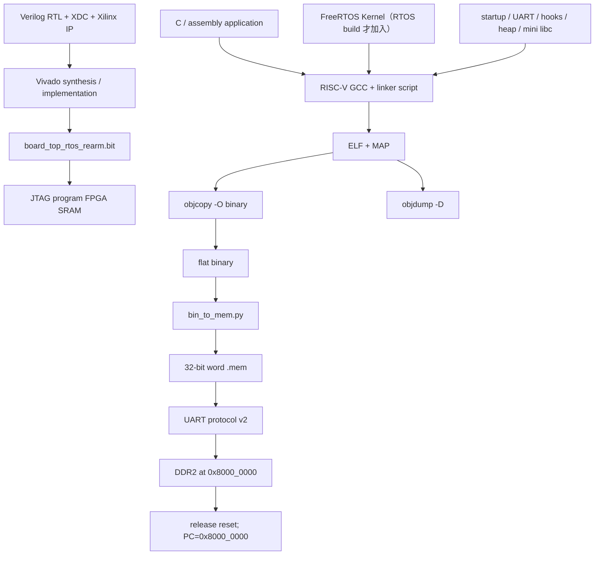

# 建置流程

本文件說明原始碼如何變成 FPGA 硬體與 CPU 可執行的韌體。最重要的區分是：

- **bitstream** 定義 FPGA 裡的 CPU、Cache、DDR controller、UART、MMIO 等硬體；
- **`.mem`** 包含 CPU 開機後執行的 RISC-V machine code 與已初始化資料；
- **Lua script** 是已啟動 Lua firmware 後再傳送的 runtime 輸入，不等同 `.mem`。

## 1. 全流程總覽



修改軟體時不需要讓 Vivado 重新合成。只要 bitstream 的 CPU ISA、MMIO、boot protocol 與新 `.mem` 相容，就能反覆上傳不同應用程式。

## 2. 哪些修改需要重做什麼

| 修改內容 | 重建 `.mem` | 重建 bitstream | 重新上傳 |
|---|---:|---:|---:|
| C application／RTOS Task | 是 | 否 | `.mem` |
| FreeRTOSConfig、BSP、driver、Lua VM C source | 是 | 否 | `.mem` |
| 只更換 Lua `.lua` script | 否 | 否 | Lua script |
| CPU pipeline、Cache、MMIO、UART bootloader RTL | 是，若 ABI 受影響 | 是 | bitstream + `.mem` |
| XDC、MIG、clock wizard、top-level | 通常否 | 是 | bitstream；上電後仍需 `.mem` |

bitstream 和 DDR 都是揮發性的：完全斷電後需重新 program FPGA，並重新上傳 `.mem`。

## 3. 裸機 C build

根目錄 [`Makefile`](../../Makefile) 的預設輸入為 [`game/game.c`](../../game/game.c)，並使用：

- startup：[`tools/crt0.S`](../../tools/crt0.S)；
- linker：[`tools/link_ddr.ld`](../../tools/link_ddr.ld)；
- 預設 ISA：`rv32im`；
- ABI：`ilp32`；
- freestanding、`-nostdlib`、`-O2`。

預設建置：

```powershell
make
```

等同主要目標：

```powershell
make mem
```

預設產物：

```text
build_os/game.elf
build_os/game.bin
TEST_FILES/mem_game.mem
```

建置另一個單一 C application：

```powershell
make mem `
  SRC=OS/main.c `
  OUT_NAME=os `
  MEM_OUT=TEST_FILES/mem_os.mem `
  APP_DEFINES=
```

若有額外 C source：

```powershell
make mem `
  SRC=game/my_game.c `
  EXTRA_SRCS="game/games_shared_ui.c game/vga_fb.c" `
  OUT_NAME=my_game `
  MEM_OUT=TEST_FILES/mem_my_game.mem
```

Makefile 另提供 `make disasm`、`make print-config` 與多個 game convenience target。`make clean` 會刪除指定 build directory 與該次 `MEM_OUT`，執行前應確認 override 參數是否正確。

### PowerShell 單檔建置器

[`tools/build_mem_from_c.ps1`](../../tools/build_mem_from_c.ps1) 適合直接指定 source：

```powershell
./tools/build_mem_from_c.ps1 `
  -Source TEST_FILES/prog_test22_from_c.c `
  -OutMem TEST_FILES/mem_test22_from_c.mem `
  -Arch rv32im_zicsr `
  -ToolchainBin C:/riscv/xpack-riscv-none-elf-gcc/bin
```

它將 `crt0.S`、`-ExtraSources` 與主 source 一次交給 GCC，輸出 `.elf`、`.bin` 及指定 `.mem`。它不會加入 FreeRTOS kernel。

## 4. FreeRTOS application build

[`tools/build_rtos_app.ps1`](../../tools/build_rtos_app.ps1) 是 RTOS 的正式建置器。它自動加入：

- [`OS/rtos/src/startup.S`](../../OS/rtos/src/startup.S)；
- UART driver、performance counter helper、hooks、2 MiB heap、mini libc；
- FreeRTOS `tasks`、`queue`、event group、stream buffer、software timer；
- `heap_4`；
- 官方 GCC RISC-V port 與 `portASM.S`；
- [`OS/rtos/link_ddr.ld`](../../OS/rtos/link_ddr.ld)；
- GCC runtime helper `-lgcc`。

常用建置：

```powershell
./tools/build_rtos_app.ps1 `
  -App console `
  -FreeRTOSRoot $FreeRTOSRoot `
  -ToolchainBin $ToolchainBin
```

內建 profile：

| Profile | 主程式 | 額外內容 | 主要用途 |
|---|---|---|---|
| `preflight` | `main_preflight.c` | board control | 短版 scheduler/tick/task/queue/UART 檢查，PASS 後回 loader |
| `smoke` | `main.c` | — | Queue producer/consumer smoke test |
| `console` | `main_console.c` | board control | UART 互動式 RTOS application |
| `platform` | `main_platform.c` | board control | heap、同步原語、timer、UART IRQ 等平台自測 |
| `lua` | `main_lua.c` | Lua port、protocol 與 Lua 5.4.8 source | Lua VM／REPL／script upload |
| `vga_demo` | `main_vga_demo.c` | `vga_fb.c` | RTOS VGA task demo |
| `vga_queue_demo` | `main_vga_queue_demo.c` | `vga_fb.c` | Queue → renderer VGA demo |

預設輸出資料夾與檔名為：

```text
build_rtos_apps/<App>/rtos_<App>.elf
build_rtos_apps/<App>/rtos_<App>.bin
build_rtos_apps/<App>/rtos_<App>.mem
build_rtos_apps/<App>/rtos_<App>.dis
build_rtos_apps/<App>/rtos_<App>.map
```

例如 `-App console` 產生 `build_rtos_apps/console/rtos_console.*`。

### 自訂 RTOS application

主 source 必須提供 `main()`：

```powershell
./tools/build_rtos_app.ps1 `
  -App my_app `
  -MainSource OS/rtos/src/main_my_app.c `
  -ExtraSource drivers/my_driver.c `
  -OutName rtos_my_app `
  -BuildDir build_rtos_apps/my_app `
  -FreeRTOSRoot $FreeRTOSRoot `
  -ToolchainBin $ToolchainBin
```

指定 `-MainSource` 後，`-App` 主要用來命名預設輸出目錄；不會再套用同名內建 profile 的額外 source/C flags。需要的 driver 必須明確放入 `-ExtraSource`。

## 5. 編譯與連結選項

RTOS build 的關鍵選項：

```text
-march=rv32im_zicsr -mabi=ilp32 -mno-relax
-ffreestanding -ffunction-sections -fdata-sections -nostdlib -O2
-Wl,--no-relax -Wl,--gc-sections
```

- `rv32im_zicsr`：32-bit integer、乘除法與 CSR instruction；
- `ilp32`：`int`、`long`、pointer 都是 32-bit；
- `-mno-relax/--no-relax`：避免 linker relaxation 改變目前 startup／addressing 假設；
- `-ffreestanding/-nostdlib`：沒有 host OS／一般 C runtime；
- `--gc-sections`：移除未引用的 function/data sections；
- `-lgcc`：提供 compiler 可能產生的低階算術 helper，不代表加入完整 libc。

Lua profile 額外使用 `LUA_32BITS=1`、`NDEBUG` 與專案的 Lua runtime config。

## 6. ELF、BIN、MEM、DIS、MAP 的差異

| 產物 | 用途 | 是否直接上傳 |
|---|---|---:|
| `.elf` | 含 section、symbol、entry、debug/metadata 的連結結果 | 否 |
| `.bin` | 從 loadable sections 展平的原始 bytes | 通常否 |
| `.mem` | 每行一個 32-bit hex word，host uploader 的輸入 | 是 |
| `.dis` | `objdump -D` 反組譯，方便核對 machine code | 否 |
| `.map` | section、symbol、位址與容量分析 | 否 |

`.mem` 不保留 symbol、section 名稱或 entry point。bootloader 固定把第一個 byte 寫到 `0x8000_0000`，CPU 也固定從該位址啟動；因此 linker origin、boot address 與 reset PC 必須一致。詳見 [MEM_FILE_FORMAT.md](MEM_FILE_FORMAT.md) 與 [LINKER_MEMORY_LAYOUT.md](LINKER_MEMORY_LAYOUT.md)。

## 7. 從 ELF 到 MEM

實際轉換順序：

```text
ELF --objcopy -O binary--> BIN --tools/bin_to_mem.py--> MEM
```

[`tools/bin_to_mem.py`](../../tools/bin_to_mem.py) 每四個 binary bytes 組成一個 little-endian 32-bit 數字；最後不足四 bytes 時補零。它不解析 ELF，也不自行知道 load address。

手動轉換範例：

```powershell
& "$ToolchainBin/riscv-none-elf-objcopy.exe" -O binary app.elf app.bin
python ./tools/bin_to_mem.py app.bin app.mem
```

## 8. 建置後的靜態檢查

查看 ELF entry／program headers／sections：

```powershell
& "$ToolchainBin/riscv-none-elf-readelf.exe" -h -l -S build_rtos_apps/console/rtos_console.elf
```

若 toolchain 沒有未加 prefix 的 `readelf`，請使用實際存在的 `riscv*-readelf.exe`。

查看 map 中的重要 symbol：

```powershell
Select-String -Path build_rtos_apps/console/rtos_console.map `
  -Pattern "__bss_start|__bss_end|__stack_bottom|__stack_top|__heap_start|__heap_end|__image_end"
```

不開板驗證 `.mem` 與 upload frame：

```powershell
./tools/run_rtos_app.ps1 `
  -Port COM5 `
  -App console `
  -FreeRTOSRoot $FreeRTOSRoot `
  -ToolchainBin $ToolchainBin `
  -DryRun
```

## 9. FPGA build 是另一條流程

重建 bitstream：

```powershell
./tools/build_board_bitstream.ps1 `
  -Project C:/path/to/cpu_project.xpr `
  -VivadoBat C:/Xilinx/Vivado/2020.2/bin/vivado.bat
```

此工具會 reset synthesis/implementation run、重新建置、檢查 top/source、檢查 setup/hold timing，再複製 `.bit` 至 `build_fpga/board_top_rtos_rearm.bit`。它**不會編譯或嵌入 application `.mem`**。

燒錄與 UART 上傳也分開：

```powershell
./tools/program_board_bitstream.ps1
./tools/run_rtos_app.ps1 -Port COM5 -App console
```

## 10. 常見建置問題

| 症狀 | 原因與檢查 |
|---|---|
| GCC 找不到 `FreeRTOS.h` | `-FreeRTOSRoot` 層級錯誤；應直接包含 `include/FreeRTOS.h` |
| undefined reference | 少了 `-ExtraSource`、函式實作，或誤以為 `-nostdlib` 仍提供完整 libc |
| region `DDR` overflowed | `.text/.data/.bss/stack/heap` 超出 linker LENGTH；檢查 `.map` |
| ELF 可建但 `.mem` 很大 | section 間出現大位址洞，`objcopy -O binary` 將其展平；檢查 section VMA/LMA |
| 板上立刻 instruction fault | linker origin、reset PC、boot address、ISA 或 bitstream 不相容 |
| 修改 C 後行為沒變 | 上傳了舊 `.mem`，或 `-BuildDir/-OutName` 指向另一份產物 |
| Vivado build 成功但不是新 RTL | `.xpr` source path 沒有指向目前 workspace；檢查 build log 的 source path |
