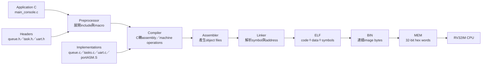

# C、FreeRTOS API 與 RISC-V Machine Code

本文件專門回答：「Application寫下的C函式與FreeRTOS API，最後如何變成這顆CPU真正執行的RISC-V machine code？」

它補足三種常見誤解：

- `#include "queue.h"`不是把`queue.c`文字貼入Application。
- `xQueueSend()`不是CPU原生的一條Queue指令，而是macro、函式呼叫與大量普通RV32指令。
- 同一個C API沒有一份永遠固定的machine code；實際結果取決於compiler、最佳化、設定與link位置，應以本次build的`.dis`為準。

## 1. 完整轉換流程



一句話版本：

```text
Application與FreeRTOS/Driver原始碼分別編譯
  → Linker把呼叫者與實作接起來
  → 產生一份ELF
  → 轉成同一份.mem
  → CPU只執行其中的RISC-V指令
```

## 2. 每種檔案負責什麼

| 檔案 | 角色 | 是否單獨編譯 |
|---|---|---:|
| `main_console.c` | Application邏輯與API caller | 是 |
| `queue.h` | Queue型別、public宣告與macro | 否，被`.c` include |
| `queue.c` | FreeRTOS Queue底層實作 | 是 |
| `tasks.c` | Task、Scheduler、delay與list操作 | 是 |
| `uart.h` | 本專案UART public宣告 | 否，被`.c` include |
| `uart.c` | UART polling、RX StreamBuffer與ISR Driver | 是 |
| `startup.S` | reset後設定`sp/gp/mtvec`並呼叫`main` | 是，由assembler處理 |
| `portASM.S` | context save/restore與trap entry | 是，由assembler處理 |
| Linker script | 決定section與位址 | 不產生一般函式，但控制link |

不要在Application中：

```c
#include "queue.c"  /* 錯誤：實作應由build system另外編譯。 */
```

正確方式：

```c
#include "FreeRTOS.h"
#include "queue.h"
```

## 3. 四個主要建置階段

### 3.1 Preprocessor：處理header與macro

Application寫：

```c
xQueueSend(work_queue, &request, portMAX_DELAY);
```

`queue.h`會把public macro展開成概念上類似：

```c
xQueueGenericSend(
    work_queue,
    &request,
    portMAX_DELAY,
    queueSEND_TO_BACK
);
```

因此ELF／`.dis`通常找不到獨立的`xQueueSend` symbol，應找`xQueueGenericSend`。Macro在預處理階段已經消失，不代表Queue API沒有執行。

### 3.2 Compiler：C語意轉成RISC-V operations

Compiler負責：

- 選擇RISC-V指令。
- 分配register。
- 建立stack frame。
- 決定inline或保留函式呼叫。
- 依最佳化刪除、合併或重排允許的運算。

例如：

```c
uint32_t add_three(uint32_t x)
{
    return x + 3u;
}
```

可能變成：

```asm
add_three:
    addi a0, a0, 3
    ret
```

### 3.3 Assembler：產生`.o`

Assembler把mnemonic編碼成32-bit instruction words並留下尚待Linker解析的relocation：

```text
main_console.c → main_console.o
queue.c        → queue.o
tasks.c        → tasks.o
uart.c         → uart.o
startup.S      → startup.o
```

此時caller可能知道「要呼叫`xQueueGenericSend`」，但函式最後地址尚未決定。

### 3.4 Linker：接起symbol與決定位址

Linker完成：

- 把Application、Kernel、Port與Driver sections放入同一ELF。
- 將caller的`JAL/JALR` relocation連到實作symbol。
- 依linker script安排`0x8000_0000`程式區、data、BSS、heap與stack。
- 使用`--gc-sections`移除未被引用的function/data section。

```text
main_console.o：需要xQueueGenericSend
queue.o：提供xQueueGenericSend
                 ↓ Linker解析
rtos_console.elf：caller與實作都有確定地址
```

## 4. RISC-V ABI：C函式如何傳參數

ABI（Application Binary Interface）規定不同`.o`檔案編譯出的函式如何互相呼叫。現在使用RV32 `ilp32` ABI。

### 4.1 常用register角色

| Register | ABI名稱 | 常見用途 |
|---|---|---|
| `x1` | `ra` | return address |
| `x2` | `sp` | stack pointer |
| `x5..x7`、`x28..x31` | `t0..t6` | caller-saved temporaries |
| `x8..x9`、`x18..x27` | `s0..s11` | callee-saved registers |
| `x10..x17` | `a0..a7` | 前8個integer/pointer參數 |
| `x10..x11` | `a0..a1` | return values |

超過8個integer參數或無法全部放入register的資料，會使用caller stack area。32-bit pointer、`int`與`uint32_t`在`ilp32`中都是32 bits；`uint64_t`通常需要register pair或stack slots。

### 4.2 簡單呼叫案例

```c
uint32_t mix(uint32_t a, uint32_t b, uint32_t c)
{
    return a + b * c;
}

uint32_t result = mix(2u, 3u, 4u);
```

Caller概念上準備：

```asm
li   a0, 2
li   a1, 3
li   a2, 4
jal  ra, mix
# return value位於a0
```

`mix`可能使用：

```asm
mul  a1, a1, a2
add  a0, a0, a1
ret
```

### 4.3 Caller-saved與callee-saved

如果caller在呼叫後仍需要`t0`或`a0`的舊值，caller必須自行保存；被呼叫函式可以修改caller-saved registers。若callee要使用`s0`等callee-saved register，必須先存到stack並在return前還原。

常見prologue／epilogue：

```asm
addi sp, sp, -16
sw   ra, 12(sp)
sw   s0, 8(sp)
...
lw   s0, 8(sp)
lw   ra, 12(sp)
addi sp, sp, 16
ret
```

這就是為什麼一個看似簡單的API也可能先出現多個stack `SW/LW`。

## 5. 常用 API 到machine code的類型

| 上層API | Public入口／底層實作 | 常見machine-code類型 | 主要作用位置 |
|---|---|---|---|
| `xQueueSend()` | macro→`xQueueGenericSend()`／`queue.c` | `JAL/R`、`LW/SW`、branch、copy loop、CSR critical section | DDR中的Queue與Task list |
| `xQueueReceive()` | `queue.c` | `LW/SW`、branch、list calls、可能yield | DDR中的Queue與Task list |
| `xSemaphoreTake()` | macro→Queue semaphore path／`queue.c` | `JAL/R`、`LW/SW`、branch、priority handling | DDR中的Semaphore/Mutex object |
| `xTaskCreateStatic()` | `tasks.c` | stack frame、`SW`初始化TCB/Task stack、list calls | Application storage與Kernel lists |
| `vTaskDelay()` | `tasks.c`＋Port | delayed-list `LW/SW`、function calls、`ECALL` yield | DDR＋trap/context switch |
| `taskYIELD()` | `portmacro.h` | `ECALL` | CPU trap入口 |
| Critical section | Port macro | `CSRRC/CSRRS/CSR*I`與RAM nesting count | `mstatus.MIE`＋Kernel state |
| `rtos_uart_putc()` | `uart.c` | `LUI`、`LW`、`ANDI`、branch loop、`SW` | UART MMIO |
| `rtos_uart_getc()` | `uart.c`＋`stream_buffer.c` | RAM `LW/SW`、branch、可能block；ISR另有MMIO `LW` | RX StreamBuffer＋UART RX MMIO |
| `perf_counters_snapshot()` | `perf_counters.c` | `SW` control、重複`LW` low/high、branch | Performance MMIO |
| `vga_fb_put_pixel()` | `vga_fb.c` | address arithmetic、`LW`、mask/shift、`SW` | VGA framebuffer MMIO |

此表是instruction類型，不是固定opcode清單。Runtime分支不同，實際走過的指令也不同。

## 6. 案例一：`xQueueSend()`

Application：

```c
WorkRequest_t request = { .iterations = 256u };

BaseType_t ok = xQueueSend(
    work_queue,
    &request,
    portMAX_DELAY
);
```

Caller依ABI概念上會準備：

```asm
mv    a0, s0          # QueueHandle_t
addi  a1, sp, 16      # &request
li    a2, -1          # portMAX_DELAY
li    a3, 0           # queueSEND_TO_BACK
jal   ra, xQueueGenericSend
```

`queue.c`內部不是一條特殊Queue指令，而是一段普通軟體：

```text
檢查handle與item pointer
  → 進入Kernel critical section
  → 讀Queue message count與write pointer
  → 複製sizeof(WorkRequest_t) bytes
  → 更新pointer/count
  → 檢查是否有receiver Task等待
  → 必要時修改event/ready lists並要求yield
  → 離開critical section
  → return pdPASS或timeout結果
```

對CPU而言主要是：

```asm
lw／sw       # 讀寫Queue、TCB、list與item bytes
beq／bne     # full、empty、timeout、waiter條件
jal／jalr    # 呼叫list、scheduler、copy helper
csrr*       # critical section控制interrupt mask
```

不存在Queue MMIO，也沒有Verilog `queue`周邊。

## 7. 案例二：`vTaskDelay()`

```c
vTaskDelay(pdMS_TO_TICKS(10));
```

目前1 kHz tick下macro通常先得到10 ticks。`vTaskDelay()`接著：

1. 計算wake tick。
2. 將目前Task移出ready list。
3. 放進delayed list。
4. 恢復Scheduler狀態。
5. 若還沒發生其他context switch，執行`ECALL`要求yield。

目前build可觀察到概念相同的片段：

```asm
jalr  ... <prvAddCurrentTaskToDelayedList>
jalr  ... <xTaskResumeAll>
bnez  a0, no_explicit_yield
ecall
```

`ECALL`使CPU進入trap；FreeRTOS Port保存完整Task context、呼叫Scheduler並恢復被選中的Task。10 ms後不是`vTaskDelay()`自己一直等待，而是periodic machine-timer ISR累積tick並使Task重新Ready。

## 8. 案例三：UART MMIO

C Driver：

```c
#define UART_TX_DATA   (*(volatile uint32_t *)0x40000000u)
#define UART_TX_STATUS (*(volatile uint32_t *)0x40000004u)

void rtos_uart_putc(char c)
{
    while ((UART_TX_STATUS & 1u) == 0u) {
    }
    UART_TX_DATA = (uint32_t)(uint8_t)c;
}
```

目前`rtos_console.dis`中的真實形狀是：

```asm
lui   a4, 0x40000
addi  a4, a4, 4
lui   a3, 0x40000
poll:
lw    a5, 0(a4)
andi  a5, a5, 1
beqz  a5, poll
sw    a0, 0(a3)
ret
```

這裡：

- `LUI/ADDI`形成`0x4000_0004` status address。
- `LW`建立MMIO read transaction。
- `ANDI/BEQZ`實作polling。
- `SW`寫`0x4000_0000`，由local MMIO decoder送到UART RTL。

這是API直接操作硬體的清楚案例。相較之下，`xQueueSend()`的`LW/SW`位址落在一般DDR資料結構，不會命中UART decoder。

## 9. 案例四：`xTaskCreateStatic()`

```c
handle = xTaskCreateStatic(
    worker_task,
    "worker",
    WORKER_STACK_WORDS,
    NULL,
    1u,
    worker_stack,
    &worker_tcb
);
```

前7個參數使用`a0..a6`。Kernel大致會：

```text
檢查stack與TCB pointer
  → 清／初始化StaticTask_t
  → 設定Task name、priority、list items
  → pxPortInitialiseStack建立初始register frame
  → 把worker_task address放進resume PC slot
  → 把pvParameters放進a0 slot
  → 插入ready list
  → 回傳TaskHandle_t
```

因此建立Task不是硬體「新增一顆執行單元」，而是CPU執行大量`LW/SW/branch/call`建立RAM資料結構。之後Scheduler使用TCB與saved stack frame切換執行流程。

## 10. Semaphore與Mutex為什麼也看到`queue.c`

FreeRTOS的Semaphore與Mutex共用Queue基礎結構與等待list實作：

```text
xSemaphoreTake(mutex, timeout)
  → semphr.h macro
  → xQueueSemaphoreTake(...)
  → queue.c machine code
```

這不代表Semaphore會傳送Application payload。它只是重用Queue object、blocked wait list與Scheduler integration，再加入Mutex ownership／priority inheritance語意。

## 11. 為什麼同一API的指令會變

### 11.1 最佳化

```text
-O0：保留較多stack存取與直接source結構
-O2：inline、constant propagation、dead-code elimination
-Os：傾向縮小code size
```

### 11.2 常數參數

`xQueueSend(q, &item, 0)`與`portMAX_DELAY`可能讓caller準備不同constant；底層runtime也走不同timeout分支。

### 11.3 Inline與macro

Macro沒有獨立symbol；inline function也可能直接展開進caller。查不到函式名稱時，要查caller或`.map`，不能直接判定程式沒有被編入。

### 11.4 Link address

每次加入或移除code後，函式地址可能改變，`JAL/JALR/AUIPC` immediate與machine-code word也會改變；但高階語意可以保持相同。

## 12. 如何查看本次build的實際指令

### 12.1 使用已產生的`.dis`

```powershell
Select-String `
  -Path .\build_rtos_apps\console\rtos_console.dis `
  -Pattern '<rtos_uart_putc>' `
  -Context 0,30
```

Queue public macro要找底層symbol：

```powershell
Select-String `
  -Path .\build_rtos_apps\console\rtos_console.dis `
  -Pattern '<xQueueGenericSend>' `
  -Context 0,100
```

其他常用symbol：

```text
<xTaskCreateStatic>
<vTaskDelay>
<xQueueReceive>
<xQueueSemaphoreTake>
<rtos_uart_getc>
<perf_counters_snapshot>
```

### 12.2 直接使用`objdump`

```powershell
riscv-none-elf-objdump -d `
  .\build_rtos_apps\console\rtos_console.elf |
  Select-String -Pattern '<vTaskDelay>' -Context 0,80
```

查看source與assembly混合輸出：

```powershell
riscv-none-elf-objdump -S `
  .\build_rtos_apps\console\rtos_console.elf |
  Select-String -Pattern '<rtos_uart_putc>' -Context 0,40
```

若ELF沒有debug line資訊，`-S`不一定能完整顯示C source；`.dis`與symbol仍可使用。

### 12.3 使用`.map`

`.map`適合回答：

- 哪個object file提供函式？
- 函式是否被linker保留？
- `.text/.rodata/.data/.bss`各占多少？
- 是否因`--gc-sections`移除未使用功能？

```powershell
Select-String `
  -Path .\build_rtos_apps\console\rtos_console.map `
  -Pattern 'xQueueGenericSend|queue.c'
```

## 13. 從assembly到32-bit machine-code word

`.dis`常見一行：

```text
8000178c: 00072783  lw a5,0(a4)
```

欄位代表：

```text
8000178c   instruction address
00072783   32-bit encoded machine-code word
lw ...     objdump解碼後的assembly
```

`.mem`保存的是給bootloader寫入DDR的32-bit hex words。CPU取到`0x00072783`後由ID stage解碼成`LW`；它不會再看到`rtos_uart_putc`這個C名稱。

同一word在DDR byte中依little-endian排列，但`.mem`每行以人可讀的32-bit hex word表示。細節見 [MEM_FILE_FORMAT.md](MEM_FILE_FORMAT.md)。

## 14. 查一個API的標準方法

```text
1. 查public header
   → 是函式宣告還是macro？

2. 查真正實作
   → tasks.c、queue.c、stream_buffer.c、uart.c或Port assembly？

3. 查Application caller
   → 傳入哪些常數、pointer與timeout？

4. 查.map
   → symbol由哪個object提供、是否被保留？

5. 查.dis
   → 實際產生哪些JAL/LW/SW/CSR/ECALL？

6. 依位址分類
   → 一般DDR、CSR、local MMIO或VGA window？

7. 追runtime分支
   → success、full/empty、timeout與context-switch路徑不相同。
```

## 15. 常見誤解速查

| 誤解 | 正確觀念 |
|---|---|
| Compiler只編譯`queue.c` | Application、Kernel、Driver與assembly都分別編譯，再由Linker接合 |
| `xQueueSend()`是我們寫的 | API由FreeRTOS提供；我們建立Queue object並呼叫API |
| `#include queue.h`會自動加入整個Kernel | Header只提供interface；實作由build source與Linker決定 |
| 每個API對應一條CPU指令 | 多數API是數十到數百條普通指令與函式呼叫 |
| `LW/SW`一定在存取DDR | 有效位址若命中`0x4000_xxxx/0x5000_xxxx`就成為MMIO |
| 查不到`xQueueSend`表示沒編入 | 它通常已macro展開成`xQueueGenericSend` |
| Lua runtime重新產生RISC-V code | 目前Lua VM以既有RISC-V machine code解讀Lua bytecode |

## 16. 延伸文件

- [BUILD_FLOW.md](BUILD_FLOW.md)：完整build產物與工具。
- [LINKER_MEMORY_LAYOUT.md](LINKER_MEMORY_LAYOUT.md)：section與地址。
- [MEM_FILE_FORMAT.md](MEM_FILE_FORMAT.md)：ELF/BIN/MEM與endian。
- [SOFTWARE_HARDWARE_INTERFACE.md](../04-freertos/SOFTWARE_HARDWARE_INTERFACE.md)：API執行後如何進DDR、CSR、trap與MMIO。
- [CONTEXT_SWITCH.md](../04-freertos/CONTEXT_SWITCH.md)：Task saved frame與Port assembly。
- [RTOS_PLATFORM_API_REFERENCE.md](../05-applications/RTOS_PLATFORM_API_REFERENCE.md)：目前可用API索引。

