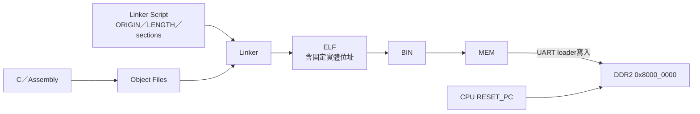
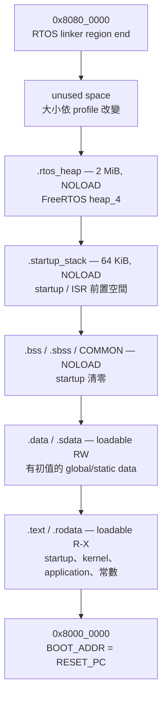

# Linker 與韌體記憶體配置

Linker script 決定每段 machine code／data 的執行位址，也建立 startup 與 runtime 會使用的 symbol。這不是單純的檔案排列問題：本專案沒有 MMU 或動態 loader，CPU 會直接從 linker 指定的實體位址執行。

相關位址圖見 [MEMORY_MAP.md](../02-memory-io/MEMORY_MAP.md)，`.mem` 的 word／byte 規則見 [MEM_FILE_FORMAT.md](MEM_FILE_FORMAT.md)。

## 快速視覺摘要



只要記住一個核心條件：linker起點、bootloader寫入位址與CPU reset PC必須一致；後文再分別解釋section、stack與heap。

## 1. 三個必須一致的位址

正常開機要求：

```text
linker DDR ORIGIN = UART BOOT_ADDR = CPU RESET_PC = 0x8000_0000
```

| 項目 | 目前值 | 定義位置 |
|---|---:|---|
| Firmware link origin | `0x8000_0000` | `tools/link_ddr.ld`、`OS/rtos/link_ddr.ld` |
| UART load address | `0x8000_0000` | `uart_bootloader.v` 的 `BOOT_ADDR` |
| CPU reset PC | `0x8000_0000` | `board_top.v` 的 `RESET_PC` |

`.mem` 沒有 address metadata。若只改 linker origin 而不改另外兩處，bootloader 仍從 `0x8000_0000` 寫入，CPU 也仍從 `0x8000_0000` fetch，通常會立刻執行錯誤內容。

## 2. 裸機 linker：512 KiB

[`tools/link_ddr.ld`](../../tools/link_ddr.ld) 用於根目錄 Makefile與 [`tools/build_mem_from_c.ps1`](../../tools/build_mem_from_c.ps1)：

```text
DDR ORIGIN = 0x8000_0000
DDR LENGTH = 512 KiB
DDR END    = 0x8008_0000   （end-exclusive）
```

配置順序：

```text
0x8000_0000
  .text.start
  .text*
  .traptext
  .rodata*
  .sdata* / .data*
  .sbss* / .bss* / COMMON
  alignment
  ...未明確保留的可用空間...
0x8008_0000 = __stack_top
```

| Section／symbol | 內容與用途 |
|---|---|
| `.text.start` | `_start`，保證排在 image 起點 |
| `.text*` | application machine code |
| `.traptext` | 若 source 提供，放置 trap code |
| `.rodata*` | 字串、const table |
| `.sdata*/.data*` | 有初值的可寫 global/static data |
| `__global_pointer$` | 設為 data 起點附近 `+0x800`，供 RISC-V small-data addressing |
| `.sbss*/.bss*/COMMON` | 無初值或零初始化資料 |
| `__bss_start/__bss_end` | startup 清零範圍 |
| `__stack_top` | 固定為 `0x8008_0000`，stack 向低位址成長 |

### 裸機 stack 的限制

script 只定義 stack top，沒有建立一個有固定大小的 `.stack` section，也沒有 stack/heap collision ASSERT。Linker 會確保 sections 位於 512 KiB DDR region，但無法知道程式執行時到底用了多少 stack。

因此：

- sections 越接近 `0x8008_0000`，可用 stack 越小；
- 大型 local array、深遞迴或大型 interrupt context 可能覆蓋 data；
- 需要正式保證時，應新增明確 stack section 與 ASSERT，而不是只看 link 成功。

## 3. 裸機 startup

[`tools/crt0.S`](../../tools/crt0.S) 執行：

1. `sp = __stack_top`；
2. `gp = __global_pointer$`；
3. 將 `__bss_start..__bss_end` 以 word 清零；
4. 呼叫 `main()`；
5. 把 `main` return value 放到 `x8/s0` 供 testbench 觀察；
6. 永久 spin。

它不是完整 hosted C runtime：沒有 command-line arguments、environment、OS syscall、constructor/destructor framework 或自動結束程序。

## 4. FreeRTOS linker：8 MiB

[`OS/rtos/link_ddr.ld`](../../OS/rtos/link_ddr.ld) 用於 `build_rtos_app.ps1`：

```text
DDR ORIGIN = 0x8000_0000
DDR LENGTH = 8 MiB
DDR END    = 0x8080_0000   （end-exclusive）
```

邏輯配置：

```text
0x8000_0000
  .text       RX, loadable
    .text.start / .text* / .rodata*
  .data       RW, loadable
    .sdata* / .data*
  .bss        RW, NOLOAD
  .startup_stack 64 KiB, NOLOAD
  .rtos_heap  configTOTAL_HEAP_SIZE, NOLOAD（目前 2 MiB）
  alignment
  unused DDR inside the 8 MiB linker region
0x8080_0000
```

實際 section 起訖會隨 profile 改變，不能把上圖比例當成固定地址。固定的是順序、alignment 與 region 上限。



圖是由高位址往低位址畫；`.mem` 只需要攜帶 loadable 的 `.text/.rodata/.data`。`NOLOAD` section 會占用執行期位址，但不應用大量零值把 UART image 撐到 8 MiB。

### Program headers 與權限

RTOS linker 定義兩個 `PT_LOAD`：

| PHDR | Flags | Sections |
|---|---|---|
| `text` | `R-X`（5） | `.text` 與 `.rodata` |
| `data` | `RW-`（6） | `.data`，以及 address layout 中的 NOLOAD sections |

這可避免把整個 image 標成單一 RWX LOAD segment。裸機 linker 目前只有 `DDR (rwx)`，某些新版 linker 可能對其產生 RWX warning；warning 不等同 compile failure，但若要發佈正式映像，應檢查 program headers，而不是無條件忽略。

## 5. RTOS sections 與 symbols

| 名稱 | 是否出現在 `.bin/.mem` | 用途 |
|---|---:|---|
| `.text/.rodata` | 是 | startup、kernel、application、const data |
| `.data/.sdata` | 是 | 有初值的 global/static data |
| `.bss/.sbss/COMMON` | 否（NOLOAD） | startup 清成零 |
| `.startup_stack` | 否（NOLOAD） | 64 KiB initial C stack region |
| `.rtos_heap` | 否（NOLOAD） | `ucHeap[configTOTAL_HEAP_SIZE]`，供 `heap_4` |
| `__image_end` | symbol | `.data` 的 load image 結束，不是 runtime 所有配置的結束 |

重要 symbols：

```text
__global_pointer$
__bss_start, __bss_end
__stack_bottom, __stack_top
__heap_start, __heap_end
__image_end
```

`__image_end` 使用 `LOADADDR(.data) + SIZEOF(.data)`，表示 UART payload 最後的 loadable data 概念邊界。`__heap_end` 才包含 `.bss`、64 KiB startup stack 與 2 MiB heap 的 runtime address footprint。

## 6. RTOS startup 與 Task stack

[`OS/rtos/src/startup.S`](../../OS/rtos/src/startup.S) 執行：

1. 設定 initial `sp`；
2. 以 `norelax` 設定 `gp`；
3. 清除 `.bss`；
4. 將 `mtvec` 指向 FreeRTOS RISC-V trap handler；
5. 呼叫 application `main()`；
6. 若 `main()` 返回則永久 spin。

`.startup_stack` 不等於每個 Task 的 stack。Task stack 由 application 以 static array 或 FreeRTOS heap 配置；FreeRTOS RISC-V port 使用的 `xISRStack` 也由 kernel/port source 依 `configISR_STACK_SIZE_WORDS` 建立，目前設定為 256 words。分析 RAM 時必須同時計入：

- linker 的 64 KiB startup stack；
- `.bss` 中的 static Task stacks、TCB、queues 與 ISR stack；
- `.rtos_heap` 的 2 MiB dynamic allocation arena。

## 7. Heap 與容量 ASSERT

[`OS/rtos/src/rtos_heap.c`](../../OS/rtos/src/rtos_heap.c) 宣告：

```c
uint8_t ucHeap[configTOTAL_HEAP_SIZE]
    __attribute__((section(".rtos_heap")));
```

目前 [`FreeRTOSConfig.h`](../../OS/rtos/config/FreeRTOSConfig.h) 定義 `configTOTAL_HEAP_SIZE = 2 MiB`。Linker 最後檢查：

```text
__heap_end <= 0x8080_0000
```

超過時 link 會以 `RTOS image/stack/heap exceeds DDR` 失敗。這個 ASSERT 保護的是 RTOS 8 MiB software region，不表示板上只有 8 MiB DDR；完整 CPU 可見 DDR 是 128 MiB，而 UART boot payload另有 8 MiB guard。

## 8. 為何 `.mem` 不含 2 MiB heap

`.bss`、startup stack 與 heap 都是 `NOLOAD`。它們需要 address space，但沒有需要從 host 傳入的初始 bytes。因此：

```text
runtime footprint ≠ upload payload size
```

例如 `.text + .data` 只有 25 KiB，仍可在執行時保留 2 MiB heap；`.mem` 不會因此自動增加 2 MiB 零字。

這也是 `__image_end` 與 `__heap_end` 都需要存在的原因：前者描述 load image，後者描述 runtime region 使用量。

## 9. 用 MAP／ELF 驗證實際配置

建置後先看 `.map`，不要只靠 linker script 推測：

```powershell
./tools/build_rtos_app.ps1 -App console `
  -FreeRTOSRoot $FreeRTOSRoot -ToolchainBin $ToolchainBin

Select-String -Path build_rtos_apps/console/rtos_console.map `
  -Pattern "\.text|\.data|\.bss|\.startup_stack|\.rtos_heap|__image_end|__heap_end"
```

查看 ELF headers：

```powershell
& "$ToolchainBin/riscv-none-elf-readelf.exe" `
  -h -l -S build_rtos_apps/console/rtos_console.elf
```

應核對：

- ELF class 是 32-bit；
- machine 是 RISC-V；
- entry 是 `0x8000_0000` 附近的 `_start`；
- LOAD segments 的 physical/virtual address 位於 DDR region；
- `.bss/.startup_stack/.rtos_heap` 不增加 file payload；
- `__heap_end` 不超出 `0x8080_0000`。

## 10. 修改 linker script 時的規則

1. 保持 `.text.start`／`KEEP(*(.text.start))` 在 image 起點，否則 `_start` 可能被 GC 或移位。
2. 修改 origin 時同步修改 bootloader `BOOT_ADDR` 與 CPU `RESET_PC`。
3. 加入新 loadable section 後確認 `objcopy -O binary` 沒產生巨大 address hole。
4. 新增 NOLOAD memory 時，將它納入 region overflow ASSERT。
5. 改 heap 時同步檢查 `configTOTAL_HEAP_SIZE`、link map 與 application stack需求。
6. 不要因硬體有 128 MiB 就直接把 firmware 擴到 128 MiB；UART loader仍有 8 MiB payload guard，host upload時間也會大幅增加。
7. 若要從 low alias `0x0000_0000` 執行，必須完整處理 reset/boot/linker、L1 alias coherence 與工具假設；目前不建議。

## 11. 常見故障

| 症狀 | 可能原因 |
|---|---|
| link region overflow | `.bss`、static Task stack、heap 或 code 超過 8 MiB region |
| `.mem` 遠大於 `.text + .data` | LOAD section 位址中間有洞 |
| CPU 從第一條就 fault | entry/origin 與 boot/reset address 不一致，或 image endianness 錯誤 |
| global/small data 讀錯 | `gp`／`__global_pointer$` 或 relaxation 設定不相容 |
| 啟動前 global 不是零 | startup 未清 `.bss`、symbol 邊界錯誤或資料被 runtime 覆蓋 |
| Task 跑一陣子才壞 | Task stack overflow、heap corruption；不一定是 linker load address 問題 |
