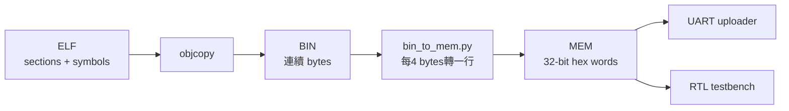

# `.mem` 韌體映像格式

本專案的 `.mem` 是一種簡單的 **32-bit hexadecimal word list**。它是 host uploader 與部分 testbench 的輸入格式，不是 ELF、Intel HEX、Motorola S-record，也不是含位址與 metadata 的封裝格式。

## 快速視覺摘要



`.mem` 每行只有一個32-bit word，沒有位址欄；第一行對應loader的起始位址，後續位址每行增加4 bytes。

## 1. 正式文字格式

標準輸出由 [`tools/bin_to_mem.py`](../../tools/bin_to_mem.py) 產生：

```text
XXXXXXXX
XXXXXXXX
XXXXXXXX
...
```

每行：

- 一個 32-bit word；
- 8 個大寫 hexadecimal digits；
- 不含 `0x`；
- 行與行之間以 newline 分隔；
- 檔案最後也有 newline；
- ASCII encoding。

例：

```text
00080117
FFC10113
00001197
83418193
```

Uploader 也接受空白行，以及整行開頭為 `//` 的 comment：

```text
// startup words
00080117

FFC10113
```

不要使用 inline comment：

```text
00080117 // 不建議；目前 Python parser 會把整行交給 int(..., 16)
```

也不要使用 Verilog `$readmemh` 常見的 `@80000000` address directive；目前 host parser 不支援它。

## 2. Word 數值與 byte 順序

CPU 與 boot protocol 都是 little-endian。`.mem` 的一行看起來以一般 hexadecimal 數字表示 word，但傳輸時會先送最低 byte。

例如：

```text
.mem line: 12345678
UART bytes: 78 56 34 12
DDR address:
  base+0 = 78
  base+1 = 56
  base+2 = 34
  base+3 = 12
CPU LW result = 0x12345678
```

因此 `.mem` 的文字不是「UART 線上 byte 順序」。[`uart_send_mem.py`](../../uart_send_mem.py) 與 [`tools/rtos_board_runner.py`](../../tools/rtos_board_runner.py) 都使用：

```python
word.to_bytes(4, "little")
```

把每行還原為 payload bytes。

## 3. Address 是隱含的

`.mem` 本身沒有 origin。第 `n` 行（從 0 起算）對應：

```text
payload byte offset = 4 * n
DDR address         = BOOT_ADDR + 4 * n
```

目前 `BOOT_ADDR = 0x8000_0000`：

| 行號 | DDR 位址 | 內容 |
|---:|---:|---|
| 0 | `0x8000_0000..03` | 第 1 個 word |
| 1 | `0x8000_0004..07` | 第 2 個 word |
| 2 | `0x8000_0008..0B` | 第 3 個 word |

這也是為什麼 linker script 必須從 `0x8000_0000` 排列 loadable image。如果 ELF 第一個 loadable byte 不在該位址，flat `.bin/.mem` 沒有 metadata 能提醒 bootloader 修正位置。

## 4. BIN → MEM 演算法

轉換器每四 bytes 做一次：

```text
value = b0 | b1<<8 | b2<<16 | b3<<24
line  = value 的 8 位 hexadecimal 表示
```

若 binary 長度不是 4 的倍數，最後一組右側補 `0x00`。因此 `.mem` 經 uploader 還原後的 payload 長度永遠是 4 的倍數，最多比原始 `.bin` 多三個尾端零 byte。

手動範例：

```text
binary bytes: 13 05 00 00 93 85 15 00 AA

.mem:
00000513
00158593
000000AA
```

## 5. ELF、BIN 與 MEM 的關係

```text
ELF --objcopy -O binary--> flat BIN --bin_to_mem.py--> word MEM
```

- ELF 有 section、symbol、entry point、VMA/LMA 與 permission；
- BIN 只保留 loadable bytes 與 section 間必要 padding；
- MEM 只是將 BIN 每四 bytes 改寫成文字 word。

`.bss`、startup stack 與 RTOS heap 在目前 linker script 中是 `NOLOAD`，不應為了它們傳送大量零 byte。`.bss` 由 startup 清零；stack/heap 由 runtime 按其規則使用。

若兩個 loadable sections 的 load address 中間有很大的洞，`objcopy -O binary` 可能把洞轉成大量 padding，使 `.bin/.mem` 異常膨脹。遇到這種情況應修正 linker layout，不應直接增加 bootloader 上限掩蓋問題。

## 6. Loader 接受規則

兩個主要 uploader 略有不同：

| 工具 | 解析規則 |
|---|---|
| `tools/rtos_board_runner.py` | ASCII、空行／整行 `//` 可略過；非法 hex、負數、超過 32-bit、空 image 都會拒絕 |
| `uart_send_mem.py` | 空行／整行 `//` 可略過；以 base-16 解析並 mask 到 32-bit |

正式 RTOS 流程建議使用較嚴格的 runner。為保持 testbench 與其他工具相容，請固定使用 `bin_to_mem.py` 的 canonical 8-digit 格式，而不要依賴寬鬆解析行為。

## 7. 大小限制

UART bootloader 硬體的 `MAX_BYTES` 是：

```text
8,388,608 bytes = 8 MiB = 2,097,152 words
```

這與 RTOS linker 的 8 MiB region 上限一致，但概念不同：

- linker 的 8 MiB 要容納 loadable sections、`.bss`、64 KiB startup stack 與 2 MiB RTOS heap；
- UART 的 8 MiB 限制的是實際傳輸 payload；
- `.bss`／stack／heap 是 `NOLOAD`，所以正常 RTOS `.mem` 通常遠小於 8 MiB。

裸機 linker 目前只配置 512 KiB，即使 UART 能傳更大，超出 linker region 的裸機程式仍應在 link 時失敗。

## 8. CRC 不儲存在 `.mem`

`.mem` 沒有內建 checksum。Protocol v2 的 CRC 是 **上傳時**由 host 對 `.mem` 還原出的 payload bytes 計算：

```text
CRC32 = zlib.crc32(payload) & 0xFFFFFFFF
```

host 將 CRC 放入 UART v2 header；FPGA 一次檢查接收 payload CRC，寫入 DDR 後又把完整 image 讀回並再次計算 CRC。詳細流程見 [UART_BOOTLOADER.md](UART_BOOTLOADER.md)。

重新排版 hexadecimal 字母大小寫或插入空白行不會改變 payload；改變 word、word 順序或增加有效資料行就會改變 payload 與 CRC。

## 9. 與 Verilog simulation 的關係

部分 testbench 會用 `$readmemh` 將同一份 word list載入 32-bit memory array。這與 UART 流程的觀察角度不同：

- `$readmemh` 直接把一行視為一個 32-bit array element；
- UART uploader 把該元素拆成四個 little-endian bytes；
- 只要 simulation memory 與 CPU load/store 同樣以 little-endian 解釋，兩條路徑得到的 instruction word 相同。

不要把 `.mem` 直接當成 DDR2 MIG 的 128-bit beat list。bootloader 會收集四個 32-bit words／16 bytes，形成一個 MIG write beat，並用 byte mask 處理最後不足 16 bytes 的部分。

## 10. 檢查與除錯

重新產生 canonical `.mem`：

```powershell
python ./tools/bin_to_mem.py app.bin app.mem
```

查看行數與對應 payload bytes：

```powershell
$words = (Get-Content app.mem | Where-Object { $_.Trim() -and -not $_.Trim().StartsWith('//') }).Count
"words=$words bytes=$($words * 4)"
```

只解析並建立 v2 frame、不開 COM：

```powershell
python ./tools/rtos_board_runner.py `
  --preflight-mem build_rtos_apps/preflight/rtos_preflight.mem `
  --target-mem app.mem `
  --protocol v2 `
  --dry-run
```

常見錯誤：

| 症狀 | 原因 |
|---|---|
| `invalid hex word` | inline comment、`@address`、非 hex 字元或合併了命令參數 |
| 第一條指令完全錯誤 | word/byte endianness 顛倒，或 linker origin 與 boot address 不同 |
| 只有最後幾 bytes 不同 | 忽略了最後 word zero padding |
| `.mem` 大到接近 8 MiB | section address hole、意外加入資料，或傳錯檔案 |
| CRC 每次固定失敗 | host/bitstream protocol 不匹配，或 payload byte 順序不同 |
