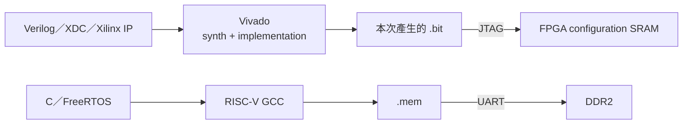

# 建置與燒錄 FPGA Bitstream

本文件說明如何將硬體設計建成 `.bit`，再透過 JTAG 配置 Nexys A7-100T。此流程只處理 FPGA configuration；CPU application `.mem` 仍需另走 UART bootloader。



本頁只處理上方的硬體路徑；日常完整上板時以 [BOARD_OPERATION_GUIDE.md](../00-overview/BOARD_OPERATION_GUIDE.md) 的時機與指令為準。

## 1. 何時需要重建 bitstream

需要重建：

- CPU pipeline、CSR、MulDiv、hazard、branch RTL 改變；
- I$、D$、L2、DDR arbitration 改變；
- UART bootloader、MMIO、timer、performance counter 改變；
- top-level、clock/reset、MIG、clock wizard、XDC 改變；
- 切換標準 `board_top` 與 VGA `board_top_vga`。

不需要重建：

- 只改 C application、FreeRTOS Task、driver C code；
- 只切換 `.mem`；
- 只更換 Lua script。

## 2. 目前標準輸出

標準非 VGA bitstream：

```text
build_fpga/board_top_rtos_rearm.bit
```

標準 top 是 [`board_top.v`](../../board_top.v)，包含 UART loader rearm／host-sync recovery。它沒有 VGA ports；VGA build 應使用不同 top 與 constraints，詳見 [VGA.md](../02-memory-io/VGA.md)。

目前已驗證 Vivado project 使用 `FAST_SYNTH`，所以該 bitstream 的 Cache 容量是 I$ 8 KiB、D$ 8 KiB、L2 16 KiB。完整容量組態需移除顯式 `FAST_SYNTH` 並定義 `PRODUCTION_BUILD`，重新檢查 BRAM/resource/timing；詳見 [ICACHE.md](../02-memory-io/ICACHE.md)、[DCACHE.md](../02-memory-io/DCACHE.md) 與 [L2_CACHE_DDR2.md](../02-memory-io/L2_CACHE_DDR2.md)。

## 3. Vivado project 的可攜性注意事項

[`tools/build_board_bitstream.ps1`](../../tools/build_board_bitstream.ps1) 的預設 project 是開發機外部路徑：

```text
C:\Users\a0968\cpu_test_0713\cpu_test_0713.xpr
```

其他使用者不能假定該路徑存在，應以 `-Project` 指到自己的 `.xpr`。更重要的是，`.xpr` 中的 source file reference 必須指向目前 repository 內容；Vivado build 成功不代表它一定讀到剛修改的 RTL。

project 至少需正確包含：

- `board_top.v`；
- `icache_pipeline_top.v`；
- `uart_bootloader.v`；
- 其餘 CPU／Cache／MMIO RTL；
- DDR2 MIG `.xci` 與 generated constraints；
- clock wizard `.xci` 與 constraints；
- [`Nexys-A7-100T-Master.xdc`](../../Nexys-A7-100T-Master.xdc)。

標準 rebuild Tcl 會要求 project top 恰好為 `board_top`，因此不能用同一條命令偷偷產生 VGA top。

## 4. 重建 bitstream

設定路徑：

```powershell
$VivadoBat = "C:/Xilinx/Vivado/2020.2/bin/vivado.bat"
$Project = "C:/Users/a0968/cpu_test_0713/cpu_test_0713.xpr"
```

執行：

```powershell
./tools/build_board_bitstream.ps1 `
  -Project $Project `
  -VivadoBat $VivadoBat `
  -OutputBit build_fpga/board_top_rtos_rearm.bit `
  -Jobs 4
```

成功輸出：

```text
BIT: C:\cpu_design\build_fpga\board_top_rtos_rearm.bit
LOG: C:\cpu_design\build_fpga\vivado_bitstream_build.log
```

`-OutputBit` 可用絕對或 repository-relative path；`-Jobs` 控制 Vivado synthesis/implementation parallel jobs。

## 5. Build script 實際做的事

PowerShell wrapper 呼叫 [`tools/rebuild_vivado_bitstream.tcl`](../../tools/rebuild_vivado_bitstream.tcl)。Tcl 流程：

1. 開啟指定 `.xpr`；
2. `update_compile_order`；
3. 檢查 top 為 `board_top`；
4. 確認 project 看得到 `uart_bootloader.v`、`icache_pipeline_top.v`、`board_top.v` 與板級 XDC；
5. `reset_run impl_1`、`reset_run synth_1`；
6. 重新跑 synthesis；
7. 重新跑 implementation 到 `write_bitstream`；
8. 確認兩個 run 都是 100% complete；
9. 開啟 implementation，取得最差 setup/hold timing path；
10. 若 setup WNS 或 hold WHS < 0，拒絕發佈 bitstream；
11. 確認 `impl_1` 只有一個 `.bit` candidate；
12. 複製到 `-OutputBit`。

因此「Vivado 顯示 write_bitstream complete」仍不一定能通過本工具；負 timing slack 會被視為不可發佈結果。

## 6. 讀 build log

主要檔案：

```text
build_fpga/vivado_bitstream_build.log
build_fpga/vivado_bitstream_build.jou
```

優先搜尋：

```powershell
Select-String -Path build_fpga/vivado_bitstream_build.log `
  -Pattern "ERROR:|CRITICAL WARNING:|PROJECT_TOP|PROJECT_PART|PROJECT_SOURCE|FINAL_TIMING|BITSTREAM_OUTPUT"
```

應確認：

- `PROJECT_TOP board_top`；
- part 是目標 XC7A100T；
- required sources 路徑正確；
- `FINAL_TIMING` 的 setup/hold slack 非負；
- output bitstream 是本次時間戳的新檔案。

CRITICAL WARNING 不一定使 Vivado exit nonzero，但不能全部忽略；尤其要檢查 unconstrained path、clock、I/O standard、MIG 與 CDC 相關訊息。

## 7. 燒錄前準備

1. 使用支援資料的 USB 線連接 Nexys A7；
2. 開啟板子電源；
3. 確認 JTAG configuration mode 正確；
4. 安裝 Vivado/Digilent cable driver；
5. 關閉可能占用 hw_server/cable 的 Vivado Hardware Manager；
6. 確認 bitstream 是要燒的版本。

快速檢查：

```powershell
Test-Path $VivadoBat
Get-Item ./build_fpga/board_top_rtos_rearm.bit | Select-Object FullName, Length, LastWriteTime
```

## 8. 透過 JTAG 配置 FPGA

```powershell
./tools/program_board_bitstream.ps1 `
  -Bitstream ./build_fpga/board_top_rtos_rearm.bit `
  -VivadoBat $VivadoBat
```

成功會顯示：

```text
PROGRAMMED: C:\cpu_design\build_fpga\board_top_rtos_rearm.bit
```

log／journal 位於 bitstream 同一資料夾：

```text
build_fpga/vivado_program_board.log
build_fpga/vivado_program_board.jou
```

## 9. Programming Tcl 的裝置選擇

[`tools/program_board_bitstream.tcl`](../../tools/program_board_bitstream.tcl) 會：

1. 開啟 Hardware Manager；
2. 連接 hw_server；
3. 取得可用 hw targets，選第一個；
4. 開啟 target；
5. 搜尋第一個名稱符合 `xc7a100t*` 的 device；
6. 設定 `PROGRAM.FILE`；
7. 呼叫 `program_hw_devices`；
8. refresh device，再關閉連線。

如果電腦同時連接多塊板，腳本的「第一個 target／第一個 xc7a100t」策略可能不是你想要的裝置。這種情況應先只保留目標板，或修改 Tcl 加入明確 target selector。

## 10. 燒錄完成後會發生什麼

燒錄 `.bit` 後：

1. FPGA hardware開始運作；
2. clock/reset 進入初始化；
3. MIG calibration；
4. DDR power-on memory test；
5. UART bootloader等待 `.mem`；
6. CPU仍維持 reset，直到 image verification通過。

所以燒錄成功後 UART沒有 application文字是正常的。下一步：

```powershell
./tools/run_rtos_app.ps1 -Port COM5 -App console
```

完整 upload 見 [RTOS_APP_RUNNER.md](RTOS_APP_RUNNER.md) 與 [UART_BOOTLOADER.md](UART_BOOTLOADER.md)。

## 11. LED 初步判斷

standard XDC 將 `status_o[0..14]` 接到一般 LEDs，另將 `ifetch_err_o` 接到 J13。最有用的幾個狀態：

| Signal | Pin／板上對應 | 開機階段意義 |
|---|---|---|
| `status_o[0]` | H17 / LED0 | MIG `init_calib_complete` |
| `status_o[5]` | U17 / LED5 | `boot_done`，image已接受 |
| `status_o[8]` | T15 / LED8 | boot 前為 DDR multi-address memtest pass；runtime後改為有 WB commit |
| `ifetch_err_o` | J13 / LED2位置 | boot 前為 diagnostic；runtime後代表 PC已改變，不是固定的 fault LED語意 |

許多 LED 是依 boot phase 多工的 debug signal，不能脫離 `boot_done` 狀態直接解讀。完整 mapping 以 [`board_top.v`](../../board_top.v) 的 `Status (diagnostic)` 區塊為準。

## 12. Reset、斷電與持久性

此工具使用 JTAG programming FPGA configuration SRAM：

- 按 CPU RESETN：硬體重新初始化，但通常不會抹掉 FPGA configuration；需重新上傳 DDR `.mem`；
- 完全斷電：FPGA configuration 與 DDR內容都消失；需重新 program `.bit` 並上傳 `.mem`；
- 本工具**不會**將 bitstream 寫入板載 QSPI configuration flash。

若未來需要上電自動載入，需另設計／文件化 flash programming 流程；不要把本頁的 `PROGRAMMED` 誤解為永久燒錄。

## 13. 常見錯誤

| 訊息／現象 | 原因與處理 |
|---|---|
| `Vivado not found` | `-VivadoBat` 路徑錯誤 |
| project path not found | 預設外部 `.xpr` 不存在；指定 `-Project` |
| `Expected non-VGA top board_top` | project top 設成別的 module |
| missing required source | `.xpr` 未加入或 reference 失效 |
| synth/impl 未 100% complete | 查看 build log 首個 ERROR |
| refusing timing-violating bitstream | setup WNS 或 hold WHS < 0；不能只複製舊 `.bit` 當完成 |
| `No JTAG hw_target found` | 板子、USB cable、driver 或 hw_server 被占用 |
| `No xc7a100t device found` | 接錯板、JTAG chain 或 part 不符 |
| programming成功但 UART無反應 | 尚未上傳 `.mem`、MIG未完成、COM/baud錯誤，或 XDC/UART source不對 |
| 斷電後程式消失 | SRAM/DDR 都是 volatile，屬預期行為 |
