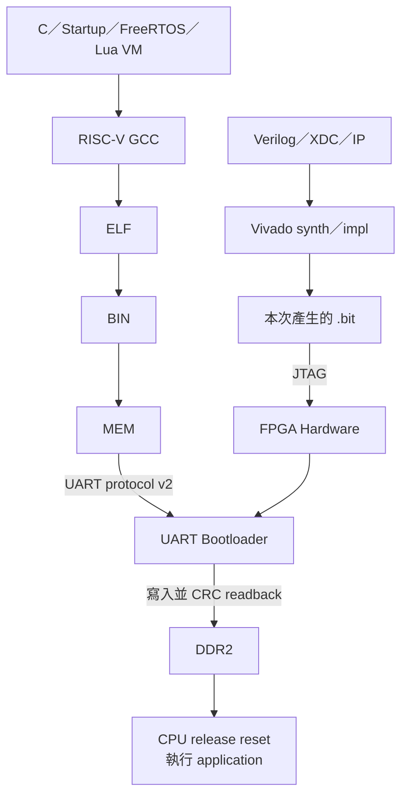

# 03 — Build 與 Boot 導覽

> 這個資料夾把兩條容易混淆的路徑分開：硬體原始碼產生 `.bit`，軟體原始碼產生 `.mem`；兩者最後在 FPGA 上會合。

## 從原始碼到執行

## 文件依流程排列

| 階段 | 文件 | 讀者要解決的問題 |
|---:|---|---|
| 0 | [REQUIREMENTS.md](REQUIREMENTS.md) | 電腦需要安裝什麼？ |
| 1 | [BUILD_FLOW.md](BUILD_FLOW.md) | 修改哪種檔案要重跑哪個 build？ |
| 2 | [C_TO_RISCV_MACHINE_CODE.md](C_TO_RISCV_MACHINE_CODE.md) | C、FreeRTOS API、ABI與`.c`實作如何變成真正RV32指令？ |
| 3 | [LINKER_MEMORY_LAYOUT.md](LINKER_MEMORY_LAYOUT.md) | 程式被放到哪個 address？ |
| 4 | [MEM_FILE_FORMAT.md](MEM_FILE_FORMAT.md) | ELF/BIN 如何變成 loader 接受的文字？ |
| 5 | [PROGRAM_FPGA.md](PROGRAM_FPGA.md) | 如何重新生成並 JTAG 燒錄硬體？ |
| 6 | [TIMING_CLOSURE.md](TIMING_CLOSURE.md) | 如何判斷bitstream真的滿足setup／hold？ |
| 7 | [UART_BOOTLOADER.md](UART_BOOTLOADER.md) | `.mem` 如何可靠進入 DDR？ |
| 8 | [RTOS_APP_RUNNER.md](RTOS_APP_RUNNER.md) | 如何用 preflight 自動驗證再切到目標程式？ |

## 最常用與深入原理分開

日常使用只查 [上板操作手冊](../00-overview/BOARD_OPERATION_GUIDE.md)。本資料夾用來理解工具內部、修改 build 或除錯 boot protocol，不需要在每次上板前全部重讀。

| 現在的問題 | 先讀 |
|---|---|
| GCC／FreeRTOS 路徑找不到 | `REQUIREMENTS` |
| 不懂API、`queue.c`與machine code如何接起來 | `C_TO_RISCV_MACHINE_CODE` |
| Link overflow／section 放錯 | `LINKER_MEMORY_LAYOUT` |
| `.mem` word 或 endian 看不懂 | `MEM_FILE_FORMAT` |
| Vivado build／JTAG 失敗 | `PROGRAM_FPGA` |
| Vivado有 `.bit`但timing失敗 | `TIMING_CLOSURE` |
| ACK、CRC、preamble 失敗 | `UART_BOOTLOADER` |
| Preflight 或 target marker timeout | `RTOS_APP_RUNNER` |

上下游：[上板入口](../00-overview/README.md) · [Application](../05-applications/README.md) · [驗證](../06-verification/README.md)
