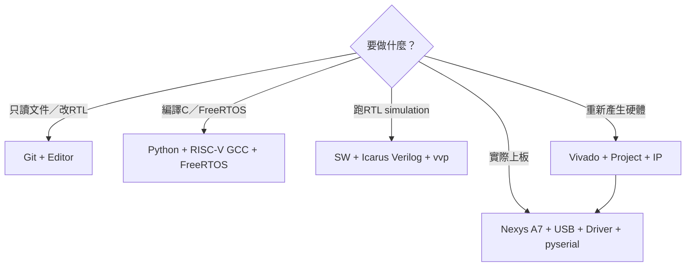
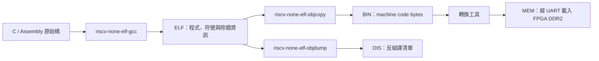

# 開發環境與需求

本文件列出建置韌體、執行 RTL 模擬、產生／燒錄 FPGA bitstream，以及透過 UART 上傳程式所需的硬體與軟體。第一次接觸專案時，建議先完成本頁的檢查，再依序閱讀 [BUILD_FLOW.md](BUILD_FLOW.md)、[PROGRAM_FPGA.md](PROGRAM_FPGA.md) 與 [RTOS_APP_RUNNER.md](RTOS_APP_RUNNER.md)。

## 先依工作內容選工具



不用一次安裝所有工具；先選上圖的工作路徑，再閱讀對應檢查段落。

## 1. 支援範圍

目前主要工作流程以 **Windows PowerShell** 為準，原因是專案的整合工具使用 `.ps1`、Windows `COM` port 與 Vivado Windows 安裝路徑。RTL 與 C 原始碼本身不依賴 Windows，但若改用 Linux，需要自行調整路徑、serial device 名稱與部分 wrapper script。

需求依用途分成三層：

| 用途 | 必要工具 |
|---|---|
| 只閱讀／修改 RTL 與文件 | Git、文字編輯器 |
| 編譯 C／FreeRTOS 與跑模擬 | Python 3、RISC-V bare-metal toolchain；模擬另需 Icarus Verilog／`vvp`，Makefile 流程另需 GNU Make |
| 實際上板 | Nexys A7-100T、資料 USB 線、pyserial；重建／燒錄 bitstream 另需 Vivado 與 cable driver |

Vivado **不是每次改 C 程式都需要**。修改 C、FreeRTOS application 或 Lua VM 時只需重建並上傳 `.mem`；只有修改 CPU、Cache、MMIO、bootloader、top-level、XDC 或 FPGA IP 時才需重建 bitstream。

## 2. 已驗證環境快照

以下是目前開發機上已通過本專案流程的版本，不代表嚴格最低版本：

| 元件 | 已驗證版本／位置 |
|---|---|
| Windows PowerShell | 5.1 |
| Python | 3.13.1 |
| pyserial | 3.5 |
| GNU Make | 4.4.1 |
| Icarus Verilog | 12.0 development build |
| RISC-V GCC | xPack GNU RISC-V Embedded GCC 15.2.0 |
| Vivado | 2020.2 |
| FreeRTOS | FreeRTOS 202406.04 LTS checkout 的 `FreeRTOS-Kernel` |

換用其他版本時，應重新執行本頁末尾的 smoke checks；不要只因工具能啟動就假定輸出完全相容。

## 3. FPGA 與連線需求

主要硬體為 **Digilent Nexys A7-100T**（XC7A100T），使用板載：

- 100 MHz oscillator；
- DDR2；
- USB-JTAG；
- USB-UART；
- CPU RESETN 按鍵；
- LED diagnostic outputs。

需要一條支援資料傳輸的 USB 線。只供電、不含 data wires 的線可以讓板子亮燈，卻無法讓 Vivado 找到 JTAG 或讓 Windows 建立 COM port。

標準 bitstream 使用 [`board_top.v`](../../board_top.v)；VGA 是另外的 top-level 組態，詳見 [VGA.md](../02-memory-io/VGA.md)。沒有 VGA 螢幕不影響標準 UART／FreeRTOS 開發流程。

## 4. Python 與 pyserial

Python 用於：

- `.bin` → `.mem` 轉換；
- UART boot protocol；
- preflight／target 協調；
- Lua script 上傳與部分測試工具。

檢查：

```powershell
python --version
python -c "import serial; print(serial.__version__)"
```

若第二行失敗：

```powershell
python -m pip install pyserial
```

必須用執行工具時的同一個 `python` 安裝套件。若電腦有多套 Python，請比較：

```powershell
Get-Command python
python -m pip --version
```

`tools/rtos_board_runner.py --dry-run` 不開啟 serial port，因此允許沒有 pyserial；實際上板則一定需要。

## 5. 準備 RISC-V Toolchain（第一次安裝）

### 5.1 這套工具是什麼

一般 Windows 上的 `gcc` 會產生給 x86-64 電腦執行的程式，不能直接產生本專案 CPU 所需的 RISC-V 指令。這裡要安裝的是 **cross toolchain（交叉工具鏈）**：工具本身在 Windows 上執行，但輸出是給 FPGA 內 RV32 CPU 使用的 machine code。

本專案使用 freestanding bare-metal toolchain，不需要 Linux userspace、glibc 或板上作業系統 syscall。FreeRTOS 會和 application 一起編譯進同一份韌體。

| 檔案 | 在本專案中的工作 | 主要輸出／用途 |
|---|---|---|
| `riscv-none-elf-gcc.exe` | 編譯 C／組合語言並進行 link | 產生 RISC-V `.elf` |
| `riscv-none-elf-objcopy.exe` | 從 ELF 取出可載入的 machine code | 產生 `.bin`，之後再轉成 `.mem` |
| `riscv-none-elf-objdump.exe` | 將 ELF 反組譯成人類可讀文字 | 產生 `.dis`，用於除錯 |



編譯器目標參數為：

```text
-march=rv32im_zicsr
-mabi=ilp32
```

也就是產生 32-bit RISC-V、小端序、支援整數乘除法與 CSR 指令的程式。

### 5.2 下載 Windows 版本

本專案已用 **xPack GNU RISC-V Embedded GCC 15.2.0** 驗證。第一次安裝建議採用和團隊相同的大版本；若日後換版本，應重新執行本文件第 10 節的檢查。

1. 開啟 [xPack 官方安裝說明](https://xpack-dev-tools.github.io/riscv-none-elf-gcc-xpack/docs/install/) 或 [官方 GitHub Releases](https://github.com/xpack-dev-tools/riscv-none-elf-gcc-xpack/releases)。
2. 在 release 的 **Assets** 中下載 Windows x64 的 ZIP。檔名格式類似：

   ```text
   xpack-riscv-none-elf-gcc-15.2.0-1-win32-x64.zip
   ```

3. 不要下載 `Source code (zip)`；那只是原始碼，不包含可直接使用的 Windows `.exe`。

檔名中的 `win32-x64` 代表 Windows 平台的 64-bit 主機版本；它不表示輸出的 RISC-V 程式只有 32-bit 或 64-bit。實際輸出架構由前述 `-march` 和 `-mabi` 決定。

### 5.3 解壓到專案預設位置

這個套件是可攜式 ZIP，**沒有安裝精靈**。必須保留解壓後的完整資料夾，不能只複製三個 `.exe`，因為編譯器還會使用同套件內的 headers、libraries 與其他工具。

建議流程：

1. 建立 `C:\riscv`。
2. 將下載的 ZIP 完整解壓。
3. 把解壓出的版本資料夾移到 `C:\riscv`，並重新命名為 `xpack-riscv-none-elf-gcc`。
4. 最後確認 `bin` 直接位於下圖這一層：

```text
C:\riscv\
└─ xpack-riscv-none-elf-gcc\
   ├─ bin\
   │  ├─ riscv-none-elf-gcc.exe
   │  ├─ riscv-none-elf-objcopy.exe
   │  └─ riscv-none-elf-objdump.exe
   ├─ include\
   ├─ lib\
   └─ ...
```

專案預設的 `-ToolchainBin` 是：

```text
C:\riscv\xpack-riscv-none-elf-gcc\bin
```

常見錯誤是多包了一層版本資料夾，例如：

```text
C:\riscv\xpack-riscv-none-elf-gcc\xpack-riscv-none-elf-gcc-15.2.0-1\bin
```

這種結構不是不能使用，但 `-ToolchainBin` 必須改指向真正包含 `.exe` 的最內層 `bin`；最簡單的做法仍是整理成前述預設結構。

### 5.4 先確認三個檔案存在

開啟新的 PowerShell，執行：

```powershell
$ToolchainBin = "C:/riscv/xpack-riscv-none-elf-gcc/bin"

Test-Path "$ToolchainBin/riscv-none-elf-gcc.exe"
Test-Path "$ToolchainBin/riscv-none-elf-objcopy.exe"
Test-Path "$ToolchainBin/riscv-none-elf-objdump.exe"
```

三行都應顯示 `True`。如果顯示 `False`，先不要執行 build；用下列命令找出實際解壓位置：

```powershell
Get-ChildItem C:/riscv -Recurse -Filter "riscv*-gcc.exe" |
  Select-Object -ExpandProperty FullName
```

找到後，將 `$ToolchainBin` 設為該 `.exe` 所在的 `bin` 資料夾，而不是設成 `.exe` 本身。

### 5.5 執行版本測試

PowerShell 路徑可能含有空白，因此要使用 call operator `&` 執行字串中的程式路徑：

```powershell
& "$ToolchainBin/riscv-none-elf-gcc.exe" --version
& "$ToolchainBin/riscv-none-elf-objcopy.exe" --version
& "$ToolchainBin/riscv-none-elf-objdump.exe" --version
```

每一行都應顯示版本資訊且沒有紅色錯誤。第一行的結果應類似：

```text
riscv-none-elf-gcc (xPack GNU RISC-V Embedded GCC x86_64) 15.2.0
```

這裡的 `x86_64` 是指「編譯器正在 64-bit Windows 電腦上執行」，不是說它會替 FPGA 產生 x86 程式。

### 5.6 要不要加入 Windows PATH

**不是必要條件。** 本專案的 PowerShell 工具可直接接收 `-ToolchainBin`，而且預設已指向上述建議位置。這也是交接時較容易重現的方式。

若只想在目前這一個 PowerShell 視窗直接輸入工具名稱，可暫時加入 PATH：

```powershell
$env:Path = "$ToolchainBin;$env:Path"
riscv-none-elf-gcc --version
```

關閉這個 PowerShell 視窗後，暫時設定會消失。若要永久設定，可在 Windows 搜尋「編輯環境變數」，將下列資料夾加入**使用者變數**的 `Path`，然後重新開啟 PowerShell：

```text
C:\riscv\xpack-riscv-none-elf-gcc\bin
```

可用以下命令確認永久 PATH 是否生效：

```powershell
Get-Command riscv-none-elf-gcc
riscv-none-elf-gcc --version
```

如果 `Get-Command` 找不到工具，但第 5.5 節使用完整路徑可以執行，代表工具鏈本身正常，只是尚未加入 PATH；仍可正常使用本專案的 `-ToolchainBin`。

### 5.7 在本專案中指定工具鏈

只要使用預設安裝位置，平常可直接執行：

```powershell
./tools/build_rtos_app.ps1 -App smoke -FreeRTOSRoot $FreeRTOSRoot
```

若安裝在其他位置，則明確傳入包含工具程式的 `bin`：

```powershell
$ToolchainBin = "D:/tools/xpack-riscv-none-elf-gcc/bin"

./tools/build_rtos_app.ps1 `
  -App smoke `
  -FreeRTOSRoot $FreeRTOSRoot `
  -ToolchainBin $ToolchainBin
```

`$FreeRTOSRoot` 的設定方式見下一節。成功時會產生 `.elf`、`.bin`、`.mem`、`.dis` 與 `.map`；此步只編譯，不會占用 COM port，也不會改寫 FPGA。

### 5.8 為什麼有時看到不同的檔名前綴

不同 RISC-V toolchain 可能使用：

- `riscv-none-elf-*`；
- `riscv32-unknown-elf-*`；
- `riscv64-unknown-elf-*`。

本專案的 RTOS build script 會搜尋數種常見名稱。即使 compiler 檔名是 `riscv64-unknown-elf-gcc`，只要它支援 multilib，搭配 `-march=rv32im_zicsr -mabi=ilp32` 仍可產生 RV32 程式；檔名本身不等於最終韌體位元數。

根目錄 Makefile 的 compiler 與 binutils prefix 是分開的變數；只有自動偵測失敗時才需要手動指定，例如：

```powershell
make print-config `
  CC_PREFIX="$ToolchainBin/riscv64-unknown-elf-" `
  BINUTILS_PREFIX="$ToolchainBin/riscv-none-elf-"
```

### 5.9 常見安裝錯誤

| 現象 | 原因 | 處理方式 |
|---|---|---|
| 下載後找不到 `.exe` | 下載了 GitHub 的 Source code | 回到 release Assets，下載 `win32-x64.zip` |
| 三個 `Test-Path` 都是 `False` | `$ToolchainBin` 指錯層 | 找到 `riscv*-gcc.exe`，再把變數設為它所在的 `bin` |
| `riscv-none-elf-gcc` 無法辨識 | 尚未加入 PATH | 使用完整路徑，或對腳本傳入 `-ToolchainBin` |
| `gcc` 可以執行，build 卻找不到 `objcopy` | 工具鏈不完整或混用了不同套件 | 保留完整 xPack 解壓資料夾，確認三個工具在同一個 `bin` |
| 顯示 `riscv64`，擔心不能編譯 RV32 | 把 executable prefix 當成輸出架構 | 檢查 build 使用的 `-march=rv32im_zicsr -mabi=ilp32` |
| 換了工具鏈版本後才出現 link／opcode 問題 | compiler、binutils 或 multilib 行為不同 | 先改回已驗證版本，再執行第 10 節 smoke check 比較 |

## 6. FreeRTOS Kernel

repository 內含 BSP、設定、startup 與 application，但**沒有內嵌完整 FreeRTOS Kernel checkout**。`-FreeRTOSRoot` 必須指向 `FreeRTOS-Kernel` 本身，而不是它的上層 `FreeRTOS` 或 LTS 根目錄。

範例：

```powershell
$FreeRTOSRoot = "C:/FreeRTOSv202406.04-LTS/FreeRTOS-LTS/FreeRTOS/FreeRTOS-Kernel"
```

至少確認：

```powershell
Test-Path "$FreeRTOSRoot/tasks.c"
Test-Path "$FreeRTOSRoot/queue.c"
Test-Path "$FreeRTOSRoot/include/FreeRTOS.h"
Test-Path "$FreeRTOSRoot/portable/GCC/RISC-V/port.c"
Test-Path "$FreeRTOSRoot/portable/GCC/RISC-V/portASM.S"
Test-Path "$FreeRTOSRoot/portable/GCC/RISC-V/chip_specific_extensions/RV32I_CLINT_no_extensions/freertos_risc_v_chip_specific_extensions.h"
```

每一行都應為 `True`。目前 profile 還會編譯 `list.c`、`event_groups.c`、`stream_buffer.c`、`timers.c` 與 `portable/MemMang/heap_4.c`。

## 7. GNU Make 與 Icarus Verilog

GNU Make 用於根目錄 [`Makefile`](../../Makefile) 的裸機 C build 與幾個單元測試；RTOS 的 `.ps1` 建置器本身不要求 Make。

Icarus Verilog／`vvp` 用於 RTL simulation，不是實板上傳的必要條件：

```powershell
make --version
iverilog -V
vvp -V
```

常用 smoke tests：

```powershell
make uart-mmio-tb
make perf-counter-tb
make vga-subsystem-tb
```

## 8. Vivado 與 FPGA project

只有重建或燒錄 bitstream 時需要 Vivado。腳本目前預設：

```text
Vivado batch：C:\Xilinx\Vivado\2020.2\bin\vivado.bat
Vivado project：C:\Users\a0968\cpu_test_0713\cpu_test_0713.xpr
```

第二個路徑是目前開發機上的外部 `.xpr`，不是可攜式 repository 相對路徑。其他使用者必須建立／取得正確 project，然後用 `-Project` 指定：

```powershell
./tools/build_board_bitstream.ps1 `
  -Project C:/path/to/cpu_project.xpr `
  -VivadoBat C:/Xilinx/Vivado/2020.2/bin/vivado.bat
```

project 必須包含當前 RTL、MIG、clock wizard 與 [`Nexys-A7-100T-Master.xdc`](../../Nexys-A7-100T-Master.xdc)，top 必須是 `board_top`。腳本會主動拒絕錯誤 top 或負 setup/hold slack 的 bitstream。

燒錄還需要 Vivado cable drivers。若 Hardware Manager 找不到裝置，先確認板子電源、JTAG mode、USB data cable、driver，以及是否有其他 Vivado process 占用 hardware server。

## 9. UART COM port

連接並開啟板子後，可列出 Windows serial ports：

```powershell
Get-CimInstance Win32_SerialPort | Select-Object DeviceID, Name
```

將看到的編號設成變數，例如：

```powershell
$Port = "COM5"
```

同一時間只能由一個程式占用該 COM port。執行 runner 前需關閉 PuTTY、Tera Term、Arduino Serial Monitor、其他 Python uploader 或前一次仍在運行的 monitor。

UART 預設為 `115200 baud`。目前 host tool 會嘗試將 DTR/RTS 維持 inactive，但實際 USB-UART driver 行為仍由作業系統與板載 bridge 決定。

## 10. 一次完成環境檢查

以下命令不修改 FPGA：

```powershell
$ToolchainBin = "C:/riscv/xpack-riscv-none-elf-gcc/bin"
$FreeRTOSRoot = "C:/FreeRTOSv202406.04-LTS/FreeRTOS-LTS/FreeRTOS/FreeRTOS-Kernel"

python --version
python -c "import serial; print('pyserial', serial.__version__)"
& "$ToolchainBin/riscv-none-elf-gcc.exe" --version
Test-Path "$FreeRTOSRoot/tasks.c"
Test-Path "$FreeRTOSRoot/portable/GCC/RISC-V/port.c"
make --version
iverilog -V
```

接著做不開 COM port 的完整 RTOS build／frame 檢查：

```powershell
./tools/run_rtos_app.ps1 `
  -Port COM5 `
  -App smoke `
  -FreeRTOSRoot $FreeRTOSRoot `
  -ToolchainBin $ToolchainBin `
  -DryRun
```

`-DryRun` 仍要求 PowerShell wrapper 的 `-Port` 參數，但 Python runner 不會開啟該埠；此處的 `COM5` 可以只是格式正確的 placeholder。

## 11. 常見需求錯誤

| 錯誤 | 通常原因 | 處理方式 |
|---|---|---|
| `pyserial not found` | pyserial 裝在另一套 Python | 使用 `python -m pip install pyserial` |
| `RISC-V toolchain not found` | 路徑錯誤或 executable prefix 不同 | 指定 `-ToolchainBin` 並直接執行 gcc 檢查 |
| `Required file not found: ...FreeRTOS...` | `-FreeRTOSRoot` 指到錯誤層級或版本缺 port | 指到含 `tasks.c` 的 `FreeRTOS-Kernel` |
| `Vivado not found` | `-VivadoBat` 沿用別人的絕對路徑 | 指定本機 `vivado.bat` |
| `No JTAG hw_target found` | 板子、線、driver 或 hardware server 問題 | 關閉其他 Hardware Manager，再檢查連線 |
| `Access is denied`／COM busy | serial port 已被占用 | 關閉其他 terminal／uploader |
| build 成功但板上不動 | bitstream、`.mem`、baud 或 linker/reset address 不相容 | 先跑 preflight，並核對 [LINKER_MEMORY_LAYOUT.md](LINKER_MEMORY_LAYOUT.md) |
