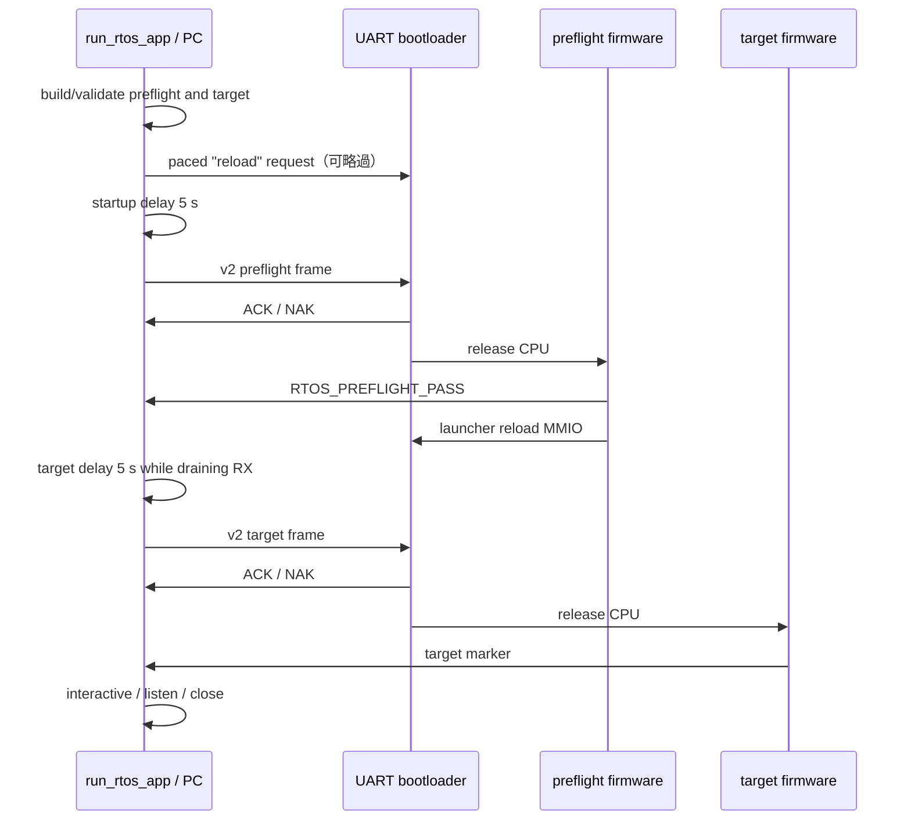
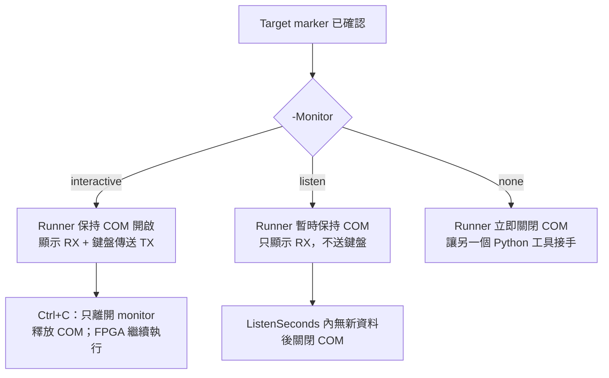

# 通用 RTOS Application Runner

[`tools/run_rtos_app.ps1`](../../tools/run_rtos_app.ps1) 是目前建議的實板入口。它不是只做「傳檔」，而是將 RTOS build、短版 preflight、bootloader v2、重試、target marker 與 UART monitor 串成一個兩階段流程。

## 1. 為什麼先跑 preflight

直接上傳大型 application失敗時，很難立刻判斷是 FPGA、DDR、CPU、FreeRTOS、UART或 application本身。Runner先上傳很短的 `preflight`：

```text
上傳 preflight
  -> 啟動 FreeRTOS scheduler
  -> machine timer tick 必須前進
  -> 建立兩個 static Task
  -> producer 經 Queue 送三筆資料
  -> consumer 驗證順序／內容
  -> UART 印出 RTOS_PREFLIGHT_PASS
  -> MMIO request image reload
  -> 上傳真正 target
```

只有收到 `RTOS_PREFLIGHT_PASS` 才切換 target。這證明當次開機的基本 CPU、DDR image、UART TX、timer interrupt、scheduler、context switch、Queue 與 reload path可工作，但不代表 target application的所有功能一定正確。

## 2. 最常用指令

```powershell
./tools/run_rtos_app.ps1 -Port COM5 -App console
```

若 dependency不在腳本預設路徑：

```powershell
$FreeRTOSRoot = "C:/FreeRTOSv202406.04-LTS/FreeRTOS-LTS/FreeRTOS/FreeRTOS-Kernel"
$ToolchainBin = "C:/riscv/xpack-riscv-none-elf-gcc/bin"

./tools/run_rtos_app.ps1 `
  -Port COM5 `
  -App console `
  -FreeRTOSRoot $FreeRTOSRoot `
  -ToolchainBin $ToolchainBin
```

成功順序通常包含：

```text
APP: preflight
APP: console
RTOS target: ...rtos_console.mem
Uploading RTOS preflight...
RTOS_PREFLIGHT_BEGIN
RTOS_PREFLIGHT_PASS
Preflight passed; target image sent for bootloader verification.
APP_READY
Target confirmed by marker: APP_READY
```

## 3. 選擇 target 的三種方式

### 內建 profile

```powershell
./tools/run_rtos_app.ps1 -Port COM5 -App platform
```

Runner會呼叫 `build_rtos_app.ps1` 建置 profile，再上傳產生的 `.mem`。

### 已存在的 `.mem`

```powershell
./tools/run_rtos_app.ps1 `
  -Port COM5 `
  -Mem ./build_rtos_apps/my_app/rtos_my_app.mem `
  -TargetMarker MY_APP_READY
```

`-Mem` 不重建 target，但若沒有指定 `-PreflightMem`，仍會建置 preflight，因此仍需要 FreeRTOS kernel與 toolchain。

若兩份 image都已存在，可完全略過 firmware build：

```powershell
./tools/run_rtos_app.ps1 `
  -Port COM5 `
  -PreflightMem ./build_rtos_apps/preflight/rtos_preflight.mem `
  -Mem ./build_rtos_apps/my_app/rtos_my_app.mem `
  -TargetMarker MY_APP_READY
```

### 自訂 C application

```powershell
./tools/run_rtos_app.ps1 `
  -Port COM5 `
  -MainSource OS/rtos/src/main_my_app.c `
  -ExtraSource drivers/my_driver.c `
  -OutName rtos_my_app `
  -TargetMarker MY_APP_READY `
  -FreeRTOSRoot $FreeRTOSRoot `
  -ToolchainBin $ToolchainBin
```

若只給 `-MainSource`，wrapper會自動使用 `App=custom`，預設 build directory為 `build_rtos_apps/custom`。`-OutName` 決定 `.elf/.bin/.mem/.dis/.map` 的共同檔名，不是 UART上顯示的名稱。

## 4. `TargetMarker` 到底要填什麼

`-TargetMarker` 是 target啟動後應透過 UART輸出的 **ASCII成功字串**，不是 source檔名、Task名或 `.mem` 名稱。

例如 C application完成初始化後：

```c
rtos_uart_write_line("MY_APP_READY");
```

執行：

```powershell
./tools/run_rtos_app.ps1 `
  -Port COM5 `
  -MainSource OS/rtos/src/main_my_app.c `
  -OutName rtos_my_app `
  -TargetMarker MY_APP_READY
```

Runner在 timeout內看到完整字串才宣告 target confirmed。Marker應：

- 短且唯一；
- 只用 ASCII；
- 在 scheduler、必要 driver與核心資源真的 ready之後輸出；
- 不要在錯誤路徑也輸出同樣字串。

省略 marker時，未知/custom image只會被送出，不會得到 application-level啟動確認；`-Monitor none` 又會立刻關閉 COM，因此正式自訂程式建議一定提供 marker。

## 5. 內建 profile 與自動 marker

| Profile／檔名判斷 | 自動 marker | 預設 target timeout |
|---|---|---:|
| `smoke` | `RTOS_SMOKE_PASS` | 20 s |
| `console` | `APP_READY` | 20 s |
| `platform` | `RTOS_PLATFORM_PASS` | 20 s |
| `lua` | `LUA_RTOS_READY` | 60 s，除非使用者明確覆寫 |
| `vga_demo` | `[VGA] task=L start` | 20 s |
| `vga_queue_demo` | `[PIPE] task=P producer start` | 20 s |

`preflight` 是 runner內部第一階段，固定成功 marker為 `RTOS_PREFLIGHT_PASS`。若把 `-App preflight` 又當 target使用，target階段沒有自動 marker，且該程式成功後本來就會再次 reload。

## 6. 完整兩階段時序



第一次 upload前，runner會慢速送出 `\rreload\r\n`，先嘗試讓正在執行且支援 command的 RTOS application回 loader。已在 loader時，這些普通字元會被 sync search忽略。之後真正的 v2 sync還能在 loader `S_DONE` 進行硬體 takeover。

## 7. 上傳可靠性預設值

目前程式碼的預設值：

| 參數 | 預設 | PowerShell option |
|---|---:|---|
| UART baud | 115200 | `-Baud` |
| initial startup delay | 5.0 s | `-StartupDelay` |
| preamble | 4096 個 `0x55` | `-Preamble` |
| protocol | v2 | `-Protocol v1\|v2` |
| host chunk | 32 bytes | `-ChunkSize` |
| chunk pause | 1 ms | `-ChunkDelay` |
| sync settle | 20 ms | `-SyncSettle` |
| header settle | 5 ms | `-HeaderSettle` |
| loader ACK timeout | 2.0 s | `-BootAckTimeout` |
| preflight marker timeout | 20.0 s | `-PreflightTimeout` |
| preflight attempts | 5 | `-PreflightAttempts` |
| preflight → target delay | 5.0 s | `-TargetDelay` |
| target marker timeout | 20.0 s | `-TargetTimeout` |
| target attempts | 5 | `-TargetAttempts` |

現行 v2/pacing預設是針對曾出現的上板不穩定問題設定。除非做受控實驗，不建議一開始把 preamble、settle或 chunk delay全部降成零。

## 8. Retry 行為

### Preflight

- `0x15/0x16`：視為 bootloader reject，重送 preflight完整 frame；
- 沒 ACK 或 marker timeout：最多依 `PreflightAttempts` 重試；
- 收到 `RTOS_PREFLIGHT_FAIL`、`[TRAP]`、`ASSERT` 等 failure marker：立即中止，不送 target；
- 所有嘗試失敗：要求使用者按 CPU RESET並檢查 rearm-enabled bitstream。

### Target

- bootloader reject：重送 target完整 frame；
- marker timeout：runner先送 paced `reload`，等待 `TargetDelay`，再重送 target；
- 收到 fatal/trap/assert/platform/Lua/VGA failure marker：立即中止；
- 成功看到 marker後才進入 monitor。

Retry可以改善 transient UART/rearm問題，不能修正固定的錯誤 marker、錯誤 linker、錯誤 ISA或壞掉的 application。

## 9. Monitor 模式

Target marker 通過後，Runner 才依 `-Monitor` 決定 COM port 的後續 ownership：



`none` 不是關閉 FPGA 的 UART，也不是讓板子停止回傳；它只表示這個 Runner process 不再持有 COM。COM 被釋放後，板上程式仍可能持續傳送，只是要由另一個 terminal／Python 工具重新開啟才看得到。

### `interactive`（預設）

```powershell
./tools/run_rtos_app.ps1 -Port COM5 -App console -Monitor interactive
```

持續顯示 RX，將鍵盤送到 UART。Windows下會透過 `uart_keys.py` 將方向鍵、Delete等 extended keys轉成 terminal escape/control sequence。

按 `Ctrl+C` 只關閉 PC端 monitor並釋放 COM port：

- FPGA不會停止；
- CPU與FreeRTOS Tasks繼續執行；
- DDR image仍存在；
- 可以再用其他工具開啟同一個 COM port。

### `listen`

```powershell
./tools/run_rtos_app.ps1 `
  -Port COM5 -App smoke `
  -Monitor listen -ListenSeconds 30
```

不傳鍵盤，只印 RX。`ListenSeconds` 是 idle window；每收到一筆資料會重新計時。

### `none`

```powershell
./tools/run_rtos_app.ps1 -Port COM5 -App smoke -Monitor none
```

若有 target marker，仍先等待 marker；確認後關閉 COM。若沒有 marker，target frame送出後不做 application-level確認便關閉，因此較不適合 bring-up。

## 10. UART log

```powershell
./tools/run_rtos_app.ps1 `
  -Port COM5 -App platform `
  -Log ./build_rtos_apps/platform_uart.log
```

Log以 binary append模式保存 runner實際轉交的 UART output。ACK/NAK control bytes會被 parser消化，不一定以原始 byte形式寫入 log；應把 log視為 application diagnostic輸出，不是完整 serial logic analyzer capture。

## 11. Dry run

```powershell
./tools/run_rtos_app.ps1 `
  -Port COM5 `
  -App console `
  -FreeRTOSRoot $FreeRTOSRoot `
  -ToolchainBin $ToolchainBin `
  -DryRun
```

它會：

1. 建置 preflight；
2. 建置 target；
3. 解析兩份 `.mem`；
4. 計算 v2 CRC；
5. 建立 upload frames；
6. 不開啟 COM、不修改 FPGA。

PowerShell wrapper把 `-Port`宣告成 mandatory，即使 `-DryRun` 仍需提供；Python runner本身不會使用它。

Dry run不能證明 CPU、DDR、UART physical link或 marker真的正常，只是 build/image/protocol的 host-side靜態檢查。

## 12. 主要參數總表

### Target/build

| 參數 | 意義 |
|---|---|
| `-App` | 內建 profile，或自訂 build的命名識別 |
| `-Mem` | 已存在 target `.mem`；不可與 `-App` 同時指定 |
| `-MainSource` | 自訂提供 `main()` 的 C source |
| `-ExtraSource` | 自訂額外 C/assembly sources，可傳陣列 |
| `-BuildDir` | target build output directory |
| `-OutName` | target artifacts共同檔名，不含 extension |
| `-PreflightMem` | 使用既有 preflight image，略過 preflight build |
| `-FreeRTOSRoot` | 外部 `FreeRTOS-Kernel` directory |
| `-ToolchainBin` | RISC-V compiler/binutils directory |
| `-Arch` | 預設 `rv32im_zicsr` |
| `-CpuClockHz` | 預設 50,000,000，傳給 FreeRTOS config |

### 確認／監看

| 參數 | 意義 |
|---|---|
| `-TargetMarker` | target應輸出的 ASCII ready marker |
| `-Monitor` | `interactive`、`listen`、`none` |
| `-ListenSeconds` | listen idle timeout |
| `-Log` | UART output append log |
| `-SkipAutoReload` | 不在第一次 upload前送文字 `reload`；不會移除 binary sync本身 |
| `-DryRun` | build/解析/frame檢查，不開 COM |

### 合理調整順序

若 UART偶發不穩，依序嘗試：

1. 確認 COM、115200、bitstream版本與單一程式占用；
2. 保留 protocol v2；
3. 增加 `-StartupDelay`；
4. 增加 `-Preamble`；
5. 增加 `-ChunkDelay` 或降低 `-ChunkSize`；
6. 增加 `-SyncSettle/-HeaderSettle`；
7. 只有 application確實啟動很慢時才增加 marker timeout。

不要用增加 `TargetTimeout` 掩蓋 `0x15/0x16`，因為那是 image傳輸／DDR驗證問題，不是 application啟動慢。

## 13. 切換不同 application

從 Console切到 Lua：

1. 若 runner monitor仍開著，按 `Ctrl+C` 釋放 COM；
2. 不需重新燒 FPGA；
3. 執行：

```powershell
./tools/run_rtos_app.ps1 -Port COM5 -App lua
```

Runner會先送 `reload`、執行 preflight，再上傳 Lua target。完全斷電後則須先重新 program bitstream。

## 14. Exit code 與錯誤分類

底層 Python runner：

| Exit code | 類型 |
|---:|---|
| 0 | 成功／dry run成功 |
| 2 | image解析、參數或pyserial dependency問題 |
| 3 | preflight／target marker、failure marker或 bootloader reject重試耗盡 |
| 4 | 開啟 COM或其他 UART exception |

PowerShell wrapper看到非零會再 throw：

```text
RTOS board runner failed with exit code N.
```

真正原因通常在這一行之前，例如 `no ACK/NAK`、`did not report marker`、`CRC32 verification` 或 `Access is denied`；除錯時不要只截最後的 PowerShell stack trace。

## 15. 常見問題

### Preflight timeout

依序檢查：

1. standard rearm-enabled bitstream是否已燒錄；
2. COM port／baud是否正確且未占用；
3. MIG calibration與DDR memtest是否完成；
4. runner前面是否收到 ACK/NAK；
5. preflight是否印出 `RTOS_PREFLIGHT_BEGIN`；
6. 若自動 retries仍失敗，按 CPU RESETN後重試；
7. 使用 `-Log` 保存完整輸出。

### Target ACK成功但 marker timeout

這通常表示傳輸與DDR readback已通過，問題較靠近 target本身：

- marker字串拼錯／未換行不一定有關，runner找 substring；
- application在輸出 marker前assert/trap；
- scheduler未啟動或Task priority/stack有問題；
- target啟動時間超過timeout；
- UART driver被target重新配置錯誤。

### `LOAD segment with RWX permissions`

目前 RTOS linker已用分開的 RX/RW program headers；若仍看到這個 warning，先確認使用的是 [`OS/rtos/link_ddr.ld`](../../OS/rtos/link_ddr.ld) 而不是裸機 linker或舊產物。它不是 UART preflight timeout的直接證據，但也不應永久忽略來源。

### COM port busy

按 `Ctrl+C` 關閉上一個 interactive monitor，並關閉其他 serial terminal。`Ctrl+C` 不會停止板上程式，只會釋放 host端工具。

## 16. Runner 本身的測試

PC協調邏輯單元測試：

```powershell
python -m unittest tools.test_rtos_board_runner -v
```

Preflight CPU/FreeRTOS simulation：

```powershell
./tools/run_rtos_preflight_sim.ps1 `
  -FreeRTOSRoot $FreeRTOSRoot `
  -ToolchainBin $ToolchainBin
```

Boot protocol RTL regression詳見 [UART_BOOTLOADER.md](UART_BOOTLOADER.md)。最終仍需至少一次實板 preflight + target marker測試，因為 simulation無法完全取代實際USB-UART、MIG calibration與板級reset時序。
