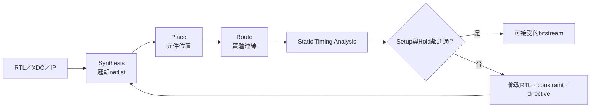
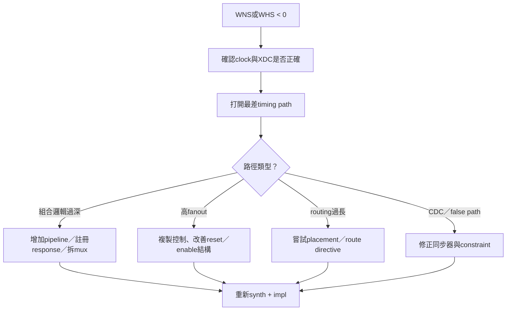

# Vivado Timing Closure 與結果判定

> 本頁由早期timing設定紀錄遷移，說明「build完成」與「硬體能在目標clock可靠運作」的差別，以及目前已使用過的implementation策略。日常build入口仍以 [PROGRAM_FPGA.md](PROGRAM_FPGA.md) 為準。

## 1. Timing closure是什麼

Synthesis把RTL轉成邏輯netlist；implementation再進行placement與routing。實際FPGA上的register-to-register路徑必須在clock要求內完成。



Vivado顯示`write_bitstream Complete`不代表timing一定通過。本專案build script會在發布輸出前另外檢查setup WNS與hold WHS。

## 2. 重要指標

| 指標 | 全名 | 判定 |
|---|---|---|
| WNS | Worst Negative Slack | 最差setup slack，必須 `>= 0` |
| TNS | Total Negative Slack | 所有setup violation總和，應為0 |
| WHS | Worst Hold Slack | 最差hold slack，必須 `>= 0` |
| THS | Total Hold Slack | 所有hold violation總和，應為0 |
| Failing endpoints | 違反timing的endpoint數 | 應為0 |

```text
Slack > 0：仍有時間餘裕
Slack = 0：剛好滿足要求
Slack < 0：無法保證在目標clock正確工作
```

只看WNS不夠；setup與hold都必須檢查。

### 數字例子：為什麼 bitstream 生成仍可能不合格

假設核心 clock 為 50 MHz：

```text
clock period = 1 / 50 MHz = 20 ns
```

若最差 register-to-register setup path 在考慮 clock uncertainty 後只能使用 20 ns，但資料需要 20.35 ns 才抵達：

```text
setup slack = required time - arrival time
            = 20.00 ns - 20.35 ns
            = -0.35 ns
```

因此 `WNS=-0.35 ns`，表示這條路徑在目標 50 MHz 下不能保證每次都正確。Vivado 仍可能完成 routing 並寫出 `.bit`，但這份 bitstream 不應被當成正式通過。若修改 RTL 後 arrival time 降為 19.20 ns，則 `WNS=+0.80 ns`，setup 才有正餘裕；仍要另外確認 WHS、TNS、THS 與 failing endpoints。

## 3. 自動build如何把關

[`rebuild_vivado_bitstream.tcl`](../../tools/rebuild_vivado_bitstream.tcl) 會：

1. 重新執行synthesis與implementation；
2. 確認兩個run達到100% complete；
3. `open_run impl_1`；
4. 分別取得最差setup與hold path；
5. 若WNS或WHS小於0，拒絕複製／發布bitstream；
6. 只有通過才輸出 `BITSTREAM_OUTPUT`。

因此不能用「Vivado有生成 `.bit`」取代timing判定。

## 4. 已使用過的Implementation directives

早期bring-up中較容易收斂的設定是：

| Step | Directive |
|---|---|
| Place Design | `ExtraTimingOpt` |
| Physical Optimization | `ExploreWithAggressiveHoldFix` |
| Route Design | `AggressiveExplore` |

這些是搜尋策略，不是RTL正確性的證明，也不保證每個版本都最佳。設計變更後仍須讀最新timing report。

### GUI設定

1. 開啟Vivado project；
2. `Project Manager → Settings → Implementation`；
3. 選擇`impl_1`；
4. 設定Place、Physical Optimization與Route directives；
5. reset `impl_1`；
6. 重新Launch Implementation。

### Tcl設定

```tcl
open_project C:/path/to/project.xpr
set_property STEPS.PLACE_DESIGN.ARGS.DIRECTIVE ExtraTimingOpt [get_runs impl_1]
set_property STEPS.PHYS_OPT_DESIGN.ARGS.DIRECTIVE ExploreWithAggressiveHoldFix [get_runs impl_1]
set_property STEPS.ROUTE_DESIGN.ARGS.DIRECTIVE AggressiveExplore [get_runs impl_1]
reset_run impl_1
launch_runs impl_1 -jobs 8
```

目前repository的rebuild Tcl不會替使用者偷偷改directive；它沿用Vivado project的run properties。因此合作交接時應記錄project設定。

## 5. 何時要重跑Synthesis

| 修改內容 | 重跑 `synth_1` | 重跑 `impl_1` |
|---|---:|---:|
| Verilog RTL | 是 | 是 |
| XDC constraint | 是，最安全 | 是 |
| MIG／Clocking Wizard IP | 是 | 是 |
| `FAST_SYNTH`／`PRODUCTION_BUILD` define | 是 | 是 |
| 只有implementation directive | 否 | 是 |
| 只有C／FreeRTOS／Lua source | 否 | 否 |

硬體build與software `.mem` build是兩條不同路徑。

## 6. `FAST_SYNTH`與`PRODUCTION_BUILD`

目前 [`icache_pipeline_top.v`](../../icache_pipeline_top.v) 會在未定義`PRODUCTION_BUILD`時預設啟用`FAST_SYNTH`。這會影響Cache組態、BRAM使用量、timing與實際效能。

在Vivado Verilog Defines中應填入define名稱：

```text
FAST_SYNTH
```

對應Tcl：

```tcl
set_property verilog_define {FAST_SYNTH} [get_filesets sources_1]
```

不要填成`-FAST_SYNTH`，也不要把它當作無上下文的positional option。

正式比較resource或performance時必須記錄當次define；否則兩次測量可能使用不同Cache容量。

## 7. Timing失敗時的處理順序



建議順序：

1. 確認clock定義、generated clock與I/O constraint；
2. 查看起點、終點與logic levels；
3. 確認不是錯誤CDC或未約束path；
4. 修正RTL結構；
5. 再用directive改善placement／routing；
6. 重跑並保存report。

不要只反覆換directive，卻不查看真正的critical path。

## 8. 常見錯誤判斷

| 現象 | 不代表 | 正確處理 |
|---|---|---|
| Synthesis完成 | Implementation與timing通過 | 繼續跑impl與STA |
| Route完成 | WNS／WHS非負 | 打開timing summary |
| 生成 `.bit` | 可作正式release | 檢查setup、hold與DRC |
| 實板偶爾能跑 | Timing可靠 | 仍需通過STA與重複實板測試 |
| 換directive後通過 | RTL一定合理 | 仍記錄critical path與margin |

## 9. 每次交付應保存

```text
Git commit
Vivado版本與FPGA part
Project／top／XDC
Verilog defines
Clock frequencies
Place／phys_opt／route directives
WNS／TNS／WHS／THS
Failing endpoints
LUT／FF／BRAM／DSP
Critical path起點與終點
```

效能基準中的一次歷史結果可見 [PERFORMANCE_BASELINE_ANALYSIS.md](../06-verification/PERFORMANCE_BASELINE_ANALYSIS.md)。

## 10. 本頁不涵蓋的問題

下列問題不能靠implementation directive解決：

- MIG pin planning或calibration錯誤；
- Clocking Wizard IP遺失／AutoDisabled；
- UART baud與有效clock不一致；
- 功能RTL錯誤；
- 不正確的CDC；
- Software application錯誤。

這些應分別回到 [CLOCK_RESET.md](../01-architecture/CLOCK_RESET.md)、[L2_CACHE_DDR2.md](../02-memory-io/L2_CACHE_DDR2.md)、[UART.md](../02-memory-io/UART.md) 與verification文件定位。
