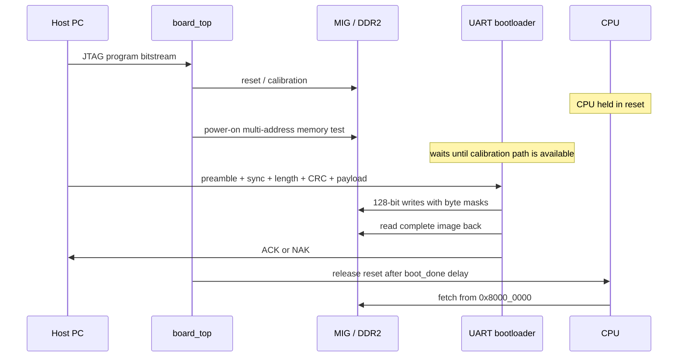
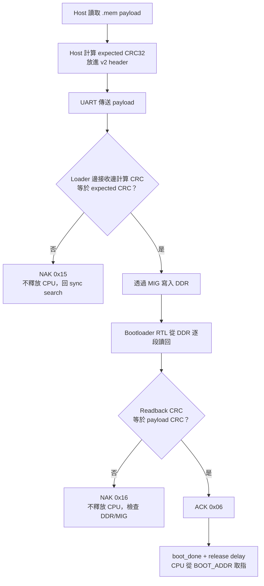

# UART Bootloader 與映像驗證

本文件從「上電到 CPU 開始執行」的角度說明 UART bootloader。MMIO runtime UART 的 register 與 FreeRTOS RX buffer 請見 [UART.md](../02-memory-io/UART.md)；本頁專注在 binary firmware upload。

主要實作：[`uart_bootloader.v`](../../uart_bootloader.v)、[`icache_pipeline_top.v`](../../icache_pipeline_top.v)、[`uart_send_mem.py`](../../uart_send_mem.py) 與 [`tools/rtos_board_runner.py`](../../tools/rtos_board_runner.py)。

## 1. Bootloader 解決什麼問題

FPGA bitstream 建立 CPU 與 DDR2 controller，但 application machine code 不固定燒在 bitstream 裡。Bootloader 的工作是：

1. 等 DDR2 可用；
2. 從板載 USB-UART 接收 firmware；
3. 寫到 DDR `0x8000_0000`；
4. 驗證 UART payload 與 DDR 實際內容；
5. 驗證成功後才釋放 CPU reset。

所以「Vivado programming 成功」只表示硬體已配置，不表示 CPU 已有 application 可執行。

## 2. 上電與 ownership 時序



MIG app interface 的 ownership 優先序為 power-on memtest、bootloader、L2/CPU。CPU 被 reset hold 時不會與 bootloader 同時任意修改 DDR。

## 3. 固定參數

| 參數 | 目前值 | 意義 |
|---|---:|---|
| UART | 115200 baud | host 與 loader 必須一致 |
| UART clock parameter | 50 MHz | standard MIG UI-clock 路徑 |
| `BOOT_ADDR` | `0x8000_0000` | payload 第一個 byte 的 DDR 位址 |
| 最大 payload | 8 MiB | `MAX_BYTES = 8,388,608` |
| RX FIFO | 64 bytes | 吸收短期 MIG back-pressure |
| incomplete-frame timeout | 約 1 秒 | header/data/DDR handshake 卡住時返回 sync search |

`ENABLE_RX_AUTODETECT` 在模組中存在，但目前 standard board integration 沒有啟用；正常操作應固定使用正確的 115200 baud，而不是依賴自動偵測。

## 4. Protocol v1

Wire frame：

```text
offset  size  field
0       4     SYNC = 0xC0DE5A5A, little-endian bytes 5A 5A DE C0
4       4     payload length N, uint32 little-endian
8       N     payload bytes
```

v1 仍會在寫入後重新讀取 DDR 並檢查內容 CRC，但 header 沒有 host 提供的 expected payload CRC，也沒有 ACK/NAK contract。Host 只能知道 bytes 已送出，不能從 protocol 回覆確認完整映像被接受。

v1 只保留給舊 bitstream／舊 host 相容，新流程應用 v2。

## 5. Protocol v2

Wire frame：

```text
offset  size  field
0       4     SYNC = 0xC0DE5A5B, little-endian bytes 5B 5A DE C0
4       4     payload length N, uint32 little-endian
8       4     expected CRC32, uint32 little-endian
12      N     payload bytes
```

CRC 是 zlib-compatible reflected IEEE CRC32。Host 在傳送當下，對 `.mem` 還原出的 payload bytes 計算：

```python
zlib.crc32(payload) & 0xFFFFFFFF
```

它不是編譯器寫入 `.mem` 的欄位；重新建置或修改 payload 後，uploader 每次會重新計算。

### 最小 v2 frame 範例

假設只傳送一個 32-bit RISC-V NOP `0x00000013`。`.mem` 文字中的 word 是：

```text
00000013
```

在線上 payload 中按 little-endian 排成 4 bytes：

```text
13 00 00 00
```

這 4 bytes 的 `zlib.crc32()` 為 `0x63E8276D`，所以完整 v2 frame（先省略 `0x55` preamble）是：

```text
5B 5A DE C0 | 04 00 00 00 | 6D 27 E8 63 | 13 00 00 00
^ sync LE      ^ length=4     ^ CRC32 LE     ^ payload
```

這個例子同時說明三件事：`.mem` 的八位十六進位 word 不是直接照字串順序傳送；length 與 CRC 都使用 little-endian；CRC 是 uploader 針對實際 payload bytes 臨時計算後放進 header。

## 6. v2 的兩層完整性驗證

### 第一層：UART payload CRC

Loader 接收每個 byte時更新 CRC。完整 payload 收完且最後一個 MIG write 接受後，將計算值與 header 的 expected CRC 比較。

失敗時：

- 不釋放 CPU；
- 傳出 `0x15`；
- 清理接收狀態並回到 sync search。

這層可發現 UART 傳輸、丟 byte、重複 byte、順序或 host payload 錯誤。

### 第二層：DDR readback CRC

即使 UART CRC 正確，loader 仍從 DDR `BOOT_ADDR` 開始，透過 MIG 把整個 image 重新讀回，對實際讀到的 bytes 再算 CRC。它比較的是 DDR readback 結果與剛接收的 payload CRC，不是 CPU 自己執行 C code 做檢查。

失敗時：

- 不釋放 CPU；
- 傳出 `0x16`；
- 回到 sync search。

這層涵蓋 DDR write/read path、MIG handshake、address、mask 與資料保存錯誤。

兩層都成功後，loader先傳完 `0x06` ACK，再設 `boot_done`，top-level 等 release interval 後才讓 CPU 執行。



第一個 CRC 回答「UART 收到的 bytes 是否正確」，第二個 CRC 回答「真正留在 DDR、之後要被 CPU 取指的 bytes 是否正確」。第二層由 bootloader RTL 經 MIG 讀回，不是已啟動的 CPU 在跑 C 程式。

| 回覆 byte | 意義 | Host 行動 |
|---:|---|---|
| `0x06` | v2 payload CRC 與 DDR readback 都通過 | 接收 application UART output |
| `0x15` | UART payload CRC mismatch | 重送完整 frame |
| `0x16` | DDR readback mismatch | 重送完整 frame；重複發生時檢查 DDR/MIG/bitstream |

## 7. DDR write packing

MIG data width 是 128-bit，即 16 bytes。Loader：

1. 將 serial bytes依序填入 128-bit buffer；
2. buffer 滿 16 bytes後送一個 MIG write command/data；
3. command `app_rdy` 與 write data `app_wdf_rdy` 可在不同 cycle 接受，loader 分別記錄；
4. 最後不足 16 bytes時，以 `app_wdf_mask` 遮住無效 lanes；
5. 下一個 beat address 增加 16。

64-byte RX FIFO 讓 UART 接收不必在短暫 MIG stall 時立刻丟資料，但它不是無限流控。Host 仍預設使用小 chunk 與 pacing。

## 8. Preamble、chunk 與 settle delay

現行 host 預設：

| 參數 | 預設 | 作用 |
|---|---:|---|
| preamble | 4096 bytes `0x55` | 給 reset/MIG/receiver時間並產生規律 UART transitions |
| chunk size | 32 payload bytes | host 每次 write 的大小 |
| chunk delay | 1 ms | 每個 payload chunk 間停頓 |
| sync settle | 20 ms | sync/takeover 後等 reset/MIG mux 穩定 |
| header settle | 5 ms | length/CRC header 後再送 payload |
| ACK timeout | 2 s | v2 等待 ACK/NAK 的時間 |
| attempts | 5 | v2 frame 最大嘗試次數 |

`0x55` preamble 與 chunking 都是 host-side可靠性措施，不是 frame payload，也不是「每個 chunk 有自己的 CRC」的 wire protocol。整個 v2 image 只有 header 中的一個 full-payload CRC。

## 9. 單獨上傳 `.mem`

```powershell
python ./uart_send_mem.py `
  --port COM5 `
  --baud 115200 `
  --mem ./TEST_FILES/mem_game.mem `
  --protocol v2 `
  --preamble 4096 `
  --interactive
```

重要：每個 option 之間必須有空白。以下是錯誤寫法：

```text
--preamble 4096--interactive
```

Argument parser 會把 `4096--interactive` 當成同一個整數值，因而回報 `invalid int value`。

其他模式：

```powershell
# 只監看 UART；最後一筆資料後再等待 10 秒
python ./uart_send_mem.py --port COM5 --mem app.mem --listen --listen-seconds 10

# 舊 bitstream 相容模式
python ./uart_send_mem.py --port COM5 --mem app.mem --protocol v1
```

`--delay` 是開啟 COM 後、開始 preamble 前的等待；`--preamble-seconds` 會再依 baud 估算一段 timed `0x55` leader。它們與 `--preamble` 是不同參數。

## 10. Rearm 與切換另一個 image

Loader 在 `S_DONE` 仍監看 reserved sync word。即使 CPU application wedged，只要 host 再送出完整 sync，loader也能撤回 `boot_done`、重新取得 DDR ownership 並接收新 frame。

RTOS application 若支援 `reload`，會經 MMIO `0x4000_0014` 呼叫 board control：

1. 等 runtime UART TX idle；
2. 發出 launcher reset request；
3. hardware 等約 100 ms drain interval；
4. reset CPU、rearm bootloader；
5. host 再傳下一個 image。

整合 runner會先送 paced `reload`，也使用 v2 sync takeover作為恢復路徑。若仍失敗，可按 Nexys A7 的 CPU RESETN；這會重置更大的板級路徑，需重新等待 MIG calibration，但不需要重新 JTAG programming，除非 bitstream 已因斷電消失。

## 11. Bootloader 與 runtime UART 的 ownership

同一組實體 USB-UART pins 在不同階段由不同邏輯使用：

- `boot_done=0`：bootloader接收 firmware，bootloader TX 回 ACK/NAK；
- `boot_done=1`：CPU runtime UART TX 成為主要輸出，application透過 MMIO 收發；
- loader仍監看 RX 上的 reserved binary sync，以支援 takeover。

正常文字幾乎不會無意形成四個 reserved sync bytes，但 binary application protocol若可能輸出該序列到 RX，應明確評估與 loader takeover marker 的衝突。

## 12. Failure 分層判斷

| 現象 | 優先檢查 |
|---|---|
| 看不到 UART edge/status | COM port、baud、USB cable、pin direction、board power |
| 看得到 edge但找不到 sync | baud/clock mismatch、錯誤 protocol sync、過早傳送 |
| `0x15` | serial payload corruption；保留 pacing，降低 chunk size或增加 delay |
| `0x16` | DDR write/readback path；重複發生時跑 MIG/memtest與 bootloader regression |
| 沒 ACK/NAK | 舊 v1 bitstream、loader尚未 ready、TX mux／baud錯誤 |
| ACK 後沒有文字 | image本身、reset PC、linker、CPU/Cache或 target UART marker 問題 |
| 偶爾成功 | COM contention、太早傳、pacing不足、reset/rearm race 或不穩定的 physical link |

## 13. 驗證 testbenches

| Testbench | 覆蓋內容 |
|---|---|
| `uart_bootloader_tb.v` | v1/v2、ACK、兩種 NAK、rearm、S_DONE host-sync recovery |
| `uart_bootloader_stall_tb.v` | MIG ready stall |
| `uart_bootloader_split_ready_tb.v` | command/data 分離 ready |
| `uart_bootloader_large_crc_tb.v` | 大型 Lua image CRC 與完整 DDR readback |
| `uart_mmio_tb.v` | runtime UART，不是 firmware loader本身 |

典型執行方式：

```powershell
iverilog -g2005-sv -DFAST_SIM -i `
  -o build_os/uart_bootloader_tb.out `
  -s uart_bootloader_tb *.v
vvp build_os/uart_bootloader_tb.out
```

上板流程建議透過 [RTOS_APP_RUNNER.md](RTOS_APP_RUNNER.md) 的 preflight + target 機制，而不是每次手動猜測 reset／等待時間。
