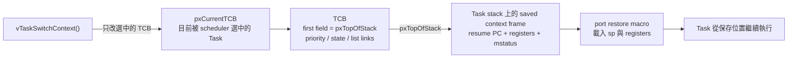
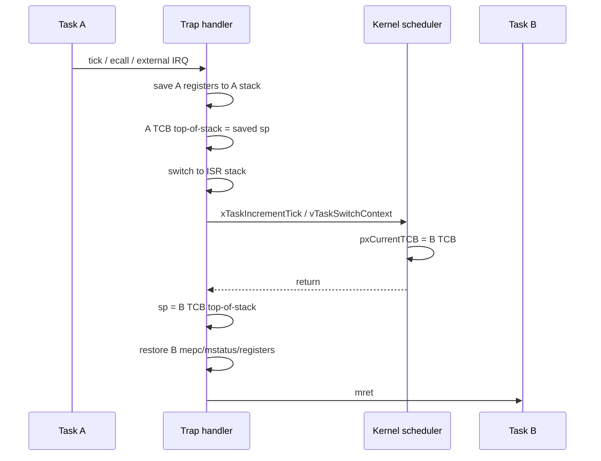

# Context Switch 詳解

Context switch是CPU從Task A停止，保存A的執行狀態，再恢復Task B狀態的過程。FreeRTOS排程決策主要在C kernel中；真正保存／恢復RISC-V registers則由官方port assembly完成。

## 1. Context包含什麼

對單核心RV32 CPU而言，Task要能像「從沒離開過」一樣繼續，需要保存：

- resume PC；
- integer registers；
- `mstatus`；
- critical nesting count；
- 該Task的stack pointer位置。

目前不需保存FPU/vector context，因為CPU與build target沒有這些extensions。

## 2. 哪些register會保存

RV32I port context frame是31個word，共124 bytes：

| Stack slot | 內容 |
|---:|---|
| 0 | resume PC，restore時寫入 `mepc` |
| 1 | `x1/ra` |
| 2..4 | `x5..x7` (`t0..t2`) |
| 5..6 | `x8..x9` (`s0..s1`) |
| 7..14 | `x10..x17` (`a0..a7`) |
| 15..24 | `x18..x27` (`s2..s11`) |
| 25..28 | `x28..x31` (`t3..t6`) |
| 29 | `xCriticalNesting` |
| 30 | `mstatus` |

沒有逐項保存：

- `x0`：硬體固定為0；
- `x2/sp`：保存後的stack pointer寫在TCB第一個member；
- `x3/gp`：port假設所有Task共用同一global pointer；
- `x4/tp`：port假設constant；
- chip-specific registers：目前additional context size為0。

## 3. Task stack、TCB與`pxCurrentTCB`

FreeRTOS TCB第一個field是Task目前的top-of-stack。Global `pxCurrentTCB` 指向正在執行的TCB。



Context save最後做：

```text
pxCurrentTCB->pxTopOfStack = sp
```

`vTaskSwitchContext()` 只需選出新的TCB並改變 `pxCurrentTCB`；restore macro再從新TCB載入`sp`。

## 4. 新Task的初始frame

`xTaskCreate()`／`xTaskCreateStatic()` 最終呼叫assembly `pxPortInitialiseStack()`，預先在新Task stack上偽造一個「已被中斷過」的frame：

- slot 0 = Task function (`pxCode`)；
- `a0/x10` slot = `pvParameters`；
- `ra` slot = `portTASK_RETURN_ADDRESS`，目前預設0；
- critical nesting = 0；
- `mstatus` 設定machine previous privilege與interrupt return bits；
- 其餘register初值不具application語意。

Scheduler第一次restore此frame後，Task function看起來就像普通C函式被呼叫：argument出現在`a0`。

## 5. 第一次啟動不是一般switch

`vTaskStartScheduler()`：

1. 建立/確認Idle與Timer Tasks；
2. `xPortStartScheduler()`設定tick timer；
3. enable `mie.MTIE`與`mie.MEIE`；
4. 呼叫 `xPortStartFirstTask()`；
5. 從 `pxCurrentTCB` 載入第一個Task stack；
6. 恢復register、critical nesting、`mstatus`；
7. 額外設定MIE；
8. 用 `ret` 進入Task function。

第一個Task用`ret`而不是`mret`啟動，因此port在此路徑明確打開`mstatus.MIE`。之後從trap回Task則用`mret`。

## 6. Trap時如何保存context

統一trap入口先在目前Task stack上減少124 bytes，寫入register、critical nesting與`mstatus`，再把saved `sp`寫進目前TCB。

接著：

- 讀取 `mcause`與`mepc`；
- asynchronous interrupt保存原始`mepc`；
- synchronous exception把resume PC設為`mepc + 4`；
- 將CPU `sp`切換到dedicated ISR stack；
- 呼叫C kernel／ISR handler。

使用獨立ISR stack的原因是handler自己的C call chain不應繼續消耗被中斷Task的stack。

## 7. 為何synchronous PC要加4

本專案固定32-bit instruction，不支援RVC。`ecall`是4-byte instruction：

```text
mepc -> ecall
resume PC = mepc + 4
```

若不加4，`mret`後會再次執行同一個`ecall`，形成無限trap。這個generic port邏輯依賴固定指令寬度；若未來加入RVC，不能一律硬加4。

對timer/UART等asynchronous interrupt，`mepc`已表示被中斷後應返回的位置，不需加4。

## 8. 會觸發switch的路徑

### 主動yield

```c
taskYIELD();
```

`portYIELD()`執行`ecall`。Trap handler辨識M-mode environment call (`mcause=11`)，呼叫 `vTaskSwitchContext()`。

### Tick preemption／time slicing

Timer ISR更新compare後呼叫 `xTaskIncrementTick()`。若有更高priority Task解除blocked，或同priority Tasks需要time slice，回傳nonzero並呼叫 `vTaskSwitchContext()`。

### Blocking API

例如Queue空時：

```c
xQueueReceive(queue, &item, portMAX_DELAY);
```

Kernel把目前Task移到blocked list，選另一個ready Task。實際yield可能在kernel內透過port macro發生。

### ISR喚醒Task

```c
BaseType_t higher = pdFALSE;
xQueueSendFromISR(queue, &item, &higher);
portYIELD_FROM_ISR(higher);
```

此時interrupt entry已保存context；`portYIELD_FROM_ISR`只在需要時呼叫`vTaskSwitchContext()`。共同restore path會直接恢復新Task。

## 9. 完整A→B切換



若scheduler判定仍應執行A，`pxCurrentTCB`不變，restore同一份frame；即使發生trap也不一定真的換Task。

## 10. Priority與切換條件

本專案priority範圍0..4，數字越大越優先：

- 較高priority Task一旦ready，可在preemptive模式搶占；
- 同priority Tasks在每個tick有time slicing；
- 較低priority Task只有在高priority Tasks blocked/delayed/suspended時執行；
- Idle Task固定priority 0；
- Timer service Task目前priority 4。

Context switch本身不會「同時執行」兩個Task。這是單核心CPU，任一時刻只有一個Task instruction stream在running。

## 11. Critical nesting也屬於context

目前 `portCRITICAL_NESTING_IN_TCB=0`，所以port使用global `xCriticalNesting`，但每次context save把它放入Task frame，restore時取回。

這代表Task A可在nested critical section中被某些受控路徑保存，Task B仍恢復自己的nesting狀態。不過正常程式不應在critical section內呼叫blocking/yield API；那會破壞real-time與kernel使用假設。

初始 `xCriticalNesting=0xAAAAAAAA`，目的是scheduler啟動前避免意外把interrupt打開；每個新Task初始frame中的nesting則是0。

## 12. ISR stack

`configISR_STACK_SIZE_WORDS=256`，在RV32是：

```text
256 words × 4 bytes = 1024 bytes
```

Port將它16-byte aligned，scheduler啟動時以`0xEE`填滿，方便偵測使用量。它和：

- linker的64 KiB startup stack；
- 每個Task stack；
- FreeRTOS heap；

是不同記憶體區域。更多容量分析見 [HEAP_AND_STACK.md](HEAP_AND_STACK.md)。

## 13. Nested interrupt

RISC-V trap entry會清global MIE並保存到MPIE。現行handler沒有在處理中重新enable MIE，所以一般情況下不允許nested interrupt。優點是context與ISR stack模型較簡單；代價是長ISR會延遲timer與其他external IRQ。

因此ISR應：

- 讀／清最少hardware狀態；
- 使用`...FromISR()` API；
- 必要時喚醒Task；
- 把解析、字串輸出與長運算留給Task。

## 14. Task return為何危險

Task function原型：

```c
void task(void *arg);
```

Task function 直接 `return` 不受 FreeRTOS 支援。一般由 context frame 恢復的 Task 會使用 port 準備的 return address，而第一個 Task 又有特殊的啟動路徑，因此 application 不應依賴任何一條 return 路徑。有限生命週期 Task 應明確刪除自己：

```c
static void one_shot_task(void *arg)
{
    (void)arg;
    /* work */
    vTaskDelete(NULL);
}
```

## 15. Context switch成本與觀測

一次trap/switch至少涉及：

- 保存/恢復31-word frame；
- Task stack與TCB memory accesses；
- trap pipeline flush／redirect；
- scheduler ready-list操作；
- Cache hit/miss影響。

所以Task數量增加不代表每個tick都應切換所有Task。高頻yield、過短period與大量同priority runnable Tasks會提高排程overhead。

可用：

- `uxTaskGetSystemState()` runtime stats；
- `uxTaskGetStackHighWaterMark()`；
- MMIO performance counters的interrupt、flush、retired instruction；
- Console `status/tasks/perf`；

觀察行為，但量測時要記錄workload、tick rate與UART輸出量。

## 16. 常見誤解

| 誤解 | 正確說法 |
|---|---|
| 每個Task有一顆CPU | 單核心輪流執行，透過context switch形成並行感 |
| tick一定會換Task | 只有排程條件成立才改變`pxCurrentTCB` |
| Queue本身是一個Task | Queue是kernel object；Task呼叫API後可能block／unblock |
| 只保存callee-saved registers | Trap可發生在任何instruction間，port保存完整integer context |
| ISR用被中斷Task stack到底 | context frame先在Task stack，handler C code改用dedicated ISR stack |
| Task return會回main | Scheduler啟動後沒有這種call chain；應`vTaskDelete(NULL)` |
