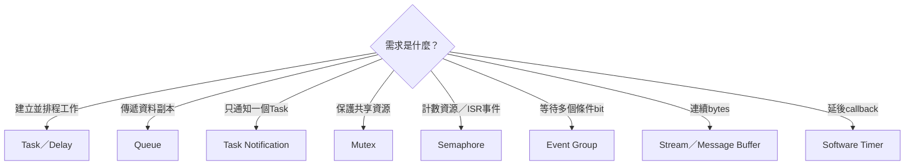

# FreeRTOS API 範例

本文件用本專案已啟用的主要API，示範如何撰寫新的RTOS application；現有smoke／console／platform firmware已涵蓋其中多個核心路徑，但不代表每個API與參數組合都已實板測試。範例以RV32IM、single-core、1 kHz tick與目前 [`FreeRTOSConfig.h`](../../OS/rtos/config/FreeRTOSConfig.h) 為準。

API 範例重點不只是「函式怎麼呼叫」，也包括呼叫者是在 Task 或 ISR、資料 ownership、timeout 與失敗處理。完整架構先閱讀 [FREERTOS_PORT_ARCHITECTURE.md](FREERTOS_PORT_ARCHITECTURE.md)，記憶體單位請閱讀 [HEAP_AND_STACK.md](HEAP_AND_STACK.md)。

## API 查找地圖



本頁是查詢手冊，不建議從頭讀到尾。先用上圖選物件，再跳到同名章節；若還沒決定該選什麼，先讀 [RTOS_APPLICATION_API_GUIDE.md](../05-applications/RTOS_APPLICATION_API_GUIDE.md)。要確認每個API目前是已驗證、可使用或未啟用，查 [RTOS_PLATFORM_API_REFERENCE.md](../05-applications/RTOS_PLATFORM_API_REFERENCE.md)；要逐項查參數與回傳值，見 [RTOS_PLATFORM_API_PARAMETER_GUIDE.md](../05-applications/RTOS_PLATFORM_API_PARAMETER_GUIDE.md)。

## 1. 常用 header

```c
#include "FreeRTOS.h"
#include "task.h"
#include "queue.h"
#include "semphr.h"
#include "event_groups.h"
#include "stream_buffer.h"
#include "timers.h"
```

只 include 實際使用的物件 header。`FreeRTOS.h` 應放在其他 FreeRTOS header 前面，讓 configuration 與基本型別先建立。

## 2. 最小 application 結構

```c
#include "FreeRTOS.h"
#include "task.h"

static StaticTask_t app_tcb;
static StackType_t app_stack[384];

static void app_task(void *arg)
{
    (void)arg;

    for (;;) {
        /* 執行一小段工作。 */
        vTaskDelay(pdMS_TO_TICKS(100));
    }
}

int main(void)
{
    TaskHandle_t handle = xTaskCreateStatic(
        app_task,
        "app",
        384,
        NULL,
        2,
        app_stack,
        &app_tcb
    );

    configASSERT(handle != NULL);
    vTaskStartScheduler();

    /* 正常情況不會到這裡。 */
    for (;;) {
    }
}
```

這個 firmware 仍然會編入 FreeRTOS kernel 與 RISC-V port。它不需要使用 console；`main()` 可以只建立你自己的 Task 和物件。scheduler 啟動後，`main()` 本身不會被自動變成 Task，也通常不會繼續執行。

## 3. 靜態與動態 Task

### 3.1 靜態 Task

```c
#define SENSOR_STACK_WORDS 384u

static StaticTask_t sensor_tcb;
static StackType_t sensor_stack[SENSOR_STACK_WORDS];

TaskHandle_t sensor = xTaskCreateStatic(
    sensor_task,
    "sensor",
    SENSOR_STACK_WORDS,
    &sensor_config,
    2,
    sensor_stack,
    &sensor_tcb
);

configASSERT(sensor != NULL);
```

`sensor_config` 的生命週期也必須長於 Task；若傳的是 pointer，FreeRTOS 只保存 pointer，不會複製參數物件。

### 3.2 動態 Task

```c
TaskHandle_t sensor = NULL;

if (xTaskCreate(
        sensor_task,
        "sensor",
        384,
        &sensor_config,
        2,
        &sensor) != pdPASS) {
    /* heap 不足或參數錯誤：不要使用 sensor。 */
}
```

`384` 是 words，在本專案等於 1536 bytes。動態 Task 的 TCB 與 stack 由 `heap_4` 配置。

### 3.3 一次性 Task

```c
static void one_shot_task(void *arg)
{
    Job *job = (Job *)arg;
    run_job(job);
    vTaskDelete(NULL);
}
```

Task function 不可直接 `return`。動態 Task 刪除後的資源需要 Idle Task 執行才能完成回收，因此不要讓高優先權 Task 永遠占住 CPU。

## 4. Delay 與週期性執行

### 4.1 從現在延遲

```c
for (;;) {
    poll_device();
    vTaskDelay(pdMS_TO_TICKS(20));
}
```

週期約為「工作時間 + 20 ms」，適合不要求固定 phase 的背景工作。

### 4.2 固定週期

```c
static void control_task(void *arg)
{
    const TickType_t period = pdMS_TO_TICKS(10);
    TickType_t last_wake = xTaskGetTickCount();
    (void)arg;

    for (;;) {
        run_control_step();
        xTaskDelayUntil(&last_wake, period);
    }
}
```

`xTaskDelayUntil()` 以先前的預定 wake time 為基準，比每次從「現在」延遲更適合固定頻率工作。如果 `run_control_step()` 超過 period，Task 不會神奇補回時間；應記錄 overrun 並重新評估 workload、priority 或 period。

本專案 1 tick = 1 ms。仍建議用 `pdMS_TO_TICKS()`，避免日後更改 tick rate時留下 magic number。

## 5. Queue：傳送資料副本

```c
typedef struct {
    uint32_t sequence;
    int32_t value;
} Sample;

#define SAMPLE_QUEUE_LENGTH 8u

static StaticQueue_t sample_queue_cb;
static Sample sample_queue_storage[SAMPLE_QUEUE_LENGTH];
static QueueHandle_t sample_queue;

static void create_objects(void)
{
    sample_queue = xQueueCreateStatic(
        SAMPLE_QUEUE_LENGTH,
        sizeof(Sample),
        (uint8_t *)sample_queue_storage,
        &sample_queue_cb
    );
    configASSERT(sample_queue != NULL);
}
```

Producer：

```c
Sample sample = {
    .sequence = next_sequence++,
    .value = read_value()
};

if (xQueueSend(sample_queue, &sample, pdMS_TO_TICKS(5)) != pdPASS) {
    /* Queue 5 ms 內仍滿：記錄 drop 或採用其他政策。 */
}
```

Consumer：

```c
Sample sample;

for (;;) {
    if (xQueueReceive(sample_queue, &sample, portMAX_DELAY) == pdPASS) {
        process_sample(&sample);
    }
}
```

Queue 會複製整個 `Sample`，Producer 的區域變數離開 scope 仍安全。若 Queue 傳的是 pointer，只會複製 pointer，buffer ownership 與生命週期必須由 application 規定。

## 6. Queue 的不同送入方式

```c
xQueueSendToBack(queue, &item, timeout);    /* 一般 FIFO。 */
xQueueSendToFront(queue, &urgent, timeout); /* 放到最前端。 */
xQueueOverwrite(queue, &latest);            /* 只適合長度 1 的 Queue。 */
```

`xQueueOverwrite()` 常用於「只在意最新狀態」，但 Queue 必須設計成長度 1。對一般 Queue 應明確處理 full，而不是假設 overwrite 能安全取代排隊策略。

## 7. Mutex：保護共享資源

```c
static StaticSemaphore_t log_mutex_cb;
static SemaphoreHandle_t log_mutex;

static void create_log_mutex(void)
{
    log_mutex = xSemaphoreCreateMutexStatic(&log_mutex_cb);
    configASSERT(log_mutex != NULL);
}

static BaseType_t write_record(const Record *record)
{
    if (xSemaphoreTake(log_mutex, pdMS_TO_TICKS(20)) != pdPASS) {
        return pdFAIL;
    }

    update_shared_log(record);
    xSemaphoreGive(log_mutex);
    return pdPASS;
}
```

Mutex 有 ownership 與 priority inheritance：取得它的 Task 應由同一 Task 歸還。禁止在 ISR take/give mutex。也不要拿著 mutex 呼叫可能長時間 blocking 的函式，否則其他使用者即使 priority 較高也必須等待。

所有離開路徑都必須 give：

```c
if (xSemaphoreTake(mutex, timeout) == pdPASS) {
    BaseType_t ok = do_protected_work();
    xSemaphoreGive(mutex);
    return ok;
}
```

## 8. Recursive mutex

若同一 Task 的巢狀函式確實需要重複取得同一把鎖，可用：

```c
static StaticSemaphore_t recursive_cb;
SemaphoreHandle_t recursive =
    xSemaphoreCreateRecursiveMutexStatic(&recursive_cb);

if (xSemaphoreTakeRecursive(recursive, timeout) == pdPASS) {
    nested_operation();
    xSemaphoreGiveRecursive(recursive);
}
```

每次成功 take 都要有對應 give。Recursive mutex 不應拿來掩蓋不清楚的 ownership；能整理 call graph、只在最外層上鎖時，普通 mutex 更容易分析。

## 9. Binary／counting semaphore

Semaphore 適合表示事件或可用資源數量，不攜帶 application payload。

### Counting semaphore

```c
static StaticSemaphore_t slots_cb;
SemaphoreHandle_t slots = xSemaphoreCreateCountingStatic(
    4,  /* maximum count */
    4,  /* initial count */
    &slots_cb
);

if (xSemaphoreTake(slots, pdMS_TO_TICKS(10)) == pdPASS) {
    use_one_resource();
    xSemaphoreGive(slots);
}
```

它可表示 4 個同類資源。若還需要傳送每個工作的資料，通常要搭配 Queue，而不是只用 semaphore 計數。

### ISR 發出事件

```c
void device_irq_handler(void)
{
    BaseType_t higher_priority_task_woken = pdFALSE;

    clear_device_irq();
    xSemaphoreGiveFromISR(event_sem, &higher_priority_task_woken);
    portYIELD_FROM_ISR(higher_priority_task_woken);
}
```

## 10. Task notification

若事件只需要送給一個已知 Task，Task notification 通常比另外建立 Queue／semaphore 更小、更直接。

接收 Task：

```c
for (;;) {
    uint32_t count = ulTaskNotifyTake(
        pdTRUE,       /* 返回時把 count 清為 0。 */
        portMAX_DELAY
    );
    handle_events(count);
}
```

其他 Task 發出通知：

```c
xTaskNotifyGive(receiver_task);
```

ISR 發出通知：

```c
BaseType_t higher_priority_task_woken = pdFALSE;
vTaskNotifyGiveFromISR(receiver_task, &higher_priority_task_woken);
portYIELD_FROM_ISR(higher_priority_task_woken);
```

本專案設定每個 Task 有一個 notification entry。Notification value 是 32-bit，可用計數、bit set 或覆寫等模式；選定語意後要讓 sender 與 receiver 使用相符 API，避免同一個 entry 同時被當成多種協定。

## 11. Event group

Event group 適合等待多個狀態 bit：

```c
#define EVENT_UART_READY (1u << 0)
#define EVENT_DATA_READY (1u << 1)

static StaticEventGroup_t events_cb;
EventGroupHandle_t events = xEventGroupCreateStatic(&events_cb);

EventBits_t bits = xEventGroupWaitBits(
    events,
    EVENT_UART_READY | EVENT_DATA_READY,
    pdTRUE,   /* 成功返回時清除等待的 bits。 */
    pdTRUE,   /* 必須兩個 bits 都存在。 */
    pdMS_TO_TICKS(100)
);

if ((bits & (EVENT_UART_READY | EVENT_DATA_READY)) ==
    (EVENT_UART_READY | EVENT_DATA_READY)) {
    start_processing();
}
```

Event bit 只表示狀態／事件，不攜帶每筆資料。需要保留多筆資料時仍應使用 Queue 或 StreamBuffer。ISR 應使用對應的 `...FromISR()` API，並注意某些 event-group ISR 操作會把實際工作交給 Timer service Task，因此 timer command queue 容量與 Timer Task priority 也會影響延遲。

## 12. StreamBuffer：byte stream

StreamBuffer 適合單一 writer、單一 reader 的連續 bytes。本專案 UART RX 使用 256-byte storage array，把 ISR 收到的 byte 交給 Task。FreeRTOS ring buffer 會保留一個 byte 來區分 full 與 empty，因此目前 UART StreamBuffer 的實際可用容量是 255 bytes。

```c
#define RX_CAPACITY_BYTES 256u

static StaticStreamBuffer_t rx_stream_cb;
static uint8_t rx_storage[RX_CAPACITY_BYTES + 1u];
static StreamBufferHandle_t rx_stream;

rx_stream = xStreamBufferCreateStatic(
    sizeof(rx_storage),
    1,                    /* trigger level */
    rx_storage,
    &rx_stream_cb
);
configASSERT(rx_stream != NULL);
```

`xStreamBufferCreateStatic()` 的第一個參數是提供的 storage bytes；實際可存 payload 是該值減 1。上例要得到 256-byte 可用容量，所以陣列與傳入大小都是 257 bytes。專案目前 [`uart.c`](../../OS/rtos/src/uart.c) 傳入 256-byte storage，因此其可用容量是 255 bytes；原始碼中的名稱描述的是 storage 大小，不是可用 payload 上限。

Task 接收：

```c
uint8_t bytes[32];
size_t count = xStreamBufferReceive(
    rx_stream,
    bytes,
    sizeof(bytes),
    portMAX_DELAY
);
```

ISR 送入：

```c
BaseType_t higher_priority_task_woken = pdFALSE;
uint8_t byte = read_uart_rx();
size_t sent = xStreamBufferSendFromISR(
    rx_stream,
    &byte,
    1,
    &higher_priority_task_woken
);

if (sent != 1) {
    /* Software StreamBuffer full：記錄 software overrun/drop。 */
}
portYIELD_FROM_ISR(higher_priority_task_woken);
```

StreamBuffer 預設只支援單一 writer 與單一 reader。若有多個 writer/reader，需在 application 外部序列化，或改用更符合需求的 Queue。

## 13. Software timer

```c
static StaticTimer_t heartbeat_timer_cb;
static TimerHandle_t heartbeat_timer;

static void heartbeat_callback(TimerHandle_t timer)
{
    (void)timer;
    xTaskNotifyGive(heartbeat_task_handle);
}

static void create_heartbeat_timer(void)
{
    heartbeat_timer = xTimerCreateStatic(
        "heartbeat",
        pdMS_TO_TICKS(1000),
        pdTRUE,  /* auto reload */
        NULL,
        heartbeat_callback,
        &heartbeat_timer_cb
    );
    configASSERT(heartbeat_timer != NULL);
    configASSERT(xTimerStart(heartbeat_timer, 0) == pdPASS);
}
```

Software timer callback 由 priority 4 的 Timer service Task 執行，不是在 machine timer ISR 執行。callback 可以呼叫 Task-context API，但不應長時間 block，也不應執行大型工作；較好的做法是發 Queue／notification，讓工作 Task 處理。

`xTimerStart(..., 0)` 的第二個參數是向 timer command queue 送命令時可等待的 ticks。scheduler 尚未啟動前通常使用 0；scheduler 執行後仍應處理 command queue full 的可能。

## 14. Queue set

當一個 coordinator Task 要等待多個 Queue／semaphore，可建立 Queue set：

```c
QueueSetHandle_t set = xQueueCreateSet(
    COMMAND_QUEUE_LENGTH + COMPLETION_MAX_COUNT
);
configASSERT(set != NULL);
configASSERT(xQueueAddToSet(command_queue, set) == pdPASS);
configASSERT(xQueueAddToSet(completion_sem, set) == pdPASS);

for (;;) {
    QueueSetMemberHandle_t ready =
        xQueueSelectFromSet(set, portMAX_DELAY);

    if (ready == command_queue) {
        Command command;
        configASSERT(xQueueReceive(command_queue, &command, 0) == pdPASS);
        handle_command(&command);
    } else if (ready == completion_sem) {
        configASSERT(xSemaphoreTake(completion_sem, 0) == pdPASS);
        handle_completion();
    }
}
```

選出 member 後仍必須對該 member 執行 receive/take。set capacity 至少要容納所有 member 可能同時 pending 的事件總數。

## 15. 正確的 ISR API 模式

本節是可複製的API骨架；完整觀念、目前UART端到端呼叫路徑、blocking輸入與新增硬體ISR的條件見 [ISR_TASK_API_BOUNDARY.md](ISR_TASK_API_BOUNDARY.md)。

```c
void freertos_risc_v_application_interrupt_handler(uint32_t mcause)
{
    BaseType_t higher_priority_task_woken = pdFALSE;
    uint32_t item;

    if (mcause == 0x8000000Bu) {
        item = read_and_ack_device();

        if (xQueueSendFromISR(
                device_queue,
                &item,
                &higher_priority_task_woken) != pdPASS) {
            device_drop_count++;
        }

        portYIELD_FROM_ISR(higher_priority_task_woken);
        return;
    }

    handle_unexpected_interrupt(mcause);
}
```

ISR 規則：

- 使用名稱帶 `FromISR` 的 API。
- block time 必須是 0；ISR 不能等待。
- 保留並傳遞 `higher_priority_task_woken`。
- 離開 ISR 前用 `portYIELD_FROM_ISR()`，讓剛喚醒的高優先權 Task 能立即執行。
- 儘快清除／ack hardware interrupt source。
- 不使用 mutex、`vTaskDelay()`、動態配置或長時間 UART print。

本專案 UART external interrupt 的實際入口位於 [`freertos_hooks.c`](../../OS/rtos/src/freertos_hooks.c)，資料搬移則在 [`uart.c`](../../OS/rtos/src/uart.c)。

## 16. Critical section

```c
taskENTER_CRITICAL();
shared_register_pair_low = low;
shared_register_pair_high = high;
taskEXIT_CRITICAL();
```

Critical section 暫時關閉 global machine interrupt，適合極短、不可被打斷的 register／shared-state 更新。不可在裡面：

- 呼叫 Queue、semaphore 或 delay 等可能 blocking 的 API。
- 進行長字串輸出。
- 等 hardware 狀態改變。
- 執行不受上限約束的 loop。

若只是在多個 Task 間保護較長的共享操作，優先考慮 mutex；critical section 會同時延遲 tick 與 UART interrupt。

## 17. Scheduler 狀態與 Task 診斷

```c
UBaseType_t remaining_words = uxTaskGetStackHighWaterMark(worker);
size_t heap_now = xPortGetFreeHeapSize();
size_t heap_min = xPortGetMinimumEverFreeHeapSize();
UBaseType_t queued = uxQueueMessagesWaiting(work_queue);
```

這些 API 適合狀態輸出與測試，不要把瞬間 diagnostic 值當成跨 Task 同步條件。例如先看到 `uxQueueMessagesWaiting()==0`，下一個 instruction 前其他 Task 就可能送入資料；真正 receive 仍須檢查回傳值。

取得完整 Task runtime 狀態可使用 `uxTaskGetSystemState()`。呼叫者必須提供足夠的 `TaskStatus_t[]`，而且統計過程本身有執行成本；適合按命令查詢，不適合在高頻 real-time loop 每 tick 執行。

## 18. Timeout 與錯誤政策

每個 blocking API 都應先決定產品語意：

| 等待值 | 適合情境 |
|---:|---|
| `0` | polling、ISR 以外的 nonblocking 嘗試、不可停住的 service loop |
| 有限 ticks | 需要偵測 peer 卡住、允許降級或回報 timeout |
| `portMAX_DELAY` | 事件一定要等到、且系統有其他機制可診斷 liveness |

範例：

```c
if (xQueueReceive(result_queue, &result, pdMS_TO_TICKS(100)) != pdPASS) {
    report_worker_timeout();
}
```

不要忽略 `xQueueSend()`、`xTimerStart()`、dynamic create 等可能失敗的回傳值。若選擇丟棄資料，至少保留 drop counter，否則現場只會看見「偶爾少資料」而無法定位是 hardware overrun、software buffer full 還是 application Queue full。

## 19. Priority 設計範例

本專案可用 priority 0..4，Timer service Task 已使用 4。新應用可從下列原則開始：

```text
priority 4  Timer service（目前設定）
priority 3  低延遲輸入／protocol RX
priority 2  command/control
priority 1  worker/background
priority 0  Idle；一般 application 通常不要長時間占用
```

priority 不是「重要程度標籤」，而是 ready 時誰先取得 CPU。高優先權 Task 應快速處理後 block；如果它一直 runnable，所有較低優先權 Task 都可能 starvation。不要把所有 Task 都設成最高 priority 來解決 latency。

## 20. 一個 Queue worker 的完整資料流

```c
typedef struct {
    uint32_t id;
    uint32_t iterations;
} WorkRequest;

typedef struct {
    uint32_t id;
    uint32_t checksum;
} WorkResult;

static void worker_task(void *arg)
{
    WorkRequest request;
    WorkResult result;
    (void)arg;

    for (;;) {
        configASSERT(
            xQueueReceive(work_queue, &request, portMAX_DELAY) == pdPASS
        );

        result.id = request.id;
        result.checksum = run_bounded_work(request.iterations);

        if (xQueueSend(result_queue, &result, pdMS_TO_TICKS(20)) != pdPASS) {
            result_drop_count++;
        }
    }
}
```

這正是 console `work N` 類設計的核心：command Task 只解析與建立 request，worker Task 做有上限的計算，再把 result 傳回。Queue 不是另一個 Task；它是 kernel 管理的資料與等待物件。

## 21. 常見錯誤速查

| 錯誤 | 後果／修正 |
|---|---|
| Task function 直接 return | 行為不受支援；一次性 Task 用 `vTaskDelete(NULL)` |
| 把 stack depth 當 byte | 本專案單位是 32-bit word |
| ISR 呼叫一般 `xQueueSend()` | 改用 `xQueueSendFromISR()` 並處理 yield flag |
| 在 critical section blocking | 可能 deadlock 並阻塞 tick/UART interrupt |
| Queue 傳 pointer 卻沒有 ownership 規則 | 可能 use-after-scope、重複釋放或資料競爭 |
| Queue send/receive 不查回傳值 | full、empty、timeout 被誤認為成功 |
| 高優先權 Task 永不 block | 低優先權 Task 與 Idle Task starvation |
| Software timer callback 做大型工作 | 其他 timer callback/command 被一起延遲 |
| 用 `uxQueueMessagesWaiting()` 作同步判斷 | 診斷值會立即改變；以真正 API 回傳值為準 |
| 在 ISR print 或 malloc | ISR latency、stack 與可重入性風險；改為喚醒 Task |

## 22. 在本專案建立新應用

可參考現有 [`OS/rtos/src/main.c`](../../OS/rtos/src/main.c)、[`main_console.c`](../../OS/rtos/src/main_console.c) 與 [`main_platform.c`](../../OS/rtos/src/main_platform.c)，再透過 build runner 選擇 application。runner 的完整參數與 preflight 流程請見 [RTOS_APP_RUNNER.md](../03-build-boot/RTOS_APP_RUNNER.md)。

開發順序建議：

1. 先定義 Task 間資料 ownership 與 Queue item 型別。
2. 決定 priority、period、timeout 與失敗政策。
3. 優先建立固定數量的 static objects。
4. 檢查所有 create/send/receive/start 回傳值。
5. ISR 僅使用 `FromISR` API 並傳遞 wake flag。
6. 用 stack high-water mark、heap minimum 與 drop/timeout counters 壓力測試。
7. 先在 simulation 驗證基本功能，再用 runner 做 preflight 與目標 application 上板。
