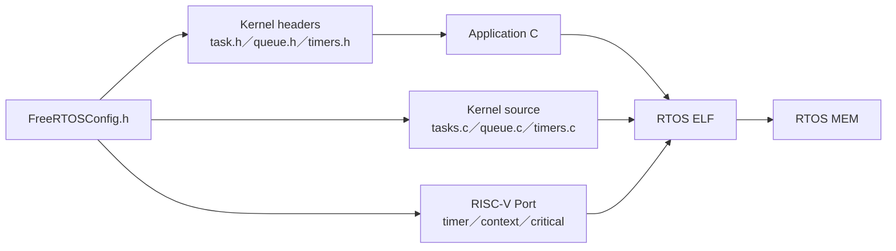
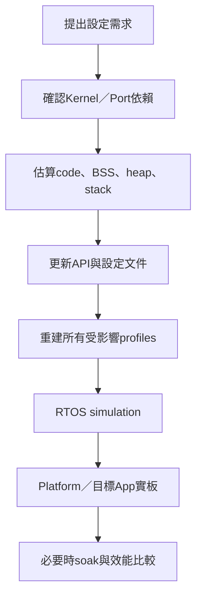

# FreeRTOSConfig.h 設定與修改影響

本文件集中說明 [`FreeRTOSConfig.h`](../../OS/rtos/config/FreeRTOSConfig.h) 的目前設定、每個重要macro控制什麼，以及修改後要同步檢查哪些硬體、記憶體與測試。

`FreeRTOSConfig.h`不是runtime設定檔。它在compile time被Kernel headers與source讀取，決定：

- Scheduler採用哪種行為。
- 哪些API會被編譯或宣告為可用。
- Tick、priority、Task name與stack的單位。
- 是否支援static/dynamic allocation。
- Timer service Task、ISR stack與heap大小。
- Assert、stack overflow、trace與runtime statistics。
- RISC-V machine timer的clock與MMIO base。

修改它之後必須重新build RTOS Application；只重新上傳舊`.mem`不會得到新設定。

## 1. 設定如何影響建置



例如：

```c
#define configUSE_MUTEXES 1
```

允許Mutex相關Kernel路徑與public API；但它不會自動建立任何Mutex。Application仍要呼叫：

```c
uart_mutex = xSemaphoreCreateMutexStatic(&uart_mutex_storage);
```

## 2. 目前設定總覽

| 分類 | 目前關鍵值 | 直接影響 |
|---|---|---|
| Scheduler | preemption=1、time slicing=1 | 高priority可搶占；同priority可tick輪轉 |
| Priority | `configMAX_PRIORITIES=5` | Application priority有效值0..4 |
| Tick | CPU 50 MHz、tick 1 kHz、32-bit tick | 約1 ms/tick；約49.7天wrap |
| Allocation | static=1、dynamic=1 | 兩種object建立方式都可用 |
| Heap | `heap_4`、2 MiB、Application提供array | dynamic objects與`malloc`來源 |
| Task stack | minimal 128 words | RV32上為512 bytes，不是所有Task都夠用 |
| ISR stack | 256 words | RV32上為1024 bytes，所有ISR共用 |
| Timer Task | priority 4、queue 8、stack 512 words | software timer callback與command處理 |
| Object features | notification、mutex、recursive mutex、counting semaphore、Queue Set、timer | 相應API可編譯使用 |
| Diagnostics | assert、stack overflow level 2、trace、runtime stats | 錯誤偵測與Task統計 |

## 3. Scheduler設定

### 3.1 `configUSE_PREEMPTION=1`

較高priority Task變成Ready時，可以搶占目前較低priority Task：

```text
Worker P1正在執行
  ↓ UART ISR使Console RX P3 Ready
ISR返回
  ↓
Console RX P3先執行
```

若設成0，會改成cooperative scheduling；這會改變整個Application的延遲假設，目前文件與測試都以preemptive mode為準，不應只改macro而不重做RTOS驗證。

### 3.2 `configUSE_TIME_SLICING=1`

兩個相同priority Tasks都持續Ready時，tick可以讓它們輪流執行：

```text
Task A P2 Ready ─┐
                 ├─ 每個tick有機會輪轉
Task B P2 Ready ─┘
```

它不會強迫高priority Task讓低priority Task執行。若P3永不Block，P2/P1仍可能starvation。

### 3.3 `configMAX_PRIORITIES=5`

有效priority是：

```text
0、1、2、3、4
```

數字越大越優先。`configMAX_PRIORITIES`是數量，不是最大可填數值；填5不代表可以建立priority 5。

目前常見分配：

| Priority | 目前用途案例 |
|---:|---|
| 4 | FreeRTOS Timer service Task |
| 3 | Console/Lua RX Task |
| 2 | Command或主要service Task |
| 1 | Worker、heartbeat等background Task |
| 0 | Idle Task |

### 3.4 `configUSE_PORT_OPTIMISED_TASK_SELECTION=1`

RISC-V Port可用word bitmap快速找出最高Ready priority。這類實作通常要求priority數量不超過可用bitmap寬度；目前5遠低於RV32的32 bits。

若未來增加到大量priority，不能只改數字，還要確認所用Port的限制、TCB/list RAM增加與測試覆蓋。

### 3.5 `configIDLE_SHOULD_YIELD=1`

若有其他priority 0 Task Ready，Idle Task會yield讓同priority Task執行。它不影響priority 1以上Task的正常搶占。

## 4. Clock、Tick與時間

### 4.1 `configCPU_CLOCK_HZ=50,000,000`

目前CPU、machine timer所在時脈以MIG `ui_clk` 50 MHz為基準。這不是板上oscillator標示頻率，而是實際驅動該邏輯的clock domain。

### 4.2 `configTICK_RATE_HZ=1000`

```text
50,000,000 / 1,000 = 50,000 core clocks/tick
```

目前1 tick約1 ms：

```c
vTaskDelay(pdMS_TO_TICKS(100));
```

仍應使用`pdMS_TO_TICKS()`，不要直接把毫秒當tick；如果未來tick改成100 Hz，100 ms只會是10 ticks。

### 4.3 32-bit Tick

`configTICK_TYPE_WIDTH_IN_BITS=TICK_TYPE_WIDTH_32_BITS`。1 kHz下wrap時間約：

```text
2^32 / 1000 seconds ≈ 49.7 days
```

FreeRTOS內部delay list會處理wrap。Application自行比較時間時應使用unsigned subtraction，不要只寫`now >= start + interval`。

### 4.4 修改Tick rate案例

若從1 kHz改成100 Hz：

- Tick interrupt由每1 ms變成每10 ms。
- `pdMS_TO_TICKS(1)`可能得到0或最小tick語意，不再有1 ms解析度。
- Scheduler time slicing粒度變粗。
- Tick ISR overhead下降。
- Software timer與timeout精度變粗。
- 所有假設固定marker時間的simulation/board timeout需要重查。

至少要重跑RTOS preflight、Console/Platform simulation、實板UART互動與delay量測。

## 5. Static與Dynamic allocation

```c
#define configSUPPORT_STATIC_ALLOCATION  1
#define configSUPPORT_DYNAMIC_ALLOCATION 1
```

兩者都啟用，所以可以選擇：

```c
xTaskCreateStatic(...);
xTaskCreate(...);

xQueueCreateStatic(...);
xQueueCreate(...);
```

### 5.1 Static案例

```c
static StaticTask_t worker_tcb;
static StackType_t worker_stack[256];

worker = xTaskCreateStatic(
    worker_task,
    "worker",
    256,
    NULL,
    1,
    worker_stack,
    &worker_tcb
);
```

Application提供TCB與stack，記憶體通常在`.bss`，生命週期明確。

### 5.2 Dynamic案例

```c
BaseType_t ok = xTaskCreate(
    worker_task,
    "worker",
    256,
    NULL,
    1,
    &worker
);
```

Kernel從FreeRTOS heap配置TCB與stack。建立失敗時必須檢查回傳值。

## 6. Heap設定

```c
#define configAPPLICATION_ALLOCATED_HEAP 1
#define configTOTAL_HEAP_SIZE (2UL * 1024UL * 1024UL)
```

`configAPPLICATION_ALLOCATED_HEAP=1`表示Kernel期待專案提供`ucHeap[]`；目前由 [`rtos_heap.c`](../../OS/rtos/src/rtos_heap.c) 定義，並使用`heap_4` allocator。

2 MiB heap供下列功能使用：

- dynamic Task／Queue／Semaphore等object。
- `pvPortMalloc()`與`vPortFree()`。
- mini C runtime的`malloc/calloc/realloc/free` bridge。
- Lua VM的runtime allocation。

它不是整個DDR容量，也不代表Application image只能2 MiB。Static arrays、code、`.data/.bss`、Task static stacks與framebuffer另計。

### 6.1 把heap改成128 MiB會怎樣

語法上可以調大，但不代表合理：

- Linker必須能在Application RAM region容納`ucHeap`與其他sections。
- 大型`.bss`會占用address space與可能的初始化／清除時間。
- Lua或錯誤allocation可能更晚才暴露memory leak。
- 實際可用DDR還受linker window、boot image與其他reserved區域限制。
- 不能只看到板上DDR容量就全部交給heap。

應先從`rtos_console.map`／目標`.map`確認section layout，再依實際allocation high-water與需求增加，而不是直接設成整個DDR。

## 7. Stack相關設定

### 7.1 `configMINIMAL_STACK_SIZE=128`

單位是`StackType_t` elements，不是bytes。RV32上一個element是4 bytes：

```text
128 words × 4 = 512 bytes
```

它主要作為最小/Idle Task基準，不表示所有Application Task只要512 bytes。Lua、格式化、深層call chain與大型local arrays通常需要更多。

### 7.2 `configISR_STACK_SIZE_WORDS=256`

```text
256 words × 4 = 1024 bytes
```

Trap entry先保存Task context，再切到dedicated ISR stack執行C handler。所有interrupt handlers共享這份stack，ISR仍要短小，不在其中做Lua、巨大local buffer或深層格式化。

### 7.3 `configCHECK_FOR_STACK_OVERFLOW=2`

Kernel在context-switch等位置檢查Task stack邊界pattern；偵測到問題時呼叫`vApplicationStackOverflowHook()`。它不是形式證明，也不保證抓到所有瞬間越界。

Application還應定期使用：

```c
uxTaskGetStackHighWaterMark(task_handle);
```

觀察剩餘最小stack words。

## 8. Task名稱與基本尺寸

```c
#define configMAX_TASK_NAME_LEN 12
```

此長度包含NUL結尾空間，所以可完整保存的可見字元通常最多11個。過長名稱會被截斷，可能讓`tasks`診斷輸出難以區分。

例如：

```text
"console_rx"  10個可見字元，可以保存
"console_command_service" 會被截斷
```

Task name只用於診斷，不決定Task功能、priority或入口函式。

## 9. Kernel object功能開關

| Macro | 現值 | API/功能 |
|---|---:|---|
| `configUSE_TASK_NOTIFICATIONS` | 1 | Task notification |
| `configTASK_NOTIFICATION_ARRAY_ENTRIES` | 1 | 每Task只有notification index 0 |
| `configUSE_MUTEXES` | 1 | Mutex |
| `configUSE_RECURSIVE_MUTEXES` | 1 | Recursive mutex |
| `configUSE_COUNTING_SEMAPHORES` | 1 | Counting semaphore |
| `configUSE_QUEUE_SETS` | 1 | Queue Set |
| `configUSE_TIMERS` | 1 | Software timer與Timer service Task |
| `configUSE_CO_ROUTINES` | 0 | Co-routine不使用 |
| `configQUEUE_REGISTRY_SIZE` | 16 | 最多註冊16個Queue名稱供除錯 |

功能設為1只代表Kernel支援，不代表每個profile一定建立或實板測過每一種參數組合。已驗證狀態見 [RTOS_PLATFORM_API_REFERENCE.md](../05-applications/RTOS_PLATFORM_API_REFERENCE.md)。

## 10. Software Timer設定

```c
#define configTIMER_TASK_PRIORITY    4
#define configTIMER_QUEUE_LENGTH     8
#define configTIMER_TASK_STACK_DEPTH 512
```

Timer callback不是在machine timer ISR執行，而是由Timer service Task執行。

```text
machine timer ISR更新tick
  → Kernel判斷software timer到期
  → Timer service Task P4變成Ready
  → callback在Task context執行
```

影響案例：

- Timer command queue只有8格；短時間送太多start/stop/change命令可能失敗。
- Timer Task priority 4高於目前一般Application Tasks，callback太長會延遲它們。
- 512 words在RV32是2048 bytes；所有Timer callbacks的最深call chain都由這份Task stack承擔。
- Callback不可長時間等待或執行大型工作；較好的方式是通知worker Task。

## 11. `INCLUDE_*`：決定optional API

目前啟用：

```text
vTaskDelay
xTaskDelayUntil
vTaskDelete
vTaskSuspend／vTaskResume
xTaskGetCurrentTaskHandle
xTaskGetSchedulerState
uxTaskPriorityGet／vTaskPrioritySet
eTaskGetState
xTimerPendFunctionCall
uxTaskGetStackHighWaterMark／2
xTaskGetIdleTaskHandle
```

未啟用的API即使FreeRTOS upstream有提供，也不能假設目前Application可以呼叫。例如`xTaskAbortDelay()`與`xTaskGetHandle(name)`目前未啟用。

### 11.1 開啟新API案例

若要使用`xTaskGetHandle()`：

1. 在`FreeRTOSConfig.h`加入對應`INCLUDE_xTaskGetHandle=1`。
2. 重新build所有需要的RTOS profile。
3. 檢查code size、symbol與API語意。
4. 新增simulation與Platform測試。
5. 更新API reference與parameter guide。

不要只為了方便查名稱就開啟所有optional API；建立Task時保存handle通常更直接可靠。

## 12. Assert、Hook與診斷

### 12.1 `configASSERT`

目前：

```c
#define configASSERT(x) \
    do { \
        if ((x) == 0) { \
            vAssertCalled(__FILE__, __LINE__); \
        } \
    } while (0)
```

它可抓到NULL handle、錯誤priority、ISR/Task API context、Queue item規則等Kernel前置條件。Assert失敗不是一般可恢復error；目前hook會輸出診斷並停止，讓問題不再擴散成更難追的memory corruption。

### 12.2 Hook設定

| Hook | 設定 | 目前作用 |
|---|---:|---|
| Idle hook | 0 | 不呼叫Application Idle hook |
| Tick hook | 0 | 不在每tick呼叫Application hook |
| Daemon startup hook | 0 | Timer Task啟動時不呼叫hook |
| Malloc failed hook | 1 | dynamic allocation失敗時進hook |
| Stack overflow hook | level 2 | 偵測Task stack邊界問題 |

Hook是在特定context執行，不可任意blocking。尤其Tick hook若未來啟用，它位於tick ISR路徑，必須遵守ISR規則。

### 12.3 Trace與runtime statistics

```c
#define configUSE_TRACE_FACILITY             1
#define configUSE_STATS_FORMATTING_FUNCTIONS 0
#define configGENERATE_RUN_TIME_STATS        1
```

目前可使用`uxTaskGetSystemState()`取得結構化Task狀態與runtime count；格式化成文字的`vTaskList()`／`vTaskGetRunTimeStats()`路徑未啟用。

Runtime counter直接讀`mtime` low 32 bits，50 MHz下約85.9秒wrap；長時間分析必須處理wrap，不能把它和1 kHz tick count混為同一單位。

## 13. C Library整合設定

```c
#define configUSE_NEWLIB_REENTRANT 0
#define configUSE_POSIX_ERRNO      0
```

目前不為每個Task配置newlib reentrancy structure，也不提供完整POSIX errno模型。專案使用mini C runtime與明確的UART輸入輸出；不能因為GCC能編譯某個標準C函式，就假設完整hosted libc、stdin、filesystem或thread-local errno已存在。

## 14. RISC-V Port與Machine Timer設定

```c
#define configMTIME_BASE_ADDRESS    0x40000020UL
#define configMTIMECMP_BASE_ADDRESS 0x40000028UL
```

這些是本專案local MMIO machine timer位址。Port用它們設定1 kHz tick；若RTL address map改變，Config、MMIO文件、Port build與testbench都必須同步。

目前是single-core：

```text
configNUMBER_OF_CORES=1
configUSE_CORE_AFFINITY=0
```

不能只把core數改成2就得到SMP；CPU RTL、interrupt、timer、atomic/coherence、Port與Kernel設定都需要重新設計。

## 15. 修改設定的安全流程



最小檢查：

1. `FreeRTOSConfig.h` macro名稱與upstream版本一致。
2. API source確實有加入build。
3. `.map`沒有RAM overflow，stack/heap單位沒有誤解。
4. Preflight simulation通過。
5. Platform simulation與probe通過。
6. Console UART RX、tick、Queue、Timer仍正常。
7. 若改time/priority，重新檢查timeout與starvation。
8. 若改diagnostic，確認assert/hook marker仍可觀察。

## 16. 常見修改案例

### 16.1 增加Task priority層級

需求：新增極低延遲service，希望使用priority 5。

錯誤：

```c
/* configMAX_PRIORITIES仍是5時，priority 5超出0..4。 */
xTaskCreateStatic(..., 5u, ...);
```

正確流程是先評估是否真的需要新層級，再增加`configMAX_PRIORITIES`、更新priority表與starvation測試。很多情況調整既有Task的blocking點比增加priority更合理。

### 16.2 加大Task stack

如果Lua Task high-water過低，只增加該Task的stack array/depth，不必修改`configMINIMAL_STACK_SIZE`讓所有基準一起變大：

```c
#define LUA_TASK_STACK_WORDS 4096u
static StackType_t lua_stack[LUA_TASK_STACK_WORDS];
```

### 16.3 關閉dynamic allocation

將`configSUPPORT_DYNAMIC_ALLOCATION=0`前必須確認：

- 所有Task/Queue/Timer都使用static create。
- Lua allocator是否仍依賴`pvPortMalloc`。
- `malloc/calloc/realloc` bridge是否還需要。
- Platform dynamic-allocation測試要修改或移除。

目前Lua使用runtime allocation，因此不能只改macro而不重新設計Lua memory來源。

## 17. 常見誤解

| 誤解 | 正確觀念 |
|---|---|
| 改Config不用重編譯 | Config是compile-time header，必須重建`.mem` |
| `configMAX_PRIORITIES=5`可用priority 5 | 有效值是0..4 |
| `configMINIMAL_STACK_SIZE=128`是128 bytes | RV32是128 words＝512 bytes |
| Heap 2 MiB等於整個Application RAM | Code、BSS、static stacks等另計 |
| 開啟API就自動建立object | Config只提供能力，Application仍要create |
| Timer callback是ISR | 它由Timer service Task執行 |
| Tick 1 kHz表示CPU只有1 kHz | CPU是50 MHz，tick只是Scheduler時間事件 |
| `configASSERT`可在release隨意關閉 | Bring-up中它是重要的早期錯誤偵測 |

## 18. 延伸文件

- [FREERTOS_PORT_ARCHITECTURE.md](FREERTOS_PORT_ARCHITECTURE.md)：Config如何接到RISC-V Port。
- [TICK_INTERRUPT.md](TICK_INTERRUPT.md)：clock、tick、wrap與timer ISR。
- [HEAP_AND_STACK.md](HEAP_AND_STACK.md)：記憶體計算與high-water。
- [TASK_QUEUE.md](TASK_QUEUE.md)：Task state、priority與同步object。
- [RTOS_PLATFORM_API_REFERENCE.md](../05-applications/RTOS_PLATFORM_API_REFERENCE.md)：目前API可用性。
- [RTOS_PLATFORM_API_PARAMETER_GUIDE.md](../05-applications/RTOS_PLATFORM_API_PARAMETER_GUIDE.md)：每個API參數。

