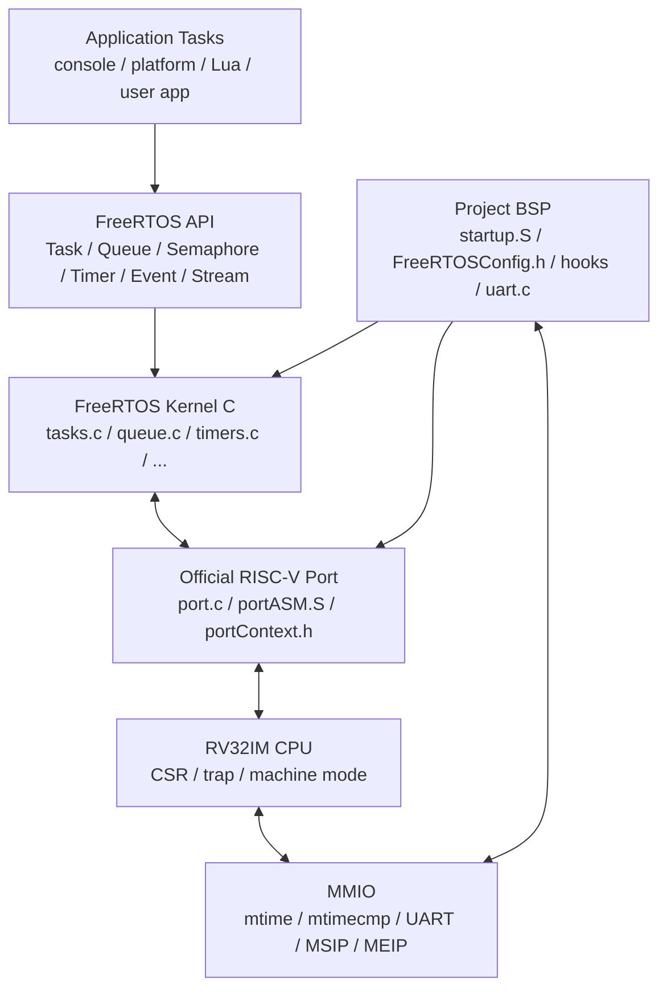
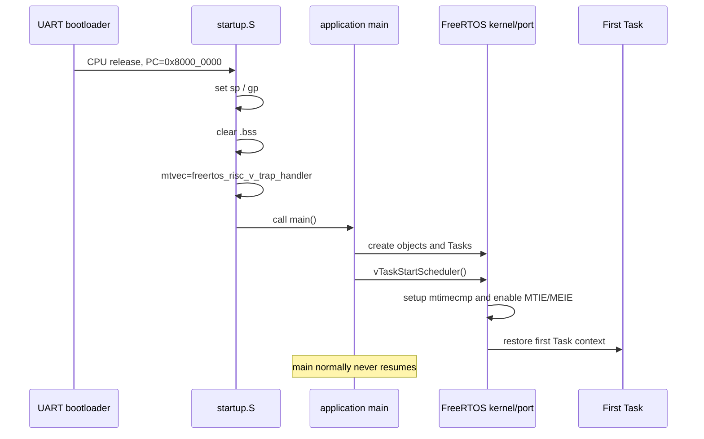
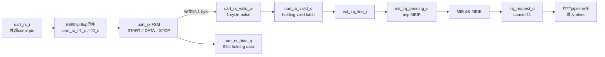

# FreeRTOS Port 架構

本文件說明 FreeRTOS 如何實際接到本專案的 RV32IM CPU。FreeRTOS不是另一顆處理器，也不是 bitstream 裡固定存在的作業系統；它和application、startup、driver一起編譯成 RISC-V machine code，放進同一份 `.mem`，由CPU執行。

第一次接觸RTOS、Task與Scheduler時，建議先讀 [RTOS_CONCEPTS.md](RTOS_CONCEPTS.md)；本頁專注於CPU port的實作細節。

建置與映像流程見 [BUILD_FLOW.md](../03-build-boot/BUILD_FLOW.md)，CPU trap/CSR實作見 [CSR_EXCEPTION_INTERRUPT.md](../01-architecture/CSR_EXCEPTION_INTERRUPT.md)。

## 1. Port 的角色

FreeRTOS kernel大多是可攜式 C code，但下列功能必須知道CPU細節：

- Task初始stack frame如何建立；
- 暫存器context如何保存／恢復；
- scheduler如何啟動第一個Task；
- `taskYIELD()`如何陷入kernel；
- tick timer如何設定；
- interrupt/exception如何進入共同trap handler；
- critical section如何開關interrupt；
- 哪些chip-specific registers需要額外保存。

這些就是 FreeRTOS **port layer**。它不是應用程式 API 的替代品，而是 kernel與CPU ISA／interrupt architecture之間的介面。

## 2. 目前使用的版本與目標

| 項目 | 目前設定 |
|---|---|
| FreeRTOS release checkout | FreeRTOS 202406.04 LTS |
| Kernel source version | V11.1.0 |
| Compiler port | `portable/GCC/RISC-V` |
| Chip extension profile | `RV32I_CLINT_no_extensions` |
| ISA／ABI | `rv32im_zicsr`／`ilp32` |
| XLEN | 32 |
| Privilege | Machine mode |
| Core count | 1 |
| FPU/vector context | 無 |
| Tick | 1 kHz |
| CPU／`mtime` clock | 50 MHz實板組態 |

`RV32I_CLINT_no_extensions` 代表port使用標準RV32 integer register set且具有machine timer；本專案的 `mtime/mtimecmp` 位址是自訂MMIO map，不是完整複製所有SiFive CLINT register。

## 3. 軟硬體分層



## 4. Build 時加入哪些檔案

[`tools/build_rtos_app.ps1`](../../tools/build_rtos_app.ps1) 自動加入：

### 專案端

- [`OS/rtos/src/startup.S`](../../OS/rtos/src/startup.S)；
- [`OS/rtos/config/FreeRTOSConfig.h`](../../OS/rtos/config/FreeRTOSConfig.h)；
- [`OS/rtos/src/freertos_hooks.c`](../../OS/rtos/src/freertos_hooks.c)；
- [`OS/rtos/src/uart.c`](../../OS/rtos/src/uart.c)；
- `perf_counters.c`、`rtos_heap.c`、`minilibc.c`；
- [`OS/rtos/link_ddr.ld`](../../OS/rtos/link_ddr.ld)；
- profile或使用者指定的application sources。

### 外部 FreeRTOS Kernel

- `tasks.c`、`list.c`、`queue.c`；
- `event_groups.c`、`stream_buffer.c`、`timers.c`；
- `portable/MemMang/heap_4.c`；
- `portable/GCC/RISC-V/port.c`；
- `portable/GCC/RISC-V/portASM.S`；
- RISC-V include與chip-specific extension header。

因此每一份 `rtos_<app>.mem` 都是完整firmware，不是只含一個Task，也不是只含FreeRTOS kernel。

## 5. 啟動流程



[`startup.S`](../../OS/rtos/src/startup.S) 在 scheduler前先把 `mtvec` 寫成官方port的 `freertos_risc_v_trap_handler`。這是direct trap vector；timer、external interrupt與synchronous exception都先進同一個入口，再由 `mcause` 分流。

## 6. Scheduler設定

[`FreeRTOSConfig.h`](../../OS/rtos/config/FreeRTOSConfig.h) 的主要排程設定：

所有目前macro、單位、功能開關與修改案例集中在 [FREERTOS_CONFIGURATION.md](FREERTOS_CONFIGURATION.md)；本節只保留Port最直接依賴的摘要。

| 設定 | 值 | 意義 |
|---|---:|---|
| `configUSE_PREEMPTION` | 1 | 較高priority Task ready時可搶占 |
| `configUSE_TIME_SLICING` | 1 | 同priority ready Tasks可在tick輪轉 |
| `configMAX_PRIORITIES` | 5 | priority有效範圍0..4 |
| `configTICK_RATE_HZ` | 1000 | 1 tick = 1 ms |
| `configNUMBER_OF_CORES` | 1 | 單核心scheduler |
| `configUSE_PORT_OPTIMISED_TASK_SELECTION` | 1 | 用ready-priority bitmap與CLZ找最高priority |
| `configIDLE_SHOULD_YIELD` | 1 | idle與其他priority 0 Task共存時讓出CPU |

Timer service Task使用priority 4，即目前最高priority；一般application應避免長時間占用priority 4，否則可能延遲software timer callbacks。

## 7. Machine-mode trap 路徑

CPU硬體在trap時更新 `mepc/mcause/mtval/mstatus` 並跳到 `mtvec`。Port assembly再做software context保存：

```text
CPU precise trap
  -> freertos_risc_v_trap_handler
  -> save Task register context to Task stack
  -> switch sp to dedicated ISR stack
  -> inspect mcause
       timer interrupt -> update mtimecmp, xTaskIncrementTick()
       external IRQ    -> project application interrupt handler
       ecall           -> vTaskSwitchContext()
       other exception -> project fatal diagnostic handler
  -> load selected Task stack
  -> restore context
  -> mret
```

詳細stack frame與切換步驟見 [CONTEXT_SWITCH.md](CONTEXT_SWITCH.md)。

## 8. Timer interrupt integration

Project設定：

```c
#define configMTIME_BASE_ADDRESS    0x40000020
#define configMTIMECMP_BASE_ADDRESS 0x40000028
```

官方 `vPortSetupTimerInterrupt()` 讀取64-bit `mtime`，設定第一個 `mtimecmp`，之後trap assembly每次把compare增加50,000 counts。硬體 `mtime` 每個core clock加1，所以50 MHz下形成1 kHz tick。

`xPortStartScheduler()` 同時設定 `mie` 的MTIE與MEIE bits（mask `0x880`）。Global interrupt enable會在第一個Task context啟動時打開。完整時序見 [TICK_INTERRUPT.md](TICK_INTERRUPT.md)。

### 具體例子：Task A delay 後如何切到 Task B

假設 Task A 與 Task B 都是 Ready，但 Task A 正在執行：

```c
/* Task A */
vTaskDelay(pdMS_TO_TICKS(10));
```

在目前 1 kHz tick 設定下，10 ms 會換成 10 ticks：

```text
Task A 呼叫 vTaskDelay(10 ticks)
        ↓
Kernel 把 Task A 移到 Delayed list，不再是 Ready
        ↓
Scheduler 選擇 Task B
        ↓
Port 儲存 A 的 RISC-V register context，還原 B 的 context
        ↓
CPU 開始執行 Task B
        ↓
每 1 ms：mtime 到達 mtimecmp，進入 machine timer interrupt
        ↓
第 10 個 tick：Kernel 將 Task A 從 Delayed 移回 Ready
        ↓
若 A 的 priority 較高，Port 在 trap return 前切換回 A
        ↓
mret 後，A 從 vTaskDelay() 之後繼續
```

FreeRTOS Kernel 負責 Task list、delay 到期與「選誰」；RISC-V Port 負責 timer trap、context save/restore 與 `mret`；CPU 硬體負責 CSR、interrupt 與真正執行 machine code。這個例子就是三層責任的實際交界。

## 9. External UART interrupt integration

這裡的`external`是「中斷來源位於CPU core外部」，不是指UART一定在FPGA晶片外。UART RTL與CPU都在同一顆FPGA，但UART相對於CPU core仍是external peripheral。

UART也不是送一段名為「interrupt」的訊息給軟體。硬體上的提出中斷，實際意思是：

> UART收到一個完整byte後，最後把一條1-bit interrupt request訊號從0拉成1；CPU的interrupt control logic看到這條線為1且CSR enable條件成立，才在instruction boundary進入Trap。

### 9.1 從UART RX pin到interrupt request



[`uart_rx.v`](../../uart_rx.v) 是硬體狀態機。它會：

1. 在`S_IDLE`偵測低電位start bit；
2. 半個bit後再次確認start bit，排除false start；
3. 在`S_DATA`依baud rate取樣8個data bits；
4. 在`S_STOP`確認stop bit為高；
5. 將byte放到`data_o`，並把`valid_o`拉高一個clock。

關鍵RTL概念是：

```verilog
if (rx_i) begin
    data_o  <= shift;
    valid_o <= 1'b1;
end
```

`uart_rx_valid_w`只有一個clock的pulse，CPU可能來不及直接處理，所以 [`icache_pipeline_top.v`](../../icache_pipeline_top.v) 會將它鎖存：

```verilog
if (uart_rx_valid_w) begin
    if (!uart_rx_valid_q || uart_mmio_rx_pop) begin
        uart_rx_data_q  <= uart_rx_data_w;
        uart_rx_valid_q <= 1'b1;
    end else begin
        uart_rx_overrun_q <= 1'b1;
    end
end
```

兩個valid訊號的差異：

| 訊號 | 維持時間 | 作用 |
|---|---|---|
| `uart_rx_valid_w` | 1個core clock | UART receiver通知「剛完成一個byte」 |
| `uart_rx_valid_q` | 持續到CPU讀走RX data | 表示holding register內仍有未處理byte，也是external IRQ line |

Top-level直接連接：

```verilog
.ext_irq_line_i(uart_rx_valid_q)
```

因此「UART提出external interrupt」最核心的硬體動作就是：

```text
uart_rx_valid_q = 1
    -> ext_irq_line_i = 1
```

### 9.2 Interrupt source如何決定要不要打斷CPU

[`machine_irq_sources.v`](../../machine_irq_sources.v)先形成pending：

```verilog
assign ext_irq_pending_o = meip_sw_q | ext_irq_line_i;
```

`meip_sw_q`是可由MMIO觸發的test pending bit；真正UART輸入走`ext_irq_line_i`。接著三個條件必須同時成立：

```verilog
wire irq_external_take =
    global_mie_i &
    meie_en_i &
    ext_irq_pending_o;
```

| 條件 | CSR／訊號意義 |
|---|---|
| `global_mie_i=1` | `mstatus.MIE=1`，Machine-mode全域允許interrupt |
| `meie_en_i=1` | `mie.MEIE=1`，允許Machine External Interrupt |
| `ext_irq_pending_o=1` | UART有未讀byte，或synthetic MEIP被設為1 |

成立後：

```verilog
irq_request_o = 1;
irq_cause_o   = 32'd11;
```

CSR的`mip.MEIP`（bit 11）也反映external pending。Top-level不會在一條instruction執行到一半時跳走，而是hold前端、讓pipeline內較舊instruction排空，再保存`mepc`、設定`mcause=0x8000_000B`並redirect到`mtvec`。

### 9.3 為什麼讀RX data會解除interrupt

CPU／ISR讀取`0x4000_0008`時，MMIO handshake產生：

```verilog
uart_mmio_rx_pop = 1
```

若同一cycle沒有新byte，Top-level清除：

```verilog
uart_rx_valid_q <= 1'b0;
```

於是訊號依序下降：

```text
uart_rx_valid_q = 0
    -> ext_irq_line_i = 0
    -> ext_irq_pending_o = 0
    -> irq_request_o = 0
```

這是level-sensitive pending設計：未讀byte存在多久，中斷線就保持多久。若ISR沒有讀RX data，`mret`後CPU可能立即再次進入同一個external interrupt。若舊byte尚未pop、下一個byte又抵達，硬體保留舊byte並設`uart_rx_overrun_q=1`。

### 9.4 硬體提出後，FreeRTOS如何接住

官方port只直接辨識machine timer interrupt；其他asynchronous interrupt呼叫weak的：

```c
freertos_risc_v_application_interrupt_handler(mcause)
```

專案在 [`freertos_hooks.c`](../../OS/rtos/src/freertos_hooks.c) 覆寫此函式：

1. 若 `mcause == 0x8000000B`，視為machine external interrupt；
2. 呼叫 `rtos_uart_handle_external_interrupt()`；
3. ISR從UART holding register取一個byte；
4. 使用 `xStreamBufferSendFromISR()` 放入256-byte storage 的 software StreamBuffer（ring buffer 實際可用255 bytes）；
5. 清除software MEIP；
6. 若喚醒較高priority Task，呼叫 `portYIELD_FROM_ISR()`。

所以完整責任分工是：

```text
UART FSM               收serial bits，產生byte與1-cycle valid pulse
Top-level holding      保存byte，把pulse延長成pending level
machine_irq_sources    套用MIE／MEIE，提出cause 11 IRQ request
CPU／CSR／pipeline      在instruction boundary進Trap並記錄mepc/mcause
FreeRTOS Port          保存Task context並分派application interrupt
UART ISR               讀RX data清除pending，將byte送入StreamBuffer
Scheduler              喚醒等待輸入的Task
```

非預期interrupt會印出 `mcause/mepc/mtval/mstatus/mie/mip/tcb/sp` 後停住。Machine software interrupt硬體雖存在，目前scheduler未啟用MSIE，也沒有一般MSIP handler。

## 10. Exception integration

`ecall` from M-mode的 `mcause=11` 被port保留作 `taskYIELD()`：port把saved `mepc` 加4，呼叫 `vTaskSwitchContext()`，因此返回時從 `ecall` 下一條繼續。

其他synchronous exceptions會進專案覆寫的 `freertos_risc_v_application_exception_handler()`，輸出trap diagnostic後停住。它不是一般recoverable signal/exception機制；illegal instruction、access fault、misalignment等在目前RTOS firmware都視為fatal。

## 11. Critical section

Port使用 `mstatus.MIE`：

```text
portDISABLE_INTERRUPTS -> csrc mstatus, 8
portENABLE_INTERRUPTS  -> csrs mstatus, 8
```

`taskENTER_CRITICAL()` 先關interrupt再增加 `xCriticalNesting`；`taskEXIT_CRITICAL()` 減少nesting，只有回到0才重新開interrupt。Nesting值會跟Task context一起保存／恢復。

Critical section適合保護非常短的共享狀態，不適合：

- 等待Queue／Semaphore；
- 大量UART輸出；
- 長時間運算；
- 呼叫可能block的API。

關interrupt太久會延遲tick與UART RX，造成排程jitter或hardware overrun。

## 12. 記憶體與allocation模式

目前同時開啟：

```text
configSUPPORT_STATIC_ALLOCATION  = 1
configSUPPORT_DYNAMIC_ALLOCATION = 1
```

Idle與Timer Tasks由application hooks提供static TCB/stack；一般profile大多使用 `xTaskCreateStatic()`，platform profile也刻意建立一個dynamic Task驗證`heap_4`。詳細見 [HEAP_AND_STACK.md](HEAP_AND_STACK.md)。

## 13. 目前已啟用的kernel能力

| 類別 | 狀態 |
|---|---|
| Task notifications | 啟用，1個notification entry |
| Mutex／recursive mutex | 啟用 |
| Counting semaphore | 啟用 |
| Queue sets | 啟用 |
| Event groups | source已加入，platform已測 |
| Stream buffers | source已加入，UART/platform已用 |
| Software timers | 啟用，timer queue length 8 |
| Static／dynamic allocation | 都啟用 |
| Runtime stats | 啟用，counter來源為 `mtime` low word |
| Co-routines | 關閉 |
| Newlib reentrancy | 關閉 |
| POSIX errno | 關閉 |
| SMP/core affinity | 單核心，不啟用 |
| Tickless idle | 未啟用 |

## 14. Port的明確假設與限制

- 只保存RV32 integer context；沒有FPU/vector registers。
- `gp(x3)`與`tp(x4)`不放入每個Task frame，port假設它們在所有Task間保持constant。
- Chip-specific additional context size為0。
- 所有Task執行在machine mode，沒有user/supervisor隔離、PMP sandbox或process address space。
- Trap handler期間MIE維持關閉，現行流程不設計nested interrupt。
- `vPortEndScheduler()` 未實作，scheduler啟動後不支援回到一般`main()`流程。
- Task function不可直接return；預設return address為0，應在結束時呼叫 `vTaskDelete(NULL)`。
- Runtime UART TX仍是polling；若在高priority Task或critical section大量輸出，會影響real-time latency。

## 15. 從哪裡開始閱讀程式碼

1. [`OS/rtos/src/startup.S`](../../OS/rtos/src/startup.S)：reset到`main()`。
2. [`OS/rtos/config/FreeRTOSConfig.h`](../../OS/rtos/config/FreeRTOSConfig.h)：本專案功能開關。
3. 外部kernel `portable/GCC/RISC-V/port.c`：timer與scheduler start。
4. 外部kernel `portable/GCC/RISC-V/portContext.h`：context macros。
5. 外部kernel `portable/GCC/RISC-V/portASM.S`：trap與first Task。
6. [`OS/rtos/src/freertos_hooks.c`](../../OS/rtos/src/freertos_hooks.c)：專案trap/ISR/hooks。
7. [`OS/rtos/src/main.c`](../../OS/rtos/src/main.c)：最小Task + Queue範例。
