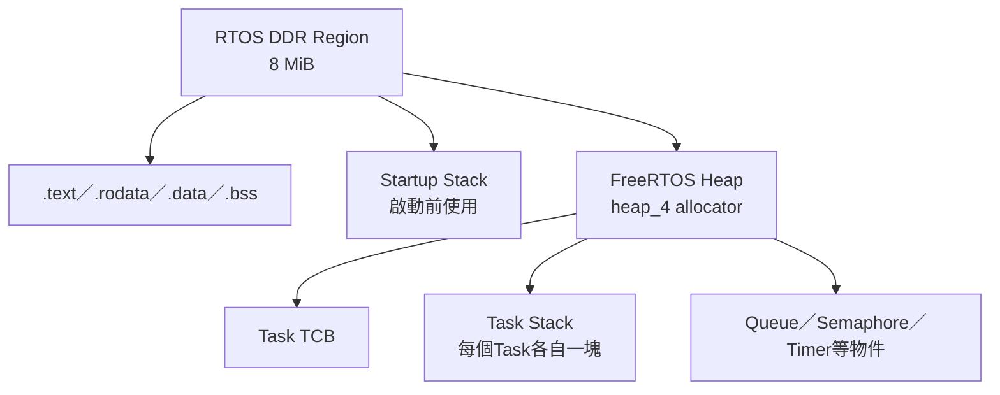
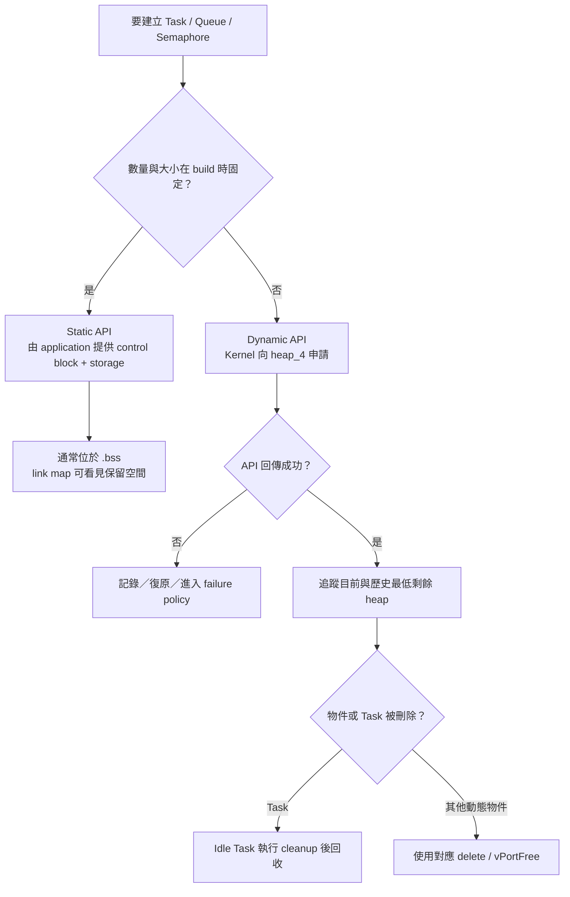

# FreeRTOS Heap 與 Stack

本文件說明本專案中 FreeRTOS 的記憶體從哪裡來、靜態與動態配置有何差異，以及如何判斷 Task stack 是否足夠。最重要的單位換算是：本專案的 `StackType_t` 是 32-bit，因此 FreeRTOS Task stack depth 的單位是 **word**，不是 byte。

若要先了解整體 DDR 配置，請先閱讀 [LINKER_MEMORY_LAYOUT.md](../03-build-boot/LINKER_MEMORY_LAYOUT.md)；若要了解 Task context 儲存內容，請閱讀 [CONTEXT_SWITCH.md](CONTEXT_SWITCH.md)。

## 記憶體層級圖



先分清楚三件事：startup stack、每個Task自己的stack、以及用來配置Task與RTOS物件的heap不是同一塊空間。

## 1. 本專案的記憶體配置摘要

RTOS firmware 被連結到 8 MiB DDR 區域：

```text
DDR: 0x8000_0000 ~ 0x807F_FFFF

低位址
  .text / .rodata / .data
  .bss
  .startup_stack       64 KiB
  .rtos_heap            2 MiB
高位址
```

實際順序與對齊由 [`OS/rtos/link_ddr.ld`](../../OS/rtos/link_ddr.ld) 決定。linker script 也會檢查 `.rtos_heap` 結尾沒有超出 `0x8080_0000`；若程式、靜態物件與 heap 的總量超出 8 MiB，連結階段就應失敗，而不是等到上板後才破壞其他記憶體。

請區分下列三種 stack：

| Stack | 大小 | 用途 | 生命週期 |
|---|---:|---|---|
| Startup stack | 64 KiB | reset、清除 `.bss`、進入 `main()`、scheduler 啟動前的 C 呼叫 | firmware 全程保留，但 scheduler 啟動後不是一般 Task stack |
| Task stack | 每個 Task 各自決定 | Task 的函式呼叫、區域變數與被切換出去時的 context frame | 與 Task 一起存在 |
| ISR stack | 256 words = 1024 bytes | trap handler 與 ISR 的 C call chain | scheduler 執行期間共用一份 |

## 2. `.bss`、`.rtos_heap` 與 `NOLOAD`

[`OS/rtos/src/rtos_heap.c`](../../OS/rtos/src/rtos_heap.c) 提供 FreeRTOS heap：

```c
uint8_t ucHeap[configTOTAL_HEAP_SIZE]
    __attribute__((section(".rtos_heap"), aligned(portBYTE_ALIGNMENT)));
```

對應設定為：

```c
#define configAPPLICATION_ALLOCATED_HEAP 1
#define configTOTAL_HEAP_SIZE            (2u * 1024u * 1024u)
```

`configAPPLICATION_ALLOCATED_HEAP=1` 表示 heap 儲存陣列由應用專案提供，而不是讓 `heap_4.c` 在自己的檔案內宣告。這讓 linker 能把它明確放進 `.rtos_heap`。

`.bss`、`.startup_stack` 與 `.rtos_heap` 都是 `NOLOAD` section。`NOLOAD` 的意思不是「執行時不存在」，而是 `.mem` 不必攜帶大量初始為零或尚未使用的內容：

- `.bss` 由 [`startup.S`](../../OS/rtos/src/startup.S) 在進入 `main()` 前清零。
- `.startup_stack` 只需要保留位址空間，不需要初始資料。
- `heap_4.c` 會在第一次使用時建立自己的 free-block 結構，因此不需要把 2 MiB 的零填入 image。

這也是 `.mem` 檔通常遠小於 8 MiB 的原因；檔案大小不等於 firmware 執行時占用的全部 DDR 範圍。

## 3. 靜態配置與動態配置

本專案兩種模式都已啟用：

```c
#define configSUPPORT_STATIC_ALLOCATION  1
#define configSUPPORT_DYNAMIC_ALLOCATION 1
```

### 3.1 靜態配置

使用者自己提供控制結構與 storage，例如：

```c
#define WORKER_STACK_WORDS 384u

static StaticTask_t worker_tcb;
static StackType_t worker_stack[WORKER_STACK_WORDS];

TaskHandle_t worker = xTaskCreateStatic(
    worker_task,
    "worker",
    WORKER_STACK_WORDS,
    NULL,
    2,
    worker_stack,
    &worker_tcb
);
```

此例會在 `.bss` 保留 TCB 與 `384 * 4 = 1536` bytes stack。`xTaskCreateStatic()` 不會再從 FreeRTOS heap 取得這兩塊記憶體。

優點：

- 記憶體需求在連結時就大致確定。
- 建立物件不會因 heap 碎片或剩餘空間不足而失敗。
- 適合長期存在、數量固定的核心 Task 與 Queue。

注意：靜態物件不是自動物件。傳給 `xTaskCreateStatic()`、`xQueueCreateStatic()` 的陣列和控制結構，生命週期必須涵蓋物件的使用時間，通常應宣告成 `static` 或全域變數。

### 3.2 動態配置

Kernel 從 FreeRTOS heap 配置 TCB、stack 或 Queue storage：

```c
TaskHandle_t worker = NULL;
BaseType_t ok = xTaskCreate(
    worker_task,
    "worker",
    384,
    NULL,
    2,
    &worker
);

if (ok != pdPASS) {
    /* 建立失敗：不可使用 worker handle。 */
}
```

優點是程式可以依執行情況建立不同數量或不同大小的物件。代價是：

- API 可能因剩餘 heap 不足而失敗，必須檢查回傳值。
- Task 刪除後，動態配置資源要等 Idle Task 執行 cleanup 才會回收。
- 記憶體峰值較難只靠 linker map 判斷，需同時監測 heap 最低剩餘量。

### 3.3 本專案的選擇方式

目前 smoke、console 等主要 Task 多使用靜態配置，platform 測試則刻意涵蓋動態配置。這不是規定每個應用都只能選其中一種；常見做法是核心服務採靜態配置，數量真的會在執行情況改變的短期物件才使用動態配置。



靜態配置的重點是 storage ownership 在 application；動態配置的重點則是建立可能失敗，而且生命週期結束時必須有明確回收路徑。

## 4. `heap_4.c` 做了什麼

build script 將 FreeRTOS 的 `portable/MemMang/heap_4.c` 編入 firmware。它提供：

- `pvPortMalloc()`：配置一塊記憶體。
- `vPortFree()`：釋放由 `pvPortMalloc()` 配置的記憶體。
- 相鄰 free blocks 合併，降低外部碎片。
- 目前剩餘量與歷史最低剩餘量統計。

`heap_4` 不是完整的 C library allocator，也不是虛擬記憶體系統。它只管理 `ucHeap[]` 這一塊固定的 2 MiB 陣列。

下列 FreeRTOS 動態 API 最終會使用 heap：

- `xTaskCreate()`
- `xQueueCreate()`
- `xSemaphoreCreateMutex()` 等非 `Static` 版本
- `xTimerCreate()`
- `pvPortMalloc()`

禁止事項：

- 不可在 ISR 中呼叫 `pvPortMalloc()` 或會動態建立物件的 API。
- 不可把一般 C library `free()` 用在 `pvPortMalloc()` 的結果上。
- 不可對靜態物件呼叫 `vPortFree()`。
- 不可在仍可能被其他 Task 使用時釋放物件或其指向資料。

## 5. Heap 統計值如何解讀

```c
size_t free_now = xPortGetFreeHeapSize();
size_t free_min = xPortGetMinimumEverFreeHeapSize();
```

| 數值 | 意義 |
|---|---|
| `free_now` | 目前可供配置的總 free bytes |
| `free_min` | scheduler 執行以來曾經出現過的最低 free bytes |

`free_min` 通常比只看 `free_now` 更有價值。例如某工作建立暫時 Task 後又刪除，`free_now` 可能恢復，但 `free_min` 仍保留峰值用量的證據。

這兩個值不能完整表示碎片形狀：即使總 free bytes 足夠，也可能沒有一塊足夠大的連續 free block。`heap_4` 會合併相鄰空間，已比不支援 free 的簡單 allocator 更適合長時間使用，但仍應避免頻繁建立大小差異很大的短命物件。

## 6. Task stack depth 的單位

FreeRTOS Task API 的 stack depth 是 `StackType_t` 元素個數。本專案：

```text
sizeof(StackType_t) = 4 bytes
```

因此：

| API stack depth | 實際 stack bytes |
|---:|---:|
| 128 words | 512 bytes |
| 256 words | 1024 bytes |
| 384 words | 1536 bytes |
| 512 words | 2048 bytes |

常見錯誤是想配置 1024 bytes，卻把 `1024` 傳給 API；在本專案中那實際是 4096 bytes。建議常數名稱明寫 `_WORDS`：

```c
#define PARSER_STACK_WORDS 512u
```

不要以裸數字或 `_BYTES` 命名後直接傳入 `xTaskCreate()`。

## 7. Task stack 內會放什麼

Task stack 不只存使用者程式的區域變數，還包括：

- 函式呼叫的 return address 與 compiler spill registers。
- 區域陣列、結構與函式參數暫存。
- `printf` 類格式化函式的 call chain 與暫存資料。
- FreeRTOS API 進入 kernel 時的呼叫深度。
- Task 被 trap 或切換出去時的 31-word context frame。

本專案的 RISC-V port 在 context switch 時至少保留 31 words，也就是 124 bytes。這只是一個固定底層成本，不代表配置 31 words 就足夠；Task 真正需要的 stack 還取決於最深的 C call chain。

RV32 stack 向低位址成長，port 要求適當對齊，本專案的 `portBYTE_ALIGNMENT` 為 16 bytes。使用 `StackType_t[]` 與 FreeRTOS API 時會由 port/kernel 處理必要對齊，不應手動傳入未對齊的 byte buffer 當 Task stack。

## 8. 容易大量消耗 stack 的寫法

### 大型區域陣列

```c
static void parser_task(void *arg)
{
    uint8_t temporary[4096]; /* 單一區域變數就需要 4 KiB。 */
    /* ... */
}
```

若這個 buffer 不需要每個呼叫各有一份，可改成靜態 storage、受保護的共享 buffer，或從 heap 配置並檢查失敗。選擇共享 buffer 時要另外處理並行存取與 ownership。

### 深層呼叫或 recursion

每層呼叫都可能建立新的 stack frame。遞迴深度若依輸入而變化，就很難證明 stack 上限，embedded RTOS 通常應避免無界 recursion。

### 格式化輸出

`printf`、浮點格式化或大型 library 函式常比簡單整數運算需要更多 stack。本專案使用自己的精簡輸出路徑，但新增其他 library 前仍應重新測量 high-water mark。

### 在 Task stack 放長期資料

Task 的區域變數雖會在 Task 存活期間保留，但不應把指向區域資料的 pointer 傳給其他 Task 後立刻離開該 scope。Queue 若傳 pointer，也只複製 pointer，不會延長 pointed object 的生命週期。

## 9. Stack high-water mark

```c
UBaseType_t words_unused = uxTaskGetStackHighWaterMark(task_handle);
```

此值是該 Task 自建立以來，曾經保留下來的**最少未使用 stack words**。例如：

```text
allocated       = 384 words
high-water mark = 72 words
minimum margin  = 72 * 4 = 288 bytes
maximum observed use approximately = (384 - 72) * 4 = 1248 bytes
```

high-water mark 不是目前瞬間剩餘 stack，也不是未來安全保證。測試必須涵蓋最深路徑，例如：

- 最長合法命令與錯誤命令。
- Queue timeout 與 Queue full 路徑。
- 最大腳本或最大資料結構。
- 同時啟用 runtime stats、log 與 timer callback。
- 長時間執行及多次切換。

不要看到尚有幾個 words 就直接把 stack 縮到極限。中斷 context、少見錯誤處理或 compiler 最佳化差異都可能增加需求；應保留明確的工程安全餘量。

## 10. Stack overflow 檢查

本專案設定：

```c
#define configCHECK_FOR_STACK_OVERFLOW 2
```

Kernel 會在 Task 切換等檢查點檢查 Task stack 邊界／填充值；發現異常時呼叫：

```c
void vApplicationStackOverflowHook(TaskHandle_t task, char *task_name);
```

專案 hook 會透過 UART 印出 Task 名稱後停止。這是故障偵測機制，不是 memory protection：

- overflow 可能在檢查前就已破壞相鄰資料。
- 若破壞嚴重到 UART 或 stack 本身無法運作，訊息可能印不出來。
- 它檢查的是 Task stack，不代表 1024-byte ISR stack 一定足夠。

因此仍要用 high-water mark、壓力測試與最壞情況分析決定大小。

## 11. ISR stack

RISC-V port 提供獨立 ISR stack：

```c
#define configISR_STACK_SIZE_WORDS 256
```

也就是 1024 bytes，16-byte aligned。scheduler 啟動時 port 會用 `0xEE` 填入這塊 stack，trap entry 先把 Task context 存到該 Task stack，再把 `sp` 切換到 ISR stack，才呼叫 timer／external interrupt 的 C handler。

本專案不啟用 nested interrupt，因此同一時間不會自然堆疊多層 ISR call chain；但 ISR 仍必須短小：

- 不在 ISR 進行格式化輸出。
- 不在 ISR 呼叫一般 blocking API。
- 不配置動態記憶體。
- 只搬移必要資料、清除中斷來源並喚醒 Task。

目前 `configCHECK_FOR_STACK_OVERFLOW=2` 主要檢查 Task stack。官方 RISC-V port 對 ISR stack 的額外檢查需要更高設定值，而且該路徑帶有未充分測試的提醒，因此本專案沒有把它當成可靠的 ISR stack 保護。若未來擴大 ISR 工作量，應另外加入 watermark 量測或 guard 機制。

## 12. Idle 與 Timer Task 的靜態記憶體

因為啟用了 static allocation，kernel 會向 application 取得系統 Task storage。專案在 [`freertos_hooks.c`](../../OS/rtos/src/freertos_hooks.c) 提供：

- Idle Task：256-word stack。
- Timer service Task：512-word stack。

這兩份 stack 與 TCB 是靜態陣列，不占 FreeRTOS heap。Timer Task stack 要涵蓋所有 software timer callbacks 的最深呼叫路徑；callback 雖不是 ISR，仍應短小且不可長時間 blocking，避免延遲其他 timer command。

Idle Task 必須有機會執行，因為動態建立後再 `vTaskDelete()` 的 Task，其資源 cleanup 由 Idle Task 處理。若某個高優先權 Task 永遠不 block，除了會造成低優先權 Task starvation，也可能讓已刪除 Task 的記憶體無法及時回收。

## 13. Allocation failure

本專案啟用：

```c
#define configUSE_MALLOC_FAILED_HOOK 1
```

若 kernel 的 dynamic allocation 失敗，`vApplicationMallocFailedHook()` 會輸出目前與歷史最低 free heap，然後停止系統。這比讓 NULL handle 繼續傳遞更容易診斷，但 application 仍應檢查可回報失敗的 API：

```c
QueueHandle_t queue = xQueueCreate(8, sizeof(uint32_t));
configASSERT(queue != NULL);
```

對可能是正常資源壓力的功能，不要一律 assert；可以回傳錯誤、拒絕新工作或清理後重試。核心啟動物件建立失敗則通常應視為 firmware 配置錯誤並停止。

## 14. 估算一個應用的記憶體

假設應用有：

- Task A：384 words。
- Task B：512 words。
- Queue：8 個 16-byte items。
- 兩個靜態 TCB 與一個 `StaticQueue_t`。

只計 stack 與 Queue payload：

```text
Task stacks  = (384 + 512) * 4 = 3584 bytes
Queue data   = 8 * 16          =  128 bytes
subtotal                         3712 bytes
```

還必須加上 TCB、Queue control structure、global data、對齊、library `.bss`、Idle/Timer/ISR stack 等。若物件採靜態配置，這些主要反映在 ELF map 的 `.bss`；若採動態配置，則反映在 `ucHeap` 使用量。不要把 `configTOTAL_HEAP_SIZE` 當成整個 RTOS 的 RAM 使用量。

## 15. 建議的量測流程

1. 先給每個 Task 保守 stack，不急著壓縮。
2. 執行最長命令、錯誤路徑、timeout、最大 workload 與長時間測試。
3. 記錄每個 Task 的 `uxTaskGetStackHighWaterMark()`。
4. 記錄 `xPortGetMinimumEverFreeHeapSize()`。
5. 從 `.map` 確認 `.bss`、`.startup_stack`、`.rtos_heap` 與 DDR 上限。
6. 縮小 stack 後重新跑同一組壓力測試。
7. 對最終值保留安全餘量，並在文件中記錄量測情境。

可使用 console/platform 應用的 `status`、`tasks` 或相關診斷輸出觀察 runtime 狀態；記憶體 map 則可查看 build 產生的 `rtos_<app>.map`。

## 16. 常見誤解

| 誤解 | 正確理解 |
|---|---|
| `xTaskCreate(..., 512, ...)` 是 512 bytes | 本專案是 512 words，也就是 2048 bytes |
| 2 MiB heap 包含所有 Task stack | 只有動態建立的 Task stack 使用 heap；靜態 stack 位於 `.bss` |
| `.mem` 沒有 2 MiB 就沒有 heap | `.rtos_heap` 是 `NOLOAD`，執行時仍保留完整位址空間 |
| `free_now` 很大就一定安全 | 還要看歷史最低量、最大連續 block、stack 與靜態 RAM |
| overflow hook 能完全阻止資料破壞 | hook 是事後偵測，overflow 可能已先破壞記憶體 |
| `vTaskDelete(NULL)` 立刻完成所有回收 | 動態 Task 的部分 cleanup 需要 Idle Task 執行 |
| ISR 使用 Task stack | Task context 存在 Task stack，但 ISR C handler 改用專用 ISR stack |
