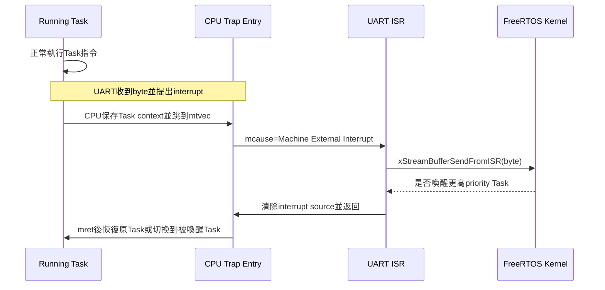
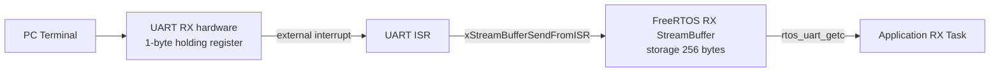
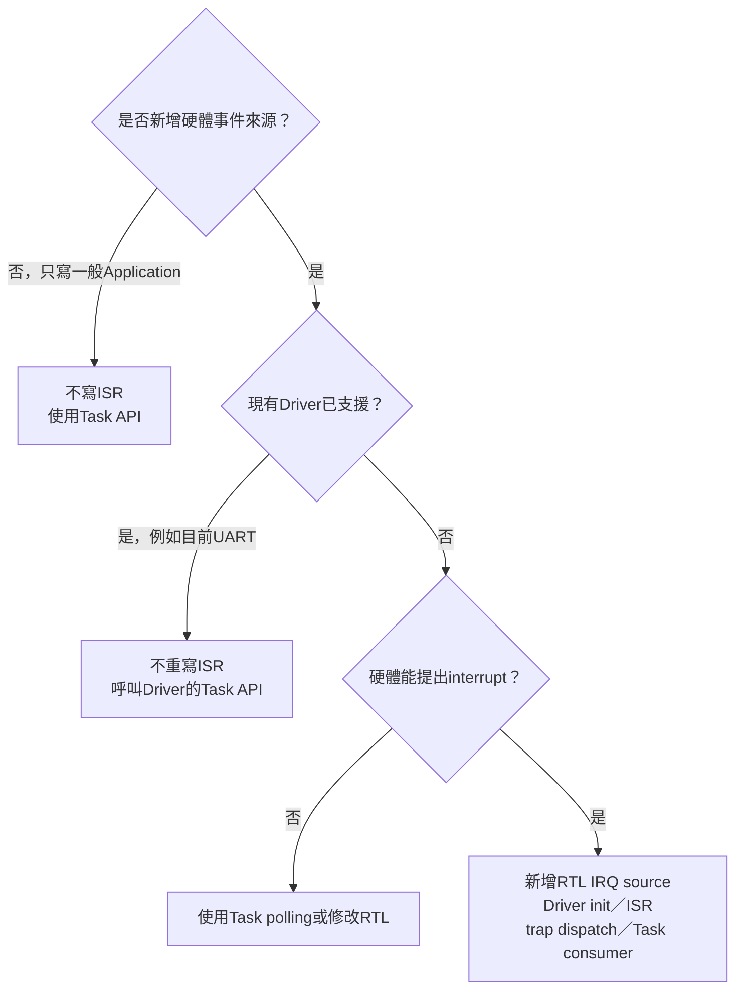

# ISR 與 Task API 的邊界

本文件回答下列幾個容易混在一起的問題：

- 「目前正在 Task 裡」與「目前正在 ISR 裡」到底怎麼判斷？
- 使用 UART、VGA 等外部模組，是否就一定要使用 `FromISR` API？
- ISR 收到的資料，Application 要去哪裡取得？
- `rtos_uart_getc()`、`rtos_uart_try_getc()` 與 `scanf()` 有什麼差別？
- 什麼時候需要自己新增 ISR，什麼時候完全不需要？
- 如果未來加入新的 interrupt-capable module，Driver、ISR 與 Task 要怎麼分工？

先記住最重要的結論：

```text
一般Application Task
  → 使用普通FreeRTOS API
  → 從Queue／StreamBuffer／Notification接收事件

現有UART／FreeRTOS Tick
  → ISR與trap入口已經完成
  → Application不需要重寫ISR

新增一個尚未支援、而且會提出interrupt的硬體模組
  → 才需要擴充RTL interrupt source、Driver ISR與共同trap dispatch
```

## 1. 先分清楚三個角色

### 1.1 Task

Task 是由 FreeRTOS Scheduler 管理的長期執行流程。Application 使用 `xTaskCreateStatic()` 或 `xTaskCreate()` 建立 Task，並指定 entry function：

```c
static void worker_task(void *arg)
{
    (void)arg;

    for (;;) {
        do_work();
        vTaskDelay(pdMS_TO_TICKS(100));
    }
}
```

Task 具有自己的 stack、priority 與 state，可以因等待 Queue、StreamBuffer 或 timeout 而進入 Blocked，再由 FreeRTOS 喚醒。

### 1.2 ISR

ISR 是 **Interrupt Service Routine（中斷服務函式）**。它不是另一個 Task，也不是 Application 在普通流程中反覆呼叫的函式。

當 UART、timer 或其他硬體提出 interrupt 時，CPU 會暫停目前指令流程，保存返回位置，跳到 `mtvec` 指向的共同 trap handler。共同 handler 再依 `mcause` 與周邊 pending status，呼叫對應的短小 ISR。

### 1.3 Queue／StreamBuffer／Notification

這些是 ISR 與 Task 之間傳遞資料或事件的 FreeRTOS object：

```text
ISR                         Task
讀取硬體資料                等待資料
    │                          ▲
    └── Queue／StreamBuffer ────┘
```

ISR 不會用普通 C `return` 把資料傳給某個 Task。ISR 先把資料放進 RTOS object，Task 之後從該 object 取走。

## 2. 「目前正在 Task／ISR 裡」是什麼意思

「目前」是指 CPU 執行到某一行 C 程式碼時，是沿著哪一條呼叫路徑進來。

### 2.1 Task 呼叫路徑

```c
static void send_result(void)
{
    Result_t result;
    make_result(&result);
    xQueueSend(result_queue, &result, portMAX_DELAY);
}

static void worker_task(void *arg)
{
    (void)arg;

    for (;;) {
        send_result();
    }
}
```

呼叫路徑是：

```text
FreeRTOS Scheduler選到worker_task
  └─ worker_task()
      └─ send_result()
          ├─ make_result()
          └─ xQueueSend()
```

`send_result()` 與 `make_result()` 雖然不是 Task entry function，但它們由 `worker_task()` 呼叫，所以仍在同一個 Task context。普通 helper function 不會因為被拆到另一個 `.c` 檔案就變成另一個 Task。

### 2.2 ISR 呼叫路徑

UART 收到 byte 時的路徑不是由 Task 主動呼叫：

```text
CPU原本執行worker_task
  ↓ UART硬體提出external interrupt
CPU保存原本返回位置
  ↓
freertos_risc_v_trap_handler
  ↓ 判斷mcause
freertos_risc_v_application_interrupt_handler
  ↓
rtos_uart_handle_external_interrupt
```

從 CPU 進入 trap handler 到執行 `mret` 離開的這段期間，屬於 interrupt/ISR context。



### 2.3 Helper function 的 context 由 caller 決定

```c
static void helper(void)
{
    /* 單看helper本身，無法判斷現在是Task或ISR。 */
}
```

如果 `worker_task()` 呼叫 `helper()`，它就在 Task context；如果 `uart_isr()` 呼叫 `helper()`，它就在 ISR context。Context 不是由函式名稱、header 或 source file 決定，而是由當下的呼叫路徑決定。

若同一個 helper 可能同時由 Task 與 ISR 呼叫，不要在裡面含糊地固定使用其中一種 FreeRTOS API。較清楚的做法是分成 Task 與 ISR 入口，或把不涉及 RTOS 的純計算抽成共同 helper。

## 3. 使用外部模組不等於正在 ISR

判斷 API 版本的依據不是「是否操作 UART／VGA」，而是「這行 API 是否在 interrupt handler 的呼叫路徑中」。

| 程式動作 | Context | API類型 |
|---|---|---|
| Logger Task呼叫`rtos_uart_write()` | Task | 普通Task/Driver API |
| Display Task寫VGA framebuffer MMIO | Task | 普通Task/Driver API |
| Task讀performance counter MMIO | Task | 普通Task/Driver API |
| UART收到PC byte後CPU自動進trap handler | ISR | `...FromISR()` |
| Machine timer到期後CPU進tick handler | ISR | FreeRTOS Port內部ISR路徑 |

例如：

```c
static void logger_task(void *arg)
{
    (void)arg;

    for (;;) {
        rtos_uart_write_line("hello");
        vTaskDelay(pdMS_TO_TICKS(1000));
    }
}
```

雖然 `rtos_uart_write_line()` 最後會操作 UART MMIO，但它是由 `logger_task()` 主動呼叫，因此仍是 Task context。MMIO load/store 本身不會自動把 C function 變成 ISR。

## 4. 目前 UART 已經完成的中斷路徑

一般 Application 不需要為目前 UART 重新撰寫 ISR。專案已完成從硬體到 Task 的整條路徑。

### 4.1 啟動時登記共同 trap 入口

[`startup.S`](../../OS/rtos/src/startup.S) 會在呼叫 `main()` 前設定：

```asm
la   t0, freertos_risc_v_trap_handler
csrw mtvec, t0
```

這表示 CPU 接受 interrupt 或 exception 時，先跳到 FreeRTOS RISC-V Port 的共同 trap handler。Application 不應另外覆寫 `mtvec` 建立第二套入口。

### 4.2 Application 初始化 UART RX interrupt

需要接收 UART 的 profile 會在建立 RX Task 前呼叫：

```c
if (rtos_uart_rx_interrupt_init() == 0) {
    fatal("uart_rx_init");
}
```

此函式位於 [`uart.c`](../../OS/rtos/src/uart.c)，主要工作是：

1. 建立或重用 UART RX StreamBuffer。
2. 清除舊 RX status／pending。
3. 開啟 RISC-V `mie.MEIE` machine-external interrupt enable。

它是初始化函式，不是 ISR；可由 `main()` 在 Scheduler 啟動前呼叫。

### 4.3 RX Task 等待輸入

Console 的 [`rx_task()`](../../OS/rtos/src/main_console.c) 使用：

```c
char value;
uint32_t overrun;

if (rtos_uart_getc(&value, portMAX_DELAY, &overrun) != 0) {
    handle_byte(value);
}
```

沒有 byte 時，`rtos_uart_getc()` 最後阻塞在 RX StreamBuffer。只有這個 RX Task 進入 Blocked，CPU 和其他 Ready Tasks 不會停止。

### 4.4 UART 硬體收到 byte

以 PC 傳送字元 `h` 為例：

```text
PC送出ASCII 0x68
  ↓
UART RTL收完8N1 frame
  ↓
1-byte RX holding register保存0x68，rx_valid=1
  ↓
machine external interrupt變成pending
  ↓
CPU在instruction boundary接受interrupt
```

CPU 自動進入共同 trap handler；不是 `rx_task()` 呼叫 ISR。

### 4.5 Trap handler 分派到 UART ISR

[`freertos_hooks.c`](../../OS/rtos/src/freertos_hooks.c) 的 project interrupt handler 檢查：

```c
if (mcause == 0x8000000Bu) {
    BaseType_t higher_priority_task_woken =
        rtos_uart_handle_external_interrupt() ? pdTRUE : pdFALSE;
    portYIELD_FROM_ISR(higher_priority_task_woken);
    return;
}
```

`0x8000_000B` 表示 Machine External Interrupt。接著進入 [`rtos_uart_handle_external_interrupt()`](../../OS/rtos/src/uart.c)，它會：

1. 讀 UART RX status。
2. 從 RX data MMIO 取走一個 byte。
3. 用 `xStreamBufferSendFromISR()` 把 byte 放進軟體 StreamBuffer。
4. 清除 UART external interrupt pending。
5. 回報是否喚醒更高 priority Task。

### 4.6 Task 在哪裡拿到 ISR 傳來的資料

Application 在 Task 裡呼叫：

```c
rtos_uart_getc(&value, timeout_ticks, &overrun);
```

資料方向是：



所以「接收 ISR 資料的位置」就是呼叫 `rtos_uart_getc()` 的 Task。Application 不會直接呼叫 `rtos_uart_handle_external_interrupt()`，也不會讀取 ISR 的 C return value。

## 5. UART 輸入 API：目前的 `getchar()` 類功能

### 5.1 `rtos_uart_getc()`

```c
int rtos_uart_getc(
    char *value,
    uint32_t timeout_ticks,
    uint32_t *overrun
);
```

| 參數 | 意義 |
|---|---|
| `value` | 必要 output pointer；成功時寫入一個 byte |
| `timeout_ticks` | 最多等待多少 FreeRTOS tick；不是直接以毫秒表示 |
| `overrun` | optional output pointer；不需要錯誤提示可填 `NULL` |

回傳 `1` 表示收到 byte；回傳 `0` 表示 timeout 或在未初始化 interrupt 時目前沒有 byte。

目前 `configTICK_RATE_HZ=1000`，一般情況下 1 tick 約 1 ms，但程式仍應使用：

```c
pdMS_TO_TICKS(100)
```

而不是依賴固定換算。

### 5.2 「最多等待指定 tick」的真正意思

```c
rtos_uart_getc(&ch, pdMS_TO_TICKS(100), &overrun);
```

可能在 30 ms 收到字元，函式就於約 30 ms 返回；不是一定要等待滿 100 ms。若 100 ms 都沒有資料，才回傳 `0`。

```text
呼叫時刻                 byte抵達                 返回1
   │------------------------│---------------------->
   0 ms                    30 ms

呼叫時刻                                         timeout返回0
   │------------------------------------------------│
   0 ms                                            100 ms
```

等待期間只有呼叫者 Task 進入 Blocked：

```text
UART RX Task    Blocked，等待StreamBuffer
Worker Task     可以繼續執行
Heartbeat Task  可以繼續執行
Idle Task       沒有其他工作時執行
```

因此 blocking wait 不是「整顆 CPU 停住」。這是 RTOS 比 busy polling 更有效率的核心行為。

### 5.3 `portMAX_DELAY`

專門等待輸入的 RX Task 通常使用：

```c
rtos_uart_getc(&ch, portMAX_DELAY, &overrun);
```

這表示沒有資料時讓該 Task 一直 Blocked，直到 StreamBuffer 有 byte。收到 byte 後 ISR 會使 Task Ready，Scheduler 再安排它執行。

### 5.4 `rtos_uart_try_getc()`

```c
int rtos_uart_try_getc(char *value, uint32_t *overrun);
```

它只查看一次：有 byte 就取出並回傳 `1`，目前沒有 byte 就立刻回傳 `0`。它不會讓 Task 等待。

錯誤的高頻 polling 形式：

```c
for (;;) {
    if (rtos_uart_try_getc(&ch, NULL) != 0) {
        handle_byte(ch);
    }
}
```

沒有輸入時，CPU 會不斷重複「查看、沒有、再查看」，浪費 execution cycles，也可能讓較低 priority Task starvation。

`try_getc()` 適合 Task 原本就有別的工作，只想順便查看一次：

```c
for (;;) {
    run_control_step();

    if (rtos_uart_try_getc(&ch, NULL) != 0) {
        handle_byte(ch);
    }

    vTaskDelay(pdMS_TO_TICKS(10));
}
```

### 5.5 如何選擇

| 需求 | 建議 API |
|---|---|
| Task 專門等待 UART 輸入 | `rtos_uart_getc(..., portMAX_DELAY, ...)` |
| 等輸入，但每隔一段時間還要做週期工作 | `rtos_uart_getc(..., pdMS_TO_TICKS(n), ...)` |
| 目前只想查看一次，絕對不能等待 | `rtos_uart_try_getc()` |
| ISR 收到硬體 byte後送進StreamBuffer | Driver內部使用`xStreamBufferSendFromISR()` |

使用 blocking `rtos_uart_getc()` 前必須先成功執行 `rtos_uart_rx_interrupt_init()`。未初始化時 Driver 會退回直接 non-blocking MMIO polling，不能得到預期的 StreamBuffer blocking 行為。

## 6. 為什麼目前不能直接把 `scanf()` 當成 UART API

目前 RTOS mini runtime 沒有把標準 C `stdin` 與 `scanf()` 接到 UART RX StreamBuffer。因此 RTOS Application 的標準做法是：

```text
rtos_uart_getc()逐byte接收
  ↓
RX Task處理echo、Backspace與Enter
  ↓
組成NUL結尾字串
  ↓
解析命令或數字
```

現有 Console 已經實作這條路徑：

- [`rx_task()`](../../OS/rtos/src/main_console.c) 呼叫 `rtos_uart_getc()` 並組成一行。
- 按 Enter 後以 `command_queue` 把整行交給 `command_task()`。
- `command_task()` 解析 `help`、`status`、`work 256` 等命令。
- `parse_u32()` 把十進位字串轉成 `uint32_t`。

一個簡化的整行輸入 helper 如下：

```c
static uint32_t uart_read_line(char *buffer, uint32_t capacity)
{
    uint32_t length = 0u;

    if ((buffer == NULL) || (capacity < 2u)) {
        return 0u;
    }

    for (;;) {
        char ch;
        uint32_t overrun;

        if (rtos_uart_getc(&ch, portMAX_DELAY, &overrun) == 0) {
            continue;
        }

        if ((ch == '\r') || (ch == '\n')) {
            buffer[length] = '\0';
            rtos_uart_write("\n");
            return length;
        }

        if ((ch == '\b') || ((uint8_t)ch == 0x7Fu)) {
            if (length != 0u) {
                length--;
                rtos_uart_write("\b \b");
            }
            continue;
        }

        if ((ch >= ' ') && (ch <= '~') &&
            (length < (capacity - 1u))) {
            buffer[length++] = ch;
            rtos_uart_putc(ch);
        }
    }
}
```

這是 `scanf()` 上層功能的其中一部分：先取得一行，再依需要解析數字或命令。若未來真的需要格式化 `scanf`，應新增一層可測試的 parser／stdin adapter，不要把複雜格式解析塞進 UART ISR。

### 6.1 同一個 RX StreamBuffer 最好只有一個 reader

不要同時讓 Console RX Task 與另一個 Task 都呼叫 `rtos_uart_getc()`：

```text
StreamBuffer內有 h e l p
  ├─ Task A可能取到 h、l
  └─ Task B可能取到 e、p
```

FreeRTOS StreamBuffer 的典型模型是 single writer、single reader。目前 single writer 是 UART ISR，single reader 是 profile 的 RX Task。需要把同一份輸入交給多個服務時，應由唯一 RX Task 完成 framing，再用 Queue／Notification 分派，而不是讓多個 Tasks 搶同一個 byte stream。

## 7. Task API 與 FromISR API 的邊界

### 7.1 一般 Task API 可以 blocking

Task 可以等待 object 或 timeout：

```c
xQueueReceive(queue, &item, portMAX_DELAY);
xStreamBufferReceive(stream, &byte, 1u, pdMS_TO_TICKS(100));
xSemaphoreTake(mutex, portMAX_DELAY);
vTaskDelay(pdMS_TO_TICKS(10));
```

Kernel 可以把呼叫 Task 放進 Blocked list，再切換到其他 Ready Task。

### 7.2 ISR 不能 blocking

ISR 不是一個可被放進 Blocked list 的 Task。它必須快速處理硬體事件、清除 interrupt source，再返回被中斷的 Task 或讓 Scheduler 切換 Task。

因此 ISR 使用名稱帶 `FromISR` 的版本：

```c
BaseType_t higher_priority_task_woken = pdFALSE;

xQueueSendFromISR(
    event_queue,
    &event,
    &higher_priority_task_woken
);

portYIELD_FROM_ISR(higher_priority_task_woken);
```

`FromISR` 不是「這個 API 會觸發 interrupt」，而是「這個 API 可以安全地從 ISR context 呼叫」。

### 7.3 常用對照

| Task 中使用 | ISR 中使用 | 備註 |
|---|---|---|
| `xQueueSend()` | `xQueueSendFromISR()` | ISR版本沒有blocking timeout |
| `xQueueReceive()` | `xQueueReceiveFromISR()` | ISR通常以送事件給Task為主 |
| `xSemaphoreGive()` | `xSemaphoreGiveFromISR()` | 不適用Mutex |
| `xTaskNotify()` | `xTaskNotifyFromISR()` | 通知單一Task |
| `xTaskNotifyGive()` | `vTaskNotifyGiveFromISR()` | notification count加1 |
| `xStreamBufferSend()` | `xStreamBufferSendFromISR()` | UART RX目前使用 |
| `xStreamBufferReceive()` | `xStreamBufferReceiveFromISR()` | ISR較少作為byte consumer |
| `xTimerStart()` | `xTimerStartFromISR()` | 將timer command排隊 |

### 7.4 不是所有 API 都有 ISR 版本

只有在 ISR 中具有合理、bounded、non-blocking語意的操作才有 `FromISR` 版本。下列操作沒有合理的 ISR 用法：

- `vTaskDelay()`／`vTaskDelayUntil()`：ISR不是Task，不能睡眠。
- Mutex take/give：Mutex具有Task ownership與priority inheritance，ISR不是owner Task。
- `xTaskCreateStatic()`／`vTaskDelete()`：不應在短 ISR 裡管理完整Task生命週期。
- `pvPortMalloc()`／`malloc()`：allocation時間不一定bounded，也可能破壞ISR latency。
- 執行Lua VM、command parser、大量輸出：工作量太大，應交給Task。

Software timer callback也不是ISR。Callback由 Timer service Task 執行，可以使用 Task-context API，但不應長時間 blocking，否則會延遲其他 timers。

### 7.5 `pxHigherPriorityTaskWoken` 是什麼

```c
BaseType_t higher = pdFALSE;
xQueueSendFromISR(queue, &item, &higher);
portYIELD_FROM_ISR(higher);
```

流程是：

1. Caller先把 `higher` 設成 `pdFALSE`。
2. `xQueueSendFromISR()` 若使一個比目前被中斷 Task 更高 priority 的 Task Ready，就把它設成 `pdTRUE`。
3. `portYIELD_FROM_ISR(higher)` 在必要時要求 ISR 返回路徑切換 Task。

這個 flag 不是 API 成功／失敗回傳值。Queue API 本身的 return value仍須另外檢查，例如Queue滿時可能送入失敗。

## 8. 使用錯誤 API 會怎樣

### 8.1 ISR 誤用普通 blocking API

錯誤：

```c
void device_isr(void)
{
    xQueueSend(queue, &item, portMAX_DELAY);
}
```

ISR不能成為等待Queue空間的Blocked Task。依API與Port狀態，結果可能是：

- 觸發 `configASSERT()`。
- Scheduler list或kernel state損壞。
- CPU卡在ISR，timer tick與其他interrupt無法處理。
- 發生偶發context-switch錯誤，症狀不一定出現在錯誤呼叫當下。
- 系統表面運作一段時間後才死鎖。

### 8.2 ISR 執行太久

目前設計一般不允許 nested interrupt。ISR若進行大型parser、Lua執行或大量UART TX polling，會延後 machine timer tick與其他external events，增加UART hardware overrun風險。

### 8.3 Task 誤用 `FromISR` API

某些 `FromISR` API 從 Task 呼叫時可能表面上能完成一次non-blocking操作，但這不是正確的Application用法：

- 沒有普通API的blocking/timeout語意。
- critical-section與yield協定是為ISR設計。
- 不同FreeRTOS Port不保證這種用法。
- 容易錯誤呼叫`portYIELD_FROM_ISR()`。

Task 中應使用普通版本；不要把 `FromISR` 當成「比較快的 API」。

## 9. 什麼時候需要自己寫 ISR



### 9.1 不需要自己寫 ISR

- 新增普通運算 Task。
- 使用 Queue 讓兩個 Tasks傳資料。
- 使用目前 UART接收；Driver與ISR已完成。
- 使用 FreeRTOS machine timer tick；Port已完成。
- Task主動操作VGA、performance counter或UART TX MMIO。
- 執行Lua腳本或Console command。

### 9.2 需要新增 ISR／Driver 支援

- 加入新的按鍵控制器，按下時會提出IRQ。
- 加入SPI／ADC／network controller，完成傳輸時提出IRQ。
- 加入DMA，傳輸完成時要喚醒Task。
- 加入新的硬體error/threshold interrupt source。

此時不是只新增一個 C function就完成；硬體到軟體的整條interrupt routing都必須接好。

## 10. 新增一個 interrupt-capable module 時要做什麼

以下以未來的 `BUTTON` 模組作概念範例。名稱與register address都是示意，尚未存在於目前RTL。

### 10.1 RTL／MMIO層

硬體需要提供：

- event/pending狀態。
- data/status MMIO register。
- interrupt enable與ack/clear方法。
- 將pending source接到CPU machine-external interrupt輸入。
- 若UART與新模組共用external interrupt cause，提供足夠pending bits讓軟體辨識來源。

### 10.2 Driver初始化

Driver建立 ISR→Task通訊物件並開啟硬體interrupt：

```c
#define BUTTON_QUEUE_LENGTH 8u

static StaticQueue_t button_queue_tcb;
static uint8_t button_queue_storage[
    BUTTON_QUEUE_LENGTH * sizeof(uint32_t)
];
static QueueHandle_t button_queue;

int button_interrupt_init(void)
{
    button_queue = xQueueCreateStatic(
        BUTTON_QUEUE_LENGTH,
        sizeof(uint32_t),
        button_queue_storage,
        &button_queue_tcb
    );

    if (button_queue == NULL) {
        return 0;
    }

    BUTTON_IRQ_CLEAR = 1u;  /* 示意MMIO。 */
    BUTTON_IRQ_ENABLE = 1u;
    return 1;
}
```

實際Driver還要確認CPU `mstatus.MIE`、`mie.MEIE`與周邊enable的責任由哪一層管理，避免每個Driver互相關閉別人的IRQ。

### 10.3 短小的 Driver ISR

```c
BaseType_t button_handle_external_interrupt(void)
{
    BaseType_t higher = pdFALSE;
    uint32_t event;

    event = BUTTON_DATA;       /* 讀出事件資料。 */
    BUTTON_IRQ_CLEAR = 1u;     /* acknowledge／清pending。 */

    if (button_queue != NULL) {
        (void)xQueueSendFromISR(
            button_queue,
            &event,
            &higher
        );
    }

    return higher;
}
```

真實程式不能無條件忽略 Queue full。可加入 drop counter、合併重複事件，或改用notification，選擇取決於事件是否每一筆都必須保留。

### 10.4 擴充共同 external interrupt dispatch

不要建立第二個 `mtvec` trap entry。應在既有 project external-interrupt hook中檢查各周邊pending source：

```c
void freertos_risc_v_application_interrupt_handler(uint32_t mcause)
{
    BaseType_t higher = pdFALSE;

    if (mcause == 0x8000000Bu) {
        if (UART_IRQ_PENDING != 0u) {
            if (rtos_uart_handle_external_interrupt() != 0) {
                higher = pdTRUE;
            }
        }

        if (BUTTON_IRQ_PENDING != 0u) {
            if (button_handle_external_interrupt() != pdFALSE) {
                higher = pdTRUE;
            }
        }

        portYIELD_FROM_ISR(higher);
        return;
    }

    /* 其他unexpected interrupt處理。 */
}
```

這段是未來多IRQ source的概念形式。實際RTL若以集中pending register或interrupt controller實作，dispatch應依該硬體協定調整。

### 10.5 Application Task 接收事件

```c
static void button_task(void *arg)
{
    uint32_t button_event;
    (void)arg;

    for (;;) {
        if (xQueueReceive(
                button_queue,
                &button_event,
                portMAX_DELAY) == pdPASS) {
            process_button_event(button_event);
        }
    }
}
```

資料流是：

```text
BUTTON硬體
  → interrupt
  → button ISR讀資料並清pending
  → xQueueSendFromISR()
  → button_queue
  → button_task的xQueueReceive()
  → 較複雜的Application處理
```

`button_task()` 不會呼叫 `button_handle_external_interrupt()`。它只從 Queue 接收已由 ISR 搬運好的資料。

### 10.6 驗證項目

新增中斷Driver後至少驗證：

1. 未發生事件時不會持續重入 ISR。
2. 一次事件只增加一次IRQ counter或產生預期筆數的資料。
3. ISR一定會read/ack/clear正確source。
4. Task在沒有資料時確實Blocked，不是busy polling。
5. Burst事件時Queue／StreamBuffer滿的行為可觀察。
6. `higher_priority_task_woken`與`portYIELD_FROM_ISR()`處理正確。
7. Timer tick與UART不因新ISR過長而明顯延遲。
8. 其他IRQ source不會被錯誤ack或遺失。

## 11. 撰寫 Application 時的快速判斷

遇到一個 FreeRTOS API 前，依序問：

```text
1. 這段程式是由xTaskCreate...建立的Task一路呼叫進來嗎？
   是 → 使用普通Task API。

2. 這段程式是CPU因硬體interrupt進入trap handler後呼叫的嗎？
   是 → 只能使用允許的FromISR API，不能blocking。

3. 我只是呼叫UART／VGA／MMIO Driver嗎？
   這不代表ISR；仍要回到第1、2題看caller路徑。

4. 現有Driver是否已經完成ISR？
   UART與FreeRTOS tick：已完成，Application不要重寫。

5. ISR傳來的資料要去哪裡拿？
   在Task中從Queue／StreamBuffer／Notification接收。
   UART目前使用rtos_uart_getc()。
```

## 12. 本專案相關程式與延伸文件

| 內容 | 位置 |
|---|---|
| 設定`mtvec` | [`OS/rtos/src/startup.S`](../../OS/rtos/src/startup.S) |
| Project interrupt/exception hook | [`OS/rtos/src/freertos_hooks.c`](../../OS/rtos/src/freertos_hooks.c) |
| UART init、ISR、`getc` | [`OS/rtos/src/uart.c`](../../OS/rtos/src/uart.c) |
| Console RX Task與line editing | [`OS/rtos/src/main_console.c`](../../OS/rtos/src/main_console.c) |
| UART硬體Buffer與MMIO | [UART.md](../02-memory-io/UART.md) |
| Trap、`mcause`、interrupt enable | [CSR_EXCEPTION_INTERRUPT.md](../01-architecture/CSR_EXCEPTION_INTERRUPT.md) |
| Task、Queue與StreamBuffer概念 | [TASK_QUEUE.md](TASK_QUEUE.md) |
| API完整參數 | [RTOS_PLATFORM_API_PARAMETER_GUIDE.md](../05-applications/RTOS_PLATFORM_API_PARAMETER_GUIDE.md) |
| 新增RTOS Application | [ADDING_NEW_RTOS_APP.md](../05-applications/ADDING_NEW_RTOS_APP.md) |

