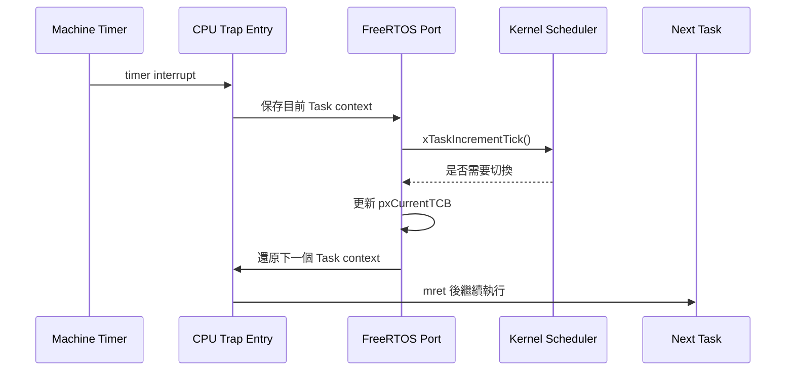
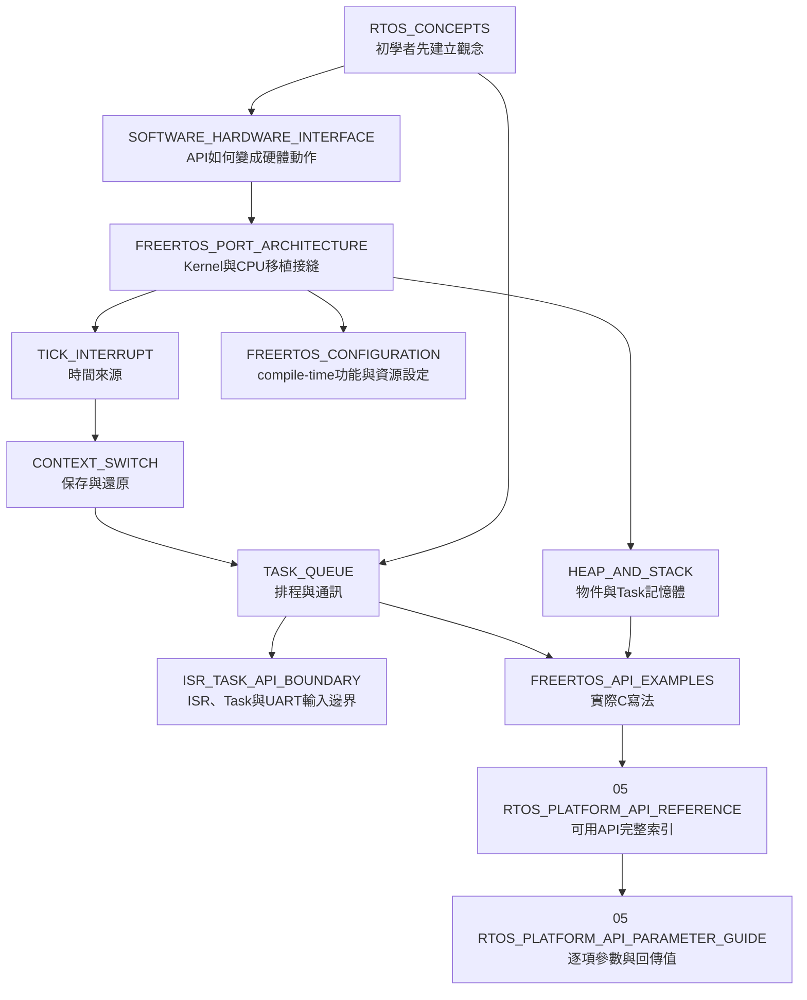

# 04 — FreeRTOS 導覽

> 這個資料夾解釋 FreeRTOS 如何在這顆 RV32IM CPU 上啟動、收到 tick、保存 Task 狀態、選擇下一個 Task，以及 application 應該使用哪些 API。

FreeRTOS 專案原始碼的目錄入口見 [OS/rtos/README.md](../../OS/rtos/README.md)；概念、移植與 API 的正式技術說明以本資料夾為準。

## 從 timer interrupt 到 Task 切換

## 概念層級

## 建議閱讀順序

| 需求 | 文件 |
|---|---|
| 第一次理解RTOS、Task與Scheduler | [RTOS_CONCEPTS.md](RTOS_CONCEPTS.md) |
| 理解 API 如何變成 CSR／MMIO／interrupt | [SOFTWARE_HARDWARE_INTERFACE.md](SOFTWARE_HARDWARE_INTERFACE.md) |
| 理解移植層全貌 | [FREERTOS_PORT_ARCHITECTURE.md](FREERTOS_PORT_ARCHITECTURE.md) |
| 理解 tick 與 timer MMIO | [TICK_INTERRUPT.md](TICK_INTERRUPT.md) |
| 理解 Task 為何能暫停再恢復 | [CONTEXT_SWITCH.md](CONTEXT_SWITCH.md) |
| 理解 Task state、priority、Queue | [TASK_QUEUE.md](TASK_QUEUE.md) |
| 分清Task／ISR API，以及UART輸入從哪裡取得 | [ISR_TASK_API_BOUNDARY.md](ISR_TASK_API_BOUNDARY.md) |
| 查`FreeRTOSConfig.h`設定、單位與修改影響 | [FREERTOS_CONFIGURATION.md](FREERTOS_CONFIGURATION.md) |
| 估算 heap、stack 與 allocation | [HEAP_AND_STACK.md](HEAP_AND_STACK.md) |
| 直接查 API 寫法 | [FREERTOS_API_EXAMPLES.md](FREERTOS_API_EXAMPLES.md) |
| 確認目前API是否可用／已驗證 | [RTOS_PLATFORM_API_REFERENCE.md](../05-applications/RTOS_PLATFORM_API_REFERENCE.md) |
| 查詢API每個參數怎麼填 | [RTOS_PLATFORM_API_PARAMETER_GUIDE.md](../05-applications/RTOS_PLATFORM_API_PARAMETER_GUIDE.md) |

## 不同讀者可以停在哪裡

- 第一次接觸RTOS：先讀 `RTOS_CONCEPTS`，再依需要深入其他文件。
- 只寫 application：讀完`RTOS_CONCEPTS`的Task／Blocking／API章節，再把`FREERTOS_API_EXAMPLES`當查詢手冊。
- 修改 FreeRTOS port：先讀 `SOFTWARE_HARDWARE_INTERFACE`，再讀 `PORT`、`TICK`、`CONTEXT_SWITCH`。
- 只想知道 Lua 是否使用 RTOS：改讀 [Application 層導覽](../05-applications/README.md)。

上下游：[CPU CSR／Interrupt](../01-architecture/CSR_EXCEPTION_INTERRUPT.md) · [Application](../05-applications/README.md) · [RTOS 驗證](../06-verification/RTOS_SIMULATION.md)
