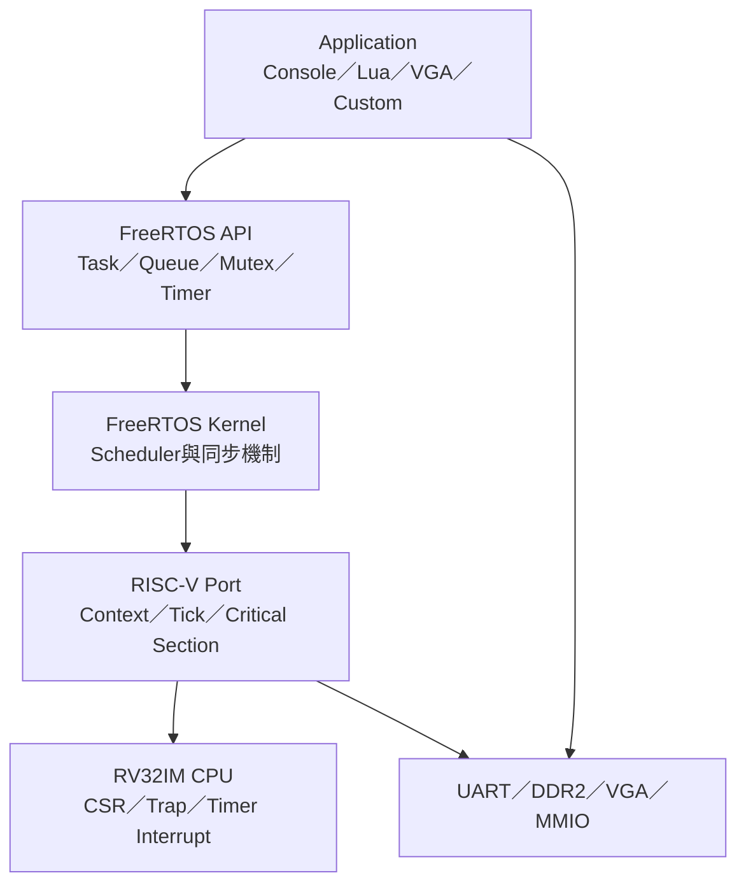
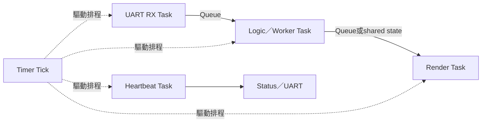
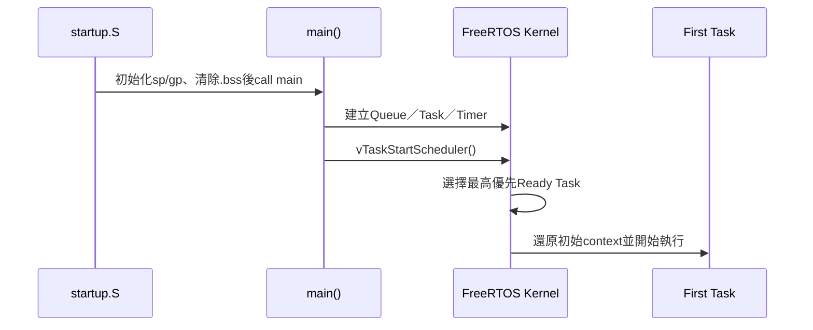
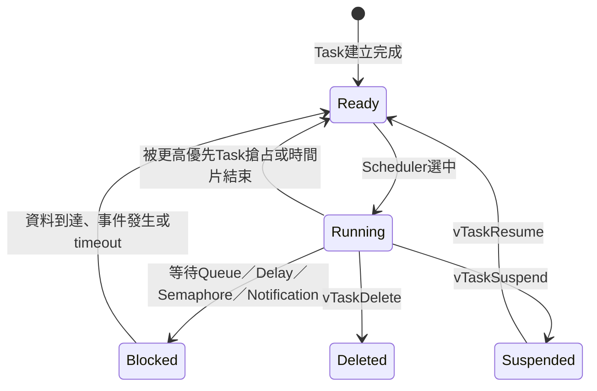
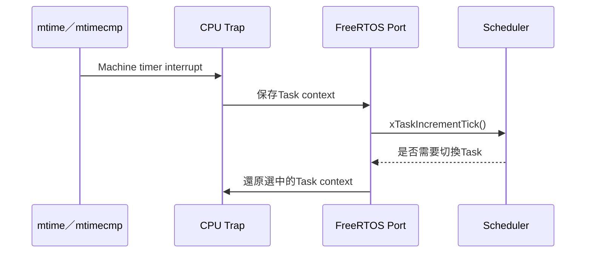
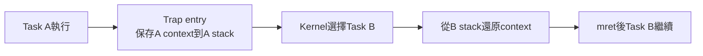
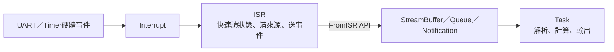
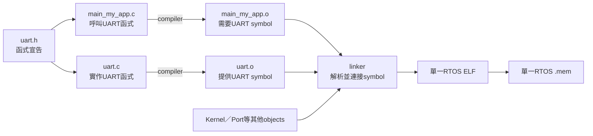

# RTOS 基礎概念與本專案實作

> 本頁寫給第一次接觸RTOS的讀者。先解釋「為什麼需要RTOS、Task如何排程、interrupt如何與Task合作」，最後才對應到本專案的FreeRTOS與自製RISC-V CPU。

## 1. RTOS是什麼

`RTOS`是 **Real-Time Operating System（即時作業系統）**。它的重點不是讓程式「跑得最快」，而是讓多個工作具有可預期的排程、優先權與回應方式。



本專案使用FreeRTOS。FreeRTOS不是另一顆CPU，也不是固定在bitstream裡的硬體；它與startup、driver和application一起被RISC-V GCC編譯成同一份 `.mem`，最後仍由自製CPU逐條執行machine code。

## 2. 裸機程式與RTOS程式的差別

### 裸機super-loop

最簡單的embedded程式通常只有一個大迴圈：

```c
int main(void)
{
    for (;;) {
        read_uart();
        update_game();
        draw_frame();
        send_status();
    }
}
```

所有工作必須自己輪流執行。只要其中一個函式等待太久，後面的功能全部被延遲。

### RTOS Task

RTOS將工作拆成多個Task：



Kernel保存每個Task的狀態，讓等待資料的Task進入Blocked，CPU則執行其他已Ready的Task。

## 3. Task不是什麼

Task是一段具有下列資源的執行流程：

- 一個entry function；
- 自己的stack；
- priority；
- Task state；
- Kernel內的TCB（Task Control Block）。

下列東西不會自動變成Task：

- 每一個C函式；
- 每一筆UART byte；
- 每次API呼叫；
- Lua function或Lua coroutine；
- interrupt本身。

如果某個Task呼叫一個完全不使用RTOS API的普通C函式，該函式仍在**目前Task的context**內執行。Kernel不會因此建立新Task。

## 4. `main()`、Scheduler與Task



Scheduler啟動前，`main()`只是一般startup流程中的C函式。它負責建立RTOS objects與Tasks。呼叫 `vTaskStartScheduler()` 後，正常情況不會再返回 `main()`。

## 5. Task狀態



最重要的狀態是：

| 狀態 | 意義 | 是否占用CPU |
|---|---|---:|
| Running | 現在正在CPU上執行 | 是 |
| Ready | 可以執行，但正在等待scheduler選中 | 否 |
| Blocked | 等待資料、事件或時間 | 否 |
| Suspended | 被明確暫停，不會因timeout自行Ready | 否 |

單核心CPU同一個瞬間只有一個Task真正Running；「多Task同時工作」是scheduler快速切換造成的併行效果，不是同一cycle執行多個Task。

## 6. Priority與Preemption

FreeRTOS通常選擇最高優先權的Ready Task。假設：

| Task | Priority | 狀態 |
|---|---:|---|
| UART RX | 3 | Blocked，等待字元 |
| Worker | 2 | Running |
| Heartbeat | 1 | Ready |

UART字元到達後，UART RX Task變成Ready。因為priority 3高於Worker的2，scheduler可以在安全切換點讓UART RX先執行，這就是preemptive scheduling。

高priority不代表可以無限制執行。高priority Task若永遠不block或yield，低priority Task可能發生starvation。

## 7. Blocking為什麼重要

不好的busy polling：

```c
while (!data_ready) {
    /* 一直消耗CPU cycle */
}
```

RTOS blocking：

```c
xQueueReceive(queue, &item, portMAX_DELAY);
```

Queue為空時Task進入Blocked，scheduler把CPU交給其他Task；資料到達時再使它Ready。

```text
Blocking不是整顆CPU停止
Blocking是目前Task暫時不參與排程
```

這也是Queue、Semaphore、Notification與Delay能提升系統結構性的主要原因。

## 8. Tick與時間

本專案實板核心與`mtime`使用50 MHz，FreeRTOS tick為1 kHz：

```text
50,000,000 core cycles / 1,000 ticks per second
= 50,000 cycles per tick
= 1 ms per tick
```



`vTaskDelay(pdMS_TO_TICKS(100))`會讓Task至少等待對應tick數，而不是讓CPU執行100 ms的空迴圈。

## 9. Context switch是什麼

Context是Task暫停後能正確恢復所需的CPU狀態，包括：

- 通用register；
- stack pointer；
- `mepc`；
- `mstatus`；
- critical nesting等port狀態。



Task B不是從函式第一行重新執行，而是從上次被切走的位置繼續。完整register frame與切換順序見 [CONTEXT_SWITCH.md](CONTEXT_SWITCH.md)。

## 10. Interrupt、ISR與Task的分工

如果還不清楚「目前在Task還是ISR」如何判斷、UART資料要在哪個API接收，或新硬體何時才需要寫ISR，請接著讀 [ISR_TASK_API_BOUNDARY.md](ISR_TASK_API_BOUNDARY.md)。



ISR應該短：

- 讀取硬體資料；
- 清除或確認interrupt來源；
- 使用 `...FromISR()` API通知Task；
- 必要時要求離開ISR後切換Task。

字串解析、Lua執行、大量UART輸出和長時間計算應放在Task，不應塞進ISR。

## 11. Queue、Semaphore、Mutex與Notification

| 物件 | 傳遞／表示什麼 | 常見用途 |
|---|---|---|
| Queue | 固定大小資料item的副本 | Producer把工作交給Worker |
| Task Notification | 一個Task內建的事件／計數／32-bit值 | ISR快速喚醒單一Task |
| Binary Semaphore | 一次事件或可用／不可用狀態 | ISR通知Task有事件 |
| Counting Semaphore | 多個相同資源的數量 | 追蹤可用buffer數 |
| Mutex | 共享資源ownership，含priority inheritance | 保護UART輸出或共享資料 |
| Event Group | 多個條件bit | 等待多個子系統完成 |
| StreamBuffer | 連續byte stream | UART RX bytes |
| Software Timer | 到期後執行短callback | 延後或週期控制事件 |

Queue保存的是item副本。若Queue item是pointer，Queue只複製pointer值，指向資料的生命週期與ownership仍要由application設計。

## 12. Static與Dynamic allocation

建立Task或Queue時需要TCB、stack與control structure。來源可以是：

- Static allocation：application預先提供陣列，大小固定且容易估算；
- Dynamic allocation：由FreeRTOS heap在runtime配置，彈性較高但要處理失敗與fragmentation。

本專案已能展示兩種配置；`heap_4.c`提供合併相鄰free block的allocator。Task stack depth的單位是32-bit word，不是byte。詳細配置見 [HEAP_AND_STACK.md](HEAP_AND_STACK.md)。

## 13. Kernel、Port、BSP與Application

| 層級 | 誰負責 | 本專案例子 |
|---|---|---|
| Kernel | FreeRTOS排程政策與objects | `tasks.c`、`queue.c`、`timers.c` |
| Port | 將Kernel接到RISC-V context、tick與critical section | 官方FreeRTOS RISC-V `port.c`、`portASM.S` |
| BSP／Driver | 板級UART、timer、MMIO與hook | `startup.S`、`uart.c`、`freertos_hooks.c` |
| Application | 建立Task並實作功能 | Console、Platform、Lua、VGA、使用者程式 |

### 為什麼 `.c` 實作檔不需要互相 `#include`

這句話不是「完全不用 `#include`」。精確意思是：

> Kernel、Port、BSP與Application不應直接 `#include` 對方的 `.c` 實作檔；需要使用某項功能時，include它提供的 `.h` 介面，並由build tool把對應`.c`分別編譯，最後交給linker連接。

```text
.h = 宣告：告訴compiler「函式名稱、參數與回傳型別」
.c = 實作：真正執行函式工作的程式碼
.o = 每個.c編譯後的object file
linker = 把呼叫端與實作端的symbol接起來，產生單一ELF
```

例如Application使用UART時應寫：

```c
/* main_my_app.c：只include介面。 */
#include "uart.h"

int main(void)
{
    rtos_uart_write_line("MY_APP_READY");
    /* 建立Tasks並啟動scheduler。 */
}
```

`uart.h`提供宣告：

```c
void rtos_uart_write_line(const char *text);
```

真正操作UART MMIO的內容則留在`uart.c`。Application不需要，也不應寫：

```c
/* 錯誤示範：不要直接include另一個實作檔。 */
#include "uart.c"
```

本專案的RTOS build tool會另外編譯`main_my_app.c`與`uart.c`。`main_my_app.c`產生的object含有「我要呼叫`rtos_uart_write_line`」的未解析symbol；`uart.c`產生的object提供該symbol，linker最後將兩者接起來。



相同規則也用在FreeRTOS API：

| Application寫的內容 | 介面來自 | 實作來自 |
|---|---|---|
| `xQueueSend(...)` | `FreeRTOS.h`、`queue.h` | Kernel的`queue.c` |
| `vTaskDelay(...)` | `FreeRTOS.h`、`task.h` | Kernel的`tasks.c`與RISC-V Port |
| `rtos_uart_write_line(...)` | `uart.h` | BSP／Driver的`uart.c` |

因此各層不是互相複製程式碼，而是透過穩定介面合作：

```text
Application include FreeRTOS／BSP headers
    → 呼叫Kernel或Driver API
Kernel透過RISC-V Port介面
    → 完成context switch、tick與critical section
BSP／Driver
    → 以CSR、MMIO與interrupt接觸CPU／FPGA硬體
```

常見錯誤：

| 錯誤訊息／做法 | 原因 |
|---|---|
| `fatal error: uart.h: No such file` | compiler找不到header；需修正`#include`或`-I`路徑 |
| `undefined reference to rtos_uart_write_line` | header已找到，但實作`.c`沒有編入或函式名稱不一致 |
| `multiple definition` | 同一實作被重複編譯，常見原因是include了`.c`又把它加入source list |

Interrupt進入`mtvec`則是另一種連接：由CPU architectural control transfer完成，不是一般C函式呼叫。新增自訂Application與額外`.c/.h`的實際命令，見 [ADDING_NEW_RTOS_APP.md](../05-applications/ADDING_NEW_RTOS_APP.md)。

## 14. 一份RTOS `.mem`包含什麼

```text
startup + linker layout
FreeRTOS kernel
RISC-V port
BSP／drivers
heap與C runtime
一個application profile
需要的額外library（例如Lua VM）
```

所以FreeRTOS不是先單獨安裝在板上、再像桌面OS一樣啟動多個獨立exe。每次build會把kernel與選定application連結成完整firmware image。

## 15. 如何證明這是真正的RTOS

不能只因UART交錯印出A/B就宣稱有RTOS。較有力的證據是：

1. Task由FreeRTOS `xTaskCreateStatic()`／`xTaskCreate()`建立；
2. Scheduler由 `vTaskStartScheduler()`啟動；
3. tick由machine timer interrupt驅動；
4. context會保存並恢復不同Task register與stack；
5. Queue full／empty會使Task block與unblock；
6. 高優先TaskReady時能觸發preemption；
7. Platform、simulation與實板probe能重複通過。

本專案的Smoke、Console、Platform、Lua與VGA Queue demo分別提供這些證據的不同組合。

## 16. 常見誤解

| 誤解 | 正確說法 |
|---|---|
| RTOS是另一個硬體核心 | RTOS是CPU執行的software kernel |
| 每個C函式都是Task | 函式在呼叫它的Task context內執行 |
| UART每個byte都是Task | Byte先由UART硬體／ISR接收，再交給Task處理 |
| Task block代表CPU停住 | 只有該Task等待，其他Ready Task繼續 |
| 高priority Task永遠比較快 | 它只是優先被排程；若自己等待，仍會Block |
| Queue傳的是共享變數本體 | Queue預設複製item；pointer則只複製位址 |
| Lua coroutine等於FreeRTOS Task | Coroutine由Lua VM在同一Lua Task內管理 |
| 沒呼叫RTOS API的C程式不能編譯 | 可以編譯；若在Task內呼叫，它仍屬於該Task |

## 17. 建議閱讀順序

讀完本頁後依目的繼續：

1. [TASK_QUEUE.md](TASK_QUEUE.md)：Task state、priority與Queue細節；
2. [TICK_INTERRUPT.md](TICK_INTERRUPT.md)：machine timer與tick；
3. [CONTEXT_SWITCH.md](CONTEXT_SWITCH.md)：register frame與`mret`；
4. [FREERTOS_PORT_ARCHITECTURE.md](FREERTOS_PORT_ARCHITECTURE.md)：本專案port與CPU接縫；
5. [FREERTOS_API_EXAMPLES.md](FREERTOS_API_EXAMPLES.md)：實際API程式骨架；
6. [APPLICATION_RTOS_INTERACTION.md](../05-applications/APPLICATION_RTOS_INTERACTION.md)：現有application的資料流。
