# RTOS 軟體 API 如何連到 CPU 與 FPGA 硬體

> 本文件回答本專案最重要的軟硬體接口問題：application 呼叫一個 C／FreeRTOS／Lua API 之後，程式如何變成 RISC-V 指令，又如何透過 CSR、MMIO 與 interrupt 驅動 FPGA RTL。

若要先理解preprocessor、`queue.h`與`queue.c`分工、RISC-V ABI、函式參數register，以及如何從`.dis`查看每個API的實際指令，先讀 [C_TO_RISCV_MACHINE_CODE.md](../03-build-boot/C_TO_RISCV_MACHINE_CODE.md)。本頁接著追runtime的RAM、CSR、trap與MMIO路徑。

先記住一句話：

> **硬體不認得 `xQueueSend()`、`vTaskDelay()`、`rtos_uart_putc()` 或 `rtos.sleep()` 這些名稱；硬體只會執行 RISC-V machine code，並對 register、CSR、記憶體位址與 interrupt signal 作出反應。**

API 是軟體工程師使用的介面。編譯器、FreeRTOS kernel、RISC-V port 與板級 driver 會把 API 的意義逐層轉成 CPU 能執行的指令和硬體看得懂的 transaction。

---

## 1. 先看完整分層

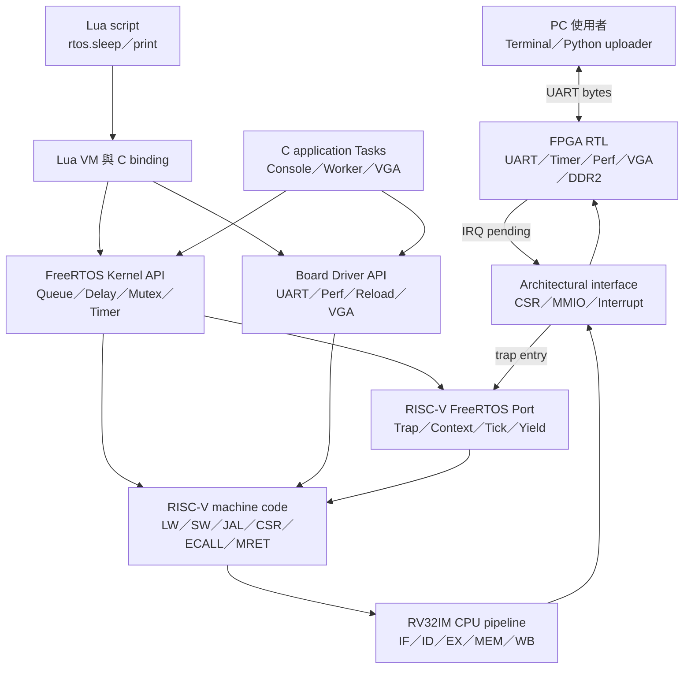

這張圖有兩條主要路徑：

1. **向下的呼叫路徑**：Application 呼叫 API，最後由 CPU 執行 load、store、CSR 或 trap 相關指令。
2. **向上的事件路徑**：UART 或 timer 硬體提出 interrupt，CPU 進入 trap handler，ISR 再用 FreeRTOS 的 `FromISR` API 喚醒 Task。

Lua 不是繞過這套架構。Lua VM 本身與 binding 已經編譯成 RISC-V machine code，腳本呼叫 `rtos.sleep()` 時，VM 會找到 C binding，再呼叫 FreeRTOS API。

---

## 2. 四個層級各自負責什麼

| 層級 | 目前專案中的例子 | 它負責的事 | 它不知道的事 |
|---|---|---|---|
| Application／Lua | Console、Platform、Lua、VGA demo | 決定功能、Task、資料流與錯誤政策 | 不直接實作 context switch |
| FreeRTOS Kernel | Task、Queue、StreamBuffer、Semaphore、Timer | 管理 TCB、ready／blocked list、同步物件與排程 | 不知道 UART 位址與 VGA 像素格式 |
| RISC-V Port／BSP | `portASM.S`、`uart.c`、`board_control.c` | 把 OS 接到 RISC-V trap、CSR、timer 與板級 MMIO | 不決定 application 要做什麼產品功能 |
| CPU／FPGA RTL | Pipeline、CSR、MMIO decoder、UART、timer、VGA | 執行 machine code、完成 transaction、產生 interrupt | 不知道 C function、Task 名稱或 Lua 語法 |

其中 `Port` 與 `BSP` 都是軟硬體接縫，但方向不同：

- **Port** 回答「FreeRTOS 如何使用這顆 CPU 的 trap、register、timer 與 interrupt architecture」。
- **BSP／driver** 回答「軟體如何操作這塊 FPGA 板上的 UART、VGA、效能計數器與 reload register」。

---

## 3. API 並不全都會直接碰硬體

把目前會用到的API分成三類，是依照它在**執行期間主要影響的對象**分類，不是依照「有沒有被編譯成machine code」分類。

> 純Kernel、Kernel + Port與Driver三類API只要真的在FPGA上執行，最終都必須成為RISC-V machine code。差別是這些指令主要讀寫DDR軟體資料、進入Trap／操作CSR，還是存取周邊MMIO。

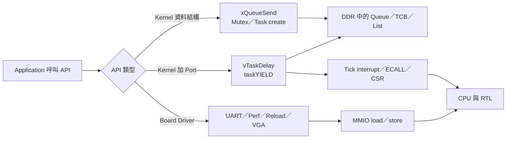

### 先釐清：三類API都會變成machine code

| API類型 | C例子 | 最終machine code主要影響什麼 |
|---|---|---|
| 純Kernel型 | `xQueueSend()` | 以load/store更新DDR中的Queue、TCB與Task list |
| Kernel + Port型 | `vTaskDelay()`、`taskYIELD()` | 先更新DDR資料，再透過`ECALL`、Trap、CSR或timer完成排程 |
| Driver型 | `rtos_uart_write()` | 以load/store存取UART等MMIO位址 |

CPU與RTL不會解析`xQueueSend`這個C名稱。完整轉換是：

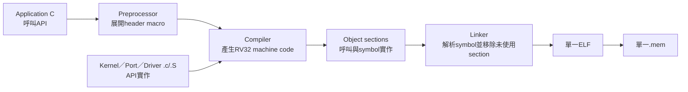

這也要和「只引用header」分開理解：

```c
#include "queue.h"
```

這一行主要讓compiler看見型別、函式宣告與macro，單獨include不代表所有Queue實作都會留在`.mem`。真正實作位於FreeRTOS的`queue.c`，由build tool另外編譯。

本專案使用：

```text
-ffunction-sections
-fdata-sections
-Wl,--gc-sections
```

因此每個function/data會放在較獨立的section；沒有被最終程式使用的section通常會被linker移除。情況可簡化成：

```text
只有#include queue.h，沒有呼叫Queue API
    -> header提供宣告／macro
    -> 不會因此把所有Queue功能留在.mem

實際呼叫xQueueSend(...)
    -> 呼叫所需實作與依賴會被linker保留
    -> CPU執行對應RV32 machine code
```

有些public API本身是macro，不一定在ELF中保留同名function。例如`xQueueSend()`會展開成底層的`xQueueGenericSend(...)`呼叫，所以disassembly可能看到`xQueueGenericSend`而不是`xQueueSend`。這不代表API沒有執行，只代表名稱在preprocessor階段已經展開。

最簡單的記法：

```text
API三分類        = 執行時主要走DDR、Port／CPU控制，還是MMIO
#include         = 提供宣告、型別與macro
.c／.S           = 提供真正實作
compiler         = 轉成machine code
linker           = 接起呼叫與實作，移除未使用section
```

### 3.1 純 Kernel 型：主要操作 DDR 裡的軟體資料

例子：

- `xQueueSend()`；
- `xQueueReceive()`；
- `xSemaphoreTake()`；
- `xTaskCreate()`；
- `xTaskGetTickCount()`。

這些 API 主要讀寫 Queue、TCB、list 與 buffer。它們最後仍由 CPU 執行 machine code，也會經 Cache／DDR 讀寫資料，但**沒有一個叫做 Queue 的 FPGA 周邊**。

例如 `xQueueSend()` 的核心概念是：

1. 把 item 複製到 Queue storage；
2. 更新 Queue 的 read/write index 與 item count；
3. 若有 Task 等待該 Queue，將它移回 ready list；
4. 若更高 priority Task 被喚醒，可能要求 scheduler 切換 Task。

### 3.2 Kernel + Port 型：軟體狀態會和 CPU architecture 接合

例子：

- `vTaskDelay()` 把 Task 放入 delayed list，之後由 hardware timer tick 喚醒；
- `taskYIELD()` 最後執行 `ECALL`，經 trap 路徑切換 Task；
- critical section 透過 RISC-V CSR 控制 interrupt enable；
- scheduler 啟動時設定 `mtimecmp`，並啟用 `mie.MTIE`／`mie.MEIE`。

這類 API 不是每一次都直接寫周邊 register，但它依賴 Port 和 CPU 的 trap／interrupt 能力。

### 3.3 Driver 型：直接透過 MMIO 操作 FPGA RTL

例子：

- `rtos_uart_putc()`；
- `perf_counters_snapshot()`；
- `rtos_board_request_image_reload()`；
- `vga_fb_put_pixel()`／`vga_fb_present()`。

這些 C function 會讀寫 `volatile` 位址。編譯器通常產生 `LW`／`SW` 等指令，CPU 的 MEM 路徑把它們送到 local MMIO decoder，再由相對應 RTL 回應。

---

## 4. 從 C function 到硬體 transaction

以下用 UART 傳送字元 `A` 為例。Application 只寫：

```c
rtos_uart_putc('A');
```

實際 driver 位於 [`OS/rtos/src/uart.c`](../../OS/rtos/src/uart.c)：

```c
#define RTOS_UART_TX_DATA   (*(volatile uint32_t *)0x40000000u)
#define RTOS_UART_TX_STATUS (*(volatile uint32_t *)0x40000004u)

void rtos_uart_putc(char c)
{
    while ((RTOS_UART_TX_STATUS & 1u) == 0u) {
    }
    RTOS_UART_TX_DATA = (uint32_t)(unsigned char)c;
}
```

編譯後的實際 register allocation 會因 GCC 版本與最佳化選項不同，但概念上相當於：

```asm
poll:
    lw    t0, 4(a0)       # 讀 0x4000_0004 TX status
    andi  t0, t0, 1
    beqz  t0, poll
    sw    a1, 0(a0)       # 寫 0x4000_0000 TX data
    ret
```

完整路徑如下：

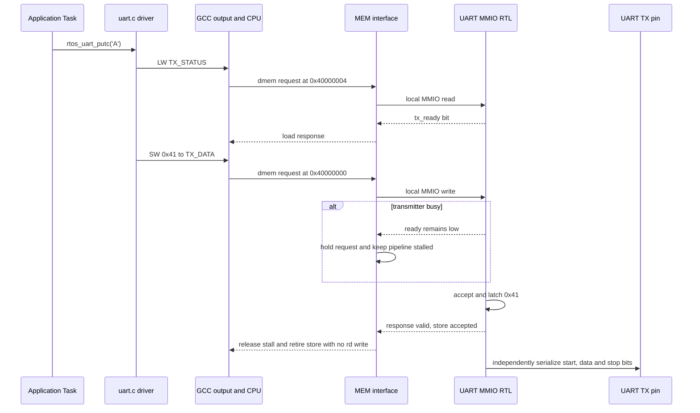

對應的 RTL decode 位於 [`icache_pipeline_top.v`](../../icache_pipeline_top.v)。它不會看到 `rtos_uart_putc` 這個名稱，只會看到：

- `dmem_addr_o = 0x4000_0004` 的 read；
- `dmem_addr_o = 0x4000_0000` 的 write；
- `dmem_wdata_o` 低位元組是 `0x41`；
- `dmem_wstrb_o` 指示有效 byte lane；
- `ready/rvalid/error` 完成 transaction 或回報 fault。

`TX` busy 時，decoder 會把 `ready` 壓低，CPU 的 memory operation 等待，而不是靜默丟掉字元。TOP做的是address selection與response mux，不是把周邊「通電」：UART、VGA等RTL一直存在，只有命中位址的模組會收到這筆有效request。命中local MMIO後，`dcache_cpu_req_valid`會被壓低，所以request不會先進D-cache再由D-cache退回。

### 4.1 UART接受字元不等於字元已全部送完

這裡有兩個不同的完成時點：

```text
MMIO store completion
  = UART已接受並鎖存一個byte，MEM可以解除stall

UART wire completion
  = start bit、8個data bits與stop bit已經全部從TX pin送出
```

本專案在UART空閒時接受`TX_DATA` write、啟動transmitter，並回覆MMIO transaction完成。Store接著以`wb_valid=1`、`rd_wen=0`通過MEM/WB與WB退休；`SW`沒有目的暫存器，所以WB不會寫register file。UART則在CPU繼續執行其他指令時，獨立把該字元逐bit送完。

若下一個store到達時UART仍busy，`ready=0`會讓新的MEM operation等待。`rtos_uart_putc()`還會在寫入前輪詢`TX_STATUS`，因此正常driver路徑會等到`tx_ready=1`才送下一個byte。

以115200 baud、8N1為例，一個字元通常是10 bits，wire transmission約需`10 / 115200 = 86.8 us`，在50 MHz約是4340個core cycles。CPU的store不需要等待這4340 cycles才退休；只有要確認最後一個字元真的離開TX pin時，才使用`rtos_uart_wait_tx_idle()`持續等到transmitter不再busy。

### 4.2 `volatile` 為什麼不可省略

一般 RAM 的同一位址若連續讀兩次，編譯器可能認為值不變並重用前一次結果。但硬體 register 會自行改變，而且讀寫本身可能有 side effect。

`volatile` 告訴編譯器：

- 每次 C source 要求的讀寫都必須真的產生；
- 不可把 register value 永久留在 CPU general-purpose register；
- 不可把看似多餘的周邊存取刪除。

它主要限制 compiler optimization，不等於 mutex，也不保證多 Task 原子性。

### 4.3 如何看自己的實際 machine code

Build 完成後可查 `.dis`：

```powershell
Select-String -Path .\build_rtos_apps\console\rtos_console.dis -Pattern '<rtos_uart_putc>' -Context 0,20
```

或直接用 toolchain：

```powershell
riscv-none-elf-objdump -d .\build_rtos_apps\console\rtos_console.elf | Select-String -Pattern '<rtos_uart_putc>' -Context 0,20
```

若 function 被 inline，可能看不到獨立 symbol，此時要查呼叫者或使用 build 產生的 `.map`／`.dis`。

---

## 5. CPU 的 load/store 如何找到正確 RTL

CPU 並不是呼叫一個 Verilog function。軟硬體以 data-memory transaction signals 連接：

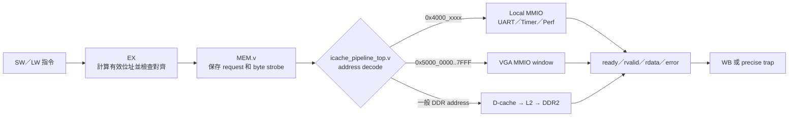

目前的關鍵規則：

- `0x4000_0000..0x4000_FFFF` 命中 local MMIO，繞過 D-cache／L2；
- `0x5000_0000..0x5000_7FFF` 在啟用 VGA 的 build 中命中 VGA window；
- 其他正常資料位址走 D-cache、L2 與 DDR2；
- 未對齊 access 在 EX 就產生 trap，不會送到 MMIO；
- 已對齊但未定義的 MMIO address 會回 `error`，形成 load/store access fault。

詳細 transaction 規格見 [MMIO.md](../02-memory-io/MMIO.md)，完整 address map 見 [MEMORY_MAP.md](../02-memory-io/MEMORY_MAP.md)。

---

## 6. 目前 API 到硬體的對照表

| 上層呼叫 | 主要實作位置 | CPU 最終在做什麼 | 硬體接口／RTL |
|---|---|---|---|
| `xQueueSend()` | FreeRTOS `queue.c` | 讀寫 Queue storage/list，必要時切換 Task | 一般 Cache／DDR，沒有 Queue MMIO |
| `xQueueReceive()` | FreeRTOS `queue.c` | 取出資料或讓 Task Blocked | 一般 Cache／DDR，必要時進 scheduler |
| `vTaskDelay()` | FreeRTOS `tasks.c` | 更新 delayed list並 yield | DDR + `ECALL`／tick interrupt |
| `xTaskGetTickCount()` | FreeRTOS `tasks.c` | 讀 kernel tick variable | 一般 RAM，不是直接讀 `mtime` |
| `taskYIELD()` | RISC-V `portmacro.h` | 執行 `ECALL` | CPU trap，`mcause=11` |
| Scheduler tick | RISC-V `port.c`／`portASM.S` | 讀 `mtime`、寫 `mtimecmp`、處理 timer trap | `0x4000_0020..002C` + `mie.MTIE` |
| `rtos_uart_putc()` | [`uart.c`](../../OS/rtos/src/uart.c) | 輪詢後寫一個字元 | UART TX `0x4000_0000/0004` |
| `rtos_uart_getc()` | [`uart.c`](../../OS/rtos/src/uart.c) | 從 StreamBuffer 取 byte，必要時 block | StreamBuffer 在 RAM，來源是 UART IRQ |
| UART RX ISR | [`uart.c`](../../OS/rtos/src/uart.c)、[`freertos_hooks.c`](../../OS/rtos/src/freertos_hooks.c) | 讀 RX MMIO，呼叫 `xStreamBufferSendFromISR()` | RX `0x4000_0008/000C` + MEIP |
| `perf_counters_snapshot()` | [`perf_counters.c`](../../OS/rtos/src/perf_counters.c) | 寫 control，再讀 24 組 64-bit counter | PERF `0x4000_0100..01CC` |
| `rtos_board_request_image_reload()` | [`board_control.c`](../../OS/rtos/src/board_control.c) | fence後寫 trigger，再等待 reset | reload `0x4000_0014` |
| `vga_fb_put_pixel()` | [`game/vga_fb.c`](../../game/vga_fb.c) | read-modify-write framebuffer word | VGA `0x5000_0000..7FFF` |
| Lua `rtos.sleep(ms)` | [`lua_rtos_libs.c`](../../OS/rtos/src/lua_rtos_libs.c) | VM 呼叫 C binding，再呼叫 `vTaskDelay()` | 和 `vTaskDelay()` 相同 |
| Lua `print()` | Lua VM + [`lua_rtos_port.c`](../../OS/rtos/src/lua_rtos_port.c) | 格式化文字，逐字呼叫 UART driver | UART TX MMIO |

這張表也說明：**「有使用 CPU」不代表「會產生新的 machine code」**。Lua bytecode 是 VM 的資料；執行時由已存在於 `.mem` 的 Lua VM machine code反覆解讀並操作 CPU。

---

## 7. `xQueueSend()`：純軟體 API 也會使用 CPU 與 DDR

假設 Console command Task 執行：

```c
WorkRequest_t request = { .value = 256u };
xQueueSend(work_queue, &request, portMAX_DELAY);
```

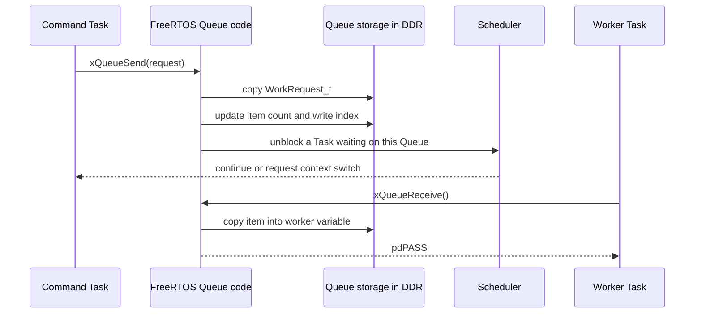

Queue 的「硬體效果」只是在執行一般 load/store，經 Cache 存取 DDR。FreeRTOS 用資料結構建立了 Queue 語意；CPU 與 DDR 不知道那些 bytes 代表工作請求。

這也解釋了為什麼 Queue 可以傳任何固定大小的 C struct：硬體只看 bytes，資料型別由 C 與 application 約定。

---

## 8. `vTaskDelay()`：不是每次都重新設定硬體 timer

以 `vTaskDelay(pdMS_TO_TICKS(10))` 為例：

1. Kernel 依目前 tick 計算 wake tick；
2. 將目前 Task 從 ready list移到 delayed list；
3. 觸發 scheduler，其他 ready Task 開始執行；
4. `mtime` 硬體持續每個 core clock 增加；
5. 每 50,000 counts 達到 `mtimecmp`，產生 1 kHz machine timer interrupt；
6. Port 呼叫 `xTaskIncrementTick()`；
7. 到第10個 tick時，Kernel把原 Task移回 ready list；
8. 排程選到它後，從 `vTaskDelay()` 後面繼續。

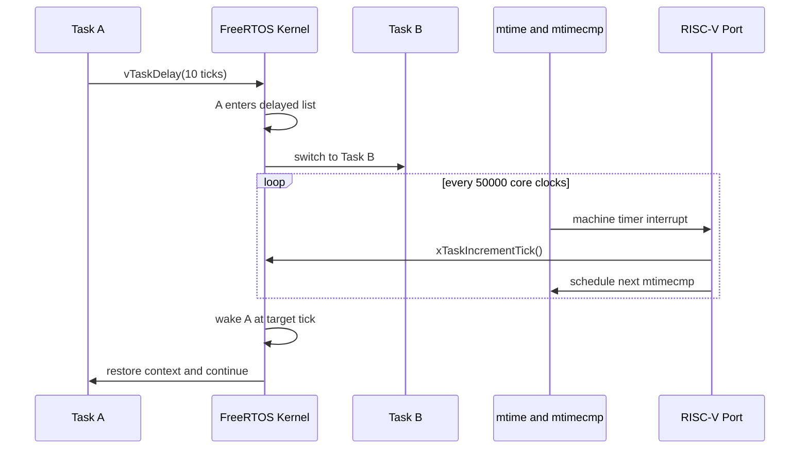

所以：

- 每次 `vTaskDelay()` 主要改 Kernel list；
- 系統共用一個 periodic hardware tick；
- 不是每個 Task 各有一個 FPGA timer；
- `xTaskGetTickCount()` 讀 Kernel tick count，而 runtime stats 才直接用 `mtime` low word。

Timer 位址與 64-bit 安全更新方式見 [TICK_INTERRUPT.md](TICK_INTERRUPT.md)。

---

## 9. `taskYIELD()`：用 `ECALL` 進入 Port

RISC-V Port 把：

```c
taskYIELD();
```

定義成概念上的：

```asm
ecall
```

CPU 執行 `ECALL` 後：

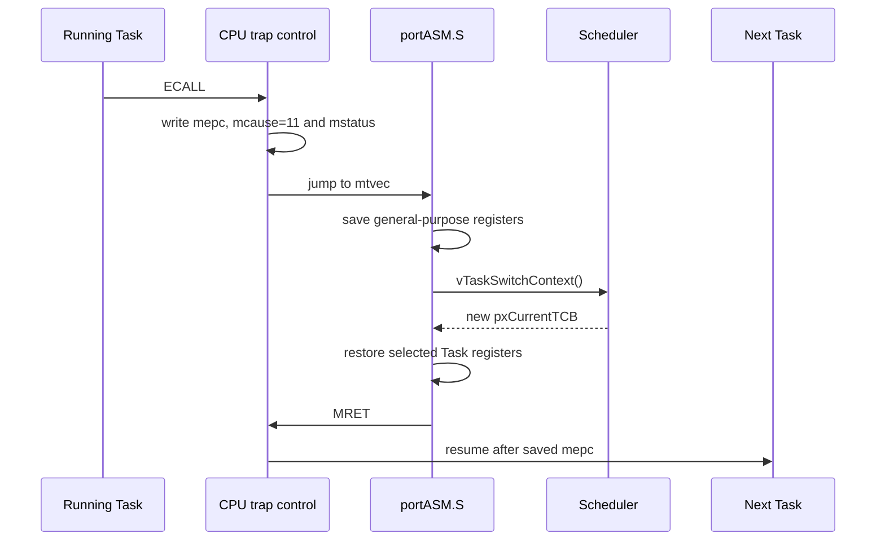

這裡的分工是：

- CPU 硬體負責 precise trap、CSR 更新與跳到 `mtvec`；
- Port assembly 負責把完整 Task register context 存入 stack；
- Kernel 負責選擇新的 `pxCurrentTCB`；
- `MRET` 讓 CPU 回到被選中 Task 的 PC。

更細的 stack frame 見 [CONTEXT_SWITCH.md](CONTEXT_SWITCH.md)，CSR trap 規則見 [CSR_EXCEPTION_INTERRUPT.md](../01-architecture/CSR_EXCEPTION_INTERRUPT.md)。

---

## 10. UART RX：硬體事件如何向上喚醒 Task

UART TX 是軟體主動寫硬體；UART RX 則從 FPGA pin 開始向上傳遞。

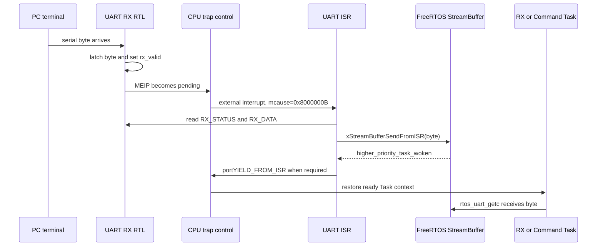

目前硬體只有一個 byte holding register；`rtos_uart_rx_interrupt_init()` 另外建立 256-byte static StreamBuffer，實際可存放255 bytes。兩種壓力要分開：

- **hardware overrun**：新 byte 到達時，硬體前一 byte 還沒被 ISR 讀走；
- **stream drop**：ISR 已取出硬體 byte，但 FreeRTOS StreamBuffer 沒空間。

`rtos_uart_getc()` 並不是直接等 UART register。Interrupt先把 byte搬到軟體 StreamBuffer，Task再用會 blocking 的 API 等待資料，因此空等時不會一直佔用 CPU。

完整 UART 協定與 overrun 說明見 [UART.md](../02-memory-io/UART.md)。

---

## 11. ISR 為什麼必須使用 `FromISR` API

若要先用Application角度理解「ISR不是由Task手動呼叫」、`rtos_uart_getc()`如何接收資料，以及現有UART為何不用重寫ISR，見 [ISR_TASK_API_BOUNDARY.md](ISR_TASK_API_BOUNDARY.md)。本節接著說明軟硬體interface規則。

ISR 不是一般 Task context：

- 它使用 ISR stack；
- 必須快速完成；
- 不能做會等待的 blocking operation；
- 若喚醒高 priority Task，要在離開 ISR 前通知 Port 切換。

因此 ISR 使用：

```c
BaseType_t higher_priority_task_woken = pdFALSE;

xStreamBufferSendFromISR(
    rx_stream,
    &value,
    1u,
    &higher_priority_task_woken
);

portYIELD_FROM_ISR(higher_priority_task_woken);
```

而不是普通的 `xStreamBufferSend()` 或 `vTaskDelay()`。`FromISR` 版本會使用符合 interrupt context 的 critical-section與喚醒規則，不會嘗試讓 ISR 本身 Blocked。

---

## 12. 效能計數器：硬體累計，軟體拍快照

24個計數器的 event signal 在 RTL 中每 cycle形成，例如：

- cycle；
- retired instruction；
- front-end／back-end stall；
- branch redirect；
- I-cache／D-cache miss；
- DDR read/write command；
- exception／interrupt。

Application 呼叫 `perf_counters_snapshot()` 時不是由 CPU 回頭分析每一條歷史指令，而是：

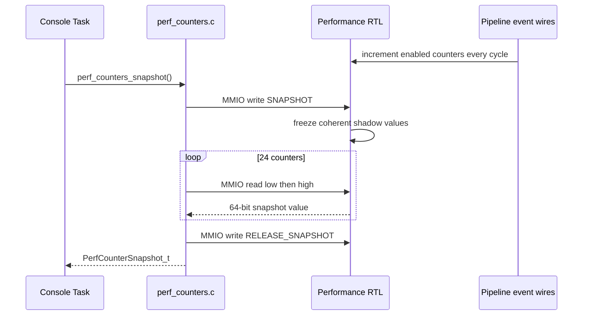

因此它可以讀到接近即時的區間統計，但不是 waveform viewer，也不是逐指令 trace。硬體負責 event counting，CPU／driver只負責控制與讀出。

完整 register ABI 見 [PERFORMANCE_COUNTER_REGISTERS.md](../02-memory-io/PERFORMANCE_COUNTER_REGISTERS.md)，分析方法見 [PERFORMANCE_MONITORING_ARCHITECTURE.md](../02-memory-io/PERFORMANCE_MONITORING_ARCHITECTURE.md)。

---

## 13. Reload：一個 API 如何交回 DDR 所有權

`rtos_board_request_image_reload()` 的路徑是：

1. 等 UART TX idle，讓最後一行狀態真的送完；
2. 執行 I/O fence，避免關鍵操作被 compiler／CPU ordering影響；
3. 對 `0x4000_0014` 寫 `1`；
4. RTL 進入 arm delay；
5. reset CPU並讓 bootloader重新取得 DDR；
6. PC runner傳入下一份 `.mem`；
7. bootloader驗證並重新 release CPU。

這不是刪除一個 Task，而是整份 firmware replacement。所有 Task、Queue、heap與 globals 都會重新開始。

---

## 14. VGA：把記憶體 store 變成畫面

VGA framebuffer driver 使用 `0x5000_0000..0x5000_7FFF` window。以 `vga_fb_put_pixel()` 為例：

1. C code計算 `(x, y)` 對應的 packed 4-bit pixel位置；
2. CPU 讀出含該像素的16-bit word；
3. 在 general-purpose register內替換目標 nibble；
4. 寫回 framebuffer window；
5. VGA RTL依 display buffer讀出像素並產生同步與 RGB signal；
6. `vga_fb_present()` 寫 control register切換顯示 buffer。

FreeRTOS不會自動繪圖。Application可以讓 renderer Task從 Queue接收 draw command，再呼叫 VGA driver；Queue負責Task通訊，VGA driver負責MMIO，VGA RTL負責掃描輸出。

詳見 [VGA.md](../02-memory-io/VGA.md) 與 [VGA_RTOS_DEMOS.md](../05-applications/VGA_RTOS_DEMOS.md)。

---

## 15. Lua API 如何走完整條路

腳本：

```lua
print("before")
rtos.sleep(100)
print("after")
```

不會被翻譯成新的 C source再重新編譯。實際路徑是：

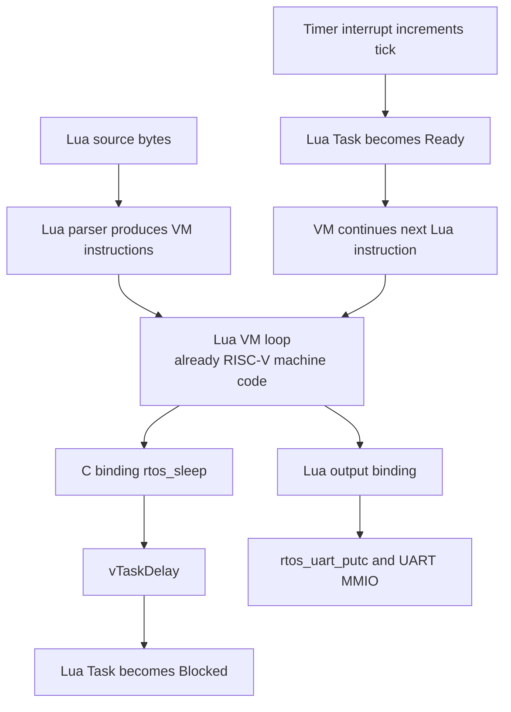

三種「指令」不要混在一起：

| 名稱 | 例子 | 誰理解它 |
|---|---|---|
| Lua source／VM instruction | `rtos.sleep(100)`、Lua bytecode | Lua VM |
| C／FreeRTOS API | `vTaskDelay()`、`rtos_uart_putc()` | 已編譯的 C library／kernel |
| RISC-V machine instruction | `LW`、`SW`、`ECALL`、`MRET` | CPU RTL |

完整 bridge 函式與新增 binding 方法見 [LUA_FREERTOS_BRIDGE.md](../05-applications/LUA_FREERTOS_BRIDGE.md)。

---

## 16. CSR 與 MMIO 的差異

兩者都可讓軟體控制硬體狀態，但不是同一種介面。

| 項目 | CSR | MMIO |
|---|---|---|
| 指令 | `CSRRW/CSRRS/CSRRC` 等 | 一般 `LW/SW/LB/SB` |
| 位址／編號 | instruction中的12-bit CSR address | 一般32-bit memory address |
| 例子 | `mstatus`、`mie`、`mtvec`、`mepc`、`mcause` | UART、`mtime`、`mtimecmp`、PERF、VGA |
| 主要用途 | CPU architectural state | SoC／板級周邊 register或window |
| Pipeline 路徑 | CSR operation與trap control | EX有效位址 → MEM transaction → decoder |

例子：啟用 machine external interrupt需要兩邊都正確：

1. UART RX硬體使外部 pending source成立；
2. `mie.MEIE` 透過 CSR instruction設為1；
3. `mstatus.MIE` 允許全域machine interrupt；
4. CPU在可接受interrupt的邊界進入trap。

只設 MMIO pending source而沒開CSR enable，或只開CSR但沒有硬體 pending，都不會進 ISR。

---

## 17. 錯誤會在哪一層出現

| 層級 | 例子 | 觀察方法 |
|---|---|---|
| Build／link | function未宣告、library未加入、undefined reference | GCC／linker錯誤 |
| API | Queue full、timeout、allocation失敗 | 檢查 `pdPASS`、handle、return value |
| Kernel | stack overflow、assert、錯誤ISR API | hook印出的 marker與 register |
| Driver／protocol | UART hardware overrun、StreamBuffer drop | `rtos_uart_rx_*_count()` |
| MMIO | unmapped address、非法讀寫方向 | load/store access fault，查看 `mcause/mtval` |
| CPU | misaligned、illegal instruction、CSR錯誤 | exception handler的 `mcause/mepc/mtval` |
| RTL | ready永久不回、interrupt未產生、decode錯誤 | RTL testbench、waveform、counter |

這也是分層文件的重要性：看到 Queue timeout，不應立刻修改 UART RTL；看到 `mcause=5`，則應先查 `mtval` 的 MMIO address，而不是先懷疑 scheduler。

---

## 18. 如何從一個 API 追到硬體

以任何陌生 API 為起點，可以按以下順序追蹤：

1. **找宣告**：`rg -n "function_name" OS game`。
2. **找 C 實作**：確認它只是呼叫 Kernel，還是使用 `volatile` address／inline assembly。
3. **看 build source list**：確認實作檔真的有被 [`build_rtos_app.ps1`](../../tools/build_rtos_app.ps1) 編入 profile。
4. **看 `.map`**：確認 symbol存在與所在 section。
5. **看 `.dis`**：確認最後是一般 RAM access、MMIO `LW/SW`、CSR instruction或 `ECALL`。
6. **查 address map**：用 [MEMORY_MAP.md](../02-memory-io/MEMORY_MAP.md) 確認位址屬於 DDR、local MMIO或VGA。
7. **找 RTL decode**：在 [`icache_pipeline_top.v`](../../icache_pipeline_top.v) 查 address constant與 select signal。
8. **找 peripheral state**：確認 write effect、read side effect、ready、error與 interrupt source。
9. **選驗證層**：純 Kernel行為用 RTOS simulation，register協定用 MMIO testbench，完整路徑再上 FPGA。

### 範例：追蹤 `rtos.reload()`

```text
Lua rtos.reload()
  → lua_rtos_libs.c: rtos_reload()
  → board_control.c: rtos_board_request_image_reload()
  → SW to 0x4000_0014
  → icache_pipeline_top.v: uart_mmio_launcher_reset_fire
  → launcher_reset_pending_q
  → launcher_reset_active_q
  → CPU reset and bootloader rearm
```

這個方法能明確回答「哪一層壞掉」，而不是只知道最上層 API 沒反應。

---

## 19. 新增一個板載 I/O API 的標準方法

假設未來新增 GPIO：

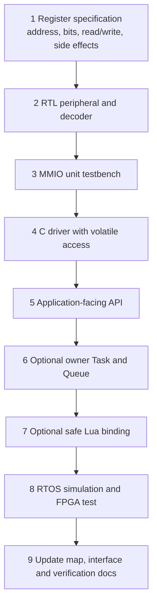

建議遵守以下接口規則：

- register規格先決定 address、bit field、access width、side effect與error；
- RTL對非法操作回明確error，不讓它誤落到DDR；
- C driver集中保存magic address，application不要到處硬寫指標；
- 若一次操作跨多個register，由driver定義順序與barrier；
- 多 Task共享狀態時，優先由單一service Task擁有硬體，其他Task用Queue請求；
- ISR只做取資料、清pending與通知Task；
- Lua只暴露範圍受控的binding，不提供任意address讀寫；
- 同時驗證直接MMIO、C driver、RTOS dataflow和實板訊號。

---

## 20. 常見誤解

### 「我呼叫 FreeRTOS API，硬體會解析 API 名稱嗎？」

不會。API已在compile/link階段變成machine code。硬體只執行 instruction與transaction。

### 「`xQueueSend()` 是把資料送到 FPGA Queue 嗎？」

不是。Queue是FreeRTOS在RAM／DDR裡管理的軟體資料結構。

### 「`vTaskDelay(100)` 是設定一顆100 ms硬體timer嗎？」

不是。它登記wake tick，所有Task共用週期性的machine timer tick。

### 「沒有使用FreeRTOS API的普通C function能執行嗎？」

可以。它仍是Task call graph中的普通machine code，只是不會因此自動變成另一個Task，也不會主動Block／同步。

### 「Lua在runtime產生新的RISC-V machine code嗎？」

目前不會。Lua VM解讀runtime產生的Lua VM instructions，真正跑在CPU上的仍是預先編入`.mem`的VM、binding、FreeRTOS與driver machine code。

### 「CPU既然都會用到，Kernel API和driver API有什麼差？」

兩者都由CPU執行；差別是最後操作的對象。Kernel API主要操作RAM裡的OS資料結構，driver API直接操作特定位址的硬體register。

---

## 21. 閱讀與實作入口

| 想繼續理解什麼 | 下一份文件 |
|---|---|
| CPU trap、CSR與`mcause` | [CSR_EXCEPTION_INTERRUPT.md](../01-architecture/CSR_EXCEPTION_INTERRUPT.md) |
| MMIO transaction與fault | [MMIO.md](../02-memory-io/MMIO.md) |
| UART register與RX buffer | [UART.md](../02-memory-io/UART.md) |
| Tick、delay與software timer | [TICK_INTERRUPT.md](TICK_INTERRUPT.md) |
| Context save／restore | [CONTEXT_SWITCH.md](CONTEXT_SWITCH.md) |
| Queue、Task state與priority | [TASK_QUEUE.md](TASK_QUEUE.md) |
| Application如何組合Task | [APPLICATION_RTOS_INTERACTION.md](../05-applications/APPLICATION_RTOS_INTERACTION.md) |
| Lua binding | [LUA_FREERTOS_BRIDGE.md](../05-applications/LUA_FREERTOS_BRIDGE.md) |
| 效能counter register | [PERFORMANCE_COUNTER_REGISTERS.md](../02-memory-io/PERFORMANCE_COUNTER_REGISTERS.md) |
| 實際驗證策略 | [VERIFICATION_PLAN.md](../06-verification/VERIFICATION_PLAN.md) |

建議第一次閱讀順序：本文件第1～6節 → 第7～10節的端到端例子 → 依你要修改的功能閱讀第12～19節。
