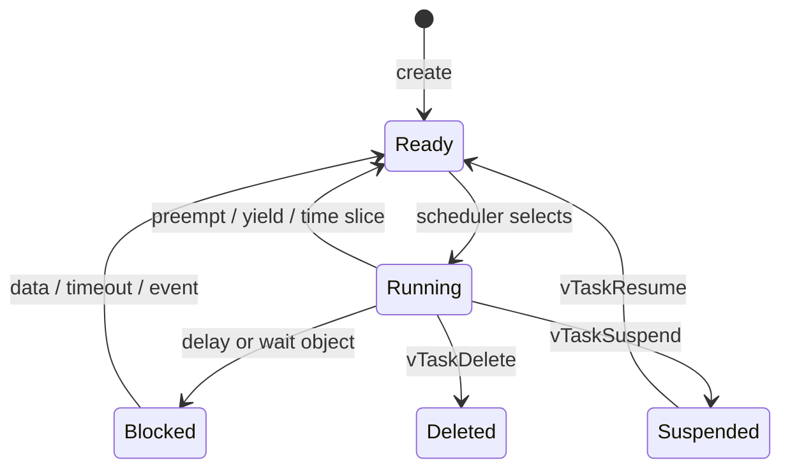
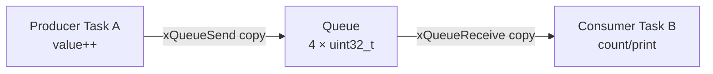
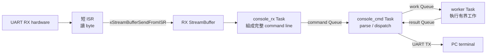
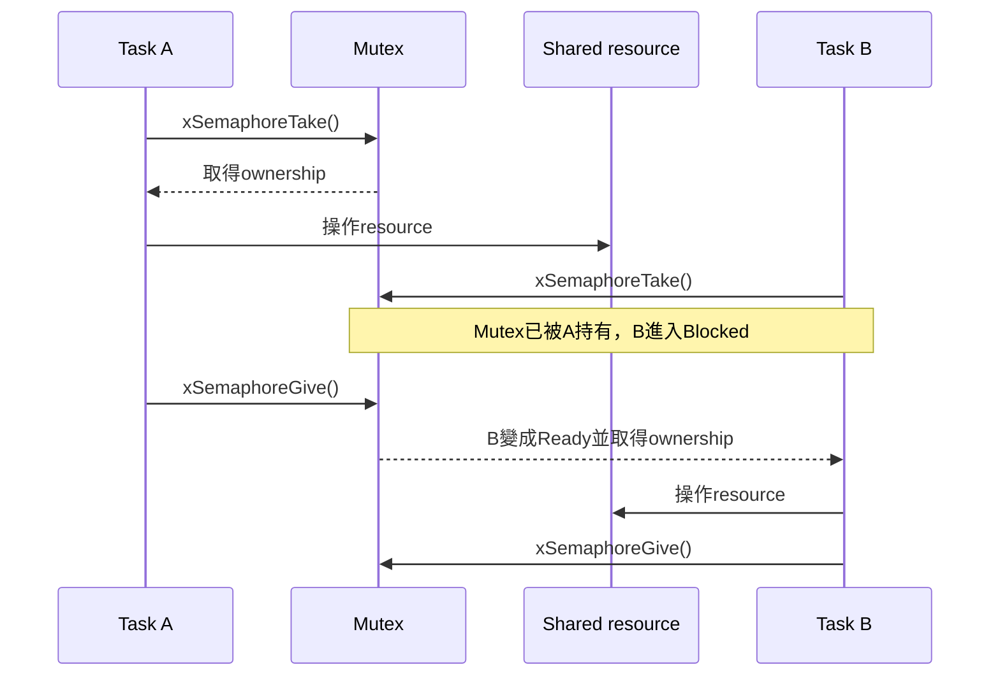

# Task、排程與 Queue

本文件用目前 `smoke`、`console`、`platform` application說明FreeRTOS Task與Queue。重點是理解：Task是可被排程的執行單位；Queue是kernel管理的資料容器與同步點，Queue本身不是Task。

## 1. Task是什麼

一個Task至少包含：

- Task function；
- 自己的stack；
- TCB（Task Control Block）；
- priority；
- state與list links；
- notification、timeout與runtime統計等metadata。

典型Task：

```c
static void worker_task(void *arg)
{
    (void)arg;
    for (;;) {
        /* 等事件、處理工作、再次等待 */
    }
}
```

Task function通常是無限loop。有限工作完成時呼叫 `vTaskDelete(NULL)`，不要直接return。

## 2. 單核心上的Task state



| State | 意義 |
|---|---|
| Running | 目前正在CPU上執行；單核心只有一個 |
| Ready | 可以執行，等待scheduler選取 |
| Blocked | 等Queue、Semaphore、delay、notification等，不消耗CPU |
| Suspended | 必須明確resume，不靠timeout自動ready |
| Deleted | 等待Idle Task回收dynamic resources |

## 3. Priority

目前 `configMAX_PRIORITIES=5`，有效priority為0..4，數字越大越優先。

Console profile：

| Task | Priority | 作用 |
|---|---:|---|
| `console_rx` | 3 | 從UART StreamBuffer組成command line |
| `console_cmd` | 2 | parse command、送工作 |
| `worker` | 1 | 執行Queue傳來的work request |
| `heartbeat` | 1 | 每1000 ticks更新liveness |
| Timer Task | 4 | software timer callbacks |
| Idle Task | 0 | idle與deleted Task cleanup |

高priority不是「更快的CPU」，而是ready時優先獲得CPU。高priority Task如果永不block，會讓低priority Taskstarve。

## 4. Delay與block

```c
vTaskDelay(pdMS_TO_TICKS(10));
```

會把目前Task放入delayed list，CPU去執行其他ready Task。它不是busy-wait。

```c
while (hardware_not_ready()) {
}
```

才是busy-wait，會一直占用目前priority。除非等待極短且硬體沒有interrupt/event機制，否則應優先用blocking API。

## 5. Queue保存的是item副本

建立：

```c
QueueHandle_t queue = xQueueCreate(4, sizeof(uint32_t));
```

送出：

```c
uint32_t value = 123;
xQueueSend(queue, &value, portMAX_DELAY);
```

FreeRTOS把 `sizeof(uint32_t)` bytes複製到Queue storage；之後修改local `value`不會改變Queue內的副本。

接收：

```c
uint32_t received;
xQueueReceive(queue, &received, portMAX_DELAY);
```

又把item複製到receiver buffer並從Queue移除。

## 6. Queue full／empty

| 操作 | 條件 | block time = 0 | block time > 0 |
|---|---|---|---|
| Send | Queue full | 立即`errQUEUE_FULL` | Task blocked直到有空位或timeout |
| Receive | Queue empty | 立即`errQUEUE_EMPTY` | Task blocked直到有資料或timeout |

`portMAX_DELAY`在目前設定可作無限等待。Blocking Queue API會讓scheduler執行其他Task，不會輪詢Queue浪費CPU。

## 7. Static Queue

Smoke使用：

```c
#define QUEUE_LENGTH 4u

static StaticQueue_t queue_tcb;
static uint32_t queue_storage[QUEUE_LENGTH];
static QueueHandle_t queue;

queue = xQueueCreateStatic(
    QUEUE_LENGTH,
    sizeof(uint32_t),
    (uint8_t *)queue_storage,
    &queue_tcb
);
```

需要兩種storage：

- `StaticQueue_t`：kernel control structure；
- `queue_storage`：實際item bytes，至少 `length × item_size`。

兩者生命週期必須比Queue長，通常宣告成global/static。不可把函式local array傳入後return。

## 8. Smoke producer/consumer

[`OS/rtos/src/main.c`](../../OS/rtos/src/main.c) 建立兩個同priority 2 Task與length 4的`uint32_t` Queue：



Producer每次：

1. 增加value；
2. Queue send；
3. 記錄／印出；
4. delay 2 ticks。

Consumer：

1. Queue empty時blocked；
2. 收到value後計數／印出；
3. 收滿三筆第一次印 `RTOS_SMOKE_PASS`；
4. delay 1 tick。

這同時驗證Task切換、tick delay、Queue copy與block/unblock。

## 9. Console的三段Queue pipeline

Console使用三個Queue：



每個箭頭代表資料複製或喚醒，不代表新增一個 Task。ISR、三個 Task 與 Queue／StreamBuffer 是不同角色；Queue 本身不會執行程式。

輸入 `work 256` 時：

1. `console_cmd`建立`WorkRequest_t`；
2. nonblocking送到`work_queue`；
3. `worker`從Queue解除blocked並執行workload；
4. worker把`WorkResult_t`送到`result_queue`；
5. command Task等待result並輸出。

這就是「透過Queue交給worker Task」：command Task沒有直接執行那段workload，而是傳遞一份request資料並等待另一個Task的result。

## 10. 傳struct或pointer

### 傳struct副本

```c
typedef struct {
    uint32_t id;
    uint32_t value;
} Message;

QueueHandle_t q = xQueueCreate(8, sizeof(Message));
```

最容易管理ownership，適合小型固定資料。

### 傳pointer

```c
QueueHandle_t q = xQueueCreate(8, sizeof(Message *));
```

Queue只複製pointer，不複製pointed data。必須先定義：

- buffer由誰配置；
- send後producer能否修改；
- receiver何時釋放；
- timeout/send failure時誰回收；
- pointer指向的物件是否仍有效。

不要把指向producer local stack變數的pointer送給稍後執行的Task。

## 11. Queue與shared variable

Queue優點：

- 資料與同步一起處理；
- empty/full可block；
- kernel處理Task wakeup與priority；
- item copy建立明確ownership boundary。

單純global variable：

- 可能需要mutex/critical section；
- receiver不知道何時有新資料；
- 多筆更新可能覆蓋；
- 容易有data race。

若需求只是「通知發生一次」而不需排隊多份資料，Task notification或binary semaphore可能更輕量。

## 12. Queue、Semaphore、Mutex差異

| Object | 主要用途 | 是否攜帶資料 | 特性 |
|---|---|---:|---|
| Queue | 傳遞多筆固定大小message | 是 | FIFO、copy semantics |
| Binary semaphore | event／完成通知 | 否 | 沒有mutex ownership |
| Counting semaphore | 計數資源／多次event | count | 有上限count |
| Mutex | 保護shared resource | 否 | ownership + priority inheritance |
| Recursive mutex | 同一Task可重複take | 否 | 必須對稱give相同次數 |
| Task notification | 一對一輕量通知／32-bit value | 可 | 每Task內建，成本低 |

不要用mutex作ISR→Task通知；ISR不能take/give一般mutex。ISR event應使用`...FromISR()` queue/semaphore/notification/stream API。

### 12.1 「Task互斥使用共享resource」的完整意思

`resource`（資源）不是特定的FreeRTOS object，而是「兩個以上Tasks都可能讀寫或操作的同一個東西」。常見例子：

| Shared resource | 為什麼可能衝突 |
|---|---|
| UART TX hardware | 兩個Tasks的字串可能在byte邊界交錯 |
| VGA framebuffer | 一個Task改畫面時，另一個Task可能同時改相同pixel/region |
| SPI／I2C controller | 一筆transaction尚未完成，另一個Task又改command/register |
| 全域counter／struct | context switch可能發生在多條load、compute、store之間 |
| 共用software buffer | 一個Task正在更新length/data，另一個Task同時讀取 |

「互斥」是 Mutual Exclusion：同一時間只允許一個Task進入操作該resource的critical region。Mutex可以想成只有一把鑰匙：



Task B等待Mutex時，不是整顆CPU停住。只有Task B因等待這個Mutex而Blocked；Task A與其他不需要這把Mutex的Ready Tasks仍可執行。

### 12.2 `counter++` 為什麼也可能需要保護

一行C：

```c
shared_counter++;
```

通常會編譯成多個動作：

```text
load shared_counter
add 1
store shared_counter
```

假設初值為5，可能發生：

```text
Task A load得到5
  ↓ context switch
Task B load得到5、加1、store 6
  ↓ context switch
Task A使用先前的5加1、store 6
```

兩次遞增後正確答案應為7，結果卻是6。這是race condition（競爭條件）：結果取決於不可預測的執行交錯。

用Mutex保護整個read-modify-write：

```c
if (xSemaphoreTake(counter_mutex, portMAX_DELAY) == pdTRUE) {
    shared_counter++;
    xSemaphoreGive(counter_mutex);
}
```

此時另一個Task必須等前一個Task完成load、add、store並歸還Mutex，才可執行自己的遞增。

### 12.3 UART字串交錯例子

目前`rtos_uart_write()`會逐byte polling送出，Driver沒有自動替完整字串取得Mutex。若兩個Tasks同時執行：

```c
/* Task A */
rtos_uart_write("HELLO");

/* Task B */
rtos_uart_write("12345");
```

每一個byte仍可能正確送出，但Scheduler可以在字元之間切換Task，PC可能看到：

```text
H1E2L3L4O5
```

如果需求是「每一整串訊息不可被插入」，Mutex必須包住完整訊息，而不是每個byte各拿一次鎖：

```c
if (xSemaphoreTake(uart_mutex, portMAX_DELAY) == pdTRUE) {
    rtos_uart_write("HELLO\n");
    xSemaphoreGive(uart_mutex);
}
```

### 12.4 建立與使用static Mutex

```c
#include "FreeRTOS.h"
#include "semphr.h"

static StaticSemaphore_t uart_mutex_storage;
static SemaphoreHandle_t uart_mutex;

static int create_uart_mutex(void)
{
    uart_mutex = xSemaphoreCreateMutexStatic(
        &uart_mutex_storage
    );

    return uart_mutex != NULL;
}
```

一般Task使用模式：

```c
static void print_complete_message(const char *text)
{
    if (xSemaphoreTake(
            uart_mutex,
            pdMS_TO_TICKS(100)) != pdTRUE) {
        /* timeout policy：計數、稍後重試或回報錯誤。 */
        return;
    }

    rtos_uart_write(text);
    rtos_uart_write("\n");

    xSemaphoreGive(uart_mutex);
}
```

參數與結果：

| 呼叫 | 意義 |
|---|---|
| `xSemaphoreTake(uart_mutex, 0)` | 只嘗試一次，拿不到立即失敗 |
| `xSemaphoreTake(uart_mutex, pdMS_TO_TICKS(100))` | 最多讓caller Task等待約100 ms |
| `xSemaphoreTake(uart_mutex, portMAX_DELAY)` | 一直等到取得Mutex |
| return `pdTRUE` | 已取得ownership，可以進入protected region |
| return `pdFALSE` | timeout內未取得，不可操作被保護resource |
| `xSemaphoreGive(uart_mutex)` | owner完成操作並歸還ownership |

取得Mutex的Task必須在所有正常與錯誤return path歸還它。不要取得後直接`return`、進入無限loop或忘記`xSemaphoreGive()`，否則其他Tasks會一直無法取得。

### 12.5 Mutex ownership與priority inheritance

Mutex不是「發生一次事件」的通知。它具有ownership：

```text
Task A成功take Mutex
  → Task A是owner
  → 必須由Task A give
```

若高priority Task等待低priority Task持有的Mutex，FreeRTOS可以暫時提升owner priority，讓低priority owner較快完成並釋放Mutex；這是priority inheritance。它能減少某些priority inversion，但不能修復忘記give、lock-order cycle或無限blocking等設計錯誤。

### 12.6 哪些資料通常不需要Mutex

- 只存在於某個Task stack、沒有把pointer分享出去的local variable。
- 建立後不再修改的read-only資料。
- 只有唯一Task會修改的state或硬體。
- 已經由Queue複製給consumer、ownership邊界清楚的item。
- 能以單一硬體atomic operation完成，而且已明確分析memory ordering的狀態。

不要因為變數是global就一律加Mutex，也不要因為是一行C就假設atomic。先列出所有reader/writer與可能的context switch／ISR交錯，再決定同步方式。

### 12.7 Mutex與single-owner Task怎麼選

少數Tasks偶爾需要執行短而完整的共享操作時，Mutex很直接：

```text
Task A ─┐
        ├─ take Mutex → shared hardware → give Mutex
Task B ─┘
```

若resource有複雜transaction、輸出排隊、ISR事件或多種client，通常改成single-owner service Task更清楚：

```text
Task A ─request─┐
                ├─> Queue ─> UART/SPI service Task ─> hardware
Task B ─request─┘
```

只有service Task直接操作硬體，其他Tasks用Queue傳request。這能把driver state、transaction順序與錯誤處理集中在一處，也避免多個caller長時間持有Mutex。

### 12.8 Mutex不能用於ISR

ISR不是Task owner，也不能等待Mutex或使用priority inheritance，因此不可：

```c
/* ISR中錯誤。 */
xSemaphoreTake(mutex, portMAX_DELAY);
xSemaphoreGiveFromISR(mutex, &higher);
```

ISR要通知Task時，使用Queue、Task notification、binary/counting semaphore或StreamBuffer的`FromISR`版本；再讓被喚醒的Task取得Mutex或由single-owner Task操作resource。完整caller-context與ISR資料流見 [ISR_TASK_API_BOUNDARY.md](ISR_TASK_API_BOUNDARY.md)。

Mutex的更多可複製API骨架見 [FREERTOS_API_EXAMPLES.md](FREERTOS_API_EXAMPLES.md)，每個參數見 [RTOS_PLATFORM_API_PARAMETER_GUIDE.md](../05-applications/RTOS_PLATFORM_API_PARAMETER_GUIDE.md)。

## 13. ISR與Queue

本節假設已理解caller context；完整的UART實例、Task接收位置、錯用API後果與新Driver ISR步驟見 [ISR_TASK_API_BOUNDARY.md](ISR_TASK_API_BOUNDARY.md)。

ISR不能呼叫會block的一般API：

```c
void irq_handler(void)
{
    BaseType_t higher_priority_task_woken = pdFALSE;
    uint32_t item = read_device();

    xQueueSendFromISR(queue, &item, &higher_priority_task_woken);
    portYIELD_FROM_ISR(higher_priority_task_woken);
}
```

目前UART driver使用相同pattern，但object是StreamBuffer：`xStreamBufferSendFromISR()`。如果wake了priority 3的`console_rx`，ISR退出時可直接切到它。

ISR API的最後一個flag不是「API是否成功」；它表示有沒有喚醒一個應立刻執行的較高priority Task。API自己的return value仍需另外檢查。

## 14. 不要在critical section內block

錯誤概念：

```c
taskENTER_CRITICAL();
xQueueReceive(queue, &item, portMAX_DELAY); /* 不可這樣設計 */
taskEXIT_CRITICAL();
```

Critical section關閉interrupt；blocking又需要tick／ISR／scheduler讓條件發生，可能造成deadlock或長時間interrupt latency。Queue本身已提供kernel同步，不需再包critical。

Smoke只有在短段UART log周圍使用critical，以避免兩個Task字串互相交錯；Queue send/receive在critical之外。

## 15. Queue set

Queue set讓一個Task等待多個Queue/Semaphore中的任一個。Platform profile把completion counting semaphore加入set：

```text
worker A completion --+
                     +--> completion_set --> coordinator
worker B completion --+
```

一般步驟：

1. `xQueueCreateSet(total_member_capacity)`；
2. `xQueueAddToSet(member, set)`；
3. `xQueueSelectFromSet(set, timeout)`；
4. 對返回的member呼叫相對應receive/take。

Set capacity需要至少涵蓋所有member可能同時pending的總數，否則可能遺失set event。

## 16. Task建立失敗與scheduler return

Static create理論上只要buffers與參數有效就可成功，但仍應檢查NULL。Dynamic `xTaskCreate()` 可能因heap不足回`errCOULD_NOT_ALLOCATE_REQUIRED_MEMORY`。

`vTaskStartScheduler()` 成功後不應返回；返回通常表示Idle/Timer Task建立失敗或port無法啟動。專案各profile都把scheduler return視為fatal。

## 17. 設計建議

- Task以「等待事件→短處理→再次等待」為主。
- 用priority表達deadline/latency，不要把所有Task都設最高。
- Queue item盡量小且固定；大型buffer可傳pointer但必須定義ownership。
- 對可能full/empty的Queue決定清楚策略：block、drop、overwrite或error。
- UART log是blocking polling，避免多Task同時大量輸出。
- 使用`uxQueueMessagesWaiting()`作diagnostic可以，但不要先check再假設下一步一定成功；狀態可能改變。
- 週期Task用`xTaskDelayUntil()`；event Task用blocking Queue/notification。
